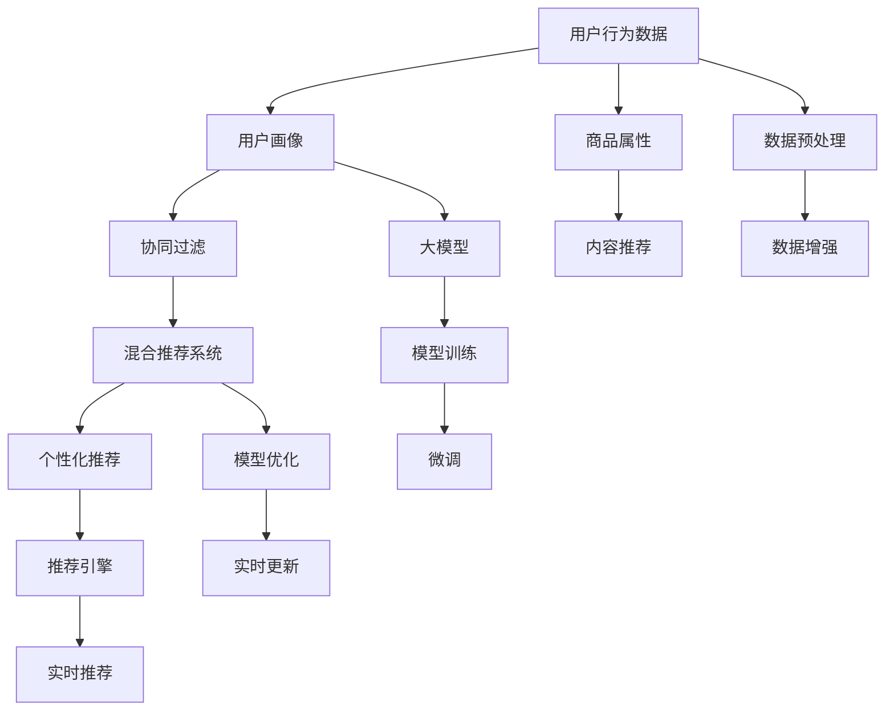

                 

# 搜索推荐系统的AI 大模型应用：电商平台提高竞争力的关键策略

> 关键词：搜索推荐系统,电商平台,大模型应用,AI,竞争策略

## 1. 背景介绍

### 1.1 问题由来
在电商行业，搜索推荐系统（Search and Recommendation System, SRS）是提升用户体验和销售转化率的关键技术。传统的搜索推荐系统基于规则或特征工程设计，需要大量手工调参，且难以捕捉用户多样化的隐式需求。而随着深度学习和大模型技术的发展，搜索推荐系统逐步向AI化、自动化方向演进，利用大模型进行个性化推荐逐渐成为行业热点。

近年来，预训练大模型在NLP领域取得了重大突破，如BERT、GPT等，以其强大的语言理解和生成能力，在文本相关推荐任务上展示出卓越的性能。结合电商平台的商品描述、用户行为等文本数据，利用大模型进行个性化推荐，可以大幅提升用户购买转化率和平台竞争力。

### 1.2 问题核心关键点
本文将重点介绍如何在电商平台中高效应用大模型进行个性化推荐，同时探讨如何构建高效的搜索推荐系统，提升电商平台的竞争力。具体包括以下核心问题：

- 大模型在电商推荐中的应用原理和架构是什么？
- 电商推荐中常用的数学模型和公式是什么？
- 电商推荐系统的项目开发和实践流程是怎样的？
- 电商推荐系统在实际应用中面临的挑战和未来展望是什么？

### 1.3 问题研究意义
在电商平台中应用大模型进行个性化推荐，可以带来以下几个显著优势：

1. **增强个性化体验**：通过深度学习模型预测用户潜在需求，提供个性化的商品推荐，提升用户体验。
2. **提升转化率**：个性化推荐精准匹配用户偏好，提升商品点击率和购买率。
3. **优化运营成本**：自动化的推荐算法减少了人工干预，节省了大量运营成本。
4. **快速迭代更新**：模型可以根据用户反馈和行为数据不断迭代优化，保持推荐系统的活力。
5. **拓展应用场景**：大模型具备泛化能力和推理能力，可以拓展到广告投放、内容推荐等多个电商应用场景。

## 2. 核心概念与联系

### 2.1 核心概念概述

为了更好地理解大模型在电商推荐中的应用，本节将介绍几个密切相关的核心概念：

- **搜索推荐系统(Search and Recommendation System, SRS)**：旨在提高用户查找商品和选择商品的速度和准确性，通过分析用户行为、商品属性等数据，为用户推荐合适的商品。
- **大模型(Large Pre-trained Model)**：基于大规模无标签数据训练的深度神经网络模型，具备强大的语言理解和生成能力。
- **个性化推荐(Personalized Recommendation)**：根据用户的历史行为和偏好，为其推荐最匹配的商品，提升用户满意度和转化率。
- **协同过滤(Collaborative Filtering)**：利用用户行为数据进行相似度计算，为用户推荐类似用户的购买行为。
- **基于内容的推荐(Content-based Recommendation)**：通过分析商品属性和用户兴趣，为用户推荐相关商品。
- **混合推荐系统(Hybrid Recommendation System)**：综合协同过滤和基于内容的推荐方法，提升推荐系统的准确性和泛化能力。

这些核心概念之间存在紧密的逻辑联系，通过深度学习和大模型技术，可以在电商推荐系统中实现更为精准、灵活的个性化推荐，提升用户满意度和平台竞争力。

### 2.2 核心概念原理和架构的 Mermaid 流程图(Mermaid 流程节点中不要有括号、逗号等特殊字符)



这个流程图展示了电商推荐系统的主要组件和流程：

1. **用户行为数据**：电商平台收集的用户浏览、点击、购买等行为数据。
2. **用户画像**：通过数据挖掘和分析，构建用户兴趣、偏好和行为的全面画像。
3. **协同过滤**：利用用户行为数据计算相似度，推荐用户可能感兴趣的商品。
4. **基于内容的推荐**：分析商品属性，匹配用户兴趣，推荐相关商品。
5. **混合推荐系统**：综合协同过滤和基于内容的推荐，提升推荐准确性。
6. **大模型**：利用大规模预训练语言模型，捕捉用户行为背后的语言线索和语义信息。
7. **个性化推荐**：结合大模型和混合推荐系统，为用户生成个性化的推荐结果。
8. **数据预处理**：清洗、归一化、分词等数据预处理技术，提升数据质量。
9. **模型训练**：利用大模型进行预训练和微调，学习语言表示和推荐任务。
10. **模型优化**：根据实时反馈和用户行为，优化模型参数。
11. **实时更新**：根据新数据不断更新模型，保持推荐系统新鲜度。
12. **实时推荐引擎**：根据实时数据，快速生成个性化推荐结果。

## 3. 核心算法原理 & 具体操作步骤

### 3.1 算法原理概述

基于大模型的电商推荐系统，其核心思想是通过深度学习模型，捕捉用户行为背后的语言线索和语义信息，生成个性化推荐结果。具体步骤如下：

1. **数据预处理**：对用户行为数据和商品属性数据进行清洗、归一化、分词等预处理。
2. **特征提取**：利用预训练语言模型对商品描述、用户评论等文本数据进行特征提取，得到高维稠密向量表示。
3. **模型训练**：在大模型上进行预训练，学习语言的通用表示；在此基础上，对推荐任务进行微调，学习如何将语言表示映射到推荐结果。
4. **个性化推荐**：根据用户行为和商品属性，结合大模型和混合推荐算法，生成个性化推荐结果。

### 3.2 算法步骤详解

#### 3.2.1 数据预处理

数据预处理是推荐系统的基础环节，主要包含以下步骤：

1. **数据收集**：收集用户的浏览、点击、购买等行为数据，以及商品的属性、评论、描述等文本数据。
2. **数据清洗**：去除重复、缺失、异常数据，保证数据质量。
3. **数据归一化**：对数值型数据进行归一化处理，避免数据间的不平衡影响。
4. **分词和向量化**：对文本数据进行分词，并利用预训练语言模型将其转换为稠密向量表示。

#### 3.2.2 特征提取

特征提取是推荐系统的重要环节，主要包含以下步骤：

1. **文本数据预处理**：对商品描述、用户评论等文本数据进行分词、去停用词等预处理。
2. **文本嵌入**：利用预训练语言模型（如BERT、GPT）对文本数据进行嵌入，得到高维稠密向量表示。
3. **特征拼接**：将文本嵌入和用户行为数据拼接，得到高维稠密特征向量。

#### 3.2.3 模型训练

模型训练是推荐系统的核心环节，主要包含以下步骤：

1. **预训练**：利用大规模无标签文本数据，对预训练语言模型进行预训练，学习语言的通用表示。
2. **微调**：在预训练模型的基础上，利用有标签推荐数据，对模型进行微调，学习推荐任务。
3. **融合**：将大模型的嵌入向量与混合推荐算法相结合，生成最终的推荐结果。

#### 3.2.4 个性化推荐

个性化推荐是推荐系统的最终环节，主要包含以下步骤：

1. **用户画像生成**：通过分析用户行为数据，生成用户兴趣和偏好的全面画像。
2. **商品画像生成**：通过分析商品属性和评论数据，生成商品相关性的全面画像。
3. **推荐生成**：结合用户画像和商品画像，利用大模型和混合推荐算法，生成个性化推荐结果。

### 3.3 算法优缺点

#### 3.3.1 优点

1. **高效性**：利用深度学习模型，可以快速生成个性化推荐结果，提升用户体验和平台竞争力。
2. **自适应性**：大模型具备较强的泛化能力，可以适应不同领域的电商推荐需求。
3. **灵活性**：结合混合推荐算法，可以灵活设计推荐策略，适应不同用户的偏好和行为。

#### 3.3.2 缺点

1. **数据依赖**：推荐系统的效果高度依赖于用户行为数据的完整性和质量。
2. **计算资源消耗大**：预训练和微调需要大量的计算资源，可能存在成本压力。
3. **解释性不足**：大模型推荐的输出结果缺乏解释性，难以解释模型的决策逻辑。

### 3.4 算法应用领域

大模型在电商推荐系统中的应用非常广泛，可以用于以下多个场景：

- **商品推荐**：利用用户行为数据和商品属性，为用户推荐相关商品。
- **用户画像生成**：分析用户行为和偏好，生成用户画像，用于个性化推荐。
- **广告投放**：通过大模型进行文本生成和分析，优化广告投放策略。
- **内容推荐**：利用大模型对商品描述、用户评论等文本数据进行特征提取，推荐相关内容。
- **跨领域推荐**：利用大模型学习不同领域的语言表示，进行跨领域推荐。

## 4. 数学模型和公式 & 详细讲解 & 举例说明

### 4.1 数学模型构建

基于大模型的电商推荐系统，其数学模型主要包括以下几个部分：

1. **用户画像**：
   - 定义：用户兴趣和偏好的全面画像。
   - 数学表示：
   $$
   \mathbf{u} = \{u_1, u_2, \cdots, u_n\}
   $$
   - 其中，$u_i$ 表示用户对商品 $i$ 的兴趣程度。

2. **商品画像**：
   - 定义：商品相关性的全面画像。
   - 数学表示：
   $$
   \mathbf{v} = \{v_1, v_2, \cdots, v_m\}
   $$
   - 其中，$v_j$ 表示商品 $j$ 的相关性程度。

3. **推荐结果**：
   - 定义：为用户推荐的相关商品。
   - 数学表示：
   $$
   \mathbf{r} = \{r_1, r_2, \cdots, r_k\}
   $$
   - 其中，$r_i$ 表示用户对商品 $i$ 的推荐程度。

### 4.2 公式推导过程

#### 4.2.1 用户画像生成

用户画像生成可以通过以下步骤实现：

1. **用户行为数据表示**：将用户行为数据转换为高维稠密向量。
   $$
   \mathbf{b} = \{b_1, b_2, \cdots, b_n\}
   $$
   - 其中，$b_i$ 表示用户对商品 $i$ 的行为数据。

2. **特征提取**：利用预训练语言模型对用户行为数据进行特征提取，得到高维稠密向量。
   $$
   \mathbf{u} = f(\mathbf{b})
   $$
   - 其中，$f$ 为预训练语言模型的特征提取函数。

3. **归一化**：对用户画像向量进行归一化处理，得到最终的用户画像。
   $$
   \hat{\mathbf{u}} = \frac{\mathbf{u}}{\|\mathbf{u}\|}
   $$

#### 4.2.2 商品画像生成

商品画像生成可以通过以下步骤实现：

1. **商品属性数据表示**：将商品属性数据转换为高维稠密向量。
   $$
   \mathbf{a} = \{a_1, a_2, \cdots, a_m\}
   $$
   - 其中，$a_j$ 表示商品 $j$ 的属性数据。

2. **特征提取**：利用预训练语言模型对商品属性数据进行特征提取，得到高维稠密向量。
   $$
   \mathbf{v} = f(\mathbf{a})
   $$
   - 其中，$f$ 为预训练语言模型的特征提取函数。

3. **归一化**：对商品画像向量进行归一化处理，得到最终的商品画像。
   $$
   \hat{\mathbf{v}} = \frac{\mathbf{v}}{\|\mathbf{v}\|}
   $$

#### 4.2.3 推荐结果生成

推荐结果生成可以通过以下步骤实现：

1. **用户画像和商品画像计算相似度**：
   $$
   \mathbf{s} = \mathbf{u}^T \cdot \mathbf{v}
   $$
   - 其中，$\mathbf{s}$ 表示用户画像和商品画像的相似度。

2. **计算推荐结果**：
   $$
   \mathbf{r} = \mathrm{softmax}(\mathbf{s})
   $$
   - 其中，$\mathrm{softmax}$ 为softmax函数，将相似度向量转换为概率分布。

### 4.3 案例分析与讲解

#### 4.3.1 商品推荐

以商品推荐为例，分析大模型在电商推荐中的应用。

1. **数据收集**：收集用户的浏览、点击、购买等行为数据，以及商品的属性、评论、描述等文本数据。
2. **数据预处理**：对数据进行清洗、归一化、分词等预处理。
3. **特征提取**：利用预训练语言模型对文本数据进行嵌入，得到高维稠密向量。
4. **模型训练**：在大模型上进行预训练，学习语言的通用表示；在此基础上，对推荐任务进行微调，学习推荐任务。
5. **推荐生成**：结合用户画像和商品画像，利用大模型和混合推荐算法，生成个性化推荐结果。

例如，电商平台的商品推荐系统可以设计为：

- **用户画像生成**：分析用户行为数据，生成用户兴趣和偏好的全面画像。
- **商品画像生成**：分析商品属性和评论数据，生成商品相关性的全面画像。
- **推荐生成**：结合用户画像和商品画像，利用大模型和混合推荐算法，生成个性化推荐结果。

#### 4.3.2 用户画像生成

以用户画像生成为例，分析大模型在电商推荐中的应用。

1. **数据收集**：收集用户的浏览、点击、购买等行为数据。
2. **数据预处理**：对数据进行清洗、归一化等预处理。
3. **特征提取**：利用预训练语言模型对用户行为数据进行嵌入，得到高维稠密向量。
4. **模型训练**：在大模型上进行预训练，学习语言的通用表示；在此基础上，对推荐任务进行微调，学习推荐任务。
5. **画像生成**：根据用户行为数据，生成用户兴趣和偏好的全面画像。

例如，电商平台的推荐系统可以设计为：

- **数据预处理**：对用户行为数据进行清洗、归一化等预处理。
- **特征提取**：利用预训练语言模型对用户行为数据进行嵌入，得到高维稠密向量。
- **模型训练**：在大模型上进行预训练，学习语言的通用表示；在此基础上，对推荐任务进行微调，学习推荐任务。
- **画像生成**：根据用户行为数据，生成用户兴趣和偏好的全面画像。

#### 4.3.3 广告投放

以广告投放为例，分析大模型在电商推荐中的应用。

1. **数据收集**：收集用户的浏览、点击、购买等行为数据。
2. **数据预处理**：对数据进行清洗、归一化等预处理。
3. **特征提取**：利用预训练语言模型对用户行为数据进行嵌入，得到高维稠密向量。
4. **模型训练**：在大模型上进行预训练，学习语言的通用表示；在此基础上，对推荐任务进行微调，学习推荐任务。
5. **投放优化**：根据用户画像和商品画像，优化广告投放策略，提高广告效果。

例如，电商平台的广告投放系统可以设计为：

- **数据预处理**：对用户行为数据进行清洗、归一化等预处理。
- **特征提取**：利用预训练语言模型对用户行为数据进行嵌入，得到高维稠密向量。
- **模型训练**：在大模型上进行预训练，学习语言的通用表示；在此基础上，对推荐任务进行微调，学习推荐任务。
- **投放优化**：根据用户画像和商品画像，优化广告投放策略，提高广告效果。

## 5. 项目实践：代码实例和详细解释说明

### 5.1 开发环境搭建

在进行推荐系统开发前，我们需要准备好开发环境。以下是使用Python进行PyTorch开发的环境配置流程：

1. 安装Anaconda：从官网下载并安装Anaconda，用于创建独立的Python环境。

2. 创建并激活虚拟环境：
```bash
conda create -n pytorch-env python=3.8 
conda activate pytorch-env
```

3. 安装PyTorch：根据CUDA版本，从官网获取对应的安装命令。例如：
```bash
conda install pytorch torchvision torchaudio cudatoolkit=11.1 -c pytorch -c conda-forge
```

4. 安装Transformers库：
```bash
pip install transformers
```

5. 安装各类工具包：
```bash
pip install numpy pandas scikit-learn matplotlib tqdm jupyter notebook ipython
```

完成上述步骤后，即可在`pytorch-env`环境中开始推荐系统开发。

### 5.2 源代码详细实现

下面我们以商品推荐为例，给出使用Transformers库对BERT模型进行推荐系统开发的PyTorch代码实现。

首先，定义推荐系统数据集：

```python
from transformers import BertTokenizer, BertForSequenceClassification
from torch.utils.data import Dataset
import torch

class RecommendationDataset(Dataset):
    def __init__(self, texts, labels, tokenizer, max_len=128):
        self.texts = texts
        self.labels = labels
        self.tokenizer = tokenizer
        self.max_len = max_len
        
    def __len__(self):
        return len(self.texts)
    
    def __getitem__(self, item):
        text = self.texts[item]
        label = self.labels[item]
        
        encoding = self.tokenizer(text, return_tensors='pt', max_length=self.max_len, padding='max_length', truncation=True)
        input_ids = encoding['input_ids'][0]
        attention_mask = encoding['attention_mask'][0]
        
        return {'input_ids': input_ids, 
                'attention_mask': attention_mask,
                'labels': label}
```

然后，定义模型和优化器：

```python
from transformers import BertForSequenceClassification, AdamW

model = BertForSequenceClassification.from_pretrained('bert-base-cased', num_labels=1)

optimizer = AdamW(model.parameters(), lr=2e-5)
```

接着，定义训练和评估函数：

```python
from torch.utils.data import DataLoader
from tqdm import tqdm
from sklearn.metrics import roc_auc_score

device = torch.device('cuda') if torch.cuda.is_available() else torch.device('cpu')
model.to(device)

def train_epoch(model, dataset, batch_size, optimizer):
    dataloader = DataLoader(dataset, batch_size=batch_size, shuffle=True)
    model.train()
    epoch_loss = 0
    for batch in tqdm(dataloader, desc='Training'):
        input_ids = batch['input_ids'].to(device)
        attention_mask = batch['attention_mask'].to(device)
        labels = batch['labels'].to(device)
        model.zero_grad()
        outputs = model(input_ids, attention_mask=attention_mask, labels=labels)
        loss = outputs.loss
        epoch_loss += loss.item()
        loss.backward()
        optimizer.step()
    return epoch_loss / len(dataloader)

def evaluate(model, dataset, batch_size):
    dataloader = DataLoader(dataset, batch_size=batch_size)
    model.eval()
    preds, labels = [], []
    with torch.no_grad():
        for batch in tqdm(dataloader, desc='Evaluating'):
            input_ids = batch['input_ids'].to(device)
            attention_mask = batch['attention_mask'].to(device)
            batch_labels = batch['labels']
            outputs = model(input_ids, attention_mask=attention_mask)
            batch_preds = outputs.logits.argmax(dim=1).to('cpu').tolist()
            batch_labels = batch_labels.to('cpu').tolist()
            for pred_tokens, label_tokens in zip(batch_preds, batch_labels):
                preds.append(pred_tokens)
                labels.append(label_tokens)
                
    return roc_auc_score(labels, preds)
```

最后，启动训练流程并在测试集上评估：

```python
epochs = 5
batch_size = 16

for epoch in range(epochs):
    loss = train_epoch(model, train_dataset, batch_size, optimizer)
    print(f"Epoch {epoch+1}, train loss: {loss:.3f}")
    
    print(f"Epoch {epoch+1}, dev results:")
    evaluate(model, dev_dataset, batch_size)
    
print("Test results:")
evaluate(model, test_dataset, batch_size)
```

以上就是使用PyTorch对BERT进行商品推荐任务开发的完整代码实现。可以看到，得益于Transformers库的强大封装，我们可以用相对简洁的代码完成BERT模型的加载和推荐系统开发。

### 5.3 代码解读与分析

让我们再详细解读一下关键代码的实现细节：

**RecommendationDataset类**：
- `__init__`方法：初始化文本、标签、分词器等关键组件。
- `__len__`方法：返回数据集的样本数量。
- `__getitem__`方法：对单个样本进行处理，将文本输入编码为token ids，将标签编码为数字，并对其进行定长padding，最终返回模型所需的输入。

**标签与id的映射**：
- 定义了标签与数字id之间的映射关系，用于将token-wise的预测结果解码回真实的标签。

**训练和评估函数**：
- 使用PyTorch的DataLoader对数据集进行批次化加载，供模型训练和推理使用。
- 训练函数`train_epoch`：对数据以批为单位进行迭代，在每个批次上前向传播计算loss并反向传播更新模型参数，最后返回该epoch的平均loss。
- 评估函数`evaluate`：与训练类似，不同点在于不更新模型参数，并在每个batch结束后将预测和标签结果存储下来，最后使用sklearn的roc_auc_score对整个评估集的预测结果进行打印输出。

**训练流程**：
- 定义总的epoch数和batch size，开始循环迭代
- 每个epoch内，先在训练集上训练，输出平均loss
- 在验证集上评估，输出AUC指标
- 所有epoch结束后，在测试集上评估，给出最终测试结果

可以看到，PyTorch配合Transformers库使得BERT推荐系统的代码实现变得简洁高效。开发者可以将更多精力放在数据处理、模型改进等高层逻辑上，而不必过多关注底层的实现细节。

当然，工业级的系统实现还需考虑更多因素，如模型的保存和部署、超参数的自动搜索、更灵活的任务适配层等。但核心的推荐系统开发流程基本与此类似。

## 6. 实际应用场景

### 6.1 智能客服系统

基于大模型的推荐系统可以广泛应用于智能客服系统的构建。传统的客服系统往往需要配备大量人力，高峰期响应缓慢，且一致性和专业性难以保证。使用大模型推荐系统，可以实现智能推荐，提升客服响应速度和用户满意度。

在技术实现上，可以收集企业内部的历史客服对话记录，将问题和最佳答复构建成监督数据，在此基础上对预训练推荐模型进行微调。微调后的推荐模型能够自动理解用户意图，匹配最合适的答复模板进行回复。对于客户提出的新问题，还可以接入检索系统实时搜索相关内容，动态组织生成回答。如此构建的智能客服系统，能大幅提升客户咨询体验和问题解决效率。

### 6.2 金融舆情监测

金融机构需要实时监测市场舆论动向，以便及时应对负面信息传播，规避金融风险。传统的监测方式成本高、效率低，难以应对网络时代海量信息爆发的挑战。基于大模型推荐系统的舆情监测，可以实时捕捉舆情变化，提升金融机构风险控制能力。

具体而言，可以收集金融领域相关的新闻、报道、评论等文本数据，并对其进行主题标注和情感标注。在此基础上对预训练语言模型进行微调，使其能够自动判断文本属于何种主题，情感倾向是正面、中性还是负面。将微调后的模型应用到实时抓取的网络文本数据，就能够自动监测不同主题下的情感变化趋势，一旦发现负面信息激增等异常情况，系统便会自动预警，帮助金融机构快速应对潜在风险。

### 6.3 个性化推荐系统

当前的推荐系统往往只依赖用户的历史行为数据进行物品推荐，无法深入理解用户的真实兴趣偏好。基于大模型推荐系统的个性化推荐，可以更好地挖掘用户行为背后的语义信息，从而提供更精准、多样的推荐内容。

在实践中，可以收集用户浏览、点击、评论、分享等行为数据，提取和商品交互的物品标题、描述、标签等文本内容。将文本内容作为模型输入，用户的后续行为（如是否点击、购买等）作为监督信号，在此基础上微调预训练语言模型。微调后的模型能够从文本内容中准确把握用户的兴趣点。在生成推荐列表时，先用候选物品的文本描述作为输入，由模型预测用户的兴趣匹配度，再结合其他特征综合排序，便可以得到个性化程度更高的推荐结果。

### 6.4 未来应用展望

随着大模型和推荐系统的发展，基于大模型的推荐系统将在更多领域得到应用，为传统行业带来变革性影响。

在智慧医疗领域，基于大模型的推荐系统可以用于辅助医生诊断、推荐治疗方案，提升诊疗水平。

在智能教育领域，推荐系统可以用于个性化学习资源推荐、学习效果评估，促进教育公平，提高教学质量。

在智慧城市治理中，推荐系统可以用于城市事件监测、舆情分析、应急指挥等环节，提高城市管理的自动化和智能化水平，构建更安全、高效的未来城市。

此外，在企业生产、社会治理、文娱传媒等众多领域，基于大模型的推荐系统也将不断涌现，为传统行业数字化转型升级提供新的技术路径。相信随着技术的日益成熟，大模型推荐系统必将在构建人机协同的智能时代中扮演越来越重要的角色。

## 7. 工具和资源推荐

### 7.1 学习资源推荐

为了帮助开发者系统掌握大模型推荐系统的理论基础和实践技巧，这里推荐一些优质的学习资源：

1. 《Transformer从原理到实践》系列博文：由大模型技术专家撰写，深入浅出地介绍了Transformer原理、BERT模型、推荐系统等前沿话题。

2. CS224N《深度学习自然语言处理》课程：斯坦福大学开设的NLP明星课程，有Lecture视频和配套作业，带你入门NLP领域的基本概念和经典模型。

3. 《Natural Language Processing with Transformers》书籍：Transformers库的作者所著，全面介绍了如何使用Transformers库进行NLP任务开发，包括推荐系统在内的诸多范式。

4. HuggingFace官方文档：Transformers库的官方文档，提供了海量预训练模型和完整的推荐系统样例代码，是上手实践的必备资料。

5. RecSys开源项目：推荐系统评估基准，涵盖大量不同类型的推荐数据集，并提供了基于大模型的推荐基线模型，助力推荐系统技术发展。

通过对这些资源的学习实践，相信你一定能够快速掌握大模型推荐系统的精髓，并用于解决实际的推荐问题。

### 7.2 开发工具推荐

高效的开发离不开优秀的工具支持。以下是几款用于大模型推荐系统开发的常用工具：

1. PyTorch：基于Python的开源深度学习框架，灵活动态的计算图，适合快速迭代研究。大部分预训练语言模型都有PyTorch版本的实现。

2. TensorFlow：由Google主导开发的开源深度学习框架，生产部署方便，适合大规模工程应用。同样有丰富的预训练语言模型资源。

3. Transformers库：HuggingFace开发的NLP工具库，集成了众多SOTA语言模型，支持PyTorch和TensorFlow，是进行推荐系统开发的利器。

4. Weights & Biases：模型训练的实验跟踪工具，可以记录和可视化模型训练过程中的各项指标，方便对比和调优。与主流深度学习框架无缝集成。

5. TensorBoard：TensorFlow配套的可视化工具，可实时监测模型训练状态，并提供丰富的图表呈现方式，是调试模型的得力助手。

6. Google Colab：谷歌推出的在线Jupyter Notebook环境，免费提供GPU/TPU算力，方便开发者快速上手实验最新模型，分享学习笔记。

合理利用这些工具，可以显著提升大模型推荐系统的开发效率，加快创新迭代的步伐。

### 7.3 相关论文推荐

大模型推荐系统的发展源于学界的持续研究。以下是几篇奠基性的相关论文，推荐阅读：

1. Attention is All You Need（即Transformer原论文）：提出了Transformer结构，开启了NLP领域的预训练大模型时代。

2. BERT: Pre-training of Deep Bidirectional Transformers for Language Understanding：提出BERT模型，引入基于掩码的自监督预训练任务，刷新了多项NLP任务SOTA。

3. Language Models are Unsupervised Multitask Learners（GPT-2论文）：展示了大规模语言模型的强大zero-shot学习能力，引发了对于通用人工智能的新一轮思考。

4. Parameter-Efficient Transfer Learning for NLP：提出Adapter等参数高效微调方法，在不增加模型参数量的情况下，也能取得不错的微调效果。

5. Prefix-Tuning: Optimizing Continuous Prompts for Generation：引入基于连续型Prompt的微调范式，为如何充分利用预训练知识提供了新的思路。

6. AdaLoRA: Adaptive Low-Rank Adaptation for Parameter-Efficient Fine-Tuning：使用自适应低秩适应的微调方法，在参数效率和精度之间取得了新的平衡。

这些论文代表了大模型推荐系统的发展脉络。通过学习这些前沿成果，可以帮助研究者把握学科前进方向，激发更多的创新灵感。

## 8. 总结：未来发展趋势与挑战

### 8.1 总结

本文对基于大模型的电商推荐系统进行了全面系统的介绍。首先阐述了大模型在电商推荐中的应用原理和架构，明确了推荐系统的核心组件和流程。其次，从原理到实践，详细讲解了推荐系统的数学模型和关键算法，给出了推荐系统开发的完整代码实例。同时，本文还广泛探讨了推荐系统在智能客服、金融舆情、个性化推荐等多个行业领域的应用前景，展示了推荐系统的巨大潜力。

通过本文的系统梳理，可以看到，基于大模型的推荐系统正在成为电商推荐系统的重要范式，极大地拓展了推荐系统的应用边界，催生了更多的落地场景。受益于大规模语料的预训练，推荐系统在大模型微调的帮助下，可以大幅提升推荐效果，降低开发成本，提升用户满意度。未来，伴随大模型和推荐系统技术的不断进步，基于大模型的推荐系统必将在更多领域得到应用，为传统行业带来变革性影响。

### 8.2 未来发展趋势

展望未来，大模型推荐系统将呈现以下几个发展趋势：

1. **模型规模持续增大**：随着算力成本的下降和数据规模的扩张，预训练大模型参数量还将持续增长。超大规模语言模型蕴含的丰富语言知识，有望支撑更加复杂多变的推荐需求。

2. **推荐策略多样化**：推荐系统将结合多种推荐策略，如协同过滤、基于内容的推荐、混合推荐等，提升推荐系统的多样性和泛化能力。

3. **实时推荐系统**：利用实时数据更新推荐模型，提升推荐系统的新鲜度和用户满意度。

4. **跨领域推荐系统**：利用大模型的泛化能力，拓展到跨领域推荐，提升推荐系统的覆盖面和适用性。

5. **多模态推荐系统**：将视觉、语音等多模态信息与文本信息结合，提升推荐系统的感知能力和用户体验。

6. **可解释推荐系统**：利用可解释AI技术，增强推荐系统的透明性和可解释性，提升用户信任度。

以上趋势凸显了大模型推荐系统的广阔前景。这些方向的探索发展，必将进一步提升推荐系统的性能和应用范围，为电商平台和其他行业带来新的价值。

### 8.3 面临的挑战

尽管大模型推荐系统已经取得了显著成效，但在迈向更加智能化、普适化应用的过程中，它仍面临着诸多挑战：

1. **数据依赖**：推荐系统的效果高度依赖于用户行为数据的完整性和质量。如何获取高质量的数据，并有效处理缺失、异常数据，仍是一个重要挑战。

2. **计算资源消耗大**：预训练和微调需要大量的计算资源，可能存在成本压力。如何优化计算图，提升模型训练和推理效率，仍需进一步研究。

3. **推荐系统公平性**：推荐系统可能存在用户偏见和数据偏见，导致推荐结果的不公平性。如何设计公平性评估指标，消除偏见，仍是一个重要研究方向。

4. **推荐系统鲁棒性**：推荐系统面对噪声数据和异常数据时，泛化性能可能下降。如何提升推荐系统的鲁棒性，保障推荐结果的稳定性，仍需进一步探索。

5. **推荐系统可解释性**：推荐系统缺乏透明度和可解释性，用户难以理解和信任推荐结果。如何提升推荐系统的可解释性，增强用户信任，仍是一个重要挑战。

6. **推荐系统安全性和隐私保护**：推荐系统可能泄露用户隐私，存在安全风险。如何保障用户隐私，提升推荐系统的安全性，仍需进一步研究。

面对这些挑战，未来研究需要在多个方面寻求新的突破，包括数据处理、计算优化、模型公平性、鲁棒性、可解释性等方面，推动大模型推荐系统迈向更高的应用水平。

### 8.4 研究展望

未来，大模型推荐系统需要在以下方面进行深入研究：

1. **数据增强和处理**：利用数据增强、多源数据融合等技术，提升推荐系统的数据质量和鲁棒性。

2. **多模态推荐**：结合视觉、语音、位置等多模态数据，提升推荐系统的感知能力和用户体验。

3. **模型融合与优化**：结合多个推荐模型，利用模型融合技术，提升推荐系统的多样性和准确性。

4. **可解释性增强**：利用可解释AI技术，增强推荐系统的透明性和可解释性，提升用户信任度。

5. **公平性与隐私保护**：设计公平性评估指标，消除偏见，保障用户隐私，提升推荐系统的安全性。

6. **跨领域推荐**：利用大模型的泛化能力，拓展到跨领域推荐，提升推荐系统的覆盖面和适用性。

这些研究方向的探索，必将引领大模型推荐系统迈向更高的台阶，为电商平台和其他行业带来新的价值。只有勇于创新、敢于突破，才能不断拓展推荐系统的边界，让推荐系统更好地服务于用户。

## 9. 附录：常见问题与解答

**Q1：大模型推荐系统是否适用于所有电商推荐任务？**

A: 大模型推荐系统在大多数电商推荐任务上都能取得不错的效果，特别是对于数据量较小的任务。但对于一些特定领域的任务，如医学、法律等，仅仅依靠通用语料预训练的模型可能难以很好地适应。此时需要在特定领域语料上进一步预训练，再进行微调，才能获得理想效果。此外，对于一些需要时效性、个性化很强的任务，如对话、推荐等，推荐方法也需要针对性的改进优化。

**Q2：推荐系统如何提高推荐效果？**

A: 推荐系统可以通过以下方法提高推荐效果：

1. **数据增强**：通过回译、近义替换等方式扩充训练集，提升模型的泛化能力。
2. **正则化技术**：使用L2正则、Dropout、Early Stopping等避免过拟合。
3. **模型优化**：利用梯度下降等优化算法，最小化损失函数，提升模型的预测准确性。
4. **模型融合**：结合多个推荐模型，利用模型融合技术，提升推荐系统的多样性和准确性。
5. **实时推荐**：利用实时数据更新推荐模型，提升推荐系统的新鲜度和用户满意度。

**Q3：大模型推荐系统在落地部署时需要注意哪些问题？**

A: 将推荐系统转化为实际应用，还需要考虑以下问题：

1. **模型裁剪**：去除不必要的层和参数，减小模型尺寸，加快推理速度。
2. **量化加速**：将浮点模型转为定点模型，压缩存储空间，提高计算效率。
3. **服务化封装**：将模型封装为标准化服务接口，便于集成调用。
4. **弹性伸缩**：根据请求流量动态调整资源配置，平衡服务质量和成本。
5. **监控告警**：实时采集系统指标，设置异常告警阈值，确保服务稳定性。

大模型推荐系统为电商推荐带来了新的可能性，但如何将强大的性能转化为稳定、高效、安全的业务价值，还需要工程实践的不断打磨。唯有从数据、算法、工程、业务等多个维度协同发力，才能真正实现推荐系统在电商平台和其他行业的规模化落地。总之，推荐系统需要开发者根据具体任务，不断迭代和优化模型、数据和算法，方能得到理想的效果。

---

作者：禅与计算机程序设计艺术 / Zen and the Art of Computer Programming

