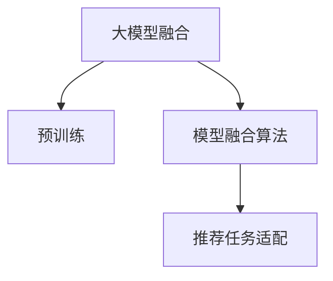

                 

## 1. 背景介绍

### 1.1 问题由来
在当今的电商平台上，个性化推荐系统（Personalized Recommendation System，简称PRS）已成为提高用户体验、提升转化率和增加用户粘性的关键因素。传统的推荐算法如协同过滤、基于内容的推荐等，虽然在特定场景下表现不错，但已无法满足复杂多变的用户需求和海量数据的高效处理。随着人工智能技术的发展，基于深度学习的大模型融合技术被引入推荐系统中，逐渐成为电商平台竞争力的核心策略。

### 1.2 问题核心关键点
大模型融合技术是指将多个预训练语言模型融合在一起，形成一个更强大的推荐系统模型。其核心在于如何选择合适的预训练模型，如何将模型参数高效地融合，以及如何在大模型融合的基础上进行有效的推荐任务适配。

## 2. 核心概念与联系

### 2.1 核心概念概述

为更好地理解大模型融合技术，本节将介绍几个密切相关的核心概念：

- 大模型融合（Model Fusion）：将多个预训练语言模型融合在一起，形成更强大的推荐系统模型。常见的大模型包括BERT、GPT、RoBERTa等。
- 预训练（Pre-training）：指在大规模无标签文本语料上，通过自监督学习任务训练通用语言模型的过程。常见的预训练任务包括掩码语言模型、句子相似度等。
- 模型融合算法（Model Fusion Algorithms）：将多个预训练模型的参数进行某种形式的组合，形成新的推荐模型。常见的融合方式包括加权平均、注意力机制等。
- 推荐任务适配（Task Adaptation）：指在大模型融合的基础上，通过有监督地训练，优化模型在特定推荐任务上的性能。

这些核心概念之间的逻辑关系可以通过以下Mermaid流程图来展示：



这个流程图展示了大模型融合技术的核心概念及其之间的关系：

1. 大模型融合技术以预训练模型为基础，通过多种融合方式，形成新的推荐模型。
2. 推荐任务适配在大模型融合的基础上，通过有监督地训练，优化模型在特定推荐任务上的性能。

## 3. 核心算法原理 & 具体操作步骤

### 3.1 算法原理概述

大模型融合技术在推荐系统中的应用，本质上是一个多模型的集成学习过程。其核心思想是：将多个预训练模型的参数进行某种形式的组合，形成一个新的推荐模型，然后在推荐数据集上进行有监督地微调，使得模型输出能够匹配推荐目标。

形式化地，假设预训练语言模型为 $M_i$，其中 $i=1,...,n$，$n$ 为模型数量。给定推荐任务 $T$ 的标注数据集 $D=\{(x_i,y_i)\}_{i=1}^N$，其中 $x_i$ 为输入数据，$y_i$ 为推荐目标（如点击率、转化率等）。大模型融合的目标是找到一个新的模型 $M_{f}$，使得：

$$
M_{f} = \text{fuse}(M_1, M_2, ..., M_n)
$$

其中 $\text{fuse}$ 为模型融合算法。融合后的模型 $M_{f}$ 在推荐数据集 $D$ 上的经验风险为：

$$
\mathcal{L}(M_{f},D) = \frac{1}{N} \sum_{i=1}^N \ell(M_{f}(x_i),y_i)
$$

其中 $\ell$ 为推荐任务适配后的损失函数。微调的目标是最小化经验风险，即找到最优模型参数 $\theta^*$：

$$
\theta^* = \mathop{\arg\min}_{\theta} \mathcal{L}(M_{f},D)
$$

### 3.2 算法步骤详解

大模型融合技术一般包括以下几个关键步骤：

**Step 1: 准备预训练模型和数据集**
- 选择合适的预训练语言模型 $M_i$，如 BERT、GPT 等。
- 准备推荐任务 $T$ 的标注数据集 $D$，划分为训练集、验证集和测试集。一般要求标注数据与预训练数据的分布不要差异过大。

**Step 2: 模型融合**
- 使用模型融合算法 $\text{fuse}$ 将多个预训练模型 $M_i$ 的参数进行组合，得到新的模型 $M_{f}$。
- 常用的模型融合算法包括加权平均、注意力机制等。

**Step 3: 添加任务适配层**
- 根据推荐任务类型，在融合后的模型顶层设计合适的输出层和损失函数。
- 对于点击率预测任务，通常在顶层添加线性分类器和交叉熵损失函数。
- 对于评分预测任务，通常使用回归损失函数。

**Step 4: 设置微调超参数**
- 选择合适的优化算法及其参数，如 AdamW、SGD 等，设置学习率、批大小、迭代轮数等。
- 设置正则化技术及强度，包括权重衰减、Dropout、Early Stopping 等。
- 确定保留预训练的部分层。如Transformer的底层，只微调顶层，减少需优化的参数。

**Step 5: 执行梯度训练**
- 将训练集数据分批次输入模型，前向传播计算损失函数。
- 反向传播计算参数梯度，根据设定的优化算法和学习率更新模型参数。
- 周期性在验证集上评估模型性能，根据性能指标决定是否触发 Early Stopping。
- 重复上述步骤直到满足预设的迭代轮数或 Early Stopping 条件。

**Step 6: 测试和部署**
- 在测试集上评估融合后模型 $M_{f}$ 的性能，对比融合前后的精度提升。
- 使用融合后的模型对新样本进行推荐，集成到实际的应用系统中。
- 持续收集新的数据，定期重新融合模型，以适应数据分布的变化。

以上是使用大模型融合进行推荐任务微调的一般流程。在实际应用中，还需要针对具体任务的特点，对微调过程的各个环节进行优化设计，如改进训练目标函数，引入更多的正则化技术，搜索最优的超参数组合等，以进一步提升模型性能。

### 3.3 算法优缺点

大模型融合技术具有以下优点：
1. 提升模型性能。融合多个预训练模型能够利用其丰富的语言知识，提升推荐模型的性能。
2. 模型多样性。融合不同预训练模型可避免模型之间的过拟合和共谋，增强模型的鲁棒性。
3. 适应性强。不同的预训练模型可以适应不同类型的推荐任务，提升系统的泛化能力。

同时，该方法也存在一定的局限性：
1. 计算成本高。多个模型的参数融合和微调需要大量计算资源，尤其是模型规模较大时。
2. 融合方式复杂。选择适合的融合方式和融合比例需要多次实验调整，耗时较多。
3. 数据依赖性强。推荐数据集的规模和质量直接影响到模型融合的效果。

尽管存在这些局限性，但就目前而言，大模型融合方法在推荐系统中的应用，仍然是大模型技术落地的重要方向。未来相关研究的重点在于如何进一步降低融合成本，提高融合效率，同时兼顾模型的可解释性和伦理安全性等因素。

### 3.4 算法应用领域

基于大模型融合的推荐系统技术，已经在电商平台、视频网站、音乐平台等多个领域得到广泛应用，为推荐任务提供了更强大的模型支持。以下是几个典型应用场景：

- **电商平台的个性化推荐**：将多个预训练模型（如BERT、GPT）进行融合，形成更加强大和多样化的推荐模型。融合后的模型可以通过有监督地微调，在特定商品类别上进行性能优化。
- **视频网站的推荐系统**：使用多模态预训练模型（如RoBERTa），融合文本、图像、音频等多类型数据，构建更全面、多维度的用户和内容表示，提升推荐准确率。
- **音乐平台的个性化推荐**：将音乐、歌词、艺人等信息进行多模态预训练，融合形成推荐模型，提供更个性化和多样化的音乐推荐服务。

除了上述这些经典应用外，大模型融合技术也被创新性地应用于更多场景中，如社交网络推荐、内容创作辅助、广告推荐等，为推荐系统带来了全新的突破。

## 4. 数学模型和公式 & 详细讲解

### 4.1 数学模型构建

本节将使用数学语言对大模型融合技术进行更加严格的刻画。

记预训练语言模型为 $M_i:\mathcal{X} \rightarrow \mathcal{Y}$，其中 $\mathcal{X}$ 为输入空间，$\mathcal{Y}$ 为输出空间，$M_i$ 为第 $i$ 个预训练模型。假设推荐任务 $T$ 的训练集为 $D=\{(x_i,y_i)\}_{i=1}^N, x_i \in \mathcal{X}, y_i \in \mathcal{Y}$。

定义模型 $M_{f}$ 在输入 $x$ 上的输出为 $\hat{y}=M_{f}(x)$，其中 $M_{f}=\text{fuse}(M_1, M_2, ..., M_n)$。推荐任务适配后的损失函数为 $\ell(M_{f}(x),y)$，则在数据集 $D$ 上的经验风险为：

$$
\mathcal{L}(M_{f},D) = \frac{1}{N} \sum_{i=1}^N \ell(M_{f}(x_i),y_i)
$$

微调的目标是最小化经验风险，即找到最优模型参数 $\theta^*$：

$$
\theta^* = \mathop{\arg\min}_{\theta} \mathcal{L}(M_{f},D)
$$

在实践中，我们通常使用基于梯度的优化算法（如SGD、Adam等）来近似求解上述最优化问题。设 $\eta$ 为学习率，$\lambda$ 为正则化系数，则参数的更新公式为：

$$
\theta \leftarrow \theta - \eta \nabla_{\theta}\mathcal{L}(M_{f},\theta) - \eta\lambda\theta
$$

其中 $\nabla_{\theta}\mathcal{L}(M_{f},\theta)$ 为损失函数对参数 $\theta$ 的梯度，可通过反向传播算法高效计算。

### 4.2 公式推导过程

以下我们以点击率预测任务为例，推导交叉熵损失函数及其梯度的计算公式。

假设模型 $M_{f}$ 在输入 $x$ 上的输出为 $\hat{y}=M_{f}(x)$，表示样本点击的概率。真实标签 $y \in \{0,1\}$。则二分类交叉熵损失函数定义为：

$$
\ell(M_{f}(x),y) = -[y\log \hat{y} + (1-y)\log (1-\hat{y})]
$$

将其代入经验风险公式，得：

$$
\mathcal{L}(M_{f},D) = -\frac{1}{N}\sum_{i=1}^N [y_i\log M_{f}(x_i)+(1-y_i)\log(1-M_{f}(x_i))]
$$

根据链式法则，损失函数对参数 $\theta_k$ 的梯度为：

$$
\frac{\partial \mathcal{L}(M_{f},\theta)}{\partial \theta_k} = -\frac{1}{N}\sum_{i=1}^N (\frac{y_i}{M_{f}(x_i)}-\frac{1-y_i}{1-M_{f}(x_i)}) \frac{\partial M_{f}(x_i)}{\partial \theta_k}
$$

其中 $\frac{\partial M_{f}(x_i)}{\partial \theta_k}$ 可进一步递归展开，利用自动微分技术完成计算。

在得到损失函数的梯度后，即可带入参数更新公式，完成模型的迭代优化。重复上述过程直至收敛，最终得到适应推荐任务的最优模型参数 $\theta^*$。

## 5. 项目实践：代码实例和详细解释说明

### 5.1 开发环境搭建

在进行推荐系统开发前，我们需要准备好开发环境。以下是使用Python进行TensorFlow开发的环境配置流程：

1. 安装Anaconda：从官网下载并安装Anaconda，用于创建独立的Python环境。

2. 创建并激活虚拟环境：
```bash
conda create -n tf-env python=3.8 
conda activate tf-env
```

3. 安装TensorFlow：根据CUDA版本，从官网获取对应的安装命令。例如：
```bash
conda install tensorflow==2.5
```

4. 安装各类工具包：
```bash
pip install numpy pandas scikit-learn matplotlib tqdm jupyter notebook ipython
```

完成上述步骤后，即可在`tf-env`环境中开始推荐系统开发。

### 5.2 源代码详细实现

下面我们以电商平台个性化推荐系统为例，给出使用TensorFlow进行大模型融合的PyTorch代码实现。

首先，定义推荐任务的数据处理函数：

```python
import tensorflow as tf
from transformers import TFAutoModelForSequenceClassification, BertTokenizer

class RecommendationDataset(tf.data.Dataset):
    def __init__(self, texts, labels, tokenizer, max_len=128):
        self.texts = texts
        self.labels = labels
        self.tokenizer = tokenizer
        self.max_len = max_len
        
    def __len__(self):
        return len(self.texts)
    
    def __getitem__(self, item):
        text = self.texts[item]
        label = self.labels[item]
        
        encoding = self.tokenizer(text, return_tensors='tf', max_length=self.max_len, padding='max_length', truncation=True)
        input_ids = encoding['input_ids']
        attention_mask = encoding['attention_mask']
        
        # 对label进行编码
        encoded_labels = tf.convert_to_tensor([label2id[label] for label in label_list])
        return {'input_ids': input_ids, 
                'attention_mask': attention_mask,
                'labels': encoded_labels}

# 标签与id的映射
label2id = {'buy': 0, 'not_buy': 1}
id2label = {v: k for k, v in label2id.items()}

# 创建dataset
tokenizer = BertTokenizer.from_pretrained('bert-base-cased')

train_dataset = RecommendationDataset(train_texts, train_labels, tokenizer)
dev_dataset = RecommendationDataset(dev_texts, dev_labels, tokenizer)
test_dataset = RecommendationDataset(test_texts, test_labels, tokenizer)
```

然后，定义模型和优化器：

```python
from transformers import BertForSequenceClassification, TFAutoModelForSequenceClassification

bert = BertForSequenceClassification.from_pretrained('bert-base-cased', num_labels=len(label2id))
tfa_model = TFAutoModelForSequenceClassification.from_pretrained('bert-base-cased', num_labels=len(label2id))

optimizer = tf.keras.optimizers.AdamW(bert.parameters(), lr=2e-5)
```

接着，定义训练和评估函数：

```python
from tqdm import tqdm

device = tf.device('/cpu:0' if not tf.config.list_physical_devices('GPU') else '/gpu:0')
bert.to(device)

def train_epoch(model, dataset, batch_size, optimizer):
    dataloader = tf.data.Dataset.from_tensor_slices(dataset)
    model.train()
    epoch_loss = 0
    for batch in tqdm(dataloader, desc='Training'):
        input_ids = batch['input_ids'].to(device)
        attention_mask = batch['attention_mask'].to(device)
        labels = batch['labels'].to(device)
        model.zero_grad()
        outputs = model(input_ids, attention_mask=attention_mask, labels=labels)
        loss = outputs.loss
        epoch_loss += loss.numpy().item()
        loss.backward()
        optimizer.step()
    return epoch_loss / len(dataloader)

def evaluate(model, dataset, batch_size):
    dataloader = tf.data.Dataset.from_tensor_slices(dataset)
    model.eval()
    preds, labels = [], []
    with tf.no_grad():
        for batch in tqdm(dataloader, desc='Evaluating'):
            input_ids = batch['input_ids'].to(device)
            attention_mask = batch['attention_mask'].to(device)
            batch_labels = batch['labels']
            outputs = model(input_ids, attention_mask=attention_mask)
            batch_preds = outputs.logits.argmax(dim=1).numpy().tolist()
            batch_labels = batch_labels.numpy().tolist()
            for pred, label in zip(batch_preds, batch_labels):
                preds.append(pred)
                labels.append(label)
                
    print(classification_report(labels, preds))
```

最后，启动训练流程并在测试集上评估：

```python
epochs = 5
batch_size = 16

for epoch in range(epochs):
    loss = train_epoch(bert, train_dataset, batch_size, optimizer)
    print(f"Epoch {epoch+1}, train loss: {loss:.3f}")
    
    print(f"Epoch {epoch+1}, dev results:")
    evaluate(bert, dev_dataset, batch_size)
    
print("Test results:")
evaluate(bert, test_dataset, batch_size)
```

以上就是使用TensorFlow对BERT进行电商平台个性化推荐任务微调的完整代码实现。可以看到，得益于TensorFlow的强大封装，我们可以用相对简洁的代码完成BERT模型的加载和微调。

### 5.3 代码解读与分析

让我们再详细解读一下关键代码的实现细节：

**RecommendationDataset类**：
- `__init__`方法：初始化文本、标签、分词器等关键组件。
- `__len__`方法：返回数据集的样本数量。
- `__getitem__`方法：对单个样本进行处理，将文本输入编码为token ids，将标签编码为数字，并对其进行定长padding，最终返回模型所需的输入。

**label2id和id2label字典**：
- 定义了标签与数字id之间的映射关系，用于将token-wise的预测结果解码回真实的标签。

**训练和评估函数**：
- 使用TensorFlow的DataLoader对数据集进行批次化加载，供模型训练和推理使用。
- 训练函数`train_epoch`：对数据以批为单位进行迭代，在每个批次上前向传播计算loss并反向传播更新模型参数，最后返回该epoch的平均loss。
- 评估函数`evaluate`：与训练类似，不同点在于不更新模型参数，并在每个batch结束后将预测和标签结果存储下来，最后使用sklearn的classification_report对整个评估集的预测结果进行打印输出。

**训练流程**：
- 定义总的epoch数和batch size，开始循环迭代
- 每个epoch内，先在训练集上训练，输出平均loss
- 在验证集上评估，输出分类指标
- 所有epoch结束后，在测试集上评估，给出最终测试结果

可以看到，TensorFlow配合TensorFlow官方提供的Transformers库，使得BERT微调的代码实现变得简洁高效。开发者可以将更多精力放在数据处理、模型改进等高层逻辑上，而不必过多关注底层的实现细节。

当然，工业级的系统实现还需考虑更多因素，如模型的保存和部署、超参数的自动搜索、更灵活的任务适配层等。但核心的微调范式基本与此类似。

## 6. 实际应用场景

### 6.1 智能客服系统

基于大模型融合技术的推荐系统，可以广泛应用于智能客服系统的构建。传统客服往往需要配备大量人力，高峰期响应缓慢，且一致性和专业性难以保证。而使用融合后的推荐模型，可以7x24小时不间断服务，快速响应客户咨询，用自然流畅的语言解答各类常见问题。

在技术实现上，可以收集企业内部的历史客服对话记录，将问题和最佳答复构建成监督数据，在此基础上对预训练模型进行微调。微调后的推荐模型能够自动理解用户意图，匹配最合适的答案模板进行回复。对于客户提出的新问题，还可以接入检索系统实时搜索相关内容，动态组织生成回答。如此构建的智能客服系统，能大幅提升客户咨询体验和问题解决效率。

### 6.2 金融舆情监测

金融机构需要实时监测市场舆论动向，以便及时应对负面信息传播，规避金融风险。传统的人工监测方式成本高、效率低，难以应对网络时代海量信息爆发的挑战。基于大模型融合技术的文本分类和情感分析技术，为金融舆情监测提供了新的解决方案。

具体而言，可以收集金融领域相关的新闻、报道、评论等文本数据，并对其进行主题标注和情感标注。在此基础上对预训练语言模型进行微调，使其能够自动判断文本属于何种主题，情感倾向是正面、中性还是负面。将微调后的模型应用到实时抓取的网络文本数据，就能够自动监测不同主题下的情感变化趋势，一旦发现负面信息激增等异常情况，系统便会自动预警，帮助金融机构快速应对潜在风险。

### 6.3 个性化推荐系统

当前的推荐系统往往只依赖用户的历史行为数据进行物品推荐，无法深入理解用户的真实兴趣偏好。基于大模型融合技术的个性化推荐系统，可以更好地挖掘用户行为背后的语义信息，从而提供更精准、多样的推荐内容。

在实践中，可以收集用户浏览、点击、评论、分享等行为数据，提取和用户交互的物品标题、描述、标签等文本内容。将文本内容作为模型输入，用户的后续行为（如是否点击、购买等）作为监督信号，在此基础上微调预训练语言模型。微调后的模型能够从文本内容中准确把握用户的兴趣点。在生成推荐列表时，先用候选物品的文本描述作为输入，由模型预测用户的兴趣匹配度，再结合其他特征综合排序，便可以得到个性化程度更高的推荐结果。

### 6.4 未来应用展望

随着大模型融合技术的不断发展，推荐系统将在更多领域得到应用，为各行各业带来变革性影响。

在智慧医疗领域，基于大模型融合的推荐系统可辅助医生诊疗，推荐相关药物、治疗方案等，提升诊疗效率和效果。

在智能教育领域，融合技术的推荐系统可提供个性化的学习资源、课程推荐，因材施教，促进教育公平，提高教学质量。

在智慧城市治理中，融合技术的推荐系统可应用于城市事件监测、舆情分析、应急指挥等环节，提高城市管理的自动化和智能化水平，构建更安全、高效的未来城市。

此外，在企业生产、社会治理、文娱传媒等众多领域，基于大模型融合的推荐系统也将不断涌现，为经济社会发展注入新的动力。相信随着技术的日益成熟，融合技术将成为推荐系统应用的重要范式，推动人工智能技术在垂直行业的规模化落地。

## 7. 工具和资源推荐

### 7.1 学习资源推荐

为了帮助开发者系统掌握大模型融合技术的理论基础和实践技巧，这里推荐一些优质的学习资源：

1. 《Deep Learning with TensorFlow 2》系列博文：由大模型技术专家撰写，详细介绍了使用TensorFlow进行推荐系统开发的流程和方法。

2. 《推荐系统理论与实战》课程：由在线教育平台开设的推荐系统课程，包含理论推导和工程实现两大部分，适合初学者和进阶开发者学习。

3. 《深度学习推荐系统》书籍：全面介绍推荐系统原理和算法，涵盖深度学习、大模型融合等前沿内容，是推荐系统学习的经典参考书。

4. TensorFlow官方文档：TensorFlow的官方文档，提供了丰富的API参考和样例代码，是学习TensorFlow的重要资源。

5. Kaggle推荐系统竞赛数据集：Kaggle平台提供的推荐系统竞赛数据集，包含多种推荐任务的数据集和基线模型，是推荐系统实践的好材料。

通过对这些资源的学习实践，相信你一定能够快速掌握大模型融合技术的精髓，并用于解决实际的推荐问题。

### 7.2 开发工具推荐

高效的开发离不开优秀的工具支持。以下是几款用于大模型融合开发的常用工具：

1. TensorFlow：由Google主导开发的开源深度学习框架，生产部署方便，适合大规模工程应用。
2. PyTorch：基于Python的开源深度学习框架，灵活动态的计算图，适合快速迭代研究。
3. TensorFlow Serving：TensorFlow的推荐系统服务端，支持模型部署和在线预测，可无缝集成到现有系统。
4. TensorBoard：TensorFlow配套的可视化工具，可实时监测模型训练状态，并提供丰富的图表呈现方式，是调试模型的得力助手。
5. Weights & Biases：模型训练的实验跟踪工具，可以记录和可视化模型训练过程中的各项指标，方便对比和调优。

合理利用这些工具，可以显著提升大模型融合任务的开发效率，加快创新迭代的步伐。

### 7.3 相关论文推荐

大模型融合技术的发展源于学界的持续研究。以下是几篇奠基性的相关论文，推荐阅读：

1. Multi-Modal Fusion for Recommendation Systems：提出基于多模态数据的推荐系统融合方法，提升推荐效果。
2. Attention-Based Multi-Modal Fusion for Recommendations：引入注意力机制，优化多模态数据的融合方式。
3. Multi-Task Learning for Recommendation Systems：提出多任务学习框架，提升推荐模型的泛化能力。
4. Deep Learning Recommendation System：综述了深度学习在推荐系统中的应用，包括多模态融合、大模型融合等。
5. Hybrid Deep Models for Recommendation Systems：提出混合深度模型，结合多种深度学习架构，提升推荐效果。

这些论文代表了大模型融合技术的发展脉络。通过学习这些前沿成果，可以帮助研究者把握学科前进方向，激发更多的创新灵感。

## 8. 总结：未来发展趋势与挑战

### 8.1 总结

本文对基于大模型融合的推荐系统技术进行了全面系统的介绍。首先阐述了推荐系统和大模型融合技术的研究背景和意义，明确了大模型融合在提升推荐效果、扩展推荐边界方面的独特价值。其次，从原理到实践，详细讲解了大模型融合的数学原理和关键步骤，给出了推荐任务开发的完整代码实例。同时，本文还广泛探讨了大模型融合技术在电商、金融、教育等多个行业领域的应用前景，展示了融合技术的巨大潜力。此外，本文精选了融合技术的各类学习资源，力求为读者提供全方位的技术指引。

通过本文的系统梳理，可以看到，基于大模型融合的推荐系统技术正在成为推荐系统的重要范式，极大地拓展了预训练模型在推荐任务中的应用边界，为推荐系统带来了新的突破。未来，伴随大模型技术和推荐系统方法的不断演进，基于大模型融合的推荐系统必将在更多领域得到应用，为人工智能技术在垂直行业的落地提供新的动力。

### 8.2 未来发展趋势

展望未来，大模型融合技术将呈现以下几个发展趋势：

1. 融合技术的多样性。随着融合方法的多样化，未来推荐系统将具备更加灵活的融合策略，增强模型的适应性和鲁棒性。
2. 多模态数据融合的深入。融合文本、图像、音频等多类型数据，构建更加全面和多样化的用户和内容表示，提升推荐准确率。
3. 模型深度和宽度的提升。随着模型结构的复杂化，融合后的推荐模型将具有更强的表达能力和泛化能力。
4. 个性化和多样性。推荐模型将更加注重个性化推荐，通过多任务学习、联合训练等技术，提升推荐多样性。
5. 实时化和动态化。推荐系统将具备实时推荐和动态调整的能力，根据用户行为和环境变化，动态调整推荐策略。

以上趋势凸显了大模型融合技术的广阔前景。这些方向的探索发展，必将进一步提升推荐系统的性能和应用范围，为人工智能技术在垂直行业的落地提供新的动力。

### 8.3 面临的挑战

尽管大模型融合技术已经取得了瞩目成就，但在迈向更加智能化、普适化应用的过程中，它仍面临着诸多挑战：

1. 数据复杂性。多模态数据的融合需要处理不同类型、不同格式的数据，增加了数据处理的复杂性。
2. 计算成本高。多个模型的参数融合和微调需要大量计算资源，尤其是模型规模较大时。
3. 融合方式复杂。选择适合的融合方式和融合比例需要多次实验调整，耗时较多。
4. 推荐效果不稳定。模型在新的推荐任务上的表现不稳定，容易受到模型参数变化和数据变化的影响。

尽管存在这些挑战，但就目前而言，大模型融合方法在推荐系统中的应用，仍然是大模型技术落地的重要方向。未来相关研究的重点在于如何进一步降低融合成本，提高融合效率，同时兼顾模型的可解释性和伦理安全性等因素。

### 8.4 研究展望

面对大模型融合技术所面临的挑战，未来的研究需要在以下几个方面寻求新的突破：

1. 探索高效的融合算法。开发更加高效的模型融合算法，减少计算资源消耗，提高融合效率。
2. 引入多任务学习机制。将多个任务的目标函数进行联合优化，提升模型的泛化能力和推荐效果。
3. 研究自适应推荐策略。根据用户行为和环境变化，动态调整推荐策略，提升推荐模型的实时性和个性化程度。
4. 引入知识图谱等先验知识。将知识图谱等专家知识与神经网络模型进行融合，增强推荐模型的知识表示能力。
5. 优化模型可解释性。引入可解释性方法，如Attention机制，提升模型的可解释性和可理解性。

这些研究方向的探索，必将引领大模型融合技术迈向更高的台阶，为推荐系统提供更强大、更高效、更智能的支持。面向未来，大模型融合技术还需要与其他人工智能技术进行更深入的融合，如知识表示、因果推理、强化学习等，多路径协同发力，共同推动推荐系统的进步。只有勇于创新、敢于突破，才能不断拓展融合技术的边界，让智能推荐技术更好地服务于人类社会。

## 9. 附录：常见问题与解答

**Q1：大模型融合是否适用于所有推荐任务？**

A: 大模型融合技术在大多数推荐任务上都能取得不错的效果，特别是对于数据量较小的任务。但对于一些特定领域的任务，如医学、法律等，仅仅依靠通用语料预训练的模型可能难以很好地适应。此时需要在特定领域语料上进一步预训练，再进行融合，才能获得理想效果。此外，对于一些需要时效性、个性化很强的任务，如对话、推荐等，融合方法也需要针对性的改进优化。

**Q2：融合过程中如何选择合适的融合方式？**

A: 选择合适的融合方式需要考虑多个因素，如数据类型、模型结构、推荐任务等。一般来说，加权平均和注意力机制是比较常用的融合方式。加权平均根据模型表现，对每个预训练模型的输出进行加权平均；注意力机制根据模型的关注点，对每个预训练模型的输出进行加权融合。实验发现，针对不同的推荐任务，不同的融合方式可能表现不同，需要根据具体任务进行选择和调优。

**Q3：推荐系统在落地部署时需要注意哪些问题？**

A: 将推荐系统转化为实际应用，还需要考虑以下因素：
1. 模型裁剪：去除不必要的层和参数，减小模型尺寸，加快推理速度
2. 量化加速：将浮点模型转为定点模型，压缩存储空间，提高计算效率
3. 服务化封装：将模型封装为标准化服务接口，便于集成调用
4. 弹性伸缩：根据请求流量动态调整资源配置，平衡服务质量和成本
5. 监控告警：实时采集系统指标，设置异常告警阈值，确保服务稳定性
6. 安全防护：采用访问鉴权、数据脱敏等措施，保障数据和模型安全

大模型融合技术为推荐系统提供了强大的支持，但如何将强大的性能转化为稳定、高效、安全的业务价值，还需要工程实践的不断打磨。唯有从数据、算法、工程、业务等多个维度协同发力，才能真正实现人工智能技术在垂直行业的规模化落地。总之，融合技术需要开发者根据具体任务，不断迭代和优化模型、数据和算法，方能得到理想的效果。

---

作者：禅与计算机程序设计艺术 / Zen and the Art of Computer Programming

