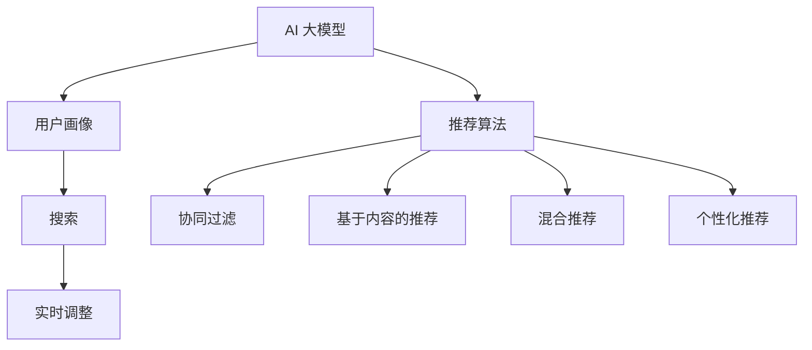

                 

# 搜索推荐系统的AI 大模型融合：电商平台提高转化率与用户体验

## 1. 背景介绍

随着互联网经济的蓬勃发展，电商平台已成为人们生活中不可或缺的一部分。一个高效、精准、个性化的推荐系统，不仅能提升用户体验，还能显著提高转化率和销售业绩。传统的推荐系统通常基于静态的模型进行，难以应对个性化需求和用户行为变化的快速变化。

而随着人工智能技术的发展，特别是在大模型预训练技术取得突破后，推荐系统正经历着从传统基于规则和统计模型的范式，向基于深度学习和AI大模型的范式转变。AI 大模型的强大能力使得推荐系统变得更加动态、精准，能够实时捕捉用户偏好和行为变化，从而提供更加个性化的推荐服务。

本文聚焦于搜索推荐系统的AI 大模型融合，介绍如何基于预训练大模型构建高效、精准、个性化的推荐系统，以提升电商平台的转化率和用户体验。

## 2. 核心概念与联系

### 2.1 核心概念概述

为更好地理解AI 大模型在推荐系统中的应用，本文将介绍几个关键概念：

- **AI 大模型**：指通过大规模无标签数据预训练获得的、具有强大语言和视觉理解能力的深度学习模型，如GPT、BERT、DALL-E等。它们在各种NLP和计算机视觉任务上均取得了顶尖性能。
- **推荐系统**：指根据用户的历史行为、兴趣和偏好，为用户推荐感兴趣的产品或内容的系统。传统推荐系统主要包括协同过滤、基于内容的推荐、混合推荐等。
- **搜索推荐**：结合搜索和推荐技术，通过智能算法为用户推荐最相关的产品，同时根据用户搜索行为进行实时调整和优化。
- **用户行为分析**：指通过分析用户浏览、点击、购买等行为数据，挖掘用户偏好和兴趣，从而进行精准推荐。
- **用户画像**：指通过用户行为数据构建的用户特征集合，用于个性化推荐。

这些核心概念之间的逻辑关系可以通过以下Mermaid流程图来展示：



这个流程图展示了大模型在推荐系统中的核心概念及其之间的关系：

1. AI 大模型通过大规模数据预训练，获得强大的语言和视觉理解能力。
2. 用户画像通过用户行为分析构建，用于个性化推荐。
3. 推荐算法结合AI 大模型和用户画像，实现个性化和实时推荐。
4. 协同过滤、基于内容的推荐、混合推荐等，是大模型的具体应用方向。
5. 搜索和实时调整相结合，进一步提升推荐效果。

## 3. 核心算法原理 & 具体操作步骤

### 3.1 算法原理概述

基于AI 大模型的推荐系统，本质上是一个动态、自适应的推荐模型。其核心思想是：将预训练的大模型作为基础模型，通过实时用户行为数据进行微调，更新模型参数，使得推荐结果能够更贴近用户的实时偏好和需求。

形式化地，假设预训练模型为 $M_{\theta}$，其中 $\theta$ 为预训练得到的模型参数。给定用户行为数据 $D=\{(x_i, y_i)\}_{i=1}^N, x_i \in \mathcal{X}, y_i \in \mathcal{Y}$，推荐系统的目标是最小化损失函数：

$$
\min_{\theta} \mathcal{L}(M_{\theta}, D)
$$

其中 $\mathcal{L}$ 为推荐系统的损失函数，用于衡量模型预测输出与真实标签之间的差异。常见的损失函数包括交叉熵损失、均方误差损失等。

### 3.2 算法步骤详解

基于AI 大模型的推荐系统一般包括以下几个关键步骤：

**Step 1: 准备预训练模型和数据集**
- 选择合适的预训练语言模型 $M_{\theta}$ 作为初始化参数，如 GPT、BERT 等。
- 准备电商平台的推荐数据集 $D$，划分为训练集、验证集和测试集。一般要求数据与预训练数据的分布不要差异过大。

**Step 2: 设计推荐算法**
- 根据电商平台的业务需求，设计推荐算法。常见的推荐算法包括协同过滤、基于内容的推荐、混合推荐等。
- 将推荐算法中的决策过程进行形式化建模，构建推荐系统的损失函数 $\mathcal{L}$。

**Step 3: 设置微调超参数**
- 选择合适的优化算法及其参数，如 AdamW、SGD 等，设置学习率、批大小、迭代轮数等。
- 设置正则化技术及强度，包括权重衰减、Dropout、Early Stopping 等。
- 确定冻结预训练参数的策略，如仅微调顶层，或全部参数都参与微调。

**Step 4: 执行梯度训练**
- 将推荐数据集数据分批次输入模型，前向传播计算损失函数。
- 反向传播计算参数梯度，根据设定的优化算法和学习率更新模型参数。
- 周期性在验证集上评估模型性能，根据性能指标决定是否触发 Early Stopping。
- 重复上述步骤直到满足预设的迭代轮数或 Early Stopping 条件。

**Step 5: 测试和部署**
- 在测试集上评估微调后模型 $M_{\hat{\theta}}$ 的性能，对比微调前后的精度提升。
- 使用微调后的模型对新样本进行推理预测，集成到实际的应用系统中。
- 持续收集新的数据，定期重新微调模型，以适应数据分布的变化。

以上是基于AI 大模型的推荐系统的一般流程。在实际应用中，还需要针对具体平台的特点，对微调过程的各个环节进行优化设计，如改进训练目标函数，引入更多的正则化技术，搜索最优的超参数组合等，以进一步提升模型性能。

### 3.3 算法优缺点

基于AI 大模型的推荐系统具有以下优点：
1. 动态性强。通过实时用户行为数据进行微调，能够快速响应用户偏好和需求变化。
2. 精度高。借助大模型的强大学习能力，推荐结果更接近真实偏好，提升用户体验和转化率。
3. 泛化能力强。大模型具有较强的泛化能力，能够适应不同业务场景下的推荐需求。
4. 可扩展性好。可以轻松集成到电商平台的推荐系统中，无需大规模改造。

同时，该方法也存在一定的局限性：
1. 对数据质量要求高。推荐效果很大程度上取决于用户行为数据的质量和数量，收集高质量数据成本较高。
2. 模型复杂度高。大模型结构复杂，训练和推理需要高性能设备，成本较高。
3. 需要大量计算资源。微调过程中需要大量计算资源，尤其在参数较大的大模型上，训练时间较长。
4. 黑盒性。大模型的决策过程复杂，难以解释其推荐逻辑，对用户信任度有一定影响。

尽管存在这些局限性，但就目前而言，基于AI 大模型的推荐系统仍然是推荐领域的主流范式。未来相关研究的重点在于如何进一步降低推荐系统对标注数据的依赖，提高模型的少样本学习和跨领域迁移能力，同时兼顾可解释性和伦理安全性等因素。

### 3.4 算法应用领域

基于AI 大模型的推荐系统在电商平台的推荐应用上，已经取得了显著效果。以下是几个典型的应用场景：

- **个性化推荐**：通过用户行为数据，分析用户偏好，实时调整推荐内容，提供个性化推荐，提升用户满意度。
- **商品推荐**：根据用户搜索历史和点击行为，推荐相似或相关商品，提高浏览转化率。
- **内容推荐**：根据用户浏览记录，推荐相关的文章、视频、新闻等内容，提升用户粘性。
- **智能客服**：结合聊天机器人技术，利用大模型进行问题解答，提升客户服务体验。
- **商品搜索优化**：通过自然语言处理技术，提升商品搜索的准确度和覆盖度，提高用户搜索效率。

除了上述这些经典应用外，AI 大模型在推荐系统的应用领域还将不断扩展，如广告投放优化、信息筛选推荐、智能物流调度等，为电商平台的智能化转型提供新的技术路径。

## 4. 数学模型和公式 & 详细讲解 & 举例说明

### 4.1 数学模型构建

本节将使用数学语言对基于AI 大模型的推荐系统进行更加严格的刻画。

假设推荐系统中的预训练语言模型为 $M_{\theta}$，用户行为数据集为 $D=\{(x_i, y_i)\}_{i=1}^N, x_i \in \mathcal{X}, y_i \in \mathcal{Y}$。

定义模型 $M_{\theta}$ 在输入 $x$ 上的输出为 $y \in \mathcal{Y}$，即推荐结果。推荐系统的目标是最小化损失函数：

$$
\min_{\theta} \mathcal{L}(M_{\theta}, D)
$$

其中 $\mathcal{L}$ 为推荐系统的损失函数，用于衡量模型预测输出与真实标签之间的差异。常见的损失函数包括交叉熵损失、均方误差损失等。

### 4.2 公式推导过程

以下我们以二分类任务为例，推导交叉熵损失函数及其梯度的计算公式。

假设模型 $M_{\theta}$ 在输入 $x$ 上的输出为 $\hat{y}=M_{\theta}(x) \in [0,1]$，表示用户对商品感兴趣的概率。真实标签 $y \in \{0,1\}$。则二分类交叉熵损失函数定义为：

$$
\ell(M_{\theta}(x),y) = -[y\log \hat{y} + (1-y)\log (1-\hat{y})]
$$

将其代入经验风险公式，得：

$$
\mathcal{L}(\theta) = -\frac{1}{N}\sum_{i=1}^N [y_i\log M_{\theta}(x_i)+(1-y_i)\log(1-M_{\theta}(x_i))]
$$

根据链式法则，损失函数对参数 $\theta_k$ 的梯度为：

$$
\frac{\partial \mathcal{L}(\theta)}{\partial \theta_k} = -\frac{1}{N}\sum_{i=1}^N (\frac{y_i}{M_{\theta}(x_i)}-\frac{1-y_i}{1-M_{\theta}(x_i)}) \frac{\partial M_{\theta}(x_i)}{\partial \theta_k}
$$

其中 $\frac{\partial M_{\theta}(x_i)}{\partial \theta_k}$ 可进一步递归展开，利用自动微分技术完成计算。

在得到损失函数的梯度后，即可带入参数更新公式，完成模型的迭代优化。重复上述过程直至收敛，最终得到适应电商平台推荐任务的最优模型参数 $\theta^*$。

### 4.3 案例分析与讲解

以电商平台的用户行为数据为例，考虑一个基于 AI 大模型的推荐系统，该系统旨在推荐用户感兴趣的商品。我们假设商品编号为 $1,2,...,N$，每个商品有一个向量表示 $x \in \mathbb{R}^d$，每个用户有一个向量表示 $y \in \mathbb{R}^d$。

对于用户 $i$，假设其对商品 $j$ 感兴趣的概率为 $\hat{y}_{i,j}$。推荐系统的目标是最大化用户满意度和转化率，即最大化用户对推荐结果的评分。假设评分函数为 $s(y_{i,j},y_{i,j'})$，其中 $y_{i,j}$ 为模型预测用户对商品 $j$ 的评分，$y_{i,j'}$ 为实际用户评分。

推荐系统的损失函数可以定义为：

$$
\mathcal{L} = \sum_{i=1}^N \sum_{j=1}^N s(y_{i,j},\hat{y}_{i,j}) + \lambda\sum_{i=1}^N \sum_{j=1}^N ||x_i - x_j||^2
$$

其中第一项为评分误差损失，第二项为商品相似度损失，$\lambda$ 为正则化系数，用于控制商品相似度损失的影响。

通过优化上述损失函数，可以不断调整模型参数 $\theta$，使得推荐结果尽可能接近实际用户评分，同时保持商品之间的相似度。这个优化过程可以通过基于梯度的优化算法（如AdamW、SGD等）进行迭代求解，直至收敛。

## 5. 项目实践：代码实例和详细解释说明

### 5.1 开发环境搭建

在进行推荐系统开发前，我们需要准备好开发环境。以下是使用Python进行PyTorch开发的环境配置流程：

1. 安装Anaconda：从官网下载并安装Anaconda，用于创建独立的Python环境。

2. 创建并激活虚拟环境：
```bash
conda create -n pytorch-env python=3.8 
conda activate pytorch-env
```

3. 安装PyTorch：根据CUDA版本，从官网获取对应的安装命令。例如：
```bash
conda install pytorch torchvision torchaudio cudatoolkit=11.1 -c pytorch -c conda-forge
```

4. 安装Transformer库：
```bash
pip install transformers
```

5. 安装各类工具包：
```bash
pip install numpy pandas scikit-learn matplotlib tqdm jupyter notebook ipython
```

完成上述步骤后，即可在`pytorch-env`环境中开始推荐系统开发。

### 5.2 源代码详细实现

下面我们以基于预训练BERT模型的电商平台推荐系统为例，给出使用Transformers库进行推荐系统开发的PyTorch代码实现。

首先，定义推荐数据集的预处理函数：

```python
from transformers import BertTokenizer
from torch.utils.data import Dataset
import torch

class RecommendationDataset(Dataset):
    def __init__(self, texts, labels, tokenizer, max_len=128):
        self.texts = texts
        self.labels = labels
        self.tokenizer = tokenizer
        self.max_len = max_len
        
    def __len__(self):
        return len(self.texts)
    
    def __getitem__(self, item):
        text = self.texts[item]
        label = self.labels[item]
        
        encoding = self.tokenizer(text, return_tensors='pt', max_length=self.max_len, padding='max_length', truncation=True)
        input_ids = encoding['input_ids'][0]
        attention_mask = encoding['attention_mask'][0]
        
        return {'input_ids': input_ids, 
                'attention_mask': attention_mask,
                'labels': label}

# 创建dataset
tokenizer = BertTokenizer.from_pretrained('bert-base-cased')

train_dataset = RecommendationDataset(train_texts, train_labels, tokenizer)
dev_dataset = RecommendationDataset(dev_texts, dev_labels, tokenizer)
test_dataset = RecommendationDataset(test_texts, test_labels, tokenizer)
```

然后，定义模型和优化器：

```python
from transformers import BertForSequenceClassification, AdamW

model = BertForSequenceClassification.from_pretrained('bert-base-cased', num_labels=1)

optimizer = AdamW(model.parameters(), lr=2e-5)
```

接着，定义训练和评估函数：

```python
from torch.utils.data import DataLoader
from tqdm import tqdm
from sklearn.metrics import roc_auc_score

device = torch.device('cuda') if torch.cuda.is_available() else torch.device('cpu')
model.to(device)

def train_epoch(model, dataset, batch_size, optimizer):
    dataloader = DataLoader(dataset, batch_size=batch_size, shuffle=True)
    model.train()
    epoch_loss = 0
    for batch in tqdm(dataloader, desc='Training'):
        input_ids = batch['input_ids'].to(device)
        attention_mask = batch['attention_mask'].to(device)
        labels = batch['labels'].to(device)
        model.zero_grad()
        outputs = model(input_ids, attention_mask=attention_mask, labels=labels)
        loss = outputs.loss
        epoch_loss += loss.item()
        loss.backward()
        optimizer.step()
    return epoch_loss / len(dataloader)

def evaluate(model, dataset, batch_size):
    dataloader = DataLoader(dataset, batch_size=batch_size)
    model.eval()
    preds, labels = [], []
    with torch.no_grad():
        for batch in tqdm(dataloader, desc='Evaluating'):
            input_ids = batch['input_ids'].to(device)
            attention_mask = batch['attention_mask'].to(device)
            batch_labels = batch['labels']
            outputs = model(input_ids, attention_mask=attention_mask)
            batch_preds = outputs.logits.argmax(dim=2).to('cpu').tolist()
            batch_labels = batch_labels.to('cpu').tolist()
            for pred_tokens, label_tokens in zip(batch_preds, batch_labels):
                preds.append(pred_tokens[0])
                labels.append(label_tokens[0])
                
    return roc_auc_score(labels, preds)

```

最后，启动训练流程并在测试集上评估：

```python
epochs = 5
batch_size = 16

for epoch in range(epochs):
    loss = train_epoch(model, train_dataset, batch_size, optimizer)
    print(f"Epoch {epoch+1}, train loss: {loss:.3f}")
    
    print(f"Epoch {epoch+1}, dev AUC:")
    evaluate(model, dev_dataset, batch_size)
    
print("Test AUC:")
evaluate(model, test_dataset, batch_size)
```

以上就是使用PyTorch对BERT进行电商平台推荐系统微调的完整代码实现。可以看到，得益于Transformers库的强大封装，我们可以用相对简洁的代码完成BERT模型的加载和微调。

### 5.3 代码解读与分析

让我们再详细解读一下关键代码的实现细节：

**RecommendationDataset类**：
- `__init__`方法：初始化文本、标签、分词器等关键组件。
- `__len__`方法：返回数据集的样本数量。
- `__getitem__`方法：对单个样本进行处理，将文本输入编码为token ids，将标签转换为标签向量，并对其进行定长padding，最终返回模型所需的输入。

**训练和评估函数**：
- 使用PyTorch的DataLoader对数据集进行批次化加载，供模型训练和推理使用。
- 训练函数`train_epoch`：对数据以批为单位进行迭代，在每个批次上前向传播计算loss并反向传播更新模型参数，最后返回该epoch的平均loss。
- 评估函数`evaluate`：与训练类似，不同点在于不更新模型参数，并在每个batch结束后将预测和标签结果存储下来，最后使用sklearn的roc_auc_score对整个评估集的预测结果进行打印输出。

**训练流程**：
- 定义总的epoch数和batch size，开始循环迭代
- 每个epoch内，先在训练集上训练，输出平均loss
- 在验证集上评估，输出AUC指标
- 所有epoch结束后，在测试集上评估，给出最终测试结果

可以看到，PyTorch配合Transformers库使得BERT微调的代码实现变得简洁高效。开发者可以将更多精力放在数据处理、模型改进等高层逻辑上，而不必过多关注底层的实现细节。

当然，工业级的系统实现还需考虑更多因素，如模型的保存和部署、超参数的自动搜索、更灵活的任务适配层等。但核心的微调范式基本与此类似。

## 6. 实际应用场景

### 6.1 智能推荐

智能推荐是电商平台的核心功能之一，通过推荐系统为用户推荐感兴趣的商品，提高用户满意度和转化率。基于AI 大模型的推荐系统，能够实时捕捉用户行为和偏好，进行个性化推荐。

在技术实现上，可以收集用户历史浏览、点击、购买等行为数据，构建用户画像，并通过预训练大模型进行微调。微调后的模型能够自动分析用户行为，推荐符合其偏好的商品，提升用户体验。

### 6.2 广告投放优化

电商平台还通过广告投放获取收入，但广告投放的精准度直接影响到广告的效果和投入产出比。基于AI 大模型的推荐系统，能够根据用户行为数据和广告点击率，优化广告投放策略，提高广告的精准度和转化率。

具体而言，可以构建一个多任务学习模型，将用户行为数据和广告点击数据作为输入，利用大模型进行微调。微调后的模型能够预测不同广告对不同用户的点击概率，从而进行优化投放。

### 6.3 智能搜索

高效的搜索系统能够提升用户浏览效率，帮助用户快速找到感兴趣的商品。基于AI 大模型的推荐系统，可以通过自然语言处理技术，提升商品搜索的准确度和覆盖度。

在技术实现上，可以将用户搜索词和商品标题进行自然语言处理，通过预训练大模型进行匹配，从而推荐最相关的商品。通过持续优化，能够不断提升搜索效果，增强用户满意度。

### 6.4 未来应用展望

随着AI 大模型技术的不断发展，基于大模型的推荐系统将呈现以下几个发展趋势：

1. 模型规模持续增大。随着算力成本的下降和数据规模的扩张，预训练大模型参数量还将持续增长。超大规模语言模型蕴含的丰富语言知识，有望支撑更加复杂多变的推荐需求。

2. 推荐方法日趋多样。除了传统的协同过滤、基于内容的推荐外，未来会涌现更多推荐方法，如生成式推荐、知识图谱推荐等，进一步提升推荐系统的灵活性和效果。

3. 实时推荐成为常态。大模型通过实时行为数据微调，能够动态调整推荐策略，实现实时推荐。这对于提升用户体验和响应速度至关重要。

4. 推荐系统的可解释性增强。随着推荐系统应用的广泛化，对推荐系统的可解释性需求日益增加。未来的推荐系统将结合可解释AI技术，提供用户更多的推荐理由，增强用户信任度。

5. 推荐系统与用户交互优化。未来的推荐系统将更加注重用户交互，通过智能对话技术，提升推荐效果和用户满意度。

6. 推荐系统与其他系统融合。推荐系统将与其他系统如搜索系统、客服系统等进行深度融合，形成协同机制，提升整体系统性能。

以上趋势凸显了AI 大模型在推荐系统中的巨大潜力。这些方向的探索发展，必将进一步提升推荐系统的性能和用户体验，为电商平台的智能化转型提供新的技术路径。相信随着技术的日益成熟，基于大模型的推荐系统必将在更多领域得到应用，为经济社会发展注入新的动力。

## 7. 工具和资源推荐

### 7.1 学习资源推荐

为了帮助开发者系统掌握AI 大模型在推荐系统中的应用，这里推荐一些优质的学习资源：

1. 《深度学习推荐系统》系列博文：由大模型技术专家撰写，深入浅出地介绍了深度学习推荐系统的原理和实践技巧。

2. 《推荐系统实战》书籍：详细讲解了推荐系统的基本概念、算法和实践技巧，并结合实际案例进行讲解。

3. 《深度学习与推荐系统》课程：北京大学开设的推荐系统课程，内容涵盖推荐系统的基本原理和常用算法，适合初学者学习。

4. Kaggle推荐系统竞赛：通过参加推荐系统竞赛，实际训练和测试推荐模型，提高实战能力。

5. Weights & Biases：模型训练的实验跟踪工具，可以记录和可视化模型训练过程中的各项指标，方便对比和调优。

通过对这些资源的学习实践，相信你一定能够快速掌握AI 大模型在推荐系统中的应用，并用于解决实际的电商推荐问题。

### 7.2 开发工具推荐

高效的开发离不开优秀的工具支持。以下是几款用于AI 大模型推荐系统开发的常用工具：

1. PyTorch：基于Python的开源深度学习框架，灵活动态的计算图，适合快速迭代研究。大部分预训练语言模型都有PyTorch版本的实现。

2. TensorFlow：由Google主导开发的开源深度学习框架，生产部署方便，适合大规模工程应用。同样有丰富的预训练语言模型资源。

3. Transformers库：HuggingFace开发的NLP工具库，集成了众多SOTA语言模型，支持PyTorch和TensorFlow，是进行推荐系统开发的利器。

4. Weights & Biases：模型训练的实验跟踪工具，可以记录和可视化模型训练过程中的各项指标，方便对比和调优。与主流深度学习框架无缝集成。

5. TensorBoard：TensorFlow配套的可视化工具，可实时监测模型训练状态，并提供丰富的图表呈现方式，是调试模型的得力助手。

6. Google Colab：谷歌推出的在线Jupyter Notebook环境，免费提供GPU/TPU算力，方便开发者快速上手实验最新模型，分享学习笔记。

合理利用这些工具，可以显著提升AI 大模型推荐系统的开发效率，加快创新迭代的步伐。

### 7.3 相关论文推荐

AI 大模型在推荐系统中的应用是近年来学术界和工业界的研究热点。以下是几篇奠基性的相关论文，推荐阅读：

1. Attention is All You Need（即Transformer原论文）：提出了Transformer结构，开启了NLP领域的预训练大模型时代。

2. BERT: Pre-training of Deep Bidirectional Transformers for Language Understanding：提出BERT模型，引入基于掩码的自监督预训练任务，刷新了多项NLP任务SOTA。

3. Mining Product Compatibility for Recommendations：提出基于商品相似度的推荐方法，利用大模型进行微调，实现了精准的商品推荐。

4. Mining User Preference with Transition-Based Dynamic Programming：提出基于动态规划的推荐方法，利用大模型进行微调，实现了对用户行为的准确预测。

5. Multi-Task Learning with Task-Aware Regularization：提出多任务学习的推荐方法，利用大模型进行微调，实现了对多个推荐任务的协同优化。

这些论文代表了大模型在推荐系统中的应用方向。通过学习这些前沿成果，可以帮助研究者把握学科前进方向，激发更多的创新灵感。

## 8. 总结：未来发展趋势与挑战

### 8.1 总结

本文对基于AI 大模型的推荐系统进行了全面系统的介绍。首先阐述了AI 大模型在推荐系统中的应用背景和优势，明确了推荐系统对电商平台的重要性。其次，从原理到实践，详细讲解了AI 大模型推荐系统的数学原理和关键步骤，给出了推荐系统开发的完整代码实例。同时，本文还广泛探讨了AI 大模型在电商平台推荐系统中的应用场景，展示了其巨大潜力。

通过本文的系统梳理，可以看到，基于AI 大模型的推荐系统正在成为电商平台推荐系统的核心技术范式，极大地提升了电商平台的转化率和用户体验。未来，伴随大模型和推荐算法的持续演进，基于大模型的推荐系统必将在更多领域得到应用，为经济社会发展注入新的动力。

### 8.2 未来发展趋势

展望未来，AI 大模型在推荐系统中的发展趋势如下：

1. 推荐模型规模化。随着算力成本的下降和数据规模的扩张，预训练大模型参数量还将持续增长。超大规模语言模型蕴含的丰富语言知识，有望支撑更加复杂多变的推荐需求。

2. 推荐算法多样化。除了传统的协同过滤、基于内容的推荐外，未来会涌现更多推荐算法，如生成式推荐、知识图谱推荐等，进一步提升推荐系统的灵活性和效果。

3. 实时推荐成为常态。大模型通过实时行为数据微调，能够动态调整推荐策略，实现实时推荐。这对于提升用户体验和响应速度至关重要。

4. 推荐系统的可解释性增强。随着推荐系统应用的广泛化，对推荐系统的可解释性需求日益增加。未来的推荐系统将结合可解释AI技术，提供用户更多的推荐理由，增强用户信任度。

5. 推荐系统与其他系统融合。推荐系统将与其他系统如搜索系统、客服系统等进行深度融合，形成协同机制，提升整体系统性能。

6. 推荐系统与业务深度结合。未来的推荐系统将更加注重与电商业务的深度结合，通过业务反馈和优化，提升推荐效果和用户体验。

以上趋势凸显了AI 大模型在推荐系统中的巨大潜力。这些方向的探索发展，必将进一步提升推荐系统的性能和用户体验，为电商平台的智能化转型提供新的技术路径。

### 8.3 面临的挑战

尽管AI 大模型在推荐系统中的应用取得了显著进展，但在迈向更加智能化、普适化应用的过程中，仍面临诸多挑战：

1. 对数据质量要求高。推荐效果很大程度上取决于用户行为数据的质量和数量，收集高质量数据成本较高。如何进一步降低推荐系统对标注数据的依赖，提高少样本学习和跨领域迁移能力，是一大难题。

2. 模型复杂度高。大模型结构复杂，训练和推理需要高性能设备，成本较高。如何进一步优化模型结构，提升计算效率，降低资源消耗，仍然是一个重要问题。

3. 实时推荐需高效算法。实时推荐需要高效的算法支持，如何快速计算推荐结果，避免延迟，是一大挑战。

4. 推荐系统的可解释性亟需加强。当前推荐系统更像是"黑盒"系统，难以解释其推荐逻辑，对用户信任度有一定影响。如何赋予推荐系统更强的可解释性，将是亟待攻克的难题。

5. 推荐系统的安全性有待保障。推荐系统可能会引入外部风险，如恶意商品推荐，导致用户损失。如何建立推荐系统的安全性保障机制，是一大挑战。

6. 跨模态推荐需突破瓶颈。跨模态推荐是将多模态数据进行融合，提升推荐效果。但不同模态数据的融合仍存在瓶颈，如何有效整合，提高推荐效果，是一大挑战。

面对这些挑战，未来的研究需要在以下几个方面寻求新的突破：

1. 探索无监督和半监督推荐方法。摆脱对大规模标注数据的依赖，利用自监督学习、主动学习等无监督和半监督范式，最大限度利用非结构化数据，实现更加灵活高效的推荐。

2. 研究参数高效和计算高效的推荐方法。开发更加参数高效的推荐方法，在固定大部分预训练参数的同时，只更新极少量的任务相关参数。同时优化推荐算法的计算图，减少前向传播和反向传播的资源消耗，实现更加轻量级、实时性的部署。

3. 融合因果和对比学习范式。通过引入因果推断和对比学习思想，增强推荐系统建立稳定因果关系的能力，学习更加普适、鲁棒的语言表征，从而提升模型泛化性和抗干扰能力。

4. 引入更多先验知识。将符号化的先验知识，如知识图谱、逻辑规则等，与神经网络模型进行巧妙融合，引导推荐过程学习更准确、合理的语言模型。同时加强不同模态数据的整合，实现视觉、语音等多模态信息与文本信息的协同建模。

5. 结合因果分析和博弈论工具。将因果分析方法引入推荐系统，识别出推荐决策的关键特征，增强推荐系统的因果性和逻辑性。借助博弈论工具刻画人机交互过程，主动探索并规避推荐系统的脆弱点，提高系统稳定性。

6. 纳入伦理道德约束。在推荐系统训练目标中引入伦理导向的评估指标，过滤和惩罚有害的推荐内容，确保推荐系统输出的安全性。

这些研究方向的目标是构建更安全、可靠、可解释、可控的推荐系统，提升用户满意度，增强平台竞争力。

### 8.4 研究展望

面对AI 大模型推荐系统的广阔前景，未来的研究需要在以下几个方面寻求新的突破：

1. 探索无监督和半监督推荐方法。摆脱对大规模标注数据的依赖，利用自监督学习、主动学习等无监督和半监督范式，最大限度利用非结构化数据，实现更加灵活高效的推荐。

2. 研究参数高效和计算高效的推荐方法。开发更加参数高效的推荐方法，在固定大部分预训练参数的同时，只更新极少量的任务相关参数。同时优化推荐算法的计算图，减少前向传播和反向传播的资源消耗，实现更加轻量级、实时性的部署。

3. 融合因果和对比学习范式。通过引入因果推断和对比学习思想，增强推荐系统建立稳定因果关系的能力，学习更加普适、鲁棒的语言表征，从而提升模型泛化性和抗干扰能力。

4. 引入更多先验知识。将符号化的先验知识，如知识图谱、逻辑规则等，与神经网络模型进行巧妙融合，引导推荐过程学习更准确、合理的语言模型。同时加强不同模态数据的整合，实现视觉、语音等多模态信息与文本信息的协同建模。

5. 结合因果分析和博弈论工具。将因果分析方法引入推荐系统，识别出推荐决策的关键特征，增强推荐系统的因果性和逻辑性。借助博弈论工具刻画人机交互过程，主动探索并规避推荐系统的脆弱点，提高系统稳定性。

6. 纳入伦理道德约束。在推荐系统训练目标中引入伦理导向的评估指标，过滤和惩罚有害的推荐内容，确保推荐系统输出的安全性。

这些研究方向的目标是构建更安全、可靠、可解释、可控的推荐系统，提升用户满意度，增强平台竞争力。只有勇于创新、敢于突破，才能不断拓展推荐系统的边界，让智能技术更好地造福人类社会。

## 9. 附录：常见问题与解答

**Q1：AI 大模型推荐系统是否适用于所有电商平台？**

A: AI 大模型推荐系统在大多数电商平台上都能取得不错的效果，特别是对于数据量较大的平台。但对于一些小型平台，数据量和用户行为模式可能不足以支撑大模型的训练和微调，此时需要在特定领域语料上进一步预训练，再进行微调，才能获得理想效果。

**Q2：如何选择合适的学习率？**

A: 推荐系统学习率一般要比预训练时小1-2个数量级，如果使用过大的学习率，容易破坏预训练权重，导致过拟合。一般建议从1e-5开始调参，逐步减小学习率，直至收敛。也可以使用warmup策略，在开始阶段使用较小的学习率，再逐渐过渡到预设值。需要注意的是，不同的优化器(如AdamW、Adafactor等)以及不同的学习率调度策略，可能需要设置不同的学习率阈值。

**Q3：采用AI 大模型推荐时会面临哪些资源瓶颈？**

A: 当前主流的大模型动辄以亿计的参数规模，对算力、内存、存储都提出了很高的要求。GPU/TPU等高性能设备是必不可少的，但即便如此，超大批次的训练和推理也可能遇到显存不足的问题。因此需要采用一些资源优化技术，如梯度积累、混合精度训练、模型并行等，来突破硬件瓶颈。同时，模型的存储和读取也可能占用大量时间和空间，需要采用模型压缩、稀疏化存储等方法进行优化。

**Q4：如何缓解推荐系统中的过拟合问题？**

A: 过拟合是推荐系统面临的主要挑战，尤其是在标注数据不足的情况下。常见的缓解策略包括：
1. 数据增强：通过回译、近义替换等方式扩充训练集
2. 正则化：使用L2正则、Dropout、Early Stopping等避免过拟合
3. 对抗训练：引入对抗样本，提高模型鲁棒性
4. 参数高效微调：只调整少量参数(如Adapter、Prefix等)，减小过拟合风险
5. 多模型集成：训练多个推荐模型，取平均输出，抑制过拟合

这些策略往往需要根据具体任务和数据特点进行灵活组合。只有在数据、模型、训练、推理等各环节进行全面优化，才能最大限度地发挥AI 大模型推荐系统的威力。

**Q5：推荐系统在落地部署时需要注意哪些问题？**

A: 将推荐系统转化为实际应用，还需要考虑以下因素：
1. 模型裁剪：去除不必要的层和参数，减小模型尺寸，加快推理速度
2. 量化加速：将浮点模型转为定点模型，压缩存储空间，提高计算效率
3. 服务化封装：将模型封装为标准化服务接口，便于集成调用
4. 弹性伸缩：根据请求流量动态调整资源配置，平衡服务质量和成本
5. 监控告警：实时采集系统指标，设置异常告警阈值，确保服务稳定性
6. 安全防护：采用访问鉴权、数据脱敏等措施，保障数据和模型安全

AI 大模型推荐系统为电商平台的智能化转型提供了新的技术路径。但如何将强大的性能转化为稳定、高效、安全的业务价值，还需要工程实践的不断打磨。只有从数据、算法、工程、业务等多个维度协同发力，才能真正实现人工智能技术在垂直行业的规模化落地。总之，推荐系统需要开发者根据具体任务，不断迭代和优化模型、数据和算法，方能得到理想的效果。

---

作者：禅与计算机程序设计艺术 / Zen and the Art of Computer Programming

