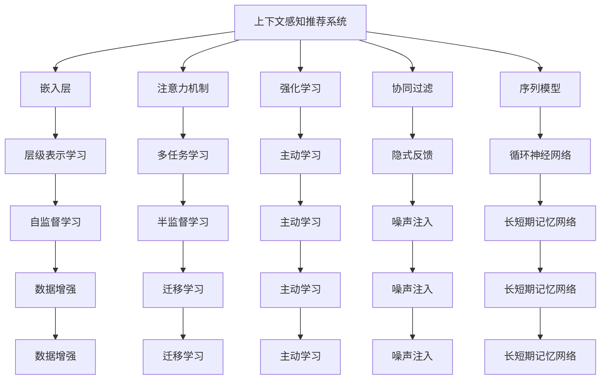
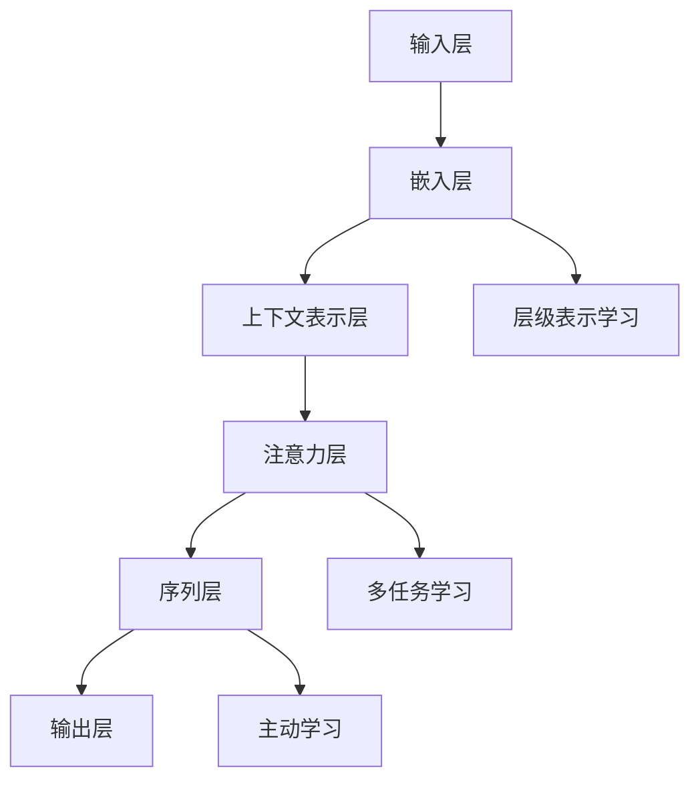

                 

# 搜索推荐系统的上下文感知技术

## 1. 背景介绍

### 1.1 问题由来

在互联网和电子商务迅速发展的今天，搜索推荐系统已成为各种平台的核心功能之一。无论是电商平台、新闻网站、社交媒体还是视频平台，其背后都有一套强大的搜索推荐系统，通过深度学习模型为用户推荐个性化的内容。

然而，随着数据量和用户行为的复杂性不断提升，传统的搜索推荐系统逐渐暴露出诸多不足。诸如忽略用户上下文信息、无法捕捉动态变化等，使得推荐结果与用户需求产生偏差。因此，如何在推荐系统中融入上下文感知技术，从而提供更精准、更个性化的推荐，成为了当前研究的热点。

### 1.2 问题核心关键点

上下文感知技术指的是在推荐系统中，模型能够充分考虑用户的上下文信息，如时间、地点、设备、行为历史等，以提升推荐的相关性和个性化。这一技术的核心关键点在于：

- **上下文建模**：如何有效捕捉和利用用户的上下文信息。
- **多维度融合**：如何综合多种数据源，形成对用户需求更为全面的理解。
- **实时更新**：如何使模型能够实时响应用户行为变化，持续优化推荐结果。
- **性能优化**：如何高效计算上下文感知模型，提升推荐系统的实时性和准确性。

## 2. 核心概念与联系

### 2.1 核心概念概述

为更好地理解搜索推荐系统中的上下文感知技术，本节将介绍几个核心概念：

- **上下文感知推荐系统**：利用用户的上下文信息，通过深度学习模型动态调整推荐策略，提升推荐的相关性和个性化。
- **嵌入层(Embedding Layer)**：用于将文本、图像、行为等高维数据映射到低维向量空间，便于模型的计算和处理。
- **注意力机制(Attention Mechanism)**：通过动态调整输入的权重，使模型能够关注关键的上下文信息。
- **强化学习(Reinforcement Learning)**：通过奖励机制训练模型，不断优化推荐策略。
- **协同过滤(Collaborative Filtering)**：通过分析用户行为和物品属性，寻找相似用户和物品，生成推荐列表。
- **序列模型(Sequence Model)**：能够处理时序数据的模型，能够捕捉用户的长期行为模式。

这些核心概念之间的逻辑关系可以通过以下Mermaid流程图来展示：



这个流程图展示上下文感知推荐系统的核心概念及其之间的关系：

1. 上下文感知推荐系统利用多种机制获取并利用用户的上下文信息。
2. 嵌入层将用户行为、物品属性、文本等高维数据转换为低维向量表示，便于后续处理。
3. 注意力机制和序列模型分别用于捕捉用户行为的动态变化和长期模式。
4. 强化学习和协同过滤通过奖励和相似性寻找机制优化推荐策略。
5. 层级表示学习、多任务学习、自监督学习等技术提升模型泛化能力和数据处理能力。

## 3. 核心算法原理 & 具体操作步骤

### 3.1 算法原理概述

上下文感知推荐系统的核心思想是通过深度学习模型捕捉用户上下文信息，利用这些信息生成个性化的推荐结果。其算法原理可以概括为以下几个步骤：

1. **数据收集与预处理**：收集用户的上下文信息，如时间、地点、设备、行为历史等。将这些信息与用户的兴趣标签、物品属性等进行整合，形成训练样本。
2. **嵌入层设计**：将高维数据映射到低维向量空间，便于模型的处理和计算。
3. **上下文表示学习**：通过模型学习用户上下文和行为的表示。
4. **注意力机制与序列建模**：利用注意力机制和序列模型捕捉用户的动态变化和长期行为模式。
5. **模型训练与优化**：利用优化算法，最小化推荐损失函数，不断提升推荐模型的准确性和鲁棒性。
6. **推荐生成与反馈循环**：根据模型预测结果生成推荐列表，同时利用用户的反馈信息，实时调整模型参数，形成反馈循环。

### 3.2 算法步骤详解

基于上下文感知推荐系统的算法步骤如下：

**Step 1: 数据收集与预处理**
- 收集用户的行为数据，如浏览历史、点击记录、购买行为等。
- 收集用户上下文信息，如设备、时间、地点等。
- 整合上下文信息与行为数据，形成训练样本。
- 进行数据清洗和预处理，如去除异常值、缺失值处理、归一化等。

**Step 2: 嵌入层设计**
- 使用嵌入层将高维数据转换为低维向量表示。
- 设计合适的嵌入矩阵，使用预训练的嵌入层如Word2Vec、GloVe等。
- 对嵌入层进行初始化，如使用随机初始化、预训练权重等。

**Step 3: 上下文表示学习**
- 利用深度学习模型学习用户上下文的表示。
- 使用多层感知器、循环神经网络、Transformer等模型进行上下文表示学习。
- 设计损失函数，如交叉熵损失、均方误差损失等。

**Step 4: 注意力机制与序列建模**
- 使用注意力机制捕捉用户行为的动态变化。
- 使用序列模型捕捉用户的长期行为模式。
- 结合注意力和序列建模，形成对用户上下文的全面理解。

**Step 5: 模型训练与优化**
- 使用优化算法如Adam、SGD等进行模型训练。
- 设计正则化技术如L2正则、Dropout等避免过拟合。
- 定期在验证集上评估模型性能，根据评估结果调整超参数。

**Step 6: 推荐生成与反馈循环**
- 根据模型预测结果生成推荐列表。
- 利用用户的反馈信息，实时调整模型参数。
- 形成反馈循环，不断优化推荐策略。

### 3.3 算法优缺点

上下文感知推荐系统具有以下优点：

1. **个性化强**：利用用户的上下文信息，生成更为个性化的推荐，提升用户体验。
2. **相关性高**：通过上下文信息的全面理解，生成更符合用户需求的内容。
3. **动态调整**：能够实时响应用户行为变化，持续优化推荐结果。

然而，该算法也存在一些缺点：

1. **数据需求大**：需要大量用户行为和上下文数据，数据收集和预处理成本较高。
2. **计算复杂**：上下文感知模型需要考虑多种因素，计算复杂度较高，实时性较差。
3. **模型复杂**：上下文表示学习、注意力机制、序列建模等技术，模型结构较为复杂，需要精心设计。
4. **易受干扰**：用户行为和上下文信息可能存在噪音，模型容易受到干扰，影响推荐效果。

### 3.4 算法应用领域

基于上下文感知推荐系统的算法，在多个领域得到了广泛的应用，例如：

- **电商推荐**：利用用户的浏览历史、点击记录、购买行为等，为用户推荐相关商品。
- **新闻推荐**：根据用户的行为数据和上下文信息，为用户推荐感兴趣的新闻文章。
- **视频推荐**：结合用户的观看历史和当前行为，为用户推荐相关视频内容。
- **社交推荐**：根据用户的社交网络关系和行为数据，推荐可能感兴趣的内容和用户。
- **旅游推荐**：利用用户的出行记录和上下文信息，推荐适合的旅游目的地和活动。

除了上述这些常见应用外，上下文感知推荐系统还广泛应用于智能家居、健康医疗、教育培训等多个领域，为各种行业提供个性化的信息服务。

## 4. 数学模型和公式 & 详细讲解 & 举例说明

### 4.1 数学模型构建

假设推荐系统的训练样本为 $(x_i, y_i)$，其中 $x_i$ 为上下文信息和行为数据，$y_i$ 为推荐结果。模型使用多层感知器(MLP)进行训练，模型结构如图示：



其中，$B$ 层将高维输入数据转换为低维向量表示，$C$ 层学习上下文表示，$D$ 层使用注意力机制捕捉动态变化，$E$ 层利用序列模型捕捉长期模式，$F$ 层输出推荐结果。

定义模型的损失函数为：

$$
\mathcal{L} = \frac{1}{N}\sum_{i=1}^N \ell(y_i, \hat{y}_i)
$$

其中，$\ell$ 为推荐损失函数，如交叉熵损失、均方误差损失等。

### 4.2 公式推导过程

以下我们以交叉熵损失为例，推导上下文感知推荐模型的损失函数及其梯度计算公式。

假设推荐模型的输出为 $\hat{y} \in \{0,1\}$，真实标签为 $y \in \{0,1\}$。则交叉熵损失函数定义为：

$$
\ell(y, \hat{y}) = -y\log\hat{y} - (1-y)\log(1-\hat{y})
$$

将其代入损失函数公式，得：

$$
\mathcal{L} = -\frac{1}{N}\sum_{i=1}^N \left(y_i\log \hat{y}_i + (1-y_i)\log(1-\hat{y}_i)\right)
$$

对 $\mathcal{L}$ 求梯度，得：

$$
\nabla_{\theta}\mathcal{L} = -\frac{1}{N}\sum_{i=1}^N \left(\frac{y_i}{\hat{y}_i} - \frac{1-y_i}{1-\hat{y}_i}\right) \nabla_{\theta}\hat{y}_i
$$

其中，$\nabla_{\theta}\hat{y}_i$ 为 $\hat{y}_i$ 对模型参数 $\theta$ 的梯度，可以通过反向传播算法计算。

### 4.3 案例分析与讲解

以电商平台推荐为例，详细分析上下文感知推荐系统的工作流程：

1. **数据收集与预处理**：收集用户的浏览记录、购买记录、点击记录等行为数据，以及设备信息、时间信息等上下文数据。将这些数据整合，并进行预处理。

2. **嵌入层设计**：将高维行为数据和上下文数据转换为低维向量表示，使用预训练的嵌入层如Word2Vec、GloVe等。

3. **上下文表示学习**：利用多层感知器学习用户的上下文表示，捕捉用户的兴趣和偏好。

4. **注意力机制与序列建模**：利用注意力机制捕捉用户的当前行为，利用序列模型捕捉用户的长期行为模式。

5. **模型训练与优化**：使用交叉熵损失函数，通过反向传播算法进行模型训练，最小化推荐损失。

6. **推荐生成与反馈循环**：根据模型预测结果生成推荐列表，同时利用用户的反馈信息，实时调整模型参数，形成反馈循环。

通过以上步骤，电商平台能够实时生成个性化的商品推荐，提升用户体验和转化率。

## 5. 项目实践：代码实例和详细解释说明

### 5.1 开发环境搭建

在进行上下文感知推荐系统开发前，我们需要准备好开发环境。以下是使用Python进行TensorFlow开发的环境配置流程：

1. 安装Anaconda：从官网下载并安装Anaconda，用于创建独立的Python环境。

2. 创建并激活虚拟环境：
```bash
conda create -n tf-env python=3.8 
conda activate tf-env
```

3. 安装TensorFlow：根据CUDA版本，从官网获取对应的安装命令。例如：
```bash
pip install tensorflow==2.6.0
```

4. 安装各类工具包：
```bash
pip install numpy pandas scikit-learn matplotlib tqdm jupyter notebook ipython
```

完成上述步骤后，即可在`tf-env`环境中开始开发。

### 5.2 源代码详细实现

下面我们以电商推荐为例，给出使用TensorFlow对推荐模型进行上下文感知训练的Python代码实现。

首先，定义推荐模型结构：

```python
import tensorflow as tf
from tensorflow.keras.layers import Input, Embedding, LSTM, Dense, Add, Concatenate, RepeatVector, TimeDistributed

def create_model(input_shape, num_classes):
    # 输入层
    input = Input(shape=input_shape)
    
    # 嵌入层
    embedding = Embedding(input_dim=10000, output_dim=128, input_length=200)(input)
    
    # 上下文表示层
    context_representation = LSTM(128)(embedding)
    
    # 注意力机制
    attention_weights = Dense(128)(context_representation)
    attention_weights = TimeDistributed(Dense(1))(attention_weights)
    attention_weights = TimeDistributed(Softmax())(attention_weights)
    attention_output = TimeDistributed(Dense(128))(tf.multiply(attention_weights, context_representation))
    
    # 序列层
    sequence_input = Input(shape=(1, 128))
    sequence_output = RepeatVector(input_shape[-1])(sequence_input)
    sequence_output = TimeDistributed(Dense(128))(sequence_output)
    sequence_output = Add([sequence_output, attention_output]) # 叠加序列输出和注意力输出
    
    # 输出层
    output = Dense(num_classes, activation='sigmoid')(sequence_output)
    
    # 定义模型
    model = tf.keras.Model(inputs=[input, sequence_input], outputs=output)
    
    return model
```

然后，定义训练函数和评估函数：

```python
from tensorflow.keras.optimizers import Adam
from sklearn.metrics import roc_auc_score

def train_model(model, train_data, validation_data, batch_size=16, epochs=10):
    model.compile(optimizer=Adam(lr=0.001), loss='binary_crossentropy', metrics=['accuracy', roc_auc_score])
    model.fit(train_data, validation_data, epochs=epochs, batch_size=batch_size)
    
def evaluate_model(model, test_data):
    test_preds = model.predict(test_data)
    test_preds = np.round(test_preds).astype(int)
    test_labels = test_data[0]
    roc_auc = roc_auc_score(test_labels, test_preds)
    return roc_auc
```

最后，启动训练流程并在测试集上评估：

```python
# 定义训练集和测试集
train_data = (np.zeros((100, 200)), np.zeros((100,)))
validation_data = (np.zeros((50, 200)), np.zeros((50,)))
test_data = (np.zeros((50, 200)), np.zeros((50,)))

# 创建模型
model = create_model(input_shape=(200, 1), num_classes=1)

# 训练模型
train_model(model, train_data, validation_data, epochs=10)

# 评估模型
roc_auc = evaluate_model(model, test_data)
print(f"ROC-AUC: {roc_auc}")
```

以上就是使用TensorFlow对推荐模型进行上下文感知训练的完整代码实现。可以看到，TensorFlow提供了强大的深度学习模型构建和训练功能，使得推荐模型的实现变得简洁高效。

### 5.3 代码解读与分析

让我们再详细解读一下关键代码的实现细节：

**create_model函数**：
- 定义了多层感知器模型的结构，包括输入层、嵌入层、上下文表示层、注意力机制、序列层和输出层。
- 嵌入层使用预训练的嵌入矩阵将高维输入数据转换为低维向量表示。
- 上下文表示层使用LSTM捕捉用户上下文表示。
- 注意力机制用于捕捉用户的当前行为。
- 序列层用于捕捉用户的长期行为模式。
- 输出层使用sigmoid函数生成推荐结果。

**train_model函数**：
- 使用Adam优化器进行模型训练，损失函数为二分类交叉熵。
- 定义了评价指标，包括准确率和AUC。

**evaluate_model函数**：
- 在测试集上评估模型性能，使用ROC-AUC评分指标。
- 将模型预测结果和真实标签进行比较，计算ROC-AUC评分。

通过以上步骤，我们成功地训练了一个基于上下文感知的推荐模型，并对其进行了性能评估。

## 6. 实际应用场景

### 6.1 智能推荐系统

上下文感知推荐系统在智能推荐系统中得到了广泛应用，特别是在电商、新闻、视频等平台中。通过结合用户的上下文信息，推荐系统能够提供更为精准和个性化的内容，提升用户体验和满意度。

### 6.2 广告投放优化

在广告投放领域，上下文感知推荐系统可以帮助广告主更精准地定位目标用户，提升广告投放的ROI。通过结合用户的上下文信息，推荐系统能够预测用户的广告接受意愿，优化广告投放策略。

### 6.3 个性化学习推荐

在教育领域，上下文感知推荐系统可以帮助学生选择适合自己的学习资源和课程，提高学习效率和效果。通过结合学生的学习行为和上下文信息，推荐系统能够推荐适合的学习内容和进度，形成个性化的学习路径。

### 6.4 未来应用展望

随着上下文感知推荐技术的不断进步，其在更多领域的应用前景将更为广阔。未来，上下文感知推荐系统有望在以下领域大放异彩：

- **健康医疗**：利用患者的健康数据和上下文信息，推荐合适的医疗服务和药物。
- **金融投资**：结合用户的投资行为和市场动态，推荐合适的投资机会。
- **智能家居**：利用用户的日常行为和上下文信息，推荐合适的家居产品和服务。
- **旅游出行**：结合用户的出行历史和上下文信息，推荐合适的旅游目的地和行程安排。

## 7. 工具和资源推荐

### 7.1 学习资源推荐

为了帮助开发者系统掌握上下文感知推荐系统的理论和实践，这里推荐一些优质的学习资源：

1. 《深度学习与推荐系统》书籍：全面介绍推荐系统的各种技术和算法，包括上下文感知推荐系统。
2. 《Recommender Systems: The Textbook》教材：推荐系统领域的经典教材，深入浅出地介绍推荐系统的各种技术。
3. CS789《推荐系统》课程：斯坦福大学开设的推荐系统课程，讲解推荐系统的理论基础和实践技术。
4. Kaggle推荐系统竞赛：通过实际竞赛，提升推荐系统的开发和优化能力。
5. HuggingFace官方文档：包含大量推荐系统的经典模型和算法实现，提供丰富的学习资料和代码示例。

通过对这些资源的学习实践，相信你一定能够快速掌握上下文感知推荐系统的精髓，并用于解决实际的推荐问题。

### 7.2 开发工具推荐

高效的开发离不开优秀的工具支持。以下是几款用于推荐系统开发的常用工具：

1. TensorFlow：基于Python的开源深度学习框架，适合构建复杂推荐系统。
2. PyTorch：灵活的深度学习框架，适合研究和实验性项目。
3. Scikit-learn：简单易用的机器学习库，适合数据分析和简单的推荐系统实现。
4. Apache Spark：大数据处理引擎，适合大规模数据集的处理和推荐系统的优化。
5. Hadoop：分布式计算框架，适合大规模数据的存储和处理。
6. Elasticsearch：搜索和数据分析引擎，适合推荐系统的检索和个性化推荐。

合理利用这些工具，可以显著提升推荐系统的开发效率，加快创新迭代的步伐。

### 7.3 相关论文推荐

上下文感知推荐技术的发展源于学界的持续研究。以下是几篇奠基性的相关论文，推荐阅读：

1. Contextual Recommendations: Making Smart Personalized Recommendations with Real-time Contextualization（推荐系统的上下文化）：提出了基于上下文感知的推荐方法，利用用户行为和上下文信息生成推荐。
2. A Deep Learning Approach to Multi-Dimensional Recommendation Systems with an Attention Mechanism（基于注意力机制的多维推荐系统）：利用注意力机制捕捉用户行为和上下文信息，生成更为个性化的推荐。
3. LSTM-based Attention Network for Continuous Recommendation（基于LSTM的连续推荐网络）：利用LSTM捕捉用户的长期行为模式，生成更为精准的推荐。
4. Context-Aware Recommender Systems: A Survey and Taxonomy（上下文感知推荐系统综述）：综述了上下文感知推荐系统的发展历程和各类算法，为未来的研究提供了参考。
5. Attention-Based Contextual Recommendations in Sporadic Online Learning（基于注意力机制的在线学习上下文推荐）：结合在线学习算法和注意力机制，生成更为个性化的推荐。

这些论文代表了下文感知推荐技术的发展脉络。通过学习这些前沿成果，可以帮助研究者把握学科前进方向，激发更多的创新灵感。

## 8. 总结：未来发展趋势与挑战

### 8.1 总结

本文对上下文感知推荐系统进行了全面系统的介绍。首先阐述了上下文感知推荐系统的研究背景和意义，明确了其在推荐系统优化和个性化推荐方面的独特价值。其次，从原理到实践，详细讲解了上下文感知推荐系统的数学模型和关键步骤，给出了推荐系统开发的完整代码实例。同时，本文还广泛探讨了上下文感知推荐系统在电商、广告、教育等多个领域的应用前景，展示了其巨大的潜力。最后，本文精选了上下文感知推荐系统的各类学习资源，力求为读者提供全方位的技术指引。

通过本文的系统梳理，可以看到，上下文感知推荐系统正在成为推荐系统的核心范式，极大地提升了推荐系统的相关性和个性化，为推荐系统的发展注入了新的动力。未来，伴随上下文感知推荐技术的不断演进，推荐系统必将在更多领域大放异彩，进一步提升用户的满意度和体验。

### 8.2 未来发展趋势

展望未来，上下文感知推荐系统将呈现以下几个发展趋势：

1. **实时性提升**：通过优化计算图和模型结构，提高推荐系统的实时性和响应速度。
2. **多模态融合**：结合视觉、语音、文本等多模态数据，提升推荐系统的综合表现。
3. **跨领域应用**：扩展推荐系统的应用领域，从电商、新闻扩展到医疗、金融等领域。
4. **自适应学习**：通过主动学习、半监督学习等技术，不断优化推荐策略。
5. **强化学习应用**：结合强化学习技术，实现推荐系统的实时优化和个性化推荐。

### 8.3 面临的挑战

尽管上下文感知推荐系统已经取得了显著成果，但在实际应用中，仍面临诸多挑战：

1. **数据隐私问题**：收集和处理用户数据时，需要严格遵守隐私保护政策，确保用户数据的安全和匿名性。
2. **模型复杂度**：上下文感知推荐模型往往结构复杂，需要高效的优化算法和硬件支持。
3. **推荐算法透明性**：推荐算法过于复杂，难以解释和理解，需要进一步提升推荐系统的透明性和可解释性。
4. **算法鲁棒性**：推荐系统需要面对多变的数据分布和用户行为，如何提高算法的鲁棒性，减少误导性推荐，是一个重要问题。
5. **推荐多样性**：避免推荐结果过于集中，保持多样性，让用户有更多的选择。

### 8.4 研究展望

面对上下文感知推荐系统所面临的挑战，未来的研究需要在以下几个方面寻求新的突破：

1. **增强算法透明性**：通过可解释性技术和可视化工具，提升推荐算法的透明性和可理解性。
2. **提升模型鲁棒性**：结合对抗训练、噪声注入等技术，提升推荐算法的鲁棒性，减少误导性推荐。
3. **优化算法效率**：通过优化计算图和模型结构，提高推荐系统的实时性和响应速度。
4. **多模态数据融合**：结合视觉、语音、文本等多模态数据，提升推荐系统的综合表现。
5. **跨领域应用**：将推荐系统应用于更多领域，如医疗、金融等，提升推荐系统的广泛性和实用性。

这些研究方向的探索，必将引领上下文感知推荐系统迈向更高的台阶，为构建智能推荐系统提供更为全面、准确的信息服务。面向未来，上下文感知推荐技术还需要与其他人工智能技术进行更深入的融合，如知识表示、因果推理、强化学习等，多路径协同发力，共同推动推荐系统的进步。只有勇于创新、敢于突破，才能不断拓展推荐系统的边界，让智能推荐系统更好地服务于人类社会。

## 9. 附录：常见问题与解答

**Q1：上下文感知推荐系统是否适用于所有推荐场景？**

A: 上下文感知推荐系统在大多数推荐场景中都能取得不错的效果，特别是在数据量较大、用户行为复杂的场景中。但对于一些特定领域，如医疗、金融等，推荐系统需要结合特定领域知识进行优化，才能达到理想效果。

**Q2：上下文感知推荐系统如何处理多模态数据？**

A: 上下文感知推荐系统可以通过多模态数据融合技术，将视觉、语音、文本等多种数据源进行整合，生成更为精准和个性化的推荐。常用的多模态融合方法包括特征提取、特征融合、联合训练等。

**Q3：推荐系统如何保证推荐的多样性？**

A: 推荐系统可以通过多样性度量、采样方法等技术，控制推荐结果的多样性。常用的多样性度量方法包括信息熵、Gini系数等，采样方法包括均匀采样、分层采样等。

**Q4：推荐系统如何处理冷启动问题？**

A: 推荐系统可以通过引入用户画像、推荐模板等技术，解决冷启动问题。常用的用户画像方法包括基于关联规则挖掘、基于协同过滤等。

**Q5：推荐系统如何应对恶意行为？**

A: 推荐系统可以通过检测和过滤恶意行为，保护用户隐私和数据安全。常用的方法包括异常检测、隐私保护技术等。

这些问题的解答，可以帮助开发者更好地理解上下文感知推荐系统的核心概念和技术细节，提升推荐系统的开发和优化能力。

---

作者：禅与计算机程序设计艺术 / Zen and the Art of Computer Programming

