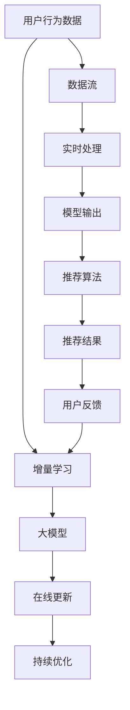

                 

# 搜索推荐系统的增量学习：大模型持续优化方法

> 关键词：搜索推荐系统,增量学习,大模型,持续优化,在线学习,增量更新,主动学习,参数在线更新,分布式优化,超参数自动调整,模型融合

## 1. 背景介绍

在当前的互联网和电子商务领域，推荐系统是支撑用户行为、提高用户体验、增加业务收入的关键技术之一。通过分析用户的历史行为、兴趣偏好，推荐系统能够自动为用户推荐相关内容，极大提升了用户满意度和平台的用户粘性。

然而，推荐系统面临两大核心挑战：一是数据量庞大且动态变化，用户行为数据实时产生并迅速积累；二是用户兴趣多变，推荐系统需要不断更新模型以适应新的用户需求和市场变化。

为此，增量学习(incremental learning)技术应运而生，它通过持续地、小批量地更新模型，实现对新数据的即时适应，避免大规模重新训练，有效解决了推荐系统的实时性和动态性问题。

增量学习在大规模推荐系统的应用，是推荐系统从离线模型训练到在线模型优化的重要突破。本文聚焦于如何利用增量学习方法对大规模推荐系统中的大模型进行持续优化，通过在线增量更新策略，提升模型的适应性和预测能力。

## 2. 核心概念与联系

### 2.1 核心概念概述

为了更好地理解增量学习如何应用到大规模推荐系统中的大模型优化，本节将介绍几个关键概念：

- **搜索推荐系统**：通过分析用户历史行为、兴趣偏好等数据，为用户推荐相关内容的技术系统。广泛应用于电商、新闻、视频等多个领域，是提升用户体验和平台收入的关键技术。

- **增量学习**：一种在线学习算法，能够实时处理新数据，持续更新模型，提升模型适应性和预测能力。特别适用于需要实时响应用户请求、动态变化的推荐系统。

- **大模型**：通过大规模数据集预训练获得的大规模神经网络模型，具有强大的表示能力，能够捕捉复杂的用户行为模式和推荐关系。

- **持续优化**：通过持续更新模型参数，提升模型在动态数据分布上的表现。大模型的持续优化，能够避免大规模重新训练，节省计算资源。

- **在线学习**：模型在接收新数据时，实时更新模型参数，以适应数据分布的变化。在线学习需要与推荐系统的实时处理和动态更新相适应。

这些核心概念共同构成了增量学习在大模型推荐系统中的应用框架，使其能够不断提升推荐效果，满足用户的实时需求。

### 2.2 核心概念原理和架构的 Mermaid 流程图



这个流程图展示了大模型在增量学习应用中的核心概念及其之间的关系：

1. 用户行为数据通过增量学习不断更新大模型的参数，适应新的数据分布。
2. 大模型通过在线更新和持续优化，不断提升预测能力。
3. 推荐系统实时处理用户行为数据，根据大模型的预测结果输出推荐结果。
4. 用户反馈被用来更新增量学习算法，进一步优化模型。

## 3. 核心算法原理 & 具体操作步骤

### 3.1 算法原理概述

增量学习在大模型推荐系统中的基本思想是通过小批量数据实时更新模型参数，避免大规模重新训练。其核心算法包括：在线学习(Online Learning)、分布式优化(Distributed Optimization)、超参数自动调整(Hyperparameter Tuning)等。

通过在线学习，模型能够实时响应新数据，持续优化预测能力。分布式优化技术，能够在大规模分布式环境中高效处理和更新模型参数，提升计算效率。超参数自动调整，能够根据数据分布的变化，动态调整模型的学习率和正则化强度，优化模型性能。

### 3.2 算法步骤详解

基于增量学习的大模型优化，通常包括以下几个关键步骤：

**Step 1: 数据准备**
- 收集用户行为数据，划分为训练集和验证集。
- 将新到达的数据流作为在线训练的输入。

**Step 2: 模型初始化**
- 根据数据分布特点，选择合适的预训练大模型作为初始化参数。
- 设置模型参数的初始值，如学习率、正则化系数等。

**Step 3: 在线更新**
- 定义在线学习算法，如随机梯度下降(Stochastic Gradient Descent)、增量梯度下降(Incremental Gradient Descent)等。
- 根据在线学习算法，对新数据进行批量处理，更新模型参数。

**Step 4: 分布式优化**
- 使用分布式优化算法，如Gossip Algorithm、Mirrored Descent等，在多个计算节点上并行更新模型参数。
- 处理数据流并行计算，减少单个节点的计算负担，提高计算效率。

**Step 5: 模型评估**
- 在验证集上对模型进行评估，计算性能指标如均方误差、准确率等。
- 根据模型性能，动态调整超参数。

**Step 6: 模型部署**
- 将优化后的模型部署到推荐系统，进行实时推荐。
- 持续收集新数据，进行在线增量更新。

以上步骤为基于增量学习的大模型优化流程，具体实现时还需结合具体推荐任务的特点，进行参数设置和算法选择。

### 3.3 算法优缺点

增量学习在大模型推荐系统中的应用，具有以下优点：

1. 实时性高。增量学习能够实时响应新数据，避免大规模重新训练，提升系统响应速度。
2. 适应性强。模型能够在动态数据分布上不断优化，提升预测能力。
3. 计算效率高。通过分布式优化，提升计算效率，降低系统资源占用。
4. 动态优化。通过超参数自动调整，动态优化模型，提升性能。

同时，该方法也存在以下局限性：

1. 数据流不均衡。增量学习依赖数据流，如果数据流不均衡，可能导致模型更新不稳定。
2. 算法复杂度高。分布式优化算法通常较为复杂，需要高精度的通信和同步机制。
3. 鲁棒性不足。增量学习依赖在线数据的连续性和稳定性，对异常数据敏感。
4. 参数更新慢。大模型参数量较大，增量更新时速度较慢，可能导致模型性能下降。
5. 超参数选择难。增量学习需要动态调整超参数，选择不当可能导致模型不稳定。

尽管存在这些局限性，增量学习仍是大模型推荐系统中的重要技术范式，尤其在需要实时响应用户请求的场景中，具有显著的优势。未来研究重点在于如何改进增量学习算法，提高其稳定性和鲁棒性。

### 3.4 算法应用领域

基于增量学习的大模型优化技术，广泛应用于以下领域：

1. 电商推荐系统：通过实时更新用户行为数据，提高推荐准确性和个性化程度。
2. 新闻推荐系统：实时捕捉用户阅读行为，为用户推荐感兴趣的新闻内容。
3. 视频推荐系统：持续优化用户观看行为，提升视频推荐效果。
4. 广告推荐系统：动态更新用户点击行为，提高广告投放效果。
5. 金融推荐系统：实时分析用户交易数据，提供个性化的金融产品推荐。

除了以上领域，增量学习在大模型推荐系统中的应用还延伸到更多领域，如社交媒体推荐、游戏推荐等，为推荐系统带来持续的创新和突破。

## 4. 数学模型和公式 & 详细讲解

### 4.1 数学模型构建

假设推荐系统的训练数据集为 $D=\{(x_i,y_i)\}_{i=1}^N$，其中 $x_i$ 为输入特征，$y_i$ 为标签。设 $M_{\theta}$ 为预训练大模型，$\theta$ 为模型参数。

定义增量学习的目标函数为：

$$
\mathcal{L}(\theta) = \frac{1}{N} \sum_{i=1}^N \ell(y_i, M_{\theta}(x_i))
$$

其中 $\ell$ 为损失函数，如均方误差、交叉熵等。

增量学习算法通常定义如下：

$$
\theta \leftarrow \theta - \eta \nabla_{\theta}\mathcal{L}(\theta)
$$

其中 $\eta$ 为学习率，$\nabla_{\theta}\mathcal{L}(\theta)$ 为损失函数对模型参数的梯度。

在增量学习中，每次更新只使用小批量数据 $(x,y)$，即 $\theta \leftarrow \theta - \eta \nabla_{\theta}\ell(y, M_{\theta}(x))$。

### 4.2 公式推导过程

假设 $(x,y)$ 为最新到达的一批数据，增量学习算法如下：

$$
\theta \leftarrow \theta - \eta \frac{\partial}{\partial \theta}\ell(y, M_{\theta}(x))
$$

其中 $\frac{\partial}{\partial \theta}\ell(y, M_{\theta}(x))$ 为损失函数对模型参数的梯度，可以展开为：

$$
\frac{\partial}{\partial \theta}\ell(y, M_{\theta}(x)) = \frac{\partial}{\partial \theta}(y - M_{\theta}(x))M_{\theta}(x)
$$

代入增量学习算法：

$$
\theta \leftarrow \theta - \eta (y - M_{\theta}(x))M_{\theta}(x)
$$

上式即为增量学习的更新公式。通过不断更新模型参数，增量学习能够实时响应新数据，提升模型性能。

### 4.3 案例分析与讲解

考虑一个新闻推荐系统的增量学习案例。假设模型输入为 $x_i$，为新闻文章标题；输出为 $y_i$，为1表示文章被用户点击，0表示未被点击。

假设模型为单层的线性回归模型，输出为 $M_{\theta}(x) = Wx + b$，其中 $W$ 为权重矩阵，$b$ 为偏置项。

假设 $\ell(y, M_{\theta}(x)) = \frac{1}{2}(y - M_{\theta}(x))^2$，则损失函数为：

$$
\mathcal{L}(\theta) = \frac{1}{N} \sum_{i=1}^N \frac{1}{2}(y_i - Wx_i - b)^2
$$

增量学习算法为：

$$
W \leftarrow W - \eta (y - Wx - b)(x + W^T(x - \frac{y}{W})) \\
b \leftarrow b - \eta (y - Wx - b)
$$

代入具体数据 $(x_i, y_i)$，即可实现增量更新。

## 5. 项目实践：代码实例和详细解释说明

### 5.1 开发环境搭建

在进行增量学习实践前，我们需要准备好开发环境。以下是使用Python进行PyTorch开发的环境配置流程：

1. 安装Anaconda：从官网下载并安装Anaconda，用于创建独立的Python环境。

2. 创建并激活虚拟环境：
```bash
conda create -n pytorch-env python=3.8 
conda activate pytorch-env
```

3. 安装PyTorch：根据CUDA版本，从官网获取对应的安装命令。例如：
```bash
conda install pytorch torchvision torchaudio cudatoolkit=11.1 -c pytorch -c conda-forge
```

4. 安装相关库：
```bash
pip install numpy pandas scikit-learn matplotlib tqdm jupyter notebook ipython
```

完成上述步骤后，即可在`pytorch-env`环境中开始增量学习实践。

### 5.2 源代码详细实现

下面以一个简单的线性回归增量学习为例，给出使用PyTorch实现的完整代码。

首先，定义增量学习的目标函数和模型：

```python
import torch
from torch import nn

# 定义模型
class LinearModel(nn.Module):
    def __init__(self, input_dim, output_dim):
        super(LinearModel, self).__init__()
        self.fc = nn.Linear(input_dim, output_dim)
        self.sigmoid = nn.Sigmoid()
    
    def forward(self, x):
        return self.sigmoid(self.fc(x))

# 定义目标函数
def loss_function(y_hat, y):
    return torch.mean((y_hat - y)**2)

# 定义增量学习更新函数
def update_model(model, x, y, learning_rate=0.01):
    y_hat = model(x)
    loss = loss_function(y_hat, y)
    model.zero_grad()
    loss.backward()
    with torch.no_grad():
        model.fc.weight -= learning_rate * (y_hat - y) * y_hat * (1 - y_hat)
        model.fc.bias -= learning_rate * (y_hat - y)
```

然后，进行数据准备和模型初始化：

```python
# 数据准备
x = torch.tensor([[0.], [1.]])
y = torch.tensor([[0.], [1.]])

# 模型初始化
model = LinearModel(input_dim=1, output_dim=1)
model.fc.weight = torch.ones(1, 1)
model.fc.bias = torch.zeros(1)
```

接着，进行增量学习训练：

```python
# 训练轮数
epochs = 100

# 循环训练
for epoch in range(epochs):
    update_model(model, x, y)
    
    # 每10轮输出一次结果
    if epoch % 10 == 0:
        print(f"Epoch {epoch+1}, Loss: {loss_function(model(x), y).item()}")
```

以上代码实现了基本的线性回归增量学习过程，通过不断更新模型参数，逼近真实函数。

### 5.3 代码解读与分析

让我们再详细解读一下关键代码的实现细节：

**LinearModel类**：
- `__init__`方法：初始化模型结构，包括线性层和激活函数。
- `forward`方法：定义前向传播过程，通过线性层计算输出。

**loss_function函数**：
- 定义均方误差损失函数，用于衡量预测值和真实值之间的差异。

**update_model函数**：
- 计算损失函数，反向传播更新模型参数。
- 使用参数更新公式，实现增量更新。
- 通过`torch.no_grad`避免在更新过程中累加梯度。

**训练流程**：
- 循环迭代进行增量学习，每次更新模型参数。
- 每10轮输出一次训练结果，监控模型性能。

可以看到，PyTorch提供的自动微分和优化器，使得增量学习的实现变得简单高效。开发者只需专注于模型的结构和增量更新算法，而不必过多关注底层的实现细节。

当然，工业级的系统实现还需考虑更多因素，如模型保存和部署、超参数搜索、分布式优化等。但核心的增量学习范式基本与此类似。

## 6. 实际应用场景

### 6.1 电商推荐系统

电商推荐系统通常需要实时处理大量的用户行为数据，动态更新推荐模型。基于增量学习的大模型优化技术，可以显著提升推荐系统的实时性和动态性。

在实践中，电商推荐系统通常采集用户浏览、点击、购买等行为数据，通过增量学习对大模型进行在线更新。每次用户行为数据到达时，增量学习算法会自动更新模型参数，实时调整推荐策略。同时，模型能够不断适应新用户和变化的市场趋势，提升推荐效果。

### 6.2 新闻推荐系统

新闻推荐系统需要根据用户的历史阅读行为，实时推荐感兴趣的新闻内容。增量学习技术能够实时捕捉用户阅读行为，动态更新推荐模型，提升推荐准确性。

具体而言，新闻推荐系统可以实时记录用户点击、分享、评论等行为数据，通过增量学习对大模型进行在线更新。每次用户行为数据到达时，增量学习算法会自动更新模型参数，实时调整推荐策略。同时，模型能够不断适应用户兴趣的变化，提升新闻推荐效果。

### 6.3 视频推荐系统

视频推荐系统需要实时分析用户观看行为，动态推荐感兴趣的视频内容。增量学习技术能够实时捕捉用户观看行为，动态更新推荐模型，提升推荐效果。

具体而言，视频推荐系统可以实时记录用户观看时间、暂停次数、快进/快退等行为数据，通过增量学习对大模型进行在线更新。每次用户行为数据到达时，增量学习算法会自动更新模型参数，实时调整推荐策略。同时，模型能够不断适应用户观看行为的变化，提升视频推荐效果。

### 6.4 未来应用展望

随着增量学习技术的发展，基于大模型的推荐系统将在更多领域得到应用，为推荐系统带来新的突破。

在智慧医疗领域，推荐系统可以实时分析患者历史诊疗数据，动态推荐个性化的诊疗方案。基于增量学习的大模型优化技术，可以实时响应新的诊疗数据，提升推荐效果。

在智能教育领域，推荐系统可以实时捕捉学生的学习行为，动态推荐个性化的学习资源。基于增量学习的大模型优化技术，可以实时响应学生学习行为的变化，提升推荐效果。

在智慧城市治理中，推荐系统可以实时分析城市事件数据，动态推荐应急响应策略。基于增量学习的大模型优化技术，可以实时响应城市事件的变化，提升推荐效果。

除了以上领域，增量学习在大模型推荐系统中的应用还延伸到更多领域，如金融推荐、社交推荐等，为推荐系统带来持续的创新和突破。

## 7. 工具和资源推荐

### 7.1 学习资源推荐

为了帮助开发者系统掌握增量学习在大模型推荐系统中的应用，这里推荐一些优质的学习资源：

1. 《深度学习》课程：由斯坦福大学开设的深度学习经典课程，涵盖了深度学习的基本概念和算法，适合初学者入门。

2. 《在线学习》书籍：介绍在线学习的基本原理和算法，包括增量学习、分布式优化等，适合进一步深入学习。

3. 《深度推荐系统：算法与实战》书籍：详细介绍了推荐系统中的增量学习、分布式优化、超参数调整等技术，适合实践开发。

4. HuggingFace官方文档：HuggingFace开发的Transformers库的官方文档，提供了丰富的预训练语言模型和增量学习样例代码，是上手实践的必备资料。

5. Kaggle竞赛：Kaggle上有很多推荐系统竞赛，参与竞赛可以获得实际问题解决的经验，提升技术水平。

通过对这些资源的学习实践，相信你一定能够快速掌握增量学习在大模型推荐系统中的应用技巧，并用于解决实际的推荐问题。

### 7.2 开发工具推荐

高效的开发离不开优秀的工具支持。以下是几款用于增量学习开发的常用工具：

1. PyTorch：基于Python的开源深度学习框架，灵活动态的计算图，适合快速迭代研究。支持增量学习、分布式优化等功能。

2. TensorFlow：由Google主导开发的开源深度学习框架，生产部署方便，适合大规模工程应用。支持增量学习、分布式优化等功能。

3. Weights & Biases：模型训练的实验跟踪工具，可以记录和可视化模型训练过程中的各项指标，方便对比和调优。

4. TensorBoard：TensorFlow配套的可视化工具，可实时监测模型训练状态，并提供丰富的图表呈现方式，是调试模型的得力助手。

5. Elasticsearch：高性能的分布式搜索系统，支持增量数据索引和查询，适合大模型推荐系统的在线更新。

合理利用这些工具，可以显著提升增量学习开发和优化的效率，加速模型创新的步伐。

### 7.3 相关论文推荐

增量学习在大规模推荐系统中的应用，源于学界的持续研究。以下是几篇奠基性的相关论文，推荐阅读：

1. Online Passive-Aggressive Algorithms（2006）：提出在线学习的基本算法，奠定了增量学习的理论基础。

2. Incremental Stochastic Gradient Descent Techniques for Big Data（2013）：讨论增量学习在大规模数据上的应用，提出增量梯度下降等算法。

3. Online Learning with Adaptive Error Rates：Faster Rates for Mini-Batch Stochastic Gradient Descent with Constant Statistics（2011）：提出适应性误差率的学习算法，提高增量学习的收敛速度。

4. SAGA: A Fast Incremental Gradient Method with Support for Non-Strongly Convex Composite Objectives（2014）：提出SAGA算法，提升增量学习的计算效率。

5. A Distributed Variance Reduction Algorithm for Online Learning with Stochastic Momentum（2015）：提出分布式增量学习算法，支持大规模分布式训练。

这些论文代表了大规模推荐系统中增量学习的理论演进，帮助研究者把握学科前进方向，激发更多的创新灵感。

## 8. 总结：未来发展趋势与挑战

### 8.1 研究成果总结

本文对基于增量学习的大模型优化方法进行了全面系统的介绍。首先阐述了增量学习在大模型推荐系统中的应用背景和意义，明确了增量学习在大模型优化中的独特价值。其次，从原理到实践，详细讲解了增量学习的数学原理和关键步骤，给出了增量学习任务开发的完整代码实例。同时，本文还广泛探讨了增量学习在大模型推荐系统中的应用前景，展示了增量学习范式的巨大潜力。

通过本文的系统梳理，可以看到，基于增量学习的大模型优化方法正在成为推荐系统中的重要技术范式，极大地提升了推荐系统的实时性和动态性，满足了用户的实时需求。未来，伴随增量学习方法的不断进步，推荐系统必将在更多领域得到应用，为推荐系统带来持续的创新和突破。

### 8.2 未来发展趋势

展望未来，增量学习在大模型推荐系统中的应用将呈现以下几个发展趋势：

1. 分布式优化成为主流。随着分布式计算技术的进步，增量学习在大模型推荐系统中的应用将更多地依赖分布式优化，提升计算效率。

2. 在线学习算法优化。未来增量学习算法将不断优化，以适应大规模数据流的实时更新，提升模型稳定性和鲁棒性。

3. 动态超参数调整。增量学习需要动态调整超参数，以适应数据分布的变化。未来研究将更多地关注超参数自动调整技术，提升模型性能。

4. 模型融合与泛化。增量学习模型可以与其他模型进行融合，提升模型的泛化能力和适应性。

5. 实时化、自适应化。增量学习将更加实时化和自适应化，满足动态数据流的实时处理需求。

6. 跨领域迁移。增量学习模型将能够跨领域迁移，适应不同领域的推荐任务。

这些趋势凸显了增量学习在大模型推荐系统中的广泛应用前景，这些方向的探索发展，将进一步提升推荐系统的性能和应用范围，为推荐系统带来持续的创新和突破。

### 8.3 面临的挑战

尽管增量学习在大模型推荐系统中的应用已经取得了一定进展，但在迈向更加智能化、普适化应用的过程中，它仍面临着诸多挑战：

1. 数据流不均衡。增量学习依赖数据流，如果数据流不均衡，可能导致模型更新不稳定。

2. 算法复杂度高。分布式优化算法通常较为复杂，需要高精度的通信和同步机制。

3. 鲁棒性不足。增量学习依赖在线数据的连续性和稳定性，对异常数据敏感。

4. 参数更新慢。大模型参数量较大，增量更新时速度较慢，可能导致模型性能下降。

5. 超参数选择难。增量学习需要动态调整超参数，选择不当可能导致模型不稳定。

尽管存在这些挑战，增量学习仍是大模型推荐系统中的重要技术范式，尤其在需要实时响应用户请求的场景中，具有显著的优势。未来研究重点在于如何改进增量学习算法，提高其稳定性和鲁棒性。

### 8.4 研究展望

面对增量学习在大模型推荐系统中面临的挑战，未来的研究需要在以下几个方面寻求新的突破：

1. 探索无监督和半监督增量学习方法。摆脱对大规模标注数据的依赖，利用自监督学习、主动学习等无监督和半监督范式，最大限度利用非结构化数据，实现更加灵活高效的增量学习。

2. 研究增量学习算法的优化。开发更加参数高效的增量学习算法，在固定大部分预训练参数的同时，只更新极少量的任务相关参数。同时优化增量学习模型的计算图，减少前向传播和反向传播的资源消耗，实现更加轻量级、实时性的部署。

3. 引入更多先验知识。将符号化的先验知识，如知识图谱、逻辑规则等，与神经网络模型进行巧妙融合，引导增量学习过程学习更准确、合理的语言模型。同时加强不同模态数据的整合，实现视觉、语音等多模态信息与文本信息的协同建模。

4. 结合因果分析和博弈论工具。将因果分析方法引入增量学习模型，识别出模型决策的关键特征，增强输出解释的因果性和逻辑性。借助博弈论工具刻画人机交互过程，主动探索并规避模型的脆弱点，提高系统稳定性。

5. 纳入伦理道德约束。在增量学习目标中引入伦理导向的评估指标，过滤和惩罚有偏见、有害的输出倾向。同时加强人工干预和审核，建立模型行为的监管机制，确保输出符合人类价值观和伦理道德。

这些研究方向的探索，必将引领增量学习技术迈向更高的台阶，为构建安全、可靠、可解释、可控的智能系统铺平道路。面向未来，增量学习技术还需要与其他人工智能技术进行更深入的融合，如知识表示、因果推理、强化学习等，多路径协同发力，共同推动推荐系统的进步。只有勇于创新、敢于突破，才能不断拓展增量学习边界的，让智能技术更好地造福人类社会。

## 9. 附录：常见问题与解答

**Q1：增量学习与批量学习有何区别？**

A: 批量学习(batch learning)是指在每次训练过程中，使用全部数据进行更新，具有计算开销大、更新频率低的特点。而增量学习(incremental learning)是指在每次训练过程中，只使用最新到达的数据进行更新，具有实时响应、更新频繁的特点。

**Q2：增量学习中的学习率如何设置？**

A: 增量学习中的学习率通常较小，以避免破坏预训练权重。一般建议从1e-5开始调参，逐步减小学习率，直至收敛。同时可以使用warmup策略，在开始阶段使用较小的学习率，再逐渐过渡到预设值。

**Q3：增量学习中如何处理异常数据？**

A: 增量学习依赖在线数据的连续性和稳定性，对异常数据敏感。一般做法是在更新前先对数据进行清洗，过滤掉异常值和噪声。同时，可以在模型中引入鲁棒性较强的算法，如Dropout、AdaGrad等，减少异常数据的影响。

**Q4：增量学习中的参数更新速度如何优化？**

A: 增量学习中的参数更新速度较慢，可以通过以下方法优化：
1. 使用更高效的优化器，如Adam、RMSprop等。
2. 使用梯度累积技术，减少单个样本的更新次数。
3. 使用分布式计算，提升计算效率。

**Q5：增量学习中的超参数调整如何进行？**

A: 增量学习中的超参数调整可以通过以下方法：
1. 在训练过程中实时调整超参数，如学习率、正则化系数等。
2. 使用自动调参算法，如Hyperband、Bayesian Optimization等，自动搜索最优超参数。
3. 结合在线学习算法，动态调整超参数。

这些方法可以帮助增量学习模型更好地适应数据分布的变化，提升模型性能。

---

作者：禅与计算机程序设计艺术 / Zen and the Art of Computer Programming

