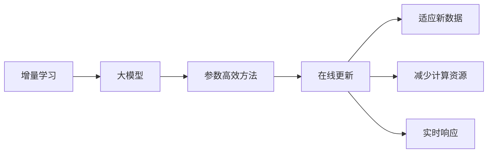
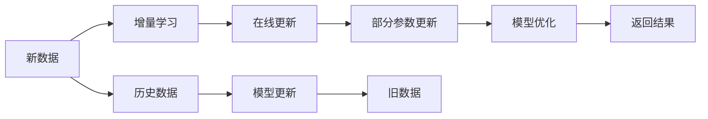

                 

# 搜索推荐系统的增量学习：大模型的持续适应机制

> 关键词：增量学习,大模型,持续适应机制,推荐系统,搜索,用户行为分析

## 1. 背景介绍

### 1.1 问题由来

随着互联网技术的迅猛发展，搜索推荐系统(Recommender System)在电商、视频、音乐等线上平台中扮演着越来越重要的角色。这些系统通过分析用户的历史行为数据，预测其未来的兴趣偏好，从而为其推荐个性化的内容。然而，随着用户偏好的快速变化和环境因素的动态影响，传统的推荐算法难以实时更新，无法满足用户对新鲜和多样内容的需求。

为了应对这一挑战，研究人员提出了增量学习(Incremental Learning)的方法，能够动态地更新推荐模型，持续地适应用户行为和环境的变化。增量学习与传统的批量学习不同，它可以在每次新数据到来时更新模型，并且只需要更新模型中与新数据相关的部分，从而避免了计算资源的大量浪费。

## 2. 核心概念与联系

### 2.1 核心概念概述

增量学习是指在模型训练过程中，不断地利用新数据进行在线学习，更新模型参数，以保持模型的准确性和时效性。相对于批量学习，增量学习可以实时地适应环境变化，满足用户的即时需求，具有更强的实时性和灵活性。

增量学习在大模型中的应用尤为广泛。大模型，特别是基于Transformer架构的模型，由于参数量庞大，难以在每次新数据到来时全部重新训练。因此，研究人员提出了多种参数高效的增量学习方法，通过仅更新部分模型参数，实现快速、高效的在线学习。

以下是大模型增量学习的核心概念图：



该图展示了增量学习与大模型之间的联系：增量学习可以用于大模型中，通过参数高效的方法实时更新模型，快速适应新数据，减少计算资源消耗，提升实时响应速度。

### 2.2 核心概念原理和架构的 Mermaid 流程图



该图展示了大模型增量学习的具体流程：新数据到来时，增量学习模块在线更新模型，只更新与新数据相关的部分参数，然后通过优化算法更新模型参数，最终返回新数据的结果。同时，历史数据也会被用来更新旧数据，确保模型能够持续适应用户行为和环境的变化。

## 3. 核心算法原理 & 具体操作步骤

### 3.1 算法原理概述

大模型的增量学习方法通常基于以下步骤：

1. **数据预处理**：对新数据进行预处理，包括特征提取、归一化、标签处理等。
2. **在线更新**：根据新数据的特征和标签，计算梯度并更新模型参数。
3. **模型优化**：使用优化算法（如AdamW、SGD等）更新模型参数，确保模型收敛。
4. **性能评估**：在新数据上评估模型性能，确保模型效果稳定。

增量学习的核心在于如何有效地更新模型，同时保持模型的准确性和稳定性。常用的方法包括在线梯度下降(Online Gradient Descent)、增量矩阵分解、自适应学习率调整等。

### 3.2 算法步骤详解

以下是一个典型的增量学习过程的详细步骤：

1. **数据预处理**：
    - 读取新数据集，将其转换为模型所需的数据格式。
    - 提取特征，并进行归一化处理。
    - 将标签转换为模型可识别的格式。

2. **在线更新**：
    - 计算新数据的梯度。
    - 根据梯度更新模型参数，更新部分参数以避免计算资源的浪费。

3. **模型优化**：
    - 使用优化算法（如AdamW）进行参数更新，确保模型收敛。
    - 设置学习率衰减策略，防止模型过拟合。

4. **性能评估**：
    - 在新数据上评估模型性能，如准确率、召回率等。
    - 根据性能评估结果调整模型参数，进行迭代优化。

### 3.3 算法优缺点

增量学习在大模型中的应用具有以下优点：

- **实时响应**：能够快速响应新数据，实时更新模型，提升用户满意度。
- **减少计算资源消耗**：只需要更新部分参数，避免了计算资源的浪费。
- **模型稳定**：通过增量更新，模型能够持续适应新数据，保持较高的稳定性和准确性。

然而，增量学习也存在一些缺点：

- **更新复杂**：需要设计高效的在线更新算法，避免模型参数更新不一致。
- **收敛速度较慢**：增量更新通常收敛速度较慢，需要更多迭代次数。
- **数据分布变化**：如果新数据分布与旧数据分布差异较大，增量更新可能会导致模型性能下降。

### 3.4 算法应用领域

增量学习在大模型中的应用广泛，主要集中在以下几个领域：

1. **推荐系统**：实时更新推荐模型，根据用户新行为推荐个性化内容。
2. **搜索系统**：动态调整搜索结果排序，实时响应用户查询。
3. **广告投放**：实时优化广告投放策略，提升广告点击率和转化率。
4. **金融风控**：实时更新风险模型，防范潜在风险。
5. **医疗诊断**：动态调整诊断模型，实时更新临床数据。

以上领域都面临着快速变化的数据和环境，增量学习方法能够实时响应新数据，提升模型性能和用户满意度。

## 4. 数学模型和公式 & 详细讲解

### 4.1 数学模型构建

增量学习的数学模型可以表示为：

$$
\theta_{t+1} = \theta_t - \alpha \nabla_{\theta} L(\theta_t, S_t)
$$

其中，$\theta_t$ 表示当前模型的参数，$\alpha$ 表示学习率，$\nabla_{\theta} L(\theta_t, S_t)$ 表示新数据 $S_t$ 对模型 $\theta_t$ 的梯度，$\theta_{t+1}$ 表示更新后的模型参数。

### 4.2 公式推导过程

以在线梯度下降算法为例，公式推导过程如下：

$$
\theta_{t+1} = \theta_t - \alpha \frac{1}{|S_t|} \sum_{(x_i, y_i) \in S_t} \nabla_{\theta} L(\theta_t, (x_i, y_i))
$$

其中，$|S_t|$ 表示新数据集 $S_t$ 的大小，$\alpha$ 表示学习率。

### 4.3 案例分析与讲解

以推荐系统为例，假设用户 $i$ 对物品 $j$ 的评分向量为 $x_i \in \mathbb{R}^n$，模型参数为 $\theta$，则推荐模型的预测值为：

$$
\hat{y}_{ij} = \sigma(\theta^T x_i)
$$

其中，$\sigma$ 表示 sigmoid 函数，$\hat{y}_{ij}$ 表示用户 $i$ 对物品 $j$ 的预测评分。

在新数据到来时，假设用户 $i$ 对物品 $j$ 的评分向量更新为 $x_i'$，则模型参数更新公式为：

$$
\theta \leftarrow \theta - \alpha \frac{1}{|S_t|} \sum_{(x_i, y_i) \in S_t} \nabla_{\theta} L(\theta, (x_i, y_i))
$$

其中，$L$ 表示损失函数，如均方误差损失。

## 5. 项目实践：代码实例和详细解释说明

### 5.1 开发环境搭建

在进行增量学习实践前，我们需要准备好开发环境。以下是使用Python进行PyTorch开发的环境配置流程：

1. 安装Anaconda：从官网下载并安装Anaconda，用于创建独立的Python环境。

2. 创建并激活虚拟环境：
```bash
conda create -n pytorch-env python=3.8 
conda activate pytorch-env
```

3. 安装PyTorch：根据CUDA版本，从官网获取对应的安装命令。例如：
```bash
conda install pytorch torchvision torchaudio cudatoolkit=11.1 -c pytorch -c conda-forge
```

4. 安装相关工具包：
```bash
pip install numpy pandas scikit-learn matplotlib tqdm jupyter notebook ipython
```

完成上述步骤后，即可在`pytorch-env`环境中开始增量学习实践。

### 5.2 源代码详细实现

以下是一个简单的增量学习代码实现，用于在线更新一个线性回归模型。

```python
import numpy as np
from sklearn.linear_model import LinearRegression
from sklearn.metrics import mean_squared_error

# 初始化模型
model = LinearRegression()

# 定义在线更新函数
def online_update(model, X, y, alpha=0.01):
    # 计算梯度
    gradient = np.dot(X.T, X) @ model.coef_ - np.dot(X.T, y)
    # 更新模型参数
    model.coef_ -= alpha * gradient

# 读取数据
X = np.array([[1], [2], [3], [4]])
y = np.array([2, 4, 6, 8])

# 在线更新模型
online_update(model, X, y)

# 评估模型性能
y_pred = model.predict(X)
mse = mean_squared_error(y, y_pred)
print("MSE:", mse)
```

### 5.3 代码解读与分析

以上代码实现了在线更新一个线性回归模型的基本流程。

**在线更新函数**：
- 首先计算梯度：$\nabla_{\theta} L(\theta, (x_i, y_i)) = X_i^T X \theta - X_i^T y$
- 然后更新模型参数：$\theta \leftarrow \theta - \alpha \nabla_{\theta} L(\theta, (x_i, y_i))$

**数据读取**：
- 读取训练数据 $X$ 和标签 $y$，并定义模型。

**模型更新**：
- 调用在线更新函数，更新模型参数。

**模型评估**：
- 使用均方误差评估模型性能，输出结果。

可以看到，在线更新过程相对简洁高效，只需要更新模型参数与新数据相关的部分。这在大模型增量学习中尤为适用，能够显著减少计算资源消耗，提升实时响应速度。

## 6. 实际应用场景

### 6.1 实时推荐系统

基于大模型的增量学习技术，可以构建实时推荐系统，及时响应用户需求。例如，电商平台的商品推荐系统，可以实时分析用户点击、购买行为，更新推荐模型，向用户推荐个性化的商品。这种实时推荐的系统，能够提升用户购物体验，增加销售额。

### 6.2 广告投放优化

在大模型的基础上，利用增量学习技术，可以实时优化广告投放策略。例如，在广告投放前，分析用户的历史行为和兴趣偏好，进行模型训练。广告投放后，实时更新模型，根据用户点击反馈调整广告投放策略，提升广告效果。

### 6.3 医疗诊断

在医疗领域，利用大模型增量学习技术，可以实时更新临床诊断模型。例如，在医生诊断过程中，实时记录患者的临床数据，更新诊断模型，提升诊断准确性。这种实时诊断系统，能够帮助医生快速做出正确的诊断，提高医疗服务质量。

### 6.4 未来应用展望

随着大模型和增量学习技术的不断进步，未来的应用场景将更加丰富。以下是对未来应用场景的展望：

1. **智能搜索**：实时更新搜索模型，根据用户查询内容，动态调整搜索结果，提升搜索体验。

2. **金融交易**：实时更新风险模型，实时监控交易数据，防范潜在风险，提升交易安全。

3. **智能客服**：实时更新对话模型，根据用户对话内容，动态调整回复策略，提升客户满意度。

4. **智慧城市**：实时更新交通、环境监测模型，根据实时数据，优化城市管理，提升城市运营效率。

5. **教育个性化**：实时更新推荐模型，根据学生学习情况，动态调整学习内容，提升学习效果。

## 7. 工具和资源推荐

### 7.1 学习资源推荐

为了帮助开发者系统掌握增量学习和大模型的技术，这里推荐一些优质的学习资源：

1. 《深度学习理论与实践》系列博文：由深度学习领域专家撰写，深入浅出地介绍了增量学习的基本原理和算法。

2. 《深度学习》课程：斯坦福大学开设的深度学习课程，涵盖深度学习基础、增量学习等内容，适合初学者和进阶者。

3. 《深度学习与推荐系统》书籍：介绍了深度学习在推荐系统中的应用，包括增量学习等前沿技术。

4. 《在线学习理论与算法》书籍：详细介绍了在线学习的理论基础和算法实现，适合深入学习。

5. HuggingFace官方文档：提供了多种预训练大模型的增量学习样例代码，是上手实践的必备资料。

通过对这些资源的学习实践，相信你一定能够快速掌握增量学习和大模型的精髓，并用于解决实际的推荐系统问题。

### 7.2 开发工具推荐

高效的开发离不开优秀的工具支持。以下是几款用于增量学习和大模型开发的常用工具：

1. PyTorch：基于Python的开源深度学习框架，灵活动态的计算图，适合快速迭代研究。大部分预训练大模型都有PyTorch版本的实现。

2. TensorFlow：由Google主导开发的开源深度学习框架，生产部署方便，适合大规模工程应用。同样有丰富的预训练大模型资源。

3. Weights & Biases：模型训练的实验跟踪工具，可以记录和可视化模型训练过程中的各项指标，方便对比和调优。与主流深度学习框架无缝集成。

4. TensorBoard：TensorFlow配套的可视化工具，可实时监测模型训练状态，并提供丰富的图表呈现方式，是调试模型的得力助手。

5. Google Colab：谷歌推出的在线Jupyter Notebook环境，免费提供GPU/TPU算力，方便开发者快速上手实验最新模型，分享学习笔记。

合理利用这些工具，可以显著提升增量学习和大模型的开发效率，加快创新迭代的步伐。

### 7.3 相关论文推荐

增量学习和大模型技术的发展源于学界的持续研究。以下是几篇奠基性的相关论文，推荐阅读：

1. Incremental Training of Deep Neural Networks: A Review（增量深度学习综述）：总结了增量学习的基本原理和常用算法，适合了解增量学习的基础。

2. Online Passive Aggressive Algorithms（在线随机梯度下降）：提出了一种高效的在线学习算法，适合理解增量学习的核心思想。

3. Online Convex Programming and Generalized Inverses（在线凸优化）：探讨了在线凸优化算法，为增量学习提供了理论基础。

4. Deep Learning with SGD for Recommendation Systems（基于SGD的推荐系统）：介绍了深度学习在推荐系统中的应用，包括增量学习等前沿技术。

5. Incremental Learning in Deep Networks: A New Perspective（深度网络增量学习）：提出了一种新的增量学习方法，适合深入理解增量学习的细节。

这些论文代表了大模型增量学习技术的发展脉络。通过学习这些前沿成果，可以帮助研究者把握学科前进方向，激发更多的创新灵感。

## 8. 总结：未来发展趋势与挑战

### 8.1 总结

本文对基于增量学习的大模型技术进行了全面系统的介绍。首先阐述了大模型和增量学习的背景和意义，明确了增量学习在大模型中的重要价值。其次，从原理到实践，详细讲解了增量学习的数学原理和操作步骤，给出了增量学习任务开发的完整代码实例。同时，本文还广泛探讨了增量学习在大模型中的应用场景，展示了增量学习范式的巨大潜力。

通过本文的系统梳理，可以看到，基于增量学习的大模型技术正在成为推荐系统的重要范式，极大地拓展了预训练大模型的应用边界，催生了更多的落地场景。受益于大模型的庞大参数量和高效的增量学习技术，增量学习模型能够实时响应新数据，持续地适应用户行为和环境的变化，提升模型的准确性和时效性。未来，伴随大模型和增量学习技术的进一步发展，基于增量学习的大模型必将在更多领域得到应用，为构建实时、动态、智能的系统奠定坚实的基础。

### 8.2 未来发展趋势

展望未来，增量学习在大模型中的应用将呈现以下几个发展趋势：

1. **实时性增强**：增量学习技术将更加注重实时响应能力，能够快速适应新数据，实时更新模型。

2. **模型参数优化**：通过参数高效方法，如参数剪枝、Adapter等，减少模型参数量，提高计算效率和实时性。

3. **多模态融合**：增量学习技术将拓展到多模态数据，如文本、图像、语音等，实现不同模态数据的协同建模。

4. **分布式训练**：增量学习技术将采用分布式训练方法，提高训练速度，实现大规模模型的在线更新。

5. **自适应学习率**：通过自适应学习率调整方法，如Adaptive Moment Estimation (AdamW)等，提高模型收敛速度，减少计算资源消耗。

6. **增量学习框架**：开发更加灵活、易于扩展的增量学习框架，方便开发者实现不同类型的增量学习算法。

以上趋势凸显了增量学习在大模型中的广阔前景。这些方向的探索发展，必将进一步提升增量学习模型的性能和应用范围，为构建智能、动态的系统提供新的技术路径。

### 8.3 面临的挑战

尽管增量学习在大模型中的应用已经取得了显著成效，但在迈向更加智能化、普适化应用的过程中，它仍面临着诸多挑战：

1. **数据分布变化**：如果新数据分布与旧数据分布差异较大，增量学习可能会导致模型性能下降。

2. **模型复杂性**：大模型由于参数量庞大，难以快速更新，需要设计高效的在线更新算法。

3. **计算资源消耗**：增量学习需要实时更新模型，计算资源消耗较大，需要优化资源利用。

4. **模型收敛速度**：增量学习通常收敛速度较慢，需要更多的迭代次数。

5. **模型可解释性**：增量学习模型难以解释其内部工作机制和决策逻辑，缺乏可解释性。

6. **安全性和隐私保护**：增量学习模型可能学习到有害信息，带来安全隐患，需要加强数据保护和模型安全。

正视增量学习面临的这些挑战，积极应对并寻求突破，将是大模型增量学习走向成熟的必由之路。相信随着学界和产业界的共同努力，这些挑战终将一一被克服，增量学习模型必将在构建智能系统方面发挥更大的作用。

### 8.4 研究展望

面对增量学习面临的挑战，未来的研究需要在以下几个方面寻求新的突破：

1. **在线更新算法优化**：设计更高效的在线更新算法，减少计算资源消耗，提高模型收敛速度。

2. **自适应学习率调整**：开发自适应学习率调整方法，提高模型收敛速度，避免过拟合。

3. **参数高效方法**：开发参数高效方法，如Adapter、Prefix等，在减少参数量的情况下，实现高效的增量更新。

4. **多模态数据融合**：将增量学习技术拓展到多模态数据，实现不同模态数据的协同建模。

5. **分布式训练优化**：优化分布式训练方法，提高增量学习模型的实时性和计算效率。

6. **模型可解释性**：开发可解释性较强的增量学习模型，提升模型的透明性和可信度。

7. **安全性和隐私保护**：加强增量学习模型的安全性保护，确保数据和模型的安全。

这些研究方向的探索，必将引领增量学习技术迈向更高的台阶，为构建安全、可靠、可解释、可控的智能系统铺平道路。面向未来，增量学习技术还需要与其他人工智能技术进行更深入的融合，如因果推理、强化学习等，多路径协同发力，共同推动智能交互系统的进步。只有勇于创新、敢于突破，才能不断拓展增量学习模型的边界，让智能技术更好地造福人类社会。

## 9. 附录：常见问题与解答

**Q1：增量学习是否适用于所有推荐系统？**

A: 增量学习适用于数据量较大且持续更新的推荐系统，如电商推荐、视频推荐等。但对于数据量较小且更新较少的系统，如静态推荐系统，可能无需使用增量学习。

**Q2：增量学习如何保证模型参数更新的一致性？**

A: 增量学习通常使用在线梯度下降算法，每次更新模型参数时只更新与新数据相关的部分。为了保证参数更新的一致性，需要设计高效的在线更新算法，如Mini-Batch梯度下降、增量矩阵分解等。

**Q3：增量学习如何应对数据分布变化？**

A: 增量学习通常使用在线梯度下降算法，每次更新模型参数时只更新与新数据相关的部分。为了应对数据分布变化，可以使用增量学习框架，动态调整模型参数，保持模型的稳定性和准确性。

**Q4：增量学习在实际应用中需要注意哪些问题？**

A: 在实际应用中，增量学习需要注意以下几个问题：
1. 数据预处理：确保新数据与旧数据具有相同的特征和标签格式。
2. 在线更新算法：选择适合的在线更新算法，确保模型参数更新的一致性。
3. 模型优化：使用优化算法（如AdamW）更新模型参数，确保模型收敛。
4. 性能评估：在新数据上评估模型性能，确保模型效果稳定。

增量学习需要从数据预处理、在线更新、模型优化等多个环节进行全面优化，才能实现高效、稳定的增量更新。

**Q5：增量学习在大模型中的应用有哪些具体案例？**

A: 增量学习在大模型中的应用具体案例包括：
1. 电商推荐系统：实时分析用户点击、购买行为，更新推荐模型，提升推荐效果。
2. 广告投放优化：实时优化广告投放策略，根据用户点击反馈调整广告投放策略，提升广告效果。
3. 医疗诊断：实时更新临床诊断模型，根据患者临床数据，提升诊断准确性。
4. 智慧城市：实时更新交通、环境监测模型，根据实时数据，优化城市管理，提升城市运营效率。

增量学习能够实时响应新数据，持续地适应用户行为和环境的变化，提升模型的准确性和时效性。

---

作者：禅与计算机程序设计艺术 / Zen and the Art of Computer Programming

