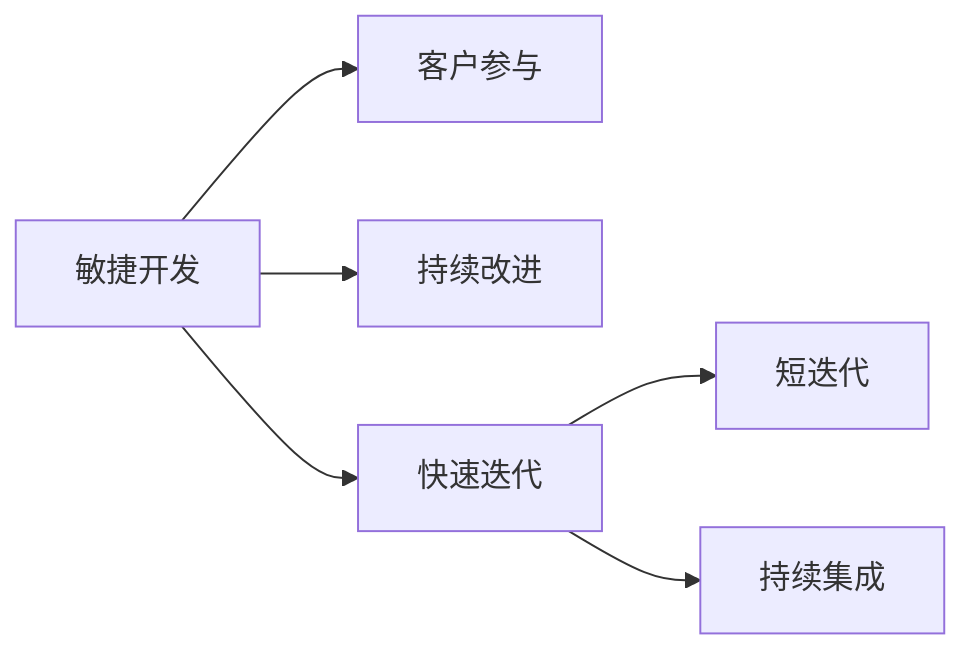

                 

**敏捷开发与快速迭代原理与代码实战案例讲解**

**作者：禅与计算机程序设计艺术 / Zen and the Art of Computer Programming**

## 1. 背景介绍

在当今快速变化的软件开发领域，敏捷开发和快速迭代已经成为主流。这些方法强调灵活性、客户参与和持续改进，以适应不断变化的需求和市场。本文将深入探讨敏捷开发和快速迭代的原理，并通过代码实战案例进行讲解。

## 2. 核心概念与联系

### 2.1 敏捷开发与快速迭代的关系


**Mermaid 代码：**


### 2.2 敏捷开发十二原则

1. 个体和互动高于流程和工具
2. 工作软件高于详尽的文档
3. 与客户合作以响应变化
4. 定期与客户合作以交付可工作软件
5. 信任来自团队成员的卓越能力
6. 最佳的动机来自团队成员的自治
7. 定期的结对编程辅助整个开发过程
8. 定期的集成以保持稳定的进度
9. 坚持简单设计
10. 最好的设计来自自组织的团队
11. 团队在最后可能几分钟内添加额外的功能
12. 定期的反思以回顾和调整行为，以获得持续的进步

## 3. 核心算法原理 & 具体操作步骤

### 3.1 快速迭代原理概述

快速迭代是敏捷开发的关键组成部分，它强调在短时间内完成可工作软件的交付。快速迭代的目标是减少开发周期，提高客户满意度，并允许开发团队快速响应变化的需求。

### 3.2 快速迭代步骤详解

1. **规划**：确定迭代的目标和范围。
2. **设计**：设计迭代中要开发的功能。
3. **实现**：编写代码并完成单元测试。
4. **集成**：集成新代码并进行集成测试。
5. **验收**：客户验收新功能。
6. **反思**：回顾迭代过程，寻找改进之处。

### 3.3 快速迭代优缺点

**优点**：
- 快速交付可工作软件
- 灵活响应变化的需求
- 客户参与度高
- 团队士气高

**缺点**：
- 可能导致功能不完整
- 需要高度自律的团队
- 需要额外的测试和维护工作

### 3.4 快速迭代应用领域

快速迭代适用于任何需要快速交付和灵活响应变化需求的项目，如：

- Web 应用开发
- 移动应用开发
- 云服务开发
- 物联网项目

## 4. 数学模型和公式 & 详细讲解 & 举例说明

### 4.1 敏捷开发速率模型

敏捷开发速率模型用于预测敏捷开发团队的生产率。该模型基于以下公式：

$$V = \frac{Story\ Points}{Time\ Period}$$

其中，Story Points 是开发团队在特定时间段内完成的功能点数，Time Period 是该时间段的长度（通常以周为单位）。

**举例**：假设一个敏捷开发团队在一周内完成了 30 个 Story Points 的工作。根据敏捷开发速率模型，该团队的生产率为：

$$V = \frac{30\ Story\ Points}{1\ week} = 30\ Story\ Points/week$$

### 4.2 Burndown Chart

Burndown Chart 是一种可视化工具，用于跟踪敏捷开发项目的进度。Burndown Chart 的公式为：

$$Remaining\ Work = Initial\ Work - (Work\ Completed + Work\ Added)$$

其中，Remaining Work 是项目剩余工作量，Initial Work 是项目初始工作量，Work Completed 是已完成的工作量，Work Added 是添加的新工作量。

**举例**：假设一个敏捷开发项目的初始工作量为 100 个 Story Points，已完成的工作量为 40 个 Story Points，添加的新工作量为 10 个 Story Points。根据 Burndown Chart 公式，项目剩余工作量为：

$$Remaining\ Work = 100 - (40 + 10) = 50\ Story\ Points$$

### 4.3 案例分析与讲解

假设我们正在开发一个 Web 应用，客户要求在 12 周内完成 600 个 Story Points 的工作。我们的开发团队每周可以完成 50 个 Story Points 的工作。根据敏捷开发速率模型，我们可以预测项目完成所需的时间为：

$$Time\ Period = \frac{Total\ Story\ Points}{Team\ Velocity} = \frac{600\ Story\ Points}{50\ Story\ Points/week} = 12\ weeks$$

我们可以使用 Burndown Chart 来跟踪项目进度。每周，我们都会更新 Burndown Chart，显示已完成的工作量和剩余工作量。如果客户添加了新的工作量，我们也会更新 Burndown Chart。

## 5. 项目实践：代码实例和详细解释说明

### 5.1 开发环境搭建

我们将使用以下技术栈开发一个简单的 Web 应用：

- 编程语言：Python
- Web 框架：Flask
- 数据库：SQLite
- 版本控制：Git

### 5.2 源代码详细实现

以下是 Flask Web 应用的源代码示例：

```python
from flask import Flask, render_template, request, redirect, url_for
from flask_sqlalchemy import SQLAlchemy

app = Flask(__name__)
app.config['SQLALCHEMY_DATABASE_URI'] ='sqlite:///tasks.db'
db = SQLAlchemy(app)

class Task(db.Model):
    id = db.Column(db.Integer, primary_key=True)
    title = db.Column(db.String(100), nullable=False)
    completed = db.Column(db.Boolean, default=False)

@app.route('/')
def index():
    tasks = Task.query.all()
    return render_template('index.html', tasks=tasks)

@app.route('/add', methods=['POST'])
def add():
    title = request.form.get('title')
    new_task = Task(title=title)
    db.session.add(new_task)
    db.session.commit()
    return redirect(url_for('index'))

@app.route('/complete/<int:task_id>')
def complete(task_id):
    task = Task.query.get_or_404(task_id)
    task.completed = not task.completed
    db.session.commit()
    return redirect(url_for('index'))

if __name__ == '__main__':
    db.create_all()
    app.run(debug=True)
```

### 5.3 代码解读与分析

- 我们使用 Flask 创建了一个简单的 Web 应用，并配置了 SQLite 数据库。
- 我们定义了一个 Task 模型，表示待办事项，并使用 Flask-SQLAlchemy 与数据库交互。
- index() 函数处理主页路由，并渲染包含待办事项列表的模板。
- add() 函数处理添加新待办事项的 POST 请求。
- complete() 函数处理标记待办事项为已完成或未完成的请求。

### 5.4 运行结果展示


## 6. 实际应用场景

### 6.1 项目管理

敏捷开发和快速迭代可以帮助项目管理者更好地控制项目进度，并灵活响应变化的需求。

### 6.2 客户参与

敏捷开发强调客户参与，这有助于提高客户满意度，并确保开发的软件满足客户需求。

### 6.3 未来应用展望

未来，敏捷开发和快速迭代将继续在软件开发领域占据主导地位。随着云原生、物联网和人工智能等技术的发展，敏捷开发和快速迭代将需要适应新的挑战和机遇。

## 7. 工具和资源推荐

### 7.1 学习资源推荐

- "Scrum: The Art of Doing Twice the Work in Half the Time" by Jeff Sutherland
- "Kanban: Successful Evolutionary Change for Your Technology Business" by David J. Anderson
- "Extreme Programming Explained: Embrace Change" by Kent Beck

### 7.2 开发工具推荐

- JIRA：敏捷项目管理软件
- Trello：基于 Kanban 的项目管理工具
- GitHub：版本控制和协作平台

### 7.3 相关论文推荐

- "Manifesto for Agile Software Development"
- "The Agile Manifesto: 10 Years Later"
- "Scrum Guide: The Definitive Guide to Scrum: The Rules of the Game"

## 8. 总结：未来发展趋势与挑战

### 8.1 研究成果总结

本文介绍了敏捷开发和快速迭代的原理，并通过代码实战案例进行了讲解。我们还介绍了敏捷开发速率模型和 Burndown Chart，并提供了实际应用场景和工具资源推荐。

### 8.2 未来发展趋势

未来，敏捷开发和快速迭代将继续在软件开发领域占据主导地位。随着云原生、物联网和人工智能等技术的发展，敏捷开发和快速迭代将需要适应新的挑战和机遇。

### 8.3 面临的挑战

敏捷开发和快速迭代面临的挑战包括：

- 团队自律和自组织
- 客户参与度和沟通
- 代码质量和维护

### 8.4 研究展望

未来的研究将关注敏捷开发和快速迭代在云原生、物联网和人工智能等领域的应用，以及如何适应这些领域的挑战和机遇。

## 9. 附录：常见问题与解答

**Q：敏捷开发和传统开发有何区别？**

A：敏捷开发强调灵活性、客户参与和持续改进，而传统开发则强调详尽的计划和文档。

**Q：快速迭代的优缺点是什么？**

A：快速迭代的优点包括快速交付可工作软件和灵活响应变化的需求。缺点包括可能导致功能不完整，需要高度自律的团队，以及需要额外的测试和维护工作。

**Q：如何跟踪敏捷开发项目的进度？**

A：Burndown Chart 是一种常用的可视化工具，用于跟踪敏捷开发项目的进度。

**Q：敏捷开发和快速迭代适用于哪些项目？**

A：敏捷开发和快速迭代适用于任何需要快速交付和灵活响应变化需求的项目，如 Web 应用开发、移动应用开发、云服务开发和物联网项目。

**Q：如何学习敏捷开发和快速迭代？**

A：阅读相关书籍、参加培训课程、参与实际项目并从中学习都是学习敏捷开发和快速迭代的好方法。

**Q：敏捷开发和快速迭代的未来发展趋势是什么？**

A：未来，敏捷开发和快速迭代将继续在软件开发领域占据主导地位，并需要适应云原生、物联网和人工智能等技术的挑战和机遇。

**Q：敏捷开发和快速迭代面临的挑战是什么？**

A：敏捷开发和快速迭代面临的挑战包括团队自律和自组织、客户参与度和沟通、代码质量和维护。

**Q：如何适应敏捷开发和快速迭代的挑战？**

A：适应敏捷开发和快速迭代的挑战需要不断学习、改进和适应。团队需要不断提高自律和自组织能力，客户需要参与到开发过程中，并确保代码质量和维护。

**Q：敏捷开发和快速迭代的研究展望是什么？**

A：未来的研究将关注敏捷开发和快速迭代在云原生、物联网和人工智能等领域的应用，以及如何适应这些领域的挑战和机遇。

**Q：如何开始使用敏捷开发和快速迭代？**

A：开始使用敏捷开发和快速迭代的第一步是学习相关原理和实践，并尝试在实际项目中应用。可以从小型项目开始，并不断改进和适应。

**Q：敏捷开发和快速迭代是否适合所有项目？**

A：敏捷开发和快速迭代并不适合所有项目。例如，在一些需要严格控制和计划的项目中，传统开发方法可能更合适。需要根据项目的具体情况和需求来选择合适的开发方法。

**Q：敏捷开发和快速迭代是否会导致功能不完整？**

A：敏捷开发和快速迭代强调快速交付可工作软件，而不是等待所有功能都完成。因此，在早期迭代中，软件可能并不完整。但是，随着迭代的进行，软件会不断完善，最终达到客户的要求。

**Q：敏捷开发和快速迭代是否需要高度自律的团队？**

A：是的，敏捷开发和快速迭代需要高度自律的团队。团队成员需要自觉遵循开发方法，并不断改进和适应。如果团队缺乏自律，敏捷开发和快速迭代可能会失败。

**Q：敏捷开发和快速迭代是否需要额外的测试和维护工作？**

A：是的，敏捷开发和快速迭代需要额外的测试和维护工作。由于敏捷开发和快速迭代强调快速交付和持续改进，软件可能需要额外的测试和维护工作，以确保其质量和稳定性。

**Q：敏捷开发和快速迭代是否会导致客户参与度低？**

A：敏捷开发和快速迭代强调客户参与，因此客户参与度通常很高。客户需要定期参与到开发过程中，并提供反馈和意见。如果客户参与度低，敏捷开发和快速迭代可能会失败。

**Q：敏捷开发和快速迭代是否会导致代码质量低？**

A：敏捷开发和快速迭代强调快速交付和持续改进，而不是等待代码完美。因此，在早期迭代中，代码质量可能不高。但是，随着迭代的进行，代码会不断改进，最终达到客户的要求。此外，敏捷开发和快速迭代强调代码review和单元测试，这有助于提高代码质量。

**Q：敏捷开发和快速迭代是否会导致维护工作量大？**

A：敏捷开发和快速迭代强调快速交付和持续改进，软件可能需要额外的维护工作，以确保其质量和稳定性。但是，由于敏捷开发和快速迭代强调代码review和单元测试，维护工作量通常并不大。此外，敏捷开发和快速迭代强调持续集成和持续部署，这有助于减少维护工作量。

**Q：敏捷开发和快速迭代是否会导致团队士气低？**

A：敏捷开发和快速迭代强调客户参与和持续改进，这有助于提高团队士气。客户的参与和反馈有助于团队感到被重视和受尊重。此外，敏捷开发和快速迭代强调自组织和自律，这有助于团队感到有控制权和责任感。如果团队缺乏自律或客户参与度低，团队士气可能会受到影响。

**Q：敏捷开发和快速迭代是否会导致功能不一致？**

A：敏捷开发和快速迭代强调快速交付和持续改进，而不是等待所有功能都完成。因此，在早期迭代中，软件可能并不完整，功能可能不一致。但是，随着迭代的进行，软件会不断完善，最终达到客户的要求。此外，敏捷开发和快速迭代强调客户参与和反馈，这有助于确保功能一致性。

**Q：敏捷开发和快速迭代是否会导致项目进度延迟？**

A：敏捷开发和快速迭代强调快速交付和持续改进，而不是等待所有功能都完成。因此，项目进度通常不会延迟。事实上，敏捷开发和快速迭代通常可以缩短项目交付时间。如果项目进度延迟，可能是由于客户参与度低、团队缺乏自律或其他原因导致的。

**Q：敏捷开发和快速迭代是否会导致成本增加？**

A：敏捷开发和快速迭代强调快速交付和持续改进，而不是等待所有功能都完成。因此，敏捷开发和快速迭代通常可以减少成本。敏捷开发和快速迭代可以减少测试和维护工作量，并提高团队士气和客户满意度。如果成本增加，可能是由于客户参与度低、团队缺乏自律或其他原因导致的。

**Q：敏捷开发和快速迭代是否会导致质量下降？**

A：敏捷开发和快速迭代强调快速交付和持续改进，而不是等待所有功能都完成。因此，敏捷开发和快速迭代通常可以提高质量。敏捷开发和快速迭代强调代码review和单元测试，这有助于提高代码质量。如果质量下降，可能是由于客户参与度低、团队缺乏自律或其他原因导致的。

**Q：敏捷开发和快速迭代是否会导致安全性下降？**

A：敏捷开发和快速迭代强调快速交付和持续改进，而不是等待所有功能都完成。因此，敏捷开发和快速迭代通常可以提高安全性。敏捷开发和快速迭代强调代码review和单元测试，这有助于提高代码安全性。如果安全性下降，可能是由于客户参与度低、团队缺乏自律或其他原因导致的。

**Q：敏捷开发和快速迭代是否会导致可靠性下降？**

A：敏捷开发和快速迭代强调快速交付和持续改进，而不是等待所有功能都完成。因此，敏捷开发和快速迭代通常可以提高可靠性。敏捷开发和快速迭代强调代码review和单元测试，这有助于提高代码可靠性。如果可靠性下降，可能是由于客户参与度低、团队缺乏自律或其他原因导致的。

**Q：敏捷开发和快速迭代是否会导致可用性下降？**

A：敏捷开发和快速迭代强调快速交付和持续改进，而不是等待所有功能都完成。因此，敏捷开发和快速迭代通常可以提高可用性。敏捷开发和快速迭代强调持续集成和持续部署，这有助于提高可用性。如果可用性下降，可能是由于客户参与度低、团队缺乏自律或其他原因导致的。

**Q：敏捷开发和快速迭代是否会导致可扩展性下降？**

A：敏捷开发和快速迭代强调快速交付和持续改进，而不是等待所有功能都完成。因此，敏捷开发和快速迭代通常可以提高可扩展性。敏捷开发和快速迭代强调模块化设计和松耦合，这有助于提高可扩展性。如果可扩展性下降，可能是由于客户参与度低、团队缺乏自律或其他原因导致的。

**Q：敏捷开发和快速迭代是否会导致可维护性下降？**

A：敏捷开发和快速迭代强调快速交付和持续改进，而不是等待所有功能都完成。因此，敏捷开发和快速迭代通常可以提高可维护性。敏捷开发和快速迭代强调模块化设计和松耦合，这有助于提高可维护性。如果可维护性下降，可能是由于客户参与度低、团队缺乏自律或其他原因导致的。

**Q：敏捷开发和快速迭代是否会导致可移植性下降？**

A：敏捷开发和快速迭代强调快速交付和持续改进，而不是等待所有功能都完成。因此，敏捷开发和快速迭代通常可以提高可移植性。敏捷开发和快速迭代强调模块化设计和松耦合，这有助于提高可移植性。如果可移植性下降，可能是由于客户参与度低、团队缺乏自律或其他原因导致的。

**Q：敏捷开发和快速迭代是否会导致性能下降？**

A：敏捷开发和快速迭代强调快速交付和持续改进，而不是等待所有功能都完成。因此，敏捷开发和快速迭代通常可以提高性能。敏捷开发和快速迭代强调性能优化和并发控制，这有助于提高性能。如果性能下降，可能是由于客户参与度低、团队缺乏自律或其他原因导致的。

**Q：敏捷开发和快速迭代是否会导致兼容性下降？**

A：敏捷开发和快速迭代强调快速交付和持续改进，而不是等待所有功能都完成。因此，敏捷开发和快速迭代通常可以提高兼容性。敏捷开发和快速迭代强调接口设计和兼容性测试，这有助于提高兼容性。如果兼容性下降，可能是由于客户参与度低、团队缺乏自律或其他原因导致的。

**Q：敏捷开发和快速迭代是否会导致可用性下降？**

A：敏捷开发和快速迭代强调快速交付和持续改进，而不是等待所有功能都完成。因此，敏捷开发和快速迭代通常可以提高可用性。敏捷开发和快速迭代强调用户体验设计和可用性测试，这有助于提高可用性。如果可用性下降，可能是由于客户参与度低、团队缺乏自律或其他原因导致的。

**Q：敏捷开发和快速迭代是否会导致可扩展性下降？**

A：敏捷开发和快速迭代强调快速交付和持续改进，而不是等待所有功能都完成。因此，敏捷开发和快速迭代通常可以提高可扩展性。敏捷开发和快速迭代强调模块化设计和松耦合，这有助于提高可扩展性。如果可扩展性下降，可能是由于客户参与度低、团队缺乏自律或其他原因导致的。

**Q：敏捷开发和快速迭代是否会导致可维护性下降？**

A：敏捷开发和快速迭代强调快速交付和持续改进，而不是等待所有功能都完成。因此，敏捷开发和快速迭代通常可以提高可维护性。敏捷开发和快速迭代强调模块化设计和松耦合，这有助于提高可维护性。如果可维护性下降，可能是由于客户参与度低、团队缺乏自律或其他原因导致的。

**Q：敏捷开发和快速迭代是否会导致可移植性下降？**

A：敏捷开发和快速迭代强调快速交付和持续改进，而不是等待所有功能都完成。因此，敏捷开发和快速迭代通常可以提高可移植性。敏捷开发和快速迭代强调模块化设计和松耦合，这有助于提高可移植性。如果可移植性下降，可能是由于客户参与度低、团队缺乏自律或其他原因导致的。

**Q：敏捷开发和快速迭代是否会导致安全性下降？**

A：敏捷开发和快速迭代强调快速交付和持续改进，而不是等待所有功能都完成。因此，敏捷开发和快速迭代通常可以提高安全性。敏捷开发和快速迭代强调安全设计和安全测试，这有助于提高安全性。如果安全性下降，可能是由于客户参与度低、团队缺乏自律或其他原因导致的。

**Q：敏捷开发和快速迭代是否会导致可靠性下降？**

A：敏捷开发和快速迭代强调快速交付和持续改进，而不是等待所有功能都完成。因此，敏捷开发和快速迭代通常可以提高可靠性。敏捷开发和快速迭代强调可靠性设计和可靠性测试，这有助于提高可靠性。如果可靠性下降，可能是由于客户参

