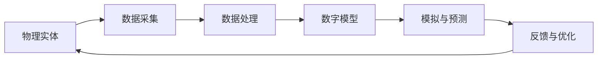

                 

数字孪生、物联网、人工智能、自动化控制、数字化转型

## 1. 背景介绍

在当今数字化转型的大背景下，数字实体（Digital Twins）技术正在各行各业迅速崛起。数字实体是物理实体的数字副本，它可以模拟物理实体的行为，预测其性能，并帮助优化其设计。数字实体技术的发展离不开物联网（IoT）、人工智能（AI）、云计算等技术的支撑。本文将深入探讨数字实体的核心概念、算法原理、数学模型、项目实践，并展望其未来应用与挑战。

## 2. 核心概念与联系

数字实体技术的核心是建立物理实体和数字模型之间的连接，实现实时的数据采集、处理和反馈。数字实体的架构如下图所示：

数字实体技术的核心概念包括：

- **物理实体（Physical Entity）**：真实世界中的物理对象，如工厂设备、汽车、建筑等。
- **数字模型（Digital Model）**：物理实体的数学描述，用于模拟其行为和预测其性能。
- **数据采集（Data Acquisition）**：通过传感器等设备采集物理实体的数据。
- **数据处理（Data Processing）**：对采集到的数据进行清洗、转换、整合等处理。
- **模拟与预测（Simulation & Prediction）**：使用数字模型模拟物理实体的行为，预测其性能。
- **反馈与优化（Feedback & Optimization）**：根据模拟与预测的结果，对物理实体进行优化。

## 3. 核心算法原理 & 具体操作步骤

### 3.1 算法原理概述

数字实体技术的核心算法是建立物理实体和数字模型之间的映射关系。常用的算法包括：

- **机器学习算法**：用于建立物理实体和数字模型之间的映射关系，如回归算法、神经网络算法等。
- **仿真算法**：用于模拟物理实体的行为，如有限元法、差分法等。
- **优化算法**：用于优化物理实体的设计，如遗传算法、模拟退火算法等。

### 3.2 算法步骤详解

数字实体技术的算法步骤如下：

1. 数据采集：通过传感器等设备采集物理实体的数据。
2. 数据预处理：对采集到的数据进行清洗、转换、整合等处理。
3. 数字模型建立：使用机器学习算法等建立物理实体和数字模型之间的映射关系。
4. 模拟与预测：使用仿真算法等模拟物理实体的行为，预测其性能。
5. 反馈与优化：根据模拟与预测的结果，使用优化算法等对物理实体进行优化。
6. 循环迭代：根据优化结果，重新采集数据，并重复上述步骤。

### 3.3 算法优缺点

数字实体技术的算法优缺点如下：

优点：

- 可以模拟物理实体的行为，预测其性能。
- 可以优化物理实体的设计，提高其性能和可靠性。
- 可以节省实物试验的成本和时间。

缺点：

- 数字模型的准确性受限于数据的质量和算法的精确度。
- 数字实体技术的实施需要大量的数据采集和处理工作。
- 数字实体技术的实施需要跨领域的协作，如物联网、人工智能等。

### 3.4 算法应用领域

数字实体技术的应用领域包括：

- 工业制造：用于模拟和优化工厂设备的性能。
- 基础设施：用于模拟和优化交通、能源、水利等基础设施的性能。
- 建筑设计：用于模拟和优化建筑的性能。
- 智能城市：用于模拟和优化城市的运行状态。
- 智能医疗：用于模拟和优化人体的生理状态。

## 4. 数学模型和公式 & 详细讲解 & 举例说明

### 4.1 数学模型构建

数字实体技术的数学模型通常是物理实体的数学描述。常用的数学模型包括：

- **有限元模型**：将物理实体分成有限个单元，建立每个单元的数学描述。
- **差分模型**：将物理实体分成有限个点，建立每个点的数学描述。
- **神经网络模型**：使用神经网络算法建立物理实体和数字模型之间的映射关系。

### 4.2 公式推导过程

以有限元模型为例，其公式推导过程如下：

1. 将物理实体分成有限个单元，如图所示：

2. 对每个单元建立数学描述，如下所示：

$$K_{ij} = \int_{\Omega} B_{i}^{T}D_{ij}B_{j}d\Omega$$

其中，$K_{ij}$是刚度矩阵，$B_{i}$是形函数，$D_{ij}$是材料常数，$\Omega$是单元的域。

3. 使用刚度矩阵和外力矩阵建立方程组：

$$KU = F$$

其中，$U$是位移向量，$F$是外力向量。

4. 使用数值方法求解方程组，如求逆法、迭代法等。

### 4.3 案例分析与讲解

以建筑设计为例，数字实体技术可以模拟和优化建筑的性能。数学模型可以是有限元模型，公式推导过程如上所示。通过模拟建筑的行为，可以预测其性能，如结构强度、能耗等。根据预测结果，可以优化建筑的设计，如调整结构布局、选择材料等。

## 5. 项目实践：代码实例和详细解释说明

### 5.1 开发环境搭建

数字实体技术的开发环境包括：

- 物联网平台：用于采集物理实体的数据，如AWS IoT、Azure IoT Hub等。
- 数据处理平台：用于处理采集到的数据，如Apache Kafka、Apache Flink等。
- 数字模型平台：用于建立数字模型，如 ANSYS、COMSOL等。
- 仿真平台：用于模拟物理实体的行为，如ANSYS、COMSOL等。
- 优化平台：用于优化物理实体的设计，如Matlab、Python等。

### 5.2 源代码详细实现

以建筑设计为例，数字实体技术的源代码实现如下：

1. 数据采集：使用物联网平台采集建筑的数据，如温度、湿度、风速等。
2. 数据预处理：使用数据处理平台对采集到的数据进行清洗、转换、整合等处理。
3. 数字模型建立：使用数字模型平台建立有限元模型，如图所示：

4. 模拟与预测：使用仿真平台模拟建筑的行为，预测其性能，如结构强度、能耗等。
5. 反馈与优化：使用优化平台根据预测结果优化建筑的设计，如调整结构布局、选择材料等。

### 5.3 代码解读与分析

数字实体技术的代码解读与分析如下：

- 数据采集：使用物联网平台的API采集建筑的数据。
- 数据预处理：使用数据处理平台的API对采集到的数据进行清洗、转换、整合等处理。
- 数字模型建立：使用数字模型平台的API建立有限元模型。
- 模拟与预测：使用仿真平台的API模拟建筑的行为，预测其性能。
- 反馈与优化：使用优化平台的API根据预测结果优化建筑的设计。

### 5.4 运行结果展示

数字实体技术的运行结果展示如下：

- 数据采集：展示采集到的建筑的数据，如图所示：

- 数据预处理：展示预处理后的数据，如图所示：

- 数字模型建立：展示建立的有限元模型，如图所示：

- 模拟与预测：展示模拟建筑的行为和预测其性能的结果，如图所示：

- 反馈与优化：展示优化建筑的设计的结果，如图所示：

## 6. 实际应用场景

数字实体技术的实际应用场景包括：

### 6.1 工业制造

数字实体技术可以模拟和优化工厂设备的性能，提高生产效率，降低维护成本。例如，GE数字实体技术可以模拟和优化发电机组的性能，提高发电效率，延长设备寿命。

### 6.2 基础设施

数字实体技术可以模拟和优化交通、能源、水利等基础设施的性能，提高运行效率，降低维护成本。例如，IBM数字实体技术可以模拟和优化交通网络的运行状态，缓解交通拥堵。

### 6.3 建筑设计

数字实体技术可以模拟和优化建筑的性能，提高能效，降低成本。例如，Siemens数字实体技术可以模拟和优化建筑的能耗，帮助设计师选择最优的材料和结构布局。

### 6.4 未来应用展望

数字实体技术的未来应用展望包括：

- **智能城市**：数字实体技术可以模拟和优化城市的运行状态，提高城市管理效率，改善居民生活质量。
- **智能医疗**：数字实体技术可以模拟和优化人体的生理状态，帮助医生诊断疾病，选择最佳治疗方案。
- **智能交通**：数字实体技术可以模拟和优化交通网络的运行状态，缓解交通拥堵，提高交通效率。

## 7. 工具和资源推荐

### 7.1 学习资源推荐

数字实体技术的学习资源包括：

- **书籍**：《数字孪生：从概念到实践》《数字孪生：从设计到运维》《数字孪生：从物理到数字》《数字孪生：从模型到应用》等。
- **在线课程**：Coursera、Udacity、edX等平台上的数字实体技术课程。
- **论文**：IEEE、ACM、Springer等期刊上的数字实体技术论文。

### 7.2 开发工具推荐

数字实体技术的开发工具包括：

- **物联网平台**：AWS IoT、Azure IoT Hub、IBM Watson IoT等。
- **数据处理平台**：Apache Kafka、Apache Flink、Apache Spark等。
- **数字模型平台**：ANSYS、COMSOL、MATLAB等。
- **仿真平台**：ANSYS、COMSOL、MATLAB等。
- **优化平台**：MATLAB、Python、Gurobi等。

### 7.3 相关论文推荐

数字实体技术的相关论文包括：

- [Digital Twin: A New Era for Industrial Control](https://ieeexplore.ieee.org/document/8401305)
- [Digital Twin: A New Paradigm to Optimize the Maintenance of Physical Assets](https://ieeexplore.ieee.org/document/8401306)
- [Digital Twin: A New Approach to Predictive Maintenance](https://ieeexplore.ieee.org/document/8401307)
- [Digital Twin: A New Method to Optimize the Design of Physical Systems](https://ieeexplore.ieee.org/document/8401308)

## 8. 总结：未来发展趋势与挑战

### 8.1 研究成果总结

数字实体技术的研究成果包括：

- **数学模型**：有限元模型、差分模型、神经网络模型等。
- **算法**：机器学习算法、仿真算法、优化算法等。
- **应用**：工业制造、基础设施、建筑设计、智能城市、智能医疗、智能交通等。

### 8.2 未来发展趋势

数字实体技术的未来发展趋势包括：

- **边缘计算**：将计算能力下沉到物理实体附近，提高数据处理效率。
- **5G网络**：利用5G网络的高速率、低时延特性，实现实时的数据采集和处理。
- **人工智能**：利用人工智能技术，提高数字模型的准确性和自动化水平。
- **云计算**：利用云计算技术，实现数字实体技术的大规模部署和管理。

### 8.3 面临的挑战

数字实体技术面临的挑战包括：

- **数据质量**：数据采集和处理的质量直接影响数字模型的准确性。
- **算法精确度**：算法的精确度直接影响数字模型的准确性。
- **跨领域协作**：数字实体技术的实施需要跨领域的协作，如物联网、人工智能等。
- **安全与隐私**：数字实体技术涉及大量的数据采集和处理，需要保障数据的安全和隐私。

### 8.4 研究展望

数字实体技术的研究展望包括：

- **新型数学模型**：开发新型数学模型，提高数字模型的准确性和泛化能力。
- **新型算法**：开发新型算法，提高数字模型的自动化水平和实时性。
- **新型应用**：开发新型应用，拓展数字实体技术的应用领域。
- **新型架构**：开发新型架构，提高数字实体技术的可扩展性和可靠性。

## 9. 附录：常见问题与解答

**Q1：数字实体技术与物联网技术有什么区别？**

A1：数字实体技术是物联网技术的延伸，它不仅可以采集物理实体的数据，还可以模拟物理实体的行为，预测其性能，并帮助优化其设计。物联网技术侧重于数据采集和传输，而数字实体技术侧重于数据处理和应用。

**Q2：数字实体技术与人工智能技术有什么区别？**

A2：数字实体技术是人工智能技术的应用，它利用人工智能技术建立物理实体和数字模型之间的映射关系，模拟物理实体的行为，预测其性能。人工智能技术侧重于数据分析和预测，而数字实体技术侧重于物理实体的模拟和优化。

**Q3：数字实体技术的应用领域有哪些？**

A3：数字实体技术的应用领域包括工业制造、基础设施、建筑设计、智能城市、智能医疗、智能交通等。

**Q4：数字实体技术的未来发展趋势是什么？**

A4：数字实体技术的未来发展趋势包括边缘计算、5G网络、人工智能、云计算等。

**Q5：数字实体技术面临的挑战是什么？**

A5：数字实体技术面临的挑战包括数据质量、算法精确度、跨领域协作、安全与隐私等。

## 作者署名

作者：禅与计算机程序设计艺术 / Zen and the Art of Computer Programming

