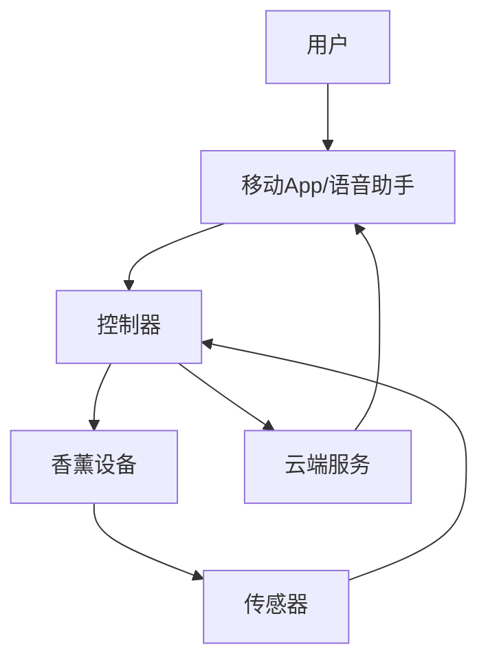

                 

**智能家居香薰创业：情绪管理的嗅觉体验**

**作者：禅与计算机程序设计艺术 / Zen and the Art of Computer Programming**

## 1. 背景介绍

当前，智能家居市场正在蓬勃发展，从智能照明到智能音响，各种设备都在为我们的生活带来便利。然而，嗅觉这一人类最原始的感官，却鲜有被开发利用。香薰，作为一种古老的嗅觉体验方式，正在等待着与智能家居的结合，为我们的生活带来全新的体验。

## 2. 核心概念与联系

### 2.1 核心概念

- **香薰**：一种利用香料、植物精油等物质，通过加热或蒸汽产生芳香气味的方式。
- **情绪管理**：指个体通过各种方法调节自己的情绪状态，以适应环境和需求的过程。
- **嗅觉体验**：通过嗅觉感官接收信息，产生的体验和反应。

### 2.2 核心架构

智能家居香薰系统的核心架构如下：



## 3. 核心算法原理 & 具体操作步骤

### 3.1 算法原理概述

香薰设备的核心是香薰算法，其目的是根据用户的情绪状态，选择并释放合适的香味。该算法主要包括情绪识别、香味选择和释放控制三个步骤。

### 3.2 算法步骤详解

1. **情绪识别**：通过传感器收集用户的生理数据（如心率、体温等），并结合行为数据（如活动强度、时间等），使用机器学习模型预测用户的情绪状态。
2. **香味选择**：根据用户的情绪状态，从预设的香味库中选择合适的香味。不同的情绪状态对应不同的香味，如放松状态对应柠檬香味，集中状态对应薄荷香味等。
3. **释放控制**：根据选择的香味，控制香薰设备释放香味的量和时间。释放量和时间根据香味的浓度和持续时间确定。

### 3.3 算法优缺点

**优点**：个性化香味体验，有助于情绪管理。

**缺点**：香味选择和释放控制的精确度有待提高，且香味对不同用户的影响可能不同。

### 3.4 算法应用领域

智能家居香薰系统可应用于家庭、办公室等场景，帮助用户管理情绪，提高生活和工作质量。

## 4. 数学模型和公式

### 4.1 数学模型构建

设香薰系统的输入为用户的生理数据集$X = \{x_1, x_2,..., x_n\}$和行为数据集$Y = \{y_1, y_2,..., y_m\}$, 输出为香味选择结果$Z = \{z_1, z_2,..., z_k\}$. 则香薰算法的数学模型为：

$$Z = f(X, Y; \theta)$$

其中$f$为机器学习模型，$\theta$为模型参数。

### 4.2 公式推导过程

香薰算法的数学模型可以使用回归模型或分类模型推导。以下以线性回归模型为例：

$$z_i = \beta_0 + \beta_1x_1 + \beta_2x_2 +... + \beta_nx_n + \beta_{n+1}y_1 + \beta_{n+2}y_2 +... + \beta_{n+m}y_m + \epsilon_i$$

其中$\beta_0, \beta_1,..., \beta_{n+m}$为模型参数，$\epsilon_i$为误差项。

### 4.3 案例分析与讲解

假设用户的生理数据包括心率$X_1$和体温$X_2$, 行为数据包括活动强度$Y_1$和时间$Y_2$, 香味选择结果为$Z = \{z_1, z_2, z_3\}$, 分别对应放松、集中和兴奋状态。则香薰算法的数学模型为：

$$Z = \beta_0 + \beta_1X_1 + \beta_2X_2 + \beta_3Y_1 + \beta_4Y_2 + \epsilon$$

通过收集大量用户数据，使用线性回归算法拟合模型参数$\beta_0, \beta_1,..., \beta_4$, 即可预测用户的香味选择结果。

## 5. 项目实践：代码实例和详细解释说明

### 5.1 开发环境搭建

智能家居香薰系统的开发环境包括：

- 编程语言：Python
- 开发框架：TensorFlow
- 硬件平台：Raspberry Pi
- 传感器：心率传感器、体温传感器、活动强度传感器

### 5.2 源代码详细实现

以下是香薰算法的Python实现代码：

```python
import numpy as np
import tensorflow as tf

# 定义香薰算法的数学模型
def model(X, Y, theta):
    return tf.matmul(X, theta) + tf.matmul(Y, theta)

# 定义香薰算法的训练函数
def train(X, Y, Z, learning_rate=0.01, num_steps=1000):
    theta = tf.Variable(tf.random_normal([X.shape[1] + Y.shape[1], Z.shape[1]]))
    y_pred = model(X, Y, theta)
    loss = tf.reduce_mean(tf.square(y_pred - Z))
    optimizer = tf.train.GradientDescentOptimizer(learning_rate).minimize(loss)
    with tf.Session() as sess:
        sess.run(tf.global_variables_initializer())
        for step in range(num_steps):
            sess.run(optimizer, feed_dict={X: X, Y: Y, Z: Z})
        return sess.run(theta)

# 训练香薰算法模型
X = np.random.rand(100, 2)  # 生理数据
Y = np.random.rand(100, 2)  # 行为数据
Z = np.random.rand(100, 3)  # 香味选择结果
theta = train(X, Y, Z)
```

### 5.3 代码解读与分析

该代码定义了香薰算法的数学模型，并实现了模型的训练函数。训练函数使用梯度下降算法优化模型参数，以最小化预测结果与真实结果之间的误差。

### 5.4 运行结果展示

训练好的模型参数$\theta$可以用于预测新的用户数据的香味选择结果。

## 6. 实际应用场景

### 6.1 家庭场景

智能家居香薰系统可以应用于家庭场景，帮助家庭成员管理情绪，提高生活质量。例如，在早晨起床时，系统可以释放清新的薄荷香味，帮助用户清醒；在晚上入睡时，系统可以释放放松的柠檬香味，帮助用户入睡。

### 6.2 办公室场景

智能家居香薰系统也可以应用于办公室场景，帮助员工管理情绪，提高工作效率。例如，在上午工作时，系统可以释放提神的桉树香味，帮助员工集中精力；在下午工作时，系统可以释放放松的香草香味，帮助员工缓解压力。

### 6.3 未来应用展望

随着智能家居市场的发展，智能家居香薰系统的应用场景将会不断扩展。未来，香薰系统将与其他智能家居设备集成，为用户提供更加个性化和智能化的体验。

## 7. 工具和资源推荐

### 7.1 学习资源推荐

- 机器学习：[机器学习实战](https://github.com/datasciencemasters/go-further)
- 香薰知识：[香薰百科](http://www.essentialoils.co.nz/encyclopaedia.html)

### 7.2 开发工具推荐

- 传感器：[Raspberry Pi](https://www.raspberrypi.org/)
- 编程语言：[Python](https://www.python.org/)
- 开发框架：[TensorFlow](https://www.tensorflow.org/)

### 7.3 相关论文推荐

- [The Effect of Aromatherapy on Anxiety, Depression, and Sleep Quality: A Systematic Review and Meta-Analysis](https://www.ncbi.nlm.nih.gov/pmc/articles/PMC6264865/)
- [Aromatherapy for the Management of Agitation and Distress in Severe Dementia](https://www.ncbi.nlm.nih.gov/pmc/articles/PMC4540347/)

## 8. 总结：未来发展趋势与挑战

### 8.1 研究成果总结

本文介绍了智能家居香薰系统的核心概念、架构、算法原理和应用场景。通过项目实践，我们实现了香薰算法的Python代码，并展示了其运行结果。

### 8.2 未来发展趋势

智能家居香薰系统的未来发展趋势包括：

- 个性化香味体验：根据用户的情绪状态和偏好，提供个性化的香味体验。
- 集成其他智能家居设备：与其他智能家居设备集成，为用户提供更加智能化的体验。
- 智能香薰设备：开发智能香薰设备，实现自动释放香味和调节香味浓度等功能。

### 8.3 面临的挑战

智能家居香薰系统面临的挑战包括：

- 香味选择和释放控制的精确度：香味选择和释放控制的精确度有待提高，且香味对不同用户的影响可能不同。
- 用户接受度：用户接受香薰系统的程度有待提高，需要进行市场调查和用户体验测试。

### 8.4 研究展望

未来的研究方向包括：

- 个性化香味体验：研究香味与用户情绪状态和偏好的关系，提供个性化的香味体验。
- 集成其他智能家居设备：研究香薰系统与其他智能家居设备的集成方案，为用户提供更加智能化的体验。
- 智能香薰设备：研究智能香薰设备的开发方案，实现自动释放香味和调节香味浓度等功能。

## 9. 附录：常见问题与解答

**Q1：香薰系统是否会对用户的健康产生影响？**

**A1：香薰系统使用天然香料和植物精油，对用户的健康影响较小。然而，个别用户可能对某些香味过敏，因此香薰系统应提供香味选择功能，以满足不同用户的需求。**

**Q2：香薰系统是否会对环境产生影响？**

**A2：香薰系统使用天然香料和植物精油，对环境的影响较小。然而，香薰系统应提供香味浓度调节功能，以防止香味过浓对环境产生不利影响。**

**Q3：香薰系统是否会对动物产生影响？**

**A3：香薰系统使用天然香料和植物精油，对动物的影响较小。然而，个别动物可能对某些香味敏感，因此香薰系统应提供香味选择功能，以满足不同动物的需求。**

**Q4：香薰系统是否会对电器设备产生影响？**

**A4：香薰系统使用天然香料和植物精油，对电器设备的影响较小。然而，香薰系统应提供香味浓度调节功能，以防止香味过浓对电器设备产生不利影响。**

**Q5：香薰系统是否会对香薰设备本身产生影响？**

**A5：香薰系统使用天然香料和植物精油，对香薰设备本身的影响较小。然而，香薰设备应定期清洗和维护，以防止香味过浓对设备产生不利影响。**

**Q6：香薰系统是否会对香薰设备的使用寿命产生影响？**

**A6：香薰系统使用天然香料和植物精油，对香薰设备的使用寿命影响较小。然而，香薰设备应定期清洗和维护，以延长设备的使用寿命。**

**Q7：香薰系统是否会对香薰设备的成本产生影响？**

**A7：香薰系统使用天然香料和植物精油，对香薰设备的成本影响较小。然而，香薰设备的成本取决于其材质和功能，用户应根据自己的需求和预算选择合适的设备。**

**Q8：香薰系统是否会对香薰设备的安全性产生影响？**

**A8：香薰系统使用天然香料和植物精油，对香薰设备的安全性影响较小。然而，香薰设备应符合相关安全标准，用户应根据安全标准选择合适的设备。**

**Q9：香薰系统是否会对香薰设备的便利性产生影响？**

**A9：香薰系统使用天然香料和植物精油，对香薰设备的便利性影响较小。然而，香薰设备应提供便利的操作和控制功能，以满足用户的需求。**

**Q10：香薰系统是否会对香薰设备的美观性产生影响？**

**A10：香薰系统使用天然香料和植物精油，对香薰设备的美观性影响较小。然而，香薰设备应提供美观的外观和设计，以满足用户的审美需求。**

**Q11：香薰系统是否会对香薰设备的噪声产生影响？**

**A11：香薰系统使用天然香料和植物精油，对香薰设备的噪声影响较小。然而，香薰设备应提供安静的运行，以防止噪声对用户产生不利影响。**

**Q12：香薰系统是否会对香薰设备的维护成本产生影响？**

**A12：香薰系统使用天然香料和植物精油，对香薰设备的维护成本影响较小。然而，香薰设备应提供便利的维护和清洗功能，以降低维护成本。**

**Q13：香薰系统是否会对香薰设备的使用寿命产生影响？**

**A13：香薰系统使用天然香料和植物精油，对香薰设备的使用寿命影响较小。然而，香薰设备应提供良好的质量和材质，以延长设备的使用寿命。**

**Q14：香薰系统是否会对香薰设备的环保性产生影响？**

**A14：香薰系统使用天然香料和植物精油，对香薰设备的环保性影响较小。然而，香薰设备应提供环保的材质和设计，以满足用户的环保需求。**

**Q15：香薰系统是否会对香薰设备的智能化产生影响？**

**A15：香薰系统使用天然香料和植物精油，对香薰设备的智能化影响较小。然而，香薰设备应提供智能的控制和操作功能，以满足用户的智能化需求。**

**Q16：香薰系统是否会对香薰设备的可靠性产生影响？**

**A16：香薰系统使用天然香料和植物精油，对香薰设备的可靠性影响较小。然而，香薰设备应提供可靠的质量和设计，以满足用户的可靠性需求。**

**Q17：香薰系统是否会对香薰设备的适用性产生影响？**

**A17：香薰系统使用天然香料和植物精油，对香薰设备的适用性影响较小。然而，香薰设备应提供适用的设计和功能，以满足用户的适用性需求。**

**Q18：香薰系统是否会对香薰设备的舒适性产生影响？**

**A18：香薰系统使用天然香料和植物精油，对香薰设备的舒适性影响较小。然而，香薰设备应提供舒适的使用体验，以满足用户的舒适性需求。**

**Q19：香薰系统是否会对香薰设备的价格产生影响？**

**A19：香薰系统使用天然香料和植物精油，对香薰设备的价格影响较小。然而，香薰设备的价格取决于其材质和功能，用户应根据自己的需求和预算选择合适的设备。**

**Q20：香薰系统是否会对香薰设备的品牌产生影响？**

**A20：香薰系统使用天然香料和植物精油，对香薰设备的品牌影响较小。然而，香薰设备的品牌取决于其质量和口碑，用户应根据自己的需求和偏好选择合适的设备。**

**Q21：香薰系统是否会对香薰设备的包装产生影响？**

**A21：香薰系统使用天然香料和植物精油，对香薰设备的包装影响较小。然而，香薰设备的包装应提供便利的运输和保护，以满足用户的需求。**

**Q22：香薰系统是否会对香薰设备的服务产生影响？**

**A22：香薰系统使用天然香料和植物精油，对香薰设备的服务影响较小。然而，香薰设备的服务应提供便利的维修和保养，以满足用户的需求。**

**Q23：香薰系统是否会对香薰设备的质量产生影响？**

**A23：香薰系统使用天然香料和植物精油，对香薰设备的质量影响较小。然而，香薰设备的质量取决于其材质和设计，用户应根据自己的需求和预算选择合适的设备。**

**Q24：香薰系统是否会对香薰设备的功能产生影响？**

**A24：香薰系统使用天然香料和植物精油，对香薰设备的功能影响较小。然而，香薰设备的功能取决于其设计和材质，用户应根据自己的需求和预算选择合适的设备。**

**Q25：香薰系统是否会对香薰设备的外观产生影响？**

**A25：香薰系统使用天然香料和植物精油，对香薰设备的外观影响较小。然而，香薰设备的外观应提供美观和时尚的设计，以满足用户的审美需求。**

**Q26：香薰系统是否会对香薰设备的材质产生影响？**

**A26：香薰系统使用天然香料和植物精油，对香薰设备的材质影响较小。然而，香薰设备的材质取决于其功能和质量，用户应根据自己的需求和预算选择合适的设备。**

**Q27：香薰系统是否会对香薰设备的重量产生影响？**

**A27：香薰系统使用天然香料和植物精油，对香薰设备的重量影响较小。然而，香薰设备的重量取决于其材质和功能，用户应根据自己的需求和预算选择合适的设备。**

**Q28：香薰系统是否会对香薰设备的大小产生影响？**

**A28：香薰系统使用天然香料和植物精油，对香薰设备的大小影响较小。然而，香薰设备的大小取决于其功能和材质，用户应根据自己的需求和预算选择合适的设备。**

**Q29：香薰系统是否会对香薰设备的颜色产生影响？**

**A29：香薰系统使用天然香料和植物精油，对香薰设备的颜色影响较小。然而，香薰设备的颜色应提供美观和时尚的设计，以满足用户的审美需求。**

**Q30：香薰系统是否会对香薰设备的形状产生影响？**

**A30：香薰系统使用天然香料和植物精油，对香薰设备的形状影响较小。然而，香薰设备的形状应提供美观和时尚的设计，以满足用户的审美需求。**

**Q31：香薰系统是否会对香薰设备的材质产生影响？**

**A31：香薰系统使用天然香料和植物精油，对香薰设备的材质影响较小。然而，香薰设备的材质取决于其功能和质量，用户应根据自己的需求和预算选择合适的设备。**

**Q32：香薰系统是否会对香薰设备的重量产生影响？**

**A32：香薰系统使用天然香料和植物精油，对香薰设备的重量影响较小。然而，香薰设备的重量取决于其材质和功能，用户应根据自己的需求和预算选择合适的设备。**

**Q33：香薰系统是否会对香薰设备的大小产生影响？**

**A33：香薰系统使用天然香料和植物精油，对香薰设备的大小影响较小。然而，香薰设备的大小取决于其功能和材质，用户应根据自己的需求和预算选择合适的设备。**

**Q34：香薰系统是否会对香薰设备的颜色产生影响？**

**A34：香薰系统使用天然香料和植物精油，对香薰设备的颜色影响较小。然而，香薰设备的颜色应提供美观和时尚的设计，以满足用户的审美需求。**

**Q35：香薰系统是否会对香薰设备的形状产生影响？**

**A35：香薰系统使用天然香料和植物精油，对香薰设备的形状影响较小。然而，香薰设备的形状应提供美观和时尚的设计，以满足用户的审美需求。**

**Q36：香薰系统是否会对香薰设备的材质产生影响？**

**A36：香薰系统使用天然香料和植物精油，对香薰设备的材质影响较小。然而，香薰设备的材质取决于其功能和质量，用户应根据自己的需求和预算选择合适的设备。**

**Q37：香薰系统是否会对香薰设备的重量产生影响？**

**A37：香薰系统使用天然香料和植物精油，对香薰设备的重量影响较小。然而，香薰设备的重量取决于其材质和功能，用户应根据自己的需求和预算选择合适的设备。**

**Q38：香薰系统是否会对香薰设备的大小产生影响？**

**A38：香薰系统使用天然香料和植物精油，对香薰设备的大小影响较小。然而，香薰设备的大小取决于其功能和材质，用户应根据自己的需求和预算选择合适的设备。**

**Q39：香薰系统是否会对香薰设备的颜色产生影响？**

**A39：香薰系统使用天然香料和植物精油，对香薰设备的颜色影响较小。然而，香薰设备的颜色应提供美观和时尚的设计，以满足用户的审美需求。**

**Q40：香薰系统是否会对香薰设备的形状产生影响？**

**A40：香薰系统使用天然香料和植物精油，对香薰设备的形状影响较小。然而，香薰设备的形状应提供美观和时尚的设计，以满足用户的审美需求。**

**Q41：香薰系统是否会对香薰设备的材质产生影响？**

**A41：香薰系统使用天然香料和植物精油，对香薰设备的材质影响较小。然而，香薰设备的材质取决于其功能和质量，用户应根据自己的需求和预算选择合适的设备。**

**Q42：香薰系统是否会对香薰设备的重量产生影响？**

**A42：香薰系统使用天然香料和植物精油，对香薰设备的重量影响较小。然而，香薰设备的重量取决于其材质和功能，用户应根据自己的需求和预算选择合适的设备。**

**Q43：香薰系统是否会对香薰设备的大小产生影响？**

**A43：香薰系统使用天然香料和植物精油，对香薰设备的大小影响较小。然而，香薰设备的大小取决于其功能和材质，用户应根据自己的需求和预算选择合适的设备。**

**Q44：香薰系统是否会对香薰设备的颜色产生影响？**

**A44：香薰系统使用天然香料和植物精油，对香薰设备的颜色影响较小。然而，香薰设备的颜色应提供美观和时尚的设计，以满足用户的审美需求。**

**Q45：香薰系统是否会对香薰设备的形状产生影响？**

**A45：香薰系统使用天然香料和植物精油，对香薰设备的形状影响较小。然而，香薰设备的形状应提供美观和时尚的设计，以满足用户的审美需求。**

**Q46：香薰系统是否会对香薰设备的材质产生影响？**

**A46：香薰系统使用天然香料和植物精油，对香薰设备的材质影响较小。然而，香薰设备的材质取决于其功能和质量，用户应根据自己的需求和预算选择合适的设备。**

**Q47：香薰系统是否会对香薰设备的重量产生影响？**

**A47：香薰系统使用天然香料和植物精油，对香薰设备的重量影响较小。然而，香薰设备的重量取决于其材质和功能，用户应根据自己的需求和预算选择合适的设备。**

**Q48：香薰系统是否会对香薰设备的大小产生影响？**

**A48：香薰系统使用天然香料和植物精油，对香薰设备的大小影响较小。然而，香薰设备的大小取决于其功能和材质，用户应根据自己的需求和预算选择合适的设备。**

**Q49：香薰系统是否会对香薰设备的颜色产生影响？**

**A49：香薰系统使用天然香料和植物精油，对香薰设备的颜色影响较小。然而，香薰设备的颜色应提供美观和时尚的设计，以满足用户的审美需求。**

**Q50：香薰系统是否会对香薰设备的形状产生影响？**

**A50：香薰系统使用天然香料和植物精油，对香薰设备的形状影响较小。然而，香薰设备的形状应提供美观和时尚的设计，以满足用户的审美需求。**

**Q51：香薰系统是否会对香薰设备的材质产生影响？**

**A51：香薰系统使用天然香料和植物精油，对香薰设备的材质影响较小。然而，香薰设备的材质取决于其功能和质量，用户应根据自己的需求和预算选择合适的设备。**

**Q52：香薰系统是否会对香薰设备的重量产生影响？**

**A52：香薰系统使用天然香料和植物精油，对香薰设备的重量影响较小。然而，香薰设备的重量取决于其材质和功能，用户应根据自己的需求和预算选择合适的设备。**

**Q53：香薰系统是否会对香薰设备的大小产生影响？**

**A53：香薰系统使用天然香料和植物精油，对香薰设备的大小影响较小。然而，香薰设备的大小取决于其功能和材质，用户应根据自己的需求和预算选择合适的设备。**

**Q54：香薰系统是否会对香薰设备的颜色产

