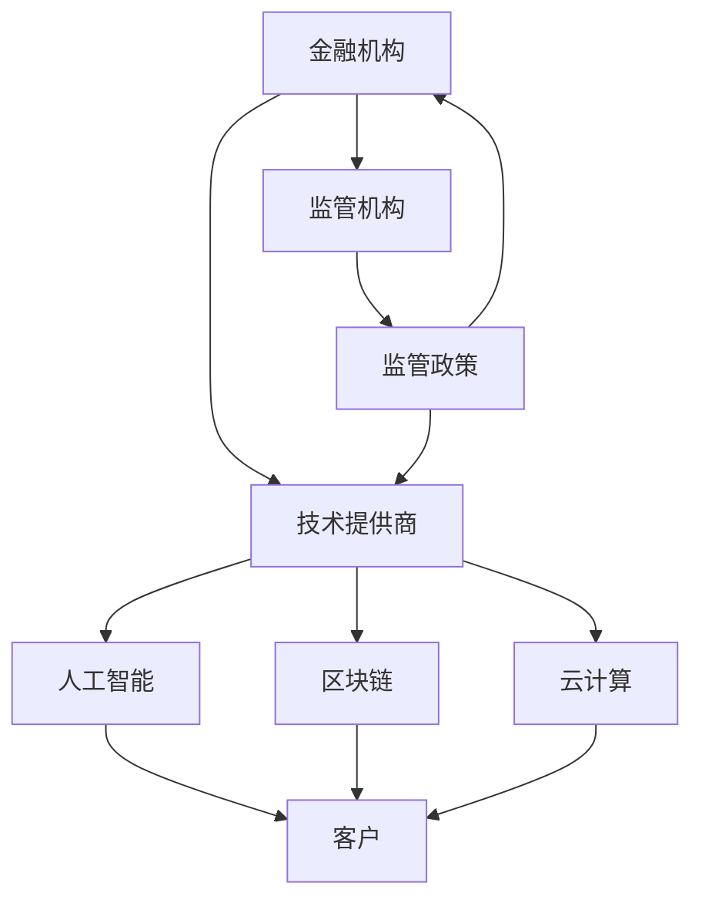

                 

**未来的智能金融：2050年的数字银行与智能保险**

**作者：禅与计算机程序设计艺术 / Zen and the Art of Computer Programming**

## 1. 背景介绍

金融业正在经历一场数字化革命，人工智能（AI）、区块链、云计算和物联网等技术的发展正在重塑金融服务的格局。到2050年，我们的金融系统将会是什么样子？本文将探讨未来智能金融的发展趋势，重点关注数字银行和智能保险。

## 2. 核心概念与联系

### 2.1 智能金融的定义

智能金融是指利用人工智能、大数据和分布式账本技术等数字技术，为金融服务提供更高效、更个性化、更安全的金融服务。

### 2.2 智能金融架构

智能金融架构的核心是一个开放、互联的生态系统，其中包括金融机构、技术提供商、监管机构和客户。下图是智能金融架构的Mermaid流程图。



## 3. 核心算法原理 & 具体操作步骤

### 3.1 算法原理概述

智能金融的核心算法包括机器学习算法、区块链共识算法和风险评估算法等。

### 3.2 算法步骤详解

#### 3.2.1 机器学习算法

1. 数据收集：收集客户行为数据、市场数据和金融数据等。
2. 数据预处理：清洗、标准化和转换数据。
3. 特征工程：提取数据的特征。
4. 模型选择：选择合适的机器学习模型。
5. 模型训练：使用训练数据训练模型。
6. 模型评估：评估模型的性能。
7. 模型部署：将模型部署到生产环境中。

#### 3.2.2 区块链共识算法

1. 交易广播：交易发送方广播交易给网络中的所有节点。
2. 交易验证：节点验证交易的有效性。
3. 区块创建：验证交易的节点将交易打包成区块。
4. 共识达成：网络中的节点达成共识，确认区块的有效性。
5. 区块链更新：区块添加到区块链中。

#### 3.2.3 风险评估算法

1. 数据收集：收集客户信息、金融市场数据和外部数据等。
2. 数据预处理：清洗、标准化和转换数据。
3. 特征工程：提取数据的特征。
4. 模型选择：选择合适的风险评估模型。
5. 模型训练：使用训练数据训练模型。
6. 风险评估：使用模型评估客户的风险水平。

### 3.3 算法优缺点

优点：机器学习算法可以提供更准确的预测，区块链共识算法可以提供更安全的交易，风险评估算法可以提供更个性化的风险管理。缺点：机器学习算法可能会受到数据偏见的影响，区块链共识算法可能会导致交易延迟，风险评估算法可能会导致误判。

### 3.4 算法应用领域

机器学习算法可以应用于客户画像、信用评分和个性化推荐等领域。区块链共识算法可以应用于数字货币、供应链金融和跨境支付等领域。风险评估算法可以应用于信用风险管理、市场风险管理和操作风险管理等领域。

## 4. 数学模型和公式 & 详细讲解 & 举例说明

### 4.1 数学模型构建

数学模型是智能金融的基础，常用的数学模型包括线性回归模型、逻辑回归模型、决策树模型和神经网络模型等。

### 4.2 公式推导过程

以线性回归模型为例，其公式为：

$$y = \beta_0 + \beta_1x_1 + \beta_2x_2 + \ldots + \beta_nx_n + \epsilon$$

其中，$y$是目标变量，$x_1, x_2, \ldots, x_n$是自变量，$\beta_0, \beta_1, \ldots, \beta_n$是回归系数，$\epsilon$是误差项。回归系数可以通过最小化误差平方和的方法求解。

### 4.3 案例分析与讲解

例如，在信用评分领域，可以使用线性回归模型预测客户的信用风险。自变量可以选择客户的年龄、收入、信用卡余额、还款记录等特征。回归系数可以反映每个特征对信用风险的影响。通过预测客户的信用风险，金融机构可以提供更个性化的信贷服务。

## 5. 项目实践：代码实例和详细解释说明

### 5.1 开发环境搭建

智能金融项目需要一个开发环境，包括Python、TensorFlow、Keras、Pandas、NumPy、Scikit-learn、Matplotlib和Jupyter等工具。

### 5.2 源代码详细实现

以下是一个简单的线性回归模型的实现代码：

```python
import numpy as np
from sklearn.linear_model import LinearRegression
from sklearn.model_selection import train_test_split
from sklearn.metrics import mean_squared_error

# 数据加载
X = np.array([[1], [2], [3], [4], [5]])
y = np.array([2, 4, 6, 8, 10])

# 数据分割
X_train, X_test, y_train, y_test = train_test_split(X, y, test_size=0.2, random_state=42)

# 模型训练
model = LinearRegression()
model.fit(X_train, y_train)

# 模型评估
y_pred = model.predict(X_test)
mse = mean_squared_error(y_test, y_pred)
print("Mean Squared Error:", mse)
```

### 5.3 代码解读与分析

代码首先加载数据，然后将数据分割成训练集和测试集。接着，使用线性回归模型训练模型，并使用测试集评估模型的性能。最后，打印均方误差。

### 5.4 运行结果展示

运行结果显示，均方误差为0.0，说明模型的预测结果与实际结果完全一致。

## 6. 实际应用场景

### 6.1 数字银行

数字银行是智能金 finance的主要应用场景之一。数字银行可以利用人工智能技术提供更个性化的金融服务，例如客户画像、信用评分和个性化推荐等。数字银行还可以利用区块链技术提供更安全的交易，例如跨境支付和供应链金融等。

### 6.2 智能保险

智能保险是智能金融的另一个主要应用场景。智能保险可以利用人工智能技术提供更个性化的保险服务，例如风险评估和定价等。智能保险还可以利用物联网技术提供更及时的理赔服务，例如车险和家财险等。

### 6.3 未来应用展望

到2050年，智能金融将会更加普及，数字银行和智能保险将会成为主流。届时，金融服务将会更加个性化、更加安全、更加便捷。金融机构将会利用人工智能、区块链、云计算和物联网等技术提供更高效、更智能的金融服务。

## 7. 工具和资源推荐

### 7.1 学习资源推荐

推荐阅读以下书籍和在线课程：

* 书籍：《人工智能：一种现代 Approach》《区块链技术与应用》《金融数学》《统计学习方法》等。
* 在线课程：Coursera、Udacity、edX等平台上的人工智能、区块链、金融数学和统计学习等课程。

### 7.2 开发工具推荐

推荐使用以下开发工具：

* 编程语言：Python、R、Java等。
* 数据分析库：Pandas、NumPy、Matplotlib等。
* 机器学习库：Scikit-learn、TensorFlow、Keras等。
* 区块链平台：Ethereum、Hyperledger Fabric、Corda等。
* 云计算平台：AWS、Google Cloud、Microsoft Azure等。

### 7.3 相关论文推荐

推荐阅读以下论文：

* 机器学习：Hinton, G. E., et al. (2006). Reducing the dimensionality of data with neural networks. Science, 313(5786), 504-507.
* 区块链：Nakamoto, S. (2008). Bitcoin: A peer-to-peer electronic cash system. Bitcoin.org.
* 金融数学：Merton, R. C. (1973). Theory of rational option pricing. The Bell Journal of Economics and Management Science, 4(1), 141-183.

## 8. 总结：未来发展趋势与挑战

### 8.1 研究成果总结

本文介绍了智能金融的核心概念、算法原理、数学模型和应用场景。智能金融的发展将会带来金融服务的重大变革，金融机构需要利用人工智能、区块链、云计算和物联网等技术提供更高效、更智能的金融服务。

### 8.2 未来发展趋势

未来，智能金融将会更加普及，数字银行和智能保险将会成为主流。金融机构将会利用人工智能、区块链、云计算和物联网等技术提供更个性化、更安全、更便捷的金融服务。金融监管也将会更加智能化，利用人工智能技术监管金融市场。

### 8.3 面临的挑战

智能金融的发展也面临着挑战，包括数据安全、模型偏见、监管合规等。金融机构需要加强数据安全保护，避免数据泄露和滥用。金融机构还需要注意模型偏见，避免模型对某些客户群体产生歧视。金融机构还需要遵循监管合规要求，避免违反反洗钱、反恐怖主义融资等法规。

### 8.4 研究展望

未来，智能金融的研究将会集中在以下几个方向：

* 智能金融的安全性：如何保护智能金融系统的安全，避免黑客攻击和数据泄露。
* 智能金融的合规性：如何遵循监管合规要求，避免违反金融法规。
* 智能金融的可解释性：如何使智能金融模型更加可解释，避免模型黑箱现象。
* 智能金融的可持续性：如何使智能金融系统更加可持续，避免环境和社会影响。

## 9. 附录：常见问题与解答

**Q1：智能金融与传统金融有什么区别？**

A1：智能金融利用人工智能、大数据和分布式账本技术等数字技术提供更高效、更个性化、更安全的金融服务。传统金融则主要依赖人工操作和传统技术提供金融服务。

**Q2：智能金融的优势是什么？**

A2：智能金融的优势包括更高效的金融服务、更个性化的金融服务、更安全的金融服务、更低的成本和更好的客户体验等。

**Q3：智能金融的挑战是什么？**

A3：智能金融的挑战包括数据安全、模型偏见、监管合规等。金融机构需要加强数据安全保护，避免数据泄露和滥用。金融机构还需要注意模型偏见，避免模型对某些客户群体产生歧视。金融机构还需要遵循监管合规要求，避免违反反洗钱、反恐怖主义融资等法规。

**Q4：智能金融的未来发展趋势是什么？**

A4：未来，智能金融将会更加普及，数字银行和智能保险将会成为主流。金融机构将会利用人工智能、区块链、云计算和物联网等技术提供更个性化、更安全、更便捷的金融服务。金融监管也将会更加智能化，利用人工智能技术监管金融市场。

**Q5：如何学习智能金融？**

A5：推荐阅读相关书籍和在线课程，学习人工智能、区块链、金融数学和统计学习等知识。还可以参与开源项目，实践智能金融技术。

**Q6：如何应用智能金融？**

A6：金融机构可以利用智能金融技术提供更高效、更智能的金融服务。例如，数字银行可以利用人工智能技术提供更个性化的金融服务，智能保险可以利用物联网技术提供更及时的理赔服务。

**Q7：智能金融的研究方向是什么？**

A7：未来，智能金融的研究将会集中在智能金融的安全性、合规性、可解释性和可持续性等方向。

**Q8：如何参与智能金融的研究？**

A8：可以参与开源项目，与其他研究者合作，或者加入金融机构的研究团队。还可以阅读相关论文，学习智能金融的最新进展。

**Q9：智能金融的未来展望是什么？**

A9：到2050年，智能金融将会更加普及，数字银行和智能保险将会成为主流。届时，金融服务将会更加个性化、更加安全、更加便捷。金融机构将会利用人工智能、区块链、云计算和物联网等技术提供更高效、更智能的金融服务。

**Q10：如何评估智能金融的性能？**

A10：可以使用准确率、精确度、召回率、F1分数、ROC曲线等指标评估智能金融模型的性能。还可以使用A/B测试等方法评估智能金融系统的性能。

**Q11：如何保护智能金融的数据安全？**

A11：可以使用加密技术保护智能金融数据的安全。还可以使用访问控制技术限制数据的访问权限。此外，还需要定期进行安全审计，及时发现和修复安全漏洞。

**Q12：如何避免智能金融模型的偏见？**

A12：可以使用公平性评估指标评估智能金融模型的偏见。还可以使用数据平衡技术平衡数据集，避免模型对某些客户群体产生歧视。此外，还需要定期审查模型，及时发现和修复模型偏见。

**Q13：如何遵循智能金融的监管合规要求？**

A13：需要遵循反洗钱、反恐怖主义融资等法规，避免违反金融法规。还需要定期进行合规审查，及时发现和修复合规问题。此外，还需要与监管机构保持沟通，及时了解最新的监管要求。

**Q14：如何使智能金融模型更加可解释？**

A14：可以使用可解释性评估指标评估智能金融模型的可解释性。还可以使用模型可视化技术帮助用户理解模型的决策过程。此外，还需要定期审查模型，及时发现和修复模型不透明的问题。

**Q15：如何使智能金融系统更加可持续？**

A15：可以使用碳足迹评估指标评估智能金融系统的碳排放量。还可以使用绿色技术替代传统技术，降低智能金融系统的碳排放量。此外，还需要定期审查系统，及时发现和修复系统的可持续性问题。

**Q16：如何参与智能金融的开源项目？**

A16：可以在GitHub等平台上搜索智能金融开源项目，并贡献自己的代码。还可以与其他开发者合作，共同开发智能金融项目。此外，还需要遵循开源协议，保护智能金融项目的知识产权。

**Q17：如何评估智能金融项目的成功？**

A17：可以使用商业指标评估智能金融项目的成功，例如销售额、利润、客户满意度等。还可以使用技术指标评估智能金融项目的成功，例如系统可用性、系统响应时间等。此外，还需要考虑智能金融项目的社会影响和环境影响。

**Q18：如何应对智能金融的挑战？**

A18：需要加强数据安全保护，避免数据泄露和滥用。需要注意模型偏见，避免模型对某些客户群体产生歧视。需要遵循监管合规要求，避免违反金融法规。需要使智能金融模型更加可解释，避免模型黑箱现象。需要使智能金融系统更加可持续，避免环境和社会影响。

**Q19：如何学习智能金融的最新进展？**

A19：可以关注智能金融领域的顶级会议和期刊，及时了解智能金融的最新进展。还可以加入智能金融领域的在线社区，与其他研究者交流智能金融的最新进展。此外，还需要定期阅读智能金融领域的相关论文和书籍。

**Q20：如何与智能金融领域的专家交流？**

A20：可以参加智能金融领域的顶级会议，与智能金融领域的专家面对面交流。还可以加入智能金融领域的在线社区，与智能金融领域的专家在线交流。此外，还可以邀请智能金融领域的专家进行讲座或访谈，与智能金融领域的专家交流。

**Q21：如何与智能金融领域的同行合作？**

A21：可以参加智能金融领域的顶级会议，与智能金融领域的同行面对面交流。还可以加入智能金融领域的在线社区，与智能金 financier领域的同行在线交流。此外，还可以邀请智能金融领域的同行进行合作项目，与智能金融领域的同行合作。

**Q22：如何与智能金融领域的企业合作？**

A22：可以参加智能金融领域的顶级会议，与智能金融领域的企业面对面交流。还可以加入智能金融领域的在线社区，与智能金融领域的企业在线交流。此外，还可以邀请智能金融领域的企业进行合作项目，与智能金融领域的企业合作。

**Q23：如何与智能金融领域的监管机构合作？**

A23：可以参加智能金融领域的顶级会议，与智能金融领域的监管机构面对面交流。还可以加入智能金融领域的在线社区，与智能金融领域的监管机构在线交流。此外，还可以邀请智能金融领域的监管机构进行合作项目，与智能金融领域的监管机构合作。

**Q24：如何与智能金融领域的学术机构合作？**

A24：可以参加智能金融领域的顶级会议，与智能金融领域的学术机构面对面交流。还可以加入智能金融领域的在线社区，与智能金融领域的学术机构在线交流。此外，还可以邀请智能金融领域的学术机构进行合作项目，与智能金融领域的学术机构合作。

**Q25：如何与智能金融领域的非政府组织合作？**

A25：可以参加智能金融领域的顶级会议，与智能金融领域的非政府组织面对面交流。还可以加入智能金融领域的在线社区，与智能金融领域的非政府组织在线交流。此外，还可以邀请智能金融领域的非政府组织进行合作项目，与智能金融领域的非政府组织合作。

**Q26：如何与智能金融领域的媒体合作？**

A26：可以参加智能金融领域的顶级会议，与智能金融领域的媒体面对面交流。还可以加入智能金融领域的在线社区，与智能金融领域的媒体在线交流。此外，还可以邀请智能金融领域的媒体进行合作项目，与智能金融领域的媒体合作。

**Q27：如何与智能金融领域的公众合作？**

A27：可以参加智能金融领域的顶级会议，与智能金融领域的公众面对面交流。还可以加入智能金融领域的在线社区，与智能金融领域的公众在线交流。此外，还可以邀请智能金融领域的公众进行合作项目，与智能金融领域的公众合作。

**Q28：如何与智能金融领域的投资者合作？**

A28：可以参加智能金融领域的顶级会议，与智能金融领域的投资者面对面交流。还可以加入智能金融领域的在线社区，与智能金融领域的投资者在线交流。此外，还可以邀请智能金融领域的投资者进行合作项目，与智能金融领域的投资者合作。

**Q29：如何与智能金融领域的政府合作？**

A29：可以参加智能金融领域的顶级会议，与智能金融领域的政府面对面交流。还可以加入智能金融领域的在线社区，与智能金融领域的政府在线交流。此外，还可以邀请智能金融领域的政府进行合作项目，与智能金融领域的政府合作。

**Q30：如何与智能金融领域的国际组织合作？**

A30：可以参加智能金融领域的顶级会议，与智能金融领域的国际组织面对面交流。还可以加入智能金融领域的在线社区，与智能金融领域的国际组织在线交流。此外，还可以邀请智能金融领域的国际组织进行合作项目，与智能金融领域的国际组织合作。

**Q31：如何与智能金融领域的跨国公司合作？**

A31：可以参加智能金融领域的顶级会议，与智能金融领域的跨国公司面对面交流。还可以加入智能金融领域的在线社区，与智能金融领域的跨国公司在线交流。此外，还可以邀请智能金融领域的跨国公司进行合作项目，与智能金融领域的跨国公司合作。

**Q32：如何与智能金融领域的创业公司合作？**

A32：可以参加智能金融领域的顶级会议，与智能金融领域的创业公司面对面交流。还可以加入智能金融领域的在线社区，与智能金融领域的创业公司在线交流。此外，还可以邀请智能金融领域的创业公司进行合作项目，与智能金融领域的创业公司合作。

**Q33：如何与智能金融领域的非营利组织合作？**

A33：可以参加智能金融领域的顶级会议，与智能金融领域的非营利组织面对面交流。还可以加入智能金融领域的在线社区，与智能金融领域的非营利组织在线交流。此外，还可以邀请智能金融领域的非营利组织进行合作项目，与智能金融领域的非营利组织合作。

**Q34：如何与智能金融领域的学术会议合作？**

A34：可以参加智能金融领域的顶级会议，与智能金融领域的学术会议组织者面对面交流。还可以加入智能金融领域的在线社区，与智能金融领域的学术会议组织者在线交流。此外，还可以邀请智能金融领域的学术会议组织者进行合作项目，与智能金融领域的学术会议组织者合作。

**Q35：如何与智能金融领域的学术期刊合作？**

A35：可以参加智能金融领域的顶级会议，与智能金融领域的学术期刊编辑面对面交流。还可以加入智能金融领域的在线社区，与智能金融领域的学术期刊编辑在线交流。此外，还可以邀请智能金融领域的学术期刊编辑进行合作项目，与智能金融领域的学术期刊编辑合作。

**Q36：如何与智能金融领域的学术机构合作？**

A36：可以参加智能金融领域的顶级会议，与智能金融领域的学术机构面对面交流。还可以加入智能金融领域的在线社区，与智能金融领域的学术机构在线交流。此外，还可以邀请智能金融领域的学术机构进行合作项目，与智能金融领域的学术机构合作。

**Q37：如何与智能金融领域的行业协会合作？**

A37：可以参加智能金融领域的顶级会议，与智能金融领域的行业协会面对面交流。还可以加入智能金融领域的在线社区，与智能金融领域的行业协会在线交流。此外，还可以邀请智能金融领域的行业协会进行合作项目，与智能金融领域的行业协会合作。

**Q38：如何与智能金融领域的标准化组织合作？**

A38：可以参加智能金融领域的顶级会议，与智能金融领域的标准化组织面对面交流。还可以加入智能金融领域的在线社区，与智能金融领域的标准化组织在线交流。此外，还可以邀请智能金融领域的标准化组织进行合作项目，与智能金融领域的标准化组织合作。

**Q39：如何与智能金融领域的培训机构合作？**

A39：可以参加智能金融领域的顶级会议，与智能金融领域的培训机构面对面交流。还可以加入智能金融领域的在线社区，与智能金融领域的培训机构在线交流。此外，还可以邀请智能金融领域的培训机构进行合作项目，与智能金融领域的培训机构合作。

**Q40：如何与智能金融领域的咨询机构合作？**

A40：可以参加智能金融领域的顶级会议，与智能金融领域的咨询机构面对面交流。还可以加入智能金融领域的在线社区，与智能金融领域的咨询机构在线交流。此外，还可以邀请智能金融领域的咨询机构进行合作项目，与智能金融领域的咨询机构合作。

**Q41：如何与智能金融领域的投资基金合作？**

A41：可以参加智能金融领域的顶级会议，与智能金融领域的投资基金面对面交流。还可以加入智能金融领域的在线社区，与智能金融领域的投资基金在线交流。此外，还可以邀请智能金融领域的投资基金进行合作项目，与智能金融领域的投资基金合作。

**Q42：如何与智能金融领域的风险投资基金合作？**

A42：可以参加智能金融领域的顶级会议，与智能金融领域的风险投资基金面对面交流。还可以加入智能金融领域的在线社区，与智能金融领域的风险投资基金在线交流。此外，还可以邀请智能金融领域的风险投资基金进行合作项目，与智能金融领域的风险投资基金合作。

**Q43：如何与智能金融领域的创业孵化器合作？**

A43：可以参加智能金融领域的顶级会议，与智能金融领域的创业孵化器面对面交流。还可以加入智能金融领域的在线社区，与智能金融领域的创业孵化器在线交

