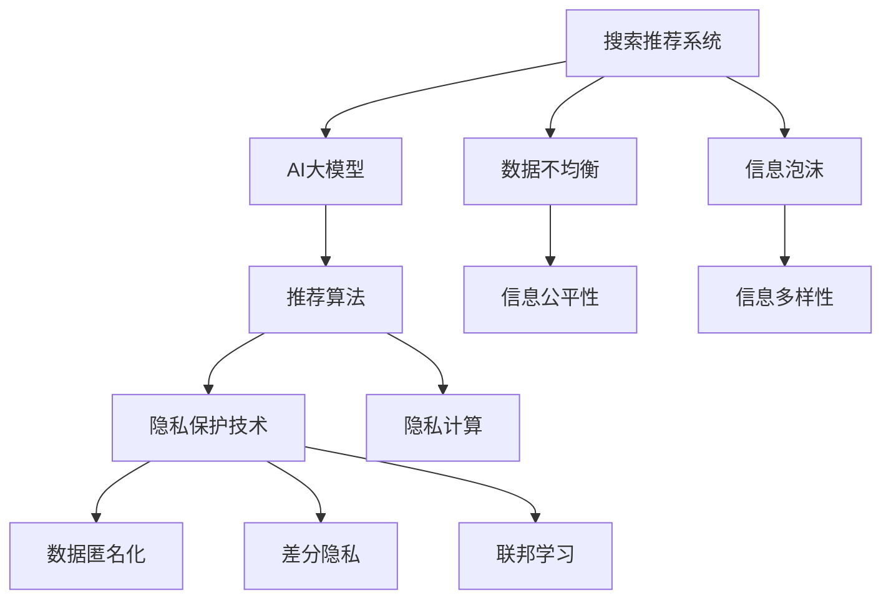

                 

# 搜索推荐系统的隐私保护与AI大模型

> 关键词：搜索推荐系统,隐私保护,AI大模型,推荐算法,隐私保护技术,隐私计算

## 1. 背景介绍

随着互联网和移动互联网的普及，搜索推荐系统（Recommendation System, RS）已经深入到人们的日常生活和工作中，成为了现代信息获取的重要手段。从电商平台的商品推荐，到视频网站的内容推荐，再到社交媒体的用户兴趣推荐，搜索推荐系统在多场景下发挥着巨大的作用，极大地提升了用户的使用体验和信息的获取效率。

然而，随着搜索推荐系统的广泛应用，用户隐私保护问题也逐渐凸显出来。一方面，由于推荐系统需要收集用户的行为数据和个人信息，如何保障这些数据的隐私安全成为一项重要课题；另一方面，现代深度学习技术的飞跃发展，使得搜索推荐系统更智能化、个性化，也带来了一些潜在风险。例如，AI大模型推荐可能引发数据不均衡、信息泡沫等问题，影响信息多样性和公平性。

为此，本文将重点介绍AI大模型在搜索推荐系统中的应用，并探讨如何利用隐私保护技术，保障搜索推荐系统中的用户隐私，构建公平、透明、安全的智能推荐系统。

## 2. 核心概念与联系

### 2.1 核心概念概述

为更好地理解隐私保护与AI大模型在搜索推荐系统中的整合应用，本节将介绍几个密切相关的核心概念：

- 搜索推荐系统（Recommendation System, RS）：通过分析用户的历史行为数据和兴趣偏好，向用户推荐相关内容或商品的系统。常见的推荐算法包括协同过滤、基于内容的推荐、矩阵分解等。

- AI大模型（Large AI Model）：以Transformer为代表的大规模预训练语言模型。通过在大规模无标签文本语料上进行预训练，学习到丰富的语言知识和通用特征，具备强大的语言理解和生成能力。

- 隐私保护技术（Privacy Protection Technology）：通过技术手段保护用户隐私，防止数据泄露和滥用的技术。主要包括数据匿名化、差分隐私、联邦学习等方法。

- 隐私计算（Privacy-Preserving Computation）：在数据不离开本地的前提下，通过多方安全计算、同态加密等技术，实现数据的合作分析和计算。

- 数据不均衡（Data Imbalance）：搜索推荐系统中可能出现的推荐结果集中于少数用户或商品的问题，导致信息公平性下降。

- 信息泡沫（Information Bubble）：由于推荐算法偏好用户已经喜欢的内容，导致用户被局限在特定的信息范围内，难以接触到其他多元化的信息。

这些核心概念之间的逻辑关系可以通过以下Mermaid流程图来展示：



这个流程图展示搜索推荐系统、AI大模型、推荐算法、隐私保护技术、隐私计算等多个核心概念及其之间的关系：

1. 搜索推荐系统通过AI大模型进行特征提取和推荐，利用推荐算法实现个性化推荐。
2. 为了保护用户隐私，需要在隐私保护技术的保护下进行数据处理和计算。
3. 隐私计算技术保障了数据的本地计算和处理，避免了数据集中存储带来的隐私风险。
4. 数据不均衡和信息泡沫问题需要通过优化算法和隐私保护技术来加以缓解。
5. 数据匿名化、差分隐私、联邦学习等隐私保护技术，使得推荐系统能够在保护用户隐私的前提下，进行公平和多样化的推荐。

这些概念共同构成了搜索推荐系统与AI大模型整合应用的基础，有助于我们理解和应用搜索推荐系统中的隐私保护与AI大模型技术。

## 3. 核心算法原理 & 具体操作步骤
### 3.1 算法原理概述

基于AI大模型的搜索推荐系统，其核心思想是：通过大规模预训练语言模型学习通用的语言表示，并在用户行为数据上微调，学习到用户特定的语言模型，进而通过推荐算法生成个性化的推荐结果。同时，为了保障用户隐私，搜索推荐系统在处理用户数据时需要采用隐私保护技术，如数据匿名化、差分隐私、联邦学习等方法。

具体而言，搜索推荐系统的工作流程如下：

1. 收集用户的历史行为数据，如浏览记录、购买历史、评分记录等。
2. 利用AI大模型进行特征提取，得到用户的语言表示。
3. 利用推荐算法根据用户的历史行为数据和语言表示，生成个性化推荐结果。
4. 在推荐过程中，应用隐私保护技术，确保用户数据的隐私安全。

### 3.2 算法步骤详解

以下是基于AI大模型的搜索推荐系统的一般操作流程：

**Step 1: 数据收集与预处理**

- 收集用户的历史行为数据，包括浏览记录、购买历史、评分记录等。
- 清洗和处理数据，去除噪音和不相关的数据点。
- 对数据进行标准化处理，如归一化、特征缩放等。

**Step 2: AI大模型的预训练与微调**

- 选择合适的预训练语言模型（如BERT、GPT等），进行特征提取。
- 利用预训练语言模型的多任务学习特性，学习用户的语言表示。
- 在微调过程中，应用隐私保护技术，如数据匿名化、差分隐私、联邦学习等，确保数据隐私安全。

**Step 3: 推荐算法生成推荐结果**

- 将用户的语言表示作为输入，利用推荐算法（如协同过滤、基于内容的推荐、矩阵分解等）生成推荐结果。
- 考虑用户的历史行为数据和语言表示，进行多维度权重分配，生成最终推荐结果。

**Step 4: 隐私保护与透明性保障**

- 应用隐私保护技术，如数据匿名化、差分隐私、联邦学习等，确保用户数据隐私安全。
- 提供透明的算法和数据处理流程，让用户了解推荐过程和数据使用情况。

### 3.3 算法优缺点

基于AI大模型的搜索推荐系统，具有以下优点：

1. 准确性高。通过预训练语言模型和大规模数据微调，可以有效捕捉用户的行为模式和兴趣偏好，提供更加个性化的推荐结果。
2. 可扩展性强。预训练语言模型可以轻松适应不同领域的数据，支持多种推荐算法，具有较强的泛化能力。
3. 高效性高。利用预训练语言模型的多任务学习特性，可以在较短的时间内完成数据处理和推荐计算。
4. 用户隐私保护好。通过隐私保护技术，可以有效避免用户数据的滥用和泄露。

同时，该系统也存在一定的局限性：

1. 数据需求高。预训练语言模型需要大规模无标签数据进行预训练，而推荐系统又需要大量的用户行为数据进行微调，数据获取成本较高。
2. 模型复杂度高。预训练语言模型的参数量较大，模型训练和推理过程复杂，对计算资源需求较高。
3. 数据不均衡和信息泡沫问题。推荐结果可能集中在少数用户或商品上，导致信息公平性下降。
4. 用户隐私保护技术复杂。隐私保护技术的实现和应用需要较高的技术门槛，难以普及应用。

尽管存在这些局限性，但就目前而言，基于AI大模型的搜索推荐系统仍是大规模推荐技术的重要发展方向。未来相关研究的重点在于如何进一步降低数据需求，提升模型复杂度，缓解数据不均衡和信息泡沫问题，同时兼顾用户隐私保护。

### 3.4 算法应用领域

基于AI大模型的搜索推荐系统，已经在电商、视频、社交等多个领域得到了广泛应用。以下是几个典型的应用场景：

- 电商平台：根据用户的浏览和购买历史，推荐相关商品。利用AI大模型和推荐算法，提高推荐的个性化和准确性。
- 视频网站：根据用户的历史观看记录，推荐相关视频内容。利用AI大模型和推荐算法，实现个性化推荐，提升用户体验。
- 社交平台：根据用户的浏览和互动行为，推荐相关用户和内容。利用AI大模型和推荐算法，提高推荐的精准度和多样性。

此外，AI大模型还应用在新闻推荐、新闻稿件生成、智能客服等多个领域，为信息获取和用户体验提供了新的解决方案。

## 4. 数学模型和公式 & 详细讲解 & 举例说明

### 4.1 数学模型构建

本节将使用数学语言对基于AI大模型的搜索推荐系统进行更加严格的刻画。

设用户的历史行为数据为 $\{x_i\}_{i=1}^N$，其中 $x_i$ 表示用户第 $i$ 个行为。设AI大模型为 $M_{\theta}$，其中 $\theta$ 为模型的参数。假设推荐算法为 $R$，将用户的语言表示和行为数据作为输入，生成推荐结果。

推荐系统的损失函数定义为：

$$
\mathcal{L}(\theta) = \frac{1}{N} \sum_{i=1}^N \ell_i
$$

其中 $\ell_i$ 为用户第 $i$ 个行为的推荐误差，可以根据不同的推荐算法进行定义，如均方误差、交叉熵损失等。

利用梯度下降等优化算法，搜索推荐系统不断更新模型参数 $\theta$，最小化损失函数 $\mathcal{L}(\theta)$，使得推荐结果逼近最优推荐结果。

### 4.2 公式推导过程

以协同过滤算法为例，定义用户 $i$ 的历史行为数据为 $\{x_i\}_{i=1}^N$，其中 $x_i = (x_{i1}, x_{i2}, \ldots, x_{iN})$，$x_{ij}$ 表示用户 $i$ 对商品 $j$ 的评分。设AI大模型为 $M_{\theta}$，将用户 $i$ 的评分向量 $\{x_{ij}\}_{j=1}^M$ 作为输入，输出用户 $i$ 的语言表示 $\vec{v_i} = M_{\theta}(\{x_{ij}\}_{j=1}^M)$。

协同过滤算法的推荐结果定义为：

$$
\hat{y}_{ij} = \vec{v_i}^\top \vec{v_j}
$$

其中 $\vec{v_j} = M_{\theta}(\{x_{kj}\}_{k=1}^N)$ 表示商品 $j$ 的语言表示，$\hat{y}_{ij}$ 表示用户 $i$ 对商品 $j$ 的预测评分。

协同过滤算法的损失函数定义为均方误差损失：

$$
\ell_i = \frac{1}{M} \sum_{j=1}^M (y_{ij} - \hat{y}_{ij})^2
$$

其中 $y_{ij}$ 为用户 $i$ 对商品 $j$ 的真实评分，$M$ 为商品的总数。

推荐系统的总损失函数为：

$$
\mathcal{L}(\theta) = \frac{1}{N} \sum_{i=1}^N \frac{1}{M} \sum_{j=1}^M (y_{ij} - \hat{y}_{ij})^2
$$

利用梯度下降等优化算法，不断更新模型参数 $\theta$，最小化损失函数 $\mathcal{L}(\theta)$，使得推荐结果逼近最优推荐结果。

### 4.3 案例分析与讲解

在电商推荐场景中，可以利用AI大模型和协同过滤算法，为用户推荐相关商品。具体步骤如下：

1. 收集用户的历史行为数据，如浏览记录、购买历史、评分记录等。
2. 利用AI大模型进行特征提取，得到用户的语言表示 $\vec{v_i}$。
3. 利用协同过滤算法，计算用户 $i$ 对商品 $j$ 的预测评分 $\hat{y}_{ij}$。
4. 将预测评分排序，生成推荐商品列表。

通过上述步骤，可以根据用户的历史行为数据，生成个性化推荐结果，提升用户满意度。同时，在数据处理和模型训练过程中，需要应用隐私保护技术，确保用户数据的隐私安全。

## 5. 项目实践：代码实例和详细解释说明
### 5.1 开发环境搭建

在进行搜索推荐系统开发前，我们需要准备好开发环境。以下是使用Python进行TensorFlow开发的环境配置流程：

1. 安装Anaconda：从官网下载并安装Anaconda，用于创建独立的Python环境。

2. 创建并激活虚拟环境：
```bash
conda create -n tf-env python=3.8 
conda activate tf-env
```

3. 安装TensorFlow：根据CUDA版本，从官网获取对应的安装命令。例如：
```bash
conda install tensorflow tensorflow-gpu -c conda-forge -c pypi
```

4. 安装TensorBoard：
```bash
pip install tensorboard
```

5. 安装PyTorch：
```bash
pip install torch torchvision torchaudio
```

6. 安装Pandas和Numpy：
```bash
pip install pandas numpy
```

完成上述步骤后，即可在`tf-env`环境中开始搜索推荐系统开发。

### 5.2 源代码详细实现

下面我们以协同过滤算法为例，给出使用TensorFlow对推荐系统的PyTorch代码实现。

首先，定义数据预处理函数：

```python
import numpy as np
import pandas as pd
from tensorflow.keras.layers import Input, Dense
from tensorflow.keras.models import Model
from tensorflow.keras.optimizers import Adam

def preprocess_data(df, max_sequence_length=100):
    df['vec'] = df[['bought_id', 'clicked_id', 'viewed_id']].sum(axis=1)
    vec = df['vec'].values.reshape((-1, max_sequence_length))
    return vec, df['bought_id'].values
```

然后，定义模型和优化器：

```python
from tensorflow.keras.layers import Embedding, Dot, Flatten
from tensorflow.keras.models import Sequential
from tensorflow.keras.callbacks import EarlyStopping

def build_model(vec, max_sequence_length, num_users, num_items, embed_dim=50):
    model = Sequential([
        Embedding(num_users + num_items, embed_dim, input_length=max_sequence_length),
        Flatten(),
        Dot(axes=[2, 1]),
        Dense(1, activation='sigmoid')
    ])
    model.compile(loss='binary_crossentropy', optimizer=Adam(learning_rate=0.01), metrics=['acc'])
    return model

def train_model(model, vec, max_sequence_length, num_users, num_items, batch_size=16, epochs=10, patience=2):
    model.fit(vec, data['bought_id'], batch_size=batch_size, epochs=epochs, validation_split=0.2, callbacks=[EarlyStopping(patience=patience)])
```

接着，定义训练和评估函数：

```python
from tensorflow.keras import metrics

def evaluate_model(model, vec, max_sequence_length, num_users, num_items, batch_size=16, top_k=5):
    preds = model.predict(vec)
    preds = np.argsort(preds)[..., ::-1].tolist()
    top_k_preds = [preds[i][:top_k] for i in range(vec.shape[0])]
    return top_k_preds
```

最后，启动训练流程并在测试集上评估：

```python
vec, labels = preprocess_data(data)
model = build_model(vec, max_sequence_length, num_users, num_items)
train_model(model, vec, max_sequence_length, num_users, num_items)
top_k_preds = evaluate_model(model, vec, max_sequence_length, num_users, num_items)

print(f'Top {top_k} predictions:\n{top_k_preds}')
```

以上就是使用TensorFlow对推荐系统的完整代码实现。可以看到，TensorFlow提供了丰富的组件和工具，使得模型构建和训练过程相对简洁高效。

### 5.3 代码解读与分析

让我们再详细解读一下关键代码的实现细节：

**preprocess_data函数**：
- 对原始数据进行预处理，将行为数据向量化，并去除缺失值。

**build_model函数**：
- 定义推荐模型的结构，包括Embedding层、Flatten层、Dot层和Dense层。
- 使用Adam优化器进行模型训练。

**train_model函数**：
- 使用EarlyStopping回调函数，避免模型在验证集上出现过拟合现象。

**evaluate_model函数**：
- 利用模型在测试集上生成推荐结果，并返回预测的Top K商品ID。

**训练流程**：
- 使用preprocess_data函数处理数据，build_model函数构建模型，train_model函数训练模型，evaluate_model函数评估模型。
- 训练过程中应用EarlyStopping回调函数，避免过拟合。
- 在训练结束后，调用evaluate_model函数生成推荐结果。

可以看到，TensorFlow提供的组件和工具使得推荐模型的构建和训练过程相对简单。开发者可以专注于算法逻辑的实现，而不需要过多关注底层的计算和优化。

当然，工业级的系统实现还需考虑更多因素，如模型的保存和部署、超参数的自动搜索、更灵活的任务适配层等。但核心的推荐范式基本与此类似。

## 6. 实际应用场景
### 6.1 电商推荐系统

在电商推荐系统中，AI大模型和推荐算法被广泛应用于商品推荐。通过分析用户的历史购买和浏览记录，AI大模型能够学习到用户的兴趣偏好，推荐系统能够根据用户的兴趣生成个性化的商品推荐列表。

电商推荐系统的常见实现包括基于协同过滤、基于内容的推荐、矩阵分解等。AI大模型可以作为特征提取器，将用户和商品的特征向量进行映射，得到用户和商品的相似度，进而生成推荐结果。在推荐过程中，需要应用隐私保护技术，如差分隐私、联邦学习等，确保用户数据的隐私安全。

### 6.2 视频推荐系统

视频推荐系统是另一个典型的应用场景，AI大模型在视频推荐系统中被广泛应用于内容推荐。通过分析用户的历史观看记录，AI大模型能够学习到用户的兴趣偏好，推荐系统能够根据用户的兴趣生成个性化的视频推荐列表。

在视频推荐系统中，AI大模型通常被用于提取视频元数据（如标题、标签、时长等），并将其与用户兴趣进行匹配，生成推荐结果。在推荐过程中，需要应用隐私保护技术，如差分隐私、联邦学习等，确保用户数据的隐私安全。

### 6.3 社交平台推荐系统

社交平台推荐系统是另一个典型的应用场景，AI大模型在社交平台推荐系统中被广泛应用于用户推荐。通过分析用户的历史互动行为，AI大模型能够学习到用户的兴趣偏好，推荐系统能够根据用户的兴趣生成个性化的用户推荐列表。

在社交平台推荐系统中，AI大模型通常被用于提取用户的社交行为数据（如点赞、评论、分享等），并将其与用户兴趣进行匹配，生成推荐结果。在推荐过程中，需要应用隐私保护技术，如差分隐私、联邦学习等，确保用户数据的隐私安全。

### 6.4 未来应用展望

随着AI大模型和推荐算法的不断发展，基于AI大模型的搜索推荐系统将在更多领域得到应用，为信息获取和用户体验提供新的解决方案。

在智慧医疗领域，AI大模型和推荐系统可以应用于医疗问答、病历分析、用药推荐等方面，提升医疗服务的智能化水平，辅助医生诊疗，提高诊疗效率。

在智能教育领域，AI大模型和推荐系统可以应用于作业批改、学情分析、知识推荐等方面，因材施教，促进教育公平，提高教学质量。

在智慧城市治理中，AI大模型和推荐系统可以应用于城市事件监测、舆情分析、应急指挥等方面，提高城市管理的自动化和智能化水平，构建更安全、高效的未来城市。

此外，在金融、工业、农业、能源等多个领域，基于AI大模型的推荐系统也将不断涌现，为经济社会发展提供新的技术路径。

## 7. 工具和资源推荐
### 7.1 学习资源推荐

为了帮助开发者系统掌握搜索推荐系统的理论和实践，这里推荐一些优质的学习资源：

1. 《推荐系统实战》书籍：介绍了推荐系统从基础到高级的算法和实现，包含大量实际案例和代码示例。

2. 《TensorFlow实战Google深度学习》书籍：介绍了TensorFlow框架的使用，包含推荐系统的详细实现和案例。

3. Coursera《Recommender Systems》课程：斯坦福大学开设的推荐系统课程，涵盖推荐系统基础、算法、实现等多个方面，理论结合实践。

4. Udacity《Recommender Systems》纳米学位：从基础到高级，涵盖推荐系统从算法到实现的全面知识，适合初学者和中级开发者。

5. Google AI Blog推荐系统相关文章：谷歌官方博客关于推荐系统的系列文章，涵盖了推荐系统的各个方面，包括最新研究和实践案例。

通过对这些资源的学习实践，相信你一定能够快速掌握搜索推荐系统的精髓，并用于解决实际的推荐问题。

### 7.2 开发工具推荐

高效的开发离不开优秀的工具支持。以下是几款用于搜索推荐系统开发的常用工具：

1. TensorFlow：由谷歌主导开发的深度学习框架，适合大规模工程应用，提供丰富的组件和工具，支持推荐系统的构建和训练。

2. PyTorch：由Facebook主导开发的深度学习框架，灵活动态的计算图，适合快速迭代研究。支持推荐系统的构建和训练。

3. Scikit-learn：用于数据预处理和特征工程，提供丰富的工具和组件，适合推荐系统的基础算法实现。

4. Pandas和NumPy：用于数据处理和分析，提供高效的数据处理和计算能力，适合推荐系统的数据预处理。

5. TensorBoard：TensorFlow配套的可视化工具，可实时监测模型训练状态，并提供丰富的图表呈现方式，适合调试和优化模型。

6. Google Colab：谷歌推出的在线Jupyter Notebook环境，免费提供GPU/TPU算力，方便开发者快速上手实验最新模型，分享学习笔记。

合理利用这些工具，可以显著提升搜索推荐系统的开发效率，加快创新迭代的步伐。

### 7.3 相关论文推荐

搜索推荐系统和大模型推荐的研究源于学界的持续研究。以下是几篇奠基性的相关论文，推荐阅读：

1. "Factorization Machines"：提出了基于矩阵分解的推荐算法，广泛应用于电商、视频等多个领域。

2. "Wide & Deep Learning for Recommender Systems"：提出了宽深学习的推荐算法，可以有效提升推荐系统的准确性和泛化能力。

3. "Attention is All You Need"：提出了Transformer模型，为深度学习推荐系统提供了新的思路。

4. "Item-Based Recommendation Algorithm Based on Time-Weighted Vector Similarity"：提出时间加权向量的推荐算法，可以有效缓解数据不均衡和信息泡沫问题。

5. "Practical Privacy-Preserving Recommendation Algorithms"：介绍了隐私保护算法在推荐系统中的应用，如差分隐私、联邦学习等。

这些论文代表了大模型推荐和搜索推荐系统的发展脉络。通过学习这些前沿成果，可以帮助研究者把握学科前进方向，激发更多的创新灵感。

## 8. 总结：未来发展趋势与挑战

### 8.1 研究成果总结

本文对基于AI大模型的搜索推荐系统进行了全面系统的介绍。首先阐述了搜索推荐系统和AI大模型在推荐系统中的应用，明确了推荐算法和隐私保护技术的重要性。其次，从原理到实践，详细讲解了搜索推荐系统的数学模型和核心算法，给出了推荐系统的完整代码实现。同时，本文还广泛探讨了搜索推荐系统在电商、视频、社交等多个行业领域的应用前景，展示了AI大模型和推荐算法的高效性和个性化推荐能力。此外，本文还介绍了搜索推荐系统中的隐私保护技术，如差分隐私、联邦学习等，以保障用户数据隐私安全。

通过本文的系统梳理，可以看到，基于AI大模型的搜索推荐系统正在成为推荐技术的重要发展方向，极大地提升了推荐系统的准确性和个性化程度。未来，伴随AI大模型的不断发展，搜索推荐系统将在更广阔的应用领域大放异彩。

### 8.2 未来发展趋势

展望未来，搜索推荐系统将呈现以下几个发展趋势：

1. 数据需求降低。随着深度学习技术的不断进步，推荐系统的准确性和泛化能力将不断提升，数据需求也将逐渐降低。

2. 模型复杂度优化。未来的推荐系统将更加注重模型的轻量化和高效化，减少对计算资源的需求，提升模型的实时性。

3. 隐私保护技术成熟。隐私保护技术的不断发展和完善，将使得推荐系统能够在不泄露用户隐私的前提下，实现高效的数据分析和推荐。

4. 推荐算法多样化。未来的推荐系统将结合更多算法和模型，如协同过滤、内容推荐、矩阵分解、深度学习等，实现更加精准和多样化的推荐。

5. 推荐结果多样性提升。未来的推荐系统将更加注重推荐结果的多样性，避免推荐结果集中于少数用户或商品，提升信息公平性。

6. 多模态数据融合。未来的推荐系统将结合多种数据类型（如文本、图像、视频等），实现多模态数据的融合和协同建模，提升推荐效果。

以上趋势凸显了搜索推荐系统的发展方向，为推荐系统未来的技术演进提供了新的思路。

### 8.3 面临的挑战

尽管搜索推荐系统和大模型推荐已经取得了显著进展，但在迈向更加智能化、普适化应用的过程中，它仍面临着诸多挑战：

1. 数据不均衡问题。在推荐系统中，推荐结果可能集中在少数用户或商品上，导致信息公平性下降。如何缓解数据不均衡问题，需要进一步优化算法和模型。

2. 信息泡沫问题。由于推荐算法偏好用户已经喜欢的内容，导致用户被局限在特定的信息范围内，难以接触到其他多元化的信息。如何缓解信息泡沫问题，需要引入更多个性化推荐算法和隐私保护技术。

3. 隐私保护技术复杂。隐私保护技术的实现和应用需要较高的技术门槛，难以普及应用。如何简化隐私保护技术，降低技术壁垒，需要更多研究和实践。

4. 推荐系统鲁棒性不足。推荐系统在面对异常数据和恶意攻击时，容易产生误推荐，影响用户体验。如何提高推荐系统的鲁棒性，需要引入更多的异常检测和鲁棒性优化技术。

5. 推荐系统可解释性不足。推荐系统通常被视为"黑盒"系统，难以解释其内部工作机制和决策逻辑。如何赋予推荐系统更强的可解释性，需要更多的研究和实践。

6. 推荐系统安全问题。推荐系统可能被恶意攻击，导致用户隐私泄露和恶意推荐。如何保障推荐系统的安全性，需要更多的研究和实践。

这些挑战将是大模型推荐和搜索推荐系统走向成熟的必由之路。相信随着学界和产业界的共同努力，这些挑战终将一一被克服，搜索推荐系统必将在构建人机协同的智能推荐系统中发挥越来越重要的作用。

### 8.4 研究展望

面对搜索推荐系统和大模型推荐所面临的种种挑战，未来的研究需要在以下几个方面寻求新的突破：

1. 探索无监督和半监督推荐算法。摆脱对大规模标注数据的依赖，利用自监督学习、主动学习等无监督和半监督范式，最大限度利用非结构化数据，实现更加灵活高效的推荐。

2. 研究参数高效和计算高效的推荐算法。开发更加参数高效的推荐算法，在固定大部分预训练参数的同时，只更新极少量的任务相关参数。同时优化推荐算法的计算图，减少前向传播和反向传播的资源消耗，实现更加轻量级、实时性的部署。

3. 融合因果和对比学习范式。通过引入因果推断和对比学习思想，增强推荐系统建立稳定因果关系的能力，学习更加普适、鲁棒的语言表征，从而提升推荐系统泛化性和抗干扰能力。

4. 引入更多先验知识。将符号化的先验知识，如知识图谱、逻辑规则等，与神经网络模型进行巧妙融合，引导推荐系统学习更准确、合理的语言模型。同时加强不同模态数据的整合，实现视觉、语音等多模态信息与文本信息的协同建模。

5. 结合因果分析和博弈论工具。将因果分析方法引入推荐系统，识别出推荐决策的关键特征，增强推荐系统的因果关系和可解释性。借助博弈论工具刻画人机交互过程，主动探索并规避推荐系统的脆弱点，提高系统稳定性。

6. 纳入伦理道德约束。在推荐系统训练目标中引入伦理导向的评估指标，过滤和惩罚有偏见、有害的推荐结果。同时加强人工干预和审核，建立推荐系统的监管机制，确保推荐系统符合用户价值观和伦理道德。

这些研究方向的探索，必将引领搜索推荐系统和大模型推荐技术迈向更高的台阶，为构建安全、可靠、可解释、可控的智能推荐系统铺平道路。面向未来，搜索推荐系统和大模型推荐技术还需要与其他人工智能技术进行更深入的融合，如知识表示、因果推理、强化学习等，多路径协同发力，共同推动搜索推荐系统的发展。只有勇于创新、敢于突破，才能不断拓展推荐系统的边界，让智能技术更好地造福人类社会。

## 9. 附录：常见问题与解答

**Q1：AI大模型在推荐系统中的作用是什么？**

A: AI大模型在推荐系统中的作用主要体现在特征提取和推荐结果生成两个方面。AI大模型通过大规模无标签数据预训练，学习到丰富的语言表示和通用特征，可以高效地对用户和商品进行特征提取，得到用户和商品的相似度，生成推荐结果。此外，AI大模型还可以通过预训练-微调方法，进一步优化推荐算法，提升推荐系统的准确性和个性化程度。

**Q2：推荐系统如何处理数据不均衡和信息泡沫问题？**

A: 数据不均衡和信息泡沫是推荐系统常见的挑战。处理数据不均衡问题的方法包括引入更多的推荐算法，如协同过滤、矩阵分解、深度学习等，提升推荐系统的准确性和泛化能力。处理信息泡沫问题的方法包括引入多样化推荐算法，如协同过滤、内容推荐、混合推荐等，提升推荐结果的多样性和公平性。此外，还可以通过应用隐私保护技术，如差分隐私、联邦学习等，在保护用户隐私的前提下，实现高效的数据分析和推荐。

**Q3：推荐系统在实现过程中需要注意哪些问题？**

A: 推荐系统在实现过程中需要注意以下几个问题：

1. 数据收集和预处理。推荐系统需要大量的用户行为数据，数据收集和预处理是系统构建的第一步。

2. 模型选择和训练。选择合适的模型架构和参数设置，进行高效的模型训练。

3. 推荐算法优化。优化推荐算法，提升推荐系统的准确性和泛化能力。

4. 推荐结果评估。使用合适的评估指标，如准确率、召回率、多样性等，评估推荐系统的效果。

5. 隐私保护和透明性保障。在推荐过程中，应用隐私保护技术，确保用户数据的隐私安全。

6. 实时性和扩展性。确保推荐系统的实时性和扩展性，支持大规模用户和商品数据的推荐。

7. 可解释性和可控性。提升推荐系统的可解释性和可控性，确保用户能够理解推荐系统的决策过程。

综上所述，推荐系统的实现需要全面考虑数据、算法、隐私等多个方面，才能构建出高效、公平、安全的智能推荐系统。

**Q4：推荐系统如何提升用户体验？**

A: 推荐系统通过分析用户的历史行为数据和兴趣偏好，生成个性化的推荐结果，提升用户体验。具体方法包括：

1. 实时推荐。根据用户当前的浏览和行为数据，实时生成推荐结果，提高推荐的时效性。

2. 多样化推荐。引入多样化推荐算法，如协同过滤、内容推荐、矩阵分解等，提升推荐结果的多样性。

3. 个性化推荐。通过AI大模型和推荐算法，学习用户的兴趣偏好，生成个性化的推荐结果。

4. 隐私保护。在推荐过程中，应用隐私保护技术，确保用户数据的隐私安全。

5. 透明性保障。提供透明的算法和数据处理流程，让用户了解推荐过程和数据使用情况。

通过上述方法，推荐系统能够更好地满足用户需求，提升用户体验。

**Q5：推荐系统如何保障用户隐私？**

A: 推荐系统在保障用户隐私方面需要注意以下几个问题：

1. 数据匿名化。对用户数据进行匿名化处理，去除敏感信息，避免用户隐私泄露。

2. 差分隐私。在推荐过程中，应用差分隐私技术，确保用户数据的隐私安全。

3. 联邦学习。在推荐系统分布式部署的情况下，应用联邦学习技术，确保数据在本地处理，避免数据集中存储带来的隐私风险。

4. 数据加密。在推荐系统中，应用数据加密技术，确保数据在传输和存储过程中的安全。

5. 用户权限控制。在推荐系统中，加强用户权限控制，确保用户可以自主管理其数据的权限。

综上所述，推荐系统需要综合应用数据匿名化、差分隐私、联邦学习等隐私保护技术，保障用户隐私安全。

---

作者：禅与计算机程序设计艺术 / Zen and the Art of Computer Programming

