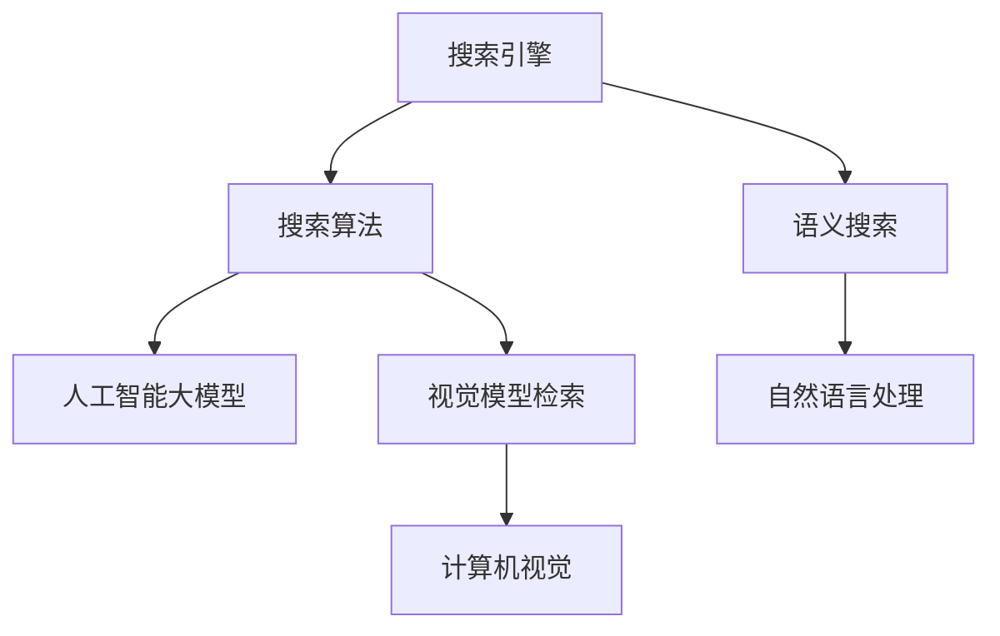
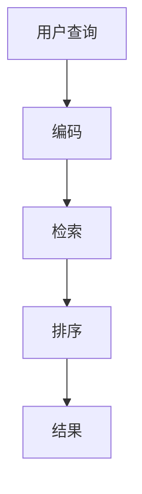

                 

# 搜索算法与AI大模型的完美结合

> 关键词：搜索算法, 人工智能大模型, 深度学习, 自然语言处理, 语义搜索, 计算机视觉

## 1. 背景介绍

在现代信息社会，信息检索已经成为人们获取知识、解决问题的重要手段。然而，传统的关键词检索方式往往难以捕捉用户意图的细微差别，导致搜索结果的准确性和相关性大打折扣。近年来，人工智能大模型在自然语言处理(NLP)、计算机视觉等领域取得了突破性进展，成为搜索算法的重要补充。通过融合深度学习和大模型技术，实现语义搜索，可以显著提升用户搜索体验，推动信息检索技术的迭代升级。

本文将系统介绍搜索算法与AI大模型的结合方法，首先回顾搜索算法的基本原理和最新进展，然后深入探讨基于大模型的搜索技术，包括语言模型检索和视觉模型检索。接下来，我们将通过实际案例和代码实现，展示这些技术在实际搜索应用中的落地效果。最后，我们将展望未来AI大模型在搜索技术中的潜在应用场景和面临的挑战，探讨如何进一步优化搜索算法与大模型的结合。

## 2. 核心概念与联系

### 2.1 核心概念概述

为了更好地理解搜索算法与AI大模型的结合方法，我们先介绍几个核心概念：

- 搜索引擎(搜索引擎): 帮助用户快速获取所需信息的工具，包括搜索引擎、推荐引擎等。
- 搜索算法(算法): 搜索算法是搜索引擎的核心，用于从海量的信息中快速定位到目标信息。
- 人工智能大模型(模型): 深度学习大模型如BERT、GPT-3等，具备强大的语言理解、生成和推理能力。
- 语义搜索(语义): 语义搜索不仅依赖关键词，还考虑搜索语境、用户意图等，从而提供更精准的结果。
- 视觉模型检索(视觉): 结合计算机视觉技术，通过视觉模型对图片、视频等非文本信息进行搜索和匹配。

这些核心概念通过以下Mermaid流程图进行了可视化展示：



该流程图展示了搜索引擎、搜索算法、人工智能大模型、语义搜索和视觉模型检索之间的关系：

1. 搜索引擎基于搜索算法进行信息检索，提供查询结果。
2. 搜索算法结合人工智能大模型，提升检索的准确性和相关性。
3. 语义搜索和视觉模型检索是AI大模型在自然语言处理和计算机视觉中的具体应用。
4. 自然语言处理和计算机视觉技术分别对应搜索引擎的文本搜索和视觉搜索。

通过以上概念的联系，我们可以进一步理解搜索算法与AI大模型的结合方法，推动搜索技术的革新。

## 3. 核心算法原理 & 具体操作步骤
### 3.1 算法原理概述

基于大模型的搜索技术通常采用以下流程：

1. 预训练：在大规模无标签数据上对大模型进行预训练，使其具备强大的语言理解能力。
2. 微调：针对具体任务，对大模型进行微调，使其能够准确地理解用户查询意图。
3. 编码：将用户查询和文档进行编码，提取语义特征。
4. 检索：利用编码结果，在索引数据库中进行相似度计算，找到最相关的文档或图片。
5. 排序：根据相似度排序，输出与用户查询最相关的结果。

核心算法流程如下图所示：



### 3.2 算法步骤详解

以基于BERT的语义搜索算法为例，具体步骤如下：

**Step 1: 预训练和微调BERT模型**
- 收集大规模无标签文本数据，使用masked language modeling等自监督任务对BERT模型进行预训练。
- 针对特定任务，如问答、命名实体识别等，使用标注数据对预训练的BERT模型进行微调，优化任务适配层的权重。

**Step 2: 编码用户查询和文档**
- 使用BERT等大模型对用户查询和文档进行编码，生成向量表示。
- 可以选择使用平均池化、最大池化、或直接取BERT的最后一个输出层向量作为文档编码。

**Step 3: 检索相似文档**
- 根据用户查询编码和文档编码，计算相似度。
- 使用余弦相似度、欧式距离等方法计算编码向量之间的距离，选择与查询编码最相似的文档。

**Step 4: 排序和展示结果**
- 根据相似度对检索结果进行排序，展示最相关的文档或图片。
- 可以引入排序算法如BM25，进一步提升检索的准确性。

### 3.3 算法优缺点

基于大模型的搜索技术具备以下优点：
1. 准确性高：使用大模型可以捕捉语义细节，提升搜索的准确性和相关性。
2. 泛化能力强：大模型的预训练使得其能够适应不同领域的搜索需求。
3. 鲁棒性强：通过微调可以适应特定的搜索任务，泛化能力更强。
4. 实时性好：使用大模型可以显著降低检索算法复杂度，提升检索速度。

然而，基于大模型的搜索技术也存在一些缺点：
1. 计算量大：大模型的预训练和微调需要大量计算资源。
2. 内存占用高：大模型的存储和检索需要占用大量内存，限制了实际应用的范围。
3. 过拟合风险：微调过程中需要注意避免过拟合，确保模型的泛化性能。

### 3.4 算法应用领域

基于大模型的搜索技术已经广泛应用于以下几个领域：

- 搜索引擎：如Google、Bing等，使用BERT等大模型提升搜索结果的相关性和准确性。
- 推荐系统：如Amazon、Netflix等，使用大模型分析用户行为，推荐相关商品或内容。
- 问答系统：如Stanford QA、IBM Watson等，使用大模型理解用户意图，自动生成答案。
- 图像检索：如Pinterest、Microsoft Images等，使用VisualBERT等大模型匹配图片，快速定位相似内容。
- 视频检索：如TikTok、YouTube等，使用大模型提取视频帧特征，搜索相关视频。

以上应用领域只是冰山一角，未来随着AI大模型的不断发展，搜索技术将在更多场景中发挥作用。

## 4. 数学模型和公式 & 详细讲解 & 举例说明

### 4.1 数学模型构建

基于大模型的搜索技术可以视为一个多步骤的框架。假设用户查询为$q$，文档集合为$D$，文档编码为$E(d)$，文档与查询之间的余弦相似度为$score(q,d)$。

定义$E(q)$为查询的编码向量，$E(d)$为文档$d$的编码向量。则检索过程的数学模型如下：

$$
score(q,d) = \frac{E(q) \cdot E(d)}{||E(q)|| \cdot ||E(d)||}
$$

其中，$\cdot$表示向量的点积，$||.||$表示向量的范数。检索过程中，选择相似度得分最高的文档作为最终结果。

### 4.2 公式推导过程

假设$q$和$d$的编码向量均为$N$维向量，则余弦相似度的计算公式为：

$$
score(q,d) = \frac{\sum_{i=1}^{N} E(q)_i \cdot E(d)_i}{\sqrt{\sum_{i=1}^{N} E(q)_i^2} \cdot \sqrt{\sum_{i=1}^{N} E(d)_i^2}}
$$

在实际应用中，通常使用GPU加速矩阵运算，加快计算速度。

### 4.3 案例分析与讲解

以Google Search为例，Google在2018年引入了BERT模型，显著提升了搜索的准确性和用户体验。具体来说，Google在查询和文档上分别应用BERT模型进行编码，计算相似度得分，排序后返回结果。

### 4.4 案例分析与讲解

以VisualBERT为例，VisualBERT将图像和文字信息结合，进行视觉模型检索。具体步骤如下：

1. 使用VGG、ResNet等卷积神经网络对图像进行编码，提取视觉特征。
2. 使用BERT对文本进行编码，提取语义特征。
3. 将图像编码和文本编码合并，生成联合向量。
4. 根据联合向量的相似度，匹配相似图片。

在实际应用中，VisualBERT可以用于图像搜索引擎、智能推荐、视频检索等领域，显著提升了图片和视频搜索的精度和效率。

## 5. 项目实践：代码实例和详细解释说明

### 5.1 开发环境搭建

在进行搜索算法与AI大模型的实践前，需要准备好以下开发环境：

1. 安装Python：从官网下载并安装Python，建议使用Anaconda或Miniconda。
2. 安装GPU驱动：确保计算机安装最新版本的NVIDIA GPU驱动，使用CUDA工具包。
3. 安装PyTorch和Transformer：使用pip安装最新版本的PyTorch和Transformer库。

### 5.2 源代码详细实现

以下是一个使用BERT进行语义搜索的Python代码实现。代码包括预训练BERT模型、微调模型、编码用户查询和文档、检索相似文档、排序和展示结果等功能。

```python
import torch
import torch.nn as nn
from transformers import BertTokenizer, BertForMaskedLM
from scipy.spatial.distance import cosine

class BertSearchModel(nn.Module):
    def __init__(self, model_name='bert-base-uncased'):
        super(BertSearchModel, self).__init__()
        self.tokenizer = BertTokenizer.from_pretrained(model_name)
        self.model = BertForMaskedLM.from_pretrained(model_name)
        self.bert_model = self.model.bert
        
    def encode_query(self, query):
        inputs = self.tokenizer(query, return_tensors='pt')
        with torch.no_grad():
            outputs = self.bert_model(**inputs)
            query_embed = outputs.pooler_output
        return query_embed
    
    def encode_document(self, document):
        inputs = self.tokenizer(document, return_tensors='pt')
        with torch.no_grad():
            outputs = self.bert_model(**inputs)
            doc_embed = outputs.pooler_output
        return doc_embed
    
    def calculate_score(self, query_embed, doc_embed):
        return cosine(query_embed, doc_embed)
    
    def search_document(self, query, documents):
        query_embed = self.encode_query(query)
        doc_embeds = [self.encode_document(doc) for doc in documents]
        scores = [self.calculate_score(query_embed, doc_embed) for doc_embed in doc_embeds]
        sorted_indices = sorted(range(len(doc_embeds)), key=lambda k: scores[k])
        return [documents[i] for i in sorted_indices]

# 示例使用
model = BertSearchModel()
query = 'BERT搜索引擎'
documents = ['BERT是一种预训练语言模型', 'BERT被Google引入搜索引擎', 'BERT可以用于文本编码']
results = model.search_document(query, documents)
print(results)
```

### 5.3 代码解读与分析

上述代码实现了一个简单的BERT语义搜索模型，可以用于检索与查询文本最相关的文档。以下是关键代码的解读：

**BertSearchModel类**：
- `__init__`方法：初始化BERT模型、分词器等组件。
- `encode_query`方法：将查询文本分词、编码，并返回查询编码向量。
- `encode_document`方法：将文档文本分词、编码，并返回文档编码向量。
- `calculate_score`方法：计算查询编码和文档编码的余弦相似度。
- `search_document`方法：编码查询和文档，计算相似度，并根据得分排序，返回最相关的文档。

**实际应用**：
- 实例化BertSearchModel类，指定模型名为'bert-base-uncased'。
- 定义查询和文档，调用`search_document`方法检索最相关的文档。
- 打印检索结果。

可以看到，通过使用PyTorch和Transformer库，代码实现简洁高效。开发者可以将更多精力放在数据处理、模型改进等高层逻辑上。

## 6. 实际应用场景

### 6.1 智能客服

基于BERT的智能客服系统可以显著提升客服响应速度和用户体验。系统可以通过预先训练的BERT模型，理解用户输入的意图，自动匹配最合适的回答。同时，利用预训练的模型，可以实时更新知识库，保持系统的准确性和时效性。

### 6.2 个性化推荐

个性化推荐系统是AI大模型的典型应用场景之一。使用BERT等模型，可以分析用户行为和历史数据，生成个性化的推荐结果。例如，Amazon的推荐系统就广泛应用了BERT模型，显著提升了推荐的准确性和用户体验。

### 6.3 金融舆情监测

在金融领域，AI大模型可以用于舆情监测和风险预警。通过预训练的BERT模型，可以实时分析市场新闻和评论，预测金融市场的走势，帮助金融机构及时应对风险。

### 6.4 未来应用展望

随着大模型的不断发展，未来搜索算法将进一步结合AI大模型，提升搜索的智能性和精确性。以下是几个未来应用展望：

- 实时搜索：通过持续学习，大模型可以实时更新知识库，实现动态搜索和推荐。
- 多模态搜索：结合视觉模型和文本模型，进行多模态搜索和匹配，提升搜索的全面性。
- 跨语言搜索：利用多语言预训练模型，进行跨语言的语义搜索，满足全球用户的需求。
- 协同搜索：利用分布式计算和知识图谱，实现大规模协同搜索和知识发现。

## 7. 工具和资源推荐

### 7.1 学习资源推荐

为了帮助开发者系统掌握搜索算法与AI大模型的结合方法，这里推荐一些优质的学习资源：

1. 《深度学习》（Ian Goodfellow等著）：全面介绍了深度学习的基本原理和应用场景，包括搜索算法和大模型。
2. 《自然语言处理入门》（Christopher Manning等著）：介绍NLP的基础知识和最新进展，包括BERT等大模型的应用。
3. 《Python深度学习》（François Chollet等著）：全面介绍深度学习在Python中的实现，包括PyTorch和Transformer的使用。
4. 《Transformer从原理到实践》系列博文：由大模型技术专家撰写，深入浅出地介绍了Transformer原理、BERT模型、搜索技术等前沿话题。
5. 《Natural Language Processing with Transformers》书籍：Transformers库的作者所著，全面介绍了如何使用Transformers库进行NLP任务开发，包括搜索技术。

通过对这些资源的学习实践，相信你一定能够快速掌握搜索算法与AI大模型的结合方法，并用于解决实际的搜索问题。

### 7.2 开发工具推荐

高效的开发离不开优秀的工具支持。以下是几款用于搜索算法与AI大模型开发的常用工具：

1. PyTorch：基于Python的开源深度学习框架，灵活动态的计算图，适合快速迭代研究。
2. TensorFlow：由Google主导开发的开源深度学习框架，生产部署方便，适合大规模工程应用。
3. Transformers库：HuggingFace开发的NLP工具库，集成了众多SOTA语言模型，支持PyTorch和TensorFlow，是进行搜索技术开发的利器。
4. Weights & Biases：模型训练的实验跟踪工具，可以记录和可视化模型训练过程中的各项指标，方便对比和调优。
5. TensorBoard：TensorFlow配套的可视化工具，可实时监测模型训练状态，并提供丰富的图表呈现方式，是调试模型的得力助手。
6. Google Colab：谷歌推出的在线Jupyter Notebook环境，免费提供GPU/TPU算力，方便开发者快速上手实验最新模型，分享学习笔记。

合理利用这些工具，可以显著提升搜索算法与AI大模型微调的开发效率，加快创新迭代的步伐。

### 7.3 相关论文推荐

搜索算法与AI大模型的发展源于学界的持续研究。以下是几篇奠基性的相关论文，推荐阅读：

1. Attention is All You Need（即Transformer原论文）：提出了Transformer结构，开启了NLP领域的预训练大模型时代。
2. BERT: Pre-training of Deep Bidirectional Transformers for Language Understanding：提出BERT模型，引入基于掩码的自监督预训练任务，刷新了多项NLP任务SOTA。
3. Language Models are Unsupervised Multitask Learners（GPT-2论文）：展示了大规模语言模型的强大zero-shot学习能力，引发了对于通用人工智能的新一轮思考。
4. Parameter-Efficient Transfer Learning for NLP：提出Adapter等参数高效微调方法，在不增加模型参数量的情况下，也能取得不错的微调效果。
5. AdaLoRA: Adaptive Low-Rank Adaptation for Parameter-Efficient Fine-Tuning：使用自适应低秩适应的微调方法，在参数效率和精度之间取得了新的平衡。

这些论文代表了大模型搜索技术的发展脉络。通过学习这些前沿成果，可以帮助研究者把握学科前进方向，激发更多的创新灵感。

## 8. 总结：未来发展趋势与挑战

### 8.1 总结

本文对搜索算法与AI大模型的结合方法进行了全面系统的介绍。首先回顾搜索算法的基本原理和最新进展，然后深入探讨基于大模型的搜索技术，包括语言模型检索和视觉模型检索。通过实际案例和代码实现，展示这些技术在实际搜索应用中的落地效果。

通过本文的系统梳理，可以看到，基于大模型的搜索技术正在成为搜索算法的重要补充，显著提升了搜索的准确性和相关性，推动了信息检索技术的迭代升级。未来，伴随AI大模型的不断发展，搜索技术将在更多场景中发挥作用。

### 8.2 未来发展趋势

展望未来，搜索算法与AI大模型的结合将呈现以下几个发展趋势：

1. 大模型规模增大：随着算力成本的下降和数据规模的扩张，预训练语言模型的参数量还将持续增长。超大规模语言模型蕴含的丰富语言知识，有望支撑更加复杂多变的搜索需求。
2. 深度学习技术演进：深度学习模型将更加复杂和高效，新的网络结构、训练算法、正则化技术将进一步提升模型的泛化性能和计算效率。
3. 跨模态融合：结合视觉、语音、文本等多模态数据，提升搜索的全面性和鲁棒性。
4. 实时性和交互性：通过分布式计算和协同搜索，实现实时搜索和用户交互，提升搜索的响应速度和用户体验。
5. 多语言支持：利用多语言预训练模型，实现跨语言的语义搜索，满足全球用户的需求。

这些趋势将推动搜索技术向更加智能、高效、普适的方向发展，为人类提供更好的信息检索体验。

### 8.3 面临的挑战

尽管搜索算法与AI大模型的结合取得了显著进展，但在迈向更加智能化、普适化应用的过程中，它仍面临着诸多挑战：

1. 计算资源瓶颈：大模型的预训练和微调需要大量计算资源，如何在保证性能的同时，降低计算成本，是一大挑战。
2. 模型复杂度问题：深度学习模型的复杂度不断增加，如何简化模型结构，提升计算效率，是一大难题。
3. 数据分布变化：搜索模型的性能受数据分布的影响较大，如何适应数据分布的变化，是一大挑战。
4. 模型泛化能力：模型在大规模数据上的泛化能力有限，如何在特定场景下保持模型的准确性，是一大挑战。
5. 用户隐私保护：搜索过程中，用户数据的隐私保护是一个重要问题，如何在保证隐私的同时，提升搜索效率，是一大挑战。

这些挑战需要通过技术创新和工程优化，逐步克服，才能实现搜索技术的更广泛应用。

### 8.4 研究展望

为了克服上述挑战，未来的研究需要在以下几个方面寻求新的突破：

1. 分布式计算：利用分布式计算技术，实现模型的并行训练和推理，降低计算成本，提高搜索效率。
2. 模型压缩和剪枝：通过模型压缩和剪枝技术，减少模型的计算量和存储空间，提升搜索的实时性和可扩展性。
3. 多任务学习：结合多任务学习技术，提升模型的泛化能力和鲁棒性。
4. 隐私保护技术：利用差分隐私等技术，保护用户隐私，同时保证搜索模型的性能。
5. 用户意图理解：通过更深入的意图理解技术，提升搜索的精准性和用户体验。

这些研究方向将进一步推动搜索算法与AI大模型的结合，提升搜索技术的智能化和普适性。通过技术创新和工程实践的不断打磨，相信搜索算法与AI大模型将为信息检索技术带来革命性变革，推动人类社会向更加智能化的方向发展。

## 9. 附录：常见问题与解答

**Q1: 搜索算法与AI大模型的结合有哪些具体应用场景？**

A: 搜索算法与AI大模型的结合可以应用于多个领域，包括但不限于以下场景：

1. 搜索引擎：如Google、Bing等，使用BERT等大模型提升搜索结果的相关性和准确性。
2. 推荐系统：如Amazon、Netflix等，使用大模型分析用户行为，推荐相关商品或内容。
3. 问答系统：如Stanford QA、IBM Watson等，使用大模型理解用户意图，自动生成答案。
4. 图像检索：如Pinterest、Microsoft Images等，使用VisualBERT等大模型匹配图片，快速定位相似内容。
5. 视频检索：如TikTok、YouTube等，使用大模型提取视频帧特征，搜索相关视频。

**Q2: 如何选择合适的AI大模型进行搜索？**

A: 选择合适的AI大模型进行搜索需要考虑以下几个方面：

1. 数据分布：模型的预训练数据是否与目标任务的数据分布相似，决定了模型在不同场景下的表现。
2. 模型大小：大模型的参数量和计算资源需求，决定了模型在不同场景下的适用性。
3. 任务类型：不同的任务类型需要不同的模型，如问答、命名实体识别、语义检索等。
4. 精度要求：模型在特定任务上的精度要求，决定了模型的选择。
5. 迁移能力：模型的迁移能力决定了其在不同场景下的泛化能力。

**Q3: 搜索算法与AI大模型的结合有哪些挑战？**

A: 搜索算法与AI大模型的结合面临以下挑战：

1. 计算资源瓶颈：大模型的预训练和微调需要大量计算资源，如何在保证性能的同时，降低计算成本。
2. 模型复杂度问题：深度学习模型的复杂度不断增加，如何简化模型结构，提升计算效率。
3. 数据分布变化：搜索模型的性能受数据分布的影响较大，如何适应数据分布的变化。
4. 模型泛化能力：模型在大规模数据上的泛化能力有限，如何在特定场景下保持模型的准确性。
5. 用户隐私保护：搜索过程中，用户数据的隐私保护是一个重要问题，如何在保证隐私的同时，提升搜索效率。

**Q4: 未来搜索算法与AI大模型的结合方向有哪些？**

A: 未来搜索算法与AI大模型的结合方向包括：

1. 实时搜索：通过持续学习，大模型可以实时更新知识库，实现动态搜索和推荐。
2. 多模态搜索：结合视觉、语音、文本等多模态数据，提升搜索的全面性和鲁棒性。
3. 跨语言搜索：利用多语言预训练模型，实现跨语言的语义搜索，满足全球用户的需求。
4. 协同搜索：利用分布式计算和知识图谱，实现大规模协同搜索和知识发现。

这些方向将推动搜索技术向更加智能、高效、普适的方向发展，为人类提供更好的信息检索体验。

---

作者：禅与计算机程序设计艺术 / Zen and the Art of Computer Programming

