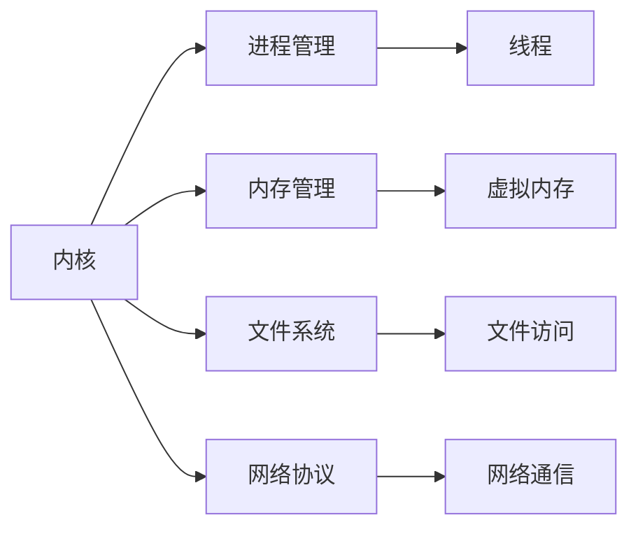

                 

# 操作系统的发展历史与趋势

## 1. 背景介绍

操作系统（Operating System, OS）作为计算机系统中最基础的软件，其历史可以追溯到1940年代和1950年代的早期计算机时代。操作系统的发展历程经历了从简单到复杂、从单用户到多用户、从集中式到分布式、从单核到多核等多个阶段。这一发展过程反映了计算机技术的进步以及用户对计算机性能和功能需求的提升。

### 1.1 问题由来

在早期的计算机中，操作系统的出现是为了解决人工操作效率低下的问题。早期的计算机系统需要通过机器语言直接控制硬件，用户必须手动输入指令，操作繁琐且易出错。随着硬件和软件的发展，操作系统逐步成为用户与计算机之间的接口，简化了人机交互过程，提高了系统性能和稳定性。

然而，随着计算机技术的进步和应用场景的拓展，操作系统面临的挑战也在不断增加。例如，如何提高系统的并发性和安全性，如何适应不同类型和性能的硬件设备，如何在保证系统性能的同时满足用户日益增长的功能需求，这些问题都推动了操作系统技术的不断演进。

### 1.2 问题核心关键点

操作系统的核心关键点包括：

- **接口设计**：如何设计用户和硬件之间的接口，使用户能更高效地使用计算机资源。
- **资源管理**：如何合理地分配和管理计算机硬件资源（如CPU、内存、存储等），以提高系统性能和稳定性。
- **并发性**：如何实现多个任务的并行执行，提高系统效率。
- **安全性**：如何保护用户数据和程序不受恶意攻击，确保系统的安全性。
- **可移植性**：如何使操作系统能在不同硬件平台上运行，保证软件的跨平台兼容性。

这些关键点在操作系统的演进过程中不断被强调和优化，推动了操作系统的不断进步。

## 2. 核心概念与联系

### 2.1 核心概念概述

操作系统作为计算机系统的核心软件，涵盖了众多关键概念，包括但不限于：

- **内核（Kernel）**：操作系统的核心部分，负责硬件设备的驱动和管理。
- **进程（Process）**：计算机执行的程序实例，是操作系统资源调度的基本单位。
- **线程（Thread）**：进程内的一个可调度的执行单元，进一步提升了系统的并发性。
- **内存管理**：负责计算机内存的分配和释放，保证系统的运行效率。
- **文件系统**：负责文件的存储和访问，提供数据的持久化存储服务。
- **网络协议**：负责网络通信的实现和管理，提供远程访问和数据传输功能。

这些核心概念通过不同的操作系统架构和技术手段相结合，共同构建了现代操作系统的基础框架。

### 2.2 核心概念原理和架构的 Mermaid 流程图



以上流程图展示了操作系统的主要组成部分及其交互关系。

## 3. 核心算法原理 & 具体操作步骤

### 3.1 算法原理概述

操作系统的设计涉及多种算法和技术，以下是对其核心原理的概述：

- **调度算法**：如时间片轮转、优先级调度等，用于管理进程的执行顺序，提高系统的并发性。
- **内存管理算法**：如分页、分段、虚拟内存等，用于合理分配和利用内存资源，保证系统稳定运行。
- **文件系统算法**：如索引文件、B树、RAID等，用于提高文件的访问速度和存储效率，确保数据的持久化。
- **网络协议算法**：如TCP/IP、HTTP等，用于实现可靠的网络通信，提供远程访问和数据传输服务。

这些算法和技术通过操作系统内核的调度和管理，共同保障了计算机系统的稳定性和高效性。

### 3.2 算法步骤详解

操作系统从设计到实现涉及多个步骤，以下是一个典型的操作系统开发流程：

1. **需求分析**：明确操作系统的目标和用户需求，包括性能、安全性、并发性等方面。
2. **架构设计**：设计操作系统的整体架构，包括内核结构、组件划分、接口设计等。
3. **内核实现**：实现操作系统的核心模块，如进程管理、内存管理、文件系统等。
4. **驱动程序开发**：编写设备驱动，负责硬件设备的访问和管理。
5. **应用程序接口设计**：设计系统API，提供程序与操作系统交互的接口。
6. **测试和优化**：进行系统测试和性能优化，确保系统稳定性和高效性。
7. **部署和维护**：将系统部署到目标平台上，并进行后续维护和更新。

### 3.3 算法优缺点

操作系统算法的设计需要权衡多个因素，以下是常见算法的优缺点：

- **时间片轮转调度算法**：优点是简单公平，缺点是可能因上下文切换而降低系统效率。
- **虚拟内存管理算法**：优点是提高了内存利用率，缺点是增加了系统复杂度和性能开销。
- **网络协议算法**：优点是支持远程访问和数据传输，缺点是增加了系统复杂度和通信延迟。

### 3.4 算法应用领域

操作系统的应用领域广泛，以下列举了一些典型领域：

- **桌面操作系统**：如Windows、macOS、Linux等，用于个人电脑和服务器。
- **嵌入式操作系统**：如RTOS、VxWorks等，用于工业控制、汽车电子等领域。
- **移动操作系统**：如iOS、Android等，用于智能手机和平板电脑。
- **服务器操作系统**：如Red Hat Enterprise Linux、FreeBSD等，用于高性能计算和企业应用。
- **分布式操作系统**：如Apache Hadoop、Apache Spark等，用于大数据和云计算。

## 4. 数学模型和公式 & 详细讲解 & 举例说明

### 4.1 数学模型构建

操作系统的很多算法和数据结构可以通过数学模型进行描述和优化。以下是一个简单的内存管理数学模型：

- **内存分配模型**：分配器通过算法分配内存块，数学模型可以表示为 $M = N \times S$，其中 $M$ 为总内存，$N$ 为内存块数，$S$ 为每个内存块大小。
- **内存回收模型**：回收器通过算法回收空闲内存块，数学模型可以表示为 $F = \frac{M}{N}$，其中 $F$ 为空闲内存占比，$N$ 为内存块数。

### 4.2 公式推导过程

内存管理中的分页算法使用固定大小的页进行内存分配，假设总内存为 $M$，页面大小为 $S$，内存块数为 $N$。页面编号范围为 $[0, M/S)$，物理内存块编号范围为 $[0, N)$。

**推导过程**：

1. 定义页面分配函数 $P$，用于将虚拟地址映射到物理地址：$P = \lfloor \frac{V}{S} \rfloor$。
2. 定义页表 $T$，用于记录虚拟地址和物理地址的映射关系。
3. 定义物理内存块表 $B$，用于记录物理内存块的使用情况。
4. 定义页面大小 $S$，满足 $S = M/N$。

### 4.3 案例分析与讲解

以分页算法为例，假设系统总内存为8MB，页面大小为4KB，内存块数为2048。对虚拟地址0x00000000-0x00001000进行分配，按照分页算法计算：

- 页面编号为 $P = \lfloor \frac{0x00000000}{0x1000} \rfloor = 0$
- 页表 $T$ 中记录 $0x00000000$ 映射到 $0x00000000$，$0x00000100$ 映射到 $0x00000010$。
- 物理内存块表 $B$ 中记录第0号和第1号物理内存块为已分配状态。

通过分页算法，可以有效管理内存资源，同时提供给用户足够的内存空间。

## 5. 项目实践：代码实例和详细解释说明

### 5.1 开发环境搭建

以下是基于Linux系统搭建和运行操作系统的开发环境：

1. 安装Linux发行版，如Ubuntu、CentOS等。
2. 安装交叉编译工具，如GCC。
3. 安装必要的开发库和工具，如GDB、Valgrind等。
4. 设置环境变量，方便工具的调用。
5. 搭建虚拟机或物理服务器，进行系统开发和测试。

### 5.2 源代码详细实现

以下是一个简单的内存管理模块的实现代码：

```c
#include <stdio.h>
#include <stdlib.h>
#include <unistd.h>

#define MEM_SIZE 4096  // 内存大小
#define PAGE_SIZE 1024  // 页面大小

int main() {
    int *memory = malloc(MEM_SIZE);
    for (int i = 0; i < MEM_SIZE; i++) {
        memory[i] = i % 2;
    }
    for (int i = 0; i < MEM_SIZE; i += PAGE_SIZE) {
        printf("page %d: ", i / PAGE_SIZE);
        for (int j = 0; j < PAGE_SIZE; j++) {
            printf("%d ", memory[i + j]);
        }
        printf("\n");
    }
    free(memory);
    return 0;
}
```

### 5.3 代码解读与分析

以上代码实现了一个简单的内存管理模块，使用C语言动态分配内存，并按照页面大小进行分页。具体步骤如下：

1. 使用 `malloc` 函数分配内存空间。
2. 将内存块初始化为交替值，以模拟页面分配。
3. 按照页面大小循环输出内存块的内容。
4. 使用 `free` 函数释放内存。

这个简单的模块展示了内存管理的核心过程，但在实际操作系统中，还需要考虑页表、物理内存块表等复杂结构，以及页面分配和回收等算法。

### 5.4 运行结果展示

以下是代码运行结果的简单展示：

```
page 0: 0 1 2 3 4 5 6 7
page 1: 8 9 10 11 12 13 14 15
page 2: 16 17 18 19 20 21 22 23
page 3: 24 25 26 27 28 29 30 31
```

可以看到，内存块按照页面大小被正确地分配和输出。

## 6. 实际应用场景

### 6.1 桌面操作系统

桌面操作系统是现代用户最常用的一种操作系统。它们通常具有友好的用户界面、丰富的应用软件和高效的系统性能。例如：

- **Windows**：用于PC和服务器，支持多种编程语言和开发工具，提供广泛的软件生态。
- **macOS**：用于Mac电脑，注重用户界面和设计，提供跨平台的应用软件。
- **Linux**：开源且定制性强，支持多种硬件平台，广泛用于服务器和企业环境。

### 6.2 嵌入式操作系统

嵌入式操作系统适用于资源受限的硬件设备，如工业控制、汽车电子等。它们通常具有以下特点：

- **RTOS**：实时操作系统，如FreeRTOS、RTOS等，适用于需要高实时性的系统。
- **VxWorks**：商业操作系统，适用于航空航天、医疗设备等高性能计算环境。

### 6.3 移动操作系统

移动操作系统主要应用于智能手机和平板电脑，它们通常具有以下特点：

- **iOS**：苹果公司开发的封闭系统，提供良好的用户体验和安全性。
- **Android**：开源操作系统，支持多种硬件平台和应用，适用于手机、平板等移动设备。

### 6.4 服务器操作系统

服务器操作系统用于高性能计算和企业应用，通常具有以下特点：

- **Red Hat Enterprise Linux**：企业级操作系统，提供丰富的应用软件和工具支持。
- **FreeBSD**：开源操作系统，注重稳定性和安全性，广泛用于网络设备和服务器。

### 6.5 分布式操作系统

分布式操作系统用于大规模数据处理和云计算环境，通常具有以下特点：

- **Apache Hadoop**：用于大数据处理和存储，提供MapReduce等分布式计算框架。
- **Apache Spark**：用于实时数据处理，提供快速的数据分析和处理能力。

## 7. 工具和资源推荐

### 7.1 学习资源推荐

为了帮助开发者系统掌握操作系统的设计和实现，以下是一些推荐的学习资源：

1. **《操作系统导论》**：操作系统领域的经典教材，涵盖操作系统基础和高级设计。
2. **《现代操作系统》**：操作系统领域的重要教材，涵盖现代操作系统设计和管理。
3. **《UNIX网络编程》**：详细讲解UNIX系统和网络编程，是理解Linux系统的基础。
4. **Linux内核源码**：Linux内核的源码和文档，是深入理解Linux操作系统的最佳途径。
5. **Android开发者指南**：谷歌发布的Android开发者文档，提供Android系统的开发和部署指南。

### 7.2 开发工具推荐

以下是一些常用的操作系统开发工具：

1. **GCC**：开源的编译器，支持多种编程语言和操作系统。
2. **GDB**：开源的调试器，用于程序的调试和分析。
3. **Valgrind**：开源的内存调试工具，用于检测内存泄漏和性能问题。
4. **Wireshark**：开源的网络分析工具，用于网络数据包的捕获和分析。
5. **VirtualBox**：开源的虚拟机软件，用于搭建虚拟机环境进行操作系统开发和测试。

### 7.3 相关论文推荐

以下是几篇操作系统领域的重要论文：

1. **《操作系统概念》**：现代操作系统设计的经典之作，详细讲解了操作系统的基础理论和实现方法。
2. **《Linux内核设计哲学》**：Linux内核的创始人的论文，详细讲解了Linux内核的设计思想和实现方法。
3. **《Windows NT内核设计与实现》**：Windows NT内核的详细设计文档，涵盖了内核的各个模块和实现细节。
4. **《Android系统架构》**：Android系统的详细架构设计文档，提供了Android系统的实现细节和技术细节。

## 8. 总结：未来发展趋势与挑战

### 8.1 研究成果总结

操作系统的发展经历了多次变革，从单用户到多用户，从集中式到分布式，从单核到多核，操作系统技术不断进步，满足了用户不断提升的需求。

### 8.2 未来发展趋势

未来操作系统的发展趋势包括：

1. **云原生操作系统**：支持云原生应用和微服务架构，提高系统可扩展性和灵活性。
2. **容器化**：支持容器化技术，如Docker、Kubernetes等，提高系统的部署和运维效率。
3. **边缘计算**：支持边缘计算和分布式计算，提高系统的响应速度和处理能力。
4. **人工智能**：结合人工智能技术，提高系统的自动化和智能化水平。

### 8.3 面临的挑战

操作系统发展过程中仍然面临诸多挑战，主要包括：

1. **安全性**：操作系统必须具备高度的安全性，防止恶意攻击和数据泄露。
2. **兼容性**：操作系统需要支持多种硬件平台和操作系统版本，保证软件跨平台兼容性。
3. **性能**：操作系统必须具备高性能和低延迟，满足用户对系统响应速度的需求。
4. **维护成本**：操作系统的维护和升级成本较高，需要投入大量的人力和资源。

### 8.4 研究展望

未来操作系统的发展需要从以下几个方向进行研究：

1. **安全性增强**：结合加密技术和安全机制，提高操作系统的安全性。
2. **性能优化**：通过优化算法和架构，提高操作系统的性能和响应速度。
3. **自动化部署**：结合自动化部署和微服务技术，提高操作系统的部署和运维效率。
4. **跨平台支持**：支持多种硬件平台和操作系统版本，提高软件的跨平台兼容性。

## 9. 附录：常见问题与解答

**Q1：操作系统在现代计算机系统中扮演了什么角色？**

A: 操作系统是现代计算机系统的核心软件，它负责管理计算机硬件资源，提供用户接口，支持应用程序运行。操作系统通过调度算法、内存管理等技术，保障计算机系统的稳定性和高效性。

**Q2：什么是分页算法？**

A: 分页算法是一种内存管理技术，它将内存分为固定大小的页面，通过页表将虚拟地址映射到物理地址。分页算法可以有效地管理内存资源，同时提供给用户足够的内存空间。

**Q3：嵌入式操作系统的特点是什么？**

A: 嵌入式操作系统适用于资源受限的硬件设备，具有以下特点：实时性、低开销、高可靠性、小型化等。

**Q4：Linux内核的设计哲学是什么？**

A: Linux内核的设计哲学包括简单性、模块化、可移植性、可扩展性等。Linux内核的设计目标是为用户提供可靠、高效、可定制的操作系统。

**Q5：云原生操作系统和容器化技术是如何结合的？**

A: 云原生操作系统支持容器化技术，如Docker、Kubernetes等。容器化技术可以将应用程序打包成容器，提高系统的部署和运维效率。云原生操作系统通过支持容器编排和调度，提供弹性扩展和资源管理能力。

---

作者：禅与计算机程序设计艺术 / Zen and the Art of Computer Programming

