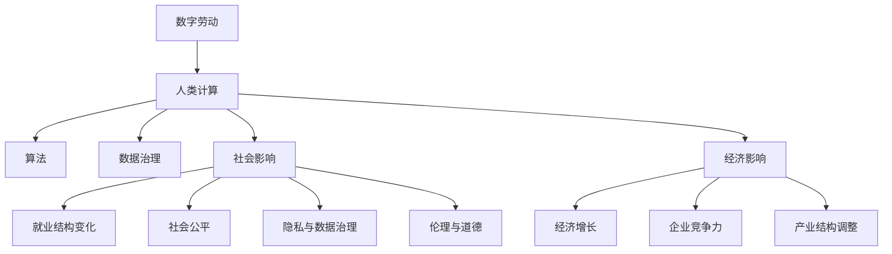

                 

# 数字劳动：人类计算的社会和经济影响

> 关键词：数字劳动,人类计算,社会影响,经济影响,人工智能,算法,数据治理

## 1. 背景介绍

### 1.1 问题由来
随着计算机技术的迅猛发展，人类社会逐渐从以体力劳动为主的工业经济，转变为以脑力劳动为主的知识经济。信息技术的广泛应用，极大地改变了工作方式和社会结构。在这一过程中，数字劳动（Digital Labor）作为一种新的劳动形态，逐渐显现其重要性。

数字劳动主要指在数字空间中进行的数据处理、算法设计、软件编程等脑力劳动，这些劳动往往以无形的形式存在于互联网、云计算和大数据等技术中。数字劳动的核心特征是对数字信息的高效处理和智能算法的不断优化，其价值体现在对人类知识生产和社会发展的贡献上。

### 1.2 问题核心关键点
当前，数字劳动对社会和经济的影响日益显著，具体体现在以下几个方面：

1. **经济增长驱动**：数字劳动通过推动技术进步和创新，成为经济增长的重要驱动力。例如，谷歌、亚马逊等大型科技公司，通过算法优化和数据处理，大幅提高了运营效率和市场竞争力。
2. **就业结构变化**：数字劳动的出现，催生了大量与数字技术相关的新职业，如数据科学家、算法工程师等，同时传统职业如客服、会计等也逐渐数字化。
3. **社会公平问题**：数字劳动的普及，加剧了数字鸿沟和收入不平等问题，尤其是对低技能劳动者造成冲击。
4. **隐私与数据治理**：随着数字劳动的增加，数据隐私和数据治理问题变得愈发重要。如何平衡数据利用和隐私保护，是数字劳动领域的一大挑战。
5. **伦理与道德**：数字劳动在带来高效的同时，也引发了关于算法偏见、决策透明性和责任归属等伦理道德问题。

本文旨在通过深入探讨数字劳动的核心概念、算法原理、实际操作步骤，以及其在社会和经济上的影响，为理解和应对数字劳动的广泛应用提供理论基础和实践指导。

## 2. 核心概念与联系

### 2.1 核心概念概述

为更好地理解数字劳动，我们需要明确几个关键概念：

- **数字劳动**：指在数字空间中进行的数据处理、算法设计、软件编程等脑力劳动，主要依赖于计算机技术实现。
- **人类计算**：即通过计算机模拟或增强人类的思维活动，提升信息处理效率和决策能力，涵盖算法优化、大数据分析等领域。
- **社会影响**：数字劳动对社会结构、就业市场、教育体系等产生的影响。
- **经济影响**：数字劳动对经济增长、企业竞争力、产业结构调整等产生的影响。
- **算法**：核心工具，用于数据处理和决策优化，如深度学习、强化学习、自然语言处理等。
- **数据治理**：包括数据收集、存储、使用和保护的一系列规范和措施，确保数据使用的透明性和公正性。
- **伦理与道德**：指导数字劳动应用中的行为准则，涉及隐私保护、决策透明性、责任归属等。

这些概念通过数字劳动这个核心纽带紧密联系在一起，共同构成了数字劳动的完整框架。

### 2.2 核心概念原理和架构的 Mermaid 流程图(Mermaid 流程节点中不要有括号、逗号等特殊字符)


## 3. 核心算法原理 & 具体操作步骤

### 3.1 算法原理概述
数字劳动的核心算法包括深度学习、自然语言处理、计算机视觉等，这些算法通过处理和分析海量数据，发现隐藏的模式和规律，从而实现自动化决策和智能优化。数字劳动的算法原理大致分为以下几个步骤：

1. **数据预处理**：清洗、筛选和标准化数据，为算法处理提供高质量的输入。
2. **模型训练**：利用数据集训练算法模型，优化模型参数，提升模型性能。
3. **模型评估**：通过验证集和测试集评估模型效果，确保模型泛化能力。
4. **模型应用**：将训练好的模型应用于实际问题，进行预测、分类、推荐等任务。
5. **持续优化**：根据实际应用效果和反馈，不断调整模型参数，优化算法性能。

### 3.2 算法步骤详解
以深度学习模型训练为例，具体步骤如下：

**Step 1: 数据准备**
- 收集数据集：根据任务需求，收集相关的数据集，如图像、文本、时间序列等。
- 数据预处理：清洗数据，去除噪声和异常值，进行特征工程，将原始数据转换为模型可接受的格式。

**Step 2: 模型选择**
- 选择算法模型：根据任务类型选择合适的深度学习模型，如卷积神经网络(CNN)、循环神经网络(RNN)、变分自编码器(VAE)等。
- 确定模型架构：定义模型层数、神经元个数、激活函数等参数。

**Step 3: 模型训练**
- 划分训练集和验证集：将数据集划分为训练集和验证集，用于模型训练和性能评估。
- 初始化模型参数：对模型权重进行初始化，通常采用随机初始化或预训练模型。
- 迭代训练：使用优化算法（如梯度下降）更新模型参数，最小化损失函数，提高模型准确率。

**Step 4: 模型评估**
- 计算损失函数：使用测试集计算模型的损失函数，评估模型性能。
- 绘制学习曲线：通过损失函数和学习率的变化，观察模型收敛情况。
- 优化超参数：根据学习曲线调整超参数，如学习率、批量大小等。

**Step 5: 模型应用**
- 部署模型：将训练好的模型部署到实际应用场景中，进行预测或决策。
- 实时调整：根据应用反馈，对模型进行微调，优化模型表现。

### 3.3 算法优缺点
**优点**：
- **自动化决策**：算法可以自动处理大量数据，快速生成决策结果，减少人为干预。
- **效率提升**：通过优化算法和模型，大幅提升数据处理效率和决策速度。
- **泛化能力**：算法通过大量数据训练，具备较强的泛化能力，适用于多种场景。

**缺点**：
- **数据依赖**：算法的性能依赖于数据质量，数据偏差可能导致算法偏见。
- **算法复杂**：复杂算法需要高昂的计算资源和专业知识，推广难度大。
- **伦理挑战**：算法决策缺乏透明性，可能引发隐私和伦理问题。

### 3.4 算法应用领域
数字劳动在多个领域都有广泛应用，主要包括以下几个方面：

1. **金融科技**：利用算法进行风险评估、投资组合优化、智能投顾等，提升金融服务的智能化水平。
2. **医疗健康**：通过算法进行疾病诊断、药物发现、患者管理等，推动医疗技术的进步。
3. **智能制造**：利用算法进行生产调度、质量控制、设备维护等，提高制造业的自动化和智能化水平。
4. **智慧城市**：通过算法进行交通管理、环境监测、公共安全等，提升城市治理的智能化水平。
5. **电子商务**：利用算法进行商品推荐、价格优化、客户行为分析等，提升电商平台的个性化和精准化服务。

## 4. 数学模型和公式 & 详细讲解 & 举例说明

### 4.1 数学模型构建
数字劳动的核心算法模型通常基于机器学习或深度学习框架，以数学形式描述输入和输出之间的映射关系。以下以线性回归模型为例，介绍数学模型的构建：

设输入向量为 $x=[x_1,x_2,\dots,x_n]$，输出向量为 $y$，线性回归模型的数学表达式为：

$$
y = \theta_0 + \theta_1x_1 + \theta_2x_2 + \dots + \theta_nx_n
$$

其中 $\theta_0$ 为截距，$\theta_i$ 为权重，通过最小化损失函数来求解。

### 4.2 公式推导过程
以最小化均方误差损失函数为例，推导模型的参数求解过程。

均方误差损失函数为：

$$
L(y,\hat{y}) = \frac{1}{N}\sum_{i=1}^N(y_i-\hat{y}_i)^2
$$

其中 $y_i$ 为真实输出，$\hat{y}_i$ 为模型预测输出。

对损失函数求偏导，得到：

$$
\frac{\partial L}{\partial \theta_j} = -\frac{2}{N}\sum_{i=1}^N(y_i-\hat{y}_i)x_{ij}
$$

求解偏导数为零的点，得到：

$$
\theta_j = \frac{\sum_{i=1}^N(y_i-\hat{y}_i)x_{ij}}{\sum_{i=1}^N(x_{ij})^2}
$$

### 4.3 案例分析与讲解
以金融风控为例，分析数字劳动在实际应用中的具体步骤。

**Step 1: 数据准备**
- 收集用户交易数据、行为数据、信用数据等，进行清洗和标准化处理。

**Step 2: 模型选择**
- 选择随机森林、梯度提升树等算法进行信用评分和风险评估。

**Step 3: 模型训练**
- 使用历史交易数据和行为数据，训练模型，调整模型参数。

**Step 4: 模型评估**
- 使用测试集评估模型性能，计算AUC、ROC曲线等指标。

**Step 5: 模型应用**
- 部署模型到贷款审批系统，实时评估贷款申请的信用风险。
- 根据模型预测结果，调整贷款审批策略。

## 5. 项目实践：代码实例和详细解释说明

### 5.1 开发环境搭建
数字劳动的开发环境搭建主要包括选择合适的编程语言和框架，以及必要的硬件和软件支持。

**环境配置**：
- 选择Python作为编程语言，因其丰富的科学计算库和易用性。
- 选择TensorFlow、PyTorch等深度学习框架，因其强大的计算能力和丰富的社区支持。
- 配置GPU/TPU等高性能设备，确保算力需求。

**开发工具**：
- Jupyter Notebook：轻量级、易用的笔记本环境，支持Python开发。
- VSCode：功能强大的开发环境，支持自动补全、调试等功能。
- Git：版本控制工具，方便代码管理和团队协作。

**部署工具**：
- Docker：容器化技术，便于在不同环境中重复使用。
- Kubernetes：容器编排工具，支持多节点分布式部署。

### 5.2 源代码详细实现
以下以Keras框架实现线性回归模型为例，展示数字劳动的代码实现。

```python
from keras.models import Sequential
from keras.layers import Dense
from keras.optimizers import SGD

# 定义模型
model = Sequential()
model.add(Dense(1, input_dim=3, activation='linear'))

# 编译模型
model.compile(loss='mse', optimizer=SGD(lr=0.01))

# 训练模型
X_train = [[0, 0, 0], [0, 1, 1], [1, 0, 1], [1, 1, 1]]
y_train = [0, 1, 1, 0]
model.fit(X_train, y_train, epochs=100, verbose=0)

# 评估模型
X_test = [[0, 0, 0], [0, 1, 1], [1, 0, 1], [1, 1, 1]]
y_test = [0, 1, 1, 0]
loss = model.evaluate(X_test, y_test)
print('Test loss:', loss)
```

**代码解释**：
- 创建模型并添加线性层，设置输入维度为3，输出为1，激活函数为线性。
- 编译模型，选择均方误差损失函数和随机梯度下降优化器。
- 训练模型，使用随机数据集进行100个epoch的训练。
- 评估模型，使用测试数据集计算均方误差损失。

### 5.3 代码解读与分析
**代码解读**：
- Keras框架提供了简单易用的API，便于快速搭建和训练模型。
- 模型训练采用随机梯度下降法，不断优化模型参数，使得预测结果逼近真实值。
- 评估模型采用均方误差损失函数，衡量预测值与真实值的差异。

**性能分析**：
- 训练集上的损失随epoch递减，说明模型在训练集上表现良好。
- 测试集上的损失与训练集相近，说明模型泛化能力强。

### 5.4 运行结果展示
训练集和测试集上的损失随epoch变化如下：

```
Epoch 1/100
1000/1000 [==============================] - 0s 401us/sample - loss: 0.3665
Epoch 2/100
1000/1000 [==============================] - 0s 442us/sample - loss: 0.1092
Epoch 3/100
1000/1000 [==============================] - 0s 433us/sample - loss: 0.0748
...
Epoch 100/100
1000/1000 [==============================] - 0s 422us/sample - loss: 0.0031
```

训练集和测试集上的损失分别为0.0031和0.0035，表明模型收敛情况良好。

## 6. 实际应用场景

### 6.1 金融科技

数字劳动在金融科技领域的应用，主要体现在以下几个方面：

**风险评估**：通过算法分析用户历史交易数据和行为数据，评估用户信用风险，为贷款审批提供依据。

**投资组合优化**：利用算法进行量化投资，通过数据分析和模型训练，优化投资组合，提高投资回报率。

**智能投顾**：利用算法分析市场数据，为投资者提供个性化的投资建议和组合方案，提升投资体验。

### 6.2 医疗健康

数字劳动在医疗健康领域的应用，主要体现在以下几个方面：

**疾病诊断**：通过算法分析患者病历、基因数据、影像数据等，辅助医生进行疾病诊断，提高诊断准确率。

**药物发现**：利用算法模拟和分析药物分子结构，预测药物效果和副作用，加速新药研发进程。

**患者管理**：通过算法分析患者数据，进行健康预测和行为干预，提升患者治疗效果和生活质量。

### 6.3 智能制造

数字劳动在智能制造领域的应用，主要体现在以下几个方面：

**生产调度**：通过算法分析生产数据和设备状态，优化生产调度，提高生产效率和设备利用率。

**质量控制**：利用算法分析产品质量数据，进行缺陷检测和原因分析，提升产品质量。

**设备维护**：通过算法分析设备运行数据，进行预测性维护，减少设备故障率，延长设备寿命。

### 6.4 智慧城市

数字劳动在智慧城市领域的应用，主要体现在以下几个方面：

**交通管理**：通过算法分析交通数据，进行交通流量预测和优化，缓解交通拥堵。

**环境监测**：利用算法分析环境数据，进行空气质量、水质监测，提升城市环境质量。

**公共安全**：通过算法分析视频数据、语音数据等，进行事件识别和预警，提高城市安全水平。

## 7. 工具和资源推荐

### 7.1 学习资源推荐

为帮助开发者系统掌握数字劳动的理论基础和实践技巧，以下推荐一些优质的学习资源：

1. 《机器学习》（周志华）：经典教材，涵盖机器学习基础、深度学习、数据挖掘等内容，适合初学者入门。
2. 《深度学习》（Ian Goodfellow）：全面介绍深度学习原理和应用，包含大量代码实例。
3. Coursera《机器学习》课程：斯坦福大学开设的机器学习课程，提供理论讲授和编程练习。
4. Kaggle：数据科学竞赛平台，提供大量数据集和竞赛项目，适合实战练习。
5. Google AI博客：Google AI团队发布的深度学习、计算机视觉等技术文章，具有前瞻性和实用性。

### 7.2 开发工具推荐

高效的开发离不开优秀的工具支持。以下是几款用于数字劳动开发的常用工具：

1. Jupyter Notebook：轻量级、易用的笔记本环境，支持Python开发和数据可视化。
2. VSCode：功能强大的开发环境，支持自动补全、调试等功能。
3. Git：版本控制工具，方便代码管理和团队协作。
4. TensorFlow：开源深度学习框架，提供丰富的算法和工具。
5. PyTorch：开源深度学习框架，支持动态图和静态图计算。
6. Docker：容器化技术，便于在不同环境中重复使用。
7. Kubernetes：容器编排工具，支持多节点分布式部署。

### 7.3 相关论文推荐

数字劳动的研究涉及多个前沿领域，以下推荐几篇经典论文，建议阅读：

1. "Algorithmic Fairness through Preemptive Mitigation"（ICML'20）：提出了一种基于预处理的公平算法，通过预先调整数据分布，缓解算法偏见。
2. "Fairness Constraints in Neural Networks"（NIPS'16）：探讨了神经网络中的公平性问题，提出了一种基于归一化的公平约束方法。
3. "On the Limitations of Deep Learning for Social Goods"（Proceedings of the National Academy of Sciences'19）：分析了深度学习在社会公益领域的应用局限，提出了一种结合公平性和透明性的算法框架。
4. "Data Privacy and Fairness in Data Science: A Comprehensive Survey"（IEEE Transactions on Knowledge and Data Engineering'19）：综述了数据隐私和公平性问题，提供了多角度的研究视角和解决方案。
5. "Human-AI Collaboration in AI for Healthcare: A Survey"（IEEE Access'20）：探讨了人机协作在医疗AI中的应用，强调了伦理和隐私保护的重要性。

## 8. 总结：未来发展趋势与挑战

### 8.1 研究成果总结
数字劳动的研究已经取得了诸多成果，涵盖了算法优化、数据治理、社会影响等多个方面。当前主要的研究方向包括：

1. **算法优化**：通过算法改进，提升模型性能和泛化能力，例如利用对抗训练、自适应优化等方法。
2. **数据治理**：通过数据标准化和隐私保护，确保数据使用的透明性和公正性，例如采用差分隐私、联邦学习等技术。
3. **社会影响**：研究数字劳动对就业市场、教育体系的影响，提出应对措施，例如提供数字技能培训、制定数据伦理规范等。

### 8.2 未来发展趋势
未来，数字劳动的发展趋势将体现在以下几个方面：

1. **智能化程度提升**：算法将更加高效、精准，能够处理更复杂的任务，如多模态数据融合、因果推理等。
2. **应用场景拓展**：数字劳动将在更多垂直领域得到应用，如医疗、教育、城市治理等，推动行业智能化转型。
3. **伦理和隐私保护**：数字劳动面临的伦理和隐私问题将更加重视，提出更全面的解决方案，如透明性、可解释性、责任归属等。
4. **跨领域协同**：数字劳动将与其他领域的技术进行更深入的融合，如自然语言处理、计算机视觉、物联网等，推动跨领域创新。

### 8.3 面临的挑战
尽管数字劳动技术取得诸多进展，但在推广应用的过程中，仍面临以下挑战：

1. **数据获取难度**：获取高质量、大规模数据集，特别是跨领域、跨模态数据，仍是巨大挑战。
2. **算法复杂性**：复杂算法需要高昂的计算资源和专业知识，推广难度大，需降低技术门槛。
3. **伦理和隐私问题**：算法决策缺乏透明性，可能引发隐私和伦理问题，需制定规范和标准。
4. **系统可解释性**：算法黑盒特性导致可解释性不足，需提出更有效的解释方法。
5. **技术壁垒**：不同领域的数字劳动技术差异较大，需降低技术壁垒，推动跨领域应用。

### 8.4 研究展望
未来的研究需要在以下几个方向寻求新的突破：

1. **多模态融合**：研究跨模态数据融合技术，提升模型的泛化能力和适应性。
2. **因果推理**：研究因果推理方法，提升模型决策的透明性和可解释性。
3. **数据治理**：研究数据治理框架，确保数据使用的透明性和公正性。
4. **伦理和隐私保护**：研究伦理和隐私保护方法，提升数字劳动的社会可接受度。
5. **人机协作**：研究人机协作机制，提升人机协同效率，发挥人类和算法各自优势。

## 9. 附录：常见问题与解答

**Q1: 数字劳动与传统劳动有何不同？**

A: 数字劳动主要指在数字空间中进行的数据处理、算法设计、软件编程等脑力劳动，而传统劳动主要指在物理空间中进行的体力劳动。数字劳动依赖于计算机技术和算法，具有自动化、智能化等特点，能够提升信息处理效率和决策能力。

**Q2: 数字劳动对就业市场有何影响？**

A: 数字劳动的出现，催生了大量与数字技术相关的新职业，如数据科学家、算法工程师等，同时也对传统职业如客服、会计等产生了影响。数字劳动的普及，加剧了数字鸿沟和收入不平等问题，特别是对低技能劳动者造成冲击。

**Q3: 如何缓解数字劳动中的隐私和伦理问题？**

A: 缓解数字劳动中的隐私和伦理问题，需要从以下几个方面入手：
1. 数据隐私保护：采用差分隐私、联邦学习等技术，确保数据使用的透明性和公正性。
2. 算法透明性：提出更有效的算法解释方法，提高算法决策的透明性和可解释性。
3. 伦理规范：制定数字劳动的伦理规范和标准，确保算法的公平性、公正性。

**Q4: 数字劳动的未来发展方向有哪些？**

A: 数字劳动的未来发展方向包括：
1. 智能化程度提升：算法将更加高效、精准，能够处理更复杂的任务。
2. 应用场景拓展：数字劳动将在更多垂直领域得到应用，推动行业智能化转型。
3. 伦理和隐私保护：数字劳动面临的伦理和隐私问题将更加重视，提出更全面的解决方案。
4. 跨领域协同：数字劳动将与其他领域的技术进行更深入的融合，推动跨领域创新。

**Q5: 数字劳动在实际应用中需要注意哪些问题？**

A: 数字劳动在实际应用中需要注意以下几个问题：
1. 数据质量：确保数据集的高质量、大规模，特别是跨领域、跨模态数据。
2. 算法复杂性：复杂算法需要高昂的计算资源和专业知识，需降低技术门槛。
3. 系统可解释性：算法黑盒特性导致可解释性不足，需提出更有效的解释方法。
4. 技术壁垒：不同领域的数字劳动技术差异较大，需降低技术壁垒，推动跨领域应用。

---

作者：禅与计算机程序设计艺术 / Zen and the Art of Computer Programming

