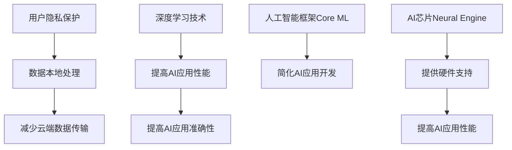

                 

**关键词：**AI应用、苹果、产业发展、深度学习、人工智能框架、AI芯片、隐私保护

## 1. 背景介绍

自从2017年发布了面向开发者的Core ML以来，苹果公司在人工智能（AI）领域取得了显著的进展。2021年，苹果发布了新的AI应用产业，旨在将AI集成到其生态系统的各个方面。本文将深入探讨苹果在AI应用产业方面的努力，包括其核心概念、算法原理、数学模型，以及项目实践和实际应用场景。

## 2. 核心概念与联系

### 2.1 苹果AI应用产业的核心概念

苹果的AI应用产业建立在以下核心概念之上：

- **隐私保护：**苹果强调在AI应用中保护用户隐私，数据处理在设备本地进行，减少云端数据传输。
- **深度学习：**苹果广泛应用深度学习技术，以提高其AI应用的性能和准确性。
- **人工智能框架：**苹果开发了自己的AI框架Core ML，旨在简化开发人员在其平台上构建AI应用的过程。
- **AI芯片：**苹果自主研发的AI芯片（如Neural Engine）为其AI应用提供了高效的硬件支持。

### 2.2 核心概念联系 Mermaid 流程图



## 3. 核心算法原理 & 具体操作步骤

### 3.1 算法原理概述

苹果的AI应用产业建立在深度学习算法之上。深度学习是一种机器学习方法，受人类大脑结构启发，使用神经网络模型来学习和做出决策。

### 3.2 算法步骤详解

1. **数据预处理：**收集、清洗和预处理数据，以便输入到深度学习模型中。
2. **模型构建：**构建神经网络模型，定义层次结构、激活函数和优化算法。
3. **训练模型：**使用训练数据集训练模型，调整模型参数以最小化预测误差。
4. **评估模型：**使用验证数据集评估模型性能，调整模型参数以提高准确性。
5. **部署模型：**将训练好的模型集成到应用中，在设备上运行以做出预测。

### 3.3 算法优缺点

**优点：**

- 深度学习模型可以学习复杂的非线性关系。
- 在图像、语音和自然语言处理等领域取得了显著的成功。

**缺点：**

- 训练深度学习模型需要大量的数据和计算资源。
- 模型解释性差，难以理解模型是如何做出预测的。

### 3.4 算法应用领域

苹果的AI应用产业在以下领域广泛应用：

- 图像和视频分析（如人脸识别、物体检测）
- 自然语言处理（如语音识别、文本分析）
- 语音识别和合成
- 运动和健康追踪

## 4. 数学模型和公式 & 详细讲解 & 举例说明

### 4.1 数学模型构建

深度学习模型是由多个神经元组成的层次结构，每个神经元都连接到下一层的神经元。数学模型可以表示为：

$$y = f(wx + b)$$

其中，$x$是输入向量，$w$是权重向量，$b$是偏置项，$f$是激活函数，$y$是输出。

### 4.2 公式推导过程

在训练过程中，模型参数（权重和偏置）通过最小化损失函数来调整。损失函数衡量模型预测和真实值之间的差异。例如，均方误差（MSE）损失函数定义为：

$$L = \frac{1}{n}\sum_{i=1}^{n}(y_i - \hat{y}_i)^2$$

其中，$y_i$是真实值，$ \hat{y}_i$是模型预测，$n$是样本数。

### 4.3 案例分析与讲解

假设我们要构建一个简单的线性回归模型来预测房价。输入特征$x$是房屋的面积，输出$y$是房屋的价格。我们可以使用以下公式来表示模型：

$$\text{Price} = w \times \text{Area} + b$$

其中，$w$是权重，$b$是偏置项。通过最小化MSE损失函数，我们可以估计模型参数$w$和$b$。一旦模型训练完成，我们就可以使用它来预测给定面积房屋的价格。

## 5. 项目实践：代码实例和详细解释说明

### 5.1 开发环境搭建

要构建和训练深度学习模型，我们需要设置开发环境。苹果推荐使用Xcode和Swift for TensorFlow库。我们还需要安装Python和相关的机器学习库（如TensorFlow或PyTorch）。

### 5.2 源代码详细实现

以下是使用Swift for TensorFlow构建简单线性回归模型的示例代码：

```swift
import TensorFlow

struct LinearModel: Layer {
    var weight: Tensor<Float>
    var bias: Tensor<Float>

    init(weight: Tensor<Float>, bias: Tensor<Float>) {
        self.weight = weight
        self.bias = bias
    }

    @differentiable
    func callAsFunction(_ input: Tensor<Float>) -> Tensor<Float> {
        return input * weight + bias
    }
}

var model = LinearModel(weight: Tensor<Float>(randomNormal: [1]), bias: Tensor<Float>(zeros: [1]))
let optimizer = SGD(for: model, learningRate: 0.02)

for epoch in 1...100 {
    let (loss, gradients) = valueWithGradient(at: model) { model -> Tensor<Float> in
        let prediction = model(Tensor<Float>(randomNormal: [1]))
        return meanSquaredError(predicted: prediction, expected: Tensor<Float>(randomNormal: [1]))
    }

    optimizer.update(&model.allDifferentiableVariables, along: gradients)
}
```

### 5.3 代码解读与分析

这段代码定义了一个简单的线性模型，并使用随机梯度下降（SGD）优化器来训练模型。在每个epoch中，模型预测输入值，并计算预测误差。然后，优化器更新模型参数以最小化误差。

### 5.4 运行结果展示

在训练完成后，我们可以使用训练好的模型来预测新数据。例如，我们可以输入房屋面积为1000平方英尺的房屋，并预测其价格。

## 6. 实际应用场景

### 6.1 当前应用

苹果的AI应用产业在其各种产品中得到广泛应用，包括：

- **iOS：**用于照片和视频分析（如人脸识别、物体检测）、语音识别和合成（如Siri）、运动和健康追踪（如Health app）。
- **Mac：**用于图像和视频编辑（如Photos和Final Cut Pro）、语音识别（如Dictation）和自然语言处理（如Spotlight搜索）。
- **Watch：**用于运动和健康追踪（如Activity和Health app）、语音识别（如Siri）和心率监测（如Heart Rate app）。

### 6.2 未来应用展望

未来，苹果的AI应用产业可能会扩展到以下领域：

- **自动驾驶：**使用AI技术来改善汽车驾驶体验和安全性。
- **增强现实（AR）和虚拟现实（VR）：**使用AI技术来改善AR和VR体验，如物体检测和跟踪。
- **医疗保健：**使用AI技术来改善医疗诊断和治疗，如图像分析和病理预测。

## 7. 工具和资源推荐

### 7.1 学习资源推荐

- **在线课程：**快速入门AI和机器学习的在线课程，如Coursera和Udacity上的课程。
- **书籍：**《深度学习》和《机器学习：一种概率视角》等经典书籍。
- **博客和论坛：**KDnuggets、Towards Data Science和Stack Overflow等博客和论坛。

### 7.2 开发工具推荐

- **开发环境：**Xcode和Swift for TensorFlow。
- **机器学习库：**TensorFlow、PyTorch和Scikit-learn。
- **云平台：**Google Colab和Kaggle Kernels等云平台。

### 7.3 相关论文推荐

- **深度学习基础：**Hinton et al., "Reducing the Dimensionality of Data with Neural Networks" (1995)
- **人脸识别：**Taigman et al., "DeepFace: A Lightweight Face Recognition System" (2014)
- **自然语言处理：**Vaswani et al., "Attention Is All You Need" (2017)

## 8. 总结：未来发展趋势与挑战

### 8.1 研究成果总结

苹果在AI应用产业方面取得了显著的进展，包括开发了自己的AI框架Core ML和AI芯片Neural Engine。这些努力使得AI应用在其生态系统中更加广泛和高效。

### 8.2 未来发展趋势

未来，苹果的AI应用产业可能会继续扩展到新的领域，如自动驾驶和医疗保健。此外，苹果可能会进一步改善其AI芯片和框架，以提高AI应用的性能和效率。

### 8.3 面临的挑战

苹果在AI应用产业方面面临的挑战包括：

- **隐私保护：**平衡AI应用的功能和用户隐私保护。
- **算法偏见：**确保AI应用公平和无偏见。
- **计算资源：**为AI应用提供足够的计算资源，特别是在移动设备上。

### 8.4 研究展望

未来的研究可能会集中在以下领域：

- **边缘计算：**在设备本地执行AI任务，减少云端数据传输。
- **联邦学习：**在保护隐私的情况下共享和训练AI模型。
- **自监督学习：**使用无标签数据来训练AI模型。

## 9. 附录：常见问题与解答

**Q1：苹果的AI应用产业与其他公司有何不同？**

A1：苹果的AI应用产业侧重于在设备本地执行AI任务，以保护用户隐私。此外，苹果开发了自己的AI框架Core ML和AI芯片Neural Engine，以简化开发人员的工作并提高AI应用的性能。

**Q2：如何开始构建自己的AI应用？**

A2：要开始构建自己的AI应用，您需要学习机器学习和深度学习的基础知识。然后，您可以使用像TensorFlow或PyTorch这样的库来构建和训练模型。最后，您可以使用像Core ML或TensorFlow Lite这样的框架将模型集成到您的应用中。

**Q3：AI应用在未来会有哪些发展？**

A3：未来，AI应用可能会扩展到新的领域，如自动驾驶和医疗保健。此外，AI应用可能会变得更加智能和个性化，能够适应用户的偏好和行为。

**Q4：AI应用面临的挑战是什么？**

A4：AI应用面临的挑战包括隐私保护、算法偏见和计算资源。解决这些挑战需要平衡AI应用的功能和用户隐私保护，确保AI应用公平和无偏见，并为AI应用提供足够的计算资源。

**Q5：如何在苹果平台上开发AI应用？**

A5：要在苹果平台上开发AI应用，您需要学习Swift编程语言和Xcode集成开发环境。您还需要学习Core ML框架，以便将AI模型集成到您的应用中。此外，您可能需要学习机器学习和深度学习的基础知识，以便构建和训练模型。

## 作者：禅与计算机程序设计艺术 / Zen and the Art of Computer Programming

