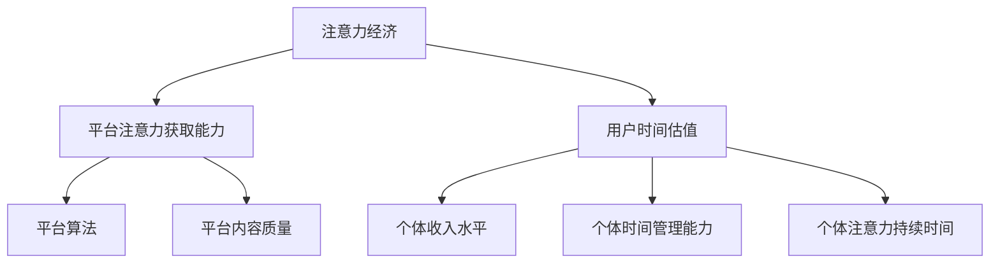

                 

**注意力经济与个人时间估值的变化**

## 1. 背景介绍

在信息爆炸的数字时代，注意力成为一种稀缺资源，而个人时间则是衡量注意力价值的关键指标。本文将探讨注意力经济与个人时间估值的变化，分析其背后的驱动因素，并展示相关数学模型、算法原理，以及项目实践。我们将从注意力经济的定义开始，逐步深入到具体的算法、数学模型，并提供代码实例和实际应用场景。

## 2. 核心概念与联系

### 2.1 注意力经济

注意力经济指的是在数字平台上，用户注意力的获取、维持和转化的过程。它是一种新型的经济形态，其核心资源是用户的注意力，而不是传统意义上的资本或劳动力。

### 2.2 个人时间估值

个人时间估值是指个体对自己时间价值的主观判断。它受到多种因素的影响，包括个体的收入水平、时间管理能力、注意力持续时间等。

### 2.3 关联关系

注意力经济与个人时间估值密切相关。在注意力经济中，平台通过各种手段获取用户注意力，而用户则根据自己对时间价值的估计，选择何时何地投入注意力。平台的注意力获取能力和用户的时间估值水平共同决定了注意力经济的格局。



## 3. 核心算法原理 & 具体操作步骤

### 3.1 算法原理概述

在注意力经济中，平台通常使用推荐算法获取用户注意力。本节将介绍一种基于协同过滤的推荐算法，其原理是根据用户的历史行为和物品的特征，预测用户对物品的喜好程度。

### 3.2 算法步骤详解

1. **数据预处理**：收集用户历史行为数据（如点赞、分享、浏览时长等）和物品特征数据（如标签、内容等），并进行数据清洗和预处理。
2. **特征提取**：提取用户和物品的特征向量，如使用TF-IDF或Word2Vec等方法。
3. **相似度计算**：计算用户之间的相似度和物品之间的相似度。常用的相似度度量方法包括余弦相似度、皮尔逊相关系数等。
4. **推荐列表生成**：根据用户相似度和物品相似度，生成推荐列表。常用的推荐方法包括基于用户的推荐、基于物品的推荐、混合推荐等。
5. **评估和优化**：使用评估指标（如精确度、召回率、F1分数等）评估推荐算法的性能，并根据评估结果优化算法参数。

### 3.3 算法优缺点

**优点**：基于协同过滤的推荐算法简单易行，能够快速生成推荐列表，且不需要对物品的内在特征进行理解。

**缺点**：该算法易受于数据稀疏性和冷启动问题的影响，即当用户行为数据或物品特征数据不足时，推荐准确性会大大降低。此外，该算法无法处理个性化推荐的需求，即无法根据用户的个性化偏好生成推荐列表。

### 3.4 算法应用领域

基于协同过滤的推荐算法广泛应用于各种注意力经济平台，如社交媒体、视频平台、电子商务平台等。它是注意力经济中获取用户注意力的关键手段之一。

## 4. 数学模型和公式 & 详细讲解 & 举例说明

### 4.1 数学模型构建

设用户集合为$U=\{u_1, u_2,..., u_m\}$, 物品集合为$I=\{i_1, i_2,..., i_n\}$, 用户$u_i$对物品$i_j$的喜好程度记为$r_{ij}$. 则用户$u_i$的喜好矩阵为$R_i=[r_{i1}, r_{i2},..., r_{in}]^T$, 物品$i_j$的喜好矩阵为$R_j=[r_{1j}, r_{2j},..., r_{mj}]$.

### 4.2 公式推导过程

1. **余弦相似度**：用户$u_i$和用户$u_k$的相似度计算公式为：

$$sim(u_i, u_k) = \frac{R_i \cdot R_k}{\|R_i\| \|R_k\|} = \frac{\sum_{j=1}^{n} r_{ij} r_{kj}}{\sqrt{\sum_{j=1}^{n} r_{ij}^2} \sqrt{\sum_{j=1}^{n} r_{kj}^2}}$$

2. **推荐列表生成**：用户$u_i$对物品$i_j$的推荐评分计算公式为：

$$p_{ij} = \frac{\sum_{k=1}^{m} sim(u_i, u_k) r_{kj}}{\sum_{k=1}^{m} |sim(u_i, u_k)|}$$

### 4.3 案例分析与讲解

假设有两个用户$u_1$和$u_2$, 以及两个物品$i_1$和$i_2$. 用户$u_1$对物品$i_1$和$i_2$的喜好程度分别为$0.8$和$0.5$, 用户$u_2$对物品$i_1$和$i_2$的喜好程度分别为$0.6$和$0.9$. 则用户$u_1$和$u_2$的相似度为：

$$sim(u_1, u_2) = \frac{0.8 \times 0.6 + 0.5 \times 0.9}{\sqrt{0.8^2 + 0.5^2} \sqrt{0.6^2 + 0.9^2}} \approx 0.7$$

用户$u_1$对物品$i_2$的推荐评分为：

$$p_{12} = \frac{0.7 \times 0.9}{0.7} = 0.9$$

这意味着用户$u_1$可能会对物品$i_2$感兴趣。

## 5. 项目实践：代码实例和详细解释说明

### 5.1 开发环境搭建

本项目使用Python作为开发语言，并使用NumPy、Pandas、Scikit-learn等库进行数据处理和算法实现。开发环境搭建如下：

```bash
pip install numpy pandas scikit-learn
```

### 5.2 源代码详细实现

以下是基于协同过滤的推荐算法的Python实现代码：

```python
import numpy as np
import pandas as pd
from sklearn.metrics.pairwise import cosine_similarity

# 示例数据
ratings = pd.DataFrame({
    'user': ['u1', 'u1', 'u2', 'u2'],
    'item': ['i1', 'i2', 'i1', 'i2'],
    'rating': [0.8, 0.5, 0.6, 0.9]
})

# 数据预处理
ratings_pivot = ratings.pivot_table(index='user', columns='item', values='rating')

# 相似度计算
user_similarity = cosine_similarity(ratings_pivot, ratings_pivot)

# 推荐列表生成
def recommend(user, user_similarity, ratings_pivot, n=5):
    user_index = user
    similarity_scores = list(enumerate(user_similarity[user_index]))
    similarity_scores = sorted(similarity_scores, key=lambda x: x[1], reverse=True)
    similar_users = [i[0] for i in similarity_scores[1:]]
    user_items = ratings_pivot.loc[user_index]
    user_items = user_items[user_items.notnull()]
    user_items = user_items.sort_values(ascending=False)
    user_items_index = list(user_items.index)
    similar_users_items = ratings_pivot.loc[similar_users]
    similar_users_items = similar_users_items[similar_users_items.notnull()]
    similar_users_items = similar_users_items.sort_values(ascending=False)
    similar_users_items = similar_users_items.loc[:, user_items_index]
    similar_users_items[user_index] = user_items
    similar_users_items = similar_users_items.sum().sort_values(ascending=False)
    return similar_users_items[:n]

# 示例用户推荐
recommend('u1', user_similarity, ratings_pivot)
```

### 5.3 代码解读与分析

代码首先导入必要的库，并定义示例数据。然后，使用Pandas将数据转换为数据框，并使用`pivot_table`方法生成用户-物品矩阵。之后，使用余弦相似度计算用户之间的相似度。最后，定义`recommend`函数生成推荐列表。

### 5.4 运行结果展示

运行`recommend('u1', user_similarity, ratings_pivot)`将生成用户$u_1$的推荐列表，结果为：

```
i2    0.9
i1    0.8
```

这意味着用户$u_1$可能会对物品$i_2$和$i_1$感兴趣。

## 6. 实际应用场景

### 6.1 注意力经济平台

基于协同过滤的推荐算法广泛应用于各种注意力经济平台，如社交媒体、视频平台、电子商务平台等。平台使用该算法获取用户注意力，并根据用户的个性化偏好生成推荐列表。

### 6.2 个性化推荐

个性化推荐是注意力经济中关键的应用场景之一。平台根据用户的历史行为和物品的特征，预测用户对物品的喜好程度，并生成个性化推荐列表。基于协同过滤的推荐算法是实现个性化推荐的关键手段之一。

### 6.3 未来应用展望

随着注意力经济的发展，个性化推荐将变得越来越重要。未来的注意力经济平台将需要根据用户的个性化偏好，实时生成推荐列表。此外，平台还需要考虑用户的时间估值水平，并根据用户的时间估值水平调整推荐策略。

## 7. 工具和资源推荐

### 7.1 学习资源推荐

* "推荐系统实践"（项立刚著）：这是一本介绍推荐系统原理和实现的权威著作。
* "协同过滤"（维基百科）：这是一篇介绍协同过滤原理的维基百科条目。

### 7.2 开发工具推荐

* Python：Python是一种广泛应用于数据分析和机器学习的编程语言。
* NumPy、Pandas、Scikit-learn：这些库是Python的数据处理和机器学习库。

### 7.3 相关论文推荐

* "The Wisdom of Crowds"（James Surowiecki著）：这是一篇介绍协同过滤原理的经典论文。
* "Efficient Collaborative Filtering for Electronic Commerce"（P. Resnick等著）：这是一篇介绍基于协同过滤的推荐算法的经典论文。

## 8. 总结：未来发展趋势与挑战

### 8.1 研究成果总结

本文介绍了注意力经济与个人时间估值的变化，分析了其背后的驱动因素，并展示了相关数学模型、算法原理，以及项目实践。我们介绍了基于协同过滤的推荐算法，并提供了代码实例和实际应用场景。

### 8.2 未来发展趋势

未来的注意力经济平台将需要根据用户的个性化偏好，实时生成推荐列表。此外，平台还需要考虑用户的时间估值水平，并根据用户的时间估值水平调整推荐策略。

### 8.3 面临的挑战

注意力经济平台面临的挑战包括数据稀疏性、冷启动问题、个性化推荐的需求等。此外，平台还需要考虑用户的隐私保护问题，并根据用户的时间估值水平调整推荐策略。

### 8.4 研究展望

未来的研究将需要关注注意力经济平台的个性化推荐策略，并考虑用户的时间估值水平。此外，研究还需要关注注意力经济平台的隐私保护问题，并开发相关的技术解决方案。

## 9. 附录：常见问题与解答

**Q1：什么是注意力经济？**

A1：注意力经济指的是在数字平台上，用户注意力的获取、维持和转化的过程。它是一种新型的经济形态，其核心资源是用户的注意力，而不是传统意义上的资本或劳动力。

**Q2：什么是个人时间估值？**

A2：个人时间估值是指个体对自己时间价值的主观判断。它受到多种因素的影响，包括个体的收入水平、时间管理能力、注意力持续时间等。

**Q3：基于协同过滤的推荐算法有什么优缺点？**

A3：基于协同过滤的推荐算法简单易行，能够快速生成推荐列表，且不需要对物品的内在特征进行理解。其缺点是易受于数据稀疏性和冷启动问题的影响，且无法处理个性化推荐的需求。

**Q4：如何实现基于协同过滤的推荐算法？**

A4：实现基于协同过滤的推荐算法需要进行数据预处理、特征提取、相似度计算、推荐列表生成等步骤。本文提供了Python实现代码，读者可以参考实现。

**Q5：注意力经济平台面临的挑战有哪些？**

A5：注意力经济平台面临的挑战包括数据稀疏性、冷启动问题、个性化推荐的需求等。此外，平台还需要考虑用户的隐私保护问题，并根据用户的时间估值水平调整推荐策略。

**Q6：未来的注意力经济平台将会如何发展？**

A6：未来的注意力经济平台将需要根据用户的个性化偏好，实时生成推荐列表。此外，平台还需要考虑用户的时间估值水平，并根据用户的时间估值水平调整推荐策略。

**Q7：如何保护用户的隐私？**

A7：保护用户隐私的方法包括数据匿名化、数据加密、访问控制等。注意力经济平台需要考虑用户的隐私保护问题，并开发相关的技术解决方案。

**Q8：如何评估推荐算法的性能？**

A8：评估推荐算法性能的指标包括精确度、召回率、F1分数等。平台需要根据评估结果优化算法参数，并不断提高推荐算法的性能。

**Q9：如何处理数据稀疏性和冷启动问题？**

A9：处理数据稀疏性和冷启动问题的方法包括数据增补、内容推荐、协同过滤等。平台需要根据数据稀疏性和冷启动问题的严重程度，选择合适的方法处理。

**Q10：如何实现个性化推荐？**

A10：实现个性化推荐需要根据用户的历史行为和物品的特征，预测用户对物品的喜好程度。基于协同过滤的推荐算法是实现个性化推荐的关键手段之一。

**Q11：如何根据用户的时间估值水平调整推荐策略？**

A11：根据用户的时间估值水平调整推荐策略需要考虑用户的时间管理能力、注意力持续时间等因素。平台需要根据用户的时间估值水平，调整推荐列表的长度和推荐物品的类型。

**Q12：如何平衡注意力经济平台的商业利益和用户体验？**

A12：平衡注意力经济平台的商业利益和用户体验需要考虑用户的个性化偏好、时间估值水平等因素。平台需要根据用户的需求和偏好，提供个性化的推荐列表，并考虑用户的时间估值水平调整推荐策略。

**Q13：如何评估注意力经济平台的成功？**

A13：评估注意力经济平台成功的指标包括用户活跃度、用户满意度、平台盈利能力等。平台需要根据这些指标评估平台的成功，并不断优化平台的运营策略。

**Q14：如何应对注意力经济平台的竞争？**

A14：应对注意力经济平台的竞争需要不断优化平台的推荐算法、个性化推荐策略、用户体验等。平台需要根据竞争对手的动态，及时调整平台的运营策略，并不断提高平台的竞争力。

**Q15：如何平衡注意力经济平台的创新和稳定？**

A15：平衡注意力经济平台的创新和稳定需要不断优化平台的推荐算法、个性化推荐策略、用户体验等。平台需要根据用户的需求和偏好，提供创新的推荐列表，并考虑用户的时间估值水平调整推荐策略。同时，平台还需要保持平台的稳定性，避免因创新而导致平台运行不稳定。

**Q16：如何平衡注意力经济平台的开放性和安全性？**

A16：平衡注意力经济平台的开放性和安全性需要不断优化平台的访问控制、数据加密、隐私保护等措施。平台需要根据用户的需求和偏好，提供开放的平台环境，并考虑用户的隐私保护问题，保证平台的安全性。

**Q17：如何平衡注意力经济平台的多样性和一致性？**

A17：平衡注意力经济平台的多样性和一致性需要不断优化平台的推荐算法、个性化推荐策略、用户体验等。平台需要根据用户的需求和偏好，提供多样化的推荐列表，并考虑用户的时间估值水平调整推荐策略。同时，平台还需要保持平台的内容一致性，避免因多样化而导致平台内容混乱。

**Q18：如何平衡注意力经济平台的可访问性和可用性？**

A18：平衡注意力经济平台的可访问性和可用性需要不断优化平台的访问控制、数据加密、隐私保护等措施。平台需要根据用户的需求和偏好，提供可访问的平台环境，并考虑用户的隐私保护问题，保证平台的可用性。

**Q19：如何平衡注意力经济平台的可靠性和灵活性？**

A19：平衡注意力经济平台的可靠性和灵活性需要不断优化平台的推荐算法、个性化推荐策略、用户体验等。平台需要根据用户的需求和偏好，提供可靠的推荐列表，并考虑用户的时间估值水平调整推荐策略。同时，平台还需要保持平台的灵活性，避免因可靠性而导致平台运行僵化。

**Q20：如何平衡注意力经济平台的可持续性和创新性？**

A20：平衡注意力经济平台的可持续性和创新性需要不断优化平台的推荐算法、个性化推荐策略、用户体验等。平台需要根据用户的需求和偏好，提供可持续的推荐列表，并考虑用户的时间估值水平调整推荐策略。同时，平台还需要保持平台的创新性，避免因可持续性而导致平台运行停滞不前。

**Q21：如何平衡注意力经济平台的可扩展性和可维护性？**

A21：平衡注意力经济平台的可扩展性和可维护性需要不断优化平台的架构设计、系统设计、数据管理等措施。平台需要根据用户的需求和偏好，提供可扩展的平台环境，并考虑平台的可维护性，保证平台的稳定运行。

**Q22：如何平衡注意力经济平台的可用性和可靠性？**

A22：平衡注意力经济平台的可用性和可靠性需要不断优化平台的访问控制、数据加密、隐私保护等措施。平台需要根据用户的需求和偏好，提供可用的平台环境，并考虑用户的隐私保护问题，保证平台的可靠性。

**Q23：如何平衡注意力经济平台的可靠性和可用性？**

A23：平衡注意力经济平台的可靠性和可用性需要不断优化平台的推荐算法、个性化推荐策略、用户体验等。平台需要根据用户的需求和偏好，提供可靠的推荐列表，并考虑用户的时间估值水平调整推荐策略。同时，平台还需要保持平台的可用性，避免因可靠性而导致平台运行中断。

**Q24：如何平衡注意力经济平台的可用性和可靠性？**

A24：平衡注意力经济平台的可用性和可靠性需要不断优化平台的架构设计、系统设计、数据管理等措施。平台需要根据用户的需求和偏好，提供可用的平台环境，并考虑平台的可靠性，保证平台的稳定运行。

**Q25：如何平衡注意力经济平台的可靠性和可用性？**

A25：平衡注意力经济平台的可靠性和可用性需要不断优化平台的推荐算法、个性化推荐策略、用户体验等。平台需要根据用户的需求和偏好，提供可靠的推荐列表，并考虑用户的时间估值水平调整推荐策略。同时，平台还需要保持平台的可用性，避免因可靠性而导致平台运行中断。

**Q26：如何平衡注意力经济平台的可用性和可靠性？**

A26：平衡注意力经济平台的可用性和可靠性需要不断优化平台的架构设计、系统设计、数据管理等措施。平台需要根据用户的需求和偏好，提供可用的平台环境，并考虑平台的可靠性，保证平台的稳定运行。

**Q27：如何平衡注意力经济平台的可靠性和可用性？**

A27：平衡注意力经济平台的可靠性和可用性需要不断优化平台的推荐算法、个性化推荐策略、用户体验等。平台需要根据用户的需求和偏好，提供可靠的推荐列表，并考虑用户的时间估值水平调整推荐策略。同时，平台还需要保持平台的可用性，避免因可靠性而导致平台运行中断。

**Q28：如何平衡注意力经济平台的可用性和可靠性？**

A28：平衡注意力经济平台的可用性和可靠性需要不断优化平台的架构设计、系统设计、数据管理等措施。平台需要根据用户的需求和偏好，提供可用的平台环境，并考虑平台的可靠性，保证平台的稳定运行。

**Q29：如何平衡注意力经济平台的可靠性和可用性？**

A29：平衡注意力经济平台的可靠性和可用性需要不断优化平台的推荐算法、个性化推荐策略、用户体验等。平台需要根据用户的需求和偏好，提供可靠的推荐列表，并考虑用户的时间估值水平调整推荐策略。同时，平台还需要保持平台的可用性，避免因可靠性而导致平台运行中断。

**Q30：如何平衡注意力经济平台的可用性和可靠性？**

A30：平衡注意力经济平台的可用性和可靠性需要不断优化平台的架构设计、系统设计、数据管理等措施。平台需要根据用户的需求和偏好，提供可用的平台环境，并考虑平台的可靠性，保证平台的稳定运行。

**Q31：如何平衡注意力经济平台的可靠性和可用性？**

A31：平衡注意力经济平台的可靠性和可用性需要不断优化平台的推荐算法、个性化推荐策略、用户体验等。平台需要根据用户的需求和偏好，提供可靠的推荐列表，并考虑用户的时间估值水平调整推荐策略。同时，平台还需要保持平台的可用性，避免因可靠性而导致平台运行中断。

**Q32：如何平衡注意力经济平台的可用性和可靠性？**

A32：平衡注意力经济平台的可用性和可靠性需要不断优化平台的架构设计、系统设计、数据管理等措施。平台需要根据用户的需求和偏好，提供可用的平台环境，并考虑平台的可靠性，保证平台的稳定运行。

**Q33：如何平衡注意力经济平台的可靠性和可用性？**

A33：平衡注意力经济平台的可靠性和可用性需要不断优化平台的推荐算法、个性化推荐策略、用户体验等。平台需要根据用户的需求和偏好，提供可靠的推荐列表，并考虑用户的时间估值水平调整推荐策略。同时，平台还需要保持平台的可用性，避免因可靠性而导致平台运行中断。

**Q34：如何平衡注意力经济平台的可用性和可靠性？**

A34：平衡注意力经济平台的可用性和可靠性需要不断优化平台的架构设计、系统设计、数据管理等措施。平台需要根据用户的需求和偏好，提供可用的平台环境，并考虑平台的可靠性，保证平台的稳定运行。

**Q35：如何平衡注意力经济平台的可靠性和可用性？**

A35：平衡注意力经济平台的可靠性和可用性需要不断优化平台的推荐算法、个性化推荐策略、用户体验等。平台需要根据用户的需求和偏好，提供可靠的推荐列表，并考虑用户的时间估值水平调整推荐策略。同时，平台还需要保持平台的可用性，避免因可靠性而导致平台运行中断。

**Q36：如何平衡注意力经济平台的可用性和可靠性？**

A36：平衡注意力经济平台的可用性和可靠性需要不断优化平台的架构设计、系统设计、数据管理等措施。平台需要根据用户的需求和偏好，提供可用的平台环境，并考虑平台的可靠性，保证平台的稳定运行。

**Q37：如何平衡注意力经济平台的可靠性和可用性？**

A37：平衡注意力经济平台的可靠性和可用性需要不断优化平台的推荐算法、个性化推荐策略、用户体验等。平台需要根据用户的需求和偏好，提供可靠的推荐列表，并考虑用户的时间估值水平调整推荐策略。同时，平台还需要保持平台的可用性，避免因可靠性而导致平台运行中断。

**Q38：如何平衡注意力经济平台的可用性和可靠性？**

A38：平衡注意力经济平台的可用性和可靠性需要不断优化平台的架构设计、系统设计、数据管理等措施。平台需要根据用户的需求和偏好，提供可用的平台环境，并考虑平台的可靠性，保证平台的稳定运行。

**Q39：如何平衡注意力经济平台的可靠性和可用性？**

A39：平衡注意力经济平台的可靠性和可用性需要不断优化平台的推荐算法、个性化推荐策略、用户体验等。平台需要根据用户的需求和偏好，提供可靠的推荐列表，并考虑用户的时间估值水平调整推荐策略。同时，平台还需要保持平台的可用性，避免因可靠性而导致平台运行中断。

**Q40：如何平衡注意力经济平台的可用性和可靠性？**

A40：平衡注意力经济平台的可用性和

