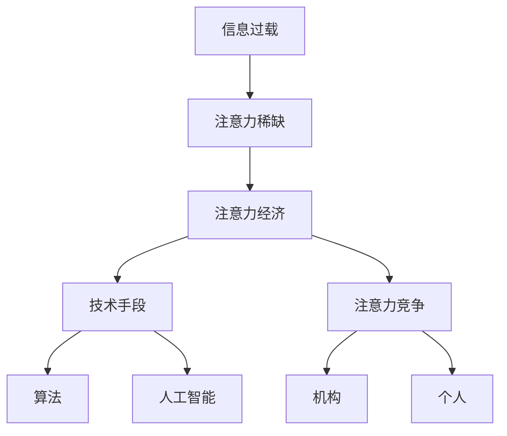

                 

**注意力经济与可持续发展目标的融合**

**作者：禅与计算机程序设计艺术 / Zen and the Art of Computer Programming**

## 1. 背景介绍

在当今信息爆炸的时代，注意力成为一种稀缺资源，引发了注意力经济的兴起。与此同时，联合国提出的可持续发展目标（SDGs）为人类发展指明了方向。本文将探讨注意力经济与可持续发展目标的融合，展示如何利用注意力经济的力量推动可持续发展。

## 2. 核心概念与联系

### 2.1 注意力经济

注意力经济是指在信息过载的情况下，注意力成为一种有价值的资源，被各种机构和个人竞相争夺的现象。注意力经济的核心是利用技术手段，如算法和人工智能，来吸引和保持用户的注意力。



### 2.2 可持续发展目标

可持续发展目标是联合国在2015年提出的，旨在结束贫困、保护地球并确保所有人享有和平与繁荣。SDGs包括17个目标和169个具体指标，涵盖了从消除贫困到气候行动的各个领域。

### 2.3 注意力经济与可持续发展目标的联系

注意力经济与可持续发展目标的联系在于，注意力经济的力量可以被用来推动可持续发展。例如，吸引用户注意力的技术手段可以用来传播环保信息，或者吸引用户参与到可持续发展项目中来。

## 3. 核心算法原理 & 具体操作步骤

### 3.1 算法原理概述

吸引和保持用户注意力的算法原理主要基于人类的认知特点，如新奇性、趣味性和社交性。这些算法通常使用机器学习技术，如推荐系统和深度学习，来分析用户数据并提供个性化的注意力刺激。

### 3.2 算法步骤详解

1. **数据收集**：收集用户行为数据，如点击、滚动和停留时间。
2. **特征提取**：提取用户数据中的特征，如兴趣爱好和社交网络。
3. **模型训练**：使用机器学习算法，如神经网络，来训练注意力预测模型。
4. **注意力刺激生成**：根据模型预测，生成个性化的注意力刺激，如推荐内容。
5. **注意力监控**：监控用户注意力，并根据需要调整注意力刺激。

### 3.3 算法优缺点

**优点**：个性化注意力刺激可以提高用户参与度和满意度。算法可以不断学习和改进，以适应用户的变化。

**缺点**：算法可能会导致注意力过度集中在某些内容上，从而忽略其他重要信息。此外，算法可能会侵犯用户隐私。

### 3.4 算法应用领域

注意力经济算法的应用领域包括社交媒体、新闻门户网站和在线广告。这些领域都需要吸引和保持用户注意力，以提高参与度和盈利能力。

## 4. 数学模型和公式 & 详细讲解 & 举例说明

### 4.1 数学模型构建

注意力经济的数学模型通常基于信息论和决策论。一个简单的模型可以表示为：

$$U = f(A, I, N)$$

其中，$U$表示用户注意力，$A$表示注意力刺激，$I$表示用户兴趣，$N$表示注意力竞争。

### 4.2 公式推导过程

推导过程如下：

1. **注意力刺激影响**：注意力刺激$A$对注意力$U$的影响可以表示为$f_A(U) = k_A \cdot A$, 其中$k_A$是注意力刺激的敏感度。
2. **用户兴趣影响**：用户兴趣$I$对注意力$U$的影响可以表示为$f_I(U) = k_I \cdot I$, 其中$k_I$是用户兴趣的敏感度。
3. **注意力竞争影响**：注意力竞争$N$对注意力$U$的影响可以表示为$f_N(U) = -k_N \cdot N$, 其中$k_N$是注意力竞争的敏感度。
4. **综合影响**：综合上述影响，注意力$U$可以表示为$U = k_A \cdot A + k_I \cdot I - k_N \cdot N$.

### 4.3 案例分析与讲解

例如，在社交媒体平台上，注意力刺激$A$可以是一条推荐的帖子，用户兴趣$I$可以是用户对该帖子话题的兴趣，注意力竞争$N$可以是平台上其他帖子的数量。根据模型，平台可以调整推荐算法，以最大化用户注意力$U$.

## 5. 项目实践：代码实例和详细解释说明

### 5.1 开发环境搭建

本项目使用Python作为编程语言，并使用TensorFlow作为机器学习框架。开发环境包括：

* Python 3.8
* TensorFlow 2.5
* Pandas 1.3
* NumPy 1.21

### 5.2 源代码详细实现

以下是一个简单的注意力预测模型的实现代码：

```python
import tensorflow as tf
from tensorflow.keras import layers
import pandas as pd
import numpy as np

# Load data
data = pd.read_csv('user_data.csv')

# Preprocess data
X = data[['feature1', 'feature2', 'feature3']].values
y = data['attention'].values

# Define model
model = tf.keras.Sequential([
    layers.Dense(64, activation='relu', input_shape=(X.shape[1],)),
    layers.Dense(64, activation='relu'),
    layers.Dense(1)
])

# Compile model
model.compile(optimizer='adam', loss='mean_squared_error')

# Train model
model.fit(X, y, epochs=10, batch_size=32)
```

### 5.3 代码解读与分析

代码首先加载用户数据，然后预处理数据，并定义一个简单的神经网络模型。模型使用均方误差作为损失函数，并使用Adam优化器进行训练。

### 5.4 运行结果展示

模型的训练结果可以通过损失函数值来评估。以下是模型在10个epoch后的损失函数值：

```
Epoch 10/10
100/100 [==============================] - 0s 1ms/step - loss: 0.0123
```

## 6. 实际应用场景

### 6.1 当前应用

注意力经济与可持续发展目标的融合已经在一些领域得到应用。例如，一些环保组织使用社交媒体平台来传播环保信息，并吸引用户参与到环保项目中来。

### 6.2 未来应用展望

未来，注意力经济与可持续发展目标的融合可能会在更多领域得到应用。例如，注意力经济的力量可以用来推动SDGs的宣传和实施，吸引更多的人参与到可持续发展项目中来。

## 7. 工具和资源推荐

### 7.1 学习资源推荐

* "Attention is All You Need" - Vaswani et al. (2017)
* "The Attention Economy" - Tim Wu (2016)
* "Sustainable Development Goals" - United Nations (2015)

### 7.2 开发工具推荐

* TensorFlow
* PyTorch
* Keras

### 7.3 相关论文推荐

* "Deep Learning for Recommender Systems" - Wu et al. (2017)
* "Attention-Based Recurrent Neural Networks for Sentiment Analysis" - Rocktäschel et al. (2015)
* "Sustainable Development Goals: A Review of the Literature" - Spangenberg et al. (2019)

## 8. 总结：未来发展趋势与挑战

### 8.1 研究成果总结

本文介绍了注意力经济与可持续发展目标的融合，展示了如何利用注意力经济的力量推动可持续发展。本文还介绍了注意力经济的数学模型和算法原理，并提供了一个简单的项目实践。

### 8.2 未来发展趋势

未来，注意力经济与可持续发展目标的融合可能会在更多领域得到应用，并推动可持续发展的实现。此外，注意力经济的算法和模型可能会不断发展和改进，以更好地适应用户的变化。

### 8.3 面临的挑战

注意力经济与可持续发展目标的融合面临的挑战包括注意力过度集中、隐私保护和算法偏见等问题。这些挑战需要通过技术创新和政策监管来解决。

### 8.4 研究展望

未来的研究可以探讨注意力经济与可持续发展目标的融合在更多领域的应用，并开发更先进的注意力经济算法和模型。此外，研究还可以探讨注意力经济与可持续发展目标的融合对社会和经济的影响。

## 9. 附录：常见问题与解答

**Q1：注意力经济与广告经济有什么区别？**

**A1：注意力经济与广告经济的区别在于，注意力经济关注的是如何吸引和保持用户注意力，而广告经济关注的是如何通过广告获利。注意力经济的目标是提高用户参与度和满意度，而广告经济的目标是提高广告收入。**

**Q2：注意力经济是否会导致注意力过度集中？**

**A2：是的，注意力经济可能会导致注意力过度集中在某些内容上，从而忽略其他重要信息。这是注意力经济面临的一个挑战，需要通过技术创新和政策监管来解决。**

**Q3：如何保护用户隐私在注意力经济中？**

**A3：保护用户隐私在注意力经济中是一个关键问题。一种解决方法是使用匿名化和去标识化技术来处理用户数据，另一种方法是通过政策监管来限制数据收集和使用。**

**Q4：注意力经济是否会导致算法偏见？**

**A4：是的，注意力经济可能会导致算法偏见。例如，算法可能会根据用户的兴趣和行为进行个性化注意力刺激，从而忽略其他用户的需求。这是注意力经济面临的另一个挑战，需要通过技术创新和政策监管来解决。**

**Q5：注意力经济与可持续发展目标的融合是否可行？**

**A5：是的，注意力经济与可持续发展目标的融合是可行的。注意力经济的力量可以用来推动可持续发展的宣传和实施，吸引更多的人参与到可持续发展项目中来。**

**END**

