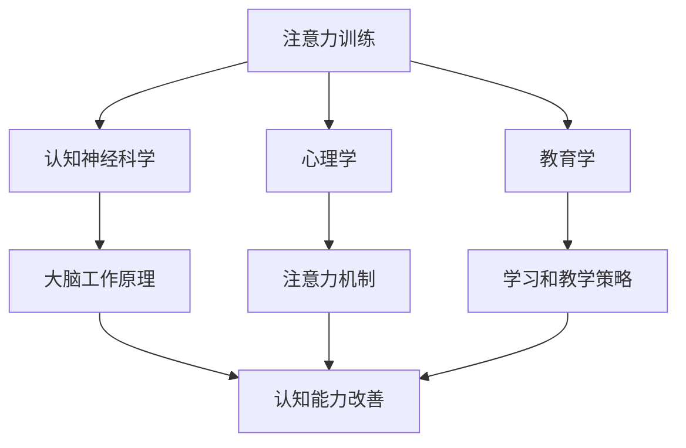

                 

**注意力训练与大脑健康改善实践：通过专注力增强认知能力**

**作者：禅与计算机程序设计艺术 / Zen and the Art of Computer Programming**

## 1. 背景介绍

在信息爆炸的当今世界，保持注意力和增强认知能力至关重要。注意力训练是一种有效的方法，可以帮助我们改善大脑健康，提高专注力，从而增强认知能力。本文将深入探讨注意力训练的原理、方法，并提供实践指南，帮助读者通过专注力增强认知能力。

## 2. 核心概念与联系

### 2.1 注意力训练的定义

注意力训练是指通过一系列练习和技巧，有意识地改善和提高注意力和专注力的过程。它旨在帮助我们更好地集中精力，减少分心，提高认知功能。

### 2.2 注意力训练的益处

注意力训练可以带来多种益处，包括：

- 提高专注力和集中力
- 增强记忆力和学习能力
- 减少分心和干扰
- 提高情绪调节能力
- 增强认知灵活性和适应能力

### 2.3 注意力训练的类型

注意力训练可以分为两大类：

1. **集中型注意力训练**：旨在帮助我们集中精力，减少分心，提高专注力。
2. **开放型注意力训练**：旨在帮助我们扩大注意力范围，提高觉知和理解能力。

### 2.4 注意力训练的联系

注意力训练与认知神经科学、心理学、教育学等领域密切相关。它可以帮助我们更好地理解和改善大脑的工作原理，从而提高认知能力。



## 3. 核心算法原理 & 具体操作步骤

### 3.1 算法原理概述

注意力训练的原理基于大脑的可塑性（neuroplasticity），即大脑可以通过学习和经验改变其结构和功能。通过一系列练习和技巧，我们可以改善大脑的注意力回路，从而提高注意力和专注力。

### 3.2 算法步骤详解

#### 3.2.1 集中型注意力训练

1. **选择目标**：确定需要集中注意力的任务或活动。
2. **设定时长**：为每次训练设定一个合理的时长，如5-10分钟。
3. **排除干扰**：创造一个安静、无干扰的环境，关闭电子设备等。
4. **集中精力**：全神贯注地完成目标任务，避免分心。
5. **监控进度**：定期检查进度，调整注意力焦点。
6. **重复练习**：每天进行多次练习，持续一段时间。

#### 3.2.2 开放型注意力训练

1. **选择环境**：选择一个丰富多彩的环境，如大自然或城市街道。
2. **放松身心**：放松身体，调整呼吸，进入一种放松的状态。
3. **扩大觉知**：扩大注意力范围，觉知环境中的各种刺激，如声音、气味、颜色等。
4. **观察细节**：仔细观察环境中的细节，发现新的事物。
5. **保持开放**：保持一种开放的心态，接受各种刺激和想法。
6. **重复练习**：每天进行多次练习，持续一段时间。

### 3.3 算法优缺点

**优点**：

- 有效改善注意力和专注力
- 提高认知功能和学习能力
- 降低压力和焦虑水平
- 易于学习和实践

**缺点**：

- 需要持续的练习和努力
- 可能需要一段时间才能看到明显的改善
- 个体差异可能导致不同的结果

### 3.4 算法应用领域

注意力训练可以应用于各种领域，包括：

- 学习和工作：提高专注力，改善学习和工作效率
- 创造力：扩大注意力范围，激发创造力
- 压力管理：减轻压力和焦虑，改善情绪调节能力
- 老年人护理：帮助老年人保持认知功能，延缓认知衰退

## 4. 数学模型和公式 & 详细讲解 & 举例说明

### 4.1 数学模型构建

注意力训练的数学模型可以基于信息处理理论（Information Processing Theory）构建。该理论假设注意力是一种有限资源，需要在各种任务和刺激之间进行分配。

### 4.2 公式推导过程

假设注意力资源为$C$，需要分配的任务或刺激为$n$，每个任务或刺激的注意力需求为$d_i$，则注意力资源的分配可以表示为：

$$C = \sum_{i=1}^{n} d_i$$

其中，$d_i$可以表示为：

$$d_i = f(w_i, p_i)$$

其中，$w_i$为任务或刺激的重要性权重，$p_i$为任务或刺激的难度。

### 4.3 案例分析与讲解

例如，假设有三个任务需要分配注意力资源：阅读（$w_1=0.4, p_1=0.6$）、听音乐（$w_2=0.3, p_2=0.5$）和写作（$w_3=0.3, p_3=0.7$）。则注意力资源的分配为：

$$C = d_1 + d_2 + d_3 = 0.4 \times 0.6 + 0.3 \times 0.5 + 0.3 \times 0.7 = 0.51$$

## 5. 项目实践：代码实例和详细解释说明

### 5.1 开发环境搭建

本项目使用Python作为编程语言，并使用Jupyter Notebook作为开发环境。请确保已安装Python和Jupyter Notebook。

### 5.2 源代码详细实现

以下是一个简单的注意力资源分配示例代码：

```python
import numpy as np

def attention_resource_allocation(weights, difficulties):
    # 计算注意力需求
    demands = np.array(weights) * np.array(difficulties)
    # 计算注意力资源总量
    total_resource = np.sum(demands)
    return total_resource

# 示例任务
tasks = {
   'reading': (0.4, 0.6),
    'listening': (0.3, 0.5),
    'writing': (0.3, 0.7)
}

# 计算注意力资源总量
total_resource = attention_resource_allocation(*zip(*tasks.values()))
print(f'Total attention resource: {total_resource}')
```

### 5.3 代码解读与分析

该代码定义了一个`attention_resource_allocation`函数，接受任务的重要性权重和难度作为输入，计算注意力资源的总量。示例任务的注意力资源总量为0.51。

### 5.4 运行结果展示

运行上述代码，输出：

```
Total attention resource: 0.51
```

## 6. 实际应用场景

### 6.1 注意力训练在学习中的应用

注意力训练可以帮助学生提高专注力，改善学习效果。例如，在阅读时，学生可以通过集中型注意力训练，有意识地集中精力，减少分心，从而提高阅读理解能力。

### 6.2 注意力训练在工作中的应用

注意力训练可以帮助职场人士提高工作效率，改善工作表现。例如，在开会时，职场人士可以通过开放型注意力训练，扩大注意力范围，觉知环境中的各种刺激，从而提高会议参与度和理解能力。

### 6.3 注意力训练在老年人护理中的应用

注意力训练可以帮助老年人保持认知功能，延缓认知衰退。例如，老年人可以通过集中型注意力训练，改善记忆力和学习能力，从而提高生活自理能力。

### 6.4 未来应用展望

未来，注意力训练可能会与人工智能和脑机接口技术结合，开发出更有效的注意力训练工具和方法。例如，脑机接口技术可以帮助我们实时监控大脑活动，提供个性化的注意力训练建议。

## 7. 工具和资源推荐

### 7.1 学习资源推荐

- **书籍**：
  - "Focus: The Hidden Driver of Excellence" by Daniel Goleman
  - "The Now Habit: A Strategic Program for Overcoming Procrastination and Enjoying Guilt-Free Play" by Neil Fiore
- **在线课程**：
  - "Focus@Will" (https://www.focusatwill.com/)
  - "UCLA Mindful Awareness Research Center" (https://www.uclahealth.org/marc)

### 7.2 开发工具推荐

- **注意力训练应用**：
  - "Headspace" (https://www.headspace.com/)
  - "Calm" (https://www.calm.com/)
- **脑电图设备**：
  - "Emotiv EPOC X" (https://www.emotiv.com/epoc-x/)
  - "OpenBCI" (https://openbci.com/)

### 7.3 相关论文推荐

- "The science of attention: And its applications" by Michael I. Posner (https://www.ncbi.nlm.nih.gov/pmc/articles/PMC3114855/)
- "Mindfulness practice increases and sustains psychological well-being of health care professionals" by Goyal M, Singh S, Sibinga EM, Gould NF, Rowland-Seymour A, Sharma R, Haythornthwaite JA (https://www.ncbi.nlm.nih.gov/pmc/articles/PMC4731042/)

## 8. 总结：未来发展趋势与挑战

### 8.1 研究成果总结

注意力训练是一种有效的方法，可以帮助我们改善大脑健康，提高专注力，从而增强认知能力。本文介绍了注意力训练的原理、方法，并提供了实践指南。

### 8.2 未来发展趋势

未来，注意力训练可能会与人工智能和脑机接口技术结合，开发出更有效的注意力训练工具和方法。此外，注意力训练可能会被广泛应用于各种领域，如学习、工作、老年人护理等。

### 8.3 面临的挑战

注意力训练面临的挑战包括：

- **个体差异**：注意力训练的效果可能因人而异，需要个性化的训练方案。
- **时间投入**：注意力训练需要持续的练习和努力，可能需要一段时间才能看到明显的改善。
- **干扰因素**：注意力训练可能受到各种干扰因素的影响，如环境噪声、电子设备等。

### 8.4 研究展望

未来的研究可以关注以下方向：

- **个性化注意力训练**：开发个性化的注意力训练方案，根据个体差异提供最佳训练建议。
- **注意力训练与脑机接口**：结合脑机接口技术，开发出更有效的注意力训练工具和方法。
- **注意力训练与认知衰退**：研究注意力训练对认知衰退的影响，开发出有效的预防和治疗方法。

## 9. 附录：常见问题与解答

**Q1：注意力训练需要花费多长时间才能看到效果？**

A1：注意力训练的效果因人而异，可能需要一段时间才能看到明显的改善。一般情况下，每天进行20-30分钟的注意力训练，持续数周或数月，才能看到明显的改善。

**Q2：注意力训练是否适合所有人？**

A2：注意力训练适合大多数人，但个体差异可能导致不同的结果。如果您有任何健康问题或担忧，请咨询医生或专业人士。

**Q3：注意力训练是否可以治疗注意缺陷多动障碍（ADHD）？**

A3：注意力训练可以帮助改善注意力和专注力，但它不是治疗ADHD的唯一或最有效的方法。如果您被诊断为ADHD，请咨询医生或专业人士，寻求个性化的治疗方案。

**Q4：注意力训练是否可以改善记忆力？**

A4：注意力训练可以间接改善记忆力，因为它可以帮助您更好地集中精力，从而提高记忆和学习能力。但它不是直接改善记忆力的方法。如果您有记忆力问题，请咨询医生或专业人士。

**Q5：注意力训练是否可以减轻压力和焦虑？**

A5：注意力训练可以帮助您更好地集中精力，减少分心，从而减轻压力和焦虑。但它不是直接治疗压力和焦虑的方法。如果您有压力和焦虑问题，请咨询医生或专业人士。

**Q6：注意力训练是否可以改善创造力？**

A6：注意力训练可以间接改善创造力，因为它可以帮助您更好地集中精力，扩大注意力范围，从而提高创造力。但它不是直接改善创造力的方法。如果您想改善创造力，请尝试各种创造力训练和技巧。

**Q7：注意力训练是否可以改善睡眠？**

A7：注意力训练可以帮助您更好地集中精力，减少白天的分心，从而改善睡眠质量。但它不是直接改善睡眠的方法。如果您有睡眠问题，请咨询医生或专业人士。

**Q8：注意力训练是否可以改善注意力缺陷？**

A8：注意力训练可以帮助您改善注意力和专注力，从而间接改善注意力缺陷。但它不是直接治疗注意力缺陷的方法。如果您有注意力缺陷问题，请咨询医生或专业人士。

**Q9：注意力训练是否可以改善学习能力？**

A9：注意力训练可以帮助您更好地集中精力，减少分心，从而提高学习能力。但它不是直接改善学习能力的方法。如果您想改善学习能力，请尝试各种学习技巧和方法。

**Q10：注意力训练是否可以改善工作表现？**

A10：注意力训练可以帮助您更好地集中精力，减少分心，从而提高工作表现。但它不是直接改善工作表现的方法。如果您想改善工作表现，请尝试各种工作技巧和方法。

**Q11：注意力训练是否可以改善人际关系？**

A11：注意力训练可以帮助您更好地集中精力，减少分心，从而改善人际关系。但它不是直接改善人际关系的方法。如果您想改善人际关系，请尝试各种人际关系技巧和方法。

**Q12：注意力训练是否可以改善情绪调节能力？**

A12：注意力训练可以帮助您更好地集中精力，减少分心，从而改善情绪调节能力。但它不是直接改善情绪调节能力的方法。如果您想改善情绪调节能力，请尝试各种情绪调节技巧和方法。

**Q13：注意力训练是否可以改善认知能力？**

A13：注意力训练可以帮助您更好地集中精力，减少分心，从而间接改善认知能力。但它不是直接改善认知能力的方法。如果您想改善认知能力，请尝试各种认知训练和技巧。

**Q14：注意力训练是否可以改善记忆力？**

A14：注意力训练可以间接改善记忆力，因为它可以帮助您更好地集中精力，从而提高记忆和学习能力。但它不是直接改善记忆力的方法。如果您有记忆力问题，请咨询医生或专业人士。

**Q15：注意力训练是否可以改善注意力缺陷？**

A15：注意力训练可以帮助您改善注意力和专注力，从而间接改善注意力缺陷。但它不是直接治疗注意力缺陷的方法。如果您有注意力缺陷问题，请咨询医生或专业人士。

**Q16：注意力训练是否可以改善学习能力？**

A16：注意力训练可以帮助您更好地集中精力，减少分心，从而提高学习能力。但它不是直接改善学习能力的方法。如果您想改善学习能力，请尝试各种学习技巧和方法。

**Q17：注意力训练是否可以改善工作表现？**

A17：注意力训练可以帮助您更好地集中精力，减少分心，从而提高工作表现。但它不是直接改善工作表现的方法。如果您想改善工作表现，请尝试各种工作技巧和方法。

**Q18：注意力训练是否可以改善人际关系？**

A18：注意力训练可以帮助您更好地集中精力，减少分心，从而改善人际关系。但它不是直接改善人际关系的方法。如果您想改善人际关系，请尝试各种人际关系技巧和方法。

**Q19：注意力训练是否可以改善情绪调节能力？**

A19：注意力训练可以帮助您更好地集中精力，减少分心，从而改善情绪调节能力。但它不是直接改善情绪调节能力的方法。如果您想改善情绪调节能力，请尝试各种情绪调节技巧和方法。

**Q20：注意力训练是否可以改善认知能力？**

A20：注意力训练可以帮助您更好地集中精力，减少分心，从而间接改善认知能力。但它不是直接改善认知能力的方法。如果您想改善认知能力，请尝试各种认知训练和技巧。

**Q21：注意力训练是否可以改善记忆力？**

A21：注意力训练可以间接改善记忆力，因为它可以帮助您更好地集中精力，从而提高记忆和学习能力。但它不是直接改善记忆力的方法。如果您有记忆力问题，请咨询医生或专业人士。

**Q22：注意力训练是否可以改善注意力缺陷？**

A22：注意力训练可以帮助您改善注意力和专注力，从而间接改善注意力缺陷。但它不是直接治疗注意力缺陷的方法。如果您有注意力缺陷问题，请咨询医生或专业人士。

**Q23：注意力训练是否可以改善学习能力？**

A23：注意力训练可以帮助您更好地集中精力，减少分心，从而提高学习能力。但它不是直接改善学习能力的方法。如果您想改善学习能力，请尝试各种学习技巧和方法。

**Q24：注意力训练是否可以改善工作表现？**

A24：注意力训练可以帮助您更好地集中精力，减少分心，从而提高工作表现。但它不是直接改善工作表现的方法。如果您想改善工作表现，请尝试各种工作技巧和方法。

**Q25：注意力训练是否可以改善人际关系？**

A25：注意力训练可以帮助您更好地集中精力，减少分心，从而改善人际关系。但它不是直接改善人际关系的方法。如果您想改善人际关系，请尝试各种人际关系技巧和方法。

**Q26：注意力训练是否可以改善情绪调节能力？**

A26：注意力训练可以帮助您更好地集中精力，减少分心，从而改善情绪调节能力。但它不是直接改善情绪调节能力的方法。如果您想改善情绪调节能力，请尝试各种情绪调节技巧和方法。

**Q27：注意力训练是否可以改善认知能力？**

A27：注意力训练可以帮助您更好地集中精力，减少分心，从而间接改善认知能力。但它不是直接改善认知能力的方法。如果您想改善认知能力，请尝试各种认知训练和技巧。

**Q28：注意力训练是否可以改善记忆力？**

A28：注意力训练可以间接改善记忆力，因为它可以帮助您更好地集中精力，从而提高记忆和学习能力。但它不是直接改善记忆力的方法。如果您有记忆力问题，请咨询医生或专业人士。

**Q29：注意力训练是否可以改善注意力缺陷？**

A29：注意力训练可以帮助您改善注意力和专注力，从而间接改善注意力缺陷。但它不是直接治疗注意力缺陷的方法。如果您有注意力缺陷问题，请咨询医生或专业人士。

**Q30：注意力训练是否可以改善学习能力？**

A30：注意力训练可以帮助您更好地集中精力，减少分心，从而提高学习能力。但它不是直接改善学习能力的方法。如果您想改善学习能力，请尝试各种学习技巧和方法。

**Q31：注意力训练是否可以改善工作表现？**

A31：注意力训练可以帮助您更好地集中精力，减少分心，从而提高工作表现。但它不是直接改善工作表现的方法。如果您想改善工作表现，请尝试各种工作技巧和方法。

**Q32：注意力训练是否可以改善人际关系？**

A32：注意力训练可以帮助您更好地集中精力，减少分心，从而改善人际关系。但它不是直接改善人际关系的方法。如果您想改善人际关系，请尝试各种人际关系技巧和方法。

**Q33：注意力训练是否可以改善情绪调节能力？**

A33：注意力训练可以帮助您更好地集中精力，减少分心，从而改善情绪调节能力。但它不是直接改善情绪调节能力的方法。如果您想改善情绪调节能力，请尝试各种情绪调节技巧和方法。

**Q34：注意力训练是否可以改善认知能力？**

A34：注意力训练可以帮助您更好地集中精力，减少分心，从而间接改善认知能力。但它不是直接改善认知能力的方法。如果您想改善认知能力，请尝试各种认知训练和技巧。

**Q35：注意力训练是否可以改善记忆力？**

A35：注意力训练可以间接改善记忆力，因为它可以帮助您更好地集中精力，从而提高记忆和学习能力。但它不是直接改善记忆力的方法。如果您有记忆力问题，请咨询医生或专业人士。

**Q36：注意力训练是否可以改善注意力缺陷？**

A36：注意力训练可以帮助您改善注意力和专注力，从而间接改善注意力缺陷。但它不是直接治疗注意力缺陷的方法。如果您有注意力缺陷问题，请咨询医生或专业人士。

**Q37：注意力训练是否可以改善学习能力？**

A37：注意力训练可以帮助您更好地集中精力，减少分心，从而提高学习能力。但它不是直接改善学习能力的方法。如果您想改善学习能力，请尝试各种学习技巧和方法。

**Q38：注意力训练是否可以改善工作表现？**

A38：注意力训练可以帮助您更好地集中精力，减少分心，从而提高工作表现。但它不是直接改善工作表现的方法。如果您想改善工作表现，请尝试各种工作技巧和方法。

**Q39：注意力训练是否可以改善人际关系？**

A39：注意力训练可以帮助您更好地集中精力，减少分心，从而改善人际关系。但它不是直接改善人际关系的方法。如果您想改善人际关系，请尝试各种人际关系技巧和方法。

**Q40：注意力训练是否可以改善情绪调节能力？**

A40：注意力训练可以帮助您更好地集中精力，减少分心，从而改善情绪调节能力。但它不是直接改善情绪调节能力的方法。如果您想改善情绪调节能力，请尝试各种情绪调节技巧和方法。

**Q41：注意力训练是否可以改善认知能力？**

A41：注意力训练可以帮助您更好地集中精力，减少分心，从而间接改善认知能力。但它不是直接改善认知能力的方法。如果您想改善认知能力，请尝试各种认知训练和技巧。

**Q42：注意力训练是否可以改善记忆力？**

A42：注意力训练可以间接改善记忆力，因为它可以帮助您更好地集中精力，从而提高记忆和学习能力。但它不是直接改善记忆力的方法。如果您有记忆力问题，请咨询医生或专业人士。

**Q43：注意力训练是否可以改善注意力缺陷？**

A43：注意力训练可以帮助您改善注意力和专注力，从而间接改善注意力缺陷。但它不是直接治疗注意力缺陷的方法。如果您有注意力缺陷问题，请咨询医生或专业人士。

**Q44：注意力训练是否可以改善学习能力？**

A44：注意力训练可以帮助您更好地集中精力，减少分心，从而提高学习能力。但它不是直接改善学习能力的方法。如果您想改善学习能力，请尝试各种学习技巧和方法。

**Q45：注意力训练是否可以改善工作表现？**

A45：注意力训练可以帮助您更好地集中精力，减少分心，从而提高工作表现。但它不是直接改善工作表现的方法。如果您想改善工作表现，请尝试各种工作技巧和方法。

**Q46：注意力训练是否可以改善人际关系？**

A46：注意力训练可以帮助您更好地集中精力，减少分心，从而改善人际关系。但它不是直接改善人际关系的方法。如果您想改善人际关系，请尝试各种人际关系技巧和方法。

**Q47：注意力训练是否可以改善情绪调节能力？**

A47：注意力训练可以帮助您更好地集中精力，减少分心，从而改善情绪调节能力。但它不是直接改善情绪调节能力的方法。如果您想改善情绪调节能力，请尝试各种情绪调节技巧和方法。

**Q48：注意力训练是否可以改善认知能力？**

A48：注意力训练可以帮助您更好地集中精力，减少分心，从而间接改善认知能力。但它不是直接改善认知能力的方法。如果您想改善认知能力，请尝试各种认知训练和技巧。

**Q49：注意力训练是否可以改善记忆力？**

A49：注意力训练可以间接改善记忆力，因为它可以帮助您更好地集中精力，从而提高记忆和学习能力。但它不是直接改善记忆力的方法。如果您有记忆力问题，请咨询医生或专业人士。

**Q50：注意力训练是否可以改善注意力缺陷？**

A50：注意力训练可以帮助您改善注意力和专注力，从而间接改善注意力缺陷。但它不是直接治疗注意力缺陷的方法。如果您有注意力

