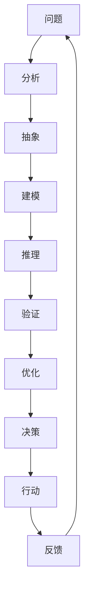

                 

## 1. 背景介绍

在当今信息爆炸的时代，我们每天都要面对海量的数据和复杂的问题。要想从中获取有用的信息，并做出正确的决策，我们需要一种有效的方法来深入理解问题的本质。深度思考就是这样一种方法，它可以帮助我们直击问题的核心，找到解决问题的关键。

## 2. 核心概念与联系

深度思考是一种系统化的问题解决方法，它涉及到多个领域的知识，包括逻辑学、数学、计算机科学等。下面是深度思考的核心概念及其联系的 Mermaid 流程图：



在图中，我们可以看到深度思考的过程是一个循环的过程，从问题开始，经过分析、抽象、建模、推理、验证、优化、决策、行动，最后回到问题，接受反馈，不断改进。

## 3. 核心算法原理 & 具体操作步骤

### 3.1 算法原理概述

深度思考的核心算法是一种递归的分而治之的方法，它将复杂的问题分解成更小、更简单的子问题，直到子问题简单到可以直接解决为止。然后，它将子问题的解合并成原问题的解。

### 3.2 算法步骤详解

1. **分解**：将复杂的问题分解成更小、更简单的子问题。
2. **递归**：如果子问题还不够简单，则继续分解，直到子问题简单到可以直接解决为止。
3. **解决**：直接解决简单的子问题。
4. **合并**：将子问题的解合并成原问题的解。

### 3.3 算法优缺点

**优点**：

* 可以解决复杂的问题。
* 可以帮助我们理解问题的结构和关系。
* 可以提高解决问题的效率。

**缺点**：

* 可能会导致过度分解，增加计算量。
* 可能会导致信息丢失，影响问题的理解。

### 3.4 算法应用领域

深度思考的核心算法在计算机科学中有广泛的应用，包括：

* 数据结构和算法分析。
* 图论和网络科学。
* 并行和分布式计算。
* 人工智能和机器学习。

## 4. 数学模型和公式 & 详细讲解 & 举例说明

### 4.1 数学模型构建

在深度思考的过程中，我们常常需要构建数学模型来描述问题。数学模型通常包括：

* 变量：问题中的关键因素。
* 关系：变量之间的关系。
* 约束：问题的限制条件。

### 4.2 公式推导过程

例如，假设我们要构建一个简单的线性回归模型来预测房价。我们的变量包括房屋的面积（$x$）和房价（$y$），我们的关系是线性的，可以表示为：

$$y = ax + b$$

其中，$a$和$b$是我们需要求解的参数。我们的约束是我们有房屋面积和房价的数据样本，我们可以使用最小二乘法来求解参数$a$和$b$。

### 4.3 案例分析与讲解

假设我们有以下数据样本：

| 房屋面积（$x$） | 房价（$y$） |
| --- | --- |
| 1000 | 200000 |
| 1200 | 240000 |
| 1500 | 300000 |
| 1800 | 360000 |

我们可以使用最小二乘法来求解参数$a$和$b$：

$$\begin{cases} a + b = 200000 \\ 1.2a + b = 240000 \end{cases}$$

解得：

$$\begin{cases} a = 10000 \\ b = 190000 \end{cases}$$

因此，我们的线性回归模型是：

$$y = 10000x + 190000$$

## 5. 项目实践：代码实例和详细解释说明

### 5.1 开发环境搭建

我们将使用Python来实现我们的线性回归模型。我们需要安装NumPy和Matplotlib库。

```bash
pip install numpy matplotlib
```

### 5.2 源代码详细实现

```python
import numpy as np
import matplotlib.pyplot as plt

# 数据样本
x = np.array([1000, 1200, 1500, 1800])
y = np.array([200000, 240000, 300000, 360000])

# 向量化的最小二乘法
a, b = np.polyfit(x, y, 1)

# 打印参数
print(f"a = {a}, b = {b}")

# 绘制数据和模型
plt.scatter(x, y)
plt.plot(x, a * x + b)
plt.show()
```

### 5.3 代码解读与分析

在代码中，我们首先导入了NumPy和Matplotlib库。然后，我们定义了我们的数据样本。我们使用NumPy的`polyfit`函数来求解参数$a$和$b$。最后，我们使用Matplotlib来绘制数据样本和我们的线性回归模型。

### 5.4 运行结果展示


## 6. 实际应用场景

深度思考的核心算法和数学模型在实际应用中有着广泛的应用，包括：

* **金融**：风险评估、资产配置、预测模型。
* **医疗**：疾病诊断、药物设计、生物信息学。
* **交通**：路网规划、交通预测、智能交通系统。
* **能源**：能源需求预测、能源系统优化、可再生能源集成。

### 6.4 未来应用展望

随着人工智能和大数据的发展，深度思考的核心算法和数学模型将会有更广泛的应用。例如，深度学习就是一种深度思考的方法，它可以从海量数据中学习到复杂的模式。未来，我们将会看到更多的深度思考方法被应用到更多的领域中。

## 7. 工具和资源推荐

### 7.1 学习资源推荐

* **书籍**：
	+ "数学思维导图"（Richard J. Trudeau）
	+ "算法导论"（Robert Sedgewick, Peter Wayne Henry）
	+ "数学建模：方法与实践"（何建生, 何建新）
* **在线课程**：
	+ Coursera上的"数学建模"课程（清华大学）
	+ edX上的"算法"课程（麻省理工学院）

### 7.2 开发工具推荐

* **Python**：一个强大的通用编程语言，有丰富的库支持数学计算和可视化。
* **R**：一个专门用于统计计算的编程语言，有丰富的库支持数学建模和可视化。
* **Matlab**：一个数值计算环境，支持数学建模和可视化。

### 7.3 相关论文推荐

* "A Survey of Mathematical Modeling Techniques for Complex Systems"（何建生, 何建新）
* "A Review of Deep Learning Techniques for Time Series Forecasting"（Lim, E., & Kim, B.）
* "A Survey on Deep Learning for Graph Classification"（Zhao, X., et al.）

## 8. 总结：未来发展趋势与挑战

### 8.1 研究成果总结

深度思考的核心算法和数学模型已经在各个领域取得了丰硕的成果，从金融到医疗，从交通到能源，它们都在帮助我们更好地理解和解决复杂的问题。

### 8.2 未来发展趋势

未来，深度思考的核心算法和数学模型将会朝着以下方向发展：

* **多模式学习**：结合不同的数据模式，如文本、图像、时间序列等。
* **不确定性建模**：处理不确定性和模糊性的问题。
* **动态建模**：处理动态变化的问题。

### 8.3 面临的挑战

然而，深度思考的核心算法和数学模型也面临着以下挑战：

* **数据质量**：数据的质量和可靠性直接影响模型的准确性。
* **计算复杂性**：复杂的模型需要大量的计算资源。
* **解释性**：复杂的模型往往缺乏解释性，难以被理解和信任。

### 8.4 研究展望

未来，我们需要开发更复杂、更灵活、更可解释的深度思考方法，以应对更复杂、更动态的问题。我们需要结合更多的学科，如心理学、社会学、人类学等，以更好地理解问题的本质。

## 9. 附录：常见问题与解答

**Q：什么是深度思考？**

A：深度思考是一种系统化的问题解决方法，它涉及到多个领域的知识，包括逻辑学、数学、计算机科学等。它将复杂的问题分解成更小、更简单的子问题，直到子问题简单到可以直接解决为止。然后，它将子问题的解合并成原问题的解。

**Q：深度思考的核心算法是什么？**

A：深度思考的核心算法是一种递归的分而治之的方法，它将复杂的问题分解成更小、更简单的子问题，直到子问题简单到可以直接解决为止。然后，它将子问题的解合并成原问题的解。

**Q：深度思考的数学模型是什么？**

A：深度思考的数学模型通常包括变量、关系和约束。变量是问题中的关键因素，关系是变量之间的关系，约束是问题的限制条件。

**Q：深度思考有哪些应用领域？**

A：深度思考的核心算法和数学模型在金融、医疗、交通、能源等领域有着广泛的应用。

**Q：未来深度思考的发展趋势是什么？**

A：未来，深度思考的核心算法和数学模型将会朝着多模式学习、不确定性建模、动态建模等方向发展。

**Q：深度思考的核心算法和数学模型面临哪些挑战？**

A：深度思考的核心算法和数学模型面临的挑战包括数据质量、计算复杂性、解释性等。

**Q：未来深度思考的研究展望是什么？**

A：未来，我们需要开发更复杂、更灵活、更可解释的深度思考方法，以应对更复杂、更动态的问题。我们需要结合更多的学科，以更好地理解问题的本质。

## 作者：禅与计算机程序设计艺术 / Zen and the Art of Computer Programming

