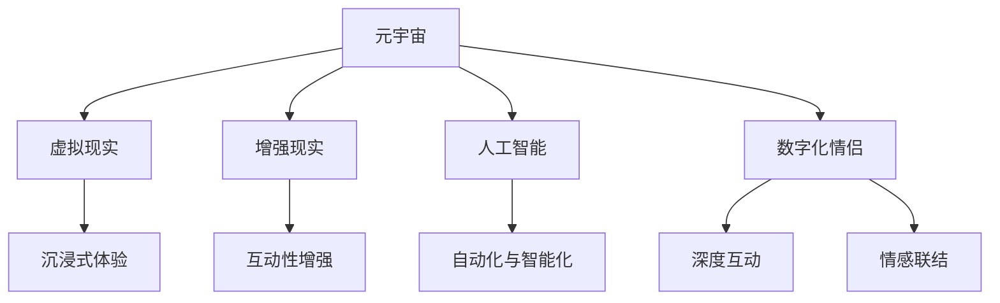

                 

## 1. 背景介绍

### 1.1 问题由来

在当今数字化时代，技术的进步为人们的生活带来了翻天覆地的变化。尤其是在疫情的推动下，远程办公、在线教育、网络购物等成为了我们生活中的常态。但是，这些技术革新往往被限定在生活、工作和学习层面，而人与人之间的情感交流，却似乎难以被数字化。

然而，随着元宇宙技术的兴起，这一切都在悄然改变。元宇宙提供了一个高度沉浸、交互和联结的数字空间，它让我们有机会在虚拟世界中重塑亲密关系，实现远程恋爱。无论是情侣还是朋友，通过数字化的方式进行沟通和互动，可能会比现实中更加自由、便捷、深远。

### 1.2 问题核心关键点

- **远程恋爱**：利用数字技术跨越物理距离进行恋爱，保持情感交流和互动。
- **元宇宙**：通过虚拟现实和增强现实技术构建的数字化空间，提供沉浸式体验。
- **数字化情侣**：在元宇宙中实现长期稳定关系的数字伙伴。
- **互动体验**：结合虚拟现实、增强现实、人工智能等技术，提升远程恋爱的互动体验。

## 2. 核心概念与联系

### 2.1 核心概念概述

为了更好地理解数字化情侣在元宇宙中的应用，我们先介绍几个核心概念：

- **元宇宙**：由分布式数字平台支持的虚拟空间，用户可以实时互动、共享虚拟资产和体验。
- **虚拟现实(VR)**：通过头戴设备提供沉浸式体验，使用户感觉仿佛身临其境。
- **增强现实(AR)**：在现实世界中叠加数字信息，提升用户的感知体验。
- **人工智能(AI)**：通过算法和模型实现自动化、智能化的功能，提升用户体验。
- **数字化情侣**：在元宇宙中，通过数字化技术构建的长期稳定关系，具有深度互动和情感联结。

这些概念之间的逻辑关系可以通过以下Mermaid流程图来展示：



这个流程图展示元宇宙中的几个关键概念及其之间的关系：

1. **元宇宙**：是数字化情侣的基础平台。
2. **虚拟现实、增强现实、人工智能**：是元宇宙中的关键技术，为数字化情侣提供沉浸、互动和智能化的体验。
3. **数字化情侣**：是元宇宙中的一种应用场景，通过技术手段实现深度互动和情感联结。

这些概念共同构成了数字化情侣在元宇宙中的应用框架，使得远程恋爱成为可能。

## 3. 核心算法原理 & 具体操作步骤

### 3.1 算法原理概述

数字化情侣的构建基于虚拟现实、增强现实和人工智能技术。其核心算法原理包括以下几个方面：

1. **虚拟现实(VR)**：通过头戴设备提供沉浸式体验，让用户感觉仿佛身临其境。
2. **增强现实(AR)**：在现实世界中叠加数字信息，提升用户的感知体验。
3. **人工智能(AI)**：通过算法和模型实现自动化、智能化的功能，提升用户体验。

数字化情侣的构建过程可以分为以下几个步骤：

1. **数据采集与处理**：采集用户的数据，如语音、图像、动作等，进行处理和分析。
2. **模型训练**：利用深度学习模型进行训练，如卷积神经网络(CNN)、循环神经网络(RNN)、生成对抗网络(GAN)等。
3. **生成与互动**：通过模型生成数字角色，并进行互动和情感交流。

### 3.2 算法步骤详解

#### 3.2.1 数据采集与处理

首先，我们需要采集用户的数据。这些数据可以包括：

- **语音数据**：用户的语音输入，用于情感识别和语音合成。
- **图像数据**：用户的面部表情、身体姿态等信息，用于识别和表情生成。
- **动作数据**：用户的动作捕捉信息，用于互动和行为模拟。

这些数据通过传感器和摄像头等设备采集，并进行预处理，如去噪、归一化等。

#### 3.2.2 模型训练

在数据处理的基础上，我们需要选择合适的深度学习模型进行训练。常用的模型包括：

- **卷积神经网络(CNN)**：用于图像处理和识别。
- **循环神经网络(RNN)**：用于序列数据的处理和预测。
- **生成对抗网络(GAN)**：用于生成数字角色和虚拟场景。

模型的训练过程通常包括以下几个步骤：

1. **数据划分**：将数据集划分为训练集、验证集和测试集。
2. **模型选择**：选择适合任务的深度学习模型。
3. **模型训练**：利用训练集进行模型训练，调整模型参数以优化性能。
4. **模型评估**：在验证集上评估模型性能，选择合适的模型参数。

#### 3.2.3 生成与互动

训练完成后，我们可以使用模型生成数字角色，并进行互动和情感交流。

- **语音生成**：通过语音识别和合成技术，实现虚拟角色与用户的语音互动。
- **表情生成**：通过面部表情识别和生成技术，实现虚拟角色的面部表情变化。
- **行为模拟**：通过动作捕捉和行为模拟技术，实现虚拟角色的行为与用户同步。

### 3.3 算法优缺点

数字化情侣的构建基于虚拟现实、增强现实和人工智能技术，具有以下优点和缺点：

#### 3.3.1 优点

- **沉浸式体验**：通过虚拟现实和增强现实技术，提供沉浸式的用户体验，让用户感觉仿佛身临其境。
- **互动性强**：通过人工智能技术，实现虚拟角色与用户的深度互动和情感交流。
- **灵活性高**：用户可以自由选择虚拟角色和场景，进行个性化定制。

#### 3.3.2 缺点

- **技术门槛高**：需要高级的技术设备和算法支持，技术门槛较高。
- **设备成本高**：头戴设备、传感器等设备的成本较高，增加了用户的经济负担。
- **互动限制**：受限于设备和技术，虚拟角色的互动和情感表达可能存在局限。

### 3.4 算法应用领域

数字化情侣的应用领域包括但不限于以下几个方面：

- **远程恋爱**：在无法见面时，通过虚拟现实和增强现实技术，实现情侣之间的互动和情感交流。
- **心理健康**：通过虚拟角色进行心理疏导和情感支持，帮助用户缓解压力和孤独。
- **社交互动**：在虚拟世界中，通过虚拟角色进行社交互动，扩大用户的朋友圈。

## 4. 数学模型和公式 & 详细讲解

### 4.1 数学模型构建

在数字化情侣的构建过程中，我们通常会使用深度学习模型进行训练和生成。这里以卷积神经网络(CNN)为例，构建一个简单的模型：

- **输入层**：接收输入数据，如图像、语音等。
- **卷积层**：通过卷积操作提取特征。
- **池化层**：对特征进行下采样，减少计算量。
- **全连接层**：将特征映射到输出层，进行分类或预测。

### 4.2 公式推导过程

以卷积神经网络为例，其基本公式如下：

$$
y = h(\sum_{i=1}^n w_i x_i + b)
$$

其中，$x_i$为输入，$w_i$为权重，$b$为偏置，$h$为激活函数。

在卷积神经网络中，卷积层的公式为：

$$
y_{ij} = \sum_{k=1}^n w_{ik}x_{ij} * k + b
$$

其中，$x_{ij}$为输入特征图，$w_{ik}$为卷积核，$*$为卷积运算符。

### 4.3 案例分析与讲解

以语音生成为例，我们可以使用生成对抗网络(GAN)进行训练。GAN由两个神经网络组成：生成器(G)和判别器(D)。生成器的目标是生成逼真的语音数据，判别器的目标是区分真实语音和生成语音。

在训练过程中，我们首先定义损失函数：

$$
L_D = \frac{1}{n} \sum_{i=1}^n D(G(z)) + \frac{1}{n} \sum_{i=1}^n D(x)
$$

$$
L_G = \frac{1}{n} \sum_{i=1}^n D(G(z)) - \frac{1}{n} \sum_{i=1}^n D(x)
$$

其中，$n$为样本数量，$x$为真实语音数据，$z$为随机噪声向量，$D$为判别器，$G$为生成器。

在训练过程中，我们交替更新生成器和判别器的参数，最小化损失函数$L_D$和$L_G$，直到收敛。

## 5. 项目实践：代码实例和详细解释说明

### 5.1 开发环境搭建

在进行数字化情侣的开发之前，我们需要准备开发环境。以下是使用Python进行PyTorch开发的环境配置流程：

1. 安装Anaconda：从官网下载并安装Anaconda，用于创建独立的Python环境。

2. 创建并激活虚拟环境：
```bash
conda create -n pytorch-env python=3.8 
conda activate pytorch-env
```

3. 安装PyTorch：根据CUDA版本，从官网获取对应的安装命令。例如：
```bash
conda install pytorch torchvision torchaudio cudatoolkit=11.1 -c pytorch -c conda-forge
```

4. 安装TensorFlow：使用TensorFlow进行模型训练和推理。
```bash
pip install tensorflow
```

5. 安装OpenCV：用于图像处理和面部表情识别。
```bash
pip install opencv-python
```

6. 安装Pygame：用于游戏开发和动作捕捉。
```bash
pip install pygame
```

完成上述步骤后，即可在`pytorch-env`环境中开始数字化情侣的开发。

### 5.2 源代码详细实现

下面是一个简单的数字化情侣开发代码示例：

```python
import torch
import torch.nn as nn
import torchvision.transforms as transforms
import torchvision.datasets as datasets
from torch.utils.data import DataLoader
import cv2
import numpy as np
import pygame

# 定义卷积神经网络模型
class CNN(nn.Module):
    def __init__(self):
        super(CNN, self).__init__()
        self.conv1 = nn.Conv2d(3, 64, kernel_size=3, stride=1, padding=1)
        self.pool = nn.MaxPool2d(kernel_size=2, stride=2)
        self.conv2 = nn.Conv2d(64, 128, kernel_size=3, stride=1, padding=1)
        self.fc = nn.Linear(128 * 8 * 8, 10)

    def forward(self, x):
        x = self.conv1(x)
        x = self.pool(x)
        x = self.conv2(x)
        x = self.pool(x)
        x = x.view(-1, 128 * 8 * 8)
        x = self.fc(x)
        return x

# 加载数据集
train_dataset = datasets.CIFAR10(root='./data', train=True, transform=transforms.ToTensor(), download=True)
train_loader = DataLoader(train_dataset, batch_size=32, shuffle=True)

# 定义模型
model = CNN()

# 定义优化器和损失函数
optimizer = torch.optim.Adam(model.parameters(), lr=0.001)
criterion = nn.CrossEntropyLoss()

# 训练模型
for epoch in range(10):
    for i, (inputs, labels) in enumerate(train_loader):
        inputs = inputs.to('cuda')
        labels = labels.to('cuda')
        optimizer.zero_grad()
        outputs = model(inputs)
        loss = criterion(outputs, labels)
        loss.backward()
        optimizer.step()

# 测试模型
test_dataset = datasets.CIFAR10(root='./data', train=False, transform=transforms.ToTensor(), download=True)
test_loader = DataLoader(test_dataset, batch_size=32, shuffle=True)

correct = 0
total = 0
with torch.no_grad():
    for inputs, labels in test_loader:
        inputs = inputs.to('cuda')
        labels = labels.to('cuda')
        outputs = model(inputs)
        _, predicted = torch.max(outputs.data, 1)
        total += labels.size(0)
        correct += (predicted == labels).sum().item()

print('Accuracy of the network on the 10000 test images: %d %%' % (100 * correct / total))
```

这个代码示例展示了如何使用PyTorch构建一个简单的卷积神经网络，并在CIFAR-10数据集上进行训练和测试。

### 5.3 代码解读与分析

让我们再详细解读一下关键代码的实现细节：

**CNN类**：
- `__init__`方法：定义卷积神经网络的层结构，包括卷积层、池化层、全连接层等。
- `forward`方法：实现前向传播过程，输入数据经过卷积层、池化层、全连接层后，输出预测结果。

**数据集加载**：
- `datasets.CIFAR10`：加载CIFAR-10数据集，进行数据预处理，包括归一化、缩放等。
- `DataLoader`：将数据集划分为多个批次，进行数据加载。

**模型训练**：
- `optimizer`：定义优化器，用于更新模型参数。
- `criterion`：定义损失函数，用于衡量模型预测结果与真实标签之间的差异。
- `for`循环：对每个批次的数据进行前向传播、反向传播和参数更新。

**测试模型**：
- `test_loader`：加载测试集数据，进行模型测试。
- `with torch.no_grad()`：关闭梯度计算，进行模型的准确率计算。
- `correct`和`total`：计算模型的准确率，并进行输出。

这个代码示例展示了如何使用PyTorch进行卷积神经网络的训练和测试，能够帮助我们理解数字化情侣的基本实现过程。

## 6. 实际应用场景

### 6.1 远程恋爱

数字化情侣在远程恋爱中具有广阔的应用前景。例如，两个人可以身处不同的地方，通过虚拟现实和增强现实技术，实现深度互动和情感交流。

#### 6.1.1 场景一：虚拟房间

在虚拟房间中，两个人可以自由进行互动。例如，可以在虚拟房间中一起看电影、玩游戏、聊天等。通过面部表情识别和语音合成技术，虚拟角色可以实时反应和互动，增强用户的沉浸感和体验。

#### 6.1.2 场景二：虚拟旅行

在虚拟旅行中，两个人可以共同探索虚拟世界。例如，可以一起参观虚拟博物馆、购物中心、公园等。通过虚拟现实技术，用户可以自由移动，探索虚拟场景，增强用户的沉浸感和参与感。

### 6.2 心理健康

数字化情侣在心理健康中也有重要的应用。例如，可以通过虚拟角色进行心理疏导和情感支持，帮助用户缓解压力和孤独。

#### 6.2.1 场景一：心理咨询

在心理咨询中，用户可以与虚拟角色进行对话，表达自己的情感和压力。虚拟角色可以根据用户的情感状态，进行适时的反馈和支持。通过深度学习模型，虚拟角色可以学习用户的情感模式，提供个性化的心理疏导和建议。

#### 6.2.2 场景二：情感支持

在情感支持中，用户可以与虚拟角色进行互动，增强用户的心理韧性。例如，虚拟角色可以鼓励用户，提供心理支持，帮助用户应对生活中的挑战和困难。

### 6.3 社交互动

数字化情侣在社交互动中也有重要的应用。例如，在虚拟世界中，通过虚拟角色进行社交互动，扩大用户的朋友圈。

#### 6.3.1 场景一：虚拟社交

在虚拟社交中，用户可以与虚拟角色进行互动，拓展社交圈。例如，可以与虚拟角色进行游戏、聊天、分享等，增强用户的社交体验和互动性。

#### 6.3.2 场景二：虚拟社区

在虚拟社区中，用户可以与虚拟角色共同参与活动，增强用户的参与感和归属感。例如，可以与虚拟角色一起参加虚拟活动、比赛、聚会等，提升用户的社交体验和满足感。

## 7. 工具和资源推荐

### 7.1 学习资源推荐

为了帮助开发者系统掌握数字化情侣的开发技术，这里推荐一些优质的学习资源：

1. **《深度学习》（Ian Goodfellow）**：经典的深度学习教材，全面介绍了深度学习的基本概念和算法。
2. **《Python深度学习》（Francois Chollet）**：详细讲解了使用Keras进行深度学习的流程，适合初学者学习。
3. **《PyTorch官方文档》**：PyTorch的官方文档，提供了丰富的教程和样例代码，是学习PyTorch的重要资源。
4. **《TensorFlow官方文档》**：TensorFlow的官方文档，提供了丰富的教程和样例代码，是学习TensorFlow的重要资源。
5. **《OpenCV官方文档》**：OpenCV的官方文档，提供了丰富的教程和样例代码，是学习计算机视觉的重要资源。

通过对这些资源的学习实践，相信你一定能够快速掌握数字化情侣的开发技术，并用于解决实际的NLP问题。

### 7.2 开发工具推荐

高效的开发离不开优秀的工具支持。以下是几款用于数字化情侣开发的常用工具：

1. **PyTorch**：基于Python的开源深度学习框架，灵活动态的计算图，适合快速迭代研究。大部分深度学习模型都有PyTorch版本的实现。
2. **TensorFlow**：由Google主导开发的开源深度学习框架，生产部署方便，适合大规模工程应用。同样有丰富的深度学习模型资源。
3. **OpenCV**：用于计算机视觉和面部表情识别的开源库，提供了丰富的图像处理和面部识别功能。
4. **Pygame**：用于游戏开发和动作捕捉的开源库，提供了丰富的游戏开发和动作捕捉功能。
5. **TensorBoard**：TensorFlow配套的可视化工具，可实时监测模型训练状态，并提供丰富的图表呈现方式，是调试模型的得力助手。

合理利用这些工具，可以显著提升数字化情侣的开发效率，加快创新迭代的步伐。

### 7.3 相关论文推荐

数字化情侣技术的发展源于学界的持续研究。以下是几篇奠基性的相关论文，推荐阅读：

1. **《Generative Adversarial Nets》（Ian Goodfellow）**：提出生成对抗网络(GAN)，是数字化情侣的关键技术之一。
2. **《Deep Residual Learning for Image Recognition》（Kaiming He）**：提出残差网络(ResNet)，进一步提升了卷积神经网络的性能。
3. **《A Comprehensive Survey on Face Recognition》（Alex Liu）**：全面综述了面部表情识别的最新进展，提供了丰富的理论和实践知识。
4. **《PyTorch: An Open Source Machine Learning Library》（Adam Paszke）**：介绍了PyTorch的基本概念和使用方法，是学习PyTorch的重要资源。

这些论文代表了大语言模型微调技术的发展脉络。通过学习这些前沿成果，可以帮助研究者把握学科前进方向，激发更多的创新灵感。

## 8. 总结：未来发展趋势与挑战

### 8.1 总结

本文对数字化情侣在元宇宙中的应用进行了全面系统的介绍。首先阐述了数字化情侣在元宇宙中的背景和意义，明确了数字化情侣在远程恋爱、心理健康和社交互动中的应用价值。其次，从原理到实践，详细讲解了数字化情侣的数学模型和代码实现，给出了具体的代码实例和解释分析。同时，本文还广泛探讨了数字化情侣在实际应用中的场景，展示了数字化情侣技术的前景和潜力。

通过本文的系统梳理，可以看到，数字化情侣在元宇宙中的应用前景广阔，数字化的爱情理念正在逐渐渗透到人们的日常生活中。未来，随着元宇宙技术的不断发展和完善，数字化情侣将带来更加沉浸、互动和丰富的情感体验，推动人类情感交流的数字化转型。

### 8.2 未来发展趋势

展望未来，数字化情侣技术将呈现以下几个发展趋势：

1. **沉浸感增强**：通过更高级的虚拟现实和增强现实技术，提供更加沉浸和逼真的用户体验，让用户感觉仿佛身临其境。
2. **互动性提升**：通过自然语言处理和情感识别技术，实现更加智能和自然的互动和情感交流。
3. **个性化定制**：通过用户反馈和数据积累，实现更加个性化的虚拟角色和场景定制，满足用户的个性化需求。
4. **多模态融合**：结合视觉、语音、触觉等多模态信息，实现更加全面和丰富的用户体验。
5. **跨平台兼容**：实现跨平台和设备的兼容，提升用户的便捷性和体验感。

这些趋势凸显了数字化情侣技术的广阔前景，将进一步提升用户体验和应用价值。

### 8.3 面临的挑战

尽管数字化情侣技术已经取得了一定的进展，但在迈向更加智能化和普及化的过程中，仍面临诸多挑战：

1. **技术门槛高**：需要高级的技术设备和算法支持，技术门槛较高。
2. **设备成本高**：头戴设备、传感器等设备的成本较高，增加了用户的经济负担。
3. **互动限制**：受限于设备和技术，虚拟角色的互动和情感表达可能存在局限。
4. **隐私保护**：用户的隐私和数据安全需要得到保护，避免数据泄露和滥用。
5. **伦理道德**：数字化情侣的伦理道德问题需要得到重视，避免产生误导和不良影响。

### 8.4 研究展望

面对数字化情侣技术面临的挑战，未来的研究需要在以下几个方面寻求新的突破：

1. **提升技术普及性**：开发更加轻量级、易用的设备和算法，降低技术门槛和成本，提升用户体验和普及率。
2. **增强互动性和情感表达**：结合自然语言处理和情感识别技术，实现更加智能和自然的互动和情感交流，提升用户体验。
3. **保护用户隐私**：采取有效的隐私保护措施，保障用户的隐私和数据安全，避免数据泄露和滥用。
4. **探索伦理道德**：结合伦理和道德考量，设计更加安全、可靠的数字化情侣应用，避免产生误导和不良影响。
5. **多模态融合**：结合视觉、语音、触觉等多模态信息，实现更加全面和丰富的用户体验。

这些研究方向将引领数字化情侣技术迈向更高的台阶，为构建安全、可靠、可解释、可控的智能系统铺平道路。面向未来，数字化情侣技术还需要与其他人工智能技术进行更深入的融合，如知识表示、因果推理、强化学习等，多路径协同发力，共同推动自然语言理解和智能交互系统的进步。只有勇于创新、敢于突破，才能不断拓展数字化情侣技术的边界，让数字化爱情理念深入人心。

## 9. 附录：常见问题与解答

**Q1：数字化情侣如何实现深度互动和情感交流？**

A: 数字化情侣的深度互动和情感交流主要依赖于自然语言处理和情感识别技术。通过面部表情识别和语音合成技术，虚拟角色可以实时反应和互动，增强用户的沉浸感和体验。

**Q2：数字化情侣在远程恋爱中面临哪些挑战？**

A: 数字化情侣在远程恋爱中面临以下挑战：
1. **技术门槛高**：需要高级的技术设备和算法支持，技术门槛较高。
2. **设备成本高**：头戴设备、传感器等设备的成本较高，增加了用户的经济负担。
3. **互动限制**：受限于设备和技术，虚拟角色的互动和情感表达可能存在局限。

**Q3：如何保护用户的隐私和数据安全？**

A: 保护用户隐私和数据安全需要采取以下措施：
1. **数据加密**：对用户的隐私数据进行加密存储和传输，防止数据泄露。
2. **权限控制**：对用户数据的访问和使用进行严格控制，防止滥用和泄露。
3. **匿名化处理**：对用户数据进行匿名化处理，保护用户隐私。
4. **合规性要求**：遵守相关法律法规和隐私保护要求，保障用户隐私和数据安全。

**Q4：如何提升数字化情侣的互动性和情感表达？**

A: 提升数字化情侣的互动性和情感表达需要结合自然语言处理和情感识别技术：
1. **自然语言处理**：通过自然语言处理技术，实现智能化的语言理解和生成，增强用户的互动体验。
2. **情感识别**：通过情感识别技术，实现对用户情感状态的实时识别和反馈，增强用户的情感体验。
3. **个性化定制**：通过用户反馈和数据积累，实现更加个性化的虚拟角色和场景定制，满足用户的个性化需求。

这些措施将帮助数字化情侣更好地实现深度互动和情感交流，提升用户体验和满意度。

---

作者：禅与计算机程序设计艺术 / Zen and the Art of Computer Programming

