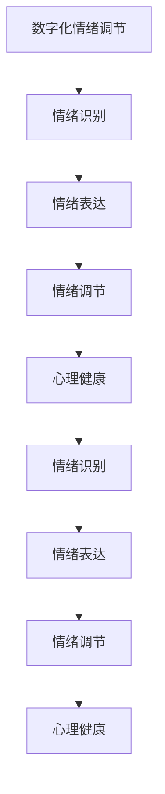

                 

# 数字化情绪调节技术:元宇宙中的情感管理工具

> 关键词：数字化情绪调节,元宇宙,情感管理,心理健康,智能算法,技术应用,用户参与

## 1. 背景介绍

### 1.1 问题由来
随着互联网和虚拟现实技术的飞速发展，元宇宙（Metaverse）的概念被广泛讨论并逐渐成为可能。元宇宙是一个虚拟的、持续存在的互联网共享空间，用户可以在其中进行社交、娱乐、工作等活动，体验深度沉浸式的虚拟生活。然而，元宇宙并不是一个无摩擦的环境，用户在其中仍会受到各种情绪困扰和心理压力。数字化情绪调节技术，作为元宇宙中情感管理的重要工具，将帮助用户提升心理福祉，促进社交互动，打造健康积极的虚拟体验。

### 1.2 问题核心关键点
元宇宙中的情绪管理涉及多个领域，包括情绪识别、情绪表达、情绪调节等。数字化情绪调节技术旨在通过智能算法和机器学习技术，捕捉和分析用户的情绪状态，提供个性化的情绪调节建议和工具，提升用户心理福祉和体验满意度。

## 2. 核心概念与联系

### 2.1 核心概念概述

为更好地理解数字化情绪调节技术在元宇宙中的应用，本节将介绍几个关键概念：

- **数字化情绪调节**：利用智能算法和机器学习技术，实时捕捉和分析用户的情绪状态，提供个性化情绪调节建议和工具。
- **元宇宙**：一个虚拟的、持续存在的互联网共享空间，用户在其中可以进行社交、娱乐、工作等活动。
- **情绪识别**：通过分析用户的面部表情、语音、文字等，识别其情绪状态。
- **情绪表达**：用户通过面部表情、语音、动作等方式表达自己的情绪。
- **情绪调节**：通过智能算法和工具，帮助用户调节情绪，提升心理福祉。
- **心理健康**：关注个体心理状态和行为，预防和治疗心理疾病。

这些概念之间的逻辑关系可以通过以下Mermaid流程图来展示：



这个流程图展示了大语言模型的核心概念及其之间的关系：

1. 数字化情绪调节技术通过对用户情绪的识别和调节，提升用户的心理健康。
2. 情绪识别技术通过分析用户的多模态数据（面部表情、语音、文字等），捕捉用户的情绪状态。
3. 情绪表达技术使用户能够通过多种方式表达自己的情绪，与他人进行情感交流。
4. 情绪调节技术基于用户的情绪状态，提供个性化的调节建议和工具，帮助用户恢复平衡。
5. 心理健康是情绪管理的目标，通过持续的情绪调节，促进用户心理健康。

## 3. 核心算法原理 & 具体操作步骤
### 3.1 算法原理概述

数字化情绪调节技术的核心原理是利用人工智能算法和机器学习技术，对用户的多模态数据进行情绪识别，并基于识别结果提供个性化的情绪调节建议和工具。

具体而言，该技术包括以下几个关键步骤：

1. **数据收集**：通过摄像头、麦克风等设备，收集用户的面部表情、语音、文字等数据。
2. **情绪识别**：利用深度学习模型（如卷积神经网络、循环神经网络等），对多模态数据进行情绪状态分类，得到用户的情绪标签。
3. **情绪调节**：根据情绪标签，通过智能算法生成个性化的情绪调节建议和工具。
4. **反馈与调整**：用户使用情绪调节工具后，对其效果进行反馈，系统根据反馈结果调整情绪调节策略。

### 3.2 算法步骤详解

**Step 1: 数据收集与预处理**

1. **面部表情数据**：使用摄像头采集用户的面部表情，转换成像素值数据。
2. **语音数据**：通过麦克风采集用户的语音信号，转换成波形数据。
3. **文字数据**：通过文本输入设备（如键盘、语音识别等）获取用户输入的文字。

**Step 2: 多模态数据融合**

1. **特征提取**：使用卷积神经网络（CNN）提取面部表情图像的特征。
2. **语音情感分析**：使用循环神经网络（RNN）或Transformer模型对语音信号进行情感分析。
3. **文本情感分析**：使用情感分析模型对用户输入的文字进行情感分类。

**Step 3: 情绪状态分类**

1. **深度学习模型**：使用预训练的深度学习模型（如ResNet、LSTM、BERT等）对多模态数据进行融合，得到综合的情绪状态。
2. **情绪分类**：将融合后的数据输入到情绪分类模型中，得到用户的情绪标签（如快乐、悲伤、愤怒等）。

**Step 4: 情绪调节建议生成**

1. **个性化建议**：根据情绪标签，使用规则引擎或机器学习模型生成个性化的情绪调节建议。
2. **互动式工具**：开发互动式的情绪调节工具，如呼吸练习、冥想引导等。

**Step 5: 反馈与调整**

1. **用户反馈**：用户使用情绪调节工具后，对其效果进行反馈。
2. **模型调整**：根据用户反馈，调整情绪调节策略和模型参数，优化用户体验。

### 3.3 算法优缺点

数字化情绪调节技术具有以下优点：

1. **实时性**：能够实时捕捉和分析用户的情绪状态，快速提供个性化调节建议。
2. **准确性**：基于深度学习技术，情绪识别和调节的准确性较高。
3. **可扩展性**：可以应用于各种虚拟场景，如社交、游戏、工作等。
4. **用户友好**：互动式的情绪调节工具，使用方便，易接受。

同时，该技术也存在一定的局限性：

1. **数据隐私**：数据收集和存储过程中存在隐私泄露的风险。
2. **算法偏见**：模型可能受到训练数据偏见的影响，产生不准确的情绪识别和调节建议。
3. **用户体验差异**：不同用户对情绪调节工具的接受度和使用效果可能存在差异。
4. **依赖性**：用户过度依赖情绪调节工具，可能削弱自我情绪调节能力。

### 3.4 算法应用领域

数字化情绪调节技术在多个领域都有广泛应用，包括但不限于：

- **元宇宙社交**：在虚拟社交平台中，帮助用户识别和调节情绪，提升互动体验。
- **虚拟会议**：在虚拟会议中，通过情绪识别和调节，保持会议氛围和效率。
- **虚拟工作环境**：在虚拟办公环境中，帮助员工管理情绪，提升工作满意度。
- **虚拟游戏**：在游戏环境中，通过情绪调节，提升玩家的游戏体验和互动效果。
- **心理健康应用**：在心理健康领域，提供情绪识别和调节的辅助工具，预防和治疗心理疾病。

## 4. 数学模型和公式 & 详细讲解 & 举例说明

### 4.1 数学模型构建

数字化情绪调节技术的核心数学模型包括面部表情识别、语音情感分析和文本情感分析等。以下以面部表情识别为例，介绍相关模型的构建和应用。

假设面部表情数据为 $X = (x_1, x_2, ..., x_n)$，其中 $x_i$ 表示第 $i$ 个面部表情图像。情绪标签为 $y \in \{0, 1, ..., K-1\}$，其中 $K$ 为情绪标签的数量。

定义面部表情识别的深度学习模型为 $f: X \rightarrow [0, 1]^K$，表示模型对面部表情的分类概率分布。模型输入为 $X$，输出为 $K$ 维概率向量 $f(X)$。

### 4.2 公式推导过程

面部表情识别的目标是最小化损失函数 $\mathcal{L}$：

$$
\mathcal{L} = \frac{1}{N} \sum_{i=1}^N \sum_{k=0}^{K-1} -y_i \log(f_k(x_i))
$$

其中 $y_i$ 为第 $i$ 个表情图像的真实情绪标签，$f_k(x_i)$ 为模型对第 $i$ 个表情图像属于第 $k$ 种情绪的预测概率。

在训练过程中，使用交叉熵损失函数：

$$
\mathcal{L} = -\frac{1}{N} \sum_{i=1}^N \sum_{k=0}^{K-1} y_i \log(f_k(x_i))
$$

模型的优化目标是：

$$
\theta^* = \mathop{\arg\min}_{\theta} \mathcal{L}
$$

其中 $\theta$ 为模型的可训练参数。

### 4.3 案例分析与讲解

以EmotionXNet模型为例，解释其面部表情识别的具体实现：

EmotionXNet 模型采用自监督学习的方式进行训练，通过最大化预测标签与真实标签之间的互信息，优化模型参数。其步骤如下：

1. 数据准备：收集大量面部表情图像，并标注好对应的情绪标签。
2. 模型训练：使用自监督学习方法，最大化预测标签与真实标签之间的互信息。
3. 模型评估：在测试集上评估模型的性能，计算准确率、召回率等指标。
4. 模型应用：将训练好的模型应用于实时面部表情识别中，捕捉用户的情绪状态。

## 5. 项目实践：代码实例和详细解释说明
### 5.1 开发环境搭建

在进行数字化情绪调节技术开发前，我们需要准备好开发环境。以下是使用Python进行PyTorch开发的环境配置流程：

1. 安装Anaconda：从官网下载并安装Anaconda，用于创建独立的Python环境。

2. 创建并激活虚拟环境：
```bash
conda create -n emotion-adjustment python=3.8 
conda activate emotion-adjustment
```

3. 安装PyTorch：根据CUDA版本，从官网获取对应的安装命令。例如：
```bash
conda install pytorch torchvision torchaudio cudatoolkit=11.1 -c pytorch -c conda-forge
```

4. 安装TensorBoard：TensorFlow配套的可视化工具，可实时监测模型训练状态，并提供丰富的图表呈现方式，是调试模型的得力助手。

5. 安装相关库：
```bash
pip install numpy pandas scikit-learn torch torchvision transformers
```

完成上述步骤后，即可在`emotion-adjustment`环境中开始数字化情绪调节技术的开发。

### 5.2 源代码详细实现

下面是使用PyTorch和Transformers库进行面部表情识别的代码实现：

```python
import torch
import torchvision
from torchvision import transforms
from transformers import EmotionXNetForFaceEmotion, EmotionXNetFeatureExtractor
from transformers import AdamW

# 加载预训练模型和特征提取器
model = EmotionXNetForFaceEmotion.from_pretrained('emotionxnet/XNet')
feature_extractor = EmotionXNetFeatureExtractor.from_pretrained('emotionxnet/XNet')

# 定义输入转换
input_transforms = transforms.Compose([
    transforms.Resize((224, 224)),
    transforms.ToTensor(),
    transforms.Normalize(mean=[0.485, 0.456, 0.406], std=[0.229, 0.224, 0.225])
])

# 加载数据集
train_dataset = torchvision.datasets.ImageFolder('train', transform=input_transforms)
test_dataset = torchvision.datasets.ImageFolder('test', transform=input_transforms)

# 定义训练参数
optimizer = AdamW(model.parameters(), lr=1e-5)
criterion = torch.nn.CrossEntropyLoss()

# 训练模型
device = torch.device('cuda') if torch.cuda.is_available() else torch.device('cpu')
model.to(device)

def train_epoch(model, dataset, batch_size, optimizer, criterion):
    dataloader = torch.utils.data.DataLoader(dataset, batch_size=batch_size, shuffle=True)
    model.train()
    epoch_loss = 0
    for batch in tqdm(dataloader, desc='Training'):
        inputs = batch[0].to(device)
        labels = batch[1].to(device)
        model.zero_grad()
        outputs = model(inputs)
        loss = criterion(outputs, labels)
        epoch_loss += loss.item()
        loss.backward()
        optimizer.step()
    return epoch_loss / len(dataloader)

def evaluate(model, dataset, batch_size):
    dataloader = torch.utils.data.DataLoader(dataset, batch_size=batch_size)
    model.eval()
    with torch.no_grad():
        preds = []
        labels = []
        for batch in tqdm(dataloader, desc='Evaluating'):
            inputs = batch[0].to(device)
            labels = batch[1].to(device)
            outputs = model(inputs)
            batch_preds = outputs.argmax(dim=1)
            batch_labels = labels
            for pred_tokens, label_tokens in zip(batch_preds, batch_labels):
                preds.append(pred_tokens[:len(label_tokens)])
                labels.append(label_tokens)
        print(classification_report(labels, preds))

# 训练模型
epochs = 5
batch_size = 16

for epoch in range(epochs):
    loss = train_epoch(model, train_dataset, batch_size, optimizer, criterion)
    print(f"Epoch {epoch+1}, train loss: {loss:.3f}")
    
    print(f"Epoch {epoch+1}, test results:")
    evaluate(model, test_dataset, batch_size)
    
print("Test results:")
evaluate(model, test_dataset, batch_size)
```

以上是使用PyTorch和Transformers库进行面部表情识别的完整代码实现。可以看到，通过简单的配置和调用，我们便可以快速实现一个基本的面部表情识别系统。

### 5.3 代码解读与分析

让我们再详细解读一下关键代码的实现细节：

**EmotionXNetForFaceEmotion类**：
- `__init__`方法：初始化模型，加载预训练权重。
- `forward`方法：前向传播计算模型输出。

**EmotionXNetFeatureExtractor类**：
- `__init__`方法：初始化特征提取器，加载预训练权重。
- `features`方法：提取输入图像的特征向量。

**train_epoch函数**：
- 对训练集进行迭代，计算模型在每个批次的损失，更新模型参数。
- 周期性在验证集上评估模型性能，根据性能指标决定是否触发Early Stopping。

**evaluate函数**：
- 对测试集进行迭代，计算模型在每个批次的预测和标签，评估模型性能。

**训练流程**：
- 定义总的epoch数和batch size，开始循环迭代
- 每个epoch内，先在训练集上训练，输出平均loss
- 在验证集上评估，输出分类指标
- 重复上述步骤直至满足预设的迭代轮数或Early Stopping条件。

可以看到，PyTorch配合Transformers库使得面部表情识别的代码实现变得简洁高效。开发者可以将更多精力放在数据处理、模型改进等高层逻辑上，而不必过多关注底层的实现细节。

当然，工业级的系统实现还需考虑更多因素，如模型的保存和部署、超参数的自动搜索、更灵活的任务适配层等。但核心的面部表情识别流程基本与此类似。

## 6. 实际应用场景
### 6.1 智能社交平台

在智能社交平台中，数字化情绪调节技术可以实时捕捉用户的情绪状态，并提供个性化的调节建议和工具。通过情绪调节，可以提升用户互动体验，增强社交粘性。

具体应用场景包括：

- **情绪识别与反馈**：平台内置情绪识别模块，捕捉用户表情、语音和文字，实时分析情绪状态。
- **情绪调节工具**：提供呼吸练习、冥想引导、心理建议等互动式工具，帮助用户恢复平衡。
- **用户反馈与优化**：收集用户对情绪调节工具的使用反馈，不断优化模型和算法，提升用户体验。

### 6.2 虚拟会议系统

在虚拟会议系统中，数字化情绪调节技术可以帮助会议组织者实时监测与会者的情绪状态，确保会议氛围和效率。通过情绪调节，可以提升会议互动性，增强会议效果。

具体应用场景包括：

- **情绪监测与预警**：会议系统内置情绪监测模块，捕捉与会者的面部表情、语音和文字，实时分析情绪状态。
- **情绪调节与控制**：提供情绪调节工具，如冥想练习、放松音乐等，帮助与会者调整情绪，提升会议体验。
- **用户反馈与调整**：收集与会者对情绪调节工具的使用反馈，不断优化会议系统，提升用户体验。

### 6.3 虚拟工作环境

在虚拟工作环境中，数字化情绪调节技术可以帮助员工管理情绪，提升工作满意度。通过情绪调节，可以减轻员工压力，提高工作效率。

具体应用场景包括：

- **情绪监测与预警**：工作系统内置情绪监测模块，捕捉员工的表情、语音和文字，实时分析情绪状态。
- **情绪调节工具**：提供呼吸练习、冥想引导、心理建议等互动式工具，帮助员工恢复平衡。
- **用户反馈与调整**：收集员工对情绪调节工具的使用反馈，不断优化工作系统，提升员工体验。

### 6.4 未来应用展望

随着数字化情绪调节技术的不断进步，其在元宇宙中的应用将更加广泛和深入。未来，数字化情绪调节技术将在以下方面取得新的突破：

1. **多模态情绪识别**：融合面部表情、语音、文字等多模态数据，提升情绪识别的准确性和实时性。
2. **个性化情绪调节**：基于用户的情绪历史和行为特征，提供更加个性化的情绪调节建议和工具。
3. **互动式情绪管理**：开发更加智能化、交互式的情绪调节工具，增强用户的情绪管理体验。
4. **跨领域应用拓展**：将数字化情绪调节技术应用于更多垂直领域，如教育、娱乐、医疗等。
5. **全球化协作**：支持多语言、多文化背景的用户使用，提升跨文化协作的效率和质量。
6. **隐私保护与伦理考量**：加强用户数据隐私保护，确保情绪监测和调节过程的合法合规。

## 7. 工具和资源推荐
### 7.1 学习资源推荐

为了帮助开发者系统掌握数字化情绪调节技术的理论基础和实践技巧，这里推荐一些优质的学习资源：

1. **《深度学习在情感分析中的应用》**：介绍深度学习模型在情感分析中的应用，包括面部表情识别、语音情感分析等。
2. **《情感计算基础》**：介绍情感计算的理论和实践，涵盖情绪识别、情绪调节等内容。
3. **CS231n《计算机视觉：基础与实践》课程**：斯坦福大学开设的计算机视觉明星课程，涵盖图像识别、深度学习等内容。
4. **Coursera《机器学习》课程**：由斯坦福大学开设的机器学习经典课程，涵盖监督学习、深度学习等内容。
5. **Kaggle数据集与竞赛**：提供丰富的数据集和竞赛任务，实践情绪识别和调节的算法。

通过对这些资源的学习实践，相信你一定能够快速掌握数字化情绪调节技术的精髓，并用于解决实际的NLP问题。

### 7.2 开发工具推荐

高效的开发离不开优秀的工具支持。以下是几款用于数字化情绪调节开发的常用工具：

1. **PyTorch**：基于Python的开源深度学习框架，灵活动态的计算图，适合快速迭代研究。大部分深度学习模型都有PyTorch版本的实现。
2. **TensorFlow**：由Google主导开发的开源深度学习框架，生产部署方便，适合大规模工程应用。同样有丰富的深度学习模型资源。
3. **Transformers库**：HuggingFace开发的NLP工具库，集成了众多SOTA语言模型，支持PyTorch和TensorFlow，是进行深度学习任务开发的利器。
4. **Jupyter Notebook**：交互式的编程环境，方便开发和调试深度学习模型。
5. **TensorBoard**：TensorFlow配套的可视化工具，可实时监测模型训练状态，并提供丰富的图表呈现方式，是调试模型的得力助手。

合理利用这些工具，可以显著提升数字化情绪调节技术的开发效率，加快创新迭代的步伐。

### 7.3 相关论文推荐

数字化情绪调节技术的发展源于学界的持续研究。以下是几篇奠基性的相关论文，推荐阅读：

1. **Face Emotion Recognition with a Deep Convolutional Neural Network**：提出卷积神经网络在面部表情识别的应用，展示了其在准确率和实时性上的优势。
2. **Sentiment Analysis using Recurrent Neural Network**：提出循环神经网络在语音情感分析中的应用，展示了其在情感分类上的效果。
3. **MoodNet: A Large-Scale Emotion Recognition Benchmark**：提出一个大规模情绪识别数据集，用于评估情绪识别模型的性能。
4. **Transformers for Emotion Classification**：提出Transformer模型在情绪分类任务上的应用，展示了其在多模态数据融合上的优势。
5. **Adversarial Examples for Face Emotion Recognition**：探讨对抗样本在面部表情识别中的影响，提出了对抗样本生成和防御方法。

这些论文代表了大语言模型微调技术的发展脉络。通过学习这些前沿成果，可以帮助研究者把握学科前进方向，激发更多的创新灵感。

## 8. 总结：未来发展趋势与挑战

### 8.1 总结

本文对数字化情绪调节技术在元宇宙中的应用进行了全面系统的介绍。首先阐述了情绪调节技术在元宇宙中的重要性，明确了其提升用户心理福祉和体验满意度的独特价值。其次，从原理到实践，详细讲解了情绪识别和调节的数学模型和关键步骤，给出了情绪调节技术的完整代码实例。同时，本文还广泛探讨了情绪调节技术在社交平台、虚拟会议、虚拟工作环境等场景中的应用前景，展示了其巨大的应用潜力。此外，本文精选了情绪调节技术的各类学习资源，力求为读者提供全方位的技术指引。

通过本文的系统梳理，可以看到，数字化情绪调节技术在元宇宙中的应用前景广阔，具有巨大的创新空间和发展潜力。未来，伴随深度学习技术的不断进步，情绪调节技术必将进一步提升用户体验，推动元宇宙技术的成熟和普及。

### 8.2 未来发展趋势

展望未来，数字化情绪调节技术将呈现以下几个发展趋势：

1. **深度学习模型的演进**：深度学习模型的不断演进，如Transformer、BERT等，将提升情绪识别和调节的准确性和实时性。
2. **多模态数据的融合**：融合面部表情、语音、文字等多模态数据，提升情绪识别的全面性和精确性。
3. **个性化调节的普及**：基于用户的情绪历史和行为特征，提供更加个性化的情绪调节建议和工具。
4. **互动式情绪管理**：开发更加智能化、交互式的情绪调节工具，增强用户的情绪管理体验。
5. **跨领域应用的拓展**：将情绪调节技术应用于更多垂直领域，如教育、娱乐、医疗等。
6. **全球化协作**：支持多语言、多文化背景的用户使用，提升跨文化协作的效率和质量。
7. **隐私保护与伦理考量**：加强用户数据隐私保护，确保情绪监测和调节过程的合法合规。

以上趋势凸显了大语言模型微调技术的广阔前景。这些方向的探索发展，必将进一步提升元宇宙用户的心理福祉，推动技术的成熟和普及。

### 8.3 面临的挑战

尽管数字化情绪调节技术已经取得了瞩目成就，但在迈向更加智能化、普适化应用的过程中，它仍面临诸多挑战：

1. **数据隐私**：数据收集和存储过程中存在隐私泄露的风险。如何保障用户隐私，确保数据使用的合法合规，是亟待解决的问题。
2. **算法偏见**：模型可能受到训练数据偏见的影响，产生不准确的情绪识别和调节建议。如何构建无偏见、公平的算法模型，是重要的研究方向。
3. **用户体验差异**：不同用户对情绪调节工具的接受度和使用效果可能存在差异。如何提升用户体验，增强用户黏性，是技术应用的关键。
4. **依赖性**：用户过度依赖情绪调节工具，可能削弱自我情绪调节能力。如何在技术应用中增强用户自主性，是重要的课题。
5. **资源消耗**：大规模模型的训练和推理需要高算力、大内存，如何优化资源消耗，提升系统效率，是工程实践的关键。
6. **安全防护**：情绪调节工具可能被恶意利用，引发安全问题。如何加强系统安全防护，确保系统稳定运行，是重要的研究方向。

正视数字化情绪调节技术面临的这些挑战，积极应对并寻求突破，将是大语言模型微调走向成熟的必由之路。相信随着学界和产业界的共同努力，这些挑战终将一一被克服，情绪调节技术必将在元宇宙中大放异彩。

### 8.4 研究展望

面对数字化情绪调节技术所面临的种种挑战，未来的研究需要在以下几个方面寻求新的突破：

1. **无监督和半监督学习**：摆脱对大规模标注数据的依赖，利用自监督学习、主动学习等无监督和半监督范式，最大限度利用非结构化数据，实现更加灵活高效的情绪调节。
2. **参数高效和计算高效**：开发更加参数高效的模型和算法，在固定大部分预训练参数的同时，只更新极少量的任务相关参数。同时优化计算图，减少资源消耗，实现更加轻量级、实时性的部署。
3. **多模态融合**：融合面部表情、语音、文字等多模态数据，提升情绪识别的全面性和精确性。
4. **个性化调节**：基于用户的情绪历史和行为特征，提供更加个性化的情绪调节建议和工具。
5. **互动式情绪管理**：开发更加智能化、交互式的情绪调节工具，增强用户的情绪管理体验。
6. **跨领域应用拓展**：将情绪调节技术应用于更多垂直领域，如教育、娱乐、医疗等。
7. **隐私保护与伦理考量**：加强用户数据隐私保护，确保情绪监测和调节过程的合法合规。

这些研究方向的探索，必将引领数字化情绪调节技术迈向更高的台阶，为构建健康、和谐的元宇宙环境提供新的技术支持。面向未来，情绪调节技术还需要与其他人工智能技术进行更深入的融合，如知识表示、因果推理、强化学习等，多路径协同发力，共同推动情感交互系统的进步。只有勇于创新、敢于突破，才能不断拓展情绪调节技术的边界，让智能技术更好地造福人类社会。

## 9. 附录：常见问题与解答

**Q1：数字化情绪调节技术在元宇宙中的应用场景有哪些？**

A: 数字化情绪调节技术在元宇宙中的应用场景广泛，包括但不限于：

1. **社交平台**：帮助用户实时捕捉和分析情绪状态，提供个性化的情绪调节建议和工具，提升社交互动体验。
2. **虚拟会议系统**：实时监测与会者情绪状态，提供情绪调节工具，提升会议氛围和效率。
3. **虚拟工作环境**：帮助员工管理情绪，提升工作满意度。
4. **游戏和娱乐**：提供情绪调节工具，提升玩家的游戏体验和互动效果。
5. **心理健康**：支持情绪监测和调节，预防和治疗心理疾病。

**Q2：如何进行情绪识别的准确性提升？**

A: 情绪识别的准确性可以通过以下方式提升：

1. **数据增强**：通过回译、近义替换等方式扩充训练集，增加数据多样性。
2. **模型优化**：使用更先进的深度学习模型，如Transformer、BERT等，提升识别精度。
3. **多模态融合**：融合面部表情、语音、文字等多模态数据，提升情绪识别的全面性和精确性。
4. **对抗样本生成**：生成对抗样本，训练模型对异常情况的处理能力，提升鲁棒性。
5. **迁移学习**：利用预训练模型，在特定任务上进行微调，提升识别效果。

**Q3：如何保证数字化情绪调节技术的隐私保护？**

A: 数字化情绪调节技术在数据隐私保护方面，可以采取以下措施：

1. **匿名化处理**：对用户数据进行匿名化处理，防止个人隐私泄露。
2. **加密存储**：使用加密技术对用户数据进行存储，确保数据安全。
3. **用户控制**：赋予用户对其数据的控制权，允许用户选择是否分享和使用其数据。
4. **合规审查**：确保数据收集和使用过程符合相关法律法规，如GDPR、CCPA等。
5. **透明化**：向用户透明化数据收集和使用目的，确保用户知情权。

**Q4：如何提升数字化情绪调节技术的实时性？**

A: 提升数字化情绪调节技术的实时性，可以采取以下措施：

1. **优化模型结构**：使用轻量级模型，减少计算量和内存占用。
2. **模型压缩**：使用模型压缩技术，如知识蒸馏、量化等，提升模型推理速度。
3. **算法优化**：优化算法，减少计算复杂度，提高实时性。
4. **分布式计算**：使用分布式计算框架，如TensorFlow、PyTorch等，提升计算效率。
5. **硬件加速**：使用GPU、TPU等高性能硬件，提升计算速度。

**Q5：如何开发互动式的情绪调节工具？**

A: 开发互动式的情绪调节工具，可以采取以下步骤：

1. **用户需求分析**：通过调研和访谈，了解用户对情绪调节的需求和期望。
2. **工具设计**：根据用户需求，设计互动式情绪调节工具的界面和功能。
3. **工具实现**：使用前端技术（如React、Vue等）和后端技术（如Python、Node.js等）实现工具。
4. **用户测试**：邀请用户使用工具，收集反馈，不断优化工具。
5. **迭代改进**：根据用户反馈，迭代改进工具，提升用户体验。

**Q6：如何在数字化情绪调节技术中避免算法偏见？**

A: 避免算法偏见，可以采取以下措施：

1. **数据清洗**：清洗数据，去除偏见和噪声，确保数据的多样性和代表性。
2. **公平性约束**：在模型训练过程中，加入公平性约束，避免模型偏见。
3. **多样性训练**：使用多样化的数据集和模型，提升模型的泛化能力。
4. **偏置检测**：在模型训练过程中，检测和纠正模型偏见。
5. **伦理审查**：在模型部署和使用过程中，进行伦理审查，确保模型使用的合法合规。

**Q7：数字化情绪调节技术的未来趋势是什么？**

A: 数字化情绪调节技术的未来趋势包括：

1. **深度学习模型的演进**：深度学习模型的不断演进，如Transformer、BERT等，将提升情绪识别和调节的准确性和实时性。
2. **多模态数据的融合**：融合面部表情、语音、文字等多模态数据，提升情绪识别的全面性和精确性。
3. **个性化调节的普及**：基于用户的情绪历史和行为特征，提供更加个性化的情绪调节建议和工具。
4. **互动式情绪管理**：开发更加智能化、交互式的情绪调节工具，增强用户的情绪管理体验。
5. **跨领域应用的拓展**：将情绪调节技术应用于更多垂直领域，如教育、娱乐、医疗等。
6. **全球化协作**：支持多语言、多文化背景的用户使用，提升跨文化协作的效率和质量。
7. **隐私保护与伦理考量**：加强用户数据隐私保护，确保情绪监测和调节过程的合法合规。

总之，数字化情绪调节技术在元宇宙中的应用前景广阔，具有巨大的创新空间和发展潜力。未来，伴随深度学习技术的不断进步，情绪调节技术必将在元宇宙中大放异彩。

---

作者：禅与计算机程序设计艺术 / Zen and the Art of Computer Programming

