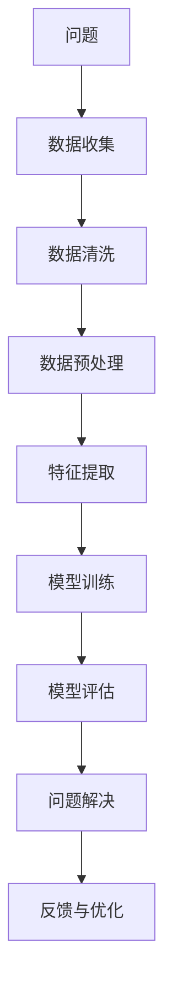

                 

## 1. 背景介绍

### 1.1 问题由来

在数字化时代，信息过载和决策复杂性不断增加，企业面临的挑战越来越多。传统的决策方式往往依赖于经验、直觉和手动分析，难以应对快速变化的市场环境。如何在海量数据中洞察关键信息，提炼出可行的解决方案，成为企业亟待解决的问题。

近年来，人工智能技术迅速发展，为增强数字化洞察力提供了新的可能性。AI技术不仅能自动化处理数据，还能识别模式、预测趋势，提供高效、智能的决策支持。特别在问题解决领域，AI增强的洞察力通过模型训练和算法优化，显著提升了问题解决的效率和质量。

### 1.2 问题核心关键点

增强数字化洞察力的AI技术，主要聚焦于以下几个关键点：

- **数据驱动决策**：利用机器学习和大数据分析，从大量数据中提炼有价值的信息，为决策提供支持。
- **模式识别和预测**：通过算法识别数据中的模式，预测未来趋势，辅助决策。
- **自动化问题解决**：自动发现问题、分析问题，并提出解决方案，减少人工干预。
- **智能优化**：优化模型和算法，提升问题解决的精度和效率。
- **跨领域应用**：在金融、医疗、制造等多个行业推广应用，提升行业竞争力。

这些核心点紧密联系，共同构成了AI增强洞察力的主要功能。

### 1.3 问题研究意义

增强数字化洞察力的AI技术，对于企业转型升级和创新发展具有重要意义：

- **提升决策质量**：通过数据驱动和模式识别，辅助企业制定更加科学合理的决策，避免主观偏见和错误。
- **降低运营成本**：自动化处理和分析，减少人工干预，降低运营成本，提升效率。
- **增强竞争优势**：通过AI洞察力，预测市场趋势，抢占市场先机，提高竞争力。
- **促进创新应用**：在各行各业推广AI技术，推动企业创新，开拓新的业务领域。

## 2. 核心概念与联系

### 2.1 核心概念概述

为了更好地理解AI增强问题解决的过程，我们首先介绍几个核心概念：

- **问题解决(Problem Solving)**：指在面对复杂问题时，通过一系列步骤和逻辑推理，找到问题的答案。
- **数据驱动(Data-Driven)**：利用数据和统计分析，辅助决策和问题解决。
- **模式识别(Pattern Recognition)**：从数据中识别出有规律的模式和趋势。
- **预测(Prediction)**：通过算法对未来进行预测和估计。
- **自动化(Automation)**：利用AI算法，自动完成问题的发现、分析和解决。
- **优化(Optimization)**：通过算法不断优化模型的性能，提升问题解决的质量。

这些概念紧密联系，共同构成了AI增强问题解决的核心框架。

### 2.2 核心概念原理和架构的 Mermaid 流程图(Mermaid 流程节点中不要有括号、逗号等特殊字符)



这个流程图展示了AI增强问题解决的核心流程：

1. **问题定义**：明确问题，确定目标。
2. **数据收集**：获取相关数据，为问题解决提供依据。
3. **数据清洗**：清洗数据，剔除噪声和无关数据。
4. **数据预处理**：对数据进行标准化、归一化等处理，为模型输入准备数据。
5. **特征提取**：从数据中提取关键特征，用于训练模型。
6. **模型训练**：利用机器学习算法，训练模型进行模式识别和预测。
7. **模型评估**：评估模型性能，调整参数。
8. **问题解决**：利用训练好的模型，自动分析和解决问题。
9. **反馈与优化**：根据反馈结果，优化模型，提升问题解决能力。

### 2.3 核心概念联系

- **问题解决与数据驱动**：问题解决需要数据驱动，通过数据分析和模式识别，找到问题的答案。
- **模式识别与预测**：模式识别和预测是数据分析的核心，通过识别数据中的模式，预测未来趋势，辅助决策。
- **自动化与优化**：自动化和优化是提升问题解决效率和质量的关键，通过不断优化模型，提升问题解决的效果。

这些概念互相依赖，共同构成了一个完整的AI增强问题解决框架。

## 3. 核心算法原理 & 具体操作步骤

### 3.1 算法原理概述

AI增强问题解决的算法，主要包括数据驱动、模式识别、预测和自动化等多个环节。其核心原理可以概括为：

1. **数据预处理和特征提取**：对原始数据进行清洗、归一化、标准化等处理，提取关键特征。
2. **模型训练和评估**：利用机器学习算法，训练模型，评估模型性能，调整参数。
3. **模式识别和预测**：利用训练好的模型，识别数据中的模式，预测未来趋势。
4. **自动化问题解决**：根据模式识别和预测结果，自动分析和解决问题。
5. **反馈与优化**：根据问题解决结果，反馈优化模型，提升问题解决能力。

这些步骤构成了一个循环迭代的过程，不断提升问题解决的精度和效率。

### 3.2 算法步骤详解

**Step 1: 问题定义和数据收集**

- 明确问题，定义目标。
- 收集与问题相关的数据，包括文本、图像、视频、时间序列等多种形式的数据。

**Step 2: 数据清洗和预处理**

- 清洗数据，剔除噪声和无关数据。
- 对数据进行标准化、归一化等预处理，为模型输入准备数据。

**Step 3: 特征提取和模型训练**

- 利用特征提取算法，从数据中提取关键特征。
- 利用机器学习算法，训练模型，进行模式识别和预测。

**Step 4: 模型评估和优化**

- 评估模型性能，如准确率、召回率、F1值等。
- 根据评估结果，调整模型参数，优化模型。

**Step 5: 问题解决和反馈**

- 利用训练好的模型，自动分析和解决问题。
- 根据问题解决结果，反馈优化模型，提升问题解决能力。

**Step 6: 重复迭代**

- 重复以上步骤，不断迭代，提升问题解决的精度和效率。

### 3.3 算法优缺点

**优点**：

- **效率高**：自动化处理和分析，提升问题解决的速度和效率。
- **精度高**：利用机器学习算法，识别数据中的模式和趋势，提高决策的准确性。
- **可扩展性强**：支持多种数据形式和算法模型，适应不同的问题场景。
- **鲁棒性强**：通过模型训练和优化，提升问题解决的鲁棒性和稳定性。

**缺点**：

- **数据依赖**：依赖高质量的数据，数据不足可能导致模型效果不佳。
- **算法复杂**：模型训练和优化需要较高的技术门槛和计算资源。
- **透明度低**：部分算法模型为"黑盒"，难以解释其内部逻辑和决策过程。

### 3.4 算法应用领域

AI增强问题解决的方法，在多个领域得到了广泛应用，例如：

- **金融领域**：利用AI进行风险评估、股票预测、交易策略制定等。
- **医疗领域**：利用AI进行疾病诊断、药物研发、患者管理等。
- **制造领域**：利用AI进行质量控制、故障诊断、生产调度等。
- **零售领域**：利用AI进行库存管理、客户分析、营销策略优化等。
- **物流领域**：利用AI进行路线规划、货物跟踪、仓储管理等。

这些应用场景展示了AI增强问题解决在各行各业的广泛应用，带来了显著的经济效益和社会价值。

## 4. 数学模型和公式 & 详细讲解 & 举例说明

### 4.1 数学模型构建

以金融领域的风险评估为例，建立数学模型：

假设给定一组历史数据 $D=\{(x_i, y_i)\}_{i=1}^N$，其中 $x_i$ 表示样本特征，$y_i$ 表示是否发生风险事件。构建一个二分类模型 $M$，输出风险事件的概率 $p(y_i=1|x_i)$。

定义模型在样本 $(x_i, y_i)$ 上的损失函数为 $\ell(M(x_i),y_i)$，则在数据集 $D$ 上的经验风险为：

$$
\mathcal{L}(\theta) = \frac{1}{N} \sum_{i=1}^N \ell(M_{\theta}(x_i),y_i)
$$

其中 $M_{\theta}(x_i)$ 为模型在样本 $x_i$ 上的输出。

### 4.2 公式推导过程

以二分类问题为例，推导常用的损失函数及其梯度：

假设模型 $M_{\theta}(x_i)$ 在样本 $x_i$ 上的输出为 $p_i$，真实标签为 $y_i$。则二分类交叉熵损失函数定义为：

$$
\ell(M_{\theta}(x_i),y_i) = -[y_i\log p_i + (1-y_i)\log (1-p_i)]
$$

将其代入经验风险公式，得：

$$
\mathcal{L}(\theta) = -\frac{1}{N}\sum_{i=1}^N [y_i\log p_i+(1-y_i)\log(1-p_i)]
$$

根据链式法则，损失函数对参数 $\theta_k$ 的梯度为：

$$
\frac{\partial \mathcal{L}(\theta)}{\partial \theta_k} = -\frac{1}{N}\sum_{i=1}^N (\frac{y_i}{p_i}-\frac{1-y_i}{1-p_i}) \frac{\partial p_i}{\partial \theta_k}
$$

其中 $\frac{\partial p_i}{\partial \theta_k}$ 为模型输出对参数的导数。

在得到损失函数的梯度后，即可带入优化算法更新模型参数。

### 4.3 案例分析与讲解

以股票预测为例，利用AI进行风险评估：

1. **问题定义**：预测某只股票未来一周内是否会上涨。
2. **数据收集**：收集历史股票价格、交易量、财务报表、新闻报道等数据。
3. **数据清洗和预处理**：清洗数据，剔除异常值，对数据进行标准化处理。
4. **特征提取**：提取关键特征，如价格变化、成交量、市盈率、市值等。
5. **模型训练**：利用机器学习算法，训练分类模型，预测股票上涨概率。
6. **模型评估**：评估模型性能，如准确率、召回率等。
7. **问题解决**：根据模型预测结果，制定股票交易策略。
8. **反馈与优化**：根据交易结果，反馈优化模型，提升预测精度。

通过以上步骤，利用AI增强洞察力，帮助投资者做出更科学的决策。

## 5. 项目实践：代码实例和详细解释说明

### 5.1 开发环境搭建

在进行AI增强问题解决的项目实践前，需要准备好开发环境。以下是使用Python进行TensorFlow开发的环境配置流程：

1. 安装Anaconda：从官网下载并安装Anaconda，用于创建独立的Python环境。

2. 创建并激活虚拟环境：
```bash
conda create -n tf-env python=3.8 
conda activate tf-env
```

3. 安装TensorFlow：根据CUDA版本，从官网获取对应的安装命令。例如：
```bash
conda install tensorflow-gpu=2.7.0
```

4. 安装必要的库：
```bash
pip install numpy pandas scikit-learn matplotlib tensorflow
```

完成上述步骤后，即可在`tf-env`环境中开始项目实践。

### 5.2 源代码详细实现

这里我们以金融领域的风险评估为例，给出使用TensorFlow进行模型开发的代码实现。

首先，定义数据处理函数：

```python
import numpy as np
import pandas as pd
from sklearn.model_selection import train_test_split

def load_data(path):
    data = pd.read_csv(path)
    X = data.drop(['y'], axis=1)
    y = data['y']
    return X, y

def train_test_split(X, y, test_size=0.2, random_state=42):
    X_train, X_test, y_train, y_test = train_test_split(X, y, test_size=test_size, random_state=random_state)
    return X_train, X_test, y_train, y_test
```

然后，定义模型结构：

```python
import tensorflow as tf
from tensorflow.keras import layers

class MLP(tf.keras.Model):
    def __init__(self, input_dim, hidden_dim, output_dim):
        super(MLP, self).__init__()
        self.fc1 = layers.Dense(hidden_dim, activation='relu')
        self.fc2 = layers.Dense(output_dim, activation='sigmoid')

    def call(self, x):
        x = self.fc1(x)
        x = self.fc2(x)
        return x
```

接着，定义模型训练函数：

```python
def train_model(X_train, X_test, y_train, y_test, epochs=10, batch_size=32, learning_rate=0.001):
    model = MLP(input_dim=X_train.shape[1], hidden_dim=64, output_dim=1)
    optimizer = tf.keras.optimizers.Adam(learning_rate)
    
    model.compile(loss='binary_crossentropy', optimizer=optimizer, metrics=['accuracy'])

    model.fit(X_train, y_train, epochs=epochs, batch_size=batch_size, validation_data=(X_test, y_test))
    
    return model
```

最后，启动训练流程并在测试集上评估：

```python
X_train, X_test, y_train, y_test = train_test_split(X, y, test_size=0.2, random_state=42)

model = train_model(X_train, X_test, y_train, y_test)

print('Model accuracy:', model.evaluate(X_test, y_test)[1])
```

以上就是使用TensorFlow进行金融风险评估的完整代码实现。可以看到，TensorFlow提供的高级API使得模型构建和训练变得十分便捷。

### 5.3 代码解读与分析

让我们再详细解读一下关键代码的实现细节：

**load_data函数**：
- 加载数据，从CSV文件中读取特征和标签，返回数据集。
- 使用sklearn的train_test_split函数，将数据集划分为训练集和测试集。

**MLP模型**：
- 定义多层感知器模型，包含两个全连接层，中间加入ReLU激活函数，最后一层使用Sigmoid激活函数。
- 在`call`方法中，先通过第一层全连接层进行特征提取，再通过第二层全连接层进行二分类预测。

**train_model函数**：
- 构建模型，设置优化器和损失函数。
- 编译模型，并使用fit方法进行训练。
- 在测试集上评估模型性能。

通过以上步骤，利用TensorFlow实现了金融风险评估的AI增强洞察力模型。

## 6. 实际应用场景

### 6.1 金融领域

金融领域是AI增强洞察力的典型应用场景之一。通过AI技术，金融机构可以实现以下几个方面的提升：

- **风险评估**：利用机器学习模型，对贷款申请、投资项目等进行风险评估，提高决策的准确性和可靠性。
- **股票预测**：通过深度学习算法，预测股票价格走势，辅助投资决策。
- **信用评分**：利用数据挖掘和机器学习算法，建立信用评分模型，评估客户信用风险。
- **欺诈检测**：利用异常检测算法，识别金融交易中的异常行为，防止欺诈。
- **客户服务**：利用自然语言处理技术，建立智能客服系统，提高客户满意度。

### 6.2 医疗领域

医疗领域同样受益于AI增强洞察力。例如：

- **疾病诊断**：利用机器学习模型，分析病人的病历数据，辅助医生进行疾病诊断。
- **药物研发**：通过数据挖掘和机器学习，加速新药研发过程。
- **患者管理**：利用数据分析，优化患者的治疗方案，提高治疗效果。
- **医疗影像分析**：利用深度学习算法，分析医疗影像，辅助医生进行诊断和治疗。

### 6.3 制造领域

在制造业中，AI增强洞察力可以带来显著的效益：

- **质量控制**：利用机器学习模型，分析生产数据，识别质量问题，提高产品质量。
- **故障诊断**：利用异常检测算法，预测设备故障，提前进行维护。
- **生产调度**：利用优化算法，制定最优的生产调度方案，提高生产效率。
- **供应链管理**：利用数据分析，优化供应链管理，降低成本，提高效率。

### 6.4 未来应用展望

随着AI技术的不断进步，未来在以下领域将会有更多AI增强洞察力的应用：

- **零售领域**：利用AI进行需求预测、库存管理、客户分析等，提升零售企业的竞争力和客户满意度。
- **物流领域**：利用AI进行路线规划、货物跟踪、仓储管理等，提高物流效率和可靠性。
- **能源领域**：利用AI进行能源预测、需求分析、优化调度等，提高能源利用效率。
- **城市管理**：利用AI进行城市规划、交通管理、环境监测等，提高城市管理水平。
- **农业领域**：利用AI进行作物预测、气象分析、农业管理等，提高农业生产效率。

## 7. 工具和资源推荐

### 7.1 学习资源推荐

为了帮助开发者系统掌握AI增强洞察力的理论基础和实践技巧，这里推荐一些优质的学习资源：

1. 《深度学习基础》书籍：全面介绍深度学习的基础理论和实践技巧，适合入门学习。
2. 《TensorFlow官方文档》：官方提供的TensorFlow学习资源，包括教程、API文档、示例代码等。
3. 《Python机器学习》书籍：介绍机器学习算法和应用，适合实战学习。
4. Coursera的《深度学习专项课程》：由斯坦福大学开设的深度学习课程，涵盖深度学习的基本概念和应用。
5. Kaggle平台：提供大量的数据集和比赛，供学习者进行实践和探索。

通过对这些资源的学习实践，相信你一定能够快速掌握AI增强洞察力的精髓，并用于解决实际的NLP问题。

### 7.2 开发工具推荐

高效的开发离不开优秀的工具支持。以下是几款用于AI增强洞察力开发的常用工具：

1. TensorFlow：由Google主导开发的开源深度学习框架，生产部署方便，适合大规模工程应用。
2. PyTorch：基于Python的开源深度学习框架，灵活动态的计算图，适合快速迭代研究。
3. Weights & Biases：模型训练的实验跟踪工具，可以记录和可视化模型训练过程中的各项指标，方便对比和调优。
4. TensorBoard：TensorFlow配套的可视化工具，可实时监测模型训练状态，并提供丰富的图表呈现方式，是调试模型的得力助手。
5. Jupyter Notebook：开源的交互式笔记本，支持Python和TensorFlow等环境，方便开发者进行实验和协作。

合理利用这些工具，可以显著提升AI增强洞察力任务的开发效率，加快创新迭代的步伐。

### 7.3 相关论文推荐

AI增强洞察力的研究源于学界的持续研究。以下是几篇奠基性的相关论文，推荐阅读：

1. Deep Learning: A Tutorial (2016)：Ian Goodfellow等人的深度学习教程，全面介绍深度学习的基本理论和应用。
2. ImageNet Classification with Deep Convolutional Neural Networks (2012)：AlexNet论文，展示深度卷积神经网络在图像分类任务中的优异表现。
3. Deep Residual Learning for Image Recognition (2015)：ResNet论文，提出残差网络，解决深度网络训练中的梯度消失问题。
4. Attention is All You Need (2017)：Transformer论文，提出Transformer模型，开启NLP领域的预训练大模型时代。
5. Parameter-Efficient Transfer Learning for NLP (2019)：提出Adapter等参数高效微调方法，在不增加模型参数量的情况下，也能取得不错的微调效果。

这些论文代表了大语言模型微调技术的发展脉络。通过学习这些前沿成果，可以帮助研究者把握学科前进方向，激发更多的创新灵感。

## 8. 总结：未来发展趋势与挑战

### 8.1 总结

本文对AI增强问题解决的原理和实践进行了全面系统的介绍。首先阐述了AI增强问题解决的背景和意义，明确了在数据驱动、模式识别、预测和自动化等多个环节中，AI技术的核心作用。其次，从原理到实践，详细讲解了AI增强洞察力的数学模型和关键步骤，给出了金融、医疗、制造等多个领域的实际应用案例。最后，本文精选了相关学习资源和工具，力求为读者提供全方位的技术指引。

通过本文的系统梳理，可以看到，AI增强问题解决技术在金融、医疗、制造等多个领域得到了广泛应用，带来了显著的经济效益和社会价值。未来，随着AI技术的不断进步，AI增强洞察力必将在更多领域得到推广，带来更广泛的应用和更大的价值。

### 8.2 未来发展趋势

展望未来，AI增强问题解决技术将呈现以下几个发展趋势：

1. **自动化程度更高**：未来AI模型将具备更高的自动化能力，能自动识别、分析和解决问题，减少人工干预。
2. **跨领域能力更强**：AI模型将具备更强的跨领域迁移能力，能在不同领域中灵活应用，解决复杂的跨领域问题。
3. **智能化程度更高**：未来AI模型将具备更强的智能化能力，能理解复杂的环境和情境，做出更智能的决策。
4. **可解释性更强**：未来AI模型将具备更强的可解释性，能通过可视化工具和语言模型解释其决策过程，提高可信度。
5. **实时处理能力更强**：未来AI模型将具备更强的实时处理能力，能实时分析数据，做出实时决策。

这些趋势凸显了AI增强洞察力的广阔前景。这些方向的探索发展，必将进一步提升问题解决的精度和效率，推动智能化技术的普及。

### 8.3 面临的挑战

尽管AI增强洞察力技术已经取得了显著进展，但在实现更加智能化、普适化应用的过程中，仍面临诸多挑战：

1. **数据质量问题**：高质量的数据是AI模型的基础，但数据的收集和处理往往需要大量的人力和时间成本，数据质量难以保证。
2. **模型复杂性**：当前AI模型复杂度不断增加，需要更高的计算资源和算法优化能力，模型训练和部署成本高。
3. **模型透明度**：部分AI模型为"黑盒"系统，难以解释其内部逻辑和决策过程，缺乏可信度。
4. **伦理和安全问题**：AI模型可能存在偏见、有害信息等，影响模型输出的公正性和安全性。

这些挑战需要学界和业界共同努力，推动AI增强洞察力技术不断完善和改进。

### 8.4 研究展望

面向未来，AI增强洞察力技术需要在以下几个方面寻求新的突破：

1. **数据获取和处理**：探索更高效的数据获取和处理方式，降低数据成本，提高数据质量。
2. **模型优化和简化**：优化模型结构，简化模型训练，提高模型实时处理能力。
3. **可解释性增强**：引入可解释性模型，增强AI模型的透明性和可信度。
4. **跨领域融合**：探索AI技术与大数据、物联网等技术的融合，提升AI模型的智能化水平。
5. **伦理和安全保障**：引入伦理导向的评估指标，建立模型行为的监管机制，确保模型输出的公正性和安全性。

这些研究方向的探索，必将引领AI增强洞察力技术迈向更高的台阶，为构建安全、可靠、可解释、可控的智能系统铺平道路。面向未来，AI增强洞察力技术还需要与其他人工智能技术进行更深入的融合，如知识表示、因果推理、强化学习等，多路径协同发力，共同推动自然语言理解和智能交互系统的进步。只有勇于创新、敢于突破，才能不断拓展语言模型的边界，让智能技术更好地造福人类社会。

## 9. 附录：常见问题与解答

**Q1：如何评估AI增强洞察力的效果？**

A: 评估AI增强洞察力的效果，通常需要以下几个指标：

- **准确率**：衡量模型预测的准确性，即模型预测正确的样本占总样本的比例。
- **召回率**：衡量模型发现正例的能力，即模型预测为正例的样本占实际正例的比例。
- **F1值**：综合准确率和召回率，衡量模型的综合性能。
- **ROC曲线**：绘制模型在不同阈值下的真阳性率和假阳性率，评估模型的分类性能。
- **混淆矩阵**：展示模型预测结果的分类情况，帮助理解模型表现。

通过这些指标，可以全面评估AI增强洞察力的效果，并进行模型调优。

**Q2：如何选择适合的模型和算法？**

A: 选择适合的模型和算法，需要考虑以下几个因素：

- **数据类型**：根据数据类型选择适合的模型，如文本数据适合使用Transformer，图像数据适合使用卷积神经网络。
- **任务类型**：根据任务类型选择适合的算法，如分类任务适合使用逻辑回归、SVM，回归任务适合使用线性回归、神经网络。
- **数据量**：根据数据量选择适合的模型，大数据量适合使用深度学习模型，小数据量适合使用决策树、支持向量机等传统模型。
- **计算资源**：根据计算资源选择适合的模型，计算资源有限适合使用参数较少的模型，计算资源充足适合使用复杂模型。
- **性能要求**：根据性能要求选择适合的模型，如实时性要求高适合使用轻量级模型，准确性要求高适合使用复杂模型。

通过综合考虑以上因素，选择适合的模型和算法，可以最大程度提升AI增强洞察力的效果。

**Q3：如何处理数据偏差和偏见？**

A: 数据偏差和偏见是AI模型常见的风险，需要通过以下几个方法进行缓解：

- **数据收集**：收集多样化的数据，避免数据偏差。
- **数据清洗**：清洗数据，剔除噪声和无关数据。
- **数据增强**：通过数据增强技术，增加数据多样性，提高模型的泛化能力。
- **正则化**：使用正则化技术，如L1正则、Dropout等，避免过拟合。
- **模型优化**：优化模型，使其具有更强的鲁棒性和公平性。

通过这些方法，可以缓解数据偏差和偏见问题，提高AI增强洞察力的效果。

**Q4：如何提升AI增强洞察力的可解释性？**

A: 提升AI增强洞察力的可解释性，通常需要以下几个方法：

- **模型可视化**：通过可视化工具展示模型内部结构，理解模型决策过程。
- **解释算法**：引入解释算法，如LIME、SHAP等，分析模型特征重要性。
- **规则提取**：提取模型规则，理解模型内部逻辑。
- **用户交互**：通过用户交互，理解模型决策依据。
- **可解释模型**：使用可解释性模型，如决策树、线性模型等，提高模型透明性。

通过这些方法，可以提升AI增强洞察力的可解释性，增强模型的可信度。

**Q5：如何处理模型的过拟合问题？**

A: 过拟合是AI模型常见的问题，需要通过以下几个方法进行缓解：

- **数据增强**：通过数据增强技术，增加数据多样性，提高模型的泛化能力。
- **正则化**：使用正则化技术，如L2正则、Dropout等，避免过拟合。
- **早停法**：在验证集上监控模型性能，一旦性能不再提升，立即停止训练。
- **模型简化**：简化模型结构，减少模型复杂度，提高泛化能力。
- **迁移学习**：通过迁移学习，利用已有模型进行微调，减少过拟合风险。

通过这些方法，可以缓解过拟合问题，提高AI增强洞察力的效果。

综上所述，AI增强洞察力技术在金融、医疗、制造等多个领域得到了广泛应用，带来了显著的经济效益和社会价值。未来，随着AI技术的不断进步，AI增强洞察力必将在更多领域得到推广，带来更广泛的应用和更大的价值。

