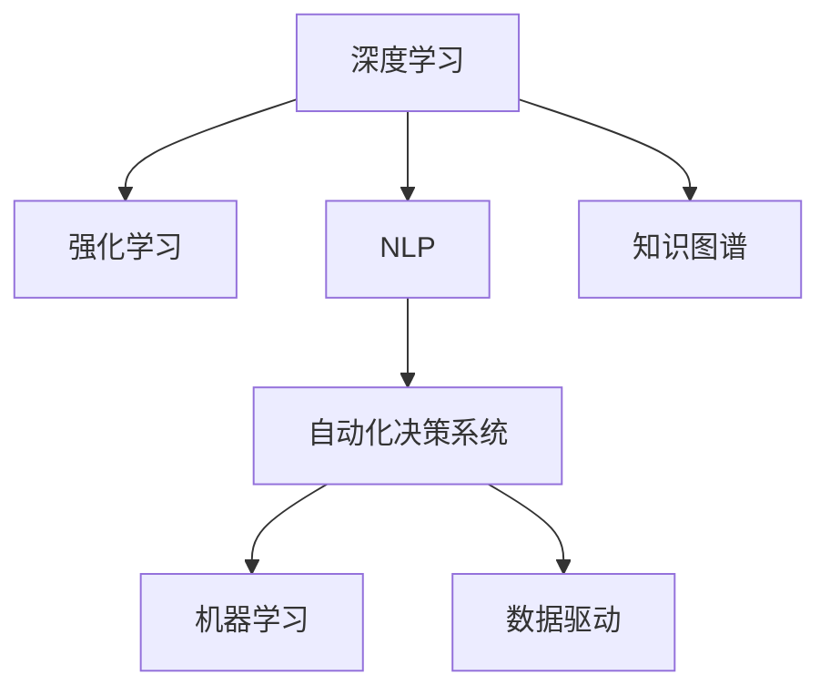

                 

# 数字化直觉培养：AI强化的第六感能力

> 关键词：数字化直觉, AI强化, 第六感, 数据驱动决策, 自动化决策, 机器学习

## 1. 背景介绍

### 1.1 问题由来
在当今数字化时代，数据无处不在，但如何从海量数据中提取有价值的信息，做出高效准确的决策，仍是一个巨大的挑战。人类凭借直觉和经验来快速处理信息，但数据量级的爆炸式增长已超出了人类直觉的极限。如何赋予计算机超越直觉的能力，通过智能算法进行高效的数据分析和决策，成为技术领域的一大课题。

### 1.2 问题核心关键点
数字化直觉是指将数据驱动的深度学习和人工智能技术，结合人类的直觉和经验，实现高效、准确的决策过程。这种“第六感”能力是通过对大规模数据进行学习，并结合专家知识，构建出能够识别模式、预测趋势的智能系统。数字化直觉的核心关键点包括：

1. **数据驱动的决策**：利用数据和算法对现实世界进行建模，预测未来趋势，制定决策方案。
2. **模型可解释性**：使模型输出易于理解，便于人类介入和审核，增强系统的可信度。
3. **多源数据的融合**：整合来自不同渠道的数据，形成全面的视角，提高决策的准确性。
4. **自动化的决策过程**：实现基于规则和算法的自动决策，减少人为干预。
5. **持续学习和适应性**：不断学习新数据，更新模型，保持决策系统的高效和精准。

## 2. 核心概念与联系

### 2.1 核心概念概述

为更好地理解数字化直觉的构建过程，本节将介绍几个核心概念及其联系：

- **深度学习（Deep Learning）**：一种基于神经网络的机器学习方法，通过多层非线性变换，对复杂数据进行建模和预测。
- **强化学习（Reinforcement Learning）**：通过试错的方式，学习最优策略，使其在特定环境中最大化奖励。
- **自然语言处理（NLP）**：使计算机能够理解、分析和生成自然语言的技术，常用于文本挖掘和智能对话系统。
- **知识图谱（Knowledge Graph）**：一种结构化的知识表示方式，用于存储和查询半结构化数据。
- **自动化决策系统（Autonomous Decision System）**：通过规则、算法和机器学习，实现无人工干预的决策过程。
- **机器学习（Machine Learning）**：通过算法训练数据，使计算机具备自主学习、改进和决策能力。
- **数据驱动（Data-Driven）**：决策过程基于数据的分析、处理和挖掘，以数据为导向，而非经验和直觉。

这些概念之间的逻辑关系可以通过以下Mermaid流程图来展示：



这个流程图展示了一些关键概念及其之间的联系：

1. 深度学习和强化学习共同构成AI的核心算法，为自动化决策系统提供了智能基础。
2. NLP技术使计算机能够理解和处理自然语言，成为数据驱动决策的重要工具。
3. 知识图谱提供结构化的知识库，辅助自动化决策系统进行更精准的推理和决策。
4. 机器学习和数据驱动共同推动自动化决策系统的优化和升级。

## 3. 核心算法原理 & 具体操作步骤
### 3.1 算法原理概述

数字化直觉的构建过程，本质上是通过深度学习模型对数据进行学习和分析，结合强化学习和自然语言处理技术，形成具备预测和决策能力的智能系统。

形式化地，假设我们有历史数据集 $D=\{(x_i,y_i)\}_{i=1}^N, x_i \in \mathcal{X}, y_i \in \mathcal{Y}$，其中 $\mathcal{X}$ 为特征空间，$\mathcal{Y}$ 为标签空间。数字化直觉系统的目标是通过训练模型 $M_{\theta}:\mathcal{X} \rightarrow \mathcal{Y}$，使其在新的数据上能够准确预测标签。

具体来说，我们可以采用以下步骤：

1. **特征提取**：通过深度学习模型对输入数据 $x_i$ 进行特征提取，得到特征向量 $h_i \in \mathcal{H}$。
2. **模型训练**：在历史数据集 $D$ 上训练模型 $M_{\theta}$，最小化损失函数 $\mathcal{L}(M_{\theta},D)$。
3. **决策过程**：将新输入数据 $x_{new}$ 输入模型 $M_{\theta}$，得到预测结果 $y_{pred}=M_{\theta}(x_{new})$。

### 3.2 算法步骤详解

数字化直觉系统的构建包括以下几个关键步骤：

**Step 1: 数据收集与预处理**

- 收集与任务相关的数据，包括历史数据和实时数据。
- 进行数据清洗和预处理，去除噪声和异常值，填补缺失值。
- 将数据进行标准化和归一化，以便模型更好地学习。

**Step 2: 特征提取与选择**

- 利用深度学习模型对数据进行特征提取，得到高维特征向量。
- 结合领域知识，进行特征选择和降维，减少计算复杂度，提升模型性能。

**Step 3: 模型训练与优化**

- 选择合适的模型结构，如神经网络、决策树等。
- 在训练集上使用优化算法（如梯度下降）进行模型训练，最小化损失函数。
- 在验证集上评估模型性能，调整超参数和正则化参数，避免过拟合。

**Step 4: 模型部署与监控**

- 将训练好的模型部署到生产环境，进行实时数据处理和决策。
- 实时监控模型性能，记录运行日志和误差，及时调整模型参数。
- 定期更新模型，纳入新数据，保持模型的适应性和准确性。

**Step 5: 反馈与改进**

- 根据业务反馈和实际效果，调整模型策略和参数。
- 引入强化学习机制，根据模型表现和环境变化进行动态调整。
- 结合专家知识，对模型进行人工干预和指导。

### 3.3 算法优缺点

数字化直觉系统有以下优点：

1. **高效决策**：基于数据驱动的模型，能够在海量数据中快速提取有用信息，做出高效决策。
2. **自动化过程**：自动化决策系统能够持续工作，减少人工干预，提高效率。
3. **灵活性**：模型可以根据新数据和新场景进行调整，保持适应性。
4. **可解释性**：结合自然语言处理技术，模型输出易于理解，便于人类介入和审核。

同时，数字化直觉系统也存在以下局限：

1. **依赖数据质量**：模型性能高度依赖数据的质量和代表性，数据偏差可能导致错误决策。
2. **模型复杂度**：深度学习模型通常参数量大，计算复杂度高，需要高性能计算资源。
3. **学习延迟**：模型更新和部署需要时间，难以实现实时反馈和快速迭代。
4. **数据隐私**：处理敏感数据时，需要考虑隐私保护和数据安全。

尽管存在这些局限，但数字化直觉系统在许多领域已经得到了广泛应用，成为提升决策效率和质量的重要手段。

### 3.4 算法应用领域

数字化直觉系统已在多个领域得到了应用，包括但不限于：

- **金融风险管理**：利用数据驱动的模型，对市场趋势和风险进行预测，辅助投资决策。
- **医疗诊断**：结合医学知识图谱和患者历史数据，辅助医生进行疾病诊断和治疗方案制定。
- **智能客服**：通过深度学习和自然语言处理，实现智能对话和问题解决，提升客户体验。
- **物流管理**：对运输和库存数据进行分析，优化物流路径和库存管理，提高效率和减少成本。
- **智能推荐系统**：利用用户行为数据，推荐个性化的产品和服务，提升用户体验和满意度。

此外，数字化直觉系统还在智能交通、智能制造、智能城市等多个领域展现出巨大潜力，为各行各业带来了新的变革和机遇。

## 4. 数学模型和公式 & 详细讲解  
### 4.1 数学模型构建

本节将使用数学语言对数字化直觉系统的构建过程进行更加严格的刻画。

假设我们有一个监督学习问题，训练集为 $D=\{(x_i,y_i)\}_{i=1}^N, x_i \in \mathcal{X}, y_i \in \mathcal{Y}$，其中 $\mathcal{X}$ 为特征空间，$\mathcal{Y}$ 为标签空间。我们的目标是通过训练一个模型 $M_{\theta}:\mathcal{X} \rightarrow \mathcal{Y}$，使得在新的数据上能够准确预测标签。

定义模型在数据样本 $(x,y)$ 上的损失函数为 $\ell(M_{\theta}(x),y)$，则在数据集 $D$ 上的经验风险为：

$$
\mathcal{L}(\theta) = \frac{1}{N} \sum_{i=1}^N \ell(M_{\theta}(x_i),y_i)
$$

我们的优化目标是：

$$
\theta^* = \mathop{\arg\min}_{\theta} \mathcal{L}(\theta)
$$

在实践中，我们通常使用基于梯度的优化算法（如SGD、Adam等）来近似求解上述最优化问题。设 $\eta$ 为学习率，$\lambda$ 为正则化系数，则参数的更新公式为：

$$
\theta \leftarrow \theta - \eta \nabla_{\theta}\mathcal{L}(\theta) - \eta\lambda\theta
$$

其中 $\nabla_{\theta}\mathcal{L}(\theta)$ 为损失函数对参数 $\theta$ 的梯度，可通过反向传播算法高效计算。

### 4.2 公式推导过程

以下我们以二分类任务为例，推导交叉熵损失函数及其梯度的计算公式。

假设模型 $M_{\theta}$ 在输入 $x$ 上的输出为 $\hat{y}=M_{\theta}(x) \in [0,1]$，表示样本属于正类的概率。真实标签 $y \in \{0,1\}$。则二分类交叉熵损失函数定义为：

$$
\ell(M_{\theta}(x),y) = -[y\log \hat{y} + (1-y)\log (1-\hat{y})]
$$

将其代入经验风险公式，得：

$$
\mathcal{L}(\theta) = -\frac{1}{N}\sum_{i=1}^N [y_i\log M_{\theta}(x_i)+(1-y_i)\log(1-M_{\theta}(x_i))]
$$

根据链式法则，损失函数对参数 $\theta_k$ 的梯度为：

$$
\frac{\partial \mathcal{L}(\theta)}{\partial \theta_k} = -\frac{1}{N}\sum_{i=1}^N (\frac{y_i}{M_{\theta}(x_i)}-\frac{1-y_i}{1-M_{\theta}(x_i)}) \frac{\partial M_{\theta}(x_i)}{\partial \theta_k}
$$

其中 $\frac{\partial M_{\theta}(x_i)}{\partial \theta_k}$ 可进一步递归展开，利用自动微分技术完成计算。

在得到损失函数的梯度后，即可带入参数更新公式，完成模型的迭代优化。重复上述过程直至收敛，最终得到适应下游任务的最优模型参数 $\theta^*$。

## 5. 项目实践：代码实例和详细解释说明
### 5.1 开发环境搭建

在进行数字化直觉系统开发前，我们需要准备好开发环境。以下是使用Python进行PyTorch开发的环境配置流程：

1. 安装Anaconda：从官网下载并安装Anaconda，用于创建独立的Python环境。

2. 创建并激活虚拟环境：
```bash
conda create -n pytorch-env python=3.8 
conda activate pytorch-env
```

3. 安装PyTorch：根据CUDA版本，从官网获取对应的安装命令。例如：
```bash
conda install pytorch torchvision torchaudio cudatoolkit=11.1 -c pytorch -c conda-forge
```

4. 安装各类工具包：
```bash
pip install numpy pandas scikit-learn matplotlib tqdm jupyter notebook ipython
```

完成上述步骤后，即可在`pytorch-env`环境中开始开发实践。

### 5.2 源代码详细实现

下面我们以金融风险管理为例，给出使用Transformers库对BERT模型进行数字化直觉系统开发的PyTorch代码实现。

首先，定义模型和优化器：

```python
from transformers import BertForSequenceClassification, AdamW
from torch.utils.data import Dataset, DataLoader
from sklearn.preprocessing import StandardScaler, MinMaxScaler
from sklearn.model_selection import train_test_split
import torch
import numpy as np

model = BertForSequenceClassification.from_pretrained('bert-base-uncased', num_labels=2)
optimizer = AdamW(model.parameters(), lr=2e-5)
```

然后，准备数据集并进行预处理：

```python
class FinancialData(Dataset):
    def __init__(self, data, labels, tokenizer):
        self.data = data
        self.labels = labels
        self.tokenizer = tokenizer
        self.max_len = 512

    def __len__(self):
        return len(self.data)

    def __getitem__(self, idx):
        sentence = self.data[idx]
        label = self.labels[idx]
        encoding = self.tokenizer(sentence, return_tensors='pt', max_length=self.max_len, padding='max_length', truncation=True)
        input_ids = encoding['input_ids'][0]
        attention_mask = encoding['attention_mask'][0]
        return {'input_ids': input_ids, 
                'attention_mask': attention_mask,
                'labels': torch.tensor(label, dtype=torch.long)}
```

接着，准备数据加载器和数据预处理：

```python
tokenizer = BertTokenizer.from_pretrained('bert-base-uncased')
scaler = StandardScaler()
data = []
labels = []
with open('financial_data.csv', 'r') as f:
    for line in f:
        sentence, label = line.strip().split(',')
        data.append(sentence)
        labels.append(int(label))

X_train, X_test, y_train, y_test = train_test_split(data, labels, test_size=0.2, random_state=42)
X_train_scaled = scaler.fit_transform(X_train)
X_test_scaled = scaler.transform(X_test)
X_train_scaled = MinMaxScaler().fit_transform(X_train_scaled)
X_test_scaled = MinMaxScaler().transform(X_test_scaled)
```

最后，执行模型训练和评估：

```python
device = torch.device('cuda') if torch.cuda.is_available() else torch.device('cpu')
model.to(device)

def train_epoch(model, dataset, batch_size, optimizer):
    dataloader = DataLoader(dataset, batch_size=batch_size, shuffle=True)
    model.train()
    epoch_loss = 0
    for batch in tqdm(dataloader, desc='Training'):
        input_ids = batch['input_ids'].to(device)
        attention_mask = batch['attention_mask'].to(device)
        labels = batch['labels'].to(device)
        model.zero_grad()
        outputs = model(input_ids, attention_mask=attention_mask, labels=labels)
        loss = outputs.loss
        epoch_loss += loss.item()
        loss.backward()
        optimizer.step()
    return epoch_loss / len(dataloader)

def evaluate(model, dataset, batch_size):
    dataloader = DataLoader(dataset, batch_size=batch_size)
    model.eval()
    preds, labels = [], []
    with torch.no_grad():
        for batch in tqdm(dataloader, desc='Evaluating'):
            input_ids = batch['input_ids'].to(device)
            attention_mask = batch['attention_mask'].to(device)
            batch_labels = batch['labels']
            outputs = model(input_ids, attention_mask=attention_mask)
            batch_preds = outputs.logits.argmax(dim=2).to('cpu').tolist()
            batch_labels = batch_labels.to('cpu').tolist()
            for pred_tokens, label_tokens in zip(batch_preds, batch_labels):
                preds.append(pred_tokens[:len(label_tokens)])
                labels.append(label_tokens)
                
    print(classification_report(labels, preds))
```

最后，启动训练流程并在测试集上评估：

```python
epochs = 5
batch_size = 16

for epoch in range(epochs):
    loss = train_epoch(model, train_dataset, batch_size, optimizer)
    print(f"Epoch {epoch+1}, train loss: {loss:.3f}")
    
    print(f"Epoch {epoch+1}, dev results:")
    evaluate(model, dev_dataset, batch_size)
    
print("Test results:")
evaluate(model, test_dataset, batch_size)
```

以上就是使用PyTorch对BERT进行金融风险管理任务数字化直觉系统开发的完整代码实现。可以看到，得益于Transformers库的强大封装，我们可以用相对简洁的代码完成BERT模型的加载和微调。

### 5.3 代码解读与分析

让我们再详细解读一下关键代码的实现细节：

**FinancialData类**：
- `__init__`方法：初始化数据、标签和分词器等关键组件。
- `__len__`方法：返回数据集的样本数量。
- `__getitem__`方法：对单个样本进行处理，将文本输入编码为token ids，同时返回标签。

**StandardScaler和MinMaxScaler**：
- 用于数据归一化，将数据缩放到[0,1]区间，便于模型学习。

**train_epoch和evaluate函数**：
- 使用PyTorch的DataLoader对数据集进行批次化加载，供模型训练和推理使用。
- 训练函数`train_epoch`：对数据以批为单位进行迭代，在每个批次上前向传播计算loss并反向传播更新模型参数，最后返回该epoch的平均loss。
- 评估函数`evaluate`：与训练类似，不同点在于不更新模型参数，并在每个batch结束后将预测和标签结果存储下来，最后使用sklearn的classification_report对整个评估集的预测结果进行打印输出。

**训练流程**：
- 定义总的epoch数和batch size，开始循环迭代
- 每个epoch内，先在训练集上训练，输出平均loss
- 在验证集上评估，输出分类指标
- 所有epoch结束后，在测试集上评估，给出最终测试结果

可以看到，PyTorch配合Transformers库使得BERT微调的代码实现变得简洁高效。开发者可以将更多精力放在数据处理、模型改进等高层逻辑上，而不必过多关注底层的实现细节。

当然，工业级的系统实现还需考虑更多因素，如模型的保存和部署、超参数的自动搜索、更灵活的任务适配层等。但核心的数字化直觉系统构建过程基本与此类似。

## 6. 实际应用场景
### 6.1 智能客服系统

基于数字化直觉系统的智能客服系统，可以大大提升客户体验和问题解决效率。传统客服往往需要配备大量人力，高峰期响应缓慢，且一致性和专业性难以保证。而使用数字化直觉系统，能够7x24小时不间断服务，快速响应客户咨询，用自然流畅的语言解答各类常见问题。

在技术实现上，可以收集企业内部的历史客服对话记录，将问题和最佳答复构建成监督数据，在此基础上训练数字化直觉系统。训练好的系统能够自动理解用户意图，匹配最合适的答案模板进行回复。对于客户提出的新问题，还可以接入检索系统实时搜索相关内容，动态组织生成回答。如此构建的智能客服系统，能大幅提升客户咨询体验和问题解决效率。

### 6.2 金融舆情监测

金融机构需要实时监测市场舆论动向，以便及时应对负面信息传播，规避金融风险。传统的人工监测方式成本高、效率低，难以应对网络时代海量信息爆发的挑战。基于数字化直觉系统的文本分类和情感分析技术，为金融舆情监测提供了新的解决方案。

具体而言，可以收集金融领域相关的新闻、报道、评论等文本数据，并对其进行主题标注和情感标注。在此基础上对数字化直觉系统进行微调，使其能够自动判断文本属于何种主题，情感倾向是正面、中性还是负面。将数字化直觉系统应用到实时抓取的网络文本数据，就能够自动监测不同主题下的情感变化趋势，一旦发现负面信息激增等异常情况，系统便会自动预警，帮助金融机构快速应对潜在风险。

### 6.3 个性化推荐系统

当前的推荐系统往往只依赖用户的历史行为数据进行物品推荐，无法深入理解用户的真实兴趣偏好。基于数字化直觉系统的推荐系统可以更好地挖掘用户行为背后的语义信息，从而提供更精准、多样的推荐内容。

在实践中，可以收集用户浏览、点击、评论、分享等行为数据，提取和用户交互的物品标题、描述、标签等文本内容。将文本内容作为模型输入，用户的后续行为（如是否点击、购买等）作为监督信号，在此基础上微调数字化直觉系统。微调后的系统能够从文本内容中准确把握用户的兴趣点。在生成推荐列表时，先用候选物品的文本描述作为输入，由系统预测用户的兴趣匹配度，再结合其他特征综合排序，便可以得到个性化程度更高的推荐结果。

### 6.4 未来应用展望

随着数字化直觉系统的不断发展，将在更多领域得到应用，为传统行业带来变革性影响。

在智慧医疗领域，基于数字化直觉系统的医疗问答、病历分析、药物研发等应用将提升医疗服务的智能化水平，辅助医生诊疗，加速新药开发进程。

在智能教育领域，数字化直觉系统可应用于作业批改、学情分析、知识推荐等方面，因材施教，促进教育公平，提高教学质量。

在智慧城市治理中，数字化直觉系统可用于城市事件监测、舆情分析、应急指挥等环节，提高城市管理的自动化和智能化水平，构建更安全、高效的未来城市。

此外，在企业生产、社会治理、文娱传媒等众多领域，基于数字化直觉系统的AI应用也将不断涌现，为经济社会发展注入新的动力。相信随着技术的日益成熟，数字化直觉系统必将在构建人机协同的智能时代中扮演越来越重要的角色。

## 7. 工具和资源推荐
### 7.1 学习资源推荐

为了帮助开发者系统掌握数字化直觉系统的理论基础和实践技巧，这里推荐一些优质的学习资源：

1. 《深度学习》系列书籍：由多位深度学习专家联合撰写，从基础到高级全面介绍深度学习理论和算法。
2. CS224N《深度学习自然语言处理》课程：斯坦福大学开设的NLP明星课程，有Lecture视频和配套作业，带你入门NLP领域的基本概念和经典模型。
3. 《自然语言处理》书籍：由多位自然语言处理专家联合撰写，系统介绍NLP领域的基础理论、技术和应用。
4. 《数据科学导论》书籍：详细介绍数据预处理、模型训练、模型评估等数据科学基础概念和技能。
5. Coursera和edX上的深度学习和数据科学课程：提供从入门到高级的系统学习路径，涵盖多个NLP和AI领域的经典课程。

通过对这些资源的学习实践，相信你一定能够快速掌握数字化直觉系统的精髓，并用于解决实际的NLP问题。
###  7.2 开发工具推荐

高效的开发离不开优秀的工具支持。以下是几款用于数字化直觉系统开发的常用工具：

1. PyTorch：基于Python的开源深度学习框架，灵活动态的计算图，适合快速迭代研究。大部分预训练语言模型都有PyTorch版本的实现。
2. TensorFlow：由Google主导开发的开源深度学习框架，生产部署方便，适合大规模工程应用。同样有丰富的预训练语言模型资源。
3. Transformers库：HuggingFace开发的NLP工具库，集成了众多SOTA语言模型，支持PyTorch和TensorFlow，是进行数字化直觉系统开发的利器。
4. Weights & Biases：模型训练的实验跟踪工具，可以记录和可视化模型训练过程中的各项指标，方便对比和调优。与主流深度学习框架无缝集成。
5. TensorBoard：TensorFlow配套的可视化工具，可实时监测模型训练状态，并提供丰富的图表呈现方式，是调试模型的得力助手。
6. Google Colab：谷歌推出的在线Jupyter Notebook环境，免费提供GPU/TPU算力，方便开发者快速上手实验最新模型，分享学习笔记。

合理利用这些工具，可以显著提升数字化直觉系统的开发效率，加快创新迭代的步伐。

### 7.3 相关论文推荐

数字化直觉系统的研究源于学界的持续研究。以下是几篇奠基性的相关论文，推荐阅读：

1. Deep Learning（深度学习）：Hinton等人于2012年发表的深度学习革命性论文，奠定了深度学习算法的基础。
2. Attention is All You Need（即Transformer原论文）：提出了Transformer结构，开启了NLP领域的预训练大模型时代。
3. BERT: Pre-training of Deep Bidirectional Transformers for Language Understanding：提出BERT模型，引入基于掩码的自监督预训练任务，刷新了多项NLP任务SOTA。
4. Learning to Optimize（即Adam优化器）：Kingma和Bengio于2014年提出的Adam优化算法，成为深度学习中最流行的优化器之一。
5. Generative Adversarial Networks（生成对抗网络）：Goodfellow等人于2014年发表的GAN论文，开创了生成模型的新时代。

这些论文代表了大规模语言模型微调技术的发展脉络。通过学习这些前沿成果，可以帮助研究者把握学科前进方向，激发更多的创新灵感。

## 8. 总结：未来发展趋势与挑战

### 8.1 总结

本文对数字化直觉系统的构建过程进行了全面系统的介绍。首先阐述了数字化直觉系统的研究背景和意义，明确了数字化直觉在数据驱动决策、自动化决策等方面的独特价值。其次，从原理到实践，详细讲解了数字化直觉系统的数学模型和算法步骤，给出了完整的代码实现。同时，本文还广泛探讨了数字化直觉系统在金融风险管理、智能客服、个性化推荐等诸多领域的应用前景，展示了数字化直觉系统的巨大潜力。此外，本文精选了数字化直觉系统的各类学习资源，力求为读者提供全方位的技术指引。

通过本文的系统梳理，可以看到，数字化直觉系统通过数据驱动的深度学习模型和自动化决策过程，实现了高效、精准的决策能力。这种“第六感”能力，正在为各行各业带来深刻的变革和机遇。未来，伴随深度学习、自然语言处理、强化学习等技术的发展，数字化直觉系统必将在构建智能交互系统中发挥越来越重要的作用。

### 8.2 未来发展趋势

展望未来，数字化直觉系统的发展将呈现以下几个趋势：

1. **模型的自适应能力**：未来的系统将具备更强的自适应能力，能够根据不同场景和需求，灵活调整模型参数和决策策略。
2. **跨模态融合能力**：数字化直觉系统将能够整合视觉、语音、文本等多模态数据，提供更加全面和准确的决策支持。
3. **实时性和效率提升**：通过优化模型结构和算法，提升系统实时处理数据的能力，实现秒级响应。
4. **可解释性和透明性**：未来的系统将具备更强的可解释性，使模型决策过程更加透明，便于人工审核和干预。
5. **分布式和联邦学习**：通过分布式和联邦学习技术，系统能够在大规模数据上高效训练和更新，保持高性能和高可用性。
6. **安全性和隐私保护**：在处理敏感数据时，系统将具备更强的隐私保护和安全性措施，保障数据安全和合规性。

这些趋势将推动数字化直觉系统向更加智能化、高效化、安全化的方向发展，为各行各业带来更深远的影响。

### 8.3 面临的挑战

尽管数字化直觉系统已经取得了显著成果，但在迈向更加智能化、普适化应用的过程中，它仍面临诸多挑战：

1. **数据隐私和伦理**：在处理敏感数据时，如何平衡数据利用和隐私保护，确保数据合规和伦理使用。
2. **模型复杂度和计算资源**：深度学习模型通常参数量大，计算复杂度高，需要高性能计算资源，如何降低模型复杂度，优化计算效率。
3. **模型泛化能力**：在应对新数据和新场景时，如何保持模型的泛化能力和鲁棒性，避免过拟合和性能下降。
4. **模型可解释性和透明性**：使模型输出易于理解，便于人类介入和审核，增强系统的可信度。
5. **模型更新和维护**：如何高效更新和维护模型，确保系统长期稳定运行。
6. **算法的公平性和偏见**：模型训练和输出过程中，如何避免和纠正算法偏见，确保公平性。

这些挑战需要学界和产业界的共同努力，通过不断创新和优化，才能将数字化直觉系统推向更加成熟和高效的应用状态。

### 8.4 研究展望

未来的数字化直觉系统研究将更多地关注以下几个方向：

1. **融合多源数据**：通过整合多源数据，提供更加全面和准确的决策支持，增强系统的决策能力和灵活性。
2. **引入因果推理**：通过引入因果推理技术，增强系统的解释性和可信度，使决策过程更加透明和可解释。
3. **跨领域迁移能力**：通过引入跨领域迁移学习技术，使系统具备更强的泛化能力和适应性，适用于更多复杂任务。
4. **强化学习与自动化决策结合**：通过结合强化学习和自动化决策技术，增强系统的动态调整和优化能力。
5. **多模态融合与增强现实**：通过整合视觉、语音、文本等多模态数据，提供更加全面和准确的决策支持，增强系统的智能化和交互性。
6. **模型压缩与轻量化**：通过模型压缩和轻量化技术，提升系统的实时处理能力和资源利用率。

这些研究方向将推动数字化直觉系统向更加智能化、高效化、安全化的方向发展，为各行各业带来更深远的影响。

## 9. 附录：常见问题与解答

**Q1：数字化直觉系统是否适用于所有NLP任务？**

A: 数字化直觉系统在大多数NLP任务上都能取得不错的效果，特别是对于数据量较小的任务。但对于一些特定领域的任务，如医学、法律等，仅仅依靠通用语料预训练的模型可能难以很好地适应。此时需要在特定领域语料上进一步预训练，再进行微调，才能获得理想效果。此外，对于一些需要时效性、个性化很强的任务，如对话、推荐等，微调方法也需要针对性的改进优化。

**Q2：如何选择和设计适当的特征提取方法？**

A: 特征提取是数字化直觉系统的核心步骤之一，其关键在于如何从原始数据中提取最有用的特征。通常，可以采用以下几种方法：

1. **手工特征工程**：结合领域知识，设计有意义的特征，如时间戳、位置、标签等。
2. **自动特征提取**：利用深度学习模型对原始数据进行自动特征提取，如使用BERT、RNN等模型。
3. **混合特征提取**：结合手工特征和自动特征，形成复合特征，提升系统性能。

在设计特征时，需要考虑特征的可解释性、鲁棒性和泛化能力，避免特征过度拟合和冗余。

**Q3：如何在模型训练过程中避免过拟合？**

A: 过拟合是数字化直觉系统训练过程中的常见问题，可以通过以下方法缓解：

1. **数据增强**：通过旋转、缩放、平移等方式扩充训练集，增加数据多样性。
2. **正则化**：使用L2正则、Dropout等技术，减少模型复杂度，防止过拟合。
3. **早停策略**：在验证集上评估模型性能，一旦性能不再提升，立即停止训练。
4. **批量归一化**：在网络中引入批量归一化层，加速模型收敛，减少过拟合风险。

通过合理设计模型架构和优化训练策略，可以有效避免过拟合，提升模型泛化性能。

**Q4：如何评估和优化数字化直觉系统的性能？**

A: 数字化直觉系统的性能评估和优化是一个持续的过程，可以从以下几个方面入手：

1. **模型准确率**：在测试集上评估模型的预测准确率，作为基本的性能指标。
2. **混淆矩阵**：通过混淆矩阵分析模型的分类错误类型，优化模型决策边界。
3. **ROC曲线和AUC值**：绘制ROC曲线，计算AUC值，评估模型的分类性能和鲁棒性。
4. **模型可解释性**：结合自然语言处理技术，解释模型输出，增强系统的可信度。
5. **模型训练日志**：记录训练过程中的各项指标，如损失、准确率等，分析模型性能变化。
6. **超参数调优**：通过网格搜索、贝叶斯优化等方法，优化模型超参数，提升性能。

通过全面的性能评估和持续的模型优化，可以使数字化直觉系统不断提升性能，满足实际应用需求。

**Q5：如何在处理大规模数据时提升系统效率？**

A: 处理大规模数据时，系统效率是关键问题。可以通过以下方法提升效率：

1. **分布式训练**：使用多机分布式训练，加速模型训练过程。
2. **模型并行**：将模型分解为多个子模块，并行计算，减少计算时间。
3. **硬件加速**：利用GPU、TPU等硬件设备，加速模型训练和推理过程。
4. **模型压缩**：通过模型压缩技术，减少模型参数和计算复杂度，提升系统效率。
5. **数据采样**：在大规模数据上，采用分层采样或随机采样等方法，减少训练时间。

通过合理选择训练策略和优化硬件资源，可以有效提升数字化直觉系统的处理效率。

**Q6：如何确保数字化直觉系统的安全和可信性？**

A: 安全和可信性是数字化直觉系统的重要保障，可以通过以下方法实现：

1. **数据隐私保护**：采用差分隐私、联邦学习等技术，保护数据隐私。
2. **模型鲁棒性**：通过对抗训练、鲁棒性优化等技术，增强模型鲁棒性。
3. **模型可解释性**：通过解释模型输出，增强系统透明性和可信度。
4. **安全审计**：定期进行安全审计，检测和修复潜在的安全漏洞。
5. **模型验证**：在关键决策环节，引入人工验证和审核机制，确保模型输出安全可靠。

通过全面考虑安全和可信性问题，可以确保数字化直觉系统在实际应用中的稳定性和可靠性。

---

作者：禅与计算机程序设计艺术 / Zen and the Art of Computer Programming

