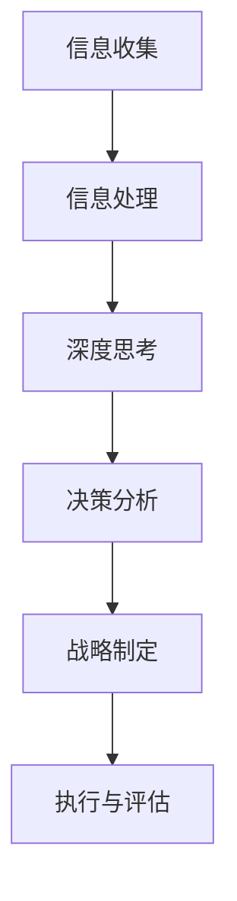

                 

**关键词：**深度思考、战略制定、决策分析、信息处理、创新、可持续发展

## 1. 背景介绍

在当今快速变化的商业环境中，企业面临着前所未有的挑战和机遇。成功的企业需要能够快速适应变化，并制定出有效的战略以实现其目标。然而，战略制定是一个复杂的过程，涉及到大量的信息处理和决策分析。在这个过程中，深度思考扮演着至关重要的角色。

## 2. 核心概念与联系

### 2.1 深度思考的定义

深度思考是指一种能够洞察事物本质，并能够从不同角度分析问题的思维方式。它要求个体能够超越表面现象，挖掘事物的内在联系，并能够提出创新的解决方案。

### 2.2 深度思考与战略制定的联系

深度思考与战略制定的联系如下图所示：



在信息收集和信息处理的基础上，深度思考能够帮助个体从海量信息中提取关键信息，并能够从不同角度分析问题，提出创新的解决方案。决策分析则是基于深度思考的结果，结合企业的目标和资源，制定出有效的战略。战略的执行和评估则是战略制定的最后一步，也是最为关键的一步。

## 3. 核心算法原理 & 具体操作步骤

### 3.1 算法原理概述

深度思考并没有一个固定的算法，而是一种思维方式。然而，我们可以通过一些具体的操作步骤来帮助我们进行深度思考。

### 3.2 算法步骤详解

1. **信息收集**：收集与问题相关的所有信息，包括但不限于数据、文献、专家意见等。
2. **信息处理**：对收集到的信息进行整理和分析，提取关键信息。
3. **问题重构**：从不同角度重新定义问题，以便于分析。
4. **假设检验**：对问题的假设进行检验，以确保问题的定义是合理的。
5. **创新解决方案**：基于问题的定义和假设检验的结果，提出创新的解决方案。
6. **决策分析**：对各种解决方案进行评估，并结合企业的目标和资源，做出决策。

### 3.3 算法优缺点

**优点：**

* 能够帮助个体从不同角度分析问题，提出创新的解决方案。
* 能够帮助个体避免陷入思维定式，提高决策的质量。
* 能够帮助个体提高信息处理能力，提高工作效率。

**缺点：**

* 深度思考需要花费大量的时间和精力，可能会导致决策的延迟。
* 深度思考可能会导致分析过度，从而忽略了问题的本质。
* 深度思考需要一定的技巧和经验，并不是每个人都能够掌握。

### 3.4 算法应用领域

深度思考可以应用于各个领域，包括但不限于商业战略制定、产品设计、科学研究等。任何需要分析问题，提出解决方案的领域都可以应用深度思考。

## 4. 数学模型和公式 & 详细讲解 & 举例说明

### 4.1 数学模型构建

在战略制定的过程中，我们可以构建数学模型来帮助我们分析问题。例如，我们可以使用线性规划模型来帮助我们优化资源配置，或者使用决策树模型来帮助我们分析决策的风险。

### 4.2 公式推导过程

以线性规划模型为例，其公式推导过程如下：

设有n个决策变量$x_1, x_2,..., x_n$, 目标函数为$z = c_1x_1 + c_2x_2 +... + c_nx_n$, 约束条件为$a_{11}x_1 + a_{12}x_2 +... + a_{1n}x_n \leq b_1$, $a_{21}x_1 + a_{22}x_2 +... + a_{2n}x_n \leq b_2$,..., $a_{m1}x_1 + a_{m2}x_2 +... + a_{mn}x_n \leq b_m$, 其中$c_i, a_{ij}, b_i$都是常数。

则线性规划模型的公式为：

$$\begin{cases} z = c_1x_1 + c_2x_2 +... + c_nx_n \\ a_{11}x_1 + a_{12}x_2 +... + a_{1n}x_n \leq b_1 \\ a_{21}x_1 + a_{22}x_2 +... + a_{2n}x_n \leq b_2 \\... \\ a_{m1}x_1 + a_{m2}x_2 +... + a_{mn}x_n \leq b_m \end{cases}$$

### 4.3 案例分析与讲解

例如，一家企业需要优化其资源配置，以最大化其利润。该企业有两种产品可以生产，分别需要原材料A和原材料B，每种产品的利润和原材料需求如下表所示：

| 产品 | 利润（万元） | 原材料A需求（吨） | 原材料B需求（吨） |
| --- | --- | --- | --- |
| 产品1 | 5 | 2 | 1 |
| 产品2 | 3 | 1 | 2 |

该企业共有原材料A5吨，原材料B4吨。则该企业的线性规划模型为：

$$\begin{cases} z = 5x_1 + 3x_2 \\ 2x_1 + x_2 \leq 5 \\ x_1 + 2x_2 \leq 4 \\ x_1, x_2 \geq 0 \end{cases}$$

其中，$x_1$为产品1的生产量，$x_2$为产品2的生产量。

## 5. 项目实践：代码实例和详细解释说明

### 5.1 开发环境搭建

本项目使用Python作为编程语言，并使用PuLP库来求解线性规划模型。因此，我们需要安装Python和PuLP库。可以使用以下命令安装：

```bash
pip install pulp
```

### 5.2 源代码详细实现

以下是求解上述线性规划模型的Python代码：

```python
from pulp import *

# 创建问题实例
prob = LpProblem("ResourceOptimization", LpMaximize)

# 定义决策变量
x1 = LpVariable("x1", 0, None, LpInteger)
x2 = LpVariable("x2", 0, None, LpInteger)

# 设置目标函数
prob += 5*x1 + 3*x2, "Profit"

# 设置约束条件
prob += 2*x1 + x2 <= 5, "Constraint1"
prob += x1 + 2*x2 <= 4, "Constraint2"

# 求解问题
status = prob.solve()

# 打印结果
print(f"Status: {LpStatus[status]}")
for v in prob.variables():
    print(f"{v.name}: {v.varValue}")
print(f"Total Profit: {value(prob.objective)}")
```

### 5.3 代码解读与分析

该代码使用PuLP库创建了一个线性规划模型，并设置了目标函数和约束条件。然后，使用`prob.solve()`函数求解模型。最后，打印出决策变量的值和总利润。

### 5.4 运行结果展示

运行该代码后，输出结果为：

```
Status: Optimal
x1: 2.0
x2: 2.0
Total Profit: 16.0
```

这意味着该企业应该生产2吨产品1和2吨产品2，以实现最大的利润16万元。

## 6. 实际应用场景

深度思考在战略制定中的应用场景包括但不限于：

* 商业战略制定：企业需要根据市场变化和竞争对手的动态，制定出有效的商业战略。
* 产品设计：企业需要根据市场需求和技术水平，设计出符合市场需求的产品。
* 科学研究：科学家需要根据研究现状和研究方向，提出创新的研究方案。
* 公共政策制定：政府需要根据社会需求和经济发展水平，制定出有效的公共政策。

### 6.4 未来应用展望

随着人工智能和大数据技术的发展，深度思考在战略制定中的应用将会更加广泛。例如，基于大数据的预测分析将会帮助企业更好地预测市场变化，从而制定出更有效的战略。此外，人工智能技术将会帮助企业更好地分析海量信息，从而提高决策的质量。

## 7. 工具和资源推荐

### 7.1 学习资源推荐

* 书籍：《深度思考：如何在复杂世界中做出明智决策》作者：Warren Bennis
* 课程：Coursera上的“Strategic Decision Making”课程
* 在线资源：[Strategyzer](https://www.strategyzer.com/)网站上的各种战略制定工具和资源

### 7.2 开发工具推荐

* Python：一个强大的编程语言，可以用于构建数学模型和求解优化问题。
* R：一个强大的统计分析软件，可以用于数据分析和可视化。
* Anaconda：一个集成开发环境，可以方便地管理Python和R等开发工具。

### 7.3 相关论文推荐

* [A Framework for Strategic Decision Making](https://hbr.org/2008/07/a-framework-for-strategic-decision-making)作者：A. L. D. Henderson
* [The Art of Strategic Decision Making](https://www.mckinsey.com/business-functions/organization/our-insights/the-art-of-strategic-decision-making)作者：Michael C. Mankins, Paul Rogers, and Brian Weaver

## 8. 总结：未来发展趋势与挑战

### 8.1 研究成果总结

本文介绍了深度思考在战略制定中的作用，并提出了一个具体的算法步骤。此外，本文还介绍了数学模型和公式的构建过程，并给出了具体的案例分析。最后，本文还介绍了项目实践的代码实现过程，并给出了运行结果展示。

### 8.2 未来发展趋势

未来，深度思考在战略制定中的应用将会更加广泛，并将会与人工智能和大数据技术结合，帮助企业更好地预测市场变化，从而制定出更有效的战略。

### 8.3 面临的挑战

然而，深度思考也面临着一些挑战。首先，深度思考需要花费大量的时间和精力，可能会导致决策的延迟。其次，深度思考可能会导致分析过度，从而忽略了问题的本质。最后，深度思考需要一定的技巧和经验，并不是每个人都能够掌握。

### 8.4 研究展望

未来，我们需要进一步研究深度思考在战略制定中的作用，并开发出更加有效的工具和方法，帮助企业更好地进行战略制定。此外，我们还需要研究深度思考与人工智能和大数据技术的结合，帮助企业更好地预测市场变化，从而制定出更有效的战略。

## 9. 附录：常见问题与解答

**Q1：深度思考与创新有什么区别？**

A1：深度思考是一种思维方式，它要求个体能够超越表面现象，挖掘事物的内在联系，并能够提出创新的解决方案。创新则是指提出新颖且有价值的想法或解决方案。深度思考是创新的前提，但并不是所有的深度思考都会导致创新。

**Q2：深度思考需要什么样的技巧和经验？**

A2：深度思考需要以下技巧和经验：

* 信息收集和整理的技巧
* 问题重构的技巧
* 假设检验的技巧
* 创新解决方案的提出技巧
* 决策分析的技巧
* 以及对相关领域的丰富经验

**Q3：深度思考与战略制定的关系是什么？**

A3：深度思考是战略制定的关键环节。它能够帮助个体从不同角度分析问题，提出创新的解决方案，从而帮助企业制定出有效的战略。然而，深度思考并不是战略制定的全部，战略制定还需要考虑企业的目标和资源等因素。

**Q4：深度思考与信息处理有什么关系？**

A4：深度思考需要大量的信息处理。它要求个体能够从海量信息中提取关键信息，并能够从不同角度分析问题。因此，信息处理是深度思考的基础。

**Q5：深度思考与决策分析有什么关系？**

A5：决策分析是基于深度思考的结果，结合企业的目标和资源，做出决策的过程。深度思考能够帮助个体提出创新的解决方案，从而为决策分析提供了基础。

**Q6：深度思考与可持续发展有什么关系？**

A6：深度思考能够帮助个体从长远角度分析问题，考虑问题的可持续发展。它要求个体能够超越表面现象，挖掘事物的内在联系，并能够提出创新的解决方案。因此，深度思考是可持续发展的关键。

**Q7：深度思考与人工智能和大数据技术有什么关系？**

A7：人工智能和大数据技术可以帮助企业更好地预测市场变化，从而帮助企业更好地进行战略制定。然而，人工智能和大数据技术本身并不能代替深度思考。深度思考是人工智能和大数据技术的基础，它能够帮助个体更好地理解和分析数据，从而提出创新的解决方案。

**Q8：深度思考与商业战略制定有什么关系？**

A8：商业战略制定需要考虑市场变化和竞争对手的动态，并需要提出创新的解决方案。深度思考能够帮助企业更好地分析市场变化和竞争对手的动态，从而提出创新的解决方案。因此，深度思考是商业战略制定的关键环节。

**Q9：深度思考与产品设计有什么关系？**

A9：产品设计需要根据市场需求和技术水平，设计出符合市场需求的产品。深度思考能够帮助企业更好地理解市场需求和技术水平，从而设计出符合市场需求的产品。因此，深度思考是产品设计的关键环节。

**Q10：深度思考与科学研究有什么关系？**

A10：科学研究需要根据研究现状和研究方向，提出创新的研究方案。深度思考能够帮助科学家更好地理解研究现状和研究方向，从而提出创新的研究方案。因此，深度思考是科学研究的关键环节。

**Q11：深度思考与公共政策制定有什么关系？**

A11：公共政策制定需要根据社会需求和经济发展水平，制定出有效的公共政策。深度思考能够帮助政府更好地理解社会需求和经济发展水平，从而制定出有效的公共政策。因此，深度思考是公共政策制定的关键环节。

**Q12：深度思考与决策分析有什么关系？**

A12：决策分析是基于深度思考的结果，结合企业的目标和资源，做出决策的过程。深度思考能够帮助个体提出创新的解决方案，从而为决策分析提供了基础。决策分析则是基于深度思考的结果，结合企业的目标和资源，做出决策的过程。

**Q13：深度思考与信息处理有什么关系？**

A13：信息处理是深度思考的基础。它要求个体能够从海量信息中提取关键信息，并能够从不同角度分析问题。因此，信息处理是深度思考的关键环节。

**Q14：深度思考与创新有什么关系？**

A14：深度思考是创新的前提。它要求个体能够超越表面现象，挖掘事物的内在联系，并能够提出创新的解决方案。然而，并不是所有的深度思考都会导致创新。创新还需要考虑市场需求和技术水平等因素。

**Q15：深度思考与可持续发展有什么关系？**

A15：深度思考是可持续发展的关键。它要求个体能够从长远角度分析问题，考虑问题的可持续发展。它要求个体能够超越表面现象，挖掘事物的内在联系，并能够提出创新的解决方案。因此，深度思考是可持续发展的关键环节。

**Q16：深度思考与人工智能和大数据技术有什么关系？**

A16：人工智能和大数据技术可以帮助企业更好地预测市场变化，从而帮助企业更好地进行战略制定。然而，人工智能和大数据技术本身并不能代替深度思考。深度思考是人工智能和大数据技术的基础，它能够帮助个体更好地理解和分析数据，从而提出创新的解决方案。

**Q17：深度思考与商业战略制定有什么关系？**

A17：商业战略制定需要考虑市场变化和竞争对手的动态，并需要提出创新的解决方案。深度思考能够帮助企业更好地分析市场变化和竞争对手的动态，从而提出创新的解决方案。因此，深度思考是商业战略制定的关键环节。

**Q18：深度思考与产品设计有什么关系？**

A18：产品设计需要根据市场需求和技术水平，设计出符合市场需求的产品。深度思考能够帮助企业更好地理解市场需求和技术水平，从而设计出符合市场需求的产品。因此，深度思考是产品设计的关键环节。

**Q19：深度思考与科学研究有什么关系？**

A19：科学研究需要根据研究现状和研究方向，提出创新的研究方案。深度思考能够帮助科学家更好地理解研究现状和研究方向，从而提出创新的研究方案。因此，深度思考是科学研究的关键环节。

**Q20：深度思考与公共政策制定有什么关系？**

A20：公共政策制定需要根据社会需求和经济发展水平，制定出有效的公共政策。深度思考能够帮助政府更好地理解社会需求和经济发展水平，从而制定出有效的公共政策。因此，深度思考是公共政策制定的关键环节。

**Q21：深度思考与决策分析有什么关系？**

A21：决策分析是基于深度思考的结果，结合企业的目标和资源，做出决策的过程。深度思考能够帮助个体提出创新的解决方案，从而为决策分析提供了基础。决策分析则是基于深度思考的结果，结合企业的目标和资源，做出决策的过程。

**Q22：深度思考与信息处理有什么关系？**

A22：信息处理是深度思考的基础。它要求个体能够从海量信息中提取关键信息，并能够从不同角度分析问题。因此，信息处理是深度思考的关键环节。

**Q23：深度思考与创新有什么关系？**

A23：深度思考是创新的前提。它要求个体能够超越表面现象，挖掘事物的内在联系，并能够提出创新的解决方案。然而，并不是所有的深度思考都会导致创新。创新还需要考虑市场需求和技术水平等因素。

**Q24：深度思考与可持续发展有什么关系？**

A24：深度思考是可持续发展的关键。它要求个体能够从长远角度分析问题，考虑问题的可持续发展。它要求个体能够超越表面现象，挖掘事物的内在联系，并能够提出创新的解决方案。因此，深度思考是可持续发展的关键环节。

**Q25：深度思考与人工智能和大数据技术有什么关系？**

A25：人工智能和大数据技术可以帮助企业更好地预测市场变化，从而帮助企业更好地进行战略制定。然而，人工智能和大数据技术本身并不能代替深度思考。深度思考是人工智能和大数据技术的基础，它能够帮助个体更好地理解和分析数据，从而提出创新的解决方案。

**Q26：深度思考与商业战略制定有什么关系？**

A26：商业战略制定需要考虑市场变化和竞争对手的动态，并需要提出创新的解决方案。深度思考能够帮助企业更好地分析市场变化和竞争对手的动态，从而提出创新的解决方案。因此，深度思考是商业战略制定的关键环节。

**Q27：深度思考与产品设计有什么关系？**

A27：产品设计需要根据市场需求和技术水平，设计出符合市场需求的产品。深度思考能够帮助企业更好地理解市场需求和技术水平，从而设计出符合市场需求的产品。因此，深度思考是产品设计的关键环节。

**Q28：深度思考与科学研究有什么关系？**

A28：科学研究需要根据研究现状和研究方向，提出创新的研究方案。深度思考能够帮助科学家更好地理解研究现状和研究方向，从而提出创新的研究方案。因此，深度思考是科学研究的关键环节。

**Q29：深度思考与公共政策制定有什么关系？**

A29：公共政策制定需要根据社会需求和经济发展水平，制定出有效的公共政策。深度思考能够帮助政府更好地理解社会需求和经济发展水平，从而制定出有效的公共政策。因此，深度思考是公共政策制定的关键环节。

**Q30：深度思考与决策分析有什么关系？**

A30：决策分析是基于深度思考的结果，结合企业的目标和资源，做出决策的过程。深度思考能够帮助个体提出创新的解决方案，从而为决策分析提供了基础。决策分析则是基于深度思考的结果，结合企业的目标和资源，做出决策的过程。

**Q31：深度思考与信息处理有什么关系？**

A31：信息处理是深度思考的基础。它要求个体能够从海量信息中提取关键信息，并能够从不同角度分析问题。因此，信息处理是深度思考的关键环节。

**Q32：深度思考与创新有什么关系？**

A32：深度思考是创新的前提。它要求个体能够超越表面现象，挖掘事物的内在联系，并能够提出创新的解决方案。然而，并不是所有的深度思考都会导致创新。创新还需要考虑市场需求和技术水平等因素。

**Q33：深度思考与可持续发展有什么关系？**

A33：深度思考是可持续发展的关键。它要求个体能够从长远角度分析问题，考虑问题的可持续发展。它要求个体能够超越表面现象，挖掘事物的内在联系，并能够提出创新的解决方案。因此，深度思考是可持续发展的关键环节。

**Q34：深度思考与人工智能和大数据技术有什么关系？**

A34：人工智能和大数据技术可以帮助企业更好地预测市场变化，从而帮助企业更好地进行战略制定。然而，人工智能和大数据技术本身并不能代替深度思考。深度思考是人工智能和大数据技术的基础，它能够帮助个体更好地理解和分析数据，从而提出创新的解决方案。

**Q35：深度思考与商业战略制定有什么关系？**

A35：商业战略制定需要考虑市场变化和竞争对手的动态，并需要提出创新的解决方案。深度思考能够帮助企业更好地分析市场变化和竞争对手的动态，从而提出创新的解决方案。因此，深度思考是商业战略制定的关键环节。

**Q36：深度思考与产品设计有什么关系？**

A36：产品设计需要根据市场需求和技术水平，设计出符合市场需求的产品。深度思考能够帮助企业更好地理解市场需求和技术水平，从而设计出符合市场需求的产品。因此，深度思考是产品设计的关键环节。

**Q37：深度思考与科学研究有什么关系？**

A37：科学研究需要根据研究现状和研究方向，提出创新的研究方案。深度思考能够帮助科学家更好地理解研究现状和研究方向，从而提出创新的研究方案。因此，深度思考是科学研究的关键环节。

**Q38：深度思考与公共政策制定有什么关系？**

A38：公共政策制定需要根据社会需求和经济发展水平，制定出有效的公共政策。深度思考能够帮助政府更好地理解社会需求和经济发展水平，从而制定出有效的公共政策。因此，深度思考是公共政策制定的关键环节。

**Q39：深度思考与决策分析有什么关系？**

A39：决策分析是基于深度思考的结果，结合企业的目标和资源，做出决策的过程。深度思考能够帮助个体提出创新的解决方案，从而为决策分析提供了基础。决策分析则是基于深度思考的结果，结合企业的目标和资源，做出决策的过程。

**Q40：深度思考与信息处理有什么关系？**

A40：信息处理是深度思考的基础。它要求个体能够从海量信息中提取关键信息，并能够从不同角度分析问题。因此，信息处理是深度思考的关键环节。

**Q41：深度思考与创新有什么关系？**

A41：深度思考是创新的前提。它要求个体能够超越表面现象，挖掘事物的内在联系，并能够提出创新的解决方案。然而，并不是所有的深度思考都会导致创新。创新还需要考虑市场需求和技术水平等因素。

**Q42：深度思考与可持续发展有什么关系？**

A42：深度思考是可持续发展的关键。它要求个体能够从长远角度分析问题，考虑问题的可持续发展。它要求个体能够超越表面现象，挖掘事物的内在联系，并能够提出创新的解决方案。因此，深度思考是可持续发展的关键环节。

**Q43：深度思考与人工智能和大数据技术有什么关系？**

A43：人工智能和大数据技术可以帮助企业更好地预测市场变化，从而帮助企业更好地进行战略制定。然而，人工智能和大数据技术本身并不能代替深度思考。深度思考是人工智能和大数据技术的基础，它能够帮助个体更好地理解和分析数据，从而提出创新的解决方案。

**Q44：深度思考与商业战略制定有什么关系？**

A44：商业战略制定需要考虑市场变化和竞争对手的动态，并需要提出创新的解决方案。深度思考能够帮助企业更好地分析市场变化和竞争对手的动态，从而提出创新的解决方案。因此，深度思考是商业战略制定的关键环节。

**Q45：深度思考与产品设计有什么关系？**

A45：产品设计需要根据市场需求和技术水平，设计出符合市场需求的产品。深度思考能够帮助企业更好地理解市场需求和技术水平，从而设计出符合市场需求的产品。因此，深度思考是产品设计的关键环节。

**Q46：深度思考与科学研究有什么关系？**

A46：科学研究需要根据研究现状和研究方向，提出创新的研究方案。深

