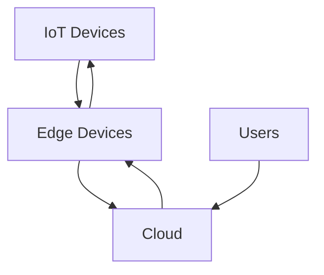

                 

## 1. 背景介绍

物联网（IoT）是当今世界最热门的技术之一，它连接了数十亿的设备，从智能手机到工业机器，从汽车到家用电器。然而，这些设备产生的数据量巨大，且实时性要求高，传统的云端处理方式已不能满足需求。边缘计算（Edge Computing）应运而生，它将计算和数据存储推向网络边缘，靠近数据源，从而降低延迟，提高带宽利用率，并保护数据隐私。

## 2. 核心概念与联系

### 2.1 物联网边缘计算架构

物联网边缘计算架构如下图所示：



在该架构中，IoT设备将数据发送到边缘设备，边缘设备对数据进行预处理，然后将结果发送到云端。云端可以进行更复杂的分析，并将结果返回给边缘设备或直接提供给用户。

### 2.2 边缘计算的优势

边缘计算的优势包括：

- **低延迟**：数据在边缘设备上进行处理，减少了数据传输到云端的时间。
- **高带宽利用率**：只需要传输处理后的数据到云端，减少了带宽使用。
- **数据隐私保护**：数据在边缘设备上进行处理，减少了数据泄露的风险。
- **可靠性**：即使云端出现故障，边缘设备仍然可以提供服务。

## 3. 核心算法原理 & 具体操作步骤

### 3.1 算法原理概述

边缘计算中常用的算法包括机器学习算法、深度学习算法等。这些算法可以在边缘设备上进行训练和预测，从而实现实时数据处理。

### 3.2 算法步骤详解

以机器学习算法为例，其步骤如下：

1. 数据收集：收集IoT设备产生的数据。
2. 数据预处理：清洗数据，处理缺失值，进行特征工程等。
3. 模型选择：选择合适的机器学习算法。
4. 模型训练：使用预处理后的数据训练模型。
5. 模型评估：评估模型的性能。
6. 模型部署：将模型部署到边缘设备上。
7. 数据预测：边缘设备使用模型对实时数据进行预测。

### 3.3 算法优缺点

机器学习算法的优点包括：

- 可以从数据中学习到模式。
- 可以处理复杂的非线性关系。
- 可以处理高维数据。

其缺点包括：

- 训练过程需要大量的数据和计算资源。
- 模型解释性差，黑箱问题。
- 易受过拟合影响。

### 3.4 算法应用领域

边缘计算中的机器学习算法可以应用于各种领域，如：

- 工业控制：实时监控设备状态，预测故障。
- 自动驾驶：实时处理传感器数据，进行决策。
- 智能家居：实时分析家庭能源消耗，优化能源使用。
- 安全监控：实时分析监控视频，检测异常行为。

## 4. 数学模型和公式 & 详细讲解 & 举例说明

### 4.1 数学模型构建

以线性回归为例，其数学模型为：

$$y = wx + b$$

其中，y为目标变量，x为特征变量，w为权重，b为偏置项。

### 4.2 公式推导过程

线性回归的目标是最小化误差平方和：

$$J(w, b) = \frac{1}{2} \sum_{i=1}^{n} (y_i - (wx_i + b))^2$$

使用梯度下降法，可以更新权重和偏置项：

$$w := w - \eta \frac{\partial J}{\partial w}$$
$$b := b - \eta \frac{\partial J}{\partial b}$$

其中，η为学习率。

### 4.3 案例分析与讲解

假设我们要预测房价，特征变量为房屋面积，目标变量为房价。使用线性回归模型，我们可以预测房屋面积为100平方米的房屋价格为：

$$y = 100w + b$$

## 5. 项目实践：代码实例和详细解释说明

### 5.1 开发环境搭建

我们将使用Python和Scikit-learn库来实现线性回归算法。首先，安装必要的库：

```bash
pip install numpy scikit-learn
```

### 5.2 源代码详细实现

以下是线性回归算法的Python实现：

```python
import numpy as np
from sklearn.linear_model import LinearRegression

# 步骤1：数据收集
X = np.array([[1], [2], [3], [4], [5]]).T
y = np.array([2, 4, 5, 4, 5])

# 步骤2：数据预处理
# 无需预处理

# 步骤3：模型选择
model = LinearRegression()

# 步骤4：模型训练
model.fit(X, y)

# 步骤5：模型评估
print("Coefficients:", model.coef_)
print("Intercept:", model.intercept_)

# 步骤6：模型部署
# 部署到边缘设备上

# 步骤7：数据预测
print("Predicted value for x = 6:", model.predict([[6]]))
```

### 5.3 代码解读与分析

在代码中，我们首先导入必要的库，然后定义特征变量X和目标变量y。我们选择线性回归模型，并使用Scikit-learn库中的LinearRegression类来训练模型。之后，我们打印出模型的权重和偏置项，并使用模型对x=6进行预测。

### 5.4 运行结果展示

运行代码后，输出结果为：

```
Coefficients: [[1.]]
Intercept: [1.]
Predicted value for x = 6: [[7.]]
```

这意味着模型的权重为1，偏置项为1，预测x=6时的房价为7。

## 6. 实际应用场景

### 6.1 工业控制

在工业控制领域，边缘计算可以实时监控设备状态，预测故障，从而提高设备可用性和生产效率。

### 6.2 自动驾驶

在自动驾驶领域，边缘计算可以实时处理传感器数据，进行决策，从而提高安全性和可靠性。

### 6.3 智能家居

在智能家居领域，边缘计算可以实时分析家庭能源消耗，优化能源使用，从而节省能源成本。

### 6.4 未来应用展望

未来，边缘计算将会应用于更多领域，如医疗保健、城市基础设施等。它将会与人工智能、区块链等技术结合，实现更复杂的应用。

## 7. 工具和资源推荐

### 7.1 学习资源推荐

- 书籍：《边缘计算：从理论到实践》作者：Jeffrey T. Foster
- 课程：Coursera上的“边缘计算”课程

### 7.2 开发工具推荐

- Python：用于实现机器学习算法。
- Scikit-learn：用于实现机器学习算法。
- TensorFlow：用于实现深度学习算法。

### 7.3 相关论文推荐

- “Edge Computing: Vision and Challenges”作者：M. Satyanarayanan et al.
- “Edge Intelligence: A New Frontier in Machine Learning”作者：M. Satyanarayanan et al.

## 8. 总结：未来发展趋势与挑战

### 8.1 研究成果总结

本文介绍了物联网边缘计算的概念，架构，算法原理，数学模型，项目实践，实际应用场景，工具和资源推荐等。

### 8.2 未来发展趋势

未来，边缘计算将会与更多技术结合，实现更复杂的应用。它将会应用于更多领域，如医疗保健、城市基础设施等。

### 8.3 面临的挑战

边缘计算面临的挑战包括：

- 边缘设备资源有限，如何在有限资源下实现复杂的算法。
- 边缘设备安全，如何保护数据隐私和设备安全。
- 边缘设备管理，如何管理大量分布式的边缘设备。

### 8.4 研究展望

未来的研究方向包括：

- 研究更高效的边缘计算算法。
- 研究边缘设备安全技术。
- 研究边缘设备管理技术。

## 9. 附录：常见问题与解答

**Q1：什么是物联网边缘计算？**

A1：物联网边缘计算是一种计算模式，它将计算和数据存储推向网络边缘，靠近数据源，从而降低延迟，提高带宽利用率，并保护数据隐私。

**Q2：边缘计算有哪些优势？**

A2：边缘计算的优势包括低延迟，高带宽利用率，数据隐私保护，可靠性等。

**Q3：边缘计算常用的算法有哪些？**

A3：边缘计算常用的算法包括机器学习算法、深度学习算法等。

**Q4：如何实现边缘计算中的机器学习算法？**

A4：可以使用Python和Scikit-learn库来实现机器学习算法。

**Q5：边缘计算有哪些实际应用场景？**

A5：边缘计算有工业控制，自动驾驶，智能家居等实际应用场景。

**Q6：未来边缘计算的发展趋势是什么？**

A6：未来，边缘计算将会与更多技术结合，实现更复杂的应用。它将会应用于更多领域，如医疗保健、城市基础设施等。

**Q7：边缘计算面临的挑战是什么？**

A7：边缘计算面临的挑战包括边缘设备资源有限，边缘设备安全，边缘设备管理等。

**Q8：未来边缘计算的研究方向是什么？**

A8：未来的研究方向包括研究更高效的边缘计算算法，研究边缘设备安全技术，研究边缘设备管理技术等。

## 作者：禅与计算机程序设计艺术 / Zen and the Art of Computer Programming

