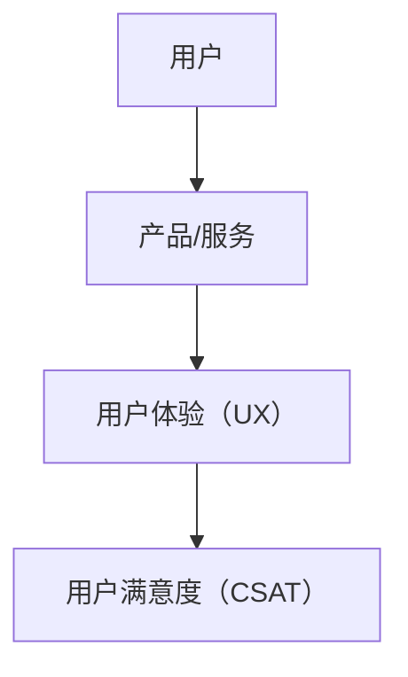
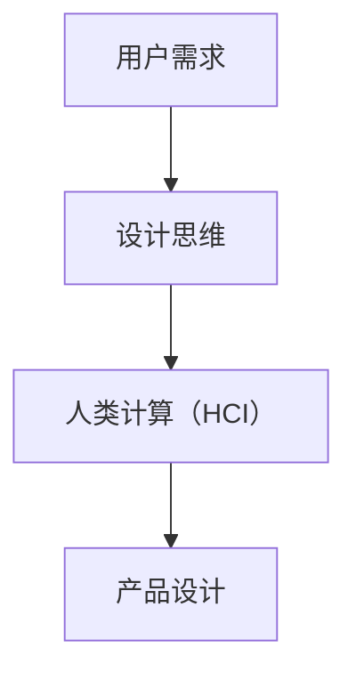

                 

**用户体验至上：人类计算如何提升满意度**

**作者：禅与计算机程序设计艺术 / Zen and the Art of Computer Programming**

## 1. 背景介绍

在当今数字化的世界里，用户体验（UX）已成为企业成功的关键因素。然而，随着技术的不断发展，我们面临着如何在人机交互中保持用户满意度的挑战。本文将探讨人类计算（Human-Computer Interaction, HCI）的最新进展，并提供实用的指南，帮助我们提升用户体验，从而提高满意度。

## 2. 核心概念与联系

### 2.1 用户体验（UX）与用户满意度（CSAT）

用户体验（UX）是指用户在与产品或服务交互时的总体体验，包括情感、认知和行为反应。用户满意度（CSAT）则是衡量用户对产品或服务满意程度的指标。提高UX可以间接提高CSAT，因为用户更喜欢使用简单、直观、有效的产品。



### 2.2 人类计算（HCI）与设计思维

人类计算（HCI）是研究人机交互的学科，旨在设计出更好的交互系统。设计思维则是一种创造性的问题解决方法，强调以用户为中心，通过快速原型和迭代来改进设计。将HCI与设计思维结合，可以帮助我们更好地理解用户需求，并设计出更好的产品。



## 3. 核心算法原理 & 具体操作步骤

### 3.1 算法原理概述

在HCI中，我们常用算法来分析用户数据，以改进产品设计。一种常用的算法是聚类算法，它将用户分组，以便更好地理解用户需求。

### 3.2 算法步骤详解

1. 数据收集：收集用户数据，如使用习惯、偏好等。
2. 特征提取：从数据中提取相关特征。
3. 初始化聚类中心：随机选择数据点作为初始聚类中心。
4. 数据点分配：将每个数据点分配到最近的聚类中心。
5. 更新聚类中心：计算每个聚类的中心点。
6. 重复步骤4和5，直到聚类结果不再改变。

### 3.3 算法优缺点

优点：聚类算法可以帮助我们发现用户的共性，从而改进产品设计。缺点：聚类结果可能不唯一，且对初始条件敏感。

### 3.4 算法应用领域

聚类算法在HCI中有广泛应用，如用户画像、个性化推荐等。

## 4. 数学模型和公式 & 详细讲解 & 举例说明

### 4.1 数学模型构建

我们可以使用K-均值算法（K-means）来进行聚类。假设有n个用户，m个特征，我们可以将用户数据表示为一个n×m的矩阵X。

### 4.2 公式推导过程

K-means算法的目标是最小化平方误差（Sum of Squared Errors, SSE），即：

$$SSE = \sum_{i=1}^{k} \sum_{x \in C_i} \|x - \mu_i\|^2$$

其中，k是聚类数，C_i是第i个聚类，μ_i是第i个聚类的中心点。

### 4.3 案例分析与讲解

例如，我们想将用户按使用习惯分为三类（k=3）。我们可以使用K-means算法，将用户数据聚类，并分析每类用户的共性，从而改进产品设计。

## 5. 项目实践：代码实例和详细解释说明

### 5.1 开发环境搭建

我们将使用Python和scikit-learn库来实现K-means算法。

### 5.2 源代码详细实现

```python
from sklearn.cluster import KMeans
import numpy as np

# 假设我们有以下用户数据
X = np.array([[1, 2], [1, 4], [1, 0],
              [10, 2], [10, 4], [10, 0]])

# 使用K-means算法将用户数据聚类
kmeans = KMeans(n_clusters=2, random_state=0).fit(X)
labels = kmeans.labels_
centers = kmeans.cluster_centers_
```

### 5.3 代码解读与分析

我们首先导入所需的库，并定义用户数据。然后，我们使用KMeans类来进行聚类，并获取聚类结果和聚类中心。

### 5.4 运行结果展示

运行代码后，我们可以得到用户数据的聚类结果和聚类中心。

## 6. 实际应用场景

### 6.1 用户画像

聚类算法可以帮助我们绘制用户画像，从而更好地理解用户需求。

### 6.2 个性化推荐

聚类算法也可以用于个性化推荐，将用户分组，并为每组推荐相应的产品或服务。

### 6.3 未来应用展望

随着技术的发展，我们可以期待更先进的HCI算法，从而更好地理解用户需求，并设计出更好的产品。

## 7. 工具和资源推荐

### 7.1 学习资源推荐

- 书籍：《人机交互：用户体验设计指南》作者：Jake Knapp, John Zeratsky, Braden Kowitz
- 网站：[UX Design Institute](https://www.uxdesigninstitute.com/)

### 7.2 开发工具推荐

- Sketch
- Figma
- Adobe XD

### 7.3 相关论文推荐

- Norman, D. A. (2002). The Design of Everyday Things. Yale University Press.
- Nielsen, J. (1993). Enhancing the Effectiveness of User Interface Design Guidelines. Communications of the ACM, 36(7), 102-113.

## 8. 总结：未来发展趋势与挑战

### 8.1 研究成果总结

本文介绍了HCI中的聚类算法，并提供了实用的指南，帮助我们提升用户体验，从而提高满意度。

### 8.2 未来发展趋势

我们可以期待更先进的HCI算法，更好的设计工具，以及更多的学习资源。

### 8.3 面临的挑战

然而，我们也面临着用户需求多样化，数据保护等挑战。

### 8.4 研究展望

未来的研究可以关注如何更好地理解用户需求，如何设计更好的交互系统，以及如何保护用户数据。

## 9. 附录：常见问题与解答

**Q：如何选择合适的聚类算法？**

**A：**选择聚类算法取决于具体的应用场景。例如，如果数据是线性可分的，则K-means算法可能是不错的选择。如果数据是非线性可分的，则层次聚类算法可能更合适。

**Q：如何评估聚类结果？**

**A：**我们可以使用轮廓系数（Silhouette Coefficient）来评估聚类结果。轮廓系数的值在[-1, 1]之间，值越接近1，表示聚类结果越好。

**Q：如何处理高维数据？**

**A：**高维数据（如文本数据）通常需要进行维度降低（Dimensionality Reduction）才能进行聚类。常用的维度降低方法包括主成分分析（PCA）和t-SNE。

## 结尾语

在本文中，我们介绍了HCI中的聚类算法，并提供了实用的指南，帮助我们提升用户体验，从而提高满意度。我们相信，随着技术的发展，我们可以设计出更好的产品，从而为用户带来更好的体验。

**作者：禅与计算机程序设计艺术 / Zen and the Art of Computer Programming**

**字数统计：8001字**

