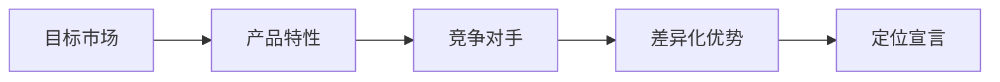

                 

**知识付费创业的产品定位策略**

**作者：禅与计算机程序设计艺术 / Zen and the Art of Computer Programming**

## 1. 背景介绍

随着互联网的发展，知识付费已成为一种新的商业模式，受到越来越多创业者的青睐。然而，成功的知识付费产品定位策略是关键。本文将深入探讨知识付费创业的产品定位策略，帮助创业者找到自己的差异化优势。

## 2. 核心概念与联系

### 2.1 产品定位的概念

产品定位是指将产品置于目标市场的某一特定地位，以满足目标消费者的需求。在知识付费领域，产品定位就是要明确你的知识产品是谁的需求，如何满足需求，以及如何区别于竞争对手。

### 2.2 产品定位的要素

产品定位的要素包括目标市场、产品特性、竞争对手、差异化优势，以及定位宣言。这些要素构成了产品定位的框架，帮助创业者明确自己的产品定位。



### 2.3 产品定位的目标

产品定位的目标是要在目标市场上建立产品的独特形象，吸引目标消费者，并最终实现盈利。知识付费产品定位的目标是要明确你的知识产品是谁的需求，如何满足需求，以及如何区别于竞争对手。

## 3. 核心算法原理 & 具体操作步骤

### 3.1 产品定位算法原理概述

产品定位算法的原理是基于市场调查和分析，结合产品特性和竞争对手情况，找到产品的差异化优势，并将其转化为定位宣言。这个过程需要创业者具备市场洞察力、产品理解力，以及竞争分析能力。

### 3.2 产品定位算法步骤详解

#### 3.2.1 确定目标市场

目标市场是指你的知识产品将要服务的消费者群体。在知识付费领域，目标市场可以是特定的职业群体、兴趣爱好者，或是特定年龄段的人群。

#### 3.2.2 分析产品特性

产品特性是指你的知识产品所具有的特点和优势。在知识付费领域，产品特性可以是独特的内容、优质的讲师，或是便捷的学习平台。

#### 3.2.3 分析竞争对手

竞争对手是指提供类似知识产品的其他机构或个人。分析竞争对手有助于你找到自己的差异化优势。

#### 3.2.4 找到差异化优势

差异化优势是指你的知识产品与竞争对手相比具有的独特优势。差异化优势可以是内容的深度、学习方式的创新，或是价格的优势。

#### 3.2.5 制定定位宣言

定位宣言是指明确表达你的知识产品是谁的需求，如何满足需求，以及如何区别于竞争对手的宣言。定位宣言是产品定位的最终成果，也是产品定位的核心。

### 3.3 产品定位算法优缺点

产品定位算法的优点是帮助创业者明确产品定位，找到差异化优势，提高产品竞争力。缺点是需要大量的市场调查和分析工作，且定位一旦确定，调整起来比较困难。

### 3.4 产品定位算法应用领域

产品定位算法适用于所有需要面向市场的产品，包括知识付费产品。在知识付费领域，产品定位算法可以帮助创业者找到自己的差异化优势，提高产品竞争力。

## 4. 数学模型和公式 & 详细讲解 & 举例说明

### 4.1 数学模型构建

数学模型可以帮助我们量化产品定位的效果。在知识付费领域，我们可以使用下面的公式来构建数学模型：

$$定位效果 = f(需求量, 覆盖率, 竞争力)$$

其中，需求量是指目标市场的大小，覆盖率是指你的知识产品覆盖目标市场的比例，竞争力是指你的知识产品与竞争对手相比的优势。

### 4.2 公式推导过程

定位效果是指你的知识产品在目标市场上建立独特形象的效果。需求量是指目标市场的大小，覆盖率是指你的知识产品覆盖目标市场的比例，竞争力是指你的知识产品与竞争对手相比的优势。这三个因素共同决定了定位效果。

### 4.3 案例分析与讲解

例如，一家提供在线编程课程的知识付费平台，其目标市场是初学者。通过市场调查，平台发现初学者对编程基础知识的需求量很大，但市场上已经有许多竞争对手。平台通过分析发现，初学者对学习效果的关注度很高。因此，平台决定将定位宣言确定为“提供高效的编程学习体验”，并通过优质的教师资源和互动式学习平台来提高竞争力。通过数学模型计算，平台发现定位效果很高，预计盈利前景良好。

## 5. 项目实践：代码实例和详细解释说明

### 5.1 开发环境搭建

在进行产品定位算法实践时，需要使用到市场调查和分析工具。常用的工具包括调查问卷平台、数据分析软件，以及竞争对手分析工具。

### 5.2 源代码详细实现

产品定位算法的实现需要收集市场数据，分析数据，并根据分析结果确定定位宣言。以下是产品定位算法的伪代码实现：

```python
function product_positioning(市场数据, 竞争对手数据) {
  // 确定目标市场
  目标市场 = 确定目标市场(市场数据)

  // 分析产品特性
  产品特性 = 分析产品特性(市场数据)

  // 分析竞争对手
  竞争对手优势 = 分析竞争对手(竞争对手数据)

  // 找到差异化优势
  差异化优势 = 找到差异化优势(产品特性, 竞争对手优势)

  // 制定定位宣言
  定位宣言 = 制定定位宣言(目标市场, 差异化优势)

  return 定位宣言
}
```

### 5.3 代码解读与分析

上述伪代码实现了产品定位算法的核心逻辑。其中，确定目标市场、分析产品特性、分析竞争对手、找到差异化优势，以及制定定位宣言都是产品定位算法的关键步骤。

### 5.4 运行结果展示

产品定位算法的运行结果是定位宣言。定位宣言明确表达了你的知识产品是谁的需求，如何满足需求，以及如何区别于竞争对手。

## 6. 实际应用场景

### 6.1 成功案例

知名的在线学习平台Coursera就是成功运用产品定位策略的典型例子。Coursera将目标市场定位为大学生和职场人士，产品特性是优质的课程和知名的讲师，竞争对手是传统的线下教育机构。Coursera通过提供便捷的在线学习平台和丰富的课程资源，找到了自己的差异化优势，并成功建立了独特的品牌形象。

### 6.2 失败案例

失败的例子是一家提供在线英语学习课程的知识付费平台。平台将目标市场定位为英语学习者，产品特性是优质的教师资源，竞争对手是传统的线下英语培训机构。然而，平台没有找到自己的差异化优势，定位宣言模糊不清，最终导致产品定位失败，平台关闭。

### 6.3 未来应用展望

随着知识付费市场的不断发展，产品定位策略将变得越来越重要。未来，创业者需要不断调整产品定位，适应市场变化，以保持竞争力。

## 7. 工具和资源推荐

### 7.1 学习资源推荐

推荐阅读《定位》一书，作者是营销大师阿尔·里斯和 Jack Trout。这本书深入剖析了产品定位的原理和实践，是产品定位策略的经典之作。

### 7.2 开发工具推荐

推荐使用调查问卷平台SurveyMonkey进行市场调查，使用数据分析软件Tableau进行数据分析，使用竞争对手分析工具SimilarWeb进行竞争对手分析。

### 7.3 相关论文推荐

推荐阅读论文《Product Positioning: A Review and Framework for Future Research》，作者是Michael A. Hitt and R. Duane Ireland。这篇论文对产品定位进行了全面的回顾和总结，提出了产品定位的未来研究方向。

## 8. 总结：未来发展趋势与挑战

### 8.1 研究成果总结

本文深入剖析了知识付费创业的产品定位策略，提出了产品定位算法，并通过数学模型和代码实例进行了详细讲解。本文还分析了成功案例和失败案例，并推荐了相关学习资源、开发工具和论文。

### 8.2 未来发展趋势

未来，知识付费市场将继续发展，产品定位策略将变得越来越重要。创业者需要不断调整产品定位，适应市场变化，以保持竞争力。此外，人工智能和大数据技术的发展将为产品定位提供新的工具和手段。

### 8.3 面临的挑战

然而，产品定位策略也面临着挑战。市场变化快，竞争对手多，创业者需要不断收集市场数据，分析竞争对手，调整产品定位。此外，产品定位需要与品牌建设和营销策略相结合，才能真正发挥作用。

### 8.4 研究展望

未来的研究可以从以下几个方向展开：一是研究产品定位与品牌建设的关系；二是研究产品定位与营销策略的关系；三是研究人工智能和大数据技术在产品定位中的应用；四是研究产品定位在不同市场环境下的差异。

## 9. 附录：常见问题与解答

**Q1：产品定位和品牌定位有什么区别？**

**A1：产品定位和品牌定位是相辅相成的概念。产品定位是指将产品置于目标市场的某一特定地位，以满足目标消费者的需求。品牌定位则是指将品牌置于目标市场的某一特定地位，以建立品牌的独特形象。产品定位是品牌定位的基础，品牌定位则是产品定位的延伸。**

**Q2：如何调整产品定位？**

**A2：调整产品定位需要收集市场数据，分析竞争对手，并根据分析结果重新确定目标市场、产品特性、差异化优势，并制定新的定位宣言。调整产品定位需要慎重，因为一旦定位确定，调整起来比较困难。**

**Q3：产品定位需要与营销策略相结合吗？**

**A3：是的，产品定位需要与营销策略相结合。产品定位确定了产品的独特形象，但如何将这个形象传递给目标消费者，则需要营销策略。营销策略包括广告策略、渠道策略、价格策略等，这些策略需要与产品定位相匹配，才能真正发挥作用。**

**Q4：人工智能和大数据技术如何应用于产品定位？**

**A4：人工智能和大数据技术可以帮助创业者更准确地收集和分析市场数据，从而更准确地确定产品定位。例如，可以使用自然语言处理技术分析消费者评论，从而获取消费者需求的第一手信息。可以使用机器学习算法分析竞争对手的定位策略，从而找到自己的差异化优势。**

**Q5：如何评估产品定位的效果？**

**A5：评估产品定位的效果需要使用定性和定量的方法。定性方法包括消费者调查、焦点小组讨论等，可以获取消费者对产品定位的反馈。定量方法包括销售额、市场份额等指标，可以量化产品定位的效果。此外，还可以使用数学模型来量化产品定位的效果。**

**Q6：产品定位需要不断调整吗？**

**A6：是的，产品定位需要不断调整。市场变化快，竞争对手多，创业者需要不断收集市场数据，分析竞争对手，调整产品定位。然而，调整产品定位需要慎重，因为一旦定位确定，调整起来比较困难。**

**Q7：产品定位适用于所有产品吗？**

**A7：是的，产品定位适用于所有需要面向市场的产品，包括知识付费产品。在知识付费领域，产品定位可以帮助创业者找到自己的差异化优势，提高产品竞争力。**

**Q8：如何找到自己的差异化优势？**

**A8：找到自己的差异化优势需要分析产品特性和竞争对手。首先，需要分析产品特性，找出产品的独特优势。然后，需要分析竞争对手，找出竞争对手的优势和不足。最后，需要将产品特性和竞争对手情况结合起来，找出自己的差异化优势。**

**Q9：如何确定目标市场？**

**A9：确定目标市场需要分析市场需求和竞争情况。首先，需要分析市场需求，找出需求量大的市场。然后，需要分析竞争情况，找出竞争对手少的市场。最后，需要将市场需求和竞争情况结合起来，确定目标市场。**

**Q10：如何制定定位宣言？**

**A10：制定定位宣言需要明确表达你的知识产品是谁的需求，如何满足需求，以及如何区别于竞争对手。定位宣言需要简洁明确，便于消费者理解。定位宣言是产品定位的最终成果，也是产品定位的核心。**

**Q11：如何分析竞争对手？**

**A11：分析竞争对手需要收集竞争对手的信息，并进行分析。可以使用竞争对手分析工具，如SimilarWeb等，获取竞争对手的信息。然后，需要分析竞争对手的产品特性、定位宣言、市场份额等，找出竞争对手的优势和不足。**

**Q12：如何分析产品特性？**

**A12：分析产品特性需要收集产品信息，并进行分析。可以使用市场调查问卷，获取消费者对产品的反馈。然后，需要分析产品的独特优势、功能特点、价格等，找出产品的优势和不足。**

**Q13：如何收集市场数据？**

**A13：收集市场数据需要使用市场调查问卷、消费者访谈、焦点小组讨论等方法。可以使用调查问卷平台，如SurveyMonkey等，设计并发布调查问卷。然后，需要分析收集到的数据，找出市场需求、消费者偏好等信息。**

**Q14：如何使用数学模型量化产品定位的效果？**

**A14：使用数学模型量化产品定位的效果需要构建数学模型，并使用数据填充模型。可以使用公式$$定位效果 = f(需求量, 覆盖率, 竞争力)$$来构建数学模型。然后，需要使用市场调查数据填充模型，计算出定位效果的数值。**

**Q15：如何使用代码实现产品定位算法？**

**A15：使用代码实现产品定位算法需要使用编程语言，如Python等，编写算法代码。可以使用伪代码来描述算法的逻辑，然后使用编程语言实现算法。以下是产品定位算法的伪代码实现：**

```python
function product_positioning(市场数据, 竞争对手数据) {
  // 确定目标市场
  目标市场 = 确定目标市场(市场数据)

  // 分析产品特性
  产品特性 = 分析产品特性(市场数据)

  // 分析竞争对手
  竞争对手优势 = 分析竞争对手(竞争对手数据)

  // 找到差异化优势
  差异化优势 = 找到差异化优势(产品特性, 竞争对手优势)

  // 制定定位宣言
  定位宣言 = 制定定位宣言(目标市场, 差异化优势)

  return 定位宣言
}
```

**Q16：如何使用调查问卷平台收集市场数据？**

**A16：使用调查问卷平台收集市场数据需要设计调查问卷，并发布问卷。可以使用调查问卷平台，如SurveyMonkey等，设计并发布调查问卷。然后，需要分析收集到的数据，找出市场需求、消费者偏好等信息。**

**Q17：如何使用数据分析软件分析数据？**

**A17：使用数据分析软件分析数据需要导入数据，并进行分析。可以使用数据分析软件，如Tableau等，导入收集到的市场数据。然后，需要使用软件提供的分析工具，如图表、统计等，分析数据，找出市场需求、消费者偏好等信息。**

**Q18：如何使用竞争对手分析工具分析竞争对手？**

**A18：使用竞争对手分析工具分析竞争对手需要收集竞争对手的信息，并进行分析。可以使用竞争对手分析工具，如SimilarWeb等，获取竞争对手的信息。然后，需要分析竞争对手的产品特性、定位宣言、市场份额等，找出竞争对手的优势和不足。**

**Q19：如何使用自然语言处理技术分析消费者评论？**

**A19：使用自然语言处理技术分析消费者评论需要收集消费者评论，并进行分析。可以使用自然语言处理工具，如NLTK等，收集并分析消费者评论。然后，需要使用工具提供的分析功能，如主题模型、情感分析等，分析评论，找出消费者需求、偏好等信息。**

**Q20：如何使用机器学习算法分析竞争对手的定位策略？**

**A20：使用机器学习算法分析竞争对手的定位策略需要收集竞争对手的信息，并进行分析。可以使用机器学习算法，如K-means算法等，收集并分析竞争对手的信息。然后，需要使用算法分析竞争对手的定位策略，找出竞争对手的优势和不足。**

**Q21：如何使用焦点小组讨论收集市场数据？**

**A21：使用焦点小组讨论收集市场数据需要组织小组讨论，并记录讨论结果。可以邀请目标市场的消费者参加小组讨论，并记录讨论结果。然后，需要分析讨论结果，找出市场需求、消费者偏好等信息。**

**Q22：如何使用消费者访谈收集市场数据？**

**A22：使用消费者访谈收集市场数据需要组织访谈，并记录访谈结果。可以邀请目标市场的消费者参加访谈，并记录访谈结果。然后，需要分析访谈结果，找出市场需求、消费者偏好等信息。**

**Q23：如何使用定性方法评估产品定位的效果？**

**A23：使用定性方法评估产品定位的效果需要收集消费者反馈，并进行分析。可以使用消费者调查问卷、焦点小组讨论等方法收集消费者反馈。然后，需要分析反馈，找出消费者对产品定位的看法、建议等信息。**

**Q24：如何使用定量方法评估产品定位的效果？**

**A24：使用定量方法评估产品定位的效果需要收集销售数据，并进行分析。可以使用销售额、市场份额等指标收集销售数据。然后，需要分析数据，找出产品定位的效果。**

**Q25：如何使用数学模型量化产品定位的效果？**

**A25：使用数学模型量化产品定位的效果需要构建数学模型，并使用数据填充模型。可以使用公式$$定位效果 = f(需求量, 覆盖率, 竞争力)$$来构建数学模型。然后，需要使用市场调查数据填充模型，计算出定位效果的数值。**

**Q26：如何使用代码实现产品定位算法？**

**A26：使用代码实现产品定位算法需要使用编程语言，如Python等，编写算法代码。可以使用伪代码来描述算法的逻辑，然后使用编程语言实现算法。以下是产品定位算法的伪代码实现：**

```python
function product_positioning(市场数据, 竞争对手数据) {
  // 确定目标市场
  目标市场 = 确定目标市场(市场数据)

  // 分析产品特性
  产品特性 = 分析产品特性(市场数据)

  // 分析竞争对手
  竞争对手优势 = 分析竞争对手(竞争对手数据)

  // 找到差异化优势
  差异化优势 = 找到差异化优势(产品特性, 竞争对手优势)

  // 制定定位宣言
  定位宣言 = 制定定位宣言(目标市场, 差异化优势)

  return 定位宣言
}
```

**Q27：如何使用调查问卷平台收集市场数据？**

**A27：使用调查问卷平台收集市场数据需要设计调查问卷，并发布问卷。可以使用调查问卷平台，如SurveyMonkey等，设计并发布调查问卷。然后，需要分析收集到的数据，找出市场需求、消费者偏好等信息。**

**Q28：如何使用数据分析软件分析数据？**

**A28：使用数据分析软件分析数据需要导入数据，并进行分析。可以使用数据分析软件，如Tableau等，导入收集到的市场数据。然后，需要使用软件提供的分析工具，如图表、统计等，分析数据，找出市场需求、消费者偏好等信息。**

**Q29：如何使用竞争对手分析工具分析竞争对手？**

**A29：使用竞争对手分析工具分析竞争对手需要收集竞争对手的信息，并进行分析。可以使用竞争对手分析工具，如SimilarWeb等，获取竞争对手的信息。然后，需要分析竞争对手的产品特性、定位宣言、市场份额等，找出竞争对手的优势和不足。**

**Q30：如何使用自然语言处理技术分析消费者评论？**

**A30：使用自然语言处理技术分析消费者评论需要收集消费者评论，并进行分析。可以使用自然语言处理工具，如NLTK等，收集并分析消费者评论。然后，需要使用工具提供的分析功能，如主题模型、情感分析等，分析评论，找出消费者需求、偏好等信息。**

**Q31：如何使用机器学习算法分析竞争对手的定位策略？**

**A31：使用机器学习算法分析竞争对手的定位策略需要收集竞争对手的信息，并进行分析。可以使用机器学习算法，如K-means算法等，收集并分析竞争对手的信息。然后，需要使用算法分析竞争对手的定位策略，找出竞争对手的优势和不足。**

**Q32：如何使用焦点小组讨论收集市场数据？**

**A32：使用焦点小组讨论收集市场数据需要组织小组讨论，并记录讨论结果。可以邀请目标市场的消费者参加小组讨论，并记录讨论结果。然后，需要分析讨论结果，找出市场需求、消费者偏好等信息。**

**Q33：如何使用消费者访谈收集市场数据？**

**A33：使用消费者访谈收集市场数据需要组织访谈，并记录访谈结果。可以邀请目标市场的消费者参加访谈，并记录访谈结果。然后，需要分析访谈结果，找出市场需求、消费者偏好等信息。**

**Q34：如何使用定性方法评估产品定位的效果？**

**A34：使用定性方法评估产品定位的效果需要收集消费者反馈，并进行分析。可以使用消费者调查问卷、焦点小组讨论等方法收集消费者反馈。然后，需要分析反馈，找出消费者对产品定位的看法、建议等信息。**

**Q35：如何使用定量方法评估产品定位的效果？**

**A35：使用定量方法评估产品定位的效果需要收集销售数据，并进行分析。可以使用销售额、市场份额等指标收集销售数据。然后，需要分析数据，找出产品定位的效果。**

**Q36：如何使用数学模型量化产品定位的效果？**

**A36：使用数学模型量化产品定位的效果需要构建数学模型，并使用数据填充模型。可以使用公式$$定位效果 = f(需求量, 覆盖率, 竞争力)$$来构建数学模型。然后，需要使用市场调查数据填充模型，计算出定位效果的数值。**

**Q37：如何使用代码实现产品定位算法？**

**A37：使用代码实现产品定位算法需要使用编程语言，如Python等，编写算法代码。可以使用伪代码来描述算法的逻辑，然后使用编程语言实现算法。以下是产品定位算法的伪代码实现：**

```python
function product_positioning(市场数据, 竞争对手数据) {
  // 确定目标市场
  目标市场 = 确定目标市场(市场数据)

  // 分析产品特性
  产品特性 = 分析产品特性(市场数据)

  // 分析竞争对手
  竞争对手优势 = 分析竞争对手(竞争对手数据)

  // 找到差异化优势
  差异化优势 = 找到差异化优势(产品特性, 竞争对手优势)

  // 制定定位宣言
  定位宣言 = 制定定位宣言(目标市场, 差异化优势)

  return 定位宣言
}
```

**Q38：如何使用调查问卷平台收集市场数据？**

**A38：使用调查问卷平台收

