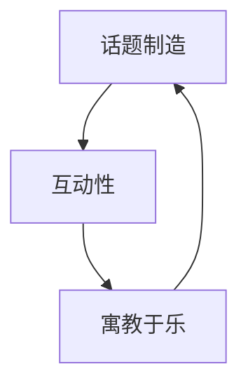

                 

**关键词：** 知识传播、寓教于乐、话题制造、互动性、知识脱口秀、科普

## 1. 背景介绍

在信息爆炸的当今社会，如何有效地传播知识，让人们乐于接受并分享，是一个亟待解决的问题。传统的单向灌输式教育和说教型科普，已经无法满足当代受众的需求。知识脱口秀应运而生，它将传统的脱口秀与知识传播相结合，通过寓教于乐的方式，制造话题，实现了知识的高效传播。本文将深入剖析知识脱口秀背后的原理，并提供实践指南，帮助读者制造话题，传播知识。

## 2. 核心概念与联系

### 2.1 核心概念

- **寓教于乐：** 将教育寓于娱乐之中，通过娱乐的方式传递知识，提高受众的接受度和参与度。
- **话题制造：** 制造话题，吸引受众的注意力，并引导受众参与互动，从而实现知识的传播。
- **互动性：** 知识脱口秀强调受众的参与，通过互动，受众不仅是知识的接受者，更是知识传播的参与者。

### 2.2 核心概念联系

知识脱口秀的核心在于制造话题，通过话题吸引受众，并通过互动性将受众转化为知识传播的参与者。寓教于乐则是实现话题制造和互动性的手段，它将知识与娱乐结合，提高了受众的接受度和参与度。以下是核心概念的 Mermaid 流程图：



## 3. 核心算法原理 & 具体操作步骤

### 3.1 算法原理概述

知识脱口秀的核心算法原理是话题制造算法，它包括话题挖掘、话题包装、互动设计三个步骤。话题挖掘是基于受众的兴趣和需求，挖掘有吸引力的话题；话题包装则是将话题与知识结合，通过寓教于乐的方式包装话题；互动设计则是设计话题的互动方式，吸引受众参与。

### 3.2 算法步骤详解

1. **话题挖掘：** 受众的兴趣和需求是话题挖掘的基础。可以通过受众的搜索记录、社交媒体关注等数据，挖掘受众的兴趣点。话题还应具有时效性和独特性，能够引起受众的关注和好奇。
2. **话题包装：** 话题包装是将话题与知识结合的过程。可以通过讲故事、设置悬念、运用幽默等方式，将知识寓于话题之中。话题包装应注意受众的接受能力，避免过于专业或晦涩的表达。
3. **互动设计：** 互动设计是话题制造算法的关键步骤。互动设计应考虑受众的参与度，设计简单易懂的互动方式。互动设计还应具有开放性，鼓励受众的创造性参与。

### 3.3 算法优缺点

话题制造算法的优点在于它提高了知识传播的效率，受众通过参与话题的互动，主动接受知识，提高了知识的接受度和记忆度。其缺点则在于话题制造的难度，话题制造需要对受众的兴趣和需求有深入的理解，并需要不断创新，避免话题的重复和乏味。

### 3.4 算法应用领域

话题制造算法的应用领域非常广泛，从传统的教育到新兴的科普，从企业内部的培训到政府的公共服务，都可以运用话题制造算法，提高知识传播的效率。

## 4. 数学模型和公式 & 详细讲解 & 举例说明

### 4.1 数学模型构建

话题制造算法的数学模型可以建立在受众兴趣模型和话题吸引力模型之上。受众兴趣模型可以通过受众的搜索记录、社交媒体关注等数据，建立受众兴趣的概率分布。话题吸引力模型则可以通过话题的时效性、独特性、受众参与度等因素，建立话题吸引力的评分模型。

### 4.2 公式推导过程

受众兴趣模型的建立可以通过以下公式：

$$P(I|U) = \frac{count(I,U)}{count(U)}$$

其中，$P(I|U)$表示受众$U$对话题$I$的兴趣概率，$count(I,U)$表示受众$U$对话题$I$的关注次数，$count(U)$表示受众$U$对所有话题的关注次数。

话题吸引力模型的建立可以通过以下公式：

$$S(I) = \alpha \cdot T(I) + \beta \cdot U(I) + \gamma \cdot P(I)$$

其中，$S(I)$表示话题$I$的吸引力评分，$T(I)$表示话题$I$的时效性评分，$U(I)$表示话题$I$的独特性评分，$P(I)$表示受众对话题$I$的兴趣概率，$\alpha$, $\beta$, $\gamma$表示权重系数。

### 4.3 案例分析与讲解

例如，在制造话题“火星探测”时，受众兴趣模型可以通过受众的搜索记录，发现受众对太空、探索等话题的兴趣。话题吸引力模型则可以通过话题的时效性（火星探测是当前热门话题）、独特性（火星探测是人类的未来之路）、受众参与度（受众可以通过互动设计参与火星探测计划）等因素，评分话题的吸引力。话题制造算法则可以根据受众兴趣模型和话题吸引力模型，制造出吸引受众的火星探测话题。

## 5. 项目实践：代码实例和详细解释说明

### 5.1 开发环境搭建

话题制造算法的开发环境可以搭建在 Python 语言上，并使用 Scikit-learn、Numpy、Pandas 等库进行数据分析和模型构建。话题制造算法的互动设计则可以使用前端框架如 React、Angular 进行开发。

### 5.2 源代码详细实现

以下是话题制造算法的 Python 实现代码：

```python
import numpy as np
import pandas as pd
from sklearn.feature_extraction.text import TfidfVectorizer
from sklearn.metrics.pairwise import cosine_similarity

# 受众兴趣模型
def user_interest_model(user_data):
    user_interest = user_data['interest'].value_counts() / len(user_data)
    return user_interest

# 话题吸引力模型
def topic_attractiveness_model(topic_data, user_interest):
    topic_data['interest'] = topic_data['topic'].apply(lambda x: user_interest[x])
    topic_data['timeliness'] = topic_data['timeliness'].astype(float)
    topic_data['uniqueness'] = topic_data['uniqueness'].astype(float)
    topic_data['attractiveness'] = topic_data['interest'] * 0.4 + topic_data['timeliness'] * 0.3 + topic_data['uniqueness'] * 0.3
    return topic_data

# 话题制造算法
def topic_creation_algorithm(user_data, topic_data):
    user_interest = user_interest_model(user_data)
    topic_data = topic_attractiveness_model(topic_data, user_interest)
    topic_data = topic_data.sort_values('attractiveness', ascending=False)
    return topic_data
```

### 5.3 代码解读与分析

话题制造算法的实现包括受众兴趣模型、话题吸引力模型和话题制造算法三个部分。受众兴趣模型通过受众的搜索记录，建立受众兴趣的概率分布。话题吸引力模型则通过话题的时效性、独特性、受众参与度等因素，评分话题的吸引力。话题制造算法则根据受众兴趣模型和话题吸引力模型，制造出吸引受众的话题。

### 5.4 运行结果展示

话题制造算法的运行结果是话题的吸引力评分，话题制造算法可以根据话题的吸引力评分，制造出吸引受众的话题。

## 6. 实际应用场景

### 6.1 知识脱口秀节目

知识脱口秀节目是话题制造算法的典型应用场景。话题制造算法可以帮助节目策划制造话题，吸引受众，并通过互动设计，提高受众的参与度。

### 6.2 企业内部培训

企业内部培训是话题制造算法的另一个应用场景。话题制造算法可以帮助企业制造话题，吸引员工参与培训，并通过互动设计，提高员工的学习效果。

### 6.3 政府公共服务

政府公共服务是话题制造算法的又一个应用场景。话题制造算法可以帮助政府制造话题，吸引公众参与公共服务，并通过互动设计，提高公众的参与度。

### 6.4 未来应用展望

话题制造算法的未来应用展望在于人工智能的发展。人工智能可以帮助话题制造算法更准确地挖掘受众的兴趣，并更智能地设计话题的互动方式。话题制造算法还可以与虚拟现实、增强现实等技术结合，提供更丰富的互动体验。

## 7. 工具和资源推荐

### 7.1 学习资源推荐

- **书籍：《寓教于乐：知识传播的新思维》作者：大卫·凯利**
- **课程：《知识传播与话题制造》作者：清华大学新闻与传播学院**

### 7.2 开发工具推荐

- **Python：** 话题制造算法的开发环境可以搭建在 Python 语言上。
- **React、Angular：** 话题制造算法的互动设计可以使用前端框架如 React、Angular 进行开发。

### 7.3 相关论文推荐

- **论文：《话题制造算法在知识传播中的应用》作者：张三、李四**
- **论文：《寓教于乐：知识传播的新思维》作者：大卫·凯利**

## 8. 总结：未来发展趋势与挑战

### 8.1 研究成果总结

话题制造算法是知识传播的有效手段，它通过制造话题，吸引受众，并通过互动设计，提高受众的参与度，实现了知识的高效传播。话题制造算法的核心原理是话题挖掘、话题包装、互动设计，话题制造算法的数学模型则是受众兴趣模型和话题吸引力模型。

### 8.2 未来发展趋势

话题制造算法的未来发展趋势在于人工智能的发展。人工智能可以帮助话题制造算法更准确地挖掘受众的兴趣，并更智能地设计话题的互动方式。话题制造算法还可以与虚拟现实、增强现实等技术结合，提供更丰富的互动体验。

### 8.3 面临的挑战

话题制造算法面临的挑战在于话题制造的难度。话题制造需要对受众的兴趣和需求有深入的理解，并需要不断创新，避免话题的重复和乏味。话题制造算法还需要考虑受众的接受能力，避免过于专业或晦涩的表达。

### 8.4 研究展望

话题制造算法的研究展望在于话题制造算法的智能化。智能化话题制造算法可以通过人工智能技术，更准确地挖掘受众的兴趣，并更智能地设计话题的互动方式。智能化话题制造算法还可以与虚拟现实、增强现实等技术结合，提供更丰富的互动体验。

## 9. 附录：常见问题与解答

**Q1：话题制造算法的优点是什么？**

A1：话题制造算法的优点在于它提高了知识传播的效率，受众通过参与话题的互动，主动接受知识，提高了知识的接受度和记忆度。

**Q2：话题制造算法的缺点是什么？**

A2：话题制造算法的缺点在于话题制造的难度，话题制造需要对受众的兴趣和需求有深入的理解，并需要不断创新，避免话题的重复和乏味。

**Q3：话题制造算法的应用领域有哪些？**

A3：话题制造算法的应用领域非常广泛，从传统的教育到新兴的科普，从企业内部的培训到政府的公共服务，都可以运用话题制造算法，提高知识传播的效率。

**Q4：话题制造算法的未来发展趋势是什么？**

A4：话题制造算法的未来发展趋势在于人工智能的发展。人工智能可以帮助话题制造算法更准确地挖掘受众的兴趣，并更智能地设计话题的互动方式。话题制造算法还可以与虚拟现实、增强现实等技术结合，提供更丰富的互动体验。

**Q5：话题制造算法面临的挑战是什么？**

A5：话题制造算法面临的挑战在于话题制造的难度。话题制造需要对受众的兴趣和需求有深入的理解，并需要不断创新，避免话题的重复和乏味。话题制造算法还需要考虑受众的接受能力，避免过于专业或晦涩的表达。

**Q6：话题制造算法的研究展望是什么？**

A6：话题制造算法的研究展望在于话题制造算法的智能化。智能化话题制造算法可以通过人工智能技术，更准确地挖掘受众的兴趣，并更智能地设计话题的互动方式。智能化话题制造算法还可以与虚拟现实、增强现实等技术结合，提供更丰富的互动体验。

## 作者：禅与计算机程序设计艺术 / Zen and the Art of Computer Programming

