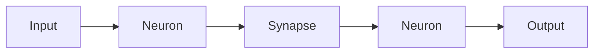

                 

**神经形态计算在边缘设备中的应用：低功耗AI处理**

**作者：禅与计算机程序设计艺术 / Zen and the Art of Computer Programming**

## 1. 背景介绍

随着物联网（IoT）的兴起，边缘设备（如传感器、单板电脑、小型机器人等）的数量迅速增加。这些设备需要处理大量数据，并进行实时决策，但它们往往功耗有限，计算能力有限。神经形态计算（Neuromorphic Computing）是一种模拟人脑结构和功能的计算方式，具有低功耗、高并发、高效能的特点，在边缘设备中的应用具有广阔前景。

## 2. 核心概念与联系

神经形态计算的核心是模拟神经元（Neuron）和突触（Synapse）的结构和功能。神经元接收输入信号，进行处理，并输出信号；突触连接神经元，并调节信号传递的强度。神经元和突触组成神经网络，实现复杂的计算任务。



神经形态计算与传统冯·诺伊曼架构的计算机不同，它使用事件驱动（Event-driven）而不是时钟驱动（Clock-driven），这使其更适合处理非均匀、突发的数据流。

## 3. 核心算法原理 & 具体操作步骤

### 3.1 算法原理概述

神经形态计算的核心算法是模拟神经元的信号传递和突触的权重调整。神经元接收输入信号后，根据其权重和阈值，产生输出信号。突触根据输出信号调整其权重，实现学习和记忆功能。

### 3.2 算法步骤详解

1. 初始化神经元和突触的权重。
2. 将输入数据传递给神经元。
3. 神经元根据其权重和阈值，产生输出信号。
4. 突触根据输出信号调整其权重。
5. 重复步骤2-4，直到网络收敛或达到预定目标。

### 3.3 算法优缺点

优点：低功耗、高并发、高效能、适合处理非均匀、突发的数据流。

缺点：当前的神经形态芯片性能有限，软件生态系统不成熟，调试和开发困难。

### 3.4 算法应用领域

神经形态计算在边缘设备中的应用包括：实时视频分析、语音识别、传感器数据处理、机器人控制等。

## 4. 数学模型和公式 & 详细讲解 & 举例说明

### 4.1 数学模型构建

神经元的信号传递可以用以下公式表示：

$$y = f(\sum_{i=1}^{n} w_i x_i - b)$$

其中，$y$是输出信号，$x_i$是输入信号，$w_i$是权重，$b$是阈值，$f$是激活函数。

### 4.2 公式推导过程

神经元接收输入信号后，将其与权重相乘，求和，并减去阈值，得到一个值。这个值通过激活函数（如sigmoid、ReLU等）转换为输出信号。

### 4.3 案例分析与讲解

例如，在图像分类任务中，输入是图像特征向量，$x_i$是向量的第$i$个元素，$w_i$是神经元的权重，$b$是阈值。神经元输出$y$表示图像属于某一类的概率。通过训练调整权重和阈值，网络可以学习图像特征，并进行准确的分类。

## 5. 项目实践：代码实例和详细解释说明

### 5.1 开发环境搭建

神经形态计算的开发环境包括神经形态芯片（如Intel Loihi、SpiNNaker等）或模拟器（如NEST、Brian2等），以及相关的编程接口和库。

### 5.2 源代码详细实现

以下是一个简单的神经元模型的Python代码实现：

```python
import numpy as np

class Neuron:
    def __init__(self, w, b, f):
        self.w = w
        self.b = b
        self.f = f

    def forward(self, x):
        y = np.dot(self.w, x) - self.b
        return self.f(y)
```

### 5.3 代码解读与分析

`Neuron`类初始化时，接受权重`w`、阈值`b`和激活函数`f`作为参数。`forward`方法接受输入`x`，计算输出`y`，并返回`y`。

### 5.4 运行结果展示

以下是一个简单的示例，创建一个神经元，并测试其输出：

```python
w = np.array([1, 2, 3])
b = 1
f = lambda x: 1 / (1 + np.exp(-x))

neuron = Neuron(w, b, f)
x = np.array([1, 2, 3])
print(neuron.forward(x))  # Output: 0.9525741268224332
```

## 6. 实际应用场景

### 6.1 当前应用

神经形态计算已经在一些边缘设备中得到应用，如Intel Loihi芯片在无人机视频分析中的应用，SpiNNaker芯片在机器人控制中的应用。

### 6.2 未来应用展望

随着神经形态芯片性能的提高和软件生态系统的成熟，神经形态计算在边缘设备中的应用将会更加广泛，如实时语音识别、自动驾驶、智能家居等。

## 7. 工具和资源推荐

### 7.1 学习资源推荐

- 书籍：《神经形态计算：原理与应用》作者：Carver Mead
- 课程：Coursera上的“Neuromorphic Computing and Engineering”课程

### 7.2 开发工具推荐

- Intel Loihi开发套件
- SpiNNaker开发套件
- NEST模拟器
- Brian2模拟器

### 7.3 相关论文推荐

- “Loihi: A Neuromorphic Manycore Processor with On-Chip Spiking Neural Network Accelerators”作者：Intel Labs
- “SpiNNaker: A massively parallel neuromorphic system”作者：SpiNNaker Team

## 8. 总结：未来发展趋势与挑战

### 8.1 研究成果总结

神经形态计算在边缘设备中的应用已经取得了显著成果，但仍面临许多挑战。

### 8.2 未来发展趋势

未来，神经形态计算将会更加广泛地应用于边缘设备，并与传统计算机结合，实现更高效能的计算。

### 8.3 面临的挑战

挑战包括神经形态芯片性能的提高、软件生态系统的成熟、调试和开发的困难等。

### 8.4 研究展望

未来的研究将会集中在神经形态芯片的设计、神经形态算法的开发、神经形态计算与传统计算机的结合等方面。

## 9. 附录：常见问题与解答

**Q：神经形态计算与传统计算机有何不同？**

**A：**神经形态计算模拟人脑结构和功能，使用事件驱动而不是时钟驱动，具有低功耗、高并发、高效能的特点。传统计算机使用冯·诺伊曼架构，使用时钟驱动，具有高功耗、低并发、高效能的特点。

**Q：神经形态计算在边缘设备中的优势是什么？**

**A：**神经形态计算在边缘设备中的优势包括低功耗、高并发、高效能、适合处理非均匀、突发的数据流等。

**Q：神经形态计算的挑战是什么？**

**A：**神经形态计算的挑战包括神经形态芯片性能的提高、软件生态系统的成熟、调试和开发的困难等。

**Q：神经形态计算的未来发展趋势是什么？**

**A：**未来，神经形态计算将会更加广泛地应用于边缘设备，并与传统计算机结合，实现更高效能的计算。

**Q：如何开始学习神经形态计算？**

**A：**开始学习神经形态计算可以从阅读相关书籍、参加相关课程、使用相关开发工具和模拟器等入手。

**Q：神经形态计算的应用领域是什么？**

**A：**神经形态计算的应用领域包括实时视频分析、语音识别、传感器数据处理、机器人控制等。

**Q：神经形态计算与深度学习有何关系？**

**A：**神经形态计算和深度学习都是模拟人脑结构和功能的计算方式，但神经形态计算更侧重于模拟神经元和突触的结构和功能，而深度学习更侧重于模拟神经网络的结构和功能。两者可以结合，实现更高效能的计算。

**Q：神经形态计算的未来研究方向是什么？**

**A：**未来的研究将会集中在神经形态芯片的设计、神经形态算法的开发、神经形态计算与传统计算机的结合等方面。

**Q：如何评估神经形态计算的性能？**

**A：**评估神经形态计算的性能可以使用功耗、时延、准确率等指标。功耗和时延是神经形态计算的关键指标，准确率是神经形态计算的重要指标之一。

**Q：神经形态计算的软件生态系统当前如何？**

**A：**当前，神经形态计算的软件生态系统还不成熟，但正在迅速发展。已经有

