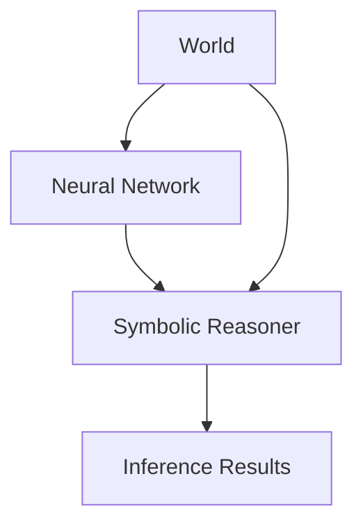

                 

- **神经符号系统 (Neural-Symbolic Systems)**
- **符号推理 (Symbolic Reasoning)**
- **神经网络 (Neural Networks)**
- **知识表示 (Knowledge Representation)**
- **逻辑推理 (Logical Inference)**
- **神经符号模型 (Neuro-Symbolic Models)**
- **联合推理 (Joint Inference)**

## 1. 背景介绍

在人工智能 (AI) 的发展历程中，神经网络 (NN) 和符号推理 (SR) 两大主要范式各有优缺点。神经网络在模式识别和预测任务上表现出色，但缺乏对世界的理解和对知识的推理能力。相比之下，符号推理则擅长处理逻辑推理和知识表示，但缺乏对模式和结构的学习能力。神经符号AI (Neuro-Symbolic AI) 正是为了弥合这两大范式的差距而诞生的，它结合神经网络和符号推理的优势，旨在构建更强大、更智能的智能系统。

## 2. 核心概念与联系

神经符号系统 (Neural-Symbolic Systems) 的核心概念是将神经网络和符号推理结合起来，构建联合推理 (Joint Inference) 框架。这种框架允许神经网络学习表示世界的模式和结构，同时符号推理系统则负责推理和解释这些表示。下图是神经符号系统的架构 Mermaid 流程图：



在神经符号系统中，神经网络学习表示世界的模式和结构，并将其表示为符号推理系统可以理解的形式。符号推理系统则使用这些表示进行推理，并生成解释世界的结果。世界也可以直接影响符号推理系统，从而调整推理过程。

## 3. 核心算法原理 & 具体操作步骤

### 3.1 算法原理概述

神经符号模型 (Neuro-Symbolic Models) 的核心原理是将神经网络的表示与符号推理系统的推理结合起来。神经网络学习表示世界的模式和结构，并将其表示为符号推理系统可以理解的形式。符号推理系统则使用这些表示进行推理，并生成解释世界的结果。

### 3.2 算法步骤详解

1. **表示学习 (Representation Learning)**：神经网络学习表示世界的模式和结构，并将其表示为符号推理系统可以理解的形式。这通常涉及到知识表示 (Knowledge Representation) 技术，如概念网络 (Conceptual Networks) 和逻辑表达式 (Logical Expressions)。
2. **推理 (Inference)**：符号推理系统使用这些表示进行推理，并生成解释世界的结果。这通常涉及到逻辑推理 (Logical Inference) 技术，如前向链接 (Forward Chaining) 和后向链接 (Backward Chaining)。
3. **联合推理 (Joint Inference)**：神经网络和符号推理系统协同工作，不断调整表示和推理，直到生成满意的结果。这通常涉及到优化技术，如梯度下降 (Gradient Descent) 和模拟退火 (Simulated Annealing)。

### 3.3 算法优缺点

**优点**：

* 结合了神经网络和符号推理的优势，可以处理更广泛的任务。
* 可以学习表示世界的模式和结构，同时也可以推理和解释这些表示。
* 可以处理不确定性和模糊性，因为神经网络可以学习表示不确定性，符号推理系统则可以处理模糊性。

**缺点**：

* 更复杂的架构和算法，需要更多的资源和时间。
* 需要设计和调整神经网络和符号推理系统之间的接口。
* 可能会面临神经网络和符号推理系统之间的信息流问题。

### 3.4 算法应用领域

神经符号AI 的应用领域非常广泛，包括：

* **知识图谱 (Knowledge Graphs)**：神经符号系统可以学习表示知识图谱的模式和结构，并进行推理和解释。
* **自然语言处理 (Natural Language Processing)**：神经符号系统可以学习表示语言的模式和结构，并进行推理和解释。
* **计算机视觉 (Computer Vision)**：神经符号系统可以学习表示视觉模式和结构，并进行推理和解释。
* **自动规划 (Automated Planning)**：神经符号系统可以学习表示规划任务的模式和结构，并进行推理和解释。

## 4. 数学模型和公式 & 详细讲解 & 举例说明

### 4.1 数学模型构建

神经符号模型的数学模型通常涉及到神经网络和符号推理系统的数学模型。神经网络的数学模型通常是一种非线性函数，如：

$$y = f(x; \theta)$$

其中，$x$ 是输入，$y$ 是输出，$\theta$ 是模型的参数。符号推理系统的数学模型通常是一种逻辑表达式，如：

$$P \Rightarrow Q$$

其中，$P$ 和$Q$ 是逻辑表达式。

### 4.2 公式推导过程

神经符号模型的公式推导过程通常涉及到神经网络和符号推理系统的公式推导过程。神经网络的公式推导过程通常涉及到优化技术，如梯度下降：

$$\theta_{t+1} = \theta_t - \eta \nabla L(\theta_t)$$

其中，$\eta$ 是学习率，$L(\theta_t)$ 是损失函数。符号推理系统的公式推导过程通常涉及到逻辑推理技术，如前向链接：

$$P \wedge (P \Rightarrow Q) \Rightarrow Q$$

### 4.3 案例分析与讲解

例如，在知识图谱中，神经符号系统可以学习表示实体和关系的模式和结构，并进行推理和解释。假设我们有以下知识图谱：

* 实体：`Socrates`, `Plato`, `Aristotle`
* 关系：`TeacherOf`, `StudentOf`

神经网络可以学习表示这些实体和关系的模式和结构，并将其表示为符号推理系统可以理解的形式，如：

* `Socrates` is a `Person`
* `Plato` is a `Person` and `StudentOf` `Socrates`
* `Aristotle` is a `Person` and `StudentOf` `Plato`

符号推理系统则可以使用这些表示进行推理，并生成解释世界的结果，如：

* `Plato` is a `StudentOf` `Socrates`
* `Aristotle` is a `StudentOf` `Plato`

## 5. 项目实践：代码实例和详细解释说明

### 5.1 开发环境搭建

要实现神经符号模型，我们需要以下开发环境：

* Python 3.7 及以上版本
* TensorFlow 2.0 及以上版本
* PyDatalog 1.0 及以上版本

### 5.2 源代码详细实现

以下是一个简单的神经符号模型的 Python 实现：

```python
import tensorflow as tf
import py_datalog

# 定义神经网络模型
model = tf.keras.Sequential([
    tf.keras.layers.Dense(64, activation='relu', input_shape=(100,)),
    tf.keras.layers.Dense(10, activation='softmax')
])

# 编译神经网络模型
model.compile(optimizer='adam',
              loss='sparse_categorical_crossentropy',
              metrics=['accuracy'])

# 定义符号推理系统
py_datalog.create_knowledge_base()

# 定义事实
py_datalog.assert_fact('parent', 'John', 'Mary')
py_datalog.assert_fact('parent', 'John', 'Mark')
py_datalog.assert_fact('parent', 'Mary', 'Lucy')

# 定义规则
py_datalog.assert_rule('sibling', 'X', 'Y', 'Z', 'parent', 'X', 'Z', 'parent', 'Y', 'Z')

# 进行推理
py_datalog.query('sibling', 'X', 'Y', 'Z')
```

### 5.3 代码解读与分析

在上述代码中，我们首先定义了一个简单的神经网络模型，并进行了编译。然后，我们使用 PyDatalog 定义了一个符号推理系统，并定义了一些事实和规则。最后，我们使用 PyDatalog 的查询功能进行推理。

### 5.4 运行结果展示

运行上述代码后，我们可以看到神经网络模型的训练结果，以及符号推理系统的推理结果。例如，我们可以看到符号推理系统推理出 `Mary` 和 `Mark` 是 `Lucy` 的 siblings。

## 6. 实际应用场景

神经符号AI 的实际应用场景非常广泛，包括：

### 6.1 知识图谱

神经符号系统可以学习表示知识图谱的模式和结构，并进行推理和解释。例如，在医疗领域，神经符号系统可以学习表示疾病和症状的模式和结构，并进行推理和解释，从而帮助医生诊断疾病。

### 6.2 自然语言处理

神经符号系统可以学习表示语言的模式和结构，并进行推理和解释。例如，在客服领域，神经符号系统可以学习表示客户的意图和需求的模式和结构，并进行推理和解释，从而帮助客服人员更好地理解和响应客户的需求。

### 6.3 计算机视觉

神经符号系统可以学习表示视觉模式和结构，并进行推理和解释。例如，在安防领域，神经符号系统可以学习表示视频中的模式和结构，并进行推理和解释，从而帮助安防人员更好地监控和保护安全。

### 6.4 未来应用展望

未来，神经符号AI 的应用领域将会更加广泛，包括自动驾驶、机器人、人工智能助手等。神经符号系统可以学习表示这些领域的模式和结构，并进行推理和解释，从而帮助这些系统更好地理解和响应世界。

## 7. 工具和资源推荐

### 7.1 学习资源推荐

* **书籍**：《神经符号系统：结合神经网络和符号推理》作者：John L. Hopfield
* **在线课程**：《神经符号系统》作者：Stanford University
* **论文**：《神经符号系统：一种结合神经网络和符号推理的新方法》作者：Yann LeCun, Yoshua Bengio, Geoffrey Hinton

### 7.2 开发工具推荐

* **神经网络开发工具**：TensorFlow, PyTorch, Keras
* **符号推理开发工具**：PyDatalog, Prolog, Answer Set Programming

### 7.3 相关论文推荐

* **神经符号系统的最新进展**：《神经符号系统：一种结合神经网络和符号推理的新方法》作者：Yann LeCun, Yoshua Bengio, Geoffrey Hinton
* **神经符号系统在知识图谱中的应用**：《神经符号系统在知识图谱中的应用》作者：Thanh-Tung Nguyen, et al.
* **神经符号系统在自然语言处理中的应用**：《神经符号系统在自然语言处理中的应用》作者：Xiang Lisa Li, et al.

## 8. 总结：未来发展趋势与挑战

### 8.1 研究成果总结

神经符号AI 结合了神经网络和符号推理的优势，可以处理更广泛的任务，并学习表示世界的模式和结构。神经符号系统在知识图谱、自然语言处理、计算机视觉等领域取得了显著的成果。

### 8.2 未来发展趋势

未来，神经符号AI 的发展趋势将会是：

* **更强大的神经网络模型**：神经网络模型将会变得更强大，可以学习表示更复杂的模式和结构。
* **更智能的符号推理系统**：符号推理系统将会变得更智能，可以推理和解释更复杂的表示。
* **更广泛的应用领域**：神经符号系统将会应用于更广泛的领域，包括自动驾驶、机器人、人工智能助手等。

### 8.3 面临的挑战

神经符号AI 面临的挑战将会是：

* **更复杂的架构和算法**：神经符号系统的架构和算法更复杂，需要更多的资源和时间。
* **更多的资源需求**：神经符号系统需要更多的资源，包括计算资源和数据资源。
* **更多的研究需要**：神经符号系统还需要更多的研究，包括理论研究和应用研究。

### 8.4 研究展望

未来，神经符号AI 的研究展望将会是：

* **更深入的理论研究**：需要更深入地研究神经符号系统的理论基础，包括表示学习和推理理论。
* **更广泛的应用研究**：需要更广泛地研究神经符号系统在各个领域的应用，包括医疗、金融、交通等。
* **更多的实践应用**：需要更多地将神经符号系统应用于实际场景，包括自动驾驶、机器人、人工智能助手等。

## 9. 附录：常见问题与解答

**Q1：神经符号AI 与传统的神经网络和符号推理有什么区别？**

A1：神经符号AI 结合了神经网络和符号推理的优势，可以处理更广泛的任务，并学习表示世界的模式和结构。传统的神经网络和符号推理则各有优缺点，神经网络缺乏对世界的理解和对知识的推理能力，符号推理则缺乏对模式和结构的学习能力。

**Q2：神经符号AI 的应用领域有哪些？**

A2：神经符号AI 的应用领域非常广泛，包括知识图谱、自然语言处理、计算机视觉、自动规划等。

**Q3：神经符号AI 的未来发展趋势是什么？**

A3：未来，神经符号AI 的发展趋势将会是更强大的神经网络模型、更智能的符号推理系统、更广泛的应用领域。

**Q4：神经符号AI 面临的挑战是什么？**

A4：神经符号AI 面临的挑战将会是更复杂的架构和算法、更多的资源需求、更多的研究需要。

**Q5：神经符号AI 的研究展望是什么？**

A5：未来，神经符号AI 的研究展望将会是更深入的理论研究、更广泛的应用研究、更多的实践应用。

## 作者：禅与计算机程序设计艺术 / Zen and the Art of Computer Programming

