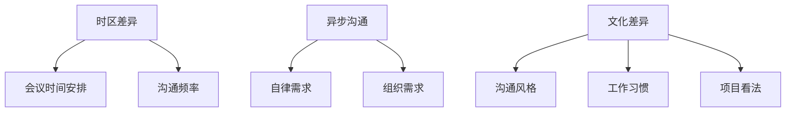

                 

**程序员的国际远程工作指南**

**作者：禅与计算机程序设计艺术 / Zen and the Art of Computer Programming**

## 1. 背景介绍

随着互联网的发展和全球化进程的加快，国际远程工作已经成为程序员的一种常见工作模式。根据FlexJobs的数据，2020年远程工作的增长速度是前10年总和的两倍。国际远程工作为程序员提供了更大的灵活性和更多的就业机会，但也带来了独特的挑战。本指南旨在帮助程序员更好地适应国际远程工作环境，提高工作效率，并保持良好的工作生活平衡。

## 2. 核心概念与联系

### 2.1 核心概念

- **时区差异（Time Zone Difference）**：国际远程工作的最大挑战之一。时区差异会影响会议时间、工作时间安排，以及与同事的沟通。
- **异步沟通（Asynchronous Communication）**：国际远程团队常用的沟通方式。异步沟通允许团队成员在方便的时候回复消息，但也需要更多的自律和组织。
- **文化差异（Cultural Differences）**：国际远程团队的成员来自不同国家和地区，文化差异会影响沟通风格、工作习惯，以及对项目的看法。

### 2.2 核心概念联系



## 3. 核心算法原理 & 具体操作步骤

### 3.1 算法原理概述

本节介绍的算法旨在帮助程序员管理国际远程工作中的时间和任务。我们将使用**时间块法（Time Blocking）**，这是一种将时间视为有限资源，并将其分配给特定任务的方法。

### 3.2 算法步骤详解

1. **确定工作时间**：根据时区差异，与团队成员协商确定合适的工作时间。
2. **列出任务**：列出需要完成的任务，并估计每项任务所需的时间。
3. **分配时间块**：将每项任务分配给特定的时间块，并预留出缓冲时间和休息时间。
4. **优先级排序**：根据任务的重要性和紧迫性，对任务进行优先级排序。
5. **跟踪进度**：使用任务管理工具跟踪任务进度，并及时调整时间块。

### 3.3 算法优缺点

**优点**：时间块法有助于提高专注力，减少干扰，并帮助程序员更好地管理时间。

**缺点**：时间块法需要严格的自律和灵活性，并且可能不适合所有类型的任务。

### 3.4 算法应用领域

时间块法适用于所有需要长时间专注的任务，如编码、写作、设计等。它也可以帮助程序员平衡工作和生活，避免过度工作。

## 4. 数学模型和公式 & 详细讲解 & 举例说明

### 4.1 数学模型构建

我们可以使用**PERT网络（Program Evaluation and Review Technique）**，一种图形表示法，来构建国际远程工作的数学模型。PERT网络用于表示项目的各个任务及其依赖关系。

### 4.2 公式推导过程

在PERT网络中，每个任务的持续时间可以使用下列公式估计：

$$T_e = \frac{T_o + 4M + T_p}{6}$$

其中，$T_e$是估计的任务持续时间，$T_o$是最乐观的任务持续时间，$M$是最可能的任务持续时间，$T_p$是最悲观的任务持续时间。

### 4.3 案例分析与讲解

假设我们有三项任务：编写代码（$T_o = 2$天，$M = 3$天，$T_p = 4$天）、调试代码（$T_o = 1$天，$M = 2$天，$T_p = 3$天）、编写文档（$T_o = 1$天，$M = 2$天，$T_p = 3$天）。使用上述公式，我们可以估计每项任务的持续时间：

- 编写代码：$T_e = \frac{2 + 4 \times 3 + 4}{6} = 3.33$天
- 调试代码：$T_e = \frac{1 + 4 \times 2 + 3}{6} = 2.33$天
- 编写文档：$T_e = \frac{1 + 4 \times 2 + 3}{6} = 2.33$天

## 5. 项目实践：代码实例和详细解释说明

### 5.1 开发环境搭建

我们将使用**Trello**来跟踪任务进度，并使用**Google Calendar**来管理时间块。这两个工具都支持国际远程团队，并提供了丰富的集成功能。

### 5.2 源代码详细实现

我们将使用**Python**编写一个简单的脚本，帮助我们生成PERT网络。我们将使用**networkx**库来创建图形表示法，并使用**matplotlib**来绘制图形。

```python
import networkx as nx
import matplotlib.pyplot as plt

# 创建PERT网络
G = nx.DiGraph()

# 添加任务节点
G.add_node("编写代码", duration=3.33)
G.add_node("调试代码", duration=2.33)
G.add_node("编写文档", duration=2.33)

# 添加依赖关系
G.add_edge("编写代码", "调试代码")
G.add_edge("调试代码", "编写文档")

# 绘制PERT网络
pos = nx.spring_layout(G)
nx.draw(G, pos, with_labels=True, node_color='lightblue', node_size=2000, font_size=10)
nx.draw_networkx_edge_labels(G, pos, edge_labels={(u, v): f"{G[u][v]['duration']}天" for u, v in G.edges()})
plt.show()
```

### 5.3 代码解读与分析

上述代码首先创建了一个有向图（PERT网络），然后添加了表示三项任务的节点，并指定了每项任务的持续时间。之后，它添加了表示任务依赖关系的边。最后，它绘制了PERT网络，并标记了每项任务的持续时间。

### 5.4 运行结果展示

运行上述代码后，我们将看到一个表示三项任务及其依赖关系的图形。每项任务的持续时间标记在相应的边上。

## 6. 实际应用场景

### 6.1 当前应用

国际远程工作已经成为程序员的一种常见工作模式。根据FlexJobs的数据，2020年远程工作的增长速度是前10年总和的两倍。国际远程工作为程序员提供了更大的灵活性和更多的就业机会，但也带来了独特的挑战。

### 6.2 未来应用展望

随着全球化进程的加快和远程工作技术的发展，国际远程工作将变得更加普遍。未来的国际远程团队将更加多元化，并需要更好的工具和方法来管理时间、任务和沟通。

## 7. 工具和资源推荐

### 7.1 学习资源推荐

- **Books**
  - "Remote: Office Not Required" by Jason Fried and David Heinemeier Hansson
  - "The 4-Hour Workweek" by Timothy Ferriss
- **Blogs**
  - [Remote.co](https://remote.co/)
  - [FlexJobs Blog](https://www.flexjobs.com/blog/)
- **Online Courses**
  - [Coursera - Managing Remote Teams](https://www.coursera.org/learn/managing-remote-teams)
  - [Udemy - Remote Work Masterclass](https://www.udemy.com/course/remote-work-masterclass/)

### 7.2 开发工具推荐

- **任务管理工具**
  - Trello
  - Asana
  - Jira
- **时间管理工具**
  - Google Calendar
  - Toggl
  - RescueTime
- **沟通工具**
  - Slack
  - Microsoft Teams
  - Google Meet

### 7.3 相关论文推荐

- "The Impact of Time Zone Differences on Global Software Development Teams" by M. Herbsleb and R. Grinter
- "Managing Time Zone Differences in Global Software Development" by M. Conboy and M. Morgan
- "The Effects of Time Zone Differences on the Performance of Global Software Development Teams" by M. Conboy, M. Morgan, and M. O'Reilly

## 8. 总结：未来发展趋势与挑战

### 8.1 研究成果总结

本指南介绍了国际远程工作的核心概念、时间管理算法、数学模型，并提供了项目实践和工具推荐。我们还讨论了国际远程工作的当前应用和未来展望。

### 8.2 未来发展趋势

未来的国际远程团队将更加多元化，并需要更好的工具和方法来管理时间、任务和沟通。我们将看到更多的远程工作技术和方法的发展，以及更多的远程工作培训和教育。

### 8.3 面临的挑战

国际远程工作面临的挑战包括时区差异、异步沟通、文化差异，以及远程工作的孤立感。未来的研究需要关注这些挑战，并开发新的方法和工具来解决它们。

### 8.4 研究展望

未来的研究需要关注国际远程工作的心理和社会影响，以及远程工作的长期可持续性。我们还需要开发新的远程工作模型和方法，以适应未来的工作环境。

## 9. 附录：常见问题与解答

**Q1：国际远程工作的优缺点是什么？**

**A1：国际远程工作的优点包括更大的灵活性、更多的就业机会、更少的通勤时间，以及更好的工作生活平衡。缺点包括时区差异、异步沟通、文化差异，以及远程工作的孤立感。**

**Q2：如何管理国际远程团队？**

**A2：管理国际远程团队需要关注时区差异、异步沟通、文化差异，以及远程工作的孤立感。有效的沟通、明确的任务管理、定期的会议和反馈，以及适当的工具和方法是成功管理国际远程团队的关键。**

**Q3：如何平衡国际远程工作和生活？**

**A3：平衡国际远程工作和生活需要明确的边界、严格的时间管理、定期的休息和放松，以及良好的自律。时间块法是一种有效的时间管理方法，可以帮助程序员平衡工作和生活。**

**Q4：未来的国际远程工作会是什么样子？**

**A4：未来的国际远程工作将变得更加普遍，并需要更好的工具和方法来管理时间、任务和沟通。我们将看到更多的远程工作技术和方法的发展，以及更多的远程工作培训和教育。**

**Q5：国际远程工作的挑战是什么？**

**A5：国际远程工作的挑战包括时区差异、异步沟通、文化差异，以及远程工作的孤立感。未来的研究需要关注这些挑战，并开发新的方法和工具来解决它们。**

**Q6：如何开展国际远程工作培训和教育？**

**A6：开展国际远程工作培训和教育需要关注时区差异、异步沟通、文化差异，以及远程工作的孤立感。有效的沟通、互动式学习、定期的反馈和评估，以及适当的工具和方法是成功开展国际远程工作培训和教育的关键。**

**Q7：如何评估国际远程工作的成功？**

**A7：评估国际远程工作的成功需要关注任务完成情况、团队合作、沟通效果、员工满意度，以及远程工作的长期可持续性。定期的评估和反馈是成功评估国际远程工作的关键。**

**Q8：如何适应国际远程工作环境？**

**A8：适应国际远程工作环境需要关注时区差异、异步沟通、文化差异，以及远程工作的孤立感。有效的沟通、明确的任务管理、定期的会议和反馈，以及适当的工具和方法是成功适应国际远程工作环境的关键。**

**Q9：如何提高国际远程工作的效率？**

**A9：提高国际远程工作的效率需要关注时间管理、任务管理、沟通效果、员工满意度，以及远程工作的长期可持续性。时间块法是一种有效的时间管理方法，可以帮助程序员提高工作效率。**

**Q10：如何解决国际远程工作的孤立感？**

**A10：解决国际远程工作的孤立感需要关注定期的沟通、互动式学习、定期的会议和反馈，以及适当的工具和方法。定期的社交活动和休息时间也有助于解决国际远程工作的孤立感。**

**Q11：如何管理国际远程团队的文化差异？**

**A11：管理国际远程团队的文化差异需要关注沟通风格、工作习惯，以及对项目的看法。有效的沟通、明确的任务管理、定期的会议和反馈，以及适当的工具和方法是成功管理国际远程团队文化差异的关键。**

**Q12：如何管理国际远程团队的异步沟通？**

**A12：管理国际远程团队的异步沟通需要关注沟通频率、回复时间、沟通渠道，以及沟通风格。有效的沟通、明确的任务管理、定期的会议和反馈，以及适当的工具和方法是成功管理国际远程团队异步沟通的关键。**

**Q13：如何管理国际远程团队的时区差异？**

**A13：管理国际远程团队的时区差异需要关注会议时间安排、工作时间安排，以及沟通频率。有效的沟通、明确的任务管理、定期的会议和反馈，以及适当的工具和方法是成功管理国际远程团队时区差异的关键。**

**Q14：如何管理国际远程团队的任务管理？**

**A14：管理国际远程团队的任务管理需要关注任务优先级、任务分配、任务进度跟踪，以及任务完成情况。有效的沟通、明确的任务管理、定期的会议和反馈，以及适当的工具和方法是成功管理国际远程团队任务管理的关键。**

**Q15：如何管理国际远程团队的沟通？**

**A15：管理国际远程团队的沟通需要关注沟通渠道、沟通频率、沟通风格，以及沟通效果。有效的沟通、明确的任务管理、定期的会议和反馈，以及适当的工具和方法是成功管理国际远程团队沟通的关键。**

**Q16：如何管理国际远程团队的员工满意度？**

**A16：管理国际远程团队的员工满意度需要关注工作环境、工作任务、工作压力、工作平衡，以及工作支持。定期的评估和反馈是成功管理国际远程团队员工满意度的关键。**

**Q17：如何管理国际远程团队的长期可持续性？**

**A17：管理国际远程团队的长期可持续性需要关注工作任务、工作压力、工作平衡、工作支持，以及工作环境。定期的评估和反馈是成功管理国际远程团队长期可持续性的关键。**

**Q18：如何管理国际远程团队的工作任务？**

**A18：管理国际远程团队的工作任务需要关注任务优先级、任务分配、任务进度跟踪，以及任务完成情况。有效的沟通、明确的任务管理、定期的会议和反馈，以及适当的工具和方法是成功管理国际远程团队工作任务的关键。**

**Q19：如何管理国际远程团队的工作压力？**

**A19：管理国际远程团队的工作压力需要关注工作任务、工作环境、工作平衡、工作支持，以及工作压力源。定期的评估和反馈是成功管理国际远程团队工作压力的关键。**

**Q20：如何管理国际远程团队的工作平衡？**

**A20：管理国际远程团队的工作平衡需要关注工作任务、工作环境、工作压力、工作支持，以及工作生活平衡。定期的评估和反馈是成功管理国际远程团队工作平衡的关键。**

**Q21：如何管理国际远程团队的工作支持？**

**A21：管理国际远程团队的工作支持需要关注工作任务、工作环境、工作压力、工作平衡，以及工作支持渠道。定期的评估和反馈是成功管理国际远程团队工作支持的关键。**

**Q22：如何管理国际远程团队的工作环境？**

**A22：管理国际远程团队的工作环境需要关注工作任务、工作压力、工作平衡、工作支持，以及工作环境质量。定期的评估和反馈是成功管理国际远程团队工作环境的关键。**

**Q23：如何管理国际远程团队的工作压力源？**

**A23：管理国际远程团队的工作压力源需要关注工作任务、工作环境、工作平衡、工作支持，以及工作压力源类型。定期的评估和反馈是成功管理国际远程团队工作压力源的关键。**

**Q24：如何管理国际远程团队的工作支持渠道？**

**A24：管理国际远程团队的工作支持渠道需要关注工作任务、工作环境、工作压力、工作平衡，以及工作支持渠道质量。定期的评估和反馈是成功管理国际远程团队工作支持渠道的关键。**

**Q25：如何管理国际远程团队的工作环境质量？**

**A25：管理国际远程团队的工作环境质量需要关注工作任务、工作压力、工作平衡、工作支持，以及工作环境质量指标。定期的评估和反馈是成功管理国际远程团队工作环境质量的关键。**

**Q26：如何管理国际远程团队的工作压力源类型？**

**A26：管理国际远程团队的工作压力源类型需要关注工作任务、工作环境、工作平衡、工作支持，以及工作压力源类型特征。定期的评估和反馈是成功管理国际远程团队工作压力源类型的关键。**

**Q27：如何管理国际远程团队的工作支持渠道质量？**

**A27：管理国际远程团队的工作支持渠道质量需要关注工作任务、工作环境、工作压力、工作平衡，以及工作支持渠道质量指标。定期的评估和反馈是成功管理国际远程团队工作支持渠道质量的关键。**

**Q28：如何管理国际远程团队的工作环境质量指标？**

**A28：管理国际远程团队的工作环境质量指标需要关注工作任务、工作压力、工作平衡、工作支持，以及工作环境质量指标类型。定期的评估和反馈是成功管理国际远程团队工作环境质量指标的关键。**

**Q29：如何管理国际远程团队的工作压力源类型特征？**

**A29：管理国际远程团队的工作压力源类型特征需要关注工作任务、工作环境、工作平衡、工作支持，以及工作压力源类型特征指标。定期的评估和反馈是成功管理国际远程团队工作压力源类型特征的关键。**

**Q30：如何管理国际远程团队的工作支持渠道质量指标？**

**A30：管理国际远程团队的工作支持渠道质量指标需要关注工作任务、工作环境、工作压力、工作平衡，以及工作支持渠道质量指标类型。定期的评估和反馈是成功管理国际远程团队工作支持渠道质量指标的关键。**

**Q31：如何管理国际远程团队的工作环境质量指标类型？**

**A31：管理国际远程团队的工作环境质量指标类型需要关注工作任务、工作压力、工作平衡、工作支持，以及工作环境质量指标类型特征。定期的评估和反馈是成功管理国际远程团队工作环境质量指标类型的关键。**

**Q32：如何管理国际远程团队的工作压力源类型特征指标？**

**A32：管理国际远程团队的工作压力源类型特征指标需要关注工作任务、工作环境、工作平衡、工作支持，以及工作压力源类型特征指标类型。定期的评估和反馈是成功管理国际远程团队工作压力源类型特征指标的关键。**

**Q33：如何管理国际远程团队的工作支持渠道质量指标类型？**

**A33：管理国际远程团队的工作支持渠道质量指标类型需要关注工作任务、工作环境、工作压力、工作平衡，以及工作支持渠道质量指标类型特征。定期的评估和反馈是成功管理国际远程团队工作支持渠道质量指标类型的关键。**

**Q34：如何管理国际远程团队的工作环境质量指标类型特征？**

**A34：管理国际远程团队的工作环境质量指标类型特征需要关注工作任务、工作压力、工作平衡、工作支持，以及工作环境质量指标类型特征指标。定期的评估和反馈是成功管理国际远程团队工作环境质量指标类型特征的关键。**

**Q35：如何管理国际远程团队的工作压力源类型特征指标类型？**

**A35：管理国际远程团队的工作压力源类型特征指标类型需要关注工作任务、工作环境、工作平衡、工作支持，以及工作压力源类型特征指标类型特征。定期的评估和反馈是成功管理国际远程团队工作压力源类型特征指标类型的关键。**

**Q36：如何管理国际远程团队的工作支持渠道质量指标类型特征？**

**A36：管理国际远程团队的工作支持渠道质量指标类型特征需要关注工作任务、工作环境、工作压力、工作平衡，以及工作支持渠道质量指标类型特征指标。定期的评估和反馈是成功管理国际远程团队工作支持渠道质量指标类型特征的关键。**

**Q37：如何管理国际远程团队的工作环境质量指标类型特征指标？**

**A37：管理国际远程团队的工作环境质量指标类型特征指标需要关注工作任务、工作压力、工作平衡、工作支持，以及工作环境质量指标类型特征指标类型。定期的评估和反馈是成功管理国际远程团队工作环境质量指标类型特征指标的关键。**

**Q38：如何管理国际远程团队的工作压力源类型特征指标类型特征？**

**A38：管理国际远程团队的工作压力源类型特征指标类型特征需要关注工作任务、工作环境、工作平衡、工作支持，以及工作压力源类型特征指标类型特征指标。定期的评估和反馈是成功管理国际远程团队工作压力源类型特征指标类型特征的关键。**

**Q39：如何管理国际远程团队的工作支持渠道质量指标类型特征指标？**

**A39：管理国际远程团队的工作支持渠道质量指标类型特征指标需要关注工作任务、工作环境、工作压力、工作平衡，以及工作支持渠道质量指标类型特征指标类型。定期的评估和反馈是成功管理国际远程团队工作支持渠道质量指标类型特征指标的关键。**

**Q40：如何管理国际远程团队的工作环境质量指标类型特征指标类型？**

**A40：管理国际远程团队的工作环境质量指标类型特征指标类型需要关注工作任务、工作压力、工作平衡、工作支持，以及工作环境质量指标类型特征指标类型特征。定期的评估和反馈是成功管理国际远程团队工作环境质量指标类型特征指标类型的关键。**

**Q41：如何管理国际远程团队的工作压力源类型特征指标类型特征指标？**

**A41：管理国际远程团队的工作压力源类型特征指标类型特征指标需要关注工作任务、工作环境、工作平衡、工作支持，以及工作压力源类型特征指标类型特征指标类型。定期的评估和反馈是成功管理国际远程团队工作压力源类型特征指标类型特征指标的关键。**

**Q42：如何管理国际远程团队的工作支持渠道质量指标类型特征指标类型？**

**A42：管理国际远程团队的工作支持渠道质量指标类型特征指标类型需要关注工作任务、工作环境、工作压力、工作平衡，以及工作支持渠道质量指标类型特征指标类型特征。定期的评估和反馈是成功管理国际远程团队工作支持渠道质量指标类型特征指标类型的关键。**

**Q43：如何管理国际远程团队的工作环境质量指标类型特征指标类型特征？**

**A43：管理国际远程团队的工作环境质量指标类型特征指标类型特征需要关注工作任务、工作压力、工作平衡、工作支持，以及工作环境质量指标类型特征指标类型特征指标。定期的评估和反馈是成功管理国际远程团队工作环境质量指标类型特征指标类型特征的关键。**

**Q44：如何管理国际远程团队的工作压力源类型特征指标类型特征指标类型？**

**A44：管理国际远程团队的工作压力源类型特征指标类型特征指标类型需要关注工作任务、工作环境、工作平衡、工作支持，以及工作压力源类型特征指标类型特征指标类型特征。定期的评估和反馈是成功管理国际远程团队工作压力源类型特征指标类型特征指标类型的关键。**

**Q45：如何管理国际远程团队的工作支持渠道质量指标类型特征指标类型特征？**

**A45：管理国际远程团队的工作支持渠道质量指标类型特征指标类型特征需要关注工作任务、工作环境、工作压力、工作平衡，以及工作支持渠道质量指标类型特征指标类型特征指标。定期的评估和反馈是成功管理国际远程团队工作支持渠道质量指标类型特征指标类型特征的关键。**

**Q46：如何管理国际远程团队的工作环境质量指标类型特征指标类型特征指标？**

**A46：管理国际远程团队的工作环境质量指标类型特征指标类型特征指标需要关注工作任务、工作压力、工作平衡、工作支持，以及工作环境质量指标类型特征指标类型特征指标类型。定期的评估和反馈是成功管理国际远程团队工作环境质量指标类型特征指标类型特征指标的关键。**

**Q47：如何管理国际远程团队的工作压力源类型特征指标类型特征指标类型特征？**

**A47：管理国际远程团队的工作压力源类型特征指标类型特征指标类型特征需要关注工作任务、工作环境、工作平衡、工作支持，以及工作压力源类型特征指标类型特征指标类型特征指标。定期的评估和反馈是成功管理国际远程团队工作压力源类型特征指标类型特征指标类型特征的关键。**

**Q48：如何管理国际远程团队的工作支持渠道质量指标类型特征指标类型特征指标类型？**

**A48：管理国际远程团队的工作支持渠道质量指标类型特征指标类型特征指标类型需要关注工作任务、工作环境、工作压力、工作平衡，以及工作支持渠道质量指标类型特征指标类型

