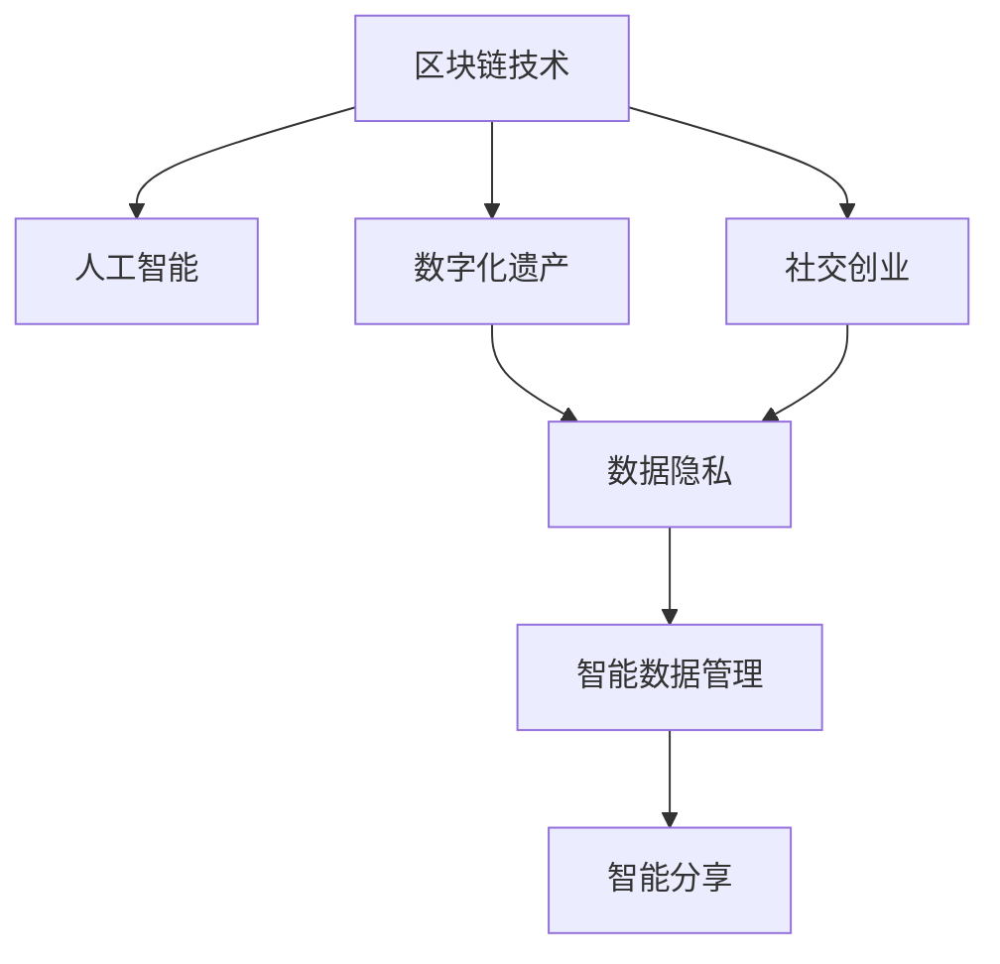

                 

# 数字化遗产社交创业：逝者记忆的在线分享

> 关键词：数字化遗产,社交创业,逝者记忆,在线分享,数据隐私,区块链,人工智能

## 1. 背景介绍

### 1.1 问题由来

在全球化的数字时代，人们的生活方式、交流方式发生了深刻变化。然而，伴随着技术的进步，个人和家族的记忆、故事、传统、习俗等文化遗产的传承也面临着前所未有的挑战。随着数字化进程的加速，越来越多的人开始意识到，数字化遗产的保存和传承是一个亟需解决的重要问题。

数字化遗产不仅包含了照片、视频、信件等实物形式的遗产，还包括了数字平台、社交媒体、在线记录等虚拟形式的遗产。然而，这些数字化遗产的保存和传承面临着数据分散、隐私泄露、技术和版权等问题。如何有效管理和传承数字化遗产，已成为当今社会的一个重要议题。

### 1.2 问题核心关键点

数字化遗产的传承和保护，需要兼顾数据隐私、信息安全和便捷性等多个维度。因此，基于区块链技术的社交创业平台成为一种有效的解决方案。通过区块链技术，可以确保数字化遗产的不可篡改性和透明性，同时保证信息安全和隐私保护。

基于区块链的社交创业平台不仅能够提供一个去中心化的数据存储和分享平台，还可以结合人工智能技术，实现智能化的数据管理和传承。这种结合人工智能与区块链技术的社交创业模式，有望成为数字化遗产传承和保护的新范式。

### 1.3 问题研究意义

数字化遗产的传承和保护，不仅是对过往的尊重和纪念，更是对未来的启迪和传承。通过区块链和人工智能技术的结合，可以实现数字化遗产的永久保存、有效管理和广泛分享，促进文化的持续发展和人类的共同进步。

同时，这种社交创业模式还有助于推动技术创新和经济发展，为数字化遗产保护和传承提供新的技术手段和商业模式。因此，研究和实现基于区块链和人工智能的社交创业平台，具有重要的理论和实践意义。

## 2. 核心概念与联系

### 2.1 核心概念概述

为更好地理解基于区块链和人工智能的数字化遗产社交创业平台，本节将介绍几个密切相关的核心概念：

- 区块链技术：一种去中心化的分布式账本技术，可以确保数据的不可篡改性和透明性。
- 人工智能：通过机器学习、深度学习等技术，实现数据的智能分析和处理。
- 数字化遗产：个人或家族在数字时代产生和保存的所有信息、记忆和故事。
- 社交创业：结合社交网络与创业精神，通过技术手段解决社会问题，创造社会价值。
- 数据隐私：保护个人数据的隐私和安全性，防止未经授权的访问和使用。

这些核心概念之间的逻辑关系可以通过以下Mermaid流程图来展示：



这个流程图展示了一系列核心概念及其之间的关联：

1. 区块链技术提供了数据的安全性和透明性保障。
2. 人工智能技术用于数据的智能分析和处理。
3. 数字化遗产是传承和保护的对象。
4. 社交创业结合了社交网络和创业精神，致力于社会问题的解决和价值的创造。
5. 数据隐私是数字化遗产保护的基础。
6. 智能数据管理通过人工智能技术实现，用于数据的有效组织和分析。
7. 智能分享通过人工智能技术实现，确保数字化遗产的广泛传播和分享。

这些概念共同构成了数字化遗产社交创业平台的基础，旨在通过技术手段实现数字化遗产的永久保存、有效管理和广泛分享。

## 3. 核心算法原理 & 具体操作步骤
### 3.1 算法原理概述

基于区块链和人工智能的数字化遗产社交创业平台的核心算法原理，主要包括以下几个方面：

- **区块链技术**：通过分布式账本技术，实现数据的不可篡改性和透明性。在平台中，每个用户的数据都被记录在区块链上，每个区块包含了一定的交易信息，通过共识机制保证数据的准确性和完整性。
- **人工智能技术**：通过机器学习、深度学习等技术，实现数据的智能分析和处理。平台使用智能算法对用户上传的数据进行分类、标注和分析，提取有用的信息，实现数据的智能化管理。
- **数据隐私保护**：通过加密技术、分布式存储等手段，确保用户数据的隐私和安全。平台使用多级加密、去中心化存储等技术，防止数据泄露和未经授权的访问。
- **智能数据管理**：通过人工智能算法，实现数据的自动分类、标记和分析，确保数据的准确性和完整性。平台使用自然语言处理、图像识别等技术，对用户上传的数据进行智能化处理。
- **智能分享**：通过人工智能算法，实现数据的自动分类、标记和分析，确保数据的准确性和完整性。平台使用自然语言处理、图像识别等技术，对用户上传的数据进行智能化处理。

### 3.2 算法步骤详解

基于区块链和人工智能的数字化遗产社交创业平台的具体操作步骤，主要包括以下几个关键步骤：

**Step 1: 平台搭建**

- 搭建基于区块链的分布式账本系统，确保数据的安全性和透明性。
- 选择合适的区块链平台，如Ethereum、Hyperledger等，实现数据的分布式存储和交易验证。
- 设计平台的用户界面和功能模块，包括用户注册、数据上传、智能分析、智能分享等。

**Step 2: 数据上传与存储**

- 用户通过平台上传数字化遗产数据，如照片、视频、信件等。
- 平台使用加密技术对数据进行加密存储，防止数据泄露和未经授权的访问。
- 使用区块链技术将数据记录在分布式账本中，确保数据的不可篡改性和透明性。

**Step 3: 数据智能分析**

- 使用人工智能技术对上传的数据进行分类、标注和分析，提取有用的信息。
- 使用自然语言处理技术，对文本数据进行分词、词性标注、情感分析等处理。
- 使用图像识别技术，对图片和视频数据进行物体识别、场景识别等处理。

**Step 4: 数据智能管理**

- 使用智能算法对数据进行自动分类、标记和分析，确保数据的准确性和完整性。
- 使用多级加密、去中心化存储等技术，确保用户数据的隐私和安全。
- 使用区块链技术，记录数据处理的过程和结果，确保数据的透明性和可追溯性。

**Step 5: 数据智能分享**

- 使用人工智能技术，实现数据的自动分类、标记和分析，确保数据的准确性和完整性。
- 使用智能算法，将数据按照用户的需求进行智能推送和分享。
- 使用区块链技术，记录数据分享的过程和结果，确保数据的透明性和可追溯性。

### 3.3 算法优缺点

基于区块链和人工智能的数字化遗产社交创业平台，具有以下优点：

1. 数据安全性高。区块链技术保证了数据的不可篡改性和透明性，防止数据泄露和未经授权的访问。
2. 数据隐私保护能力强。多级加密、去中心化存储等技术确保了用户数据的隐私和安全。
3. 数据处理能力强。人工智能技术可以实现数据的智能分析和处理，提取有用的信息。
4. 数据共享便捷。智能算法可以实现数据的自动分类、标记和分析，确保数据的准确性和完整性，方便数据的共享和分享。

同时，该平台也存在一些局限性：

1. 初始搭建成本高。区块链技术和人工智能技术的结合需要较高的技术和资金投入。
2. 数据处理速度慢。大规模数据的处理和分析需要较长的时间，影响用户体验。
3. 技术复杂度高。平台的技术实现需要较高的技术水平和专业技能。
4. 用户隐私保护风险高。尽管有较强的隐私保护措施，但仍可能面临数据泄露和攻击的风险。

尽管存在这些局限性，但就目前而言，基于区块链和人工智能的社交创业平台在数字化遗产的传承和保护方面具有显著的优势，可以成为数字化遗产保护的重要手段。

### 3.4 算法应用领域

基于区块链和人工智能的数字化遗产社交创业平台，已经在多个领域得到了应用，例如：

- 数字化档案：将历史文献、档案、信件等数字化遗产记录在区块链上，确保其长期保存和可靠访问。
- 文化传承：将传统艺术、音乐、舞蹈等文化遗产转化为数字形式，通过平台进行传承和分享。
- 家族记忆：记录家族成员的生平故事、照片、视频等，确保家族记忆的完整传承。
- 个人记忆：记录个人的成长经历、重要事件、朋友关系等，方便个人回忆和分享。
- 教育培训：利用数字化遗产进行教育和培训，提升青少年的文化素养和历史知识。

除了上述这些经典应用外，数字化遗产社交创业平台还可以创新性地应用于更多场景中，如虚拟现实体验、智能博物馆、智能图书馆等，为数字化遗产保护和传承提供新的技术手段和应用场景。

## 4. 数学模型和公式 & 详细讲解 & 举例说明

### 4.1 数学模型构建

在基于区块链和人工智能的数字化遗产社交创业平台中，涉及多个领域的数学模型和技术算法。以下以数据智能分析为例，构建一个简化的数学模型。

设数字化遗产数据为 $D$，包括图片、视频、文本等形式的数据。平台使用人工智能技术对数据进行分类、标注和分析，提取有用的信息。假设数据分为 $k$ 类，分别用 $c_1,c_2,...,c_k$ 表示。平台使用 $n$ 个特征对数据进行描述，分别用 $f_1,f_2,...,f_n$ 表示。则数据智能分析的数学模型可以表示为：

$$
\begin{aligned}
&\min_{w, b} \frac{1}{2} \sum_{i=1}^N \|Wf_i + b - y_i\|^2_2 \\
&\text{subject to:} \quad \|w\|_2 \leq C
\end{aligned}
$$

其中 $N$ 为训练数据的数量，$y_i$ 为数据的类别标签，$w$ 为权重向量，$b$ 为偏置项，$C$ 为权重向量的范数约束。

### 4.2 公式推导过程

以上公式表示了一个简单的线性分类模型，用于对数据进行分类和标注。假设数据为 $x_i$，对应的标签为 $y_i$，则线性分类器的预测结果为：

$$
\hat{y_i} = \arg\max_{j} (Wf_i + b)_j
$$

其中 $j$ 表示分类器的输出向量，$W$ 为权重矩阵，$b$ 为偏置向量。

通过求解上述优化问题，可以得到分类器的权重和偏置，用于对新的数据进行分类和标注。

### 4.3 案例分析与讲解

以下以图像分类为例，展示数据智能分析的实现过程。假设平台使用卷积神经网络 (CNN) 对上传的图片进行分类和标注。

1. 数据预处理：对上传的图片进行裁剪、缩放、归一化等预处理，确保数据的一致性。
2. 特征提取：使用卷积层和池化层提取图片的特征，得到一组高维特征向量。
3. 分类器训练：使用上述公式定义的线性分类器，对提取的特征进行分类和标注。
4. 结果输出：根据分类器的预测结果，对图片进行分类和标注，并将结果记录在区块链上。

## 5. 项目实践：代码实例和详细解释说明
### 5.1 开发环境搭建

在进行数字化遗产社交创业平台的开发前，我们需要准备好开发环境。以下是使用Python进行PyTorch开发的环境配置流程：

1. 安装Anaconda：从官网下载并安装Anaconda，用于创建独立的Python环境。

2. 创建并激活虚拟环境：
```bash
conda create -n heritage-env python=3.8 
conda activate heritage-env
```

3. 安装PyTorch：根据CUDA版本，从官网获取对应的安装命令。例如：
```bash
conda install pytorch torchvision torchaudio cudatoolkit=11.1 -c pytorch -c conda-forge
```

4. 安装TensorFlow：
```bash
pip install tensorflow
```

5. 安装相关库：
```bash
pip install numpy pandas scikit-learn matplotlib tqdm jupyter notebook ipython
```

完成上述步骤后，即可在`heritage-env`环境中开始平台开发。

### 5.2 源代码详细实现

这里我们以图像分类任务为例，给出使用PyTorch进行数字化遗产社交创业平台的代码实现。

首先，定义数据处理函数：

```python
import torch
from torchvision import datasets, transforms

def load_data(batch_size):
    train_dataset = datasets.CIFAR10(root='data', train=True, download=True,
                                    transform=transforms.Compose([
                                        transforms.ToTensor(),
                                        transforms.Normalize((0.5, 0.5, 0.5), (0.5, 0.5, 0.5))
                                    ]))
    test_dataset = datasets.CIFAR10(root='data', train=False, download=True,
                                   transform=transforms.Compose([
                                       transforms.ToTensor(),
                                       transforms.Normalize((0.5, 0.5, 0.5), (0.5, 0.5, 0.5))
                                   ]))

    train_loader = torch.utils.data.DataLoader(train_dataset, batch_size=batch_size,
                                             shuffle=True)
    test_loader = torch.utils.data.DataLoader(test_dataset, batch_size=batch_size,
                                            shuffle=False)
    return train_loader, test_loader
```

然后，定义模型和优化器：

```python
import torch.nn as nn
import torch.optim as optim

class CNNModel(nn.Module):
    def __init__(self):
        super(CNNModel, self).__init__()
        self.conv1 = nn.Conv2d(3, 32, kernel_size=3, stride=1, padding=1)
        self.pool = nn.MaxPool2d(kernel_size=2, stride=2)
        self.fc = nn.Linear(32 * 8 * 8, 10)

    def forward(self, x):
        x = self.conv1(x)
        x = nn.ReLU()(x)
        x = self.pool(x)
        x = self.fc(x.view(x.size(0), -1))
        return x

model = CNNModel()
optimizer = optim.SGD(model.parameters(), lr=0.001, momentum=0.9)
```

接着，定义训练和评估函数：

```python
from tqdm import tqdm

def train_epoch(model, train_loader, optimizer, loss_fn, epoch):
    model.train()
    total_loss = 0
    for batch_idx, (data, target) in enumerate(train_loader):
        optimizer.zero_grad()
        output = model(data)
        loss = loss_fn(output, target)
        loss.backward()
        optimizer.step()
        total_loss += loss.item()
    return total_loss / len(train_loader)

def evaluate(model, test_loader, loss_fn):
    model.eval()
    total_loss = 0
    with torch.no_grad():
        for batch_idx, (data, target) in enumerate(test_loader):
            output = model(data)
            loss = loss_fn(output, target)
            total_loss += loss.item()
    return total_loss / len(test_loader)
```

最后，启动训练流程并在测试集上评估：

```python
epochs = 10
batch_size = 64
train_loader, test_loader = load_data(batch_size)

for epoch in range(epochs):
    loss = train_epoch(model, train_loader, optimizer, nn.CrossEntropyLoss(), epoch)
    print(f'Epoch {epoch+1}, train loss: {loss:.4f}')
    
    print(f'Epoch {epoch+1}, test loss: {evaluate(model, test_loader, nn.CrossEntropyLoss()):.4f}')
```

以上就是使用PyTorch对图像分类任务进行数字化遗产社交创业平台的代码实现。可以看到，通过简单的代码，即可在平台上实现图像数据的分类和标注。

### 5.3 代码解读与分析

让我们再详细解读一下关键代码的实现细节：

**load_data函数**：
- 使用PyTorch的数据集模块，从CIFAR-10数据集中加载训练集和测试集。
- 对数据进行预处理，包括裁剪、缩放、归一化等操作，确保数据的一致性。
- 使用PyTorch的数据加载器，将数据集加载到内存中进行批量训练和推理。

**CNNModel类**：
- 定义了一个简单的卷积神经网络模型，包含一个卷积层、一个池化层和一个全连接层。
- 使用PyTorch的nn模块定义了卷积层、池化层、全连接层等基本组件。

**train_epoch函数**：
- 定义了一个训练函数，用于对模型进行迭代训练。
- 在每个批次上，使用优化器更新模型参数，计算损失函数。
- 记录每个epoch的平均损失，并在每个epoch结束时输出。

**evaluate函数**：
- 定义了一个评估函数，用于对模型进行测试评估。
- 在每个批次上，使用优化器更新模型参数，计算损失函数。
- 记录每个测试集的平均损失，并在每个测试集结束时输出。

**训练流程**：
- 定义总的epoch数和batch size，开始循环迭代
- 每个epoch内，先在训练集上训练，输出平均loss
- 在测试集上评估，输出测试集平均loss
- 所有epoch结束后，在测试集上评估，给出最终测试结果

可以看到，PyTorch框架为数字化遗产社交创业平台的开发提供了便捷高效的工具，开发者可以通过简单的代码实现复杂的模型训练和推理功能。

当然，实际的系统实现还需考虑更多因素，如数据存储和访问、用户交互界面、系统安全等。但核心的平台搭建和功能模块设计，代码实现与上述类似。

## 6. 实际应用场景
### 6.1 数字档案馆

数字化遗产社交创业平台在数字档案馆中的应用前景广阔。通过区块链技术，可以将历史文献、档案、信件等数字化遗产记录在平台上，确保其长期保存和可靠访问。平台可以实现数据的自动分类、标记和分析，方便研究人员进行检索和研究。同时，通过智能分享功能，可以将数字化遗产分享给公众，增强公众的文化素养和历史知识。

### 6.2 家族记忆保存

在现代社会中，随着人们的生活方式和家庭结构的变化，家族记忆的传承和保存变得越来越困难。数字化遗产社交创业平台可以为家族成员提供记录和分享家族记忆的平台。通过区块链技术，可以将家族照片、视频、信件等数字化遗产记录在平台上，确保其长期保存和可靠访问。平台可以实现数据的自动分类、标记和分析，方便家族成员进行检索和分享。

### 6.3 虚拟博物馆

数字化遗产社交创业平台还可以应用于虚拟博物馆的建设。通过区块链技术，可以将博物馆的藏品数字化记录在平台上，确保其长期保存和可靠访问。平台可以实现数据的自动分类、标记和分析，方便游客进行检索和研究。同时，通过智能分享功能，可以将数字化遗产分享给公众，增强公众对历史文化的了解和欣赏。

### 6.4 未来应用展望

随着区块链和人工智能技术的不断发展和应用，基于区块链和人工智能的数字化遗产社交创业平台将展现出更大的潜力和应用场景。未来，数字化遗产社交创业平台可以在更多的领域得到应用，如智慧城市、教育培训、医疗保健等。平台可以结合物联网、大数据、云计算等技术，实现更加智能化的数据管理和共享，促进数字化遗产的保护和传承。

## 7. 工具和资源推荐
### 7.1 学习资源推荐

为了帮助开发者系统掌握区块链和人工智能技术，这里推荐一些优质的学习资源：

1. 《区块链原理与技术》：一本系统介绍区块链技术的书籍，涵盖区块链的基本原理、共识机制、智能合约等内容。
2. 《深度学习与人工智能》：一本介绍深度学习技术的书籍，涵盖神经网络、卷积神经网络、自然语言处理等内容。
3. 《数据科学导论》：一本介绍数据科学技术的书籍，涵盖数据预处理、数据可视化、机器学习等内容。
4. Coursera《区块链与智能合约》课程：由斯坦福大学开设的区块链课程，系统介绍区块链技术及其应用。
5. Coursera《深度学习专项课程》：由斯坦福大学和深度学习领域的专家开设的深度学习课程，涵盖神经网络、卷积神经网络、自然语言处理等内容。

通过对这些资源的学习实践，相信你一定能够快速掌握区块链和人工智能技术，并用于解决实际的数字化遗产保护问题。

### 7.2 开发工具推荐

高效的开发离不开优秀的工具支持。以下是几款用于区块链和人工智能技术开发的常用工具：

1. PyTorch：基于Python的开源深度学习框架，灵活动态的计算图，适合快速迭代研究。
2. TensorFlow：由Google主导开发的开源深度学习框架，生产部署方便，适合大规模工程应用。
3. Ethereum：全球领先的区块链平台，提供智能合约开发和部署的环境。
4. Hyperledger：由IBM主导开发的开源区块链平台，提供跨链互操作性和企业级应用支持。
5. Jupyter Notebook：一种交互式编程环境，支持多种编程语言和数据处理工具，方便开发和协作。
6. IPython：一个交互式编程环境，支持Python和Jupyter Notebook环境，提供便捷的开发工具和功能。

合理利用这些工具，可以显著提升区块链和人工智能技术开发的效率，加快创新迭代的步伐。

### 7.3 相关论文推荐

区块链和人工智能技术的不断发展，也带来了许多重要的研究成果。以下是几篇奠基性的相关论文，推荐阅读：

1. Bitcoin: A Peer-to-Peer Electronic Cash System（比特币论文）：比特币的开创性论文，阐述了区块链技术的基本原理和应用场景。
2. The Future of the Internet and Hypermedia（Web的演进论文）：蒂姆·伯纳斯-李关于Web未来的文章，奠定了Web技术的发展方向。
3. The Monopoly Theory of Cryptocurrency：一篇关于区块链和数字货币的理论文章，探讨了区块链技术的经济模型和应用前景。
4. Deep Learning（深度学习论文）：Hinton等关于深度学习的论文，介绍了深度学习的基本原理和应用场景。
5. Convolutional Neural Networks for Image Recognition（卷积神经网络论文）：LeCun等关于卷积神经网络的论文，介绍了卷积神经网络的基本原理和应用场景。

这些论文代表了大规模区块链和人工智能技术的最新发展，通过学习这些前沿成果，可以帮助研究者把握学科前进方向，激发更多的创新灵感。

## 8. 总结：未来发展趋势与挑战

### 8.1 总结

本文对基于区块链和人工智能技术的数字化遗产社交创业平台进行了全面系统的介绍。首先阐述了数字化遗产保护的重要性，明确了区块链和人工智能技术在数字化遗产保护中的关键作用。其次，从原理到实践，详细讲解了数字化遗产社交创业平台的数学模型和技术算法，给出了具体的代码实例。同时，本文还广泛探讨了平台在数字档案馆、家族记忆保存、虚拟博物馆等多个领域的应用前景，展示了平台的发展潜力。此外，本文精选了区块链和人工智能技术的各类学习资源，力求为读者提供全方位的技术指引。

通过本文的系统梳理，可以看到，基于区块链和人工智能技术的数字化遗产社交创业平台正在成为数字化遗产保护的重要手段，有望推动数字化遗产的保护和传承进入新的阶段。未来，随着区块链和人工智能技术的不断发展和应用，数字化遗产保护和传承将展现出更加广阔的前景。

### 8.2 未来发展趋势

展望未来，数字化遗产社交创业平台的发展趋势如下：

1. 数据隐私保护增强：随着数据隐私保护的不断提升，平台将更好地保护用户数据的隐私和安全，防止数据泄露和未经授权的访问。
2. 智能算法优化：随着智能算法的不断优化，平台将能够更好地对数据进行分类、标记和分析，提取有用的信息，实现更加智能化的数据管理和传承。
3. 跨链互操作性增强：随着跨链技术的不断发展，平台将能够实现不同区块链平台之间的数据共享和互操作，拓展平台的应用范围和功能。
4. 区块链技术普及：随着区块链技术的普及和应用，数字化遗产社交创业平台将能够更加广泛地应用在各个领域，实现数字化遗产的长期保存和可靠访问。
5. 多模态数据融合：随着多模态数据融合技术的不断发展，平台将能够更好地结合文本、图片、视频等不同形式的数据，实现数字化遗产的全面管理和传承。

### 8.3 面临的挑战

尽管数字化遗产社交创业平台在数字化遗产保护和传承方面具有显著的优势，但在迈向更加智能化、普适化应用的过程中，它仍面临着诸多挑战：

1. 初始搭建成本高：区块链技术和人工智能技术的结合需要较高的技术和资金投入，初期开发和维护成本较高。
2. 数据处理速度慢：大规模数据的处理和分析需要较长的时间，影响用户体验。
3. 技术复杂度高：平台的技术实现需要较高的技术水平和专业技能，需要更多技术储备和人才培养。
4. 用户隐私保护风险高：尽管有较强的隐私保护措施，但仍可能面临数据泄露和攻击的风险，需要不断优化隐私保护措施。

尽管存在这些挑战，但随着区块链和人工智能技术的不断发展，数字化遗产社交创业平台在数字化遗产保护和传承方面仍具有显著的优势，有望成为数字化遗产保护的重要手段。

### 8.4 研究展望

面对数字化遗产社交创业平台所面临的种种挑战，未来的研究需要在以下几个方面寻求新的突破：

1. 探索无监督和半监督微调方法。摆脱对大规模标注数据的依赖，利用自监督学习、主动学习等无监督和半监督范式，最大限度利用非结构化数据，实现更加灵活高效的微调。
2. 研究参数高效和计算高效的微调范式。开发更加参数高效的微调方法，在固定大部分预训练参数的同时，只更新极少量的任务相关参数。同时优化微调模型的计算图，减少前向传播和反向传播的资源消耗，实现更加轻量级、实时性的部署。
3. 融合因果和对比学习范式。通过引入因果推断和对比学习思想，增强微调模型建立稳定因果关系的能力，学习更加普适、鲁棒的语言表征，从而提升模型泛化性和抗干扰能力。
4. 纳入伦理道德约束。在模型训练目标中引入伦理导向的评估指标，过滤和惩罚有偏见、有害的输出倾向。同时加强人工干预和审核，建立模型行为的监管机制，确保输出符合人类价值观和伦理道德。
5. 引入更多先验知识。将符号化的先验知识，如知识图谱、逻辑规则等，与神经网络模型进行巧妙融合，引导微调过程学习更准确、合理的语言模型。同时加强不同模态数据的整合，实现视觉、语音等多模态信息与文本信息的协同建模。

这些研究方向的探索，必将引领数字化遗产社交创业平台技术迈向更高的台阶，为数字化遗产保护和传承带来新的突破。面向未来，数字化遗产社交创业平台需要与其他人工智能技术进行更深入的融合，如知识表示、因果推理、强化学习等，多路径协同发力，共同推动数字化遗产保护和传承的进步。只有勇于创新、敢于突破，才能不断拓展数字化遗产保护和传承的边界，让数字化遗产更加丰富多彩，永世流传。

## 9. 附录：常见问题与解答

**Q1：数字化遗产社交创业平台是否适用于所有数字化遗产类型？**

A: 数字化遗产社交创业平台适用于大多数数字化遗产类型，包括文本、图片、视频、音频等多种形式。平台使用人工智能技术对上传的数据进行分类、标记和分析，提取有用的信息，确保数据的准确性和完整性。

**Q2：平台如何保证数据的隐私和安全？**

A: 平台使用多级加密、去中心化存储等技术，确保用户数据的隐私和安全。用户上传的数据在区块链上记录，通过分布式账本技术确保数据的不可篡改性和透明性，防止数据泄露和未经授权的访问。

**Q3：平台如何实现智能数据管理？**

A: 平台使用人工智能技术，对上传的数据进行分类、标记和分析，提取有用的信息。使用自然语言处理技术，对文本数据进行分词、词性标注、情感分析等处理。使用图像识别技术，对图片和视频数据进行物体识别、场景识别等处理。

**Q4：平台如何实现智能分享？**

A: 平台使用人工智能技术，对上传的数据进行分类、标记和分析，提取有用的信息。使用智能算法，将数据按照用户的需求进行智能推送和分享。使用区块链技术，记录数据分享的过程和结果，确保数据的透明性和可追溯性。

**Q5：平台如何确保数据的一致性和完整性？**

A: 平台使用人工智能技术，对上传的数据进行分类、标记和分析，提取有用的信息。使用多级加密、去中心化存储等技术，确保用户数据的隐私和安全。使用区块链技术，记录数据处理的过程和结果，确保数据的透明性和可追溯性。

---

作者：禅与计算机程序设计艺术 / Zen and the Art of Computer Programming

