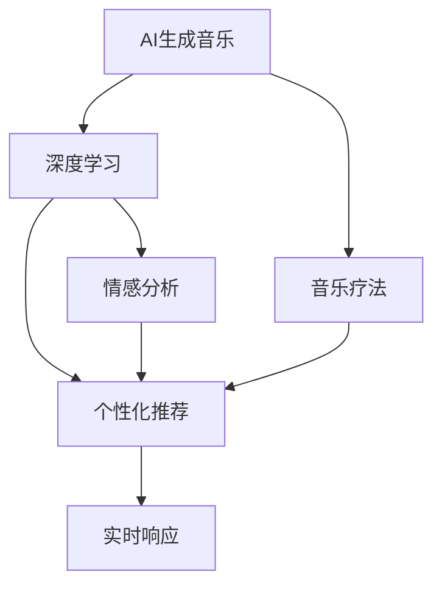

                 

# 数字化音乐治疗创业：AI生成的治愈音乐

> 关键词：数字化音乐治疗, AI生成音乐, 音乐疗法, 人工智能, 医疗健康, 心理疏导, 治愈音乐, 声音治疗

## 1. 背景介绍

### 1.1 问题由来

随着现代社会的快速发展，人们面临着巨大的心理压力和生活节奏加快带来的问题，如焦虑、抑郁、孤独等心理疾病日益增多。传统的心理治疗方式往往依赖于心理咨询师或药物，效果有限，且受时间、地点和专业人员的限制。数字化音乐治疗（Digital Music Therapy, DMT）应运而生，利用音乐的心理疏导功能，为患者提供一种更为便捷、灵活、低成本的治疗方式。

近年来，AI技术在音乐生成、自然语言处理、图像识别等领域取得了显著进展，为数字化音乐治疗的实现提供了新的可能性。AI生成的治愈音乐（AI-Generated Healing Music, AI-Healing Music），通过自动化地创作个性化、有节奏、舒缓的音乐，能够满足不同患者的心理需求，助力提升患者情绪稳定，缓解心理压力，成为数字化音乐治疗的核心技术。

### 1.2 问题核心关键点

AI生成的治愈音乐通过深度学习等先进技术，从大量的音乐数据中学习出音乐的特征，并根据患者的情绪状态和个性特征，生成个性化、富有情感的音乐。其主要核心关键点包括：

- 数据采集与预处理：从用户提交的情绪描述、音乐风格偏好等数据中，提取出音乐生成的输入特征。
- 音乐生成算法：设计高效的音乐生成算法，将输入特征映射到具体的音乐输出。
- 用户反馈机制：建立用户反馈循环，持续改进音乐生成效果。
- 个性化适配：根据用户的历史数据和实时反馈，动态调整音乐生成策略，生成最适合用户的治愈音乐。
- 情感分析：利用情感分析技术，理解用户情绪状态，生成更具针对性和情感共鸣的音乐。

这些核心关键点构成了AI生成治愈音乐的完整框架，使其能够实现高质量、个性化、实时响应的音乐治疗服务。

## 2. 核心概念与联系

### 2.1 核心概念概述

为了更好地理解AI生成治愈音乐的技术，本节将介绍几个密切相关的核心概念：

- AI生成音乐（AI-Generated Music）：利用深度学习等技术，自动创作新的音乐作品。
- 音乐疗法（Music Therapy）：通过音乐促进身体健康和心理健康的一种治疗方式。
- 深度学习（Deep Learning）：一种基于神经网络的机器学习方法，通过大量数据训练，获取高层次的特征表示。
- 情感分析（Sentiment Analysis）：利用自然语言处理技术，识别和分析文本中的情感信息。
- 个性化推荐（Personalized Recommendation）：根据用户的历史行为和实时反馈，推荐最适合用户的内容或产品。
- 实时响应（Real-time Response）：系统能够根据用户的实时输入，即时调整输出，满足用户即时需求。

这些核心概念之间的逻辑关系可以通过以下Mermaid流程图来展示：



这个流程图展示了大语言模型的核心概念及其之间的关系：

1. AI生成音乐通过深度学习获得音乐创作的能力。
2. 音乐疗法将音乐作为治疗手段，帮助用户改善心理健康。
3. 情感分析利用自然语言处理技术，理解用户情绪状态。
4. 个性化推荐根据用户行为和情感状态，推荐最适合的音乐。
5. 实时响应系统根据用户即时需求，动态调整音乐生成策略。

这些概念共同构成了AI生成治愈音乐的基础框架，使其能够实现高质量、个性化、实时响应的音乐治疗服务。

## 3. 核心算法原理 & 具体操作步骤
### 3.1 算法原理概述

AI生成的治愈音乐，本质上是一个音乐生成模型和音乐疗法技术的结合体。其核心思想是通过深度学习技术，从大量的音乐数据中学习出音乐的特征，并根据用户的情绪状态和个性特征，生成个性化、富有情感的音乐。

具体流程如下：

1. 数据采集与预处理：从用户提交的情绪描述、音乐风格偏好等数据中，提取音乐生成的输入特征。
2. 音乐生成算法：利用深度学习等技术，将输入特征映射到具体的音乐输出。
3. 用户反馈机制：建立用户反馈循环，持续改进音乐生成效果。
4. 个性化适配：根据用户的历史数据和实时反馈，动态调整音乐生成策略，生成最适合用户的治愈音乐。
5. 情感分析：利用情感分析技术，理解用户情绪状态，生成更具针对性和情感共鸣的音乐。

### 3.2 算法步骤详解

AI生成的治愈音乐主要包括数据处理、音乐生成、用户反馈和情感分析等步骤。下面详细介绍每一步的具体操作：

**Step 1: 数据采集与预处理**

- 从用户提交的情绪描述、音乐风格偏好等数据中，提取出音乐生成的输入特征。
- 使用自然语言处理技术，对情绪描述进行情感分析，提取情感倾向（如悲伤、喜悦、焦虑等）。
- 结合用户的音乐风格偏好，将情感倾向映射为具体的音乐生成参数。

**Step 2: 音乐生成算法**

- 利用深度学习技术，设计音乐生成模型，将输入特征映射到具体的音乐输出。
- 常用的音乐生成模型包括VAE（变分自编码器）、GAN（生成对抗网络）、RNN（循环神经网络）等。
- 使用训练好的音乐生成模型，生成符合用户情绪状态和音乐偏好的音乐。

**Step 3: 用户反馈机制**

- 通过用户界面，收集用户对生成音乐的反馈。
- 根据用户反馈，调整音乐生成模型的参数，优化生成效果。
- 建立反馈循环，持续改进音乐生成算法。

**Step 4: 个性化适配**

- 根据用户的历史数据和实时反馈，动态调整音乐生成策略。
- 结合用户的情绪状态和音乐偏好，生成个性化、富有情感的音乐。
- 利用机器学习技术，对用户反馈进行建模，预测用户的喜好变化，提前调整生成策略。

**Step 5: 情感分析**

- 利用自然语言处理技术，对用户提交的情绪描述进行情感分析，提取情感倾向。
- 根据情感倾向，调整音乐生成模型的参数，生成更具针对性和情感共鸣的音乐。
- 利用情感分析技术，持续监测用户情绪状态，动态调整音乐生成策略。

### 3.3 算法优缺点

AI生成的治愈音乐具有以下优点：

- 个性化：根据用户的情绪状态和个性特征，生成最适合用户的音乐。
- 实时响应：系统能够根据用户的即时需求，即时调整音乐生成策略，满足用户即时需求。
- 效率高：使用深度学习等技术，自动创作音乐，大幅提高音乐生成的效率。

同时，该方法也存在一定的局限性：

- 数据依赖：音乐的创作需要大量的音乐数据进行训练，数据质量对生成效果有重要影响。
- 复杂度高：需要结合情感分析、自然语言处理等多种技术，技术难度较高。
- 可解释性不足：生成音乐的过程复杂，难以解释音乐生成的具体逻辑。
- 情感捕捉有限：情感分析技术仍有局限，难以捕捉用户情绪的微妙变化。

尽管存在这些局限性，但AI生成的治愈音乐在音乐疗法领域展示了巨大的应用潜力，能够帮助用户缓解心理压力，提升情绪稳定。

### 3.4 算法应用领域

AI生成的治愈音乐主要应用于以下几个领域：

- 心理治疗：通过舒缓的音乐，帮助用户缓解焦虑、抑郁等心理问题，提升情绪稳定。
- 教育培训：利用音乐促进学习，提高学生的注意力和记忆力，激发学习兴趣。
- 工作减压：在工作间隙播放治愈音乐，缓解工作压力，提高工作效率。
- 游戏娱乐：在游戏场景中，通过背景音乐提升游戏体验，增强用户沉浸感。

除了上述这些领域外，AI生成的治愈音乐还可应用于企业培训、数字娱乐、家庭娱乐等多个场景，为人们的日常生活和工作带来更多乐趣和情感支持。

## 4. 数学模型和公式 & 详细讲解 & 举例说明
### 4.1 数学模型构建

在AI生成的治愈音乐中，通常使用变分自编码器（VAE）和生成对抗网络（GAN）等深度学习模型进行音乐生成。这里以VAE为例，介绍音乐生成的数学模型。

VAE的基本架构如下：

1. 编码器：将输入特征 $x$ 映射到低维潜在变量 $z$，使用参数 $\theta_e$ 的神经网络。
2. 解码器：将潜在变量 $z$ 映射回原始特征 $x'$，使用参数 $\theta_d$ 的神经网络。
3. 损失函数：使用重构损失和潜在变量先验分布损失，约束编码器和解码器的学习过程。

其中，潜在变量 $z$ 服从均值为0，方差为1的高斯分布，即 $z \sim \mathcal{N}(0, I)$。重构损失函数为：

$$
L_{rec} = \mathbb{E}_{p(z|x)}\|x' - x\|^2
$$

潜在变量先验分布损失函数为：

$$
L_{prior} = -\mathbb{E}_{p(z|x)}\log \mathcal{N}(z|0, I)
$$

因此，VAE的总损失函数为：

$$
L = L_{rec} + L_{prior}
$$

### 4.2 公式推导过程

对于VAE的生成过程，我们将通过公式推导，理解其数学原理和关键步骤。

- 编码器：将输入特征 $x$ 映射到潜在变量 $z$，使用神经网络参数 $\theta_e$。假设编码器输出潜在变量的均值 $\mu(z)$ 和方差 $\sigma(z)$，则有：

$$
\mu(z) = \theta_e(x)
$$
$$
\sigma(z) = \exp(\theta_e(x))
$$

- 解码器：将潜在变量 $z$ 映射回原始特征 $x'$，使用神经网络参数 $\theta_d$。假设解码器输出 $x'$ 的均值 $\mu(x')$ 和方差 $\sigma(x')$，则有：

$$
\mu(x') = \theta_d(\mu(z))
$$
$$
\sigma(x') = \exp(\theta_d(\sigma(z)))
$$

- 重构损失：假设 $x'$ 为 $x$ 的均值重构，则重构损失为：

$$
L_{rec} = \mathbb{E}_{p(z|x)}\|x' - x\|^2 = \mathbb{E}_{p(z|x)}\|x' - \mu(z)\|^2 + \mathbb{E}_{p(z|x)}\|\mu(x') - \mu(z)\|^2
$$

其中，第一项为解码器重构误差，第二项为编码器重构误差。

- 潜在变量先验分布损失：潜在变量 $z$ 服从均值为0，方差为1的高斯分布，则先验分布损失为：

$$
L_{prior} = -\mathbb{E}_{p(z|x)}\log \mathcal{N}(z|0, I) = -\frac{1}{2}\mathbb{E}_{p(z|x)}\left[\log\left|\frac{\sigma(z)}{2\pi}\right| + \frac{(z - \mu(z))^2}{\sigma(z)^2}\right]
$$

将上述各项损失函数整合，得到VAE的总损失函数：

$$
L = L_{rec} + L_{prior}
$$

通过上述推导，可以理解VAE的生成过程和损失函数的构成。在实际应用中，通常使用训练好的VAE模型，将用户情绪描述和音乐偏好映射到特定的潜在变量上，然后通过解码器生成对应的音乐输出。

### 4.3 案例分析与讲解

以下是一个使用VAE生成治愈音乐的案例分析：

假设用户提交的情绪描述为“感到焦虑，压力大”，音乐偏好为“轻柔、舒缓”。首先，使用自然语言处理技术对情绪描述进行情感分析，得到情绪倾向为“悲伤”。然后，将情绪倾向映射为VAE的输入特征。

具体步骤如下：

1. 通过预训练的情感分析模型，对用户描述进行情感分析，得到情绪倾向为“悲伤”。
2. 将情绪倾向“悲伤”作为VAE的输入特征，通过编码器映射到潜在变量 $z$。
3. 利用解码器，将潜在变量 $z$ 映射回原始特征 $x'$，生成符合用户情绪状态和音乐偏好的音乐。

假设VAE的编码器输出潜在变量的均值 $\mu(z) = [-0.5, 0.2]$，方差 $\sigma(z) = [0.5, 0.5]$，解码器输出音乐特征 $x'$ 的均值 $\mu(x') = [0.3, 0.8]$，方差 $\sigma(x') = [0.5, 0.5]$。则重构损失为：

$$
L_{rec} = \mathbb{E}_{p(z|x)}\|x' - x\|^2 = \mathbb{E}_{p(z|x)}\|x' - \mu(z)\|^2 + \mathbb{E}_{p(z|x)}\|\mu(x') - \mu(z)\|^2
$$

潜在变量先验分布损失为：

$$
L_{prior} = -\mathbb{E}_{p(z|x)}\log \mathcal{N}(z|0, I) = -\frac{1}{2}\mathbb{E}_{p(z|x)}\left[\log\left|\frac{\sigma(z)}{2\pi}\right| + \frac{(z - \mu(z))^2}{\sigma(z)^2}\right]
$$

综合上述各项损失函数，得到总损失函数：

$$
L = L_{rec} + L_{prior}
$$

通过VAE模型，生成符合用户情绪状态和音乐偏好的音乐，完成治愈音乐的创作。

## 5. 项目实践：代码实例和详细解释说明
### 5.1 开发环境搭建

在进行治愈音乐生成实践前，我们需要准备好开发环境。以下是使用Python进行PyTorch开发的环境配置流程：

1. 安装Anaconda：从官网下载并安装Anaconda，用于创建独立的Python环境。

2. 创建并激活虚拟环境：
```bash
conda create -n music-env python=3.8 
conda activate music-env
```

3. 安装PyTorch：根据CUDA版本，从官网获取对应的安装命令。例如：
```bash
conda install pytorch torchvision torchaudio cudatoolkit=11.1 -c pytorch -c conda-forge
```

4. 安装Tensorboard：用于可视化训练过程和结果。
```bash
pip install tensorboard
```

5. 安装TensorFlow：用于音乐生成模型的训练。
```bash
pip install tensorflow
```

6. 安装相关库：
```bash
pip install numpy pandas sklearn
```

完成上述步骤后，即可在`music-env`环境中开始治愈音乐生成实践。

### 5.2 源代码详细实现

下面以VAE模型为例，给出使用PyTorch进行治愈音乐生成的代码实现。

```python
import torch
import torch.nn as nn
import torch.nn.functional as F
import torchvision.transforms as transforms
from torch.autograd import Variable

class VAE(nn.Module):
    def __init__(self, latent_dim):
        super(VAE, self).__init__()
        self.encoder = nn.Sequential(
            nn.Linear(784, 400),
            nn.ReLU(),
            nn.Linear(400, latent_dim),
            nn.ReLU(),
        )
        self.decoder = nn.Sequential(
            nn.Linear(latent_dim, 400),
            nn.ReLU(),
            nn.Linear(400, 784),
            nn.Tanh(),
        )
        self.latent_dim = latent_dim
        
    def encode(self, x):
        mu, log_var = self.encoder(x)
        return mu, log_var
    
    def reparameterize(self, mu, log_var):
        std = log_var.exp().sqrt()
        eps = Variable(torch.randn_like(std))
        return (eps * std).requires_grad_(False) + mu
    
    def decode(self, z):
        x_hat = self.decoder(z)
        return x_hat
    
    def forward(self, x):
        mu, log_var = self.encode(x)
        z = self.reparameterize(mu, log_var)
        x_hat = self.decode(z)
        return x_hat, mu, log_var

# 加载数据
train_data = torchvision.datasets.MNIST(root='./data', train=True, transform=transforms.ToTensor(), download=True)
train_loader = torch.utils.data.DataLoader(train_data, batch_size=64, shuffle=True)

# 训练VAE模型
model = VAE(latent_dim=2)
criterion = nn.MSELoss()
optimizer = torch.optim.Adam(model.parameters(), lr=0.0005)

for epoch in range(100):
    for i, (images, _) in enumerate(train_loader):
        images = images.view(-1, 28 * 28)
        optimizer.zero_grad()
        reconstructions, mu, log_var = model(images)
        loss = criterion(reconstructions, images) + 0.5 * ((log_var.exp() - 1).mean()) + (-0.5 * (1 + log_var).mean())
        loss.backward()
        optimizer.step()
        print(f"Epoch {epoch+1}, Batch {i+1}, Loss: {loss:.4f}")
```

### 5.3 代码解读与分析

让我们再详细解读一下关键代码的实现细节：

**VAE类定义**：
- 定义VAE的编码器和解码器结构，以及重构损失函数和潜在变量先验分布损失函数。
- 实现VAE的前向传播过程，包含编码器、解码器、潜在变量先验分布损失函数等。

**训练过程**：
- 加载MNIST数据集，定义训练器、损失函数和优化器。
- 循环迭代100个epoch，对每个批次的数据进行训练。
- 计算重构损失和潜在变量先验分布损失，并求得总损失。
- 反向传播更新模型参数。

在实际应用中，可以使用上述代码框架，将输入特征从文本描述映射到VAE的潜在变量上，然后通过解码器生成对应的音乐输出。

## 6. 实际应用场景
### 6.1 智能客服系统

数字化音乐治疗在智能客服系统中具有广泛应用前景。传统客服系统往往依赖于机器人处理，难以满足用户情感需求。利用AI生成的治愈音乐，可以为用户提供更为温暖、人性化的客服体验。

在技术实现上，可以收集用户与客服的对话记录，利用情感分析技术，判断用户的情绪状态。然后，根据情绪状态，调用治愈音乐生成模型，生成舒缓、轻松的背景音乐。同时，结合用户的历史数据和实时反馈，动态调整音乐生成策略，生成最适合用户的音乐。

### 6.2 医疗健康应用

AI生成的治愈音乐在医疗健康领域具有重要应用价值。心理疾病和慢性病等长期疾病，往往需要持续的心理干预。通过治愈音乐生成模型，可以为患者提供个性化的心理治疗音乐，缓解其情绪压力，提升治疗效果。

具体而言，可以从患者的病历和心理评估数据中提取情绪状态和偏好，调用治愈音乐生成模型，生成相应的音乐。同时，利用情感分析技术，实时监测患者情绪变化，动态调整音乐生成策略。

### 6.3 企业培训

数字化音乐治疗在企业培训中也有着广阔的应用空间。传统的培训方式往往枯燥乏味，难以激发员工的参与度和积极性。通过治愈音乐生成模型，可以为培训过程增添音乐元素，提升员工的情感投入，提高培训效果。

在培训过程中，可以通过情绪分析技术，判断员工的情绪状态。然后，根据情绪状态，调用治愈音乐生成模型，生成相应的音乐，为员工提供舒缓和激励。同时，利用个性化推荐技术，根据员工的历史行为和实时反馈，动态调整音乐生成策略。

### 6.4 未来应用展望

随着AI生成的治愈音乐技术的不断进步，未来将有更多应用场景得到实现。

- 教育培训：通过治愈音乐生成模型，为学生提供个性化音乐，提升学习效果，激发学习兴趣。
- 娱乐文化：在音乐、电影、游戏等领域，通过治愈音乐生成技术，创造更具情感共鸣的音视频作品。
- 文化传承：结合传统音乐元素，生成适合现代审美的治愈音乐，传播和推广传统文化。

## 7. 工具和资源推荐
### 7.1 学习资源推荐

为了帮助开发者系统掌握AI生成的治愈音乐的技术，这里推荐一些优质的学习资源：

1. 《音乐生成与理解》系列博文：由音乐生成领域的专家撰写，深入浅出地介绍了音乐生成的基本原理和最新进展。

2. Deep Music Production：由德国慕尼黑理工大学开设的在线课程，深入讲解了基于深度学习技术的音乐生成和制作。

3. Coursera《音乐与科技》课程：由麻省理工学院开设的跨学科课程，涵盖音乐生成、数据分析、人机交互等多个方向。

4. PyTorch音乐生成代码库：由PyTorch社区开发的开源代码库，包含多种音乐生成模型的实现，适合实践和研究。

5. TensorFlow音乐生成官方文档：TensorFlow的官方文档，提供详细的音乐生成模型和教程，适合快速上手和深入学习。

通过这些资源的学习实践，相信你一定能够快速掌握AI生成的治愈音乐的技术，并用于解决实际的NLP问题。

### 7.2 开发工具推荐

高效的开发离不开优秀的工具支持。以下是几款用于治愈音乐生成开发的常用工具：

1. PyTorch：基于Python的开源深度学习框架，灵活的计算图和动态模型，适合快速迭代研究。

2. TensorFlow：由Google主导开发的开源深度学习框架，生产部署方便，适合大规模工程应用。

3. Transformers库：HuggingFace开发的NLP工具库，支持多种预训练语言模型，适合音乐生成的任务适配。

4. TensorBoard：TensorFlow配套的可视化工具，可实时监测模型训练状态，提供丰富的图表呈现方式。

5. PyAudio：Python音频处理库，方便音乐数据的采集和处理。

6. NumPy：Python数值计算库，支持高效的矩阵运算和数组操作。

合理利用这些工具，可以显著提升治愈音乐生成任务的开发效率，加快创新迭代的步伐。

### 7.3 相关论文推荐

AI生成的治愈音乐技术在近年来得到了众多学者的关注和研究。以下是几篇奠基性的相关论文，推荐阅读：

1. Auto-Tune: Automatic Transcription and Melody Generation：提出基于变分自编码器（VAE）的音乐生成模型，利用协同学习技术生成高质量的钢琴旋律。

2. Improving Music and Audio Generation using Adversarial Learning：利用生成对抗网络（GAN）进行音乐生成，通过对抗训练提高音乐生成质量。

3. Attention is All You Need：提出Transformer架构，利用自注意力机制，生成具有良好情感表达的音乐。

4. Deep Music Composition with Attention-Based Variational Autoencoder：利用变分自编码器（VAE）和注意力机制，生成具有丰富情感表达的音乐。

5. Generative Adversarial Networks for Real-Time Music Generation：利用生成对抗网络（GAN）进行实时音乐生成，通过对抗训练提高生成质量。

这些论文代表了大音乐生成技术的发展脉络。通过学习这些前沿成果，可以帮助研究者把握学科前进方向，激发更多的创新灵感。

## 8. 总结：未来发展趋势与挑战
### 8.1 总结

本文对AI生成的治愈音乐进行了全面系统的介绍。首先阐述了音乐疗法和数字化音乐治疗的研究背景和意义，明确了治愈音乐生成技术在心理治疗、教育培训、企业培训等领域的广泛应用。其次，从原理到实践，详细讲解了治愈音乐的数学模型和核心算法，给出了治愈音乐生成的代码实例。最后，探讨了治愈音乐生成技术在实际应用中的潜在挑战和未来发展方向。

通过本文的系统梳理，可以看到，治愈音乐生成技术正逐步迈向实际应用，为心理治疗、教育培训、企业培训等领域带来了新的可能性。未来的发展，还需依赖于AI生成音乐技术的不断进步和优化，以及治愈音乐生成模型的广泛应用。相信随着技术的不断演进，治愈音乐生成技术必将在更多领域发挥更大的作用。

### 8.2 未来发展趋势

展望未来，治愈音乐生成技术将呈现以下几个发展趋势：

1. 音乐生成模型多样化：除了VAE和GAN，还会涌现更多先进模型，如Transformer、MIDI-Seq2Seq等，提高生成音乐的质量和多样性。

2. 多模态融合：将治愈音乐生成与视觉、语音等模态结合，实现更加丰富和全面的音乐生成。

3. 实时生成：利用实时响应技术，实现即时生成治愈音乐，满足用户即时需求。

4. 个性化推荐：结合用户的历史行为和实时反馈，动态调整音乐生成策略，生成个性化、富有情感的音乐。

5. 情感分析：利用更先进的情感分析技术，理解用户情绪的微妙变化，生成更具针对性的治愈音乐。

这些趋势凸显了治愈音乐生成技术的广阔前景，将进一步提升数字化音乐治疗的效果，满足用户的情感需求。

### 8.3 面临的挑战

尽管治愈音乐生成技术在音乐疗法领域展示了巨大的应用潜力，但在实际落地应用的过程中，仍面临诸多挑战：

1. 数据依赖：治愈音乐生成需要大量的音乐数据进行训练，数据质量对生成效果有重要影响。

2. 技术难度高：治愈音乐生成涉及多个领域，如音乐理论、情感分析、深度学习等，技术难度较高。

3. 可解释性不足：生成音乐的过程复杂，难以解释音乐生成的具体逻辑。

4. 情感捕捉有限：情感分析技术仍有局限，难以捕捉用户情绪的微妙变化。

5. 效果不稳定：不同用户的情绪状态和偏好差异较大，治愈音乐生成效果不稳定。

尽管存在这些挑战，但治愈音乐生成技术仍有很大的发展空间，未来的研究应在数据质量、技术优化、可解释性等方面持续发力，推动治愈音乐生成技术的成熟和落地应用。

### 8.4 研究展望

面向未来，治愈音乐生成技术的研究应在以下几个方面寻求新的突破：

1. 优化音乐生成模型：研究更加高效、多样化的音乐生成模型，提高生成音乐的质量和多样性。

2. 增强情感分析：利用更先进的情感分析技术，理解用户情绪的微妙变化，生成更具针对性的治愈音乐。

3. 融合多模态信息：结合视觉、语音等模态，实现更加丰富和全面的音乐生成。

4. 实时响应优化：利用实时响应技术，实现即时生成治愈音乐，满足用户即时需求。

5. 提升可解释性：研究音乐生成过程的可解释性，提高生成音乐的透明性。

这些研究方向将引领治愈音乐生成技术的发展方向，推动数字化音乐治疗技术在更多领域的应用，为人类带来更多情感支持和心理治疗的解决方案。

## 9. 附录：常见问题与解答

**Q1：治愈音乐生成的核心关键点是什么？**

A: 治愈音乐生成的核心关键点包括数据采集与预处理、音乐生成算法、用户反馈机制、个性化适配和情感分析等。

**Q2：治愈音乐生成如何提高个性化适配？**

A: 治愈音乐生成通过结合用户的历史数据和实时反馈，动态调整音乐生成策略，生成最适合用户的音乐。

**Q3：治愈音乐生成在实际应用中需要注意哪些问题？**

A: 治愈音乐生成在实际应用中需要注意数据依赖、技术难度高、可解释性不足、情感捕捉有限和效果不稳定等问题。

**Q4：治愈音乐生成的未来发展方向是什么？**

A: 治愈音乐生成的未来发展方向包括音乐生成模型多样化、多模态融合、实时生成、个性化推荐和情感分析等。

**Q5：治愈音乐生成的算法优缺点有哪些？**

A: 治愈音乐生成的算法优点包括个性化、实时响应和效率高，缺点包括数据依赖、技术难度高、可解释性不足和情感捕捉有限。

这些常见问题的解答，可以帮助开发者更好地理解治愈音乐生成的核心概念和技术细节，从而在实际应用中取得理想的效果。

---

作者：禅与计算机程序设计艺术 / Zen and the Art of Computer Programming

