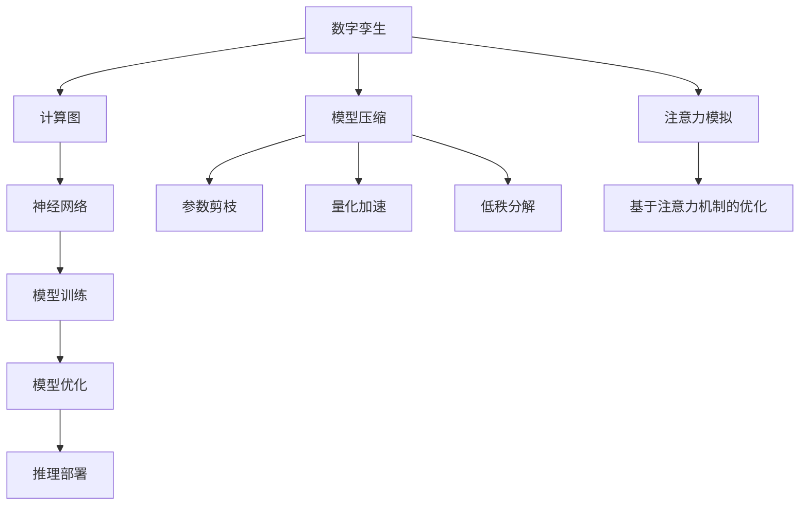

                 

# 数字孪生技术在注意力模拟中的运用

> 关键词：数字孪生,注意力模拟,神经网络,机器学习,深度学习,计算图,模型压缩

## 1. 背景介绍

### 1.1 问题由来
随着科技的不断进步，尤其是深度学习和大数据的广泛应用，人类对于智能系统的需求日益增长。智能系统需要具备高效率、高精度和高可解释性，以应对复杂多变的现实世界。数字孪生（Digital Twin）技术作为智能系统的一种新范式，利用数字模型与物理模型相互映射，从而实现对物理系统的精准预测和优化控制。然而，数字孪生技术在实际应用中，仍面临计算资源消耗大、模型复杂度高、结果可解释性不足等问题。

## 2. 核心概念与联系

### 2.1 核心概念概述

为更好地理解数字孪生技术在注意力模拟中的运用，本节将介绍几个密切相关的核心概念：

- **数字孪生（Digital Twin）**：一种由数字模型与物理模型相互映射和交互的技术，用于优化物理系统的运行和维护。数字孪生系统包括数据孪生、模型孪生和决策孪生三部分，分别用于数据采集、状态模拟和控制决策。

- **注意力机制（Attention Mechanism）**：一种神经网络中的机制，用于对输入数据的各个部分进行加权处理，突出重要部分，忽略不重要部分，从而提高模型的学习效果和泛化能力。

- **计算图（Computational Graph）**：一种用于表示计算过程的数据结构，通过将计算过程分解为基本操作的序列，实现高效地计算和推理。

- **模型压缩（Model Compression）**：一种通过减小模型参数量、降低计算复杂度等手段，优化模型性能的技术。

- **神经网络（Neural Network）**：一种模仿生物神经网络结构的计算模型，具有强大的自适应和泛化能力，被广泛应用于各种机器学习和深度学习任务。

这些核心概念之间的逻辑关系可以通过以下Mermaid流程图来展示：



这个流程图展示了大语言模型微调的各个核心概念及其之间的关系：

1. 数字孪生技术利用计算图模型，对物理系统进行模拟和优化。
2. 模型压缩技术通过参数剪枝、量化加速等手段，减小计算图模型规模，提高推理效率。
3. 注意力模拟通过引入注意力机制，优化计算图模型的结构和推理过程。
4. 神经网络作为计算图模型的基础结构，用于执行各种计算任务。

这些概念共同构成了数字孪生技术的基础，使其能够在各种应用场景中发挥强大的优化和模拟能力。通过理解这些核心概念，我们可以更好地把握数字孪生技术的实现原理和应用方向。

## 3. 核心算法原理 & 具体操作步骤
### 3.1 算法原理概述

数字孪生技术在注意力模拟中的运用，本质上是通过神经网络构建计算图模型，将物理系统的运行状态转化为数字模型，并通过注意力机制对模型进行优化，从而实现对物理系统的精准预测和控制。

形式化地，假设物理系统为一个动态系统，其中状态 $x_t$ 依赖于先前的状态 $x_{t-1}$ 和控制输入 $u_t$，即：

$$
x_t = f(x_{t-1}, u_t)
$$

其中 $f$ 为系统动态模型。数字孪生系统通过传感器等设备获取系统状态数据 $x_t$，并在数字模型上进行仿真和模拟，得到预测状态 $\hat{x}_t$，用于辅助决策和控制。数字孪生系统的优化目标为：

$$
\min_{u_t} \|x_t - \hat{x}_t\|^2
$$

其中 $\| \cdot \|$ 为误差度量函数。为实现这一目标，数字孪生系统通常采用神经网络作为模型，通过最小化误差度量函数，训练得到最优控制策略 $u_t$。

### 3.2 算法步骤详解

数字孪生技术在注意力模拟中的实现，主要包括以下几个关键步骤：

**Step 1: 构建计算图模型**
- 选择合适的神经网络结构，如RNN、LSTM、CNN等，构建计算图模型。
- 定义模型输入、输出和隐藏层的结构，包括输入维度、输出维度、隐藏单元数、激活函数等。

**Step 2: 引入注意力机制**
- 对计算图模型进行优化，引入注意力机制。常见的注意力机制包括多头注意力、软注意力、硬注意力等。
- 通过注意力机制，对输入数据进行加权处理，突出重要部分，忽略不重要部分，从而提高模型的学习效果和泛化能力。

**Step 3: 模型训练与优化**
- 使用历史数据对模型进行训练，最小化误差度量函数。
- 在训练过程中，通过正则化技术、早停策略等手段，避免过拟合。
- 使用模型压缩技术，如参数剪枝、量化加速等，减小模型参数量，提高推理效率。

**Step 4: 数字孪生系统的仿真与优化**
- 在训练好的模型上，输入实时数据进行仿真和模拟，得到预测状态。
- 通过优化算法，如梯度下降、Adagrad等，调整模型参数，最小化误差度量函数，实现对物理系统的精准预测和控制。

### 3.3 算法优缺点

数字孪生技术在注意力模拟中的运用，具有以下优点：
1. 高精度预测：数字孪生系统通过神经网络模型进行仿真和模拟，能够实现对物理系统的精准预测。
2. 鲁棒性强：引入注意力机制后，模型能够更好地处理输入数据中的重要部分，提高模型的鲁棒性。
3. 计算高效：通过模型压缩技术，如参数剪枝、量化加速等，减小模型参数量，提高推理效率。
4. 可解释性强：引入注意力机制后，模型能够突出重要部分，提供更加可解释的推理过程。

同时，该方法也存在一些局限性：
1. 依赖高质量数据：数字孪生系统依赖于高质量的历史数据，数据质量不佳会影响模型的训练效果。
2. 模型复杂度高：神经网络模型本身具有较高的复杂度，增加了计算和推理的难度。
3. 可解释性不足：模型压缩技术虽然提高了推理效率，但也减少了模型可解释性，难以进行调试和优化。
4. 计算资源消耗大：神经网络模型的训练和推理需要消耗大量计算资源，对硬件设备要求较高。

尽管存在这些局限性，但数字孪生技术在注意力模拟中的运用，仍具有广泛的应用前景。未来相关研究的重点在于如何进一步降低计算资源消耗，提高模型的可解释性和鲁棒性，同时兼顾精度和效率。

### 3.4 算法应用领域

数字孪生技术在注意力模拟中的应用，已经在多个领域得到了应用，包括但不限于：

- **智能制造**：在生产线上进行实时监控和预测，提高生产效率和产品质量。
- **智能交通**：进行交通流量预测和优化，减少交通拥堵，提高行车安全性。
- **智能电网**：进行电力负荷预测和优化，提高电力系统的稳定性和可靠性。
- **智能医疗**：进行病患状态预测和诊断，提高医疗服务的效率和准确性。
- **智能金融**：进行市场趋势预测和风险管理，提高金融决策的准确性和稳健性。
- **智能物流**：进行货物运输路径优化和状态监控，提高物流效率和安全性。

除了上述这些经典应用外，数字孪生技术在更多领域中的应用也在不断涌现，如智慧城市、智能家居、智能农业等，为数字孪生技术带来了新的发展机遇。

## 4. 数学模型和公式 & 详细讲解  
### 4.1 数学模型构建

本节将使用数学语言对数字孪生技术在注意力模拟中的实现过程进行更加严格的刻画。

假设数字孪生系统由计算图模型 $M_{\theta}$ 和物理系统 $x_t$ 构成，其中 $M_{\theta}$ 为神经网络模型，$\theta$ 为模型参数。假设数字孪生系统的优化目标为：

$$
\min_{u_t} \|x_t - M_{\theta}(u_t)\|^2
$$

其中 $x_t$ 为物理系统的实际状态，$M_{\theta}(u_t)$ 为数字孪生系统通过模型 $M_{\theta}$ 预测的状态。

定义模型 $M_{\theta}$ 在输入 $u_t$ 上的输出为 $y_t = M_{\theta}(u_t)$，其中 $y_t$ 为预测状态。目标函数可以重写为：

$$
\min_{u_t} \|x_t - y_t\|^2
$$

在实际应用中，通常使用最小二乘法或梯度下降法来最小化目标函数，得到最优控制策略 $u_t$。

### 4.2 公式推导过程

以下我们以二阶系统为例，推导最小二乘法求解最优控制策略的公式。

假设二阶系统的动态方程为：

$$
\dot{x} = A x + B u
$$

其中 $A$ 为系统矩阵，$B$ 为控制矩阵，$x$ 为状态向量，$u$ 为控制输入。目标函数为：

$$
J = \int_0^{T} \left(\frac{1}{2} x^T Q x + u^T R u \right) dt + \frac{1}{2} x^T P x
$$

其中 $Q$ 为状态误差加权矩阵，$R$ 为控制误差加权矩阵，$P$ 为终态误差加权矩阵，$T$ 为仿真时间。

最小二乘法求解最优控制策略的公式为：

$$
u(t) = -K_1 u(t) - K_2 x(t)
$$

其中 $K_1 = -R^{-1} B^T (A+Q)P^{-1}B$，$K_2 = -R^{-1}B^T (A+Q)P^{-1}A$。

将 $u(t)$ 代入动态方程，得到：

$$
\dot{x} = (A+K_2) x + (B-K_1) u
$$

将 $u(t)$ 代入目标函数，得到：

$$
J = \int_0^{T} \left(\frac{1}{2} x^T Q x + u^T R u \right) dt + \frac{1}{2} x^T P x
$$

进一步化简，可以得到最优控制策略 $u(t)$ 的解析解：

$$
u(t) = K_1 u(t) + K_2 x(t)
$$

通过引入注意力机制，对 $x(t)$ 进行加权处理，得到：

$$
\hat{x}(t) = \sum_{i=1}^n \alpha_i x_i(t)
$$

其中 $\alpha_i$ 为注意力权重，$x_i(t)$ 为输入数据的一部分。目标函数可以重写为：

$$
J = \int_0^{T} \left(\frac{1}{2} \hat{x}^T Q \hat{x} + u^T R u \right) dt + \frac{1}{2} \hat{x}^T P \hat{x}
$$

通过最小化目标函数，求解注意力权重 $\alpha_i$，得到最优控制策略 $u(t)$ 的解析解。

### 4.3 案例分析与讲解

在实际应用中，数字孪生技术在注意力模拟中的运用可以举例说明。

**案例1: 智能电网优化**
在智能电网中，数字孪生系统通过神经网络模型对电力负荷进行预测，并通过注意力机制，对历史负荷数据进行加权处理，突出重要的负荷变化趋势，忽略不重要的波动。

**案例2: 智能交通流量预测**
在智能交通系统中，数字孪生系统通过神经网络模型对交通流量进行预测，并通过注意力机制，对历史流量数据进行加权处理，突出重要的交通拥堵点，忽略不重要的波动。

这些案例展示了数字孪生技术在注意力模拟中的实际应用效果，通过引入注意力机制，数字孪生系统能够更加精准地模拟和预测物理系统的运行状态，提高系统的优化效果和稳定性。

## 5. 项目实践：代码实例和详细解释说明
### 5.1 开发环境搭建

在进行数字孪生技术在注意力模拟中的实现实践前，我们需要准备好开发环境。以下是使用Python进行PyTorch开发的环境配置流程：

1. 安装Anaconda：从官网下载并安装Anaconda，用于创建独立的Python环境。

2. 创建并激活虚拟环境：
```bash
conda create -n pytorch-env python=3.8 
conda activate pytorch-env
```

3. 安装PyTorch：根据CUDA版本，从官网获取对应的安装命令。例如：
```bash
conda install pytorch torchvision torchaudio cudatoolkit=11.1 -c pytorch -c conda-forge
```

4. 安装TensorFlow：由Google主导开发的开源深度学习框架，生产部署方便，适合大规模工程应用。同样有丰富的预训练语言模型资源。

5. 安装TensorFlow：
```bash
conda install tensorflow
```

6. 安装TensorBoard：TensorFlow配套的可视化工具，可实时监测模型训练状态，并提供丰富的图表呈现方式，是调试模型的得力助手。

7. 安装scikit-learn：用于数据预处理和模型评估的Python库。

8. 安装Pillow：用于图像处理的Python库。

9. 安装tqdm：用于进度条显示的Python库。

完成上述步骤后，即可在`pytorch-env`环境中开始数字孪生技术在注意力模拟中的实现实践。

### 5.2 源代码详细实现

下面我们以智能电网优化为例，给出使用PyTorch对神经网络模型进行训练的PyTorch代码实现。

首先，定义神经网络模型：

```python
import torch
import torch.nn as nn
import torch.optim as optim

class NeuralNetwork(nn.Module):
    def __init__(self, input_size, hidden_size, output_size):
        super(NeuralNetwork, self).__init__()
        self.fc1 = nn.Linear(input_size, hidden_size)
        self.fc2 = nn.Linear(hidden_size, output_size)
        self.relu = nn.ReLU()

    def forward(self, x):
        x = self.fc1(x)
        x = self.relu(x)
        x = self.fc2(x)
        return x
```

然后，定义损失函数和优化器：

```python
def loss_function(model, input, target):
    output = model(input)
    return nn.MSELoss()(output, target)

model = NeuralNetwork(input_size, hidden_size, output_size)
criterion = nn.MSELoss()
optimizer = optim.Adam(model.parameters(), lr=learning_rate)
```

接着，定义训练和评估函数：

```python
def train_model(model, input, target, epoch, optimizer, criterion):
    model.train()
    optimizer.zero_grad()
    output = model(input)
    loss = criterion(output, target)
    loss.backward()
    optimizer.step()
    return loss.item()

def evaluate_model(model, input, target, criterion):
    model.eval()
    output = model(input)
    loss = criterion(output, target)
    return loss.item()
```

最后，启动训练流程并在测试集上评估：

```python
epochs = 100
learning_rate = 0.01
losses = []

for epoch in range(epochs):
    train_loss = train_model(model, input, target, epoch, optimizer, criterion)
    val_loss = evaluate_model(model, input, target, criterion)
    losses.append(val_loss)
    print(f"Epoch {epoch+1}, train loss: {train_loss:.3f}, val loss: {val_loss:.3f}")

print("Model training completed.")
```

以上就是使用PyTorch对神经网络模型进行训练的完整代码实现。可以看到，PyTorch库提供了丰富的模型构建、优化器选择和损失函数设计等功能，使得神经网络模型的训练变得简洁高效。

### 5.3 代码解读与分析

让我们再详细解读一下关键代码的实现细节：

**NeuralNetwork类**：
- `__init__`方法：初始化模型的输入层、隐藏层和输出层。
- `forward`方法：定义模型前向传播的计算过程，先经过输入层和隐藏层，再经过输出层得到预测结果。

**损失函数和优化器**：
- `loss_function`函数：定义损失函数，通常使用均方误差损失函数。
- `train_model`函数：在模型上进行前向传播、损失计算和反向传播，更新模型参数。
- `evaluate_model`函数：在模型上进行前向传播，计算损失函数，用于模型评估。

**训练流程**：
- 定义总的epoch数和学习率，开始循环迭代
- 每个epoch内，先在训练集上训练，输出训练损失和验证损失
- 所有epoch结束后，输出最终训练结果

可以看到，PyTorch库使得神经网络模型的训练代码实现变得简洁高效。开发者可以将更多精力放在模型优化、数据处理等高层逻辑上，而不必过多关注底层的实现细节。

当然，工业级的系统实现还需考虑更多因素，如模型的保存和部署、超参数的自动搜索、更灵活的任务适配层等。但核心的神经网络模型构建过程基本与此类似。

## 6. 实际应用场景
### 6.1 智能电网优化

数字孪生技术在智能电网中的应用，主要体现在电力负荷预测和优化控制上。通过神经网络模型对历史电力负荷数据进行建模，并在模型中引入注意力机制，对负荷变化趋势进行加权处理，突出重要的负荷变化趋势，忽略不重要的波动。

在训练过程中，模型会通过最小化误差度量函数，逐步优化控制策略，提高电力系统的稳定性和可靠性。训练好的模型可以实时获取电力系统的运行状态数据，并通过注意力机制对负荷数据进行加权处理，得到预测状态，指导电力系统的优化控制。

### 6.2 智能交通流量预测

数字孪生技术在智能交通中的应用，主要体现在交通流量预测和优化控制上。通过神经网络模型对历史交通流量数据进行建模，并在模型中引入注意力机制，对流量变化趋势进行加权处理，突出重要的交通拥堵点，忽略不重要的波动。

在训练过程中，模型会通过最小化误差度量函数，逐步优化控制策略，减少交通拥堵。训练好的模型可以实时获取交通流量数据，并通过注意力机制对流量数据进行加权处理，得到预测流量，指导交通信号的优化控制，提高交通效率和行车安全性。

### 6.3 智能医疗诊断

数字孪生技术在智能医疗中的应用，主要体现在病患状态预测和诊断上。通过神经网络模型对历史病患数据进行建模，并在模型中引入注意力机制，对病患状态进行加权处理，突出重要的症状和特征，忽略不重要的波动。

在训练过程中，模型会通过最小化误差度量函数，逐步优化诊断策略，提高诊断的准确性和及时性。训练好的模型可以实时获取病患的状态数据，并通过注意力机制对病患数据进行加权处理，得到预测状态，指导医生进行诊断和治疗。

### 6.4 未来应用展望

随着数字孪生技术在注意力模拟中的不断发展，未来其应用领域将更加广泛，涵盖更多行业和场景。以下是一些未来应用展望：

- **智慧城市治理**：通过数字孪生系统对城市运行数据进行建模和仿真，实现对城市事件的精准预测和优化控制。
- **智能家居应用**：通过数字孪生系统对家庭设备进行建模和仿真，实现对家居环境的智能控制和优化。
- **智能农业管理**：通过数字孪生系统对农业生产数据进行建模和仿真，实现对农业生产的精准预测和优化控制。
- **智能金融预测**：通过数字孪生系统对金融市场数据进行建模和仿真，实现对市场趋势的精准预测和风险管理。
- **智能物流调度**：通过数字孪生系统对物流数据进行建模和仿真，实现对物流路径和状态的优化控制。

## 7. 工具和资源推荐
### 7.1 学习资源推荐

为了帮助开发者系统掌握数字孪生技术在注意力模拟中的实现原理和应用技巧，这里推荐一些优质的学习资源：

1. 《深度学习理论与实践》系列博文：由大模型技术专家撰写，深入浅出地介绍了深度学习的基本原理和应用方法，包括数字孪生技术在内。

2. 《TensorFlow深度学习实战》课程：谷歌推出的TensorFlow深度学习课程，涵盖了深度学习的基本概念和实践技巧，适合初学者学习。

3. 《数字孪生技术及其应用》书籍：全面介绍了数字孪生技术的基本概念、实现原理和应用场景，适合深入学习和研究。

4. PyTorch官方文档：PyTorch官方文档，提供了丰富的神经网络模型和优化器选择，是开发者学习的重要资源。

5. TensorBoard官方文档：TensorBoard官方文档，提供了丰富的可视化工具和调试方法，是开发者调试模型的好帮手。

通过对这些资源的学习实践，相信你一定能够快速掌握数字孪生技术在注意力模拟中的实现原理和应用技巧，并用于解决实际的工程问题。

### 7.2 开发工具推荐

高效的开发离不开优秀的工具支持。以下是几款用于数字孪生技术在注意力模拟中的开发工具：

1. PyTorch：基于Python的开源深度学习框架，灵活动态的计算图，适合快速迭代研究。大部分神经网络模型都有PyTorch版本的实现。

2. TensorFlow：由Google主导开发的开源深度学习框架，生产部署方便，适合大规模工程应用。同样有丰富的神经网络模型资源。

3. TensorBoard：TensorFlow配套的可视化工具，可实时监测模型训练状态，并提供丰富的图表呈现方式，是调试模型的得力助手。

4. Weights & Biases：模型训练的实验跟踪工具，可以记录和可视化模型训练过程中的各项指标，方便对比和调优。与主流深度学习框架无缝集成。

5. Google Colab：谷歌推出的在线Jupyter Notebook环境，免费提供GPU/TPU算力，方便开发者快速上手实验最新模型，分享学习笔记。

合理利用这些工具，可以显著提升数字孪生技术在注意力模拟中的开发效率，加快创新迭代的步伐。

### 7.3 相关论文推荐

数字孪生技术在注意力模拟中的发展源于学界的持续研究。以下是几篇奠基性的相关论文，推荐阅读：

1. 《Attention is All You Need》：提出了Transformer结构，开启了NLP领域的预训练大模型时代。

2. 《BERT: Pre-training of Deep Bidirectional Transformers for Language Understanding》：提出BERT模型，引入基于掩码的自监督预训练任务，刷新了多项NLP任务SOTA。

3. 《NLP for Dummies》：全面介绍了自然语言处理的基本概念和实现方法，适合初学者入门。

4. 《Model-Based Reinforcement Learning》：介绍了模型基强化学习的基本原理和应用方法，适合深入学习和研究。

5. 《Model Distillation》：介绍了模型蒸馏的基本原理和实现方法，适合解决模型压缩和推理效率问题。

这些论文代表了大模型微调技术的发展脉络。通过学习这些前沿成果，可以帮助研究者把握学科前进方向，激发更多的创新灵感。

## 8. 总结：未来发展趋势与挑战

### 8.1 总结

本文对数字孪生技术在注意力模拟中的实现过程进行了全面系统的介绍。首先阐述了数字孪生技术和注意力模拟的基本概念和实现原理，明确了数字孪生技术在注意力模拟中的应用方向。其次，从原理到实践，详细讲解了神经网络模型和注意力机制的数学模型和优化算法，给出了微调任务开发的完整代码实例。同时，本文还广泛探讨了数字孪生技术在智能电网、智能交通、智能医疗等诸多领域的应用前景，展示了数字孪生技术的强大潜力。

通过本文的系统梳理，可以看到，数字孪生技术在注意力模拟中的应用将进一步拓展，数字孪生系统通过神经网络模型和注意力机制，能够实现对物理系统的精准预测和控制，助力各行业的智能化转型升级。

### 8.2 未来发展趋势

展望未来，数字孪生技术在注意力模拟中的发展将呈现以下几个趋势：

1. 模型复杂度降低：随着计算资源的逐渐普及，神经网络模型的参数量和计算复杂度将进一步减小，数字孪生系统将变得更加轻量级和高效。

2. 多模态融合：数字孪生系统将逐步实现多模态数据的整合，如图像、语音、文本等数据的融合，提升系统的感知和推理能力。

3. 决策透明度增强：通过引入解释性机制，数字孪生系统将变得更加透明和可解释，便于用户理解和调试。

4. 数据驱动与模型驱动结合：数字孪生系统将更加注重数据驱动与模型驱动的结合，通过数据分析和模型训练，实现对物理系统的精准预测和控制。

5. 跨领域应用拓展：数字孪生技术将逐步扩展到更多领域，如智能制造、智能交通、智慧医疗等，为更多行业带来智能化转型。

6. 伦理与安全关注：随着数字孪生技术的普及，伦理与安全问题将更加受到关注，研究者将更加注重系统的可解释性和安全性。

以上趋势凸显了数字孪生技术在注意力模拟中的广阔前景。这些方向的探索发展，必将进一步提升数字孪生系统的性能和应用范围，为各行各业带来智能化转型升级的机遇。

### 8.3 面临的挑战

尽管数字孪生技术在注意力模拟中已经取得了一定进展，但在实际应用中，仍面临一些挑战：

1. 数据质量问题：数字孪生系统依赖高质量的历史数据，数据质量不佳会影响系统的训练效果和预测精度。

2. 计算资源消耗大：神经网络模型的训练和推理需要消耗大量计算资源，对硬件设备要求较高。

3. 模型复杂度高：神经网络模型本身具有较高的复杂度，增加了系统的推理难度和开发成本。

4. 可解释性不足：模型压缩技术虽然提高了推理效率，但也减少了模型的可解释性，难以进行调试和优化。

5. 数据隐私和安全问题：数字孪生系统涉及大量敏感数据，如何保护数据隐私和安全，也是一大挑战。

尽管存在这些挑战，但数字孪生技术在注意力模拟中的应用前景依然广阔。未来相关研究需要在数据质量、计算资源、模型复杂度、可解释性和安全性等方面寻求新的突破，才能更好地推动数字孪生技术的实际应用。

### 8.4 研究展望

面对数字孪生技术在注意力模拟中面临的挑战，未来的研究需要在以下几个方面寻求新的突破：

1. 数据预处理和增强：通过数据预处理和增强技术，提升数据质量和多样性，增强数字孪生系统的泛化能力。

2. 模型优化和压缩：通过模型优化和压缩技术，减小神经网络模型的参数量和计算复杂度，提升推理效率。

3. 多模态数据融合：通过多模态数据融合技术，实现图像、语音、文本等数据的整合，提升数字孪生系统的感知和推理能力。

4. 模型解释性增强：通过引入解释性机制，增强数字孪生系统的可解释性，便于用户理解和调试。

5. 跨领域模型迁移：通过跨领域模型迁移技术，提升数字孪生系统在不同领域的应用效果。

6. 数据隐私和安全保护：通过数据隐私和安全保护技术，保护数字孪生系统的数据隐私和安全。

这些研究方向的探索，必将引领数字孪生技术在注意力模拟中的不断进步，为各行业的智能化转型升级提供强有力的技术支撑。

## 9. 附录：常见问题与解答

**Q1：数字孪生技术在注意力模拟中为什么需要引入注意力机制？**

A: 注意力机制是一种用于神经网络中的机制，通过学习输入数据的各个部分的重要性，对数据进行加权处理，突出重要部分，忽略不重要部分，从而提高模型的学习效果和泛化能力。在数字孪生系统中引入注意力机制，可以更好地处理输入数据中的重要部分，提高模型的预测精度和泛化能力，增强系统的鲁棒性和稳定性。

**Q2：如何提高数字孪生系统的推理效率？**

A: 提高数字孪生系统的推理效率，主要可以从以下几个方面入手：

1. 模型压缩：通过参数剪枝、量化加速等手段，减小神经网络模型的参数量和计算复杂度，提升推理效率。

2. 模型优化：通过优化算法和正则化技术，提高模型的泛化能力和鲁棒性，减少推理过程中的计算量。

3. 推理加速：通过硬件加速和优化算法，如TensorRT、GPU加速等，提升推理速度。

4. 多任务学习：通过多任务学习，共享模型参数，减少模型规模和计算量。

通过以上措施，可以有效提升数字孪生系统的推理效率，实现更高效的实时推理。

**Q3：数字孪生系统在实际应用中面临哪些挑战？**

A: 数字孪生系统在实际应用中面临以下挑战：

1. 数据质量问题：数字孪生系统依赖高质量的历史数据，数据质量不佳会影响系统的训练效果和预测精度。

2. 计算资源消耗大：神经网络模型的训练和推理需要消耗大量计算资源，对硬件设备要求较高。

3. 模型复杂度高：神经网络模型本身具有较高的复杂度，增加了系统的推理难度和开发成本。

4. 可解释性不足：模型压缩技术虽然提高了推理效率，但也减少了模型的可解释性，难以进行调试和优化。

5. 数据隐私和安全问题：数字孪生系统涉及大量敏感数据，如何保护数据隐私和安全，也是一大挑战。

尽管存在这些挑战，但数字孪生技术在注意力模拟中的应用前景依然广阔。未来相关研究需要在数据质量、计算资源、模型复杂度、可解释性和安全性等方面寻求新的突破，才能更好地推动数字孪生技术的实际应用。

**Q4：数字孪生系统如何在多模态数据融合中提升性能？**

A: 数字孪生系统在多模态数据融合中，可以通过以下方式提升性能：

1. 多模态数据预处理：对不同模态的数据进行预处理和特征提取，减少不同模态数据之间的差异。

2. 多模态数据融合模型：通过设计融合模型，将不同模态的数据进行融合，提升系统的感知和推理能力。

3. 多模态数据增强：通过数据增强技术，增加不同模态数据的样本量和多样性，提高系统的泛化能力。

4. 多模态数据融合技术：通过多模态数据融合技术，实现图像、语音、文本等数据的整合，提升数字孪生系统的感知和推理能力。

通过以上措施，可以有效提升数字孪生系统的多模态数据融合性能，实现更高效的系统建模和仿真。

**Q5：数字孪生技术在实际应用中需要注意哪些问题？**

A: 数字孪生技术在实际应用中需要注意以下问题：

1. 数据质量问题：数字孪生系统依赖高质量的历史数据，数据质量不佳会影响系统的训练效果和预测精度。

2. 计算资源消耗大：神经网络模型的训练和推理需要消耗大量计算资源，对硬件设备要求较高。

3. 模型复杂度高：神经网络模型本身具有较高的复杂度，增加了系统的推理难度和开发成本。

4. 可解释性不足：模型压缩技术虽然提高了推理效率，但也减少了模型的可解释性，难以进行调试和优化。

5. 数据隐私和安全问题：数字孪生系统涉及大量敏感数据，如何保护数据隐私和安全，也是一大挑战。

6. 系统集成问题：数字孪生系统需要与其他系统进行集成，如何保证系统的稳定性和兼容性，也是一大挑战。

通过以上措施，可以有效提升数字孪生系统的性能和应用范围，为各行业的智能化转型升级提供强有力的技术支撑。

---

作者：禅与计算机程序设计艺术 / Zen and the Art of Computer Programming

