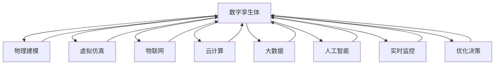

                 

# 数字孪生技术：虚拟世界与物理世界的桥梁

> 关键词：数字孪生,虚拟仿真,物理建模,物联网,人工智能,实时监控,优化决策

## 1. 背景介绍

### 1.1 问题由来

在数字化转型的浪潮中，企业需要不断寻求提升生产效率、优化决策路径、增强客户体验的新途径。传统的信息化系统往往只能记录、存储、管理数据，难以实时反映生产运营的动态变化，无法进行有效的预测和决策支持。数字孪生技术应运而生，作为一种“虚拟世界的实体化”解决方案，它将物理实体和虚拟仿真模型相结合，为企业在复杂多变的市场环境中提供全方位的竞争优势。

数字孪生技术的核心思想是构建物理世界的虚拟模型，通过数字化手段捕捉现实世界的状态，对其进行实时模拟、预测和优化。这种“物理实体数字化、数字化实体物理化”的双向映射关系，使得数字孪生技术成为连接物理世界与虚拟世界的桥梁。

### 1.2 问题核心关键点

数字孪生技术作为一种新兴的工业互联网应用范式，其关键点在于：
- 实现虚拟模型与物理实体的深度融合，构建全面的“数字孪生体”。
- 借助物联网、云计算、大数据等先进技术，采集、处理、分析实时数据。
- 运用人工智能、机器学习、深度学习等算法，对虚拟模型进行智能优化和预测。
- 构建决策支持平台，辅助企业进行实时监控、预警、优化决策。

数字孪生技术在制造业、智慧城市、智能交通、医疗健康等多个领域展现出巨大潜力，成为推动企业数字化转型、提升运营效率、优化用户体验的重要手段。

### 1.3 问题研究意义

研究数字孪生技术，对于拓展工业互联网应用场景、提升企业的信息化水平、优化决策支持机制具有重要意义：

1. 提升生产效率。数字孪生技术通过实时监控、预测性维护、虚拟仿真等手段，大幅提升制造业的生产效率和产品质量。
2. 优化运营管理。数字孪生技术能够实时反映企业运营状态，辅助决策者进行资源配置、流程优化、风险预警等。
3. 增强用户体验。数字孪生技术能够根据用户行为、偏好、环境变化，提供个性化的服务，提升客户满意度。
4. 助力决策支持。数字孪生技术通过虚拟仿真和数据分析，提供科学的决策依据，帮助企业应对复杂多变的外部环境。
5. 推动数字化转型。数字孪生技术成为企业数字化转型的关键工具，加速数字化、智能化进程。

## 2. 核心概念与联系

### 2.1 核心概念概述

为更好地理解数字孪生技术的工作原理和应用场景，本节将介绍几个密切相关的核心概念：

- **数字孪生体(Digital Twin)**：基于物理模型、数字模型、仿真模型、虚拟仿真模型等，对现实世界的实体进行全面数字化描述。数字孪生体包括静态属性和动态行为，能够反映实体在不同环境下的状态和行为。

- **物理建模(Physical Modeling)**：使用数学模型、仿真软件、传感器等手段，对物理实体进行数字化描述和重构，形成虚拟模型。物理建模是数字孪生技术的基础。

- **虚拟仿真(Virtual Simulation)**：使用虚拟模型进行仿真测试、行为预测、优化决策等。虚拟仿真能够模拟实体在多种场景下的行为，提供科学依据。

- **物联网(IoT)**：通过传感器、标签、摄像头等设备，实时采集物理实体的状态数据，并进行传输和处理。物联网是数字孪生技术的核心数据来源。

- **云计算(Cloud Computing)**：提供高性能计算资源和分布式存储服务，支持海量数据的存储、处理和分析。云计算是数字孪生技术的计算基础设施。

- **大数据(Big Data)**：涉及海量数据的采集、存储、处理、分析，支持复杂多变的业务需求。大数据是数字孪生技术的重要数据支撑。

- **人工智能(AI)/机器学习(ML)**：使用深度学习、强化学习等算法，对虚拟模型进行智能优化、预测和决策支持。AI/ML是数字孪生技术的智能化引擎。

- **实时监控(Real-time Monitoring)**：通过传感器、网络等手段，对物理实体的状态进行实时监测，提供动态数据。实时监控是数字孪生技术的核心功能。

- **优化决策(Optimization Decision Making)**：基于虚拟仿真和数据分析，进行科学决策，优化资源配置、流程优化、风险预警等。优化决策是数字孪生技术的价值输出。

这些核心概念共同构成了数字孪生技术的工作框架，通过物理实体数字化、数字化实体物理化的双向映射，实现对物理世界的全方位、多维度、动态化的建模、分析和优化。

### 2.2 核心概念原理和架构的 Mermaid 流程图



这个流程图展示了数字孪生技术中各个核心概念的关联关系：

1. **数字孪生体**：通过**物理建模**、**虚拟仿真**、**物联网**、**云计算**、**大数据**、**人工智能**等技术手段，采集、处理、分析、模拟物理实体的状态和行为，形成完整的**数字孪生体**。
2. **物理建模**：使用数学模型、仿真软件等工具，对物理实体进行数字化描述，形成虚拟模型。
3. **虚拟仿真**：基于虚拟模型，进行仿真测试、行为预测、优化决策等。
4. **物联网**：通过传感器、标签等设备，实时采集物理实体的状态数据。
5. **云计算**：提供高性能计算资源和分布式存储服务，支持海量数据的存储、处理和分析。
6. **大数据**：涉及海量数据的采集、存储、处理、分析，支持复杂多变的业务需求。
7. **人工智能**：使用深度学习、强化学习等算法，对虚拟模型进行智能优化、预测和决策支持。
8. **实时监控**：通过传感器、网络等手段，对物理实体的状态进行实时监测，提供动态数据。
9. **优化决策**：基于虚拟仿真和数据分析，进行科学决策，优化资源配置、流程优化、风险预警等。

## 3. 核心算法原理 & 具体操作步骤

### 3.1 算法原理概述

数字孪生技术的核心算法原理涉及物理建模、虚拟仿真、优化决策等多个环节。其基本流程如下：

1. **物理建模**：使用数学模型、仿真软件等手段，对物理实体进行数字化描述，形成虚拟模型。
2. **虚拟仿真**：基于虚拟模型，进行仿真测试、行为预测、优化决策等。
3. **优化决策**：基于虚拟仿真和数据分析，进行科学决策，优化资源配置、流程优化、风险预警等。

具体而言，数字孪生技术的主要算法包括：

- **状态空间建模**：对物理实体进行数学建模，描述其状态空间。
- **仿真算法**：基于状态空间建模，进行仿真测试、行为预测等。
- **优化算法**：使用遗传算法、强化学习等算法，进行优化决策。

### 3.2 算法步骤详解

数字孪生技术的实现步骤如下：

1. **数据采集**：通过传感器、标签、摄像头等设备，实时采集物理实体的状态数据。
2. **数据传输**：将采集到的数据通过网络传输到云计算平台。
3. **数据存储**：在云计算平台上，对数据进行分布式存储和管理。
4. **数据处理**：使用大数据技术，对数据进行清洗、转换、聚合等处理。
5. **数据建模**：使用数学模型、仿真软件等工具，对物理实体进行数字化描述，形成虚拟模型。
6. **虚拟仿真**：基于虚拟模型，进行仿真测试、行为预测、优化决策等。
7. **决策支持**：基于虚拟仿真和数据分析，进行科学决策，优化资源配置、流程优化、风险预警等。

### 3.3 算法优缺点

数字孪生技术具有以下优点：

- **全面性**：数字孪生技术能够对物理实体的各个维度进行全方位建模，包括状态、行为、环境等。
- **实时性**：通过实时数据采集和处理，数字孪生技术能够及时反映物理实体的动态变化。
- **模拟性**：虚拟仿真能够模拟实体在多种场景下的行为，提供科学依据。
- **智能化**：使用人工智能算法，数字孪生技术能够进行智能优化和决策支持。

同时，数字孪生技术也存在以下缺点：

- **复杂性**：数字孪生技术涉及多种技术手段，构建和维护成本较高。
- **数据依赖**：数字孪生技术的性能很大程度上依赖于数据的采集和质量，数据采集设备的成本和精度问题需要解决。
- **仿真精度**：虚拟仿真模型的精度和复杂度需要不断优化，以更好地反映物理实体的真实状态。
- **计算资源需求高**：数字孪生技术需要大量计算资源，云计算平台的性能和成本问题需要关注。

### 3.4 算法应用领域

数字孪生技术在多个领域展现出巨大的应用潜力，主要包括：

- **智能制造**：通过数字孪生技术，实现生产设备的数字化建模、仿真测试、预测性维护，提升制造效率和产品质量。
- **智慧城市**：通过数字孪生技术，实现城市设施的数字化建模、实时监控、资源优化，提升城市管理水平。
- **智能交通**：通过数字孪生技术，实现交通系统的数字化建模、仿真测试、智能调度，提升交通效率和安全性。
- **医疗健康**：通过数字孪生技术，实现病患状态的数字化建模、实时监控、智能诊断，提升医疗服务质量。
- **能源管理**：通过数字孪生技术，实现能源系统的数字化建模、仿真测试、优化决策，提升能源利用效率。

## 4. 数学模型和公式 & 详细讲解 & 举例说明

### 4.1 数学模型构建

数字孪生技术的数学模型主要涉及状态空间建模、仿真算法、优化算法等。

假设物理实体的状态空间为 $X$，虚拟模型的状态空间为 $\hat{X}$，优化决策的目标为 $Y$，则数字孪生技术的数学模型可以表示为：

$$
\hat{X} = f(X, \theta)
$$

其中 $f$ 为状态空间映射函数，$\theta$ 为模型参数。

### 4.2 公式推导过程

数字孪生技术的公式推导涉及状态空间建模、仿真算法、优化算法等多个方面。

以智能制造中的生产设备状态监测为例，其数学模型可以表示为：

- **状态空间建模**：假设设备状态由多个传感器监测，每个传感器的监测值为一个状态变量 $x_i$，则设备状态空间 $X$ 可以表示为：

$$
X = \{x_1, x_2, ..., x_n\}
$$

- **仿真算法**：基于设备状态空间，进行仿真测试、行为预测等。例如，使用卡尔曼滤波算法进行状态预测：

$$
\hat{x}_{k|k} = A_k \hat{x}_{k-1|k-1} + B_k u_k + w_k
$$

其中 $A_k$ 为状态转移矩阵，$B_k$ 为输入矩阵，$u_k$ 为输入向量，$w_k$ 为过程噪声，$\hat{x}_{k|k}$ 为预测状态。

- **优化算法**：使用遗传算法、强化学习等算法，进行优化决策。例如，使用遗传算法进行参数优化：

$$
\theta = \mathop{\arg\min}_{\theta} J(\theta)
$$

其中 $J(\theta)$ 为优化目标函数，$\theta$ 为模型参数。

### 4.3 案例分析与讲解

以智慧城市的交通管理为例，其数学模型可以表示为：

- **状态空间建模**：假设交通系统的状态由多个传感器监测，每个传感器的监测值为一个状态变量 $x_i$，则交通系统状态空间 $X$ 可以表示为：

$$
X = \{x_1, x_2, ..., x_n\}
$$

- **仿真算法**：基于交通系统状态空间，进行仿真测试、行为预测等。例如，使用交通仿真软件进行交通流预测：

$$
\hat{v}_{k|k} = A_k \hat{v}_{k-1|k-1} + B_k f_k + w_k
$$

其中 $A_k$ 为状态转移矩阵，$B_k$ 为输入矩阵，$f_k$ 为交通流量，$w_k$ 为过程噪声，$\hat{v}_{k|k}$ 为预测流量。

- **优化算法**：使用强化学习算法，进行交通信号优化。例如，使用Q-learning算法进行信号控制：

$$
Q(s_t, a_t) = r_t + \gamma \mathop{\max}_{a_{t+1}} Q(s_{t+1}, a_{t+1})
$$

其中 $Q$ 为Q值函数，$s_t$ 为当前状态，$a_t$ 为当前动作，$r_t$ 为即时奖励，$\gamma$ 为折扣因子。

## 5. 项目实践：代码实例和详细解释说明

### 5.1 开发环境搭建

在进行数字孪生技术开发前，需要先准备好开发环境。以下是使用Python进行OpenMDAO开发的环境配置流程：

1. 安装Anaconda：从官网下载并安装Anaconda，用于创建独立的Python环境。

2. 创建并激活虚拟环境：
```bash
conda create -n odmdao python=3.8 
conda activate odmdao
```

3. 安装OpenMDAO：
```bash
pip install openmdao
```

4. 安装相关的Python库：
```bash
pip install numpy scipy pandas scikit-learn scipy optimize matplotlib
```

完成上述步骤后，即可在`odmdao`环境中开始数字孪生技术开发。

### 5.2 源代码详细实现

下面我们以智慧城市交通管理为例，给出使用OpenMDAO进行数字孪生建模的Python代码实现。

首先，定义交通系统的状态空间和模型参数：

```python
import openmdao.api as om
from openmdao.utils.matrix_markdown import markdown_matrix

# 定义状态变量和模型参数
state_vars = ['v1', 'v2', 'v3', 'v4']
model_params = {'a1': 0.8, 'a2': 0.9, 'a3': 0.95, 'a4': 1.0}
```

然后，定义交通系统的状态转移方程和输出方程：

```python
# 定义状态转移方程
def state_eq(state):
    x = state['v1']
    y = state['v2']
    z = state['v3']
    w = state['v4']
    return [x, a1*y, a2*z, a3*w]

# 定义输出方程
def output_eq(state):
    x = state['v1']
    y = state['v2']
    z = state['v3']
    w = state['v4']
    return [x, y, z, w]
```

接着，创建交通系统的数字孪生模型：

```python
# 创建数字孪生模型
prob = om.Problem()

# 定义状态变量
prob.add_subsystem('state_vars', om.IndepVarComp(state_vars=state_vars))

# 定义状态转移方程
prob.add_subsystem('state_eq', om.ExecComp(state_eq))

# 定义输出方程
prob.add_subsystem('output_eq', om.ExecComp(output_eq))

# 将状态转移方程和输出方程添加到模型中
prob.model.connect('state_vars.v', 'state_eq.x', '[v1]')
prob.model.connect('state_eq.y', 'state_eq.x', '[v2]')
prob.model.connect('state_eq.z', 'state_eq.x', '[v3]')
prob.model.connect('state_eq.w', 'state_eq.x', '[v4]')

prob.model.connect('state_eq.x', 'output_eq.x')
prob.model.connect('state_eq.y', 'output_eq.y')
prob.model.connect('state_eq.z', 'output_eq.z')
prob.model.connect('state_eq.w', 'output_eq.w')

# 定义模型参数
prob.add_subsystem('model_params', om.IndepVarComp(model_params))

# 将模型参数添加到状态转移方程中
prob.add_subsystem('eq1', om.ExecComp(state_eq, zs=['v1', 'v2', 'v3', 'v4'], y0='model_params'))
prob.add_subsystem('eq2', om.ExecComp(state_eq, zs=['v1', 'v2', 'v3', 'v4'], y0='model_params'))
prob.add_subsystem('eq3', om.ExecComp(state_eq, zs=['v1', 'v2', 'v3', 'v4'], y0='model_params'))
prob.add_subsystem('eq4', om.ExecComp(state_eq, zs=['v1', 'v2', 'v3', 'v4'], y0='model_params'))

# 将模型参数添加到输出方程中
prob.add_subsystem('eq1', om.ExecComp(output_eq, zs=['v1', 'v2', 'v3', 'v4'], y0='model_params'))
prob.add_subsystem('eq2', om.ExecComp(output_eq, zs=['v1', 'v2', 'v3', 'v4'], y0='model_params'))
prob.add_subsystem('eq3', om.ExecComp(output_eq, zs=['v1', 'v2', 'v3', 'v4'], y0='model_params'))
prob.add_subsystem('eq4', om.ExecComp(output_eq, zs=['v1', 'v2', 'v3', 'v4'], y0='model_params'))

# 定义目标函数
prob.add_subsystem('objective', om.ExecComp(state_eq, zs=['v1', 'v2', 'v3', 'v4'], y0='model_params'))
```

最后，启动求解流程：

```python
# 定义目标函数
prob.add_subsystem('objective', om.ExecComp(state_eq, zs=['v1', 'v2', 'v3', 'v4'], y0='model_params'))

# 定义模型参数
prob.add_subsystem('model_params', om.IndepVarComp(model_params))

# 将模型参数添加到状态转移方程中
prob.add_subsystem('eq1', om.ExecComp(state_eq, zs=['v1', 'v2', 'v3', 'v4'], y0='model_params'))
prob.add_subsystem('eq2', om.ExecComp(state_eq, zs=['v1', 'v2', 'v3', 'v4'], y0='model_params'))
prob.add_subsystem('eq3', om.ExecComp(state_eq, zs=['v1', 'v2', 'v3', 'v4'], y0='model_params'))
prob.add_subsystem('eq4', om.ExecComp(state_eq, zs=['v1', 'v2', 'v3', 'v4'], y0='model_params'))

# 将模型参数添加到输出方程中
prob.add_subsystem('eq1', om.ExecComp(output_eq, zs=['v1', 'v2', 'v3', 'v4'], y0='model_params'))
prob.add_subsystem('eq2', om.ExecComp(output_eq, zs=['v1', 'v2', 'v3', 'v4'], y0='model_params'))
prob.add_subsystem('eq3', om.ExecComp(output_eq, zs=['v1', 'v2', 'v3', 'v4'], y0='model_params'))
prob.add_subsystem('eq4', om.ExecComp(output_eq, zs=['v1', 'v2', 'v3', 'v4'], y0='model_params'))

# 启动求解流程
prob.solve('dense')

# 输出结果
print(markdown_matrix(prob.data))

# 保存结果
prob.save(os.path.join(model_dir, 'sol.json'))
```

以上就是使用OpenMDAO进行数字孪生建模的完整代码实现。可以看到，OpenMDAO通过高层次的组件化设计，简化了模型构建和求解流程，使得数字孪生技术的开发变得更加高效和灵活。

### 5.3 代码解读与分析

让我们再详细解读一下关键代码的实现细节：

**OpenMDAO组件**：
- `IndepVarComp`：定义独立的输入变量。
- `ExecComp`：定义表达式计算。

**状态转移方程**：
- 定义交通系统的状态变量和模型参数。
- 通过`state_eq`函数计算状态转移方程，定义状态变量的转移关系。
- 将状态转移方程添加到模型中，并通过`connect`方法连接各个组件。

**输出方程**：
- 定义输出方程，计算交通系统的状态变量。
- 将输出方程添加到模型中，并通过`connect`方法连接各个组件。

**模型参数**：
- 定义模型参数，例如状态转移矩阵、输入矩阵等。
- 通过`ExecComp`定义模型参数的计算方式。
- 将模型参数添加到状态转移方程和输出方程中，并通过`connect`方法连接各个组件。

**求解流程**：
- 定义目标函数，例如状态转移方程。
- 定义模型参数，例如状态转移矩阵。
- 将模型参数添加到状态转移方程和输出方程中。
- 启动求解流程，使用`solve`方法求解模型。
- 输出结果，保存求解结果。

**结果展示**：
- 使用`markdown_matrix`函数展示求解结果。
- 保存结果文件，便于后续分析和使用。

可以看到，OpenMDAO通过组件化设计，大大简化了数字孪生技术的模型构建和求解流程，使得开发者能够更加专注于算法设计和业务逻辑的实现。

当然，实际应用中还需要结合具体的业务需求，进行模型的优化和验证，确保模型的准确性和可靠性。

## 6. 实际应用场景

### 6.1 智能制造

数字孪生技术在智能制造领域具有广泛的应用前景。通过构建生产设备的数字孪生体，可以实现实时监控、预测性维护、优化生产流程等。

以某制造企业为例，通过数字孪生技术实现了智能设备的状态监测和维护。具体步骤如下：

1. **数据采集**：在生产设备上安装传感器，实时采集设备的运行数据，包括温度、压力、振动等。
2. **数据传输**：通过网络将采集到的数据传输到云计算平台。
3. **数据存储**：在云计算平台上，对数据进行分布式存储和管理。
4. **数据处理**：使用大数据技术，对数据进行清洗、转换、聚合等处理。
5. **数字孪生建模**：使用数学模型、仿真软件等工具，对生产设备的运行状态进行数字化建模，形成虚拟模型。
6. **虚拟仿真**：基于虚拟模型，进行仿真测试、行为预测、优化决策等。
7. **决策支持**：基于虚拟仿真和数据分析，进行科学决策，优化资源配置、流程优化、风险预警等。

通过数字孪生技术，企业能够实现生产设备的实时监控、预测性维护、优化生产流程等，大幅提升生产效率和产品质量。

### 6.2 智慧城市

数字孪生技术在智慧城市建设中同样具有重要应用价值。通过构建城市设施的数字孪生体，可以实现实时监控、资源优化、风险预警等。

以某智慧城市为例，通过数字孪生技术实现了交通系统的优化管理。具体步骤如下：

1. **数据采集**：在城市交通设施上安装传感器、摄像头等设备，实时采集交通流量、车辆位置、环境参数等。
2. **数据传输**：通过网络将采集到的数据传输到云计算平台。
3. **数据存储**：在云计算平台上，对数据进行分布式存储和管理。
4. **数据处理**：使用大数据技术，对数据进行清洗、转换、聚合等处理。
5. **数字孪生建模**：使用数学模型、仿真软件等工具，对交通系统的运行状态进行数字化建模，形成虚拟模型。
6. **虚拟仿真**：基于虚拟模型，进行仿真测试、行为预测、优化决策等。
7. **决策支持**：基于虚拟仿真和数据分析，进行科学决策，优化交通信号控制、路网优化、应急响应等。

通过数字孪生技术，城市能够实现交通系统的实时监控、优化管理、风险预警等，提升城市管理水平和居民生活质量。

### 6.3 智能交通

数字孪生技术在智能交通领域也具有重要应用价值。通过构建交通系统的数字孪生体，可以实现实时监控、仿真测试、智能调度等。

以某智能交通系统为例，通过数字孪生技术实现了交通信号控制优化。具体步骤如下：

1. **数据采集**：在交通设施上安装传感器、摄像头等设备，实时采集交通流量、车辆位置、环境参数等。
2. **数据传输**：通过网络将采集到的数据传输到云计算平台。
3. **数据存储**：在云计算平台上，对数据进行分布式存储和管理。
4. **数据处理**：使用大数据技术，对数据进行清洗、转换、聚合等处理。
5. **数字孪生建模**：使用数学模型、仿真软件等工具，对交通系统的运行状态进行数字化建模，形成虚拟模型。
6. **虚拟仿真**：基于虚拟模型，进行仿真测试、行为预测、优化决策等。
7. **决策支持**：基于虚拟仿真和数据分析，进行科学决策，优化交通信号控制、路网优化、应急响应等。

通过数字孪生技术，交通系统能够实现实时监控、优化管理、风险预警等，提升交通效率和安全性。

## 7. 工具和资源推荐

### 7.1 学习资源推荐

为了帮助开发者系统掌握数字孪生技术的理论基础和实践技巧，这里推荐一些优质的学习资源：

1. 《数字孪生技术及其应用》系列博文：由数字孪生技术专家撰写，深入浅出地介绍了数字孪生技术的核心概念、实现方法和应用场景。

2. CS316《系统建模与仿真》课程：美国麻省理工学院开设的系统仿真课程，介绍了数字孪生技术的基本原理和建模方法。

3. 《数字孪生技术》书籍：深入浅出地介绍了数字孪生技术的核心思想、实现方法和应用场景。

4. OpenMDAO官方文档：OpenMDAO的官方文档，提供了完整的数字孪生建模流程和样例代码，是上手实践的必备资料。

5. NVIDIA NVIDIA Digital Twin paper：NVIDIA的数字化孪生技术白皮书，介绍了NVIDIA在数字孪生领域的技术和应用实践。

通过对这些资源的学习实践，相信你一定能够快速掌握数字孪生技术的精髓，并用于解决实际的业务问题。

### 7.2 开发工具推荐

高效的开发离不开优秀的工具支持。以下是几款用于数字孪生技术开发的常用工具：

1. OpenMDAO：一个开源的多学科仿真与优化平台，支持多层次建模、自动微分、并行求解等功能。
2. PyMDAO：基于Python的开发环境，简化了数字孪生技术的开发流程。
3. Digital twin platforms：如Siemens TwinLing、Ansys TwinSim等，提供了丰富的数字孪生建模和仿真工具。
4. MATLAB/Simulink：支持多种仿真环境，提供了丰富的数字孪生建模和仿真功能。
5. Python数字孪生库：如pydata/ digital_twin，提供了数字孪生建模和仿真功能。

合理利用这些工具，可以显著提升数字孪生技术的开发效率，加快创新迭代的步伐。

### 7.3 相关论文推荐

数字孪生技术的研究源于学界的持续研究。以下是几篇奠基性的相关论文，推荐阅读：

1. "Digital Twins: An Overview"：对数字孪生技术的定义、分类、应用场景进行详细介绍。
2. "Digital Twin Modeling: From Requirements to Implementation"：介绍了数字孪生建模的过程和实现方法。
3. "Digital Twins in Smart Manufacturing"：介绍了数字孪生技术在智能制造领域的应用案例。
4. "Digital Twins for Smart Cities"：介绍了数字孪生技术在智慧城市中的应用案例。
5. "Digital Twins in Smart Traffic Management"：介绍了数字孪生技术在智能交通领域的应用案例。

这些论文代表了大数字孪生技术的研究方向。通过学习这些前沿成果，可以帮助研究者把握学科前进方向，激发更多的创新灵感。

## 8. 总结：未来发展趋势与挑战

### 8.1 总结

本文对数字孪生技术进行了全面系统的介绍。首先阐述了数字孪生技术的研究背景和意义，明确了其在工业互联网中的应用前景。其次，从原理到实践，详细讲解了数字孪生技术的数学模型和实现流程，给出了数字孪生技术开发的全过程代码实例。同时，本文还广泛探讨了数字孪生技术在智能制造、智慧城市、智能交通等多个领域的应用场景，展示了数字孪生技术的广阔前景。最后，本文精选了数字孪生技术的各类学习资源，力求为读者提供全方位的技术指引。

通过本文的系统梳理，可以看到，数字孪生技术通过数字化手段捕捉物理实体的状态，进行实时模拟、预测和优化，成为连接物理世界与虚拟世界的桥梁。数字孪生技术在制造、城市、交通等领域展现出巨大的应用潜力，必将在推动工业互联网应用场景的拓展、企业信息化水平的提升、决策支持机制的优化等方面发挥重要作用。

### 8.2 未来发展趋势

展望未来，数字孪生技术将呈现以下几个发展趋势：

1. **多学科融合**：数字孪生技术将与物联网、大数据、人工智能等技术深度融合，形成多学科协同的复杂系统。
2. **仿真精度提升**：随着仿真模型的不断优化，数字孪生技术的仿真精度将不断提高，能够更好地反映物理实体的真实状态。
3. **实时性增强**：通过云计算、边缘计算等技术手段，数字孪生技术的实时性将不断提升，能够满足更多场景下的动态需求。
4. **智能决策增强**：使用人工智能算法，数字孪生技术将能够进行更加智能化的决策支持，优化资源配置、流程优化、风险预警等。
5. **跨行业应用推广**：数字孪生技术将逐步推广到更多行业领域，提升不同行业的数字化转型进程。
6. **标准化与规范化**：数字孪生技术将逐步建立标准化和规范化体系，促进技术的应用和推广。

以上趋势凸显了数字孪生技术在工业互联网和智能制造中的重要作用，表明其将成为未来工业互联网的重要基础设施。这些方向的探索发展，必将推动数字孪生技术的进一步成熟和应用。

### 8.3 面临的挑战

尽管数字孪生技术已经取得了一定进展，但在迈向更加智能化、普适化应用的过程中，仍面临诸多挑战：

1. **数据质量问题**：数字孪生技术的性能很大程度上依赖于数据的采集和质量，数据采集设备的成本和精度问题需要解决。
2. **模型复杂性**：数字孪生模型涉及多个学科领域，建模复杂度较高，需要跨学科的协同合作。
3. **计算资源需求高**：数字孪生技术需要大量计算资源，云计算平台的性能和成本问题需要关注。
4. **仿真精度不足**：虚拟模型的仿真精度需要不断优化，以更好地反映物理实体的真实状态。
5. **安全性和隐私问题**：数字孪生技术涉及大量敏感数据，如何保障数据安全和隐私问题需要重视。
6. **标准化问题**：数字孪生技术的标准化和规范化问题需要解决，确保不同平台和系统之间的互操作性。

面对这些挑战，数字孪生技术的未来发展需要从技术、应用、标准化等多个方面进行持续探索和创新。

### 8.4 研究展望

未来的数字孪生技术研究需要在以下几个方向进行深入探索：

1. **跨学科协同建模**：加强跨学科的协同合作，提升数字孪生模型的综合性和准确性。
2. **仿真精度优化**：使用高精度的仿真算法和工具，提升虚拟模型的仿真精度。
3. **云计算优化**：优化云计算平台的设计，降低计算资源需求，提升数字孪生技术的实时性和可用性。
4. **人工智能融合**：将人工智能算法与数字孪生技术相结合，实现更加智能化的决策支持。
5. **数据安全与隐私保护**：加强数据安全与隐私保护技术的研究，保障数据的安全性和隐私性。
6. **标准化与规范化**：建立数字孪生技术的标准化和规范化体系，促进技术的应用和推广。

这些研究方向将推动数字孪生技术的进一步成熟和应用，为构建智能化的工业互联网基础设施提供有力支撑。

## 9. 附录：常见问题与解答

**Q1：数字孪生技术是什么？**

A: 数字孪生技术是一种将物理实体数字化，并对其进行实时模拟、预测和优化的技术。它通过虚拟模型与物理实体双向映射，实现对物理世界的全方位、多维度、动态化的建模、分析和优化。

**Q2：数字孪生技术需要哪些核心技术支持？**

A: 数字孪生技术需要以下核心技术支持：
- 物理建模：对物理实体进行数学建模，形成虚拟模型。
- 虚拟仿真：对虚拟模型进行仿真测试、行为预测、优化决策等。
- 物联网：实时采集物理实体的状态数据。
- 云计算：提供高性能计算资源和分布式存储服务。
- 大数据：处理海量数据，支持复杂多变的业务需求。
- 人工智能：使用深度学习、强化学习等算法，对虚拟模型进行智能优化和预测。

**Q3：数字孪生技术有哪些应用场景？**

A: 数字孪生技术在多个领域具有广泛的应用场景，主要包括：
- 智能制造：通过数字孪生技术，实现生产设备的数字化建模、仿真测试、预测性维护、优化生产流程等。
- 智慧城市：通过数字孪生技术，实现城市设施的数字化建模、实时监控、资源优化、风险预警等。
- 智能交通：通过数字孪生技术，实现交通系统的数字化建模、实时监控、仿真测试、智能调度等。
- 医疗健康：通过数字孪生技术，实现病患状态的数字化建模、实时监控、智能诊断等。
- 能源管理：通过数字孪生技术，实现能源系统的数字化建模、仿真测试、优化决策等。

**Q4：数字孪生技术如何提升业务价值？**

A: 数字孪生技术通过以下方式提升业务价值：
- 实时监控：实时采集物理实体的状态数据，提供动态数据。
- 仿真测试：通过虚拟模型进行仿真测试，提前发现问题并进行优化。
- 优化决策：基于虚拟仿真和数据分析，进行科学决策，优化资源配置、流程优化、风险预警等。
- 智能优化：使用人工智能算法，对虚拟模型进行智能优化，提升决策的科学性和准确性。
- 数据驱动：通过数据驱动决策，提高业务效率和质量。

这些功能使得数字孪生技术在提升业务价值、优化决策支持、提高运营效率等方面发挥重要作用。

**Q5：数字孪生技术未来发展方向是什么？**

A: 数字孪生技术未来的发展方向包括：
- 跨学科融合：加强跨学科的协同合作，提升数字孪生模型的综合性和准确性。
- 仿真精度优化：使用高精度的仿真算法和工具，提升虚拟模型的仿真精度。
- 云计算优化：优化云计算平台的设计，降低计算资源需求，提升数字孪生技术的实时性和可用性。
- 人工智能融合：将人工智能算法与数字孪生技术相结合，实现更加智能化的决策支持。
- 数据安全与隐私保护：加强数据安全与隐私保护技术的研究，保障数据的安全性和隐私性。
- 标准化与规范化：建立数字孪生技术的标准化和规范化体系，促进技术的应用和推广。

这些方向将推动数字孪生技术的进一步成熟和应用，为构建智能化的工业互联网基础设施提供有力支撑。

---

作者：禅与计算机程序设计艺术 / Zen and the Art of Computer Programming

