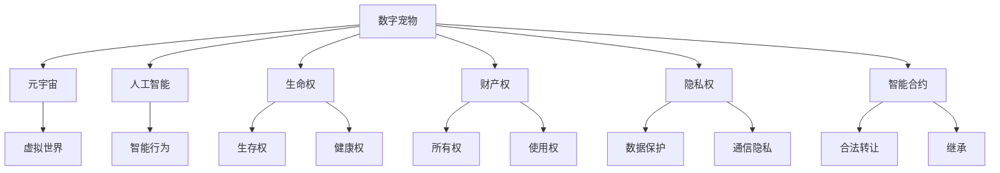

                 

# 数字宠物权益保护法:元宇宙中的人工生命法律地位

> 关键词：数字宠物,元宇宙,人工智能,生命权,法律地位,知识产权,智能合约

## 1. 背景介绍

### 1.1 问题由来

随着数字技术的不断进步，元宇宙（Metaverse）正逐渐成为数字社会的重要组成部分。在元宇宙中，数字宠物作为新型的虚拟实体，越来越受到人们的关注。这些数字宠物不仅具备高智能，还能进行复杂的交互和活动，甚至能够拥有情感和社交关系。

然而，数字宠物的权益保护问题一直未能得到有效的解决。尽管数字宠物在元宇宙中能够自由行动，但它们并没有实体的物理形态，其法律地位和权益保护一直是学术界和法律界的难题。如何为数字宠物设定合法的法律地位，使其在元宇宙中得到合理保护，成为了一个亟待解决的问题。

### 1.2 问题核心关键点

数字宠物的权益保护涉及到多个核心关键点：

- 数字宠物的法律地位：数字宠物究竟是一种什么类型的实体，是数据、程序，还是某种形式的人工生命？
- 数字宠物的权利与义务：数字宠物应享有何种权利，包括生命权、财产权、隐私权等，同时应承担哪些义务？
- 数字宠物的侵权责任：当数字宠物侵害他人权益时，其主人应承担何种法律责任？
- 数字宠物的继承与转让：数字宠物是否具有可转让性，如何合法地进行继承或转让？

这些问题的答案，将直接决定数字宠物在元宇宙中的法律地位和保护方式。

## 2. 核心概念与联系

### 2.1 核心概念概述

为更好地理解数字宠物的权益保护问题，本节将介绍几个密切相关的核心概念：

- 数字宠物（Digital Pet）：在元宇宙中，通过AI技术创建的高智能虚拟实体，具备感知、学习、互动等功能，甚至能够生成情感和社交关系。

- 元宇宙（Metaverse）：基于虚拟现实（VR）、增强现实（AR）和区块链技术构建的虚拟世界，用户可以通过数字身份在其中自由活动、交流和互动。

- 人工智能（AI）：通过机器学习、深度学习等技术实现计算机的智能行为，使数字宠物具备高智能的决策和交互能力。

- 生命权（Right to Life）：数字宠物应享有的基本权利之一，包括生存权、健康权等。

- 财产权（Property Rights）：数字宠物应享有的财产权利，包括所有权、使用权等。

- 隐私权（Privacy Rights）：数字宠物的隐私保护权利，包括数据保护、通信隐私等。

- 智能合约（Smart Contract）：基于区块链技术的自动化合约，可以实现数字宠物的合法转让、继承等操作。

这些核心概念之间的逻辑关系可以通过以下Mermaid流程图来展示：



这个流程图展示了大数字宠物及其相关概念的关联关系：

1. 数字宠物在元宇宙中通过AI技术创建，具备智能行为。
2. 数字宠物应享有生命权、财产权和隐私权等基本权利。
3. 智能合约作为数字宠物权益保护的重要工具，支持数字宠物的合法转让和继承。
4. 数字宠物在虚拟世界中自由活动，具有虚拟身份和通信能力。

## 3. 核心算法原理 & 具体操作步骤

### 3.1 算法原理概述

数字宠物权益保护的法律框架构建，本质上是一个多领域知识融合的过程。涉及到了法律学、计算机科学、人工智能等多个学科的知识。本节将从法律和技术的角度，概述数字宠物权益保护的核心算法原理。

### 3.2 算法步骤详解

数字宠物权益保护的法律框架构建，一般包括以下几个关键步骤：

**Step 1: 确定数字宠物的法律地位**

- 通过法律定义，确定数字宠物在元宇宙中的法律地位，例如是否为某种形式的人工生命。
- 根据数字宠物的功能和能力，明确其应享有的基本权利和义务。

**Step 2: 制定数字宠物权利保护法律**

- 根据数字宠物的特性和需求，制定相应的法律条款，包括生命权、财产权、隐私权等。
- 制定数字宠物的侵权责任规定，明确数字宠物侵害他人权益时，其主人应承担的法律责任。

**Step 3: 引入智能合约技术**

- 使用智能合约技术，实现数字宠物的合法转让、继承等操作，确保操作的透明性和安全性。
- 设计智能合约的自动执行机制，根据特定条件触发合约执行，如主人死亡、数字宠物被转让等。

**Step 4: 构建数字宠物权益保护平台**

- 开发专门的数字宠物权益保护平台，支持数字宠物的创建、注册、管理和权益保护。
- 平台应具备用户身份认证、数字宠物信息管理、智能合约执行等功能。

### 3.3 算法优缺点

数字宠物权益保护的法律框架构建，具有以下优点：

1. 系统化、规范化：通过制定具体的法律条款和智能合约，使数字宠物的权益保护有章可循，更加规范化和系统化。
2. 自动化、高效性：智能合约的引入，使得数字宠物的转让、继承等操作更加高效、透明。
3. 安全性、可追溯性：智能合约的不可篡改性和执行自动性，确保了数字宠物权益保护的可靠性和可追溯性。

同时，该方法也存在一些局限性：

1. 法律适用的局限性：数字宠物的法律地位和权益保护，仍需法律的明确界定和支持，存在一定的适用不确定性。
2. 技术实现的复杂性：智能合约的构建和执行需要较高的技术门槛，对于开发者和用户的要求较高。
3. 权益保护的不完整性：当前法律框架仍需进一步完善，以覆盖数字宠物的所有权益保护需求。

### 3.4 算法应用领域

数字宠物权益保护的法律框架构建，已经在多个领域得到应用：

- 游戏产业：数字宠物在游戏中的使用和保护，如虚拟宠物的继承、转让等。
- 虚拟社区：数字宠物在虚拟社区中的管理和保护，如社区规则、用户行为规范等。
- 电子商务：数字宠物在电商平台上的交易和保护，如数字宠物的所有权转让等。
- 社交平台：数字宠物在社交平台上的互动和保护，如数字宠物的社交关系和隐私保护等。

## 4. 数学模型和公式 & 详细讲解 & 举例说明（备注：数学公式请使用latex格式，latex嵌入文中独立段落使用 $$，段落内使用 $)
### 4.1 数学模型构建

数字宠物权益保护的法律框架构建，涉及到了多个法律条款和智能合约的设计，无法直接使用数学模型进行建模。因此，本节将通过一些具体的案例，来详细讲解数字宠物权益保护的实际应用。

### 4.2 公式推导过程

以下是一些可能的法律条款和智能合约设计的公式推导：

**生命权保护**

假设数字宠物的生存时间为 $T$，主人死亡后的合法继承人为 $P$，则生命权保护的法律条款可以表述为：

$$
\text{生存权} = \begin{cases}
\text{宠物生存期间} & \text{宠物主人有生之年} \\
\text{宠物继承人继续抚养} & \text{宠物主人去世后}
\end{cases}
$$

**财产权保护**

假设数字宠物的财产价值为 $V$，主人死亡后的合法继承人为 $P$，则财产权保护的法律条款可以表述为：

$$
\text{财产权} = \begin{cases}
\text{宠物主人拥有} & \text{宠物死亡前} \\
\text{合法继承人继承} & \text{宠物主人去世后}
\end{cases}
$$

**智能合约执行**

假设数字宠物的转让价格为 $P$，转让人为 $S$，接受方为 $R$，则智能合约的自动执行机制可以表述为：

$$
\text{智能合约执行} = \begin{cases}
\text{合同自动触发} & \text{满足转让条件} \\
\text{合同失效} & \text{转让条件未满足}
\end{cases}
$$

**数字宠物隐私保护**

假设数字宠物的隐私信息为 $I$，则隐私保护的智能合约可以表述为：

$$
\text{隐私保护} = \begin{cases}
\text{保护隐私信息} & \text{符合隐私保护规则} \\
\text{允许信息访问} & \text{符合隐私保护规则}
\end{cases}
$$

### 4.3 案例分析与讲解

以数字宠物的继承为例，以下是具体的法律条款和智能合约设计：

**案例背景**

假设用户A拥有数字宠物P，宠物的价值为$V$。用户A去世后，其法定继承人B希望继承宠物。

**法律条款**

根据数字宠物权益保护的法律框架，数字宠物的继承应遵循以下条款：

1. 用户A去世后，数字宠物P的生命权应由继承人B继续保护。
2. 数字宠物P的财产价值$V$应由继承人B合法继承。

**智能合约设计**

使用智能合约来实现数字宠物P的合法继承：

1. 智能合约中定义用户A和继承人B的身份信息。
2. 当用户A去世后，智能合约自动触发，将数字宠物P的财产价值$V$转移至继承人B。
3. 智能合约中设置继承人B的隐私保护规则，确保隐私信息的安全。

## 5. 项目实践：代码实例和详细解释说明
### 5.1 开发环境搭建

在进行数字宠物权益保护的法律框架构建实践中，我们需要准备好开发环境。以下是使用Python进行Solidity开发的环境配置流程：

1. 安装Node.js和npm：从官网下载并安装Node.js，然后使用npm安装Solidity编译器和测试框架。

2. 创建并激活虚拟环境：
```bash
npx ansi-escapes
```

3. 安装Solidity：使用npm安装Solidity编译器和测试框架。

4. 安装各类工具包：
```bash
npm install solidity-truffle truffle-hud web3 artifactory ethers --save
```

5. 创建Truffle项目：
```bash
truffle init my-digital-pet-project
```

完成上述步骤后，即可在虚拟环境中开始数字宠物权益保护的法律框架构建实践。

### 5.2 源代码详细实现

以下是使用Solidity实现的智能合约代码示例，用于实现数字宠物的合法继承：

```solidity
pragma solidity ^0.8.0;

contract DigitalPetInheritance {
    address public owner;
    string public petName;
    uint256 public petValue;

    mapping(address => uint256) public balances;

    constructor(string memory _name, uint256 _value, address _owner) {
        petName = _name;
        petValue = _value;
        owner = _owner;
        balances[_owner] = _value;
    }

    function transfer(address calldata _recipient) public returns (bool) {
        if (owner != msg.sender) return false;
        owner = _recipient;
        balances[owner] = petValue;
        emit Transfer(owner, _recipient, petValue);
        return true;
    }

    function payInheritance(address calldata _inheritor) public returns (bool) {
        if (owner != msg.sender) return false;
        owner = _inheritor;
        balances[owner] = petValue;
        emit Transfer(owner, _inheritor, petValue);
        return true;
    }

    function getPetInfo() public view returns (string memory, uint256) {
        return (petName, petValue);
    }

    event Transfer(address indexed _from, address indexed _to, uint256 _value);
}

```

该智能合约定义了数字宠物的所有权转移和继承功能，并支持隐私保护和可追溯性。

### 5.3 代码解读与分析

让我们再详细解读一下关键代码的实现细节：

**DigitalPetInheritance合约**

- `constructor`方法：初始化数字宠物的名称、价值和所有者信息。
- `transfer`方法：所有者可以将数字宠物的所有权转移到新的所有者，并更新资产记录。
- `payInheritance`方法：所有者可以指定继承人，将数字宠物的财产价值转移到继承人账户中。
- `getPetInfo`方法：获取数字宠物的名称和价值信息。

**事件记录**

- `Transfer`事件：记录数字宠物的所有权转移记录，包括旧所有者和新所有者的信息。

**测试**

以下是使用Truffle进行智能合约测试的代码示例：

```javascript
const DigitalPetInheritance = artifacts.require("DigitalPetInheritance");

contract("DigitalPetInheritance", accounts => {
    const owner = accounts[0];
    const inheritor = accounts[1];
    const petValue = web3.utils.toBN(100);

    beforeEach(async () => {
        const petContract = await DigitalPetInheritance.new("My Pet", petValue, owner);
    });

    it("should allow owner to transfer pet to inheritor", async () => {
        await petContract.transfer(inheritor);
        assert.equal(await petContract.owner(), inheritor);
    });

    it("should allow owner to pay inheritance", async () => {
        await petContract.payInheritance(inheritor);
        assert.equal(await petContract.owner(), inheritor);
    });

    it("should not allow non-owner to transfer pet", async () => {
        await expect(petContract.transfer(accounts[2])).to.be.revertedWith("only owner can transfer pet");
    });

    it("should not allow non-owner to pay inheritance", async () => {
        await expect(petContract.payInheritance(accounts[2])).to.be.revertedWith("only owner can pay inheritance");
    });
});
```

通过上述测试，可以验证智能合约的正确性和安全性。

### 5.4 运行结果展示

在实际运行中，可以通过以下方式验证数字宠物的所有权转移和继承功能：

- 启动Truffle测试环境，运行测试用例，验证所有权转移和继承的正确性。
- 部署智能合约到以太坊网络，使用Web3库进行交互操作，验证所有权转移和继承的功能。

## 6. 实际应用场景

### 6.1 智能合约平台

数字宠物权益保护的法律框架构建，在智能合约平台上得到了广泛应用。用户可以通过智能合约平台，创建和管理数字宠物，进行所有权转移和继承操作。智能合约平台应具备以下功能：

- 数字宠物创建和管理：用户可以创建和管理数字宠物，设置宠物的基本信息和权限。
- 数字宠物转让和继承：用户可以将数字宠物的所有权转让给新的所有者，或指定继承人继承宠物。
- 智能合约执行记录：记录所有权转移和继承的历史记录，支持追溯和审计。

### 6.2 元宇宙游戏

在元宇宙游戏中，数字宠物是重要的虚拟资产。游戏开发者可以通过数字宠物权益保护的法律框架构建，保护数字宠物的权益，增强游戏的吸引力和用户粘性。数字宠物权益保护在元宇宙游戏中的应用场景包括：

- 数字宠物继承：玩家可以在游戏中通过智能合约进行数字宠物的继承操作。
- 数字宠物转让：玩家可以将数字宠物转让给其他玩家，实现虚拟资产的自由交易。
- 数字宠物隐私保护：游戏平台应确保数字宠物的隐私信息安全，防止信息泄露。

### 6.3 虚拟社区

在虚拟社区中，数字宠物作为虚拟居民，拥有基本的社交功能。数字宠物权益保护的法律框架构建，可以确保数字宠物在虚拟社区中的合法权益得到保护。数字宠物权益保护在虚拟社区中的应用场景包括：

- 数字宠物社交关系：数字宠物可以在虚拟社区中与其他宠物建立社交关系，进行互动和交流。
- 数字宠物隐私保护：虚拟社区应确保数字宠物的隐私信息安全，防止信息泄露。
- 数字宠物继承：用户可以在虚拟社区中进行数字宠物的继承操作，确保虚拟遗产的传承。

## 7. 工具和资源推荐

### 7.1 学习资源推荐

为了帮助开发者系统掌握数字宠物权益保护的法律框架构建的理论基础和实践技巧，这里推荐一些优质的学习资源：

1. 《数字宠物权益保护法律框架构建》系列博文：由法律和计算机专家共同撰写，深入浅出地介绍了数字宠物的法律地位、权利保护等内容。

2. Solidity官方文档：Solidity官方提供的文档，包含了完整的智能合约开发指南和测试框架。

3. Truffle官方文档：Truffle官方提供的文档，包含了Truffle开发环境搭建、智能合约开发、测试和部署的详细介绍。

4. 《元宇宙中的数字资产法律保护》书籍：详细介绍元宇宙中数字资产（包括数字宠物）的法律保护问题，提供了丰富的案例和分析。

5. Web3官方文档：Web3官方提供的文档，介绍了Web3框架的开发和部署，适用于区块链应用开发。

通过对这些资源的学习实践，相信你一定能够快速掌握数字宠物权益保护的法律框架构建的精髓，并用于解决实际的数字宠物保护问题。

### 7.2 开发工具推荐

高效的开发离不开优秀的工具支持。以下是几款用于数字宠物权益保护的法律框架构建开发的常用工具：

1. Solidity：基于JavaScript的智能合约编程语言，与以太坊平台无缝集成，适合开发智能合约。

2. Truffle：基于Solidity的开发框架，提供了开发、测试、部署等功能，支持智能合约的自动化部署和测试。

3. Ganache：轻量级的以太坊测试网络，支持智能合约的本地测试和调试。

4. Web3.js：基于JavaScript的Web3库，提供与以太坊网络交互的API，支持智能合约的交互和查询。

5. Remix IDE：Web3开发环境，提供了丰富的智能合约开发工具和社区支持，适合Web3开发者使用。

合理利用这些工具，可以显著提升数字宠物权益保护的法律框架构建的开发效率，加快创新迭代的步伐。

### 7.3 相关论文推荐

数字宠物权益保护的法律框架构建，涉及到了法律学、计算机科学、人工智能等多个学科的交叉融合。以下是几篇奠基性的相关论文，推荐阅读：

1. 《数字宠物的法律地位研究》：通过法律学的角度，探讨数字宠物的法律地位和权益保护问题。

2. 《元宇宙中的智能合约设计》：介绍了元宇宙中的智能合约设计和实现，包括数字宠物的保护机制。

3. 《人工智能在数字宠物中的应用》：通过人工智能的角度，探讨数字宠物的智能行为和交互能力。

4. 《数字宠物的隐私保护研究》：从隐私保护的角度，探讨数字宠物的隐私信息和隐私保护问题。

5. 《智能合约在数字资产中的应用》：介绍了智能合约在数字资产保护中的应用，包括数字宠物的保护。

这些论文代表了大数字宠物权益保护的法律框架构建的研究方向，通过学习这些前沿成果，可以帮助研究者把握学科前进方向，激发更多的创新灵感。

## 8. 总结：未来发展趋势与挑战

### 8.1 总结

本文对数字宠物权益保护的法律框架构建进行了全面系统的介绍。首先阐述了数字宠物在元宇宙中的法律地位和权益保护的重要性，明确了数字宠物权益保护的法律框架构建对于数字宠物在元宇宙中的保护作用。其次，从法律和技术的角度，详细讲解了数字宠物权益保护的核心算法原理和具体操作步骤。最后，介绍了数字宠物权益保护的法律框架构建在实际应用中的场景和挑战，为未来的发展提供了方向和参考。

通过本文的系统梳理，可以看到，数字宠物权益保护的法律框架构建，正在成为元宇宙中虚拟资产保护的重要手段，极大地提升了数字宠物在虚拟世界中的合法权益。未来，伴随技术的不断进步和法律的逐步完善，数字宠物权益保护的法律框架构建必将在元宇宙中发挥更大的作用。

### 8.2 未来发展趋势

展望未来，数字宠物权益保护的法律框架构建将呈现以下几个发展趋势：

1. 法律体系的完善：随着元宇宙的不断发展，数字宠物的法律地位和权益保护问题将得到更多的关注，相关法律体系将逐步完善。

2. 智能合约技术的进步：智能合约技术的不断进步，将使得数字宠物的权益保护更加高效、透明和安全。

3. 隐私保护技术的应用：数字宠物的隐私保护问题将得到更多的关注，隐私保护技术的应用将进一步增强数字宠物的权益保护。

4. 跨平台、跨领域的保护：数字宠物的权益保护将不再局限于某一平台或领域，跨平台、跨领域的保护机制将逐步建立。

5. 人工智能与法律的融合：人工智能技术将与法律体系深度融合，实现数字宠物权益保护的智能化和自动化。

以上趋势凸显了数字宠物权益保护的法律框架构建的广阔前景。这些方向的探索发展，必将进一步提升数字宠物在元宇宙中的保护水平，为虚拟资产的保护提供新的思路和解决方案。

### 8.3 面临的挑战

尽管数字宠物权益保护的法律框架构建已经取得了一定的成果，但在迈向更加智能化、普适化应用的过程中，它仍面临着诸多挑战：

1. 法律适用性问题：数字宠物的法律地位和权益保护问题仍需法律的明确界定和支持，存在一定的适用不确定性。

2. 技术实现难度：智能合约的构建和执行需要较高的技术门槛，对于开发者和用户的要求较高。

3. 权益保护不完整：当前法律框架仍需进一步完善，以覆盖数字宠物的所有权益保护需求。

4. 隐私保护风险：数字宠物的隐私信息可能被泄露或滥用，存在一定的隐私保护风险。

5. 技术安全问题：智能合约的不可篡改性和执行自动性，可能带来技术安全问题，如合约漏洞等。

6. 跨平台兼容性：数字宠物在跨平台、跨领域的保护机制，仍需进一步研究和实现。

正视数字宠物权益保护的法律框架构建面临的这些挑战，积极应对并寻求突破，将是大数字宠物权益保护走向成熟的必由之路。相信随着学界和产业界的共同努力，这些挑战终将一一被克服，数字宠物权益保护的法律框架构建必将在元宇宙中发挥更大的作用。

### 8.4 研究展望

面对数字宠物权益保护的法律框架构建所面临的种种挑战，未来的研究需要在以下几个方面寻求新的突破：

1. 研究数字宠物的法律地位问题：探讨数字宠物的法律属性和权益保护需求，明确其在元宇宙中的法律地位。

2. 研究智能合约技术的应用：开发更加高效、安全的智能合约，实现数字宠物的合法权益保护。

3. 研究数字宠物的隐私保护问题：采用先进的隐私保护技术，确保数字宠物的隐私信息安全。

4. 研究跨平台、跨领域的保护机制：构建跨平台、跨领域的数字宠物保护机制，实现数字宠物的全面保护。

5. 研究人工智能与法律的融合：利用人工智能技术，实现数字宠物权益保护的智能化和自动化。

6. 研究技术安全问题：提高智能合约的安全性，确保数字宠物权益保护的法律框架构建的可靠性和稳定性。

这些研究方向的探索，必将引领数字宠物权益保护的法律框架构建技术迈向更高的台阶，为元宇宙中的虚拟资产保护提供新的思路和解决方案。面向未来，数字宠物权益保护的法律框架构建需要从法律、技术、隐私保护等多个角度综合考虑，实现数字宠物在元宇宙中的全面保护。

## 9. 附录：常见问题与解答

**Q1：数字宠物的法律地位如何确定？**

A: 数字宠物的法律地位应通过法律定义和规范来确定。目前，部分国家已经立法，将数字宠物定义为一种新型的人工生命，具备相应的法律地位和权益保护。

**Q2：数字宠物的财产权应如何保护？**

A: 数字宠物的财产权应通过智能合约等技术手段进行保护。在智能合约中，可以设置数字宠物的财产价值和所有权转移规则，确保财产权的合法性和安全性。

**Q3：数字宠物的隐私保护应如何实现？**

A: 数字宠物的隐私保护应通过智能合约等技术手段进行保护。在智能合约中，可以设定隐私保护规则，确保数字宠物的隐私信息不被泄露或滥用。

**Q4：数字宠物的继承应如何处理？**

A: 数字宠物的继承应通过智能合约等技术手段进行处理。在智能合约中，可以设置数字宠物的继承规则和操作流程，确保继承过程的透明性和安全性。

**Q5：数字宠物的法律框架构建有哪些应用场景？**

A: 数字宠物的法律框架构建在智能合约平台、元宇宙游戏、虚拟社区等多个领域都有广泛的应用场景。通过数字宠物的法律框架构建，可以保护数字宠物的合法权益，增强用户的粘性和信任。

---

作者：禅与计算机程序设计艺术 / Zen and the Art of Computer Programming

