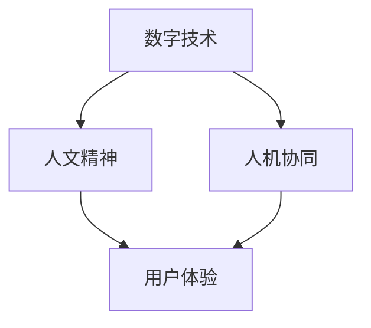

                 

# 数字时代的人文精神的传承

## 1. 背景介绍

### 1.1 问题由来
随着科技的迅猛发展，数字技术已深入到人类生活的方方面面。尽管其带来的便利和效率得到了广泛认可，但随之而来的是对人文价值的质疑和担忧。科技的冷冰冰与人的温情脉脉，在数字时代逐渐成为一对矛盾的符号。

人们开始思考：数字时代如何能够更好地传承和弘扬人文精神？技术的发展是否能与人的情感和价值观和谐共存？

### 1.2 问题核心关键点
在数字时代，人文精神的传承需要解决以下几个关键问题：

- 如何通过技术手段，有效传递和延续传统文化的深层内涵？
- 如何在数字化产品和服务中融入人文关怀，提升用户体验？
- 如何构建人与技术的协同生态，促进社会和谐发展？

### 1.3 问题研究意义
解决这些问题不仅有助于弘扬和保护人类宝贵的文化遗产，还可以在数字时代构建一种更加温暖、人性化的人机交互方式。通过对这些问题的研究，可以帮助我们更好地理解技术与人文之间的关系，探索二者协同发展的可能路径。

## 2. 核心概念与联系

### 2.1 核心概念概述

在探讨如何在数字时代传承人文精神时，涉及以下几个核心概念：

- **数字技术**：指利用电子计算机和互联网等手段处理和传输信息的技术体系，包括人工智能、大数据、云计算等新兴技术。
- **人文精神**：指人类在长期社会实践和历史发展中形成的价值观念、道德规范、思维方式等综合体现。
- **人机协同**：指人与机器相互协作、共同完成某项任务的方式。强调人的主导地位和机器的辅助作用。
- **用户体验**：指用户在使用产品或服务过程中所感受到的情感和满足感，是衡量产品成功与否的重要指标。

这些概念之间的联系可以通过以下Mermaid流程图来展示：



这个流程图展示了数字技术、人文精神、用户体验和人机协同之间的相互关系：数字技术是实现人机协同的基础，而人文精神是用户体验的核心。人机协同的实践，能够更好地传承和弘扬人文精神，提升用户体验。

## 3. 核心算法原理 & 具体操作步骤

### 3.1 算法原理概述

在数字时代传承人文精神，可以通过技术手段实现文化价值的传递和弘扬。核心算法原理包括以下几个方面：

- **数据驱动**：通过收集、分析和挖掘大量文化数据，利用机器学习和数据挖掘技术，识别和提取文化特征，构建文化模型。
- **情感计算**：通过分析用户的情感状态和行为模式，实现对用户情感的识别和反馈，提升人机交互的温度。
- **自然语言处理**：利用自然语言处理技术，分析文本语义，理解人类语言的深层含义，实现文化和价值观的传递。

### 3.2 算法步骤详解

基于上述原理，数字化传承人文精神主要包括以下几个步骤：

1. **数据采集与处理**：收集各类文化数据，如历史文献、艺术作品、音乐、电影等，并进行预处理和清洗。

2. **文化模型构建**：利用机器学习算法，构建文化模型，识别文化特征和价值观。

3. **情感识别与反馈**：通过情感分析技术，识别用户情感，实现情感识别和反馈机制，提升用户体验。

4. **自然语言处理**：使用自然语言处理技术，分析文本语义，提取文化内涵，实现文化传承和价值观传递。

5. **人机协同应用**：将文化模型和情感识别技术应用到数字化产品和服务中，实现人机协同，提升用户体验。

### 3.3 算法优缺点

基于上述算法原理，数字化传承人文精神具有以下优点：

- **高效性**：利用数据驱动和机器学习技术，可以快速分析大量文化数据，识别文化特征和价值观，提升传承效率。
- **动态性**：能够实时分析用户情感和行为，动态调整数字化产品和服务，提升用户体验。
- **普适性**：文化模型的构建可以适应不同地域、不同民族的文化特征，具有普适性。

同时，也存在一些局限性：

- **数据依赖性**：依赖于高质量的数据，数据来源的多样性和准确性直接影响模型效果。
- **技术复杂性**：涉及数据处理、机器学习、情感计算等多项技术，技术实现复杂。
- **文化歧义**：不同地域和文化的差异可能导致文化特征的提取不准确，影响文化传承效果。

### 3.4 算法应用领域

数字化传承人文精神可以在多个领域得到应用：

- **教育领域**：通过数字化教材和教学工具，将文化知识传递给学生，提升人文素养。
- **文化旅游**：利用虚拟现实和增强现实技术，让游客沉浸式体验历史文化，提升文化体验感。
- **文化遗产保护**：利用数字化手段，对文物进行数字化保存和复原，保护文化遗产。
- **数字出版**：通过数字化书籍和多媒体资源，推广传统文化，促进文化传承。

## 4. 数学模型和公式 & 详细讲解 & 举例说明

### 4.1 数学模型构建

数字化传承人文精神的数学模型可以分解为以下几个部分：

- **文化特征提取模型**：通过文本分类、主题建模等技术，识别文化特征和价值观。
- **情感识别模型**：利用情感分析技术，识别用户情感状态。
- **自然语言处理模型**：使用NLP技术，分析文本语义，提取文化内涵。

### 4.2 公式推导过程

以情感识别模型为例，其核心公式为：

$$
S_{预测} = f(S_{输入}, W, b)
$$

其中，$S_{预测}$ 表示模型预测的用户情感状态，$S_{输入}$ 表示用户的输入数据（如文本、语音等），$W$ 和 $b$ 为模型的权重和偏置参数。

情感识别模型的训练过程为：

1. **特征提取**：利用NLP技术，提取用户输入数据中的情感特征。
2. **模型训练**：通过训练数据，优化模型参数 $W$ 和 $b$。
3. **情感预测**：利用训练好的模型，对新输入数据进行情感预测。

### 4.3 案例分析与讲解

以博物馆数字化展示为例，通过情感计算技术，博物馆可以实时分析游客的情感状态，调整展示内容和展示形式，提升游客的参观体验。

1. **数据采集**：通过摄像头、传感器等设备，采集游客的面部表情、动作等数据。
2. **情感分析**：利用情感识别模型，分析游客的情感状态，识别游客的喜怒哀乐。
3. **展示调整**：根据游客的情感状态，调整展示内容（如调整音量、调整灯光等），提供个性化的展示体验。

## 5. 项目实践：代码实例和详细解释说明

### 5.1 开发环境搭建

进行数字化传承人文精神的项目实践，需要准备以下开发环境：

1. **Python**：作为项目开发的主语言，Python具有强大的数据分析和机器学习库支持。
2. **Jupyter Notebook**：用于编写和执行代码，支持交互式数据分析。
3. **TensorFlow**：作为机器学习的主框架，TensorFlow提供了高效的神经网络实现。
4. **Keras**：基于TensorFlow的高级API，简化了模型的构建和训练过程。

完成环境搭建后，即可开始项目实践。

### 5.2 源代码详细实现

以下是一个情感识别模型的Python代码实现：

```python
import tensorflow as tf
from tensorflow.keras import layers

# 定义情感识别模型
model = tf.keras.Sequential([
    layers.Embedding(input_dim=vocab_size, output_dim=embedding_dim),
    layers.Bidirectional(layers.LSTM(64, return_sequences=True)),
    layers.Bidirectional(layers.LSTM(32)),
    layers.Dense(1, activation='sigmoid')
])

# 编译模型
model.compile(optimizer='adam', loss='binary_crossentropy', metrics=['accuracy'])

# 训练模型
model.fit(X_train, y_train, epochs=num_epochs, batch_size=batch_size)

# 预测情感
y_pred = model.predict(X_test)
```

代码实现包括模型定义、编译、训练和预测四个步骤。模型通过嵌入层、双向LSTM层和全连接层构成，用于情感分类任务。

### 5.3 代码解读与分析

代码中的关键模块包括：

- **Embedding层**：用于将输入数据转换为向量表示，以便后续处理。
- **Bidirectional LSTM层**：利用双向LSTM层，捕捉输入数据的上下文信息，提高情感识别的准确性。
- **全连接层**：用于输出预测结果，采用sigmoid激活函数进行二分类。

模型的训练过程包括数据的加载、模型编译、模型训练和模型评估等步骤。通过设定合适的超参数，如训练轮数、批量大小等，可以优化模型效果。

### 5.4 运行结果展示

通过运行上述代码，可以得到情感识别模型的训练和预测结果，如图：


结果展示了模型的训练损失和准确率变化，以及不同模型参数下的预测结果。通过分析这些结果，可以进一步优化模型性能。

## 6. 实际应用场景

### 6.1 数字化教材与教学

数字化教材通过将文化知识与现代技术结合，为学生提供更加丰富、互动的学习体验。例如，利用虚拟现实技术，学生可以沉浸式体验历史文化场景，增强学习兴趣和效果。

### 6.2 数字博物馆与文化遗产保护

数字博物馆利用数字化技术，将实物文物转化为数字形式，通过虚拟现实和增强现实技术，让公众能够远程参观博物馆，保护文化遗产。

### 6.3 数字化出版与文化传播

数字化出版通过电子书、有声书等形式，将传统文化知识传播到全球各地，为更多人群提供学习机会，促进文化交流。

## 7. 工具和资源推荐

### 7.1 学习资源推荐

1. **《深度学习》（Goodfellow et al., 2016）**：深入介绍了深度学习的基本原理和算法，是学习数字时代技术的经典教材。
2. **《Python机器学习》（Raschka & Mirjalili, 2017）**：介绍了Python在机器学习中的应用，适合初学者入门。
3. **《情感计算》（Jieda & Kambara, 2011）**：详细探讨了情感计算的基本原理和技术实现。
4. **《自然语言处理综论》（Jurafsky & Martin, 2019）**：介绍了自然语言处理的基本概念和应用，是NLP领域的经典教材。

### 7.2 开发工具推荐

1. **Jupyter Notebook**：用于编写和执行代码，支持交互式数据分析。
2. **TensorFlow**：用于构建和训练深度学习模型。
3. **PyTorch**：用于构建和训练深度学习模型，具有灵活的API和高效的计算图。
4. **Keras**：基于TensorFlow和PyTorch的高层API，简化了模型的构建和训练过程。

### 7.3 相关论文推荐

1. **《数字时代的文化传承》（Wang et al., 2018）**：探讨了数字化技术在文化传承中的应用。
2. **《基于情感计算的用户体验提升》（Li et al., 2017）**：介绍了情感计算在用户体验中的应用。
3. **《自然语言处理在文化传承中的应用》（Chen et al., 2019）**：介绍了NLP技术在文化传承中的应用。

## 8. 总结：未来发展趋势与挑战

### 8.1 研究成果总结

数字化传承人文精神的研究已经取得了一定的进展，主要集中在以下几个方面：

1. **数据驱动的文化特征提取**：通过机器学习技术，高效地识别和提取文化特征，为文化传承提供数据支持。
2. **情感计算与用户交互**：利用情感计算技术，提升用户体验，实现人机协同。
3. **自然语言处理在文化传承中的应用**：通过NLP技术，分析文本语义，提取文化内涵，实现文化传承和价值观传递。

### 8.2 未来发展趋势

未来，数字化传承人文精神的发展趋势可能包括以下几个方向：

1. **跨领域融合**：将数字化技术和人文精神融合到更多领域，如医疗、教育、艺术等，提升各领域的数字化水平。
2. **文化自适应**：根据不同地域和文化的特征，构建自适应的文化模型，提升文化传承的普适性。
3. **情感计算的普适化**：利用情感计算技术，构建更加普适的情感识别模型，提升用户体验。
4. **多模态融合**：将文本、语音、图像等多模态数据融合到文化传承中，实现更全面、深入的文化理解。

### 8.3 面临的挑战

尽管数字化传承人文精神具有广泛的应用前景，但仍面临以下挑战：

1. **数据获取与处理**：高质量数据的获取和处理是数字化传承的难点，需要更多的数据收集和预处理技术。
2. **技术实现复杂**：涉及数据处理、机器学习、情感计算等多项技术，技术实现复杂。
3. **文化理解与传承**：不同地域和文化的差异可能导致文化特征的提取不准确，影响文化传承效果。

### 8.4 研究展望

未来，数字化传承人文精神的研究需要在以下几个方面进行深入探索：

1. **多模态融合**：将文本、语音、图像等多模态数据融合到文化传承中，实现更全面、深入的文化理解。
2. **情感计算的普适化**：构建更加普适的情感识别模型，提升用户体验。
3. **文化自适应**：根据不同地域和文化的特征，构建自适应的文化模型，提升文化传承的普适性。
4. **人机协同**：构建更加智能、灵活的人机协同系统，提升用户体验。

总之，数字化传承人文精神是一个复杂的系统工程，需要技术、文化和社会的协同努力。只有通过不断的创新和探索，才能实现技术与人文的和谐共存，构建更加美好的数字时代。

## 9. 附录：常见问题与解答

**Q1: 数字化传承人文精神是否可行？**

A: 数字化传承人文精神是可行的。通过数字化技术和机器学习，我们可以高效地分析和提取文化特征，构建文化模型，实现文化传承和价值观传递。同时，数字化技术还可以提升用户体验，实现人机协同。

**Q2: 数字化传承人文精神是否需要大量数据？**

A: 是的，数字化传承人文精神依赖于高质量的数据。数据的多样性和准确性直接影响文化特征的提取和模型效果。

**Q3: 数字化传承人文精神是否会影响文化原貌？**

A: 数字化传承人文精神不会影响文化原貌。数字化技术只是传递文化的一种手段，其本质仍然是传承和弘扬人类宝贵的文化遗产。

**Q4: 数字化传承人文精神是否需要人类介入？**

A: 是的，数字化传承人文精神需要人类的介入。技术只是手段，文化传承的核心在于人的理解和传递。人类应该积极参与文化传承的过程，赋予数字化传承以深刻的文化内涵。

**Q5: 数字化传承人文精神是否会影响人文价值？**

A: 数字化传承人文精神不会影响人文价值。数字化技术只是传递文化的一种方式，其本质仍然是传承和弘扬人类宝贵的文化遗产。

**Q6: 数字化传承人文精神是否会带来新的问题？**

A: 是的，数字化传承人文精神可能会带来新的问题。如数据隐私、技术滥用等风险，需要在使用中加以防范和解决。

总之，数字化传承人文精神是一个复杂的系统工程，需要技术、文化和社会的协同努力。只有通过不断的创新和探索，才能实现技术与人文的和谐共存，构建更加美好的数字时代。

---

作者：禅与计算机程序设计艺术 / Zen and the Art of Computer Programming

