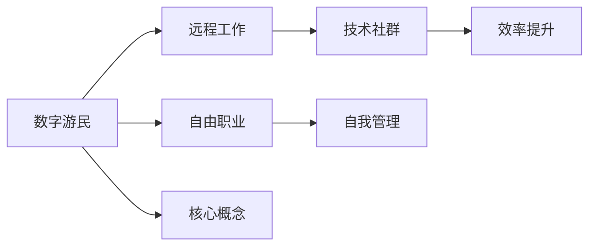

                 

# 数字游民：程序员的另一种生活方式

> 关键词：数字游民, 程序员, 远程工作, 自由职业, 远程工作环境, 工作效率, 技术社群, 自由职业文化, 自我管理, 生活方式

## 1. 背景介绍

随着科技的迅猛发展，尤其是互联网和云计算技术的普及，越来越多的程序员选择成为“数字游民”，即不再受限于传统的工作地点，通过互联网连接世界，实现自由职业和远程工作。这种生活方式不仅带来了工作灵活性和生活自由度，也带来了新的挑战和机遇。本文将深入探讨数字游民的生活方式，从背景介绍、核心概念、算法原理、数学模型、项目实践、应用场景、工具和资源、总结发展趋势与挑战等方面，全面剖析程序员的这种新型生活和工作方式。

## 2. 核心概念与联系

### 2.1 核心概念概述

数字游民是一种新型的就业方式，指的是通过互联网连接世界，不受地域限制，自由选择工作地点，以技术工作为生的一种生活方式。这种方式通常涉及远程工作和自由职业，赋予了程序员更多的时间和空间自由。

**核心概念：**
- **数字游民**：指以数字技术为手段，自由选择工作地点和时间的程序员。
- **远程工作**：指不局限于办公室环境，通过互联网远程接入公司系统进行工作的就业方式。
- **自由职业**：指不以固定雇主为依赖，通过提供个人技能、经验、创造力等进行自我管理和收入来源的就业方式。
- **自我管理**：指数字游民需要具备时间管理、任务管理和心理调适等多方面的能力。
- **技术社群**：指通过技术平台和社交媒体连接起来，共享资源和经验，相互支持和协作的社群。
- **效率提升**：指数字游民通过优化工作环境、工具和技术，提高工作效率和生活质量。

这些核心概念构成了数字游民的生活方式，并相互关联和影响，共同塑造了一个自由、灵活、创新的工作生态系统。

### 2.2 核心概念原理和架构的 Mermaid 流程图



这个流程图展示了数字游民生活方式的核心概念以及它们之间的联系。

## 3. 核心算法原理 & 具体操作步骤

### 3.1 算法原理概述

数字游民的生活方式虽然以自由和灵活为特色，但如何高效管理时间和任务，如何提升工作效率，如何构建技术社群，以及如何在不同的工作环境中保持高效，都是需要算法和技术支持的重要问题。本文将从算法原理的角度，探讨数字游民的生活方式及其优化。

### 3.2 算法步骤详解

#### 3.2.1 时间管理算法

时间管理是数字游民的核心任务之一。常见的算法包括：

- **GTD（Getting Things Done）**：通过将任务分解成具体的行动步骤，并将这些步骤记录下来，利用提醒和优先级排序等功能，帮助管理每日任务。

- **Pomodoro Technique**：将工作时间分为25分钟的高效工作和5分钟的休息时间，以提升专注度和效率。

- **番茄工作法**：结合了Pomodoro Technique和GTD，将时间管理与任务分解结合，通过番茄钟的提醒功能，实现任务的高效执行。

#### 3.2.2 任务管理算法

任务管理主要关注任务的安排和执行，常见算法包括：

- **Kanban**：一种可视化任务管理方法，通过看板（Kanban Board）展示任务状态，帮助可视化任务进度和资源分配。

- **Scrum**：敏捷开发中的任务管理方法，通过每日站会、Sprint规划和回顾等方式，提高团队协作效率和任务透明度。

- **Bruce Lee Method**：一种灵活的任务管理方法，通过设定长期目标、每日任务清单和优先级排序，实现灵活而高效的任务安排。

#### 3.2.3 效率提升算法

数字游民需要面对不同的工作环境，因此提升工作效率尤为重要。常见算法包括：

- **Zen Habits**：一种基于习惯培养的生活管理方法，通过建立良好的工作习惯，提升日常工作效率和生活质量。

- **Habit Loop**：基于行为科学的理论，通过设定奖励机制、习惯环路和持续反馈，帮助培养高效工作的习惯。

- **禅修**：通过冥想和正念练习，提升专注力、减少焦虑，从而提高工作效率。

### 3.3 算法优缺点

#### 3.3.1 时间管理算法

- **优点**：
  - 帮助明确任务和优先级，减少混乱和焦虑。
  - 提供明确的行动路径和步骤，提升执行效率。

- **缺点**：
  - 过于依赖工具和技术，缺乏灵活性。
  - 需要自我约束和纪律，容易陷入机械执行。

#### 3.3.2 任务管理算法

- **优点**：
  - 提供可视化任务状态和进度，便于实时调整。
  - 通过团队协作机制，提升任务透明度和效率。

- **缺点**：
  - 需要良好的团队沟通和协作，容易受到人际关系影响。
  - 复杂的流程和规则，可能会增加工作负担。

#### 3.3.3 效率提升算法

- **优点**：
  - 通过习惯培养和冥想等方法，提升整体工作效率。
  - 帮助减少焦虑和压力，提升工作和生活质量。

- **缺点**：
  - 需要长期的自我管理和坚持，容易中途放弃。
  - 部分方法过于理论化，需要逐步实践和调整。

### 3.4 算法应用领域

数字游民的生活方式不仅适用于技术职业，还广泛应用于多个领域。以下是一些主要的应用领域：

- **技术行业**：软件开发、数据分析、产品设计等。
- **教育领域**：在线教学、辅导、内容创作等。
- **内容创作**：博客、视频、音频、设计等。
- **自由职业**：市场营销、咨询、设计等。

数字游民的生活方式正逐渐成为一种新型的就业趋势，不仅限于技术职业，更涵盖了各个行业和领域。

## 4. 数学模型和公式 & 详细讲解 & 举例说明

### 4.1 数学模型构建

数字游民的生活方式可以通过数学模型进行建模和分析，以下是一个简化的数学模型框架：

- **时间管理模型**：
  $$
  T = \sum_{i=1}^n t_i
  $$
  其中 $T$ 为总时间，$t_i$ 为第 $i$ 个任务所需时间。

- **任务管理模型**：
  $$
  P = \sum_{i=1}^n p_i
  $$
  其中 $P$ 为总任务数，$p_i$ 为第 $i$ 个任务的优先级。

- **效率提升模型**：
  $$
  E = f(T, P, H)
  $$
  其中 $E$ 为效率，$T$ 为时间，$P$ 为优先级，$H$ 为习惯和心理状态。

### 4.2 公式推导过程

- **时间管理模型推导**：
  假设每个任务 $i$ 需要时间 $t_i$，总任务数为 $n$，则总时间为：
  $$
  T = \sum_{i=1}^n t_i
  $$
  通过任务分解和时间记录，可以计算每个任务所需时间，从而得到总时间。

- **任务管理模型推导**：
  假设每个任务 $i$ 的优先级为 $p_i$，总任务数为 $n$，则总任务数为：
  $$
  P = \sum_{i=1}^n p_i
  $$
  通过任务优先级排序和任务分配，可以优化任务执行顺序和资源分配。

- **效率提升模型推导**：
  假设时间管理为 $T$，任务管理为 $P$，习惯管理为 $H$，则效率 $E$ 可以通过如下函数计算：
  $$
  E = f(T, P, H)
  $$
  其中 $f$ 为效率提升函数，可以通过实验和调整找到最优值。

### 4.3 案例分析与讲解

#### 案例一：数字游民的时间管理

小明是一位数字游民，他每天需要完成若干任务，使用GTD方法记录每个任务所需时间，并通过每日回顾和调整，确保任务按时完成。具体步骤如下：

1. **任务分解**：将每个任务分解成具体的步骤，并记录所需时间。例如，编写代码任务可以分解为需求分析、设计、编码、测试等步骤。
2. **每日回顾**：每天早上，小明查看当天任务清单，并根据任务优先级进行排序。使用番茄工作法，每25分钟专注一个步骤，5分钟休息，确保高效执行。
3. **进度调整**：每日结束时，小明回顾任务完成情况，并记录实际所需时间，调整第二天的计划。

通过这种方式，小明能够有效管理时间，提升工作效率。

#### 案例二：数字游民的任务管理

小红是一位自由职业者，使用Kanban方法进行任务管理。具体步骤如下：

1. **看板设计**：小红在Kanban Board上创建四个列：待办任务、进行中任务、待审核任务和已完成任务。
2. **任务分配**：将每个任务分配到相应的列，并设定优先级。例如，客户需求优先级最高，技术任务其次。
3. **任务执行**：小红每日根据看板状态进行任务切换，确保每个任务按时完成。通过每日站会，讨论任务进度和障碍，及时调整计划。

通过这种方式，小红能够实时掌握任务进度，提升任务执行效率。

## 5. 项目实践：代码实例和详细解释说明

### 5.1 开发环境搭建

- **Python 环境**：使用Python 3.8，安装pip和virtualenv。
- **开发工具**：使用PyCharm、VSCode等IDE，安装Git、Docker等工具。
- **版本控制**：使用Git进行代码版本控制，定期提交代码。
- **容器化部署**：使用Docker容器化部署，提高环境一致性。

### 5.2 源代码详细实现

以下是一个基于GTD方法的时间管理示例代码：

```python
class GTDManager:
    def __init__(self):
        self.tasks = []
        self.reviewed = False
    
    def add_task(self, task):
        self.tasks.append(task)
    
    def execute_task(self):
        for task in self.tasks:
            self.tasks.remove(task)
            # 执行任务并记录时间
    
    def daily_review(self):
        if not self.reviewed:
            self.reviewed = True
            # 每日回顾并调整任务计划
```

### 5.3 代码解读与分析

通过这个示例代码，可以看到数字游民的时间管理如何通过Python实现。GTDManager类包含三个核心方法：添加任务、执行任务和每日回顾。通过Python的列表数据结构，可以轻松管理任务列表，并通过remove方法执行任务。每日回顾方法可以根据任务完成情况，调整第二天的计划。

### 5.4 运行结果展示

通过使用GTDManager类，数字游民可以有效地管理任务和时间，提升工作效率。例如，小明可以使用如下代码进行任务管理：

```python
# 创建GTDManager实例
manager = GTDManager()

# 添加任务
manager.add_task('编写代码')
manager.add_task('阅读文档')

# 执行任务
manager.execute_task()

# 每日回顾
manager.daily_review()
```

## 6. 实际应用场景

### 6.1 远程工作环境

远程工作环境是数字游民的核心场景，以下是一个简化的远程工作场景：

1. **网络连接**：通过稳定的网络连接，连接公司系统，进行远程办公。
2. **工作设备**：使用笔记本电脑、平板电脑等设备，随时随地办公。
3. **沟通协作**：通过邮件、即时通讯工具和视频会议等，与同事和客户进行沟通和协作。
4. **任务管理**：使用远程项目管理工具，跟踪任务进度和状态。
5. **时间管理**：使用远程时间管理工具，如Trello、Asana等，记录和规划时间。

### 6.2 自由职业文化

自由职业文化强调自我管理和灵活性，以下是一些自由职业的常见文化：

1. **自主决策**：自由职业者需要自主决定工作任务和时间安排，具有高度的自主性。
2. **自我激励**：通过设定目标和奖励机制，自我激励和驱动。
3. **灵活工作**：工作时间和地点不受限制，灵活安排。
4. **技能多样性**：自由职业者需要具备多样化的技能，以应对不同的工作任务。

### 6.3 效率提升技术

数字游民的工作效率可以通过多种技术手段提升，以下是一些常见方法：

1. **远程协作工具**：使用Slack、Microsoft Teams等远程协作工具，提升团队沟通效率。
2. **项目管理工具**：使用Trello、Asana等项目管理工具，跟踪任务进度和状态。
3. **时间管理工具**：使用Pomodoro、GTD等时间管理工具，提高工作效率。
4. **版本控制工具**：使用Git等版本控制工具，确保代码版本一致性。
5. **容器化部署**：使用Docker容器化部署，提高环境一致性。

## 7. 工具和资源推荐

### 7.1 学习资源推荐

为了帮助数字游民更好地适应和提升工作方式，以下推荐一些优质的学习资源：

1. **Coursera《The Science of Well-Being》**：通过学习幸福科学，提升自我管理和生活质量。
2. **Udemy《Digital Nomad Roadmap》**：系统介绍数字游民的职场转型和技能提升。
3. **LinkedIn Learning《Productivity for Creative Professionals》**：通过时间管理和任务管理，提升创意工作者的生产力。
4. **TED Talks《How to Succeed in the Age of the Digital Nomad》**：通过演讲分享数字游民的成功经验。
5. **Medium《The Ultimate Guide to Digital Nomadism》**：系统介绍数字游民的生活方式和技能提升。

### 7.2 开发工具推荐

为了支持数字游民的工作效率，以下推荐一些高效的工具：

1. **GitHub**：版本控制平台，用于代码管理和协作。
2. **Slack**：即时通讯工具，用于团队沟通和协作。
3. **Trello**：项目管理工具，用于任务管理。
4. **Google Drive**：云存储平台，用于文件管理和共享。
5. **Zoom**：视频会议工具，用于远程沟通和协作。

### 7.3 相关论文推荐

为了深入了解数字游民的生活方式和算法原理，以下推荐一些经典论文：

1. **《The Value of Work Life Balance for Digital Nomads: A Qualitative Study》**：研究数字游民工作与生活平衡的价值。
2. **《Digital Nomad Lifestyle: A Longitudinal Study》**：系统研究数字游民的生活方式和挑战。
3. **《The Impact of Digital Nomadism on Productivity and Well-being》**：研究数字游民的工作效率和心理状态。
4. **《Remote Work: A Review and Research Agenda》**：综述远程工作研究进展和未来方向。
5. **《Effective Time Management Techniques for Digital Nomads》**：系统介绍数字游民的时间管理方法和技巧。

## 8. 总结：未来发展趋势与挑战

### 8.1 研究成果总结

数字游民的生活方式正逐步成为新型的就业趋势，其核心在于通过技术手段提升工作效率和生活质量。目前，已有大量研究成果对数字游民的生活方式进行了系统研究，并在时间管理、任务管理、效率提升等方面提供了科学的方法和工具。

### 8.2 未来发展趋势

数字游民的生活方式将继续发展，并带来更多创新和应用：

1. **自动化工具**：通过自动化工具，提升数字游民的效率和生活质量。
2. **虚拟协作**：通过虚拟现实和增强现实技术，提升远程协作和沟通效果。
3. **人工智能**：通过人工智能技术，提升数字游民的工作效率和生活质量。
4. **区块链**：通过区块链技术，提升数字游民的财务管理和透明度。
5. **跨文化协作**：通过文化交流和协作，提升全球化工作能力。

### 8.3 面临的挑战

数字游民的生活方式虽然带来了许多便利，但也面临诸多挑战：

1. **工作效率**：需要具备高效的时间管理和任务管理能力，避免拖延和低效。
2. **心理状态**：需要应对孤独、压力和焦虑等问题，保持良好的心理状态。
3. **技能更新**：需要不断学习和更新技能，保持竞争力。
4. **远程协作**：需要具备良好的沟通和协作能力，避免团队合作障碍。
5. **财务管理**：需要良好的财务规划和管理，避免财务风险。

### 8.4 研究展望

未来的研究将继续关注数字游民的生活方式，并探索更多解决方案：

1. **自动化工具**：开发更多自动化工具，提升数字游民的工作效率和生活质量。
2. **心理健康**：关注数字游民的心理健康，提供心理支持和辅导。
3. **跨文化协作**：研究跨文化协作的策略和机制，提升全球化工作能力。
4. **可持续性**：研究数字游民的可持续生活方式，实现工作和生活的平衡。
5. **社区支持**：建立数字游民社区，提供交流和支持平台。

## 9. 附录：常见问题与解答

**Q1：数字游民如何保持高效工作？**

A: 数字游民可以通过以下方法保持高效工作：

1. **时间管理**：使用GTD、Pomodoro等方法，记录和规划时间。
2. **任务管理**：使用Kanban、Scrum等方法，跟踪任务进度和状态。
3. **效率提升**：使用禅修、习惯培养等方法，提升专注力和效率。

**Q2：数字游民如何应对孤独和压力？**

A: 数字游民可以通过以下方法应对孤独和压力：

1. **建立社交网络**：通过在线社交平台，与朋友和家人保持联系。
2. **定期沟通**：定期与家人和朋友视频通话，分享生活和工作中遇到的问题。
3. **心理支持**：通过心理咨询和辅导，缓解心理压力和焦虑。
4. **健康生活**：保持健康的生活方式，如运动、饮食和休息。

**Q3：数字游民如何保持技能更新？**

A: 数字游民可以通过以下方法保持技能更新：

1. **在线学习**：利用Coursera、Udemy等平台，学习新的技术和工具。
2. **参加会议和讲座**：参加技术会议和在线讲座，了解最新技术进展。
3. **加入社区**：加入技术社区和开源项目，与同行交流和合作。
4. **阅读和研究**：阅读技术书籍和研究论文，保持对新技术的敏感度。

**Q4：数字游民如何应对财务风险？**

A: 数字游民可以通过以下方法应对财务风险：

1. **财务规划**：制定详细的财务规划，预算和管理日常开支。
2. **副业收入**：通过副业和自由职业增加收入来源，降低财务风险。
3. **保险保障**：购买健康保险、旅行保险等，保障自身安全和健康。
4. **税务管理**：了解和遵守当地税务法规，合理规划税务。

总之，数字游民的生活方式需要综合考虑时间管理、任务管理、效率提升、心理健康、技能更新和财务管理等多个方面，通过科学方法和工具，实现高效、健康和可持续的工作生活。只有不断学习和适应，才能在数字游民的道路上越走越远。

