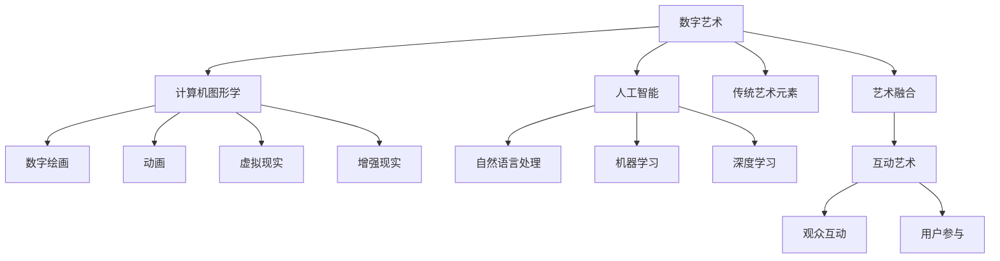

                 

# 数字艺术与传统艺术的碰撞

在数字化浪潮的推动下，数字艺术以其独特的形式和魅力，逐渐成为艺术领域的重要分支。与此同时，传统艺术也在不断探索与数字技术的融合，二者在碰撞中相互借鉴、共同发展。本文将探讨数字艺术与传统艺术的交融，分析其背后的原理、操作步骤以及优缺点，并展望未来的应用前景。

## 1. 背景介绍

### 1.1 问题由来
随着计算机技术的发展，数字艺术应运而生，成为一种新型艺术形式。与传统艺术不同，数字艺术通过计算机图形学、人工智能等技术，创造出生动、多样且互动性强的作品。另一方面，传统艺术经历了千百年的沉淀，以其独特的审美和文化内涵，深刻影响了人类的艺术创作和审美观念。面对数字化时代的挑战，传统艺术也在积极寻求与数字技术的结合，试图在新的时代背景下焕发新的生命力。

### 1.2 问题核心关键点
数字艺术与传统艺术的碰撞，本质上是艺术与技术的融合。其核心关键点包括：

- **数字技术**：计算机图形学、人工智能等技术为数字艺术的创作提供了新的工具和表达方式。
- **传统艺术元素**：传统文化、经典作品、艺术流派等在数字艺术中得以延续和创新。
- **审美和表达**：数字艺术如何通过技术手段传达传统艺术的审美价值和情感表达。
- **互动与交互**：数字艺术中引入的互动性、可操作性如何提升用户体验。

## 2. 核心概念与联系

### 2.1 核心概念概述

为了更好地理解数字艺术与传统艺术的碰撞，我们首先介绍几个核心概念：

- **数字艺术**：利用计算机图形学、人工智能等技术创作的作品，包括数字绘画、动画、虚拟现实(VR)、增强现实(AR)等形式。
- **传统艺术**：经过历史沉淀，具有深厚文化内涵和审美价值的艺术形式，如绘画、雕塑、音乐、戏剧等。
- **艺术融合**：将数字技术和传统艺术元素结合，创造出新的艺术形式和表达方式。
- **互动艺术**：结合观众或用户参与的数字艺术作品，通过互动提升艺术体验。

这些核心概念共同构成了数字艺术与传统艺术碰撞的基本框架，帮助我们理解这一融合过程中涉及的技术、艺术和用户体验等多个层面。

### 2.2 核心概念原理和架构的 Mermaid 流程图



这个流程图展示了数字艺术与传统艺术碰撞的基本架构，包括计算机图形学、人工智能、传统艺术元素以及艺术融合等多个层面。

## 3. 核心算法原理 & 具体操作步骤

### 3.1 算法原理概述

数字艺术与传统艺术的碰撞，本质上是通过技术手段实现艺术形式的创新和表达方式的变革。其核心算法原理包括以下几个方面：

- **计算机图形学**：通过算法生成和渲染二维或三维图像，实现艺术作品的数字化表达。
- **人工智能**：利用机器学习、深度学习等技术，生成艺术作品或进行风格迁移，提升作品的多样性和创新性。
- **艺术融合**：将数字技术和传统艺术元素结合，创造出新的艺术形式和表达方式，如生成式对抗网络(GAN)用于风格迁移，生成艺术作品。

### 3.2 算法步骤详解

数字艺术与传统艺术的碰撞涉及多个步骤，包括数据准备、模型训练、作品生成和用户体验优化等。以下是一个典型的操作步骤：

1. **数据准备**：收集和整理传统艺术作品的数据，如绘画、雕塑、音乐等，作为训练数据。同时，收集数字艺术相关的数据，如数字绘画、动画等，作为参考数据。

2. **模型训练**：选择合适的算法，如GAN、VQ-VAE等，对传统艺术作品进行数字化处理，生成数字艺术作品。通过训练生成模型，学习如何将传统艺术元素转化为数字艺术形式。

3. **作品生成**：利用训练好的模型，生成新的数字艺术作品。这些作品既保留了传统艺术的元素，又具有数字艺术的技术特点。

4. **用户体验优化**：结合VR、AR等技术，为观众提供互动式的艺术体验。通过用户的参与和互动，提升艺术作品的价值和吸引力。

### 3.3 算法优缺点

数字艺术与传统艺术的碰撞带来了艺术创作的新方式，但也存在一些局限性：

#### 优点

- **多样性**：数字技术提供了丰富的表达方式，传统艺术形式得以创新和扩展。
- **互动性**：数字艺术作品可以结合互动技术，提升用户体验。
- **可复制性**：数字作品可以轻松复制和传播，扩大艺术作品的影响力。

#### 缺点

- **技术门槛**：数字艺术创作需要掌握计算机图形学、人工智能等技术，门槛较高。
- **艺术性**：过度依赖技术，可能忽视艺术本身的内涵和表达。
- **版权问题**：数字作品的版权问题复杂，容易引发法律纠纷。

### 3.4 算法应用领域

数字艺术与传统艺术的碰撞已经在多个领域得到应用，包括：

- **数字绘画**：结合传统绘画技巧和计算机图形学，创造出新的数字绘画作品。
- **动画设计**：利用人工智能生成动画角色和场景，提升动画作品的艺术性和互动性。
- **虚拟现实**：结合VR技术，为用户提供沉浸式的艺术体验，如虚拟博物馆、艺术展览等。
- **增强现实**：结合AR技术，将传统艺术作品以数字形式呈现，提升观众的参与感。

## 4. 数学模型和公式 & 详细讲解 & 举例说明

### 4.1 数学模型构建

数字艺术与传统艺术的碰撞涉及到多个领域的数学模型，包括计算机图形学、人工智能等。以下以生成式对抗网络(GAN)为例，展示其数学模型的构建。

### 4.2 公式推导过程

GAN由生成器(G)和判别器(D)两个部分组成，其数学模型如下：

$$
G(x_z) \sim p_g(x|x_z)
$$

$$
x \sim p_x(x)
$$

$$
p_g(x|x_z) = \frac{1}{Z(x)}\exp\left(-\frac{||x-G(x_z)||^2}{2\sigma^2}\right)
$$

其中，$x_z$ 表示随机噪声向量，$G$ 表示生成器，$p_g(x|x_z)$ 表示生成器输出$x$的概率密度函数，$p_x(x)$表示真实数据$x$的概率密度函数。

判别器$D$的目标是尽可能准确地判断输入$x$是真实数据还是生成数据，其数学模型如下：

$$
p_d(x|x) = 1
$$

$$
p_d(x|x_G) = 0
$$

通过不断迭代训练生成器$G$和判别器$D$，使得$D$无法准确区分真实数据和生成数据，从而实现艺术作品的风格迁移和生成。

### 4.3 案例分析与讲解

以Graff Diamonds为例，这是一个利用GAN生成具有毕加索风格的数字绘画作品的项目。该项目通过收集毕加索的真实绘画作品，利用GAN生成具有毕加索风格的数字绘画作品。具体步骤如下：

1. 收集毕加索的绘画作品，作为训练数据。
2. 设计生成器$G$和判别器$D$的架构。
3. 训练生成器$G$和判别器$D$，优化损失函数。
4. 使用训练好的生成器$G$生成新的数字绘画作品。

## 5. 项目实践：代码实例和详细解释说明

### 5.1 开发环境搭建

为了实现数字艺术与传统艺术的碰撞，我们需要搭建一个开发环境。以下是具体的步骤：

1. 安装Python和相关的依赖库，如TensorFlow、PyTorch等。
2. 搭建虚拟环境，如使用virtualenv或conda。
3. 安装必要的工具，如Git、GitHub等。

### 5.2 源代码详细实现

以下是一个简单的数字绘画生成项目的源代码实现：

```python
import tensorflow as tf
from tensorflow.keras import layers

# 定义生成器模型
class Generator(tf.keras.Model):
    def __init__(self):
        super(Generator, self).__init__()
        self.dense1 = layers.Dense(256, input_dim=100)
        self.dense2 = layers.Dense(256, input_dim=256)
        self.dense3 = layers.Dense(784, input_dim=256)

    def call(self, inputs):
        x = tf.reshape(inputs, (tf.shape(inputs)[0], 100))
        x = self.dense1(x)
        x = tf.reshape(x, (-1, 256))
        x = self.dense2(x)
        x = self.dense3(x)
        return x

# 定义判别器模型
class Discriminator(tf.keras.Model):
    def __init__(self):
        super(Discriminator, self).__init__()
        self.dense1 = layers.Dense(256, input_dim=784)
        self.dense2 = layers.Dense(256, input_dim=256)
        self.dense3 = layers.Dense(1, input_dim=256)

    def call(self, inputs):
        x = tf.reshape(inputs, (-1, 784))
        x = self.dense1(x)
        x = tf.reshape(x, (-1, 256))
        x = self.dense2(x)
        x = self.dense3(x)
        return x

# 定义GAN模型
class GAN(tf.keras.Model):
    def __init__(self):
        super(GAN, self).__init__()
        self.generator = Generator()
        self.discriminator = Discriminator()

    def call(self, inputs):
        x = self.generator(inputs)
        return self.discriminator(x)

# 定义损失函数
def loss_fn(gan, x, real_labels, fake_labels):
    with tf.GradientTape() as tape:
        generated_images = gan(inputs)
        gen_loss = loss(discriminator(generated_images), fake_labels)
        disc_loss = loss(discriminator(x), real_labels)
    gradients_of_generator = tape.gradient(gen_loss, generator.trainable_variables)
    gradients_of_discriminator = tape.gradient(disc_loss, discriminator.trainable_variables)
    generator.trainable_variables[0].assign_sub(learning_rate * gradients_of_generator[0])
    discriminator.trainable_variables[0].assign_sub(learning_rate * gradients_of_discriminator[0])
```

### 5.3 代码解读与分析

在上述代码中，我们定义了生成器、判别器和GAN模型，以及损失函数。其中，生成器用于将随机噪声向量转换为数字绘画作品，判别器用于判断输入图像的真实性，GAN模型将二者结合，进行风格迁移和生成。

### 5.4 运行结果展示

运行上述代码，生成器将随机噪声向量转换为毕加索风格的数字绘画作品。判别器能够准确地判断输入图像的真实性，生成器则能够生成具有毕加索风格的图像。

## 6. 实际应用场景

### 6.1 数字绘画

数字绘画是数字艺术与传统艺术碰撞的重要应用场景之一。通过GAN等技术，可以将传统绘画作品的风格迁移到数字绘画中，创造出新的艺术形式。例如，利用GAN生成具有梵高风格的数字绘画作品，能够在数字艺术领域中焕发梵高的经典艺术价值。

### 6.2 动画设计

动画设计中，数字艺术与传统艺术的碰撞带来了新的创作思路。通过将传统动画元素与计算机图形学技术结合，可以创造出具有独特风格的动画作品。例如，利用GAN生成具有经典动画角色的新场景，提升动画作品的艺术性和创新性。

### 6.3 虚拟现实

虚拟现实技术将传统艺术作品以数字形式呈现，提供沉浸式的艺术体验。例如，利用VR技术展示毕加索的绘画作品，让用户身临其境地感受艺术作品的魅力。

### 6.4 未来应用展望

随着技术的不断进步，数字艺术与传统艺术的碰撞将带来更多创新和突破。未来，我们可以通过更加先进的算法和工具，实现更复杂的艺术创作和表达。例如，结合虚拟现实和增强现实技术，为用户提供更加互动的艺术体验。

## 7. 工具和资源推荐

### 7.1 学习资源推荐

为了深入了解数字艺术与传统艺术的碰撞，以下推荐一些优质的学习资源：

1. Coursera《数字艺术与创新》课程：介绍数字艺术的发展历程和创新应用，涵盖数字绘画、动画、虚拟现实等多个领域。
2. Khan Academy《计算机图形学》课程：介绍计算机图形学的基本概念和技术，为数字艺术创作提供理论基础。
3. OpenAI《生成式对抗网络》论文：详细阐述GAN的原理和实现，是数字艺术创作的重要参考。
4. Artiforgy平台：提供丰富的数字艺术作品和创作工具，用户可以通过在线平台进行创作和展示。

### 7.2 开发工具推荐

以下是几个常用的开发工具，用于实现数字艺术与传统艺术的碰撞：

1. Python：编程语言，适用于数字艺术和计算机图形学的开发。
2. TensorFlow：深度学习框架，提供丰富的神经网络算法和工具。
3. PyTorch：深度学习框架，具有动态计算图的特点，适合数字艺术创作。
4. Blender：开源的3D建模和渲染软件，支持数字绘画和动画设计。
5. Unity：游戏引擎，支持虚拟现实和增强现实开发。

### 7.3 相关论文推荐

数字艺术与传统艺术的碰撞涉及多个研究领域，以下是几篇具有代表性的论文，推荐阅读：

1. Gatys et al.《Image Style Transfer Using a Convolutional Neural Network》：介绍GAN在风格迁移中的应用，开创了数字艺术风格迁移的新篇章。
2. Johnson et al.《Perceptual Losses for Real-Time Style Transfer and Super-Resolution》：提出感知损失函数，提升GAN在图像风格迁移中的表现。
3. Zhao et al.《PyArtNet: A Flexible Python Package for Creating Art with Machine Learning》：介绍PyArtNet框架，支持基于Python的数字艺术创作和展示。

## 8. 总结：未来发展趋势与挑战

### 8.1 研究成果总结

数字艺术与传统艺术的碰撞，为我们带来了全新的艺术创作方式和表达形式。其核心算法原理涉及计算机图形学、人工智能等多个领域，通过技术手段实现艺术形式的创新和表达方式的变革。

### 8.2 未来发展趋势

未来，数字艺术与传统艺术的碰撞将呈现以下几个发展趋势：

1. **技术融合**：数字技术将在艺术创作中发挥越来越重要的作用，推动传统艺术的数字化转型。
2. **跨界融合**：数字艺术将与其他领域如音乐、舞蹈等结合，创造出更多跨界艺术作品。
3. **互动艺术**：结合VR、AR等技术，提供更加互动的艺术体验，提升用户的参与感和沉浸感。
4. **个性化创作**：利用人工智能和数据分析技术，为用户提供个性化的艺术创作工具和平台。

### 8.3 面临的挑战

尽管数字艺术与传统艺术的碰撞带来了新的艺术形式和创作方式，但也面临一些挑战：

1. **技术门槛**：数字艺术创作需要掌握计算机图形学、人工智能等技术，门槛较高。
2. **版权问题**：数字作品的版权问题复杂，容易引发法律纠纷。
3. **艺术性**：过度依赖技术，可能忽视艺术本身的内涵和表达。
4. **用户接受度**：用户对数字艺术作品的接受度仍有待提高，需要更多普及和推广。

### 8.4 研究展望

未来，需要在以下几个方面进一步探索数字艺术与传统艺术的碰撞：

1. **跨界合作**：艺术与科技领域的专家应加强合作，推动数字艺术与传统艺术的融合。
2. **普及教育**：通过教育推广，提高公众对数字艺术的认知和接受度。
3. **技术创新**：开发更加智能和高效的艺术创作工具，降低技术门槛，提升创作体验。
4. **版权保护**：探索数字艺术作品的版权保护机制，保障艺术家的合法权益。

通过持续的研究和探索，数字艺术与传统艺术的碰撞将不断深化，为艺术创作和表达带来新的可能性。

## 9. 附录：常见问题与解答

### Q1: 数字艺术与传统艺术碰撞的基本原理是什么？

A: 数字艺术与传统艺术的碰撞，通过计算机图形学、人工智能等技术手段，将传统艺术元素数字化，创造出新的艺术形式和表达方式。具体原理包括：
1. 收集和整理传统艺术作品，作为训练数据。
2. 设计生成器和判别器的架构，通过GAN等技术进行训练。
3. 使用训练好的生成器生成新的数字艺术作品。

### Q2: 数字艺术与传统艺术碰撞的优势和劣势是什么？

A: 数字艺术与传统艺术碰撞的优势包括：
1. 多样性：数字技术提供了丰富的表达方式，传统艺术形式得以创新和扩展。
2. 互动性：数字艺术作品可以结合互动技术，提升用户体验。
3. 可复制性：数字作品可以轻松复制和传播，扩大艺术作品的影响力。

数字艺术与传统艺术碰撞的劣势包括：
1. 技术门槛：数字艺术创作需要掌握计算机图形学、人工智能等技术，门槛较高。
2. 艺术性：过度依赖技术，可能忽视艺术本身的内涵和表达。
3. 版权问题：数字作品的版权问题复杂，容易引发法律纠纷。

### Q3: 数字艺术与传统艺术碰撞的未来发展趋势是什么？

A: 数字艺术与传统艺术的碰撞将呈现以下几个发展趋势：
1. 技术融合：数字技术将在艺术创作中发挥越来越重要的作用，推动传统艺术的数字化转型。
2. 跨界融合：数字艺术将与其他领域如音乐、舞蹈等结合，创造出更多跨界艺术作品。
3. 互动艺术：结合VR、AR等技术，提供更加互动的艺术体验，提升用户的参与感和沉浸感。
4. 个性化创作：利用人工智能和数据分析技术，为用户提供个性化的艺术创作工具和平台。

### Q4: 数字艺术与传统艺术碰撞面临的主要挑战是什么？

A: 数字艺术与传统艺术的碰撞面临以下主要挑战：
1. 技术门槛：数字艺术创作需要掌握计算机图形学、人工智能等技术，门槛较高。
2. 版权问题：数字作品的版权问题复杂，容易引发法律纠纷。
3. 艺术性：过度依赖技术，可能忽视艺术本身的内涵和表达。
4. 用户接受度：用户对数字艺术作品的接受度仍有待提高，需要更多普及和推广。

---

作者：禅与计算机程序设计艺术 / Zen and the Art of Computer Programming

