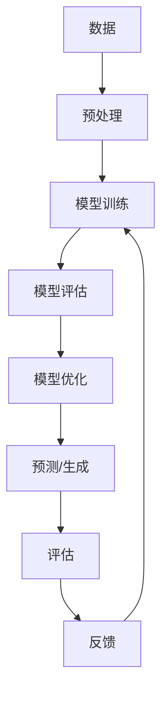

                 

**算力提升推动大模型发展**

**作者：禅与计算机程序设计艺术 / Zen and the Art of Computer Programming**

## 1. 背景介绍

当前，人工智能（AI）和大模型（Large Language Models，LLMs）正处于快速发展的时期。这些模型的能力和复杂性与其背后的计算能力密切相关。本文将探讨算力提升如何推动大模型的发展，并深入研究核心概念、算法、数学模型，以及项目实践和应用场景。

## 2. 核心概念与联系

### 2.1 算力与大模型

算力是指计算机系统每秒钟能够执行的指令数。对于大模型来说，算力至关重要，因为大模型需要处理海量数据，进行复杂的计算，以学习和优化模型参数。



### 2.2 大模型的特点

大模型具有以下特点：

- **参数量大**：大模型的参数量通常在数百万到数十亿之间。
- **数据量大**：大模型需要大量的数据进行训练。
- **计算量大**：大模型的训练和推理需要大量的计算资源。

## 3. 核心算法原理 & 具体操作步骤

### 3.1 算法原理概述

大模型的核心算法是深度学习算法，其中包括神经网络、循环神经网络（RNN）、长短期记忆网络（LSTM）、注意力机制等。这些算法的目标是学习模型参数，以最小化预测误差。

### 3.2 算法步骤详解

大模型的训练过程包括以下步骤：

1. **数据预处理**：清洗、标记、切分数据集。
2. **模型初始化**：随机初始化模型参数。
3. **前向传播**：计算模型的输出。
4. **损失计算**：计算模型的预测误差。
5. **反向传播**：计算模型参数的梯度。
6. **参数更新**：使用梯度下降等优化算法更新模型参数。
7. **模型评估**：在验证集上评估模型的性能。
8. **模型优化**：调整学习率、批量大小等超参数，优化模型。

### 3.3 算法优缺点

**优点**：

- 可以学习复杂的非线性关系。
- 可以处理结构化和非结构化数据。
- 可以进行端到端学习，无需特征工程。

**缺点**：

- 计算资源需求高。
- 训练时间长。
- 易受过拟合影响。

### 3.4 算法应用领域

大模型在自然语言处理（NLP）、计算机视觉、推荐系统等领域有着广泛的应用。它们可以进行文本生成、图像识别、个性化推荐等任务。

## 4. 数学模型和公式 & 详细讲解 & 举例说明

### 4.1 数学模型构建

大模型的数学模型通常是神经网络模型。神经网络由输入层、隐藏层和输出层组成。每层包含若干个神经元，神经元之间通过权重连接。

### 4.2 公式推导过程

给定输入 $\mathbf{x} \in \mathbb{R}^{n}$ 和目标输出 $\mathbf{y} \in \mathbb{R}^{m}$，神经网络的目标是学习权重矩阵 $\mathbf{W} \in \mathbb{R}^{m \times n}$ 和偏置向量 $\mathbf{b} \in \mathbb{R}^{m}$，使得预测输出 $\hat{\mathbf{y}} = f(\mathbf{W}\mathbf{x} + \mathbf{b})$ 尽可能接近目标输出 $\mathbf{y}$。

其中，$f$ 是激活函数，常用的激活函数包括 sigmoid、tanh、ReLU 等。损失函数通常选择均方误差（MSE）或交叉熵（CE）等。

### 4.3 案例分析与讲解

例如，在文本分类任务中，输入 $\mathbf{x}$ 是文本向量表示，输出 $\mathbf{y}$ 是类别标签。模型的目标是学习权重矩阵 $\mathbf{W}$ 和偏置向量 $\mathbf{b}$，使得预测输出 $\hat{\mathbf{y}}$ 尽可能接近目标输出 $\mathbf{y}$。

## 5. 项目实践：代码实例和详细解释说明

### 5.1 开发环境搭建

大模型的开发需要安装 Python、TensorFlow、PyTorch 等深度学习框架，以及 NVIDIA CUDA 等 GPU 加速库。

### 5.2 源代码详细实现

以下是一个简单的神经网络模型的实现示例：

```python
import tensorflow as tf

# 定义模型结构
model = tf.keras.Sequential([
    tf.keras.layers.Dense(64, activation='relu', input_shape=(input_dim,)),
    tf.keras.layers.Dense(64, activation='relu'),
    tf.keras.layers.Dense(output_dim, activation='softmax')
])

# 编译模型
model.compile(optimizer='adam',
              loss='categorical_crossentropy',
              metrics=['accuracy'])

# 训练模型
model.fit(x_train, y_train, epochs=10, batch_size=32)
```

### 5.3 代码解读与分析

该代码定义了一个具有两个隐藏层的神经网络模型。第一层和第二层使用 ReLU 激活函数，输出层使用 softmax 激活函数。模型使用 Adam 优化器，交叉熵损失函数，并评估精确度指标。

### 5.4 运行结果展示

模型的训练结果将显示训练损失、验证损失、训练精确度和验证精确度等指标。

## 6. 实际应用场景

### 6.1 当前应用

大模型在各种领域得到广泛应用，例如：

- **自然语言处理（NLP）**：文本分类、文本生成、机器翻译等。
- **计算机视觉**：图像分类、目标检测、图像生成等。
- **推荐系统**：个性化推荐、内容过滤等。

### 6.2 未来应用展望

未来，大模型有望在以下领域取得突破：

- **多模式学习**：结合文本、图像、音频等多模式数据进行学习。
- **自监督学习**：无需人工标签，通过自监督任务进行学习。
- **生成式对抗网络（GAN）**：生成高质量的图像、文本等。

## 7. 工具和资源推荐

### 7.1 学习资源推荐

- **书籍**："Deep Learning" by Ian Goodfellow, Yoshua Bengio, and Aaron Courville
- **在线课程**：Coursera、Udacity、fast.ai 的深度学习课程

### 7.2 开发工具推荐

- **深度学习框架**：TensorFlow、PyTorch、Keras
- **GPU 加速库**：NVIDIA CUDA
- **数据处理库**：Pandas、NumPy

### 7.3 相关论文推荐

- "Attention Is All You Need" by Vaswani et al.
- "BERT: Pre-training of Deep Bidirectional Transformers for Language Understanding" by Jacob Devlin and Ming-Wei Chang

## 8. 总结：未来发展趋势与挑战

### 8.1 研究成果总结

本文介绍了算力提升如何推动大模型的发展，并深入研究了核心概念、算法、数学模型，以及项目实践和应用场景。

### 8.2 未来发展趋势

未来，大模型的发展将朝着更大、更复杂、更高效的方向前进。算力提升将继续推动大模型的发展，使其能够处理更大规模的数据，进行更复杂的任务。

### 8.3 面临的挑战

大模型面临的挑战包括：

- **计算资源**：大模型需要大量的计算资源，成本高昂。
- **数据量**：大模型需要大量的数据进行训练，数据收集和标记是一项艰巨的任务。
- **过拟合**：大模型易受过拟合影响，需要进行正则化和 dropout 等技术来解决。

### 8.4 研究展望

未来的研究方向包括：

- **模型压缩**：开发新的模型压缩技术，以减小模型的参数量和计算成本。
- **模型联邦学习**：开发新的模型联邦学习技术，以保护隐私和提高模型的泛化能力。
- **自监督学习**：开发新的自监督学习技术，以无需人工标签进行学习。

## 9. 附录：常见问题与解答

**Q：大模型需要多少算力？**

**A**：大模型的算力需求取决于模型的大小、数据的规模和任务的复杂性。通常，大模型需要数千到数万个 GPU 小时来进行训练。

**Q：大模型的训练时间有多长？**

**A**：大模型的训练时间取决于算力、数据规模和任务复杂性。通常，大模型的训练时间从几个小时到几天不等。

**Q：大模型的成本有多高？**

**A**：大模型的成本主要来自于计算资源和数据收集标记。计算资源成本取决于 GPU 的数量和使用时间，数据收集标记成本取决于数据的规模和复杂性。通常，大模型的成本高达数十万美元。

**作者：禅与计算机程序设计艺术 / Zen and the Art of Computer Programming**

