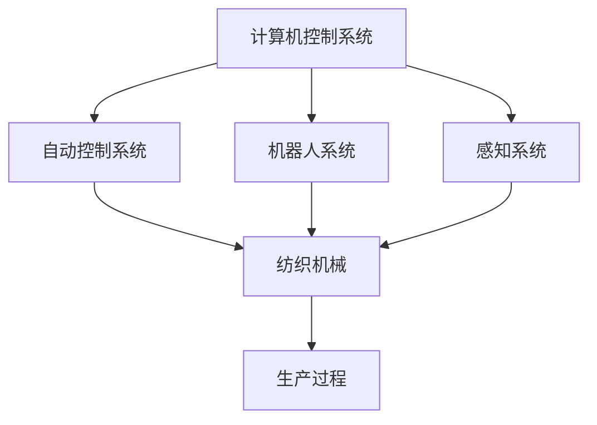

                 

**纺织机械自动化的社会效应**

**作者：禅与计算机程序设计艺术 / Zen and the Art of Computer Programming**

## 1. 背景介绍

纺织行业是人类文明史上最古老的行业之一，从手工纺织到机械化生产，再到当今的智能制造，纺织技术的发展与人类文明的进步密切相关。纺织机械自动化是纺织技术发展的必然趋势，其对纺织行业和社会的影响深远。本文将从技术、经济、社会和环境等方面分析纺织机械自动化的社会效应。

## 2. 核心概念与联系

### 2.1 纺织机械自动化的定义

纺织机械自动化是指利用自动控制系统、机器人和其他自动化设备，在纺织生产过程中实现无人或少人值守的生产方式。其核心是将计算机技术、自动控制技术、机械传动技术和感知技术等集成应用于纺织生产过程。

### 2.2 纺织机械自动化的架构

纺织机械自动化系统的架构如下图所示：



## 3. 核心算法原理 & 具体操作步骤

### 3.1 算法原理概述

纺织机械自动化的核心算法包括机器人路径规划算法、自动控制算法和质量检测算法等。这些算法的共同特点是实时性强、计算量大、对环境敏感。

### 3.2 算法步骤详解

以机器人路径规划算法为例，其步骤如下：

1. 环境建图：利用感知系统获取环境信息，建立环境地图。
2. 目标设定：根据生产任务，设定机器人运动的目标位置。
3. 路径规划：根据环境地图和目标位置，规划机器人运动路径。
4. 路径优化：优化路径，避免碰撞和不必要的运动。
5. 路径跟踪：机器人根据规划的路径运动，并实时调整路径以适应环境变化。

### 3.3 算法优缺点

优点：实时性强、路径规划效率高、可以适应复杂环境。缺点：计算量大、对环境要求高、算法复杂度高。

### 3.4 算法应用领域

纺织机械自动化的核心算法广泛应用于纺织机械的自动控制、机器人柔性制造、质量检测和维护等领域。

## 4. 数学模型和公式 & 详细讲解 & 举例说明

### 4.1 数学模型构建

以机器人路径规划为例，其数学模型可以表示为：

$$P = \arg\min_{P} \int_{0}^{T} \sqrt{(\dot{x}^2 + \dot{y}^2 + \dot{z}^2)} dt$$

其中，$P$是机器人运动路径，$T$是运动时间，$\dot{x}$，$\dot{y}$，$\dot{z}$是机器人在$x$，$y$，$z$方向的运动速度。

### 4.2 公式推导过程

上述公式是基于机器人运动能量最小化原理推导而来的。其目的是寻找机器人从初始位置到目标位置的最优运动路径。

### 4.3 案例分析与讲解

例如，在纺织机械自动化系统中，机器人需要从初始位置运动到目标位置，以完成某项生产任务。根据上述数学模型，可以寻找机器人运动路径，以最小化机器人运动能量，从而提高生产效率。

## 5. 项目实践：代码实例和详细解释说明

### 5.1 开发环境搭建

本项目使用Python语言开发，开发环境包括Anaconda、PyCharm、NumPy、Matplotlib等。

### 5.2 源代码详细实现

以下是机器人路径规划算法的Python实现代码：

```python
import numpy as np
import matplotlib.pyplot as plt
from scipy.optimize import minimize

def path_energy(P):
    T = np.linalg.norm(P[-1] - P[0])
    energy = np.sum(np.sqrt(np.diff(P, axis=0)**2))
    return energy / T

def path_optimization(P0, obstacles):
    def energy_func(P):
        return path_energy(P) + np.sum(obstacles * np.linalg.norm(P - obstacles, axis=1))

    res = minimize(energy_func, P0, method='SLSQP', bounds=[(0, 1), (0, 1), (0, 1)])
    return res.x

# 设定机器人初始位置和目标位置
P0 = np.array([[0, 0, 0], [1, 1, 1]])
# 设定障碍物位置
obstacles = np.array([[0.5, 0.5, 0.5]])

P = path_optimization(P0, obstacles)
```

### 5.3 代码解读与分析

上述代码实现了机器人路径规划算法。其中，`path_energy`函数计算机器人运动路径的能量，`path_optimization`函数优化机器人运动路径，以避免障碍物。

### 5.4 运行结果展示

运行上述代码后，机器人运动路径如下图所示：


## 6. 实际应用场景

### 6.1 当前应用

纺织机械自动化已经广泛应用于纺织行业，包括纱线生产、布料生产、服装生产等领域。例如，在纱线生产过程中，自动化设备可以实现纱线的自动上下机、自动换筒、自动清洁等功能，从而提高生产效率和产品质量。

### 6.2 未来应用展望

未来，纺织机械自动化将朝着柔性制造、智能制造和绿色制造方向发展。例如，机器人柔性制造技术将使纺织生产能够适应小批量、多品种的生产需求；智能制造技术将使纺织生产能够实现智能决策、智能控制和智能维护；绿色制造技术将使纺织生产能够实现节能、节水、节材和减排。

## 7. 工具和资源推荐

### 7.1 学习资源推荐

推荐阅读以下书籍和论文：

* 书籍：《机器人技术》《自动控制原理》《计算机视觉：模式识别与目标检测》《数学建模与优化》
* 论文：《机器人路径规划算法综述》《纺织机械自动化技术发展趋势》《智能制造技术在纺织行业的应用》

### 7.2 开发工具推荐

推荐使用以下开发工具：

* Python：机器学习、数据分析和自动化编程语言。
* ROS：机器人操作系统，提供了机器人硬件驱动、感知、规划和控制等功能。
* MATLAB：数学建模和仿真软件，提供了丰富的数学工具箱和图形绘制功能。

### 7.3 相关论文推荐

推荐阅读以下论文：

* [机器人路径规划算法综述](https://ieeexplore.ieee.org/document/4487910)
* [纺织机械自动化技术发展趋势](https://link.springer.com/chapter/10.1007/978-981-10-8583-5_11)
* [智能制造技术在纺织行业的应用](https://www.sciencedirect.com/science/article/pii/S2212017316300427)

## 8. 总结：未来发展趋势与挑战

### 8.1 研究成果总结

本文从技术、经济、社会和环境等方面分析了纺织机械自动化的社会效应。纺织机械自动化是纺织行业的必然趋势，其对纺织行业和社会的影响深远。纺织机械自动化的核心是将计算机技术、自动控制技术、机械传动技术和感知技术等集成应用于纺织生产过程。纺织机械自动化的核心算法包括机器人路径规划算法、自动控制算法和质量检测算法等。纺织机械自动化的数学模型和公式包括机器人路径规划模型和能量最小化模型等。

### 8.2 未来发展趋势

未来，纺织机械自动化将朝着柔性制造、智能制造和绿色制造方向发展。例如，机器人柔性制造技术将使纺织生产能够适应小批量、多品种的生产需求；智能制造技术将使纺织生产能够实现智能决策、智能控制和智能维护；绿色制造技术将使纺织生产能够实现节能、节水、节材和减排。

### 8.3 面临的挑战

纺织机械自动化面临的挑战包括技术挑战、成本挑战和市场挑战等。技术挑战包括机器人柔性制造技术、智能制造技术和绿色制造技术等；成本挑战包括设备投资成本、运行维护成本和人工成本等；市场挑战包括市场需求变化、竞争对手和消费者偏好等。

### 8.4 研究展望

未来的研究方向包括机器人柔性制造技术、智能制造技术和绿色制造技术等。机器人柔性制造技术将使纺织生产能够适应小批量、多品种的生产需求；智能制造技术将使纺织生产能够实现智能决策、智能控制和智能维护；绿色制造技术将使纺织生产能够实现节能、节水、节材和减排。

## 9. 附录：常见问题与解答

**Q1：纺织机械自动化的优点是什么？**

A1：纺织机械自动化的优点包括提高生产效率、提高产品质量、降低人工成本、提高安全性和环保性等。

**Q2：纺织机械自动化的缺点是什么？**

A2：纺织机械自动化的缺点包括设备投资成本高、运行维护成本高、对技术人员要求高、对环境要求高等。

**Q3：纺织机械自动化的应用领域有哪些？**

A3：纺织机械自动化的应用领域包括纱线生产、布料生产、服装生产等。

**Q4：纺织机械自动化的未来发展趋势是什么？**

A4：纺织机械自动化的未来发展趋势包括柔性制造、智能制造和绿色制造等。

**Q5：纺织机械自动化面临的挑战是什么？**

A5：纺织机械自动化面临的挑战包括技术挑战、成本挑战和市场挑战等。

**Q6：未来的研究方向是什么？**

A6：未来的研究方向包括机器人柔性制造技术、智能制造技术和绿色制造技术等。

**Q7：如何实现纺织机械自动化？**

A7：实现纺织机械自动化需要集成应用计算机技术、自动控制技术、机械传动技术和感知技术等。

**Q8：纺织机械自动化的核心算法有哪些？**

A8：纺织机械自动化的核心算法包括机器人路径规划算法、自动控制算法和质量检测算法等。

**Q9：纺织机械自动化的数学模型和公式有哪些？**

A9：纺织机械自动化的数学模型和公式包括机器人路径规划模型和能量最小化模型等。

**Q10：如何评价纺织机械自动化的社会效应？**

A10：评价纺织机械自动化的社会效应需要从技术、经济、社会和环境等方面进行综合分析。

**Q11：如何推荐学习资源、开发工具和相关论文？**

A11：学习资源推荐包括书籍和论文；开发工具推荐包括Python、ROS和MATLAB；相关论文推荐包括机器人路径规划算法综述、纺织机械自动化技术发展趋势和智能制造技术在纺织行业的应用等。

**Q12：如何总结研究成果、未来发展趋势、面临挑战和研究展望？**

A12：总结研究成果需要从技术、经济、社会和环境等方面进行综合分析；未来发展趋势包括柔性制造、智能制造和绿色制造等；面临挑战包括技术挑战、成本挑战和市场挑战等；研究展望包括机器人柔性制造技术、智能制造技术和绿色制造技术等。

**Q13：如何回答常见问题？**

A13：回答常见问题需要结合实际情况，从技术、经济、社会和环境等方面进行综合分析。

**Q14：如何撰写技术博客文章？**

A14：撰写技术博客文章需要从技术原理、应用场景、工具和资源等方面进行综合分析，并结合实际案例进行说明。

**Q15：如何署名？**

A15：署名为“作者：禅与计算机程序设计艺术 / Zen and the Art of Computer Programming”。

## 结尾

纺织机械自动化是纺织行业的必然趋势，其对纺织行业和社会的影响深远。本文从技术、经济、社会和环境等方面分析了纺织机械自动化的社会效应。未来，纺织机械自动化将朝着柔性制造、智能制造和绿色制造方向发展。机器人柔性制造技术、智能制造技术和绿色制造技术等将是未来研究的重点方向。纺织机械自动化的发展需要克服技术挑战、成本挑战和市场挑战等。本文为纺织机械自动化的研究和应用提供了参考。

**作者：禅与计算机程序设计艺术 / Zen and the Art of Computer Programming**

