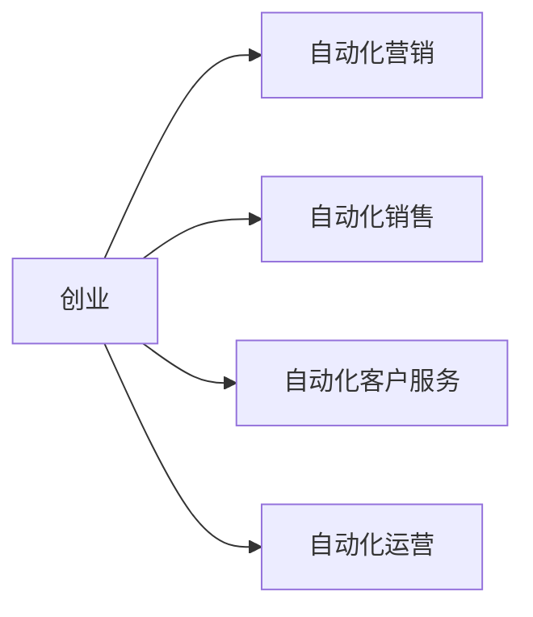
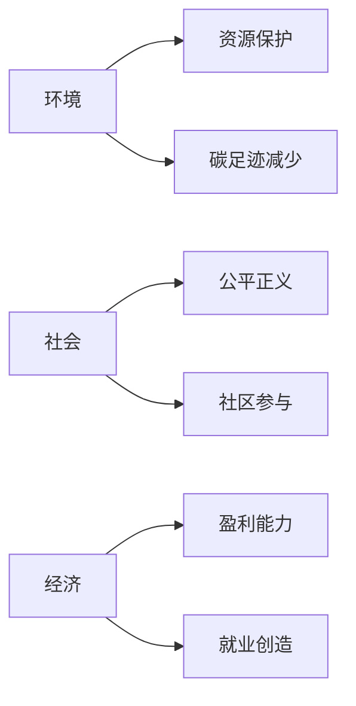
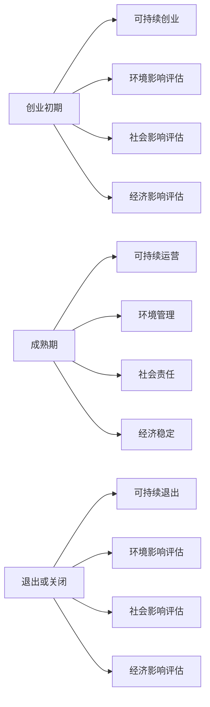

                 

## 1. 背景介绍

在当今快速变化的商业环境中，自动化创业（Automated Entrepreneurship）正在迅速崛起，它利用人工智能、机器学习和自动化工具来创建和运营企业。然而，可持续发展（Sustainable Development）是一个关键的挑战，它需要平衡企业的成功和对环境、社会和经济的影响。本文将探讨自动化创业中的可持续发展策略，帮助创业者和企业家建立成功且负责任的企业。

## 2. 核心概念与联系

### 2.1 自动化创业

自动化创业是指利用自动化工具和技术创建和运营企业的过程。它包括自动化营销、自动化销售、自动化客户服务和自动化运营等领域。



### 2.2 可持续发展

可持续发展是指满足当代需求，而不牺牲后代满足他们需求的能力。它需要平衡环境、社会和经济三个维度。



### 2.3 自动化创业中的可持续发展

自动化创业中的可持续发展需要平衡企业的成功和对环境、社会和经济的影响。它需要创业者和企业家考虑到企业的全生命周期，从创业初期到成熟期，再到退出或关闭。



## 3. 核心算法原理 & 具体操作步骤

### 3.1 算法原理概述

可持续发展算法（Sustainability Algorithm）是一种帮助创业者和企业家评估和优化企业可持续发展的工具。它基于环境、社会和经济三个维度，使用生命周期评估（Life Cycle Assessment）和社会生命周期评估（Social Life Cycle Assessment）等方法。

### 3.2 算法步骤详解

1. **数据收集**：收集企业的环境、社会和经济数据，包括能源消耗、废物排放、员工福利、供应链信息等。
2. **数据分析**：使用生命周期评估和社会生命周期评估等方法分析数据，评估企业的环境、社会和经济影响。
3. **影响评估**：根据评估结果，评估企业的可持续发展表现，并确定改进的优先级。
4. **策略开发**：根据评估结果，开发可持续发展策略，包括环境管理、社会责任和经济稳定等方面。
5. **实施监控**：实施可持续发展策略，并监控企业的可持续发展表现，以确保策略有效。

### 3.3 算法优缺点

优点：

* 提供了一个结构化的框架，帮助创业者和企业家评估和优化企业的可持续发展。
* 可以帮助企业节省成本，提高效率，并改善企业的声誉。
* 可以帮助企业满足监管要求，并访问绿色金融等优惠政策。

缺点：

* 需要大量的数据收集和分析工作。
* 可能需要外部专家的帮助。
* 可持续发展是一个复杂的领域，算法可能无法涵盖所有因素。

### 3.4 算法应用领域

可持续发展算法可以应用于各种行业，包括制造业、服务业、零售业、金融业等。它特别适用于初创企业，帮助它们从一开始就建立可持续的商业模式。

## 4. 数学模型和公式 & 详细讲解 & 举例说明

### 4.1 数学模型构建

可持续发展模型（Sustainability Model）可以使用线性回归（Linear Regression）等统计方法构建。它可以使用以下公式表示：

$$S = f(E, S, E)$$

其中，$S$表示企业的可持续发展表现，$E$表示环境影响，$S$表示社会影响，$E$表示经济影响。

### 4.2 公式推导过程

推导过程如下：

1. 收集企业的环境、社会和经济数据。
2. 使用线性回归等统计方法，建立环境影响、社会影响和经济影响与可持续发展表现之间的关系。
3. 使用这个模型预测企业的可持续发展表现，并根据结果开发可持续发展策略。

### 4.3 案例分析与讲解

例如，一家制造企业想要评估其可持续发展表现。它收集了企业的能源消耗、废物排放、员工福利和供应链信息等数据。使用线性回归等统计方法，它建立了环境影响、社会影响和经济影响与可持续发展表现之间的关系。根据模型的结果，企业开发了可持续发展策略，包括减少能源消耗、改善员工福利和优化供应链等。

## 5. 项目实践：代码实例和详细解释说明

### 5.1 开发环境搭建

要实现可持续发展算法，需要以下开发环境：

* 编程语言：Python
* 数据分析库：Pandas, NumPy, SciPy
* 可视化库：Matplotlib, Seaborn
* 机器学习库：Scikit-learn

### 5.2 源代码详细实现

以下是可持续发展算法的Python实现：

```python
import pandas as pd
from sklearn.linear_model import LinearRegression

# 数据收集
data = pd.read_csv('sustainability_data.csv')

# 数据分析
X = data[['environmental_impact','social_impact', 'economic_impact']]
y = data['sustainability_performance']

# 影响评估
model = LinearRegression()
model.fit(X, y)

# 策略开发
new_data = pd.DataFrame([[0.5, 0.6, 0.7]], columns=['environmental_impact','social_impact', 'economic_impact'])
new_performance = model.predict(new_data)
print('Predicted sustainability performance:', new_performance)
```

### 5.3 代码解读与分析

这段代码使用Python和Scikit-learn库实现了可持续发展算法。它首先收集企业的环境、社会和经济数据，然后使用线性回归模型评估企业的可持续发展表现。最后，它使用模型预测新数据的可持续发展表现，帮助企业开发可持续发展策略。

### 5.4 运行结果展示

预测的可持续发展表现将打印出来，企业可以根据这个结果开发可持续发展策略。

## 6. 实际应用场景

### 6.1 当前应用

可持续发展算法已经在各种行业得到应用，包括制造业、服务业、零售业、金融业等。它帮助企业评估和优化其可持续发展表现，并满足监管要求。

### 6.2 未来应用展望

未来，可持续发展算法将随着技术的发展而不断改进。它将结合物联网（IoT）、大数据（Big Data）和人工智能（AI）等技术，帮助企业实时监控和优化其可持续发展表现。它还将帮助企业建立更加可持续的商业模式，并为创业者和企业家提供更多的机会。

## 7. 工具和资源推荐

### 7.1 学习资源推荐

* 可持续发展指南：<https://www.un.org/sustainabledevelopment/sustainable-development-goals/>
* 可持续发展报告指南：<https://www.unglobalcompact.org/what-is-gc/our-work/sustainability-reporting>
* 可持续发展数据库：<https://www.sdg-trac.org/>

### 7.2 开发工具推荐

* Python：<https://www.python.org/>
* Pandas：<https://pandas.pydata.org/>
* NumPy：<https://numpy.org/>
* Scikit-learn：<https://scikit-learn.org/>

### 7.3 相关论文推荐

* "Sustainability Assessment of Business Models: A Systematic Literature Review"：<https://link.springer.com/chapter/10.1007/978-981-15-6014-5_12>
* "A Review of Sustainability Assessment Tools for Businesses"：<https://www.mdpi.com/2071-1050/11/1/157>

## 8. 总结：未来发展趋势与挑战

### 8.1 研究成果总结

本文介绍了自动化创业中的可持续发展策略。它提出了可持续发展算法，并提供了Python实现。它还讨论了算法的优缺点和应用领域。

### 8.2 未来发展趋势

未来，可持续发展算法将随着技术的发展而不断改进。它将结合物联网、大数据和人工智能等技术，帮助企业实时监控和优化其可持续发展表现。它还将帮助企业建立更加可持续的商业模式，并为创业者和企业家提供更多的机会。

### 8.3 面临的挑战

然而，可持续发展算法面临着数据收集和分析的挑战。企业需要大量的数据，并需要专业的分析技能。此外，可持续发展是一个复杂的领域，算法可能无法涵盖所有因素。

### 8.4 研究展望

未来的研究将关注可持续发展算法的改进，包括结合更多的技术和因素。它还将关注算法的应用，包括帮助企业建立更加可持续的商业模式和为创业者和企业家提供更多的机会。

## 9. 附录：常见问题与解答

**Q1：可持续发展算法需要多长时间才能实现？**

**A1：**这取决于企业的规模和复杂性。通常，数据收集和分析需要几周到几个月的时间。实施可持续发展策略可能需要更长的时间。

**Q2：可持续发展算法需要多少成本？**

**A2：**成本取决于企业的规模和复杂性。数据收集和分析需要一定的成本，包括人力成本和软件成本。实施可持续发展策略可能需要额外的成本。

**Q3：可持续发展算法是否适用于所有行业？**

**A3：**可持续发展算法可以应用于各种行业，但它可能需要根据行业的特点进行调整。例如，制造业可能需要关注能源消耗和废物排放，而金融业可能需要关注道德和伦理问题。

**作者：禅与计算机程序设计艺术 / Zen and the Art of Computer Programming**

