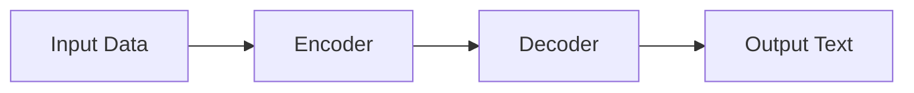

                 

**关键词：自然语言生成（NLP）、报告撰写、文本生成模型、转换器模型、指令微调、文本编辑、文本总结**

## 1. 背景介绍

在当今信息爆炸的时代，报告撰写是一种常见的沟通方式，用于记录、分析和传达信息。然而，撰写报告是一项繁琐且费时的任务，特别是当涉及大量数据或复杂主题时。自然语言生成（NLP）技术的发展为自动化报告撰写带来了新的可能性。

## 2. 核心概念与联系

### 2.1 自然语言生成

自然语言生成是NLP的一个分支，旨在使计算机能够理解和生成人类语言。它涉及从输入数据（如文本、音频或图像）中提取信息，并将其转换为人类可读的文本。

### 2.2 转换器模型

转换器模型是当前自然语言生成领域的主导架构。它由两个转换器组成：编码器和解码器。编码器负责理解输入数据，解码器则根据编码器的输出生成输出文本。转换器模型可以处理各种NLP任务，包括文本生成、翻译和文本编辑。



### 2.3 指令微调

指令微调是一种将预训练的语言模型适应特定任务的方法。它涉及向模型提供指令，指导其生成特定类型的输出。在报告撰写中，指令微调可以用于指导模型生成特定格式的文本，如摘要、列表或表格。

## 3. 核心算法原理 & 具体操作步骤

### 3.1 算法原理概述

报告撰写任务可以分为几个子任务，如文本总结、文本编辑和文本生成。每个子任务都可以使用转换器模型和指令微调来自动化。

### 3.2 算法步骤详解

1. **数据预处理**：收集和预处理报告数据，如清洗、标记和分词。
2. **模型选择**：选择合适的预训练语言模型，如BERT、T5或RoBERTa。
3. **指令设计**：设计指令以指导模型生成特定类型的输出。
4. **指令微调**：使用指令微调训练模型，使其能够理解和执行指令。
5. **文本生成**：使用微调后的模型生成报告文本。
6. **后处理**：对生成的文本进行后处理，如去除重复内容、修正语法错误和格式化。

### 3.3 算法优缺点

**优点**：自动化报告撰写可以节省时间和精力，并帮助减少人为错误。此外，它可以处理大量数据，生成详细且一致的报告。

**缺点**：当前的NLP模型还无法完全模仿人类的写作风格和创造力。它们可能会生成重复的或不相关的文本，并可能无法理解复杂的上下文。

### 3.4 算法应用领域

自动化报告撰写可以应用于各种领域，如金融（生成财务报告）、医疗（生成病历报告）、新闻（生成新闻报道）和科学（生成研究报告）。

## 4. 数学模型和公式 & 详细讲解 & 举例说明

### 4.1 数学模型构建

转换器模型可以表示为一个序列到序列的映射函数：

$$P(y|x) = \prod_{i=1}^{n}P(y_i|y_{i-1},...,y_1;x)$$

其中，$x$是输入序列，$y$是输出序列，$n$是输出序列的长度。

### 4.2 公式推导过程

指令微调的目标函数可以表示为：

$$\mathcal{L}(\theta) = -\log P(y|x;\theta) + \lambda R(\theta)$$

其中，$\theta$是模型参数，$R(\theta)$是正则化项，$\lambda$是正则化系数。指令微调的目标是最小化这个损失函数。

### 4.3 案例分析与讲解

假设我们想要生成一份销售报告。输入数据是一组销售数据，指令是"生成一份销售报告，包括总销售额、销售额增长率和最畅销的产品。"

使用指令微调的转换器模型，我们可以生成以下报告：

> **销售报告**
>
> 总销售额为100万美元，较上年同期增长了15%。最畅销的产品是X产品，销售额为30万美元。

## 5. 项目实践：代码实例和详细解释说明

### 5.1 开发环境搭建

要实现自动化报告撰写，我们需要安装Python、PyTorch或TensorFlow，以及相关的NLP库，如Transformers和Datasets。

### 5.2 源代码详细实现

以下是一个简单的指令微调示例，使用Hugging Face的Transformers库和T5模型：

```python
from transformers import T5Tokenizer, T5ForConditionalGeneration

tokenizer = T5Tokenizer.from_pretrained('t5-base')
model = T5ForConditionalGeneration.from_pretrained('t5-base')

inputs = tokenizer("生成一份销售报告，包括总销售额、销售额增长率和最畅销的产品。销售数据：总销售额为100万美元，较上年同期增长了15%。最畅销的产品是X产品，销售额为30万美元。", return_tensors="pt")
outputs = model.generate(inputs["input_ids"], max_length=50)
report = tokenizer.decode(outputs[0])
print(report)
```

### 5.3 代码解读与分析

这段代码首先加载T5模型和其对应的 tokenizer。然后，它对指令和销售数据进行编码，并使用模型生成报告。最后，它解码生成的输出，并打印报告。

### 5.4 运行结果展示

运行这段代码将生成与上一节中所示的销售报告相同的输出。

## 6. 实际应用场景

### 6.1 当前应用

自动化报告撰写已经在一些领域得到应用，如金融（生成财务报告）、医疗（生成病历报告）和新闻（生成新闻报道）。

### 6.2 未来应用展望

未来，自动化报告撰写有望在更多领域得到应用，如科学研究（生成研究报告）和教育（生成学习报告）。此外，它有望与其他人工智能技术结合，如图像识别和语音合成，以提供更丰富的报告。

## 7. 工具和资源推荐

### 7.1 学习资源推荐

- "Natural Language Processing with Python" by Steven Bird, Ewan Klein, and Edward Loper
- "Hands-On Machine Learning with Scikit-Learn, Keras, and TensorFlow" by Aurélien Géron
- "Attention Is All You Need" by Vaswani et al. (Nature, 2017)

### 7.2 开发工具推荐

- Hugging Face Transformers: <https://huggingface.co/transformers/>
- TensorFlow: <https://www.tensorflow.org/>
- PyTorch: <https://pytorch.org/>

### 7.3 相关论文推荐

- "T5: Text-to-Text Transfer Transformer" by Colin Raffel et al. (arXiv, 2019)
- "Language Models are Few-Shot Learners" by Tom B. Brown et al. (arXiv, 2020)

## 8. 总结：未来发展趋势与挑战

### 8.1 研究成果总结

自动化报告撰写是自然语言生成领域的一个活跃研究方向。转换器模型和指令微调等技术已经取得了显著的进展。

### 8.2 未来发展趋势

未来，自动化报告撰写有望在以下几个方面取得进展：

- **多模式输入**：当前的模型主要基于文本输入。未来的模型有望处理多模式输入，如图像和音频。
- **上下文理解**：当前的模型在理解复杂上下文方面还存在挑战。未来的模型有望在上下文理解方面取得进展。
- **人类在场**：未来的模型有望与人类协同工作，在人类的指导下生成报告。

### 8.3 面临的挑战

自动化报告撰写还面临着几个挑战：

- **数据获取**：获取高质量的训练数据是一个挑战。
- **模型泛化**：模型需要能够泛化到新的、未见过的数据。
- **解释性**：模型的决策过程需要更好地解释给用户。

### 8.4 研究展望

未来的研究有望在以下几个方面取得进展：

- **模型可解释性**：开发更可解释的模型，以帮助用户理解模型的决策过程。
- **模型泛化**：开发更泛化的模型，能够处理新的、未见过的数据。
- **多模式输入**：开发能够处理多模式输入的模型。

## 9. 附录：常见问题与解答

**Q：自动化报告撰写是否会取代人类写作？**

A：自动化报告撰写的目标是帮助人类写作，而不是取代它。它可以节省时间和精力，并帮助减少人为错误。然而，它无法完全模仿人类的写作风格和创造力。

**Q：自动化报告撰写是否需要大量的训练数据？**

A：是的，自动化报告撰写需要大量的训练数据。然而，指令微调等技术可以帮助模型从小量的数据中学习。

**Q：自动化报告撰写是否可以处理复杂的上下文？**

A：当前的模型在理解复杂上下文方面还存在挑战。未来的模型有望在上下文理解方面取得进展。

## 作者：禅与计算机程序设计艺术 / Zen and the Art of Computer Programming

