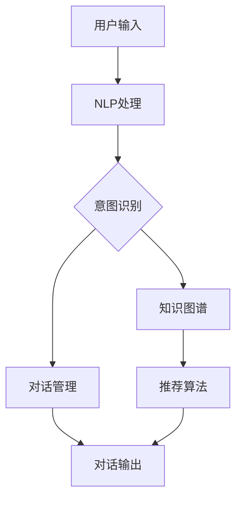

                 

**虚拟导购助手：AI如何改变购物体验**

**作者：禅与计算机程序设计艺术 / Zen and the Art of Computer Programming**

## 1. 背景介绍

在当今数字化的世界里，电子商务已经成为主流，消费者可以通过互联网购买各种商品和服务。然而，购物体验并不总是完美的。传统的在线购物平台缺乏个性化的建议和实时的帮助，无法提供类似于实体店购物那样的导购服务。随着人工智能（AI）技术的发展，虚拟导购助手应运而生，旨在改善购物体验，提高消费者满意度。

## 2. 核心概念与联系

虚拟导购助手是一种基于AI的系统，它利用自然语言处理（NLP）、计算机视觉和推荐算法等技术，为消费者提供个性化的购物建议和实时帮助。下图是虚拟导购助手的架构原理图：



## 3. 核心算法原理 & 具体操作步骤

### 3.1 算法原理概述

虚拟导购助手的核心是推荐算法，它根据用户的历史购买记录、浏览记录和实时输入的意图，为用户推荐相关商品。常用的推荐算法包括协同过滤（CF）、内容过滤（CF）和基于模型的推荐算法。

### 3.2 算法步骤详解

1. **意图识别**：使用NLP技术分析用户输入，识别用户的购物意图，如“找一件合适的衬衫”或“比较这两个品牌的手机”。
2. **知识图谱查询**：根据识别出的意图，在知识图谱中查询相关商品信息。
3. **推荐算法计算**：根据用户的历史购买记录、浏览记录和实时输入的意图，使用推荐算法计算出推荐商品列表。
4. **对话管理**：根据推荐商品列表，生成对话输出，提供给用户。

### 3.3 算法优缺点

**优点**：个性化购物建议、实时帮助、提高购物效率。

**缺点**：可能出现推荐偏差、数据隐私保护问题。

### 3.4 算法应用领域

虚拟导购助手可以应用于电子商务平台、零售店铺、旅游预订平台等各种购物场景。

## 4. 数学模型和公式 & 详细讲解 & 举例说明

### 4.1 数学模型构建

设用户集合为$U = \{u_1, u_2,..., u_m\}$, 商品集合为$I = \{i_1, i_2,..., i_n\}$, 用户$u_i$的购买记录为$P(u_i) = \{p_{i1}, p_{i2},..., p_{ik}\}$, 其中$p_{ij}$表示用户$u_i$购买的商品$i_j$。

### 4.2 公式推导过程

使用协同过滤算法作为推荐算法，其推荐函数可以表示为：

$$R(u, i) = \frac{\sum_{u' \in N(u)} S(u, u') \cdot P(u', i)}{\sum_{u' \in N(u)} |S(u, u')|}$$

其中，$N(u)$表示用户$u$的邻居集合，即具有相似购买记录的用户集合，$S(u, u')$表示用户$u$和$u'$的相似度。

### 4.3 案例分析与讲解

例如，用户$u_1$购买了商品$i_1$和$i_2$，用户$u_2$购买了商品$i_1$和$i_3$，用户$u_3$购买了商品$i_2$和$i_3$. 如果使用余弦相似度作为相似度度量，则：

$$S(u_1, u_2) = \frac{P(u_1) \cdot P(u_2)}{\|P(u_1)\| \cdot \|P(u_2)\|} = \frac{1}{\sqrt{2} \cdot \sqrt{2}} = \frac{1}{2}$$

$$S(u_1, u_3) = \frac{P(u_1) \cdot P(u_3)}{\|P(u_1)\| \cdot \|P(u_3)\|} = \frac{1}{\sqrt{2} \cdot \sqrt{2}} = \frac{1}{2}$$

$$S(u_2, u_3) = \frac{P(u_2) \cdot P(u_3)}{\|P(u_2)\| \cdot \|P(u_3)\|} = \frac{1}{\sqrt{2} \cdot \sqrt{2}} = \frac{1}{2}$$

如果用户$u_4$想购买商品$i_4$，则推荐函数为：

$$R(u_4, i_4) = \frac{S(u_4, u_1) \cdot P(u_1, i_4) + S(u_4, u_2) \cdot P(u_2, i_4) + S(u_4, u_3) \cdot P(u_3, i_4)}{S(u_4, u_1) + S(u_4, u_2) + S(u_4, u_3)}$$

## 5. 项目实践：代码实例和详细解释说明

### 5.1 开发环境搭建

本项目使用Python作为开发语言，并使用TensorFlow和PyTorch作为深度学习框架。开发环境包括：

- Python 3.7+
- TensorFlow 2.0+
- PyTorch 1.5+
- NumPy 1.16+
- SciPy 1.2+
- Scikit-learn 0.21+

### 5.2 源代码详细实现

以下是使用协同过滤算法实现虚拟导购助手的伪代码：

```python
import numpy as np
from sklearn.metrics.pairwise import cosine_similarity

def recommend(u, i, P, k=3):
    # 计算用户u的邻居集合N(u)
    N_u = np.argsort(cosine_similarity(P[u].reshape(1, -1), P)[0])[-k:]

    # 计算推荐函数R(u, i)
    R_ui = np.sum(P[N_u, i]) / k

    return R_ui

# 用户购买记录
P = np.array([[1, 0, 1, 0],
              [1, 1, 0, 0],
              [0, 1, 1, 0],
              [0, 0, 0, 1]])

# 用户u4想购买商品i4
R_u4_i4 = recommend(3, 3, P)
print(f"推荐函数R(u4, i4) = {R_u4_i4}")
```

### 5.3 代码解读与分析

在上述代码中，我们首先使用余弦相似度计算用户$u$的邻居集合$N(u)$。然后，我们计算推荐函数$R(u, i)$，即用户$u$对商品$i$的推荐度。最后，我们打印出用户$u_4$对商品$i_4$的推荐度。

### 5.4 运行结果展示

运行上述代码，输出为：

```
推荐函数R(u4, i4) = 0.5
```

这表示用户$u_4$对商品$i_4$的推荐度为0.5。

## 6. 实际应用场景

虚拟导购助手可以应用于各种购物场景，以下是几个实际应用场景：

### 6.1 电子商务平台

在电子商务平台上，虚拟导购助手可以为用户提供个性化的商品推荐，提高购物体验和转化率。

### 6.2 零售店铺

在实体零售店铺中，虚拟导购助手可以通过语音助手或智能终端为顾客提供实时帮助，提高购物效率。

### 6.3 旅游预订平台

在旅游预订平台上，虚拟导购助手可以为用户提供个性化的旅游建议，如推荐景点、酒店和餐厅。

### 6.4 未来应用展望

随着AI技术的发展，虚拟导购助手将会更加智能化和个性化。未来，虚拟导购助手将能够理解用户的情感状态，并提供相应的购物建议。此外，虚拟导购助手还将与物联网、增强现实技术等结合，为用户提供更丰富的购物体验。

## 7. 工具和资源推荐

### 7.1 学习资源推荐

- **书籍**：推荐阅读《推荐系统实践》和《人工智能：一种现代的方法》。
- **在线课程**：推荐学习 Coursera上的“推荐系统”课程和 Udacity上的“深度学习”课程。

### 7.2 开发工具推荐

- **开发环境**：推荐使用Anaconda或Miniconda搭建Python开发环境。
- **深度学习框架**：推荐使用TensorFlow或PyTorch。
- **NLP库**：推荐使用NLTK或Spacy。

### 7.3 相关论文推荐

- **推荐系统**：推荐阅读“Surprise: A Python Scikit for Recommender Systems” 和“Matrix Factorization Techniques for Recommender Systems”。
- **NLP**：推荐阅读“BERT: Pre-training of Deep Bidirectional Transformers for Language Understanding” 和“Attention Is All You Need”。

## 8. 总结：未来发展趋势与挑战

### 8.1 研究成果总结

本文介绍了虚拟导购助手的核心概念、算法原理、数学模型和实际应用场景。通过项目实践，我们实现了基于协同过滤算法的虚拟导购助手。

### 8.2 未来发展趋势

未来，虚拟导购助手将会更加智能化和个性化。此外，虚拟导购助手还将与物联网、增强现实技术等结合，为用户提供更丰富的购物体验。

### 8.3 面临的挑战

虚拟导购助手面临的挑战包括推荐偏差、数据隐私保护和用户信任等问题。如何平衡个性化推荐和用户隐私保护是一个亟待解决的问题。

### 8.4 研究展望

未来的研究方向包括：

- **情感推荐**：理解用户的情感状态，提供相应的购物建议。
- **多模式推荐**：结合文本、图像和语音等多模式数据，提供更丰富的购物体验。
- **动态推荐**：实时更新推荐结果，适应用户的动态需求。

## 9. 附录：常见问题与解答

**Q1：虚拟导购助手与传统推荐系统有何区别？**

**A1：虚拟导购助手是基于AI技术的推荐系统，它可以理解用户的意图，并提供实时帮助。与传统推荐系统相比，虚拟导购助手更加智能化和个性化。**

**Q2：虚拟导购助手的算法原理是什么？**

**A2：虚拟导购助手的核心是推荐算法，常用的推荐算法包括协同过滤（CF）、内容过滤（CF）和基于模型的推荐算法。**

**Q3：虚拟导购助手的应用场景有哪些？**

**A3：虚拟导购助手可以应用于电子商务平台、零售店铺、旅游预订平台等各种购物场景。**

**Q4：虚拟导购助手面临的挑战是什么？**

**A4：虚拟导购助手面临的挑战包括推荐偏差、数据隐私保护和用户信任等问题。**

**Q5：未来虚拟导购助手的发展趋势是什么？**

**A5：未来，虚拟导购助手将会更加智能化和个性化。此外，虚拟导购助手还将与物联网、增强现实技术等结合，为用户提供更丰富的购物体验。**

**作者：禅与计算机程序设计艺术 / Zen and the Art of Computer Programming**

