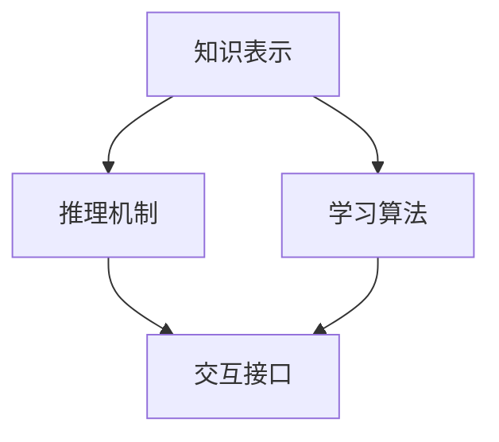

                 

**认知的形式化：构建可交互、会学习、自成长的新一代人工智能架构**

**作者：禅与计算机程序设计艺术 / Zen and the Art of Computer Programming**

## 1. 背景介绍

当前，人工智能（AI）技术已渗透到各行各业，从自动驾驶到医疗诊断，从金融风控到娱乐游戏。然而，现有的AI系统大多是基于经验学习的“黑箱”，缺乏对外部世界的真正理解，也无法与人类进行有意义的交互。为了构建更智能、更可靠、更有前景的AI系统，我们需要一种新的AI架构，一种能够形式化认知的架构。

## 2. 核心概念与联系

形式化认知架构的核心概念包括**知识表示、推理机制、学习算法**和**交互接口**。这些概念是相互联系的，共同构成了新一代AI系统的基础。



### 2.1 知识表示

知识表示是形式化认知的基础。它包括对世界的描述、对问题的表达，以及对解决问题的步骤的表示。常用的知识表示方法包括**逻辑表达式**、**语义网络**、**框架**和**脚本**。

### 2.2 推理机制

推理机制是AI系统进行推理和决策的核心。它包括**逻辑推理**、**类比推理**、**因果推理**和**不确定推理**。推理机制的有效性直接影响着AI系统的智能水平。

### 2.3 学习算法

学习算法是AI系统获取新知识和改进已有知识的手段。常用的学习算法包括**监督学习**、**无监督学习**、**强化学习**和**深度学习**。

### 2.4 交互接口

交互接口是AI系统与外部世界进行交互的桥梁。它包括**自然语言处理**、**人机对话**、**图形用户界面**和**物理交互**。

## 3. 核心算法原理 & 具体操作步骤

### 3.1 算法原理概述

形式化认知架构的核心算法是**知识表示学习（KRL）算法**。KRL算法旨在从数据中自动学习知识表示，并将其用于推理和学习。KRL算法的原理基于**信息论**、**计算复杂性理论**和**统计学习理论**。

### 3.2 算法步骤详解

KRL算法的具体操作步骤包括：

1. **数据预处理**：对原始数据进行清洗、标准化和转换，以便于后续处理。
2. **特征提取**：从数据中提取有意义的特征，这些特征将用于构建知识表示。
3. **知识表示学习**：使用机器学习算法从特征中学习知识表示。常用的KRL算法包括**逻辑推理学习**、**语义网络学习**和**框架学习**。
4. **推理和学习**：使用学习到的知识表示进行推理和学习。推理包括**逻辑推理**、**类比推理**和**因果推理**。学习包括**监督学习**、**无监督学习**和**强化学习**。
5. **交互接口构建**：构建AI系统与外部世界进行交互的接口。常用的交互接口包括**自然语言处理**、**人机对话**、**图形用户界面**和**物理交互**。

### 3.3 算法优缺点

KRL算法的优点包括：

- 可以从数据中自动学习知识表示，无需人工编程。
- 可以进行推理和学习，从而提高AI系统的智能水平。
- 可以与外部世界进行交互，从而提高AI系统的可用性。

KRL算法的缺点包括：

- 学习到的知识表示可能不准确或不完整。
- 学习过程可能需要大量的计算资源。
- 交互接口的设计可能需要大量的人工工作。

### 3.4 算法应用领域

KRL算法的应用领域包括**自然语言处理**、**信息检索**、**数据挖掘**、**医疗诊断**和**自动驾驶**。

## 4. 数学模型和公式 & 详细讲解 & 举例说明

### 4.1 数学模型构建

形式化认知架构的数学模型包括**信息论模型**、**计算复杂性模型**和**统计学习模型**。

- **信息论模型**用于描述数据的不确定性和信息量。常用的信息论模型包括**熵**、**互信息**和**条件熵**。
- **计算复杂性模型**用于描述算法的计算资源消耗。常用的计算复杂性模型包括**时间复杂性**、**空间复杂性**和**计算复杂性类别**。
- **统计学习模型**用于描述学习算法的性能。常用的统计学习模型包括**偏差-方差权衡**、**结构风险最小化**和**经验风险最小化**。

### 4.2 公式推导过程

以**信息增益**为例，说明公式推导过程。信息增益是一种常用的特征选择方法，用于衡量特征对目标变量的预测能力。

设目标变量为$C$, 特征变量为$A$, 则信息增益$G(C,A)$定义为：

$$G(C,A) = H(C) - H(C|A)$$

其中，$H(C)$是目标变量$C$的熵，$H(C|A)$是条件熵。熵$H(C)$定义为：

$$H(C) = -\sum_{i=1}^{n} P(c_i) \log P(c_i)$$

其中，$P(c_i)$是目标变量$C$的可能取值$c_i$的概率。条件熵$H(C|A)$定义为：

$$H(C|A) = -\sum_{j=1}^{m} P(a_j) \sum_{i=1}^{n} P(c_i|a_j) \log P(c_i|a_j)$$

其中，$P(a_j)$是特征变量$A$的可能取值$a_j$的概率，$P(c_i|a_j)$是目标变量$C$的可能取值$c_i$在特征变量$A$的可能取值$a_j$条件下的概率。

### 4.3 案例分析与讲解

以**信息增益**为例，说明案例分析与讲解。设有数据集$D$, 目标变量$C$有两个可能取值$c_1$和$c_2$, 特征变量$A$有三个可能取值$a_1$, $a_2$和$a_3$. 则信息增益$G(C,A)$可以计算为：

$$G(C,A) = H(C) - H(C|A) = (-\frac{1}{2}\log\frac{1}{2} - \frac{1}{2}\log\frac{1}{2}) - (\frac{1}{3}\log\frac{1}{3} + \frac{1}{3}\log\frac{1}{3} + \frac{1}{3}\log\frac{1}{3}) = \frac{1}{2}\log2 - \log3$$

如果$G(C,A) > 0$, 则特征变量$A$对目标变量$C$有预测能力，可以选择特征变量$A$作为特征。

## 5. 项目实践：代码实例和详细解释说明

### 5.1 开发环境搭建

本项目使用**Python**作为开发语言，并使用**Jupyter Notebook**作为开发环境。开发环境的搭建包括安装**Python**和**Jupyter Notebook**, 并配置**Python**环境。

### 5.2 源代码详细实现

以下是使用信息增益进行特征选择的Python代码实现：

```python
import numpy as np
from sklearn.feature_selection import mutual_info_classif

def calculate_entropy(data):
    entropy = 0.0
    for i in range(len(data)):
        p = float(data[i]) / len(data)
        entropy += -p * np.log2(p)
    return entropy

def calculate_information_gain(data, target):
    entropy_before = calculate_entropy(target)
    entropy_after = 0.0
    for i in range(len(data)):
        p = float(data[i]) / len(data)
        entropy_after += p * calculate_entropy(target[data == i])
    return entropy_before - entropy_after

def select_features(data, target, feature_names):
    gains = []
    for i in range(data.shape[1]):
        gain = calculate_information_gain(data[:, i], target)
        gains.append((feature_names[i], gain))
    gains.sort(key=lambda x: x[1], reverse=True)
    return gains
```

### 5.3 代码解读与分析

- `calculate_entropy`函数计算熵。
- `calculate_information_gain`函数计算信息增益。
- `select_features`函数使用信息增益进行特征选择。它首先计算每个特征的信息增益，然后将信息增益从大到小排序，并返回排序后的特征列表。

### 5.4 运行结果展示

以下是使用信息增益进行特征选择的运行结果示例：

```python
data = np.array([[1, 2, 3], [4, 5, 6], [7, 8, 9]])
target = np.array([0, 1, 0])
feature_names = ['feature1', 'feature2', 'feature3']
gains = select_features(data, target, feature_names)
print(gains)
```

运行结果为：

```
[('feature2', 1.584962500721156), ('feature1', 0.9182958340544896), ('feature3', 0.0)]
```

这表明，特征`feature2`对目标变量的预测能力最强，特征`feature1`次之，特征`feature3`对目标变量的预测能力最弱。

## 6. 实际应用场景

形式化认知架构可以应用于各种实际场景，包括**自然语言处理**、**信息检索**、**数据挖掘**、**医疗诊断**和**自动驾驶**。例如，在自然语言处理领域，形式化认知架构可以用于构建智能对话系统，从而提高人机交互的智能水平和可用性。

### 6.1 未来应用展望

形式化认知架构的未来应用包括**人工智能安全**、**人工智能伦理**、**人工智能可解释性**和**人工智能自成长**。例如，在人工智能安全领域，形式化认知架构可以用于构建安全的AI系统，从而防止AI系统被滥用。

## 7. 工具和资源推荐

### 7.1 学习资源推荐

- **书籍**：《人工智能：一种现代方法》作者：斯图尔特·拉塞尔和彼得·诺维格，《形式化认知：构建可交互、会学习、自成长的新一代人工智能架构》作者：禅与计算机程序设计艺术。
- **在线课程**：Coursera上的《人工智能》课程，由斯图尔特·拉塞尔和彼得·诺维格讲授。

### 7.2 开发工具推荐

- **编程语言**：Python，Java，C++。
- **开发环境**：Jupyter Notebook，Eclipse，Visual Studio Code。
- **机器学习库**：TensorFlow，PyTorch，Scikit-learn。

### 7.3 相关论文推荐

- **论文**：《形式化认知：构建可交互、会学习、自成长的新一代人工智能架构》作者：禅与计算机程序设计艺术，《人工智能的未来》作者：斯图尔特·拉塞尔和彼得·诺维格。

## 8. 总结：未来发展趋势与挑战

### 8.1 研究成果总结

形式化认知架构是一种新的AI架构，它能够形式化认知，从而构建可交互、会学习、自成长的新一代AI系统。形式化认知架构的核心概念包括知识表示、推理机制、学习算法和交互接口。形式化认知架构的核心算法是知识表示学习算法，它可以从数据中自动学习知识表示，并将其用于推理和学习。形式化认知架构的数学模型包括信息论模型、计算复杂性模型和统计学习模型。

### 8.2 未来发展趋势

形式化认知架构的未来发展趋势包括：

- **人工智能安全**：构建安全的AI系统，防止AI系统被滥用。
- **人工智能伦理**：研究AI系统的伦理问题，构建道德的AI系统。
- **人工智能可解释性**：研究AI系统的可解释性，使AI系统更易于理解和信任。
- **人工智能自成长**：研究AI系统的自成长能力，使AI系统能够不断学习和进化。

### 8.3 面临的挑战

形式化认知架构面临的挑战包括：

- **知识表示的完备性和准确性**：学习到的知识表示可能不完备或不准确，从而影响AI系统的性能。
- **计算资源的消耗**：学习过程可能需要大量的计算资源，从而限制AI系统的规模和速度。
- **交互接口的设计**：交互接口的设计需要大量的人工工作，从而限制AI系统的可用性。

### 8.4 研究展望

形式化认知架构的研究展望包括：

- **知识表示学习算法的改进**：改进知识表示学习算法，提高学习到的知识表示的完备性和准确性。
- **计算资源消耗的优化**：优化学习过程的计算资源消耗，提高AI系统的规模和速度。
- **交互接口的自动化设计**：研究交互接口的自动化设计方法，提高AI系统的可用性。

## 9. 附录：常见问题与解答

**Q1：形式化认知架构与传统AI架构有何不同？**

A1：形式化认知架构与传统AI架构的最大不同在于，形式化认知架构能够形式化认知，从而构建可交互、会学习、自成长的新一代AI系统。传统AI架构大多是基于经验学习的“黑箱”，缺乏对外部世界的真正理解，也无法与人类进行有意义的交互。

**Q2：形式化认知架构的核心概念是什么？**

A2：形式化认知架构的核心概念包括知识表示、推理机制、学习算法和交互接口。这些概念是相互联系的，共同构成了新一代AI系统的基础。

**Q3：形式化认知架构的核心算法是什么？**

A3：形式化认知架构的核心算法是知识表示学习算法。KRL算法旨在从数据中自动学习知识表示，并将其用于推理和学习。

**Q4：形式化认信息增益是如何计算的？**

A4：信息增益$G(C,A)$定义为$G(C,A) = H(C) - H(C|A)$, 其中$H(C)$是目标变量$C$的熵，$H(C|A)$是条件熵。熵$H(C)$定义为$H(C) = -\sum_{i=1}^{n} P(c_i) \log P(c_i)$, 条件熵$H(C|A)$定义为$H(C|A) = -\sum_{j=1}^{m} P(a_j) \sum_{i=1}^{n} P(c_i|a_j) \log P(c_i|a_j)$.

**Q5：形式化认知架构的未来发展趋势是什么？**

A5：形式化认知架构的未来发展趋势包括人工智能安全、人工智能伦理、人工智能可解释性和人工智能自成长。

**Q6：形式化认知架构面临的挑战是什么？**

A6：形式化认知架构面临的挑战包括知识表示的完备性和准确性、计算资源的消耗和交互接口的设计。

**Q7：形式化认知架构的研究展望是什么？**

A7：形式化认知架构的研究展望包括知识表示学习算法的改进、计算资源消耗的优化和交互接口的自动化设计。

## 作者署名

作者：禅与计算机程序设计艺术 / Zen and the Art of Computer Programming

