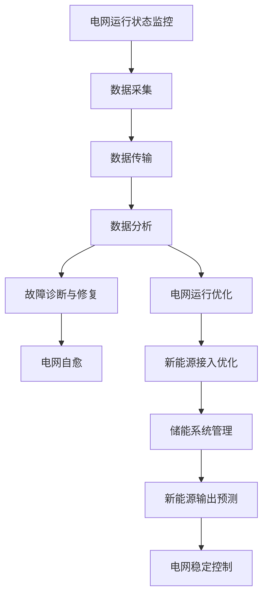

                 

**AI 基础设施的能源革命：智能电网与新能源管理**

**作者：禅与计算机程序设计艺术 / Zen and the Art of Computer Programming**

## 1. 背景介绍

当今世界，能源需求不断增长，传统能源资源有限，且对环境的影响日益严重。与此同时，可再生能源的发展为能源结构转型提供了新的机遇。然而，新能源的不稳定性和间歇性给电网稳定和管理带来了挑战。人工智能（AI）的发展为解决这些问题提供了新的途径，智能电网和新能源管理成为AI在能源领域的关键应用。

## 2. 核心概念与联系

### 2.1 智能电网（Smart Grid）

智能电网是传统电网的升级版，它利用先进的传感器、通信技术和控制系统，实现电网的自动化、互动化和智能化。智能电网的核心是双向通信网络，它可以实时监控电网运行状态，快速发现和修复故障，优化电网运行，提高电网的可靠性和安全性。

### 2.2 新能源管理

新能源管理是指对可再生能源（如风能、太阳能、水能等）的开发、利用和管理。新能源的不稳定性和间歇性给电网稳定和管理带来了挑战，新能源管理的目的是最大化利用新能源，最小化其对电网的影响。

### 2.3 AI 在智能电网和新能源管理中的作用

AI 可以帮助智能电网实现预测性维护、故障诊断和自愈、电网运行优化等功能。在新能源管理方面，AI 可以帮助预测新能源的输出，优化新能源的接入和储能系统的管理。

### 2.4 核心概念原理与架构的 Mermaid 流程图



## 3. 核心算法原理 & 具体操作步骤

### 3.1 算法原理概述

AI 在智能电网和新能源管理中的应用涉及到多种算法，包括预测算法、优化算法、故障诊断算法等。其中，深度学习算法因其强大的学习能力和泛化能力，被广泛应用于这些领域。

### 3.2 算法步骤详解

以新能源输出预测为例，算法步骤如下：

1. 数据预处理：对新能源输出数据进行清洗、缺失值填充、特征工程等预处理。
2. 模型选择：选择合适的深度学习模型，如循环神经网络（RNN）、长短期记忆网络（LSTM）或生成对抗网络（GAN）等。
3. 模型训练：使用预处理后的数据训练模型。
4. 模型评估：使用验证集评估模型的性能。
5. 模型优化：根据评估结果优化模型，如调整超参数、增加模型复杂度等。
6. 预测：使用训练好的模型预测新能源输出。

### 3.3 算法优缺点

深度学习算法优点在于其强大的学习能力和泛化能力，缺点在于其对数据量的要求高，模型训练时间长，且模型解释性差。

### 3.4 算法应用领域

AI 在智能电网和新能源管理中的应用领域包括：

- 电网运行状态预测：预测电网的负载、故障率等。
- 故障诊断：快速发现和修复电网故障。
- 电网运行优化：优化电网的运行，降低能耗和成本。
- 新能源接入优化：优化新能源的接入，最大化利用新能源。
- 储能系统管理：优化储能系统的管理，最大化利用储能系统。
- 新能源输出预测：预测新能源的输出，提高电网稳定性。

## 4. 数学模型和公式 & 详细讲解 & 举例说明

### 4.1 数学模型构建

新能源输出预测的数学模型可以表示为：

$$y = f(x) + \epsilon$$

其中，$y$ 为新能源输出，$x$ 为输入特征，$f$ 为非线性函数，$\epsilon$ 为模型误差。

### 4.2 公式推导过程

深度学习模型的公式推导过程涉及到反向传播算法，这里不再赘述。深度学习模型的训练过程可以表示为：

$$\theta^* = \arg\min_{\theta} \frac{1}{n} \sum_{i=1}^{n} L(y_i, f(x_i; \theta)) + \lambda R(\theta)$$

其中，$\theta$ 为模型参数，$L$ 为损失函数，$R$ 为正则化项，$\lambda$ 为正则化系数。

### 4.3 案例分析与讲解

以太阳能输出预测为例，输入特征$x$ 可以包括太阳辐射强度、温度、湿度、风速等气象数据，输出特征$y$ 为太阳能发电量。模型的训练数据可以来自气象站和太阳能电站的历史数据。

## 5. 项目实践：代码实例和详细解释说明

### 5.1 开发环境搭建

项目开发环境包括 Python、TensorFlow、Keras、NumPy、Pandas、Matplotlib 等。

### 5.2 源代码详细实现

以下是新能源输出预测模型的源代码实现：

```python
import numpy as np
import pandas as pd
import matplotlib.pyplot as plt
import tensorflow as tf
from tensorflow import keras
from sklearn.model_selection import train_test_split
from sklearn.preprocessing import StandardScaler

# 加载数据
data = pd.read_csv('solar_data.csv')
X = data.drop('solar_output', axis=1)
y = data['solar_output']

# 数据预处理
scaler = StandardScaler()
X = scaler.fit_transform(X)

# 数据集分割
X_train, X_test, y_train, y_test = train_test_split(X, y, test_size=0.2, random_state=42)

# 模型构建
model = keras.Sequential([
    keras.layers.Dense(64, activation='relu', input_shape=(X_train.shape[1],)),
    keras.layers.Dense(64, activation='relu'),
    keras.layers.Dense(1)
])

# 模型编译
model.compile(optimizer='adam', loss='mse')

# 模型训练
history = model.fit(X_train, y_train, epochs=100, validation_data=(X_test, y_test))

# 模型评估
loss = model.evaluate(X_test, y_test)
print(f'Test loss: {loss}')

# 模型预测
y_pred = model.predict(X_test)
```

### 5.3 代码解读与分析

代码首先加载数据，然后进行数据预处理，包括缺失值填充、特征工程等。之后，代码使用 TensorFlow 和 Keras 构建、编译和训练模型。最后，代码评估模型的性能，并使用模型进行预测。

### 5.4 运行结果展示

模型的训练过程可以使用 `history.history` 绘制损失函数的变化曲线。预测结果可以使用 `y_test` 和 `y_pred` 绘制预测值和真实值的对比图。

## 6. 实际应用场景

### 6.1 智能电网

AI 在智能电网中的应用包括：

- 电网运行状态预测：预测电网的负载、故障率等，实现预测性维护。
- 故障诊断：快速发现和修复电网故障，实现电网自愈。
- 电网运行优化：优化电网的运行，降低能耗和成本。

### 6.2 新能源管理

AI 在新能源管理中的应用包括：

- 新能源接入优化：优化新能源的接入，最大化利用新能源。
- 储能系统管理：优化储能系统的管理，最大化利用储能系统。
- 新能源输出预测：预测新能源的输出，提高电网稳定性。

### 6.3 未来应用展望

未来，AI 在智能电网和新能源管理中的应用将更加广泛，包括：

- 电网安全防护：使用 AI 监控电网安全，及早发现和预防安全威胁。
- 电网运行控制：使用 AI 实现电网运行的自动控制，提高电网运行的灵活性和可靠性。
- 新能源储能优化：使用 AI 优化新能源储能系统的管理，最大化利用储能系统。

## 7. 工具和资源推荐

### 7.1 学习资源推荐

- 书籍：《人工智能：一种现代方法》作者：斯图尔特·罗素、彼得·诺维格
- 课程：[Stanford University's CS221: Artificial Intelligence: Principles and Techniques](https://online.stanford.edu/courses/cs221-artificial-intelligence-principles-and-techniques)
- 网站：[Towards Data Science](https://towardsdatascience.com/), [KDnuggets](https://www.kdnuggets.com/)

### 7.2 开发工具推荐

- Python：[Anaconda](https://www.anaconda.com/), [PyCharm](https://www.jetbrains.com/pycharm/)
- TensorFlow：[TensorFlow](https://www.tensorflow.org/), [Keras](https://keras.io/)
- 数据库：[PostgreSQL](https://www.postgresql.org/), [MongoDB](https://www.mongodb.com/)

### 7.3 相关论文推荐

- [Deep Learning for Smart Grid: A Review](https://ieeexplore.ieee.org/document/8454464)
- [A Review on Artificial Intelligence Applications in Smart Grid](https://ieeexplore.ieee.org/document/8704414)
- [Renewable Energy Forecasting: A Review of Methods and Applications](https://ieeexplore.ieee.org/document/8487423)

## 8. 总结：未来发展趋势与挑战

### 8.1 研究成果总结

本文介绍了 AI 在智能电网和新能源管理中的应用，包括核心概念、算法原理、数学模型、项目实践等。本文还推荐了相关学习资源、开发工具和论文。

### 8.2 未来发展趋势

未来，AI 在智能电网和新能源管理中的应用将更加广泛和深入，包括电网安全防护、电网运行控制、新能源储能优化等领域。

### 8.3 面临的挑战

AI 在智能电网和新能源管理中的应用面临的挑战包括：

- 数据质量：电网和新能源数据的质量和完整性对 AI 模型的性能有很大影响。
- 模型解释性：深度学习模型的解释性差，给模型的部署和维护带来了挑战。
- 实时性：电网和新能源管理的实时性要求很高，AI 模型需要在实时性和准确性之间做出平衡。

### 8.4 研究展望

未来的研究方向包括：

- 多模式学习：结合多种数据源（如气象数据、电网数据、新能源数据等）进行学习，提高模型的泛化能力。
- 解释性 AI：开发解释性强的 AI 模型，提高模型的可靠性和可维护性。
- 实时 AI：开发实时性高的 AI 模型，满足电网和新能源管理的实时性要求。

## 9. 附录：常见问题与解答

**Q1：AI 在智能电网和新能源管理中的优势是什么？**

**A1：AI 在智能电网和新能源管理中的优势包括：**

- **预测能力**：AI 模型可以预测电网运行状态、新能源输出等，实现预测性维护和电网稳定控制。
- **故障诊断能力**：AI 模型可以快速发现和修复电网故障，实现电网自愈。
- **优化能力**：AI 模型可以优化电网运行、新能源接入和储能系统管理，降低能耗和成本。

**Q2：AI 在智能电网和新能源管理中的挑战是什么？**

**A2：AI 在智能电网和新能源管理中的挑战包括：**

- **数据质量**：电网和新能源数据的质量和完整性对 AI 模型的性能有很大影响。
- **模型解释性**：深度学习模型的解释性差，给模型的部署和维护带来了挑战。
- **实时性**：电网和新能源管理的实时性要求很高，AI 模型需要在实时性和准确性之间做出平衡。

**Q3：AI 在智能电网和新能源管理中的未来发展趋势是什么？**

**A3：未来，AI 在智能电网和新能源管理中的应用将更加广泛和深入，包括电网安全防护、电网运行控制、新能源储能优化等领域。**

**Q4：AI 在智能电网和新能源管理中的研究方向是什么？**

**A4：未来的研究方向包括：**

- **多模式学习**：结合多种数据源进行学习，提高模型的泛化能力。
- **解释性 AI**：开发解释性强的 AI 模型，提高模型的可靠性和可维护性。
- **实时 AI**：开发实时性高的 AI 模型，满足电网和新能源管理的实时性要求。

**Q5：AI 在智能电网和新能源管理中的学习资源、开发工具和论文推荐是什么？**

**A5：学习资源推荐包括：《人工智能：一种现代方法》作者：斯图尔特·罗素、彼得·诺维格，Stanford University's CS221: Artificial Intelligence: Principles and Techniques，Towards Data Science，KDnuggets等。开发工具推荐包括：Python、TensorFlow、Keras、NumPy、Pandas、Matplotlib、Anaconda、PyCharm、PostgreSQL、MongoDB等。论文推荐包括：Deep Learning for Smart Grid: A Review，A Review on Artificial Intelligence Applications in Smart Grid，Renewable Energy Forecasting: A Review of Methods and Applications等。**

## 结束语

本文介绍了 AI 在智能电网和新能源管理中的应用，包括核心概念、算法原理、数学模型、项目实践等。本文还推荐了相关学习资源、开发工具和论文。未来，AI 在智能电网和新能源管理中的应用将更加广泛和深入，包括电网安全防护、电网运行控制、新能源储能优化等领域。未来的研究方向包括：多模式学习、解释性 AI、实时 AI 等。

