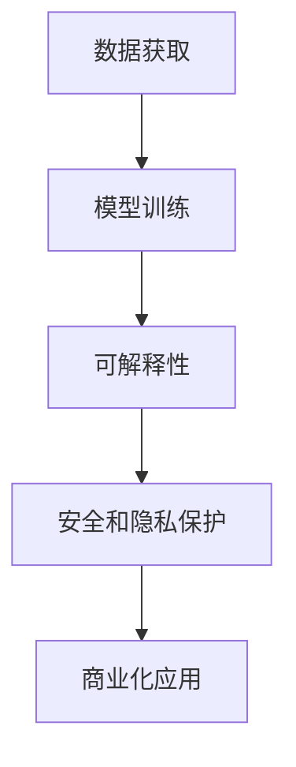

                 

## AI 大模型创业：如何利用市场优势？

> 关键词：大模型、创业、市场优势、商业化、AI 算法、数据策略、模型训练、可解释性、行业应用、未来趋势

## 1. 背景介绍

当前，人工智能（AI）技术正在各行各业中得到广泛应用，其中大模型（Large Language Models）由于其强大的理解、生成和推理能力，已成为AI领域的关键技术之一。然而，如何将大模型商业化并利用市场优势，是AI创业者面临的重大挑战。本文将从技术、数据、商业模式和行业应用等方面，探讨AI大模型创业的关键成功要素。

## 2. 核心概念与联系

### 2.1 大模型的定义与特点

大模型是指具有数十亿甚至数千亿参数的深度学习模型，通过大规模数据集的训练，能够学习并推广到各种任务和领域。大模型的特点包括：

- 理解和生成人类语言的能力
- 广泛的领域知识和推理能力
- 通过 fine-tuning 适应特定任务的能力
- 通过自回归生成模型（如 Transformer）实现的序列理解和生成能力

### 2.2 大模型与商业化的联系

大模型的强大能力使其成为各种商业应用的理想选择，包括客户服务、内容创作、搜索引擎、游戏设计和自动驾驶等。然而，要将大模型商业化，需要解决一系列挑战，包括数据获取、模型训练、可解释性、安全和隐私保护等。



## 3. 核心算法原理 & 具体操作步骤

### 3.1 算法原理概述

大模型的核心算法是自回归生成模型，如 Transformer。Transformer 使用自注意力机制（Self-Attention）和位置编码（Positional Encoding）来处理序列数据，并通过多层Transformer编码器和解码器实现理解和生成任务。

### 3.2 算法步骤详解

1. 数据预处理：对文本数据进行分词、去除停用词、向量化等预处理步骤。
2. 模型构建：构建Transformer模型，包括编码器和解码器，并设置模型参数。
3. 模型训练：使用预处理后的数据集训练模型，并调整学习率、批量大小和优化器等超参数。
4. 模型评估：使用验证集评估模型性能，并调整模型参数以提高性能。
5. 模型部署：将训练好的模型部署到生产环境，并集成到商业应用中。

### 3.3 算法优缺点

优点：

- 理解和生成人类语言的强大能力
- 广泛的领域知识和推理能力
- 通过 fine-tuning 适应特定任务的能力

缺点：

- 训练和推理的高计算成本
- 可解释性和安全隐私保护的挑战
- 过度拟合和泛化能力的平衡

### 3.4 算法应用领域

大模型在各种领域都有广泛的应用，包括：

- 客户服务：提供智能客服和聊天机器人
- 内容创作：生成新闻文章、博客和社交媒体帖子
- 搜索引擎：改进搜索结果和推荐系统
- 游戏设计：创建智能NPC和对话系统
- 自动驾驶：理解和生成路径规划和控制指令

## 4. 数学模型和公式 & 详细讲解 & 举例说明

### 4.1 数学模型构建

大模型的数学模型基于Transformer架构，可以表示为：

$$M(\mathbf{x}) = g(f(\mathbf{x}; \mathbf{W}_1),..., f(\mathbf{x}; \mathbf{W}_N); \mathbf{V})$$

其中，$\mathbf{x}$是输入序列，$\mathbf{W}_1,..., \mathbf{W}_N$是编码器和解码器中的权重参数，$f$是自注意力机制，$g$是输出层，$N$是模型的层数，$\mathbf{V}$是位置编码。

### 4.2 公式推导过程

自注意力机制的推导过程如下：

1. 计算查询（Query）、键（Key）和值（Value）向量：

$$\mathbf{Q} = \mathbf{xW}^Q, \quad \mathbf{K} = \mathbf{xW}^K, \quad \mathbf{V} = \mathbf{xW}^V$$

2. 计算注意力分数：

$$\mathbf{Attention} = \text{softmax}\left(\frac{\mathbf{QK}^T}{\sqrt{d_k}}\right)$$

3. 计算注意力加权值：

$$\mathbf{Output} = \mathbf{AttentionV}$$

### 4.3 案例分析与讲解

例如，在客户服务领域，大模型可以用于构建智能客服系统。输入是客户的查询，输出是相关的回答。通过 fine-tuning 可以将模型适应特定的领域和任务，如金融、电商或医疗保健。

## 5. 项目实践：代码实例和详细解释说明

### 5.1 开发环境搭建

要开发大模型，需要搭建一个强大的开发环境，包括：

- Python 3.8+
- PyTorch 1.8+ 或 TensorFlow 2.5+
- CUDA 11.0+（可选，用于GPU加速）
- Transformers库（Hugging Face）

### 5.2 源代码详细实现

以下是使用Transformers库训练大模型的示例代码：

```python
from transformers import AutoTokenizer, AutoModelForCausalLM, Trainer, TrainingArguments

tokenizer = AutoTokenizer.from_pretrained("t5-base")
model = AutoModelForCausalLM.from_pretrained("t5-base")

training_args = TrainingArguments(
    output_dir="./results",
    num_train_epochs=3,
    per_device_train_batch_size=16,
    per_device_eval_batch_size=64,
    warmup_steps=500,
    weight_decay=0.01,
    logging_dir="./logs",
)

trainer = Trainer(
    model=model,
    args=training_args,
    train_dataset=train_dataset,
    eval_dataset=val_dataset,
)

trainer.train()
```

### 5.3 代码解读与分析

这段代码使用Transformers库训练一个大模型。首先，加载预训练的T5模型和其对应的分词器。然后，设置训练参数，包括训练 epoch 数、批量大小、学习率调整步骤和权重衰减等。最后，使用 Trainer 类训练模型，并指定训练和验证数据集。

### 5.4 运行结果展示

训练完成后，模型的性能可以通过验证集评估，并使用各种指标（如 Perplexity）进行评估。此外，还可以使用生成样本来评估模型的理解和生成能力。

## 6. 实际应用场景

### 6.1 客户服务

大模型可以构建智能客服系统，提供24/7客户支持，并帮助客户解决问题。通过 fine-tuning，模型可以适应特定的领域和任务，如金融、电商或医疗保健。

### 6.2 内容创作

大模型可以生成新闻文章、博客和社交媒体帖子，帮助内容创作者提高生产率和创造力。通过 fine-tuning，模型可以学习特定的写作风格和主题。

### 6.3 未来应用展望

未来，大模型将在更多领域得到应用，包括自动驾驶、游戏设计和虚拟现实等。此外，大模型还将与其他技术（如物联网和区块链）结合，开发出更先进的应用。

## 7. 工具和资源推荐

### 7.1 学习资源推荐

- "Attention is All You Need" 论文：https://arxiv.org/abs/1706.03762
- Hugging Face Transformers库：https://huggingface.co/transformers/
- Fast.ai Practical Deep Learning for Coders：https://course.fast.ai/

### 7.2 开发工具推荐

- Google Colab：https://colab.research.google.com/
- Kaggle Notebooks：https://www.kaggle.com/notebooks
- AWS SageMaker：https://aws.amazon.com/sagemaker/

### 7.3 相关论文推荐

- "Language Models are Few-Shot Learners"：https://arxiv.org/abs/2005.14165
- "T5: Text-to-Text Transfer Transformer"：https://arxiv.org/abs/1910.10683

## 8. 总结：未来发展趋势与挑战

### 8.1 研究成果总结

本文介绍了大模型的定义、特点和商业化的关键成功要素。我们还讨论了大模型的核心算法原理、数学模型和公式，并提供了项目实践和实际应用场景的示例。

### 8.2 未来发展趋势

未来，大模型将继续发展，并与其他技术结合，开发出更先进的应用。此外，大模型的可解释性和安全隐私保护也将得到改进，以满足监管要求和提高用户信任。

### 8.3 面临的挑战

大模型面临的挑战包括：

- 训练和推理的高计算成本
- 可解释性和安全隐私保护的挑战
- 过度拟合和泛化能力的平衡

### 8.4 研究展望

未来的研究将关注大模型的可解释性、安全隐私保护和泛化能力。此外，研究人员还将探索大模型与其他技术（如物联网和区块链）的结合，开发出更先进的应用。

## 9. 附录：常见问题与解答

**Q1：大模型的优势是什么？**

A1：大模型具有理解和生成人类语言的强大能力，广泛的领域知识和推理能力，以及通过 fine-tuning 适应特定任务的能力。

**Q2：大模型的缺点是什么？**

A2：大模型的缺点包括训练和推理的高计算成本，可解释性和安全隐私保护的挑战，以及过度拟合和泛化能力的平衡。

**Q3：大模型有哪些实际应用场景？**

A3：大模型在客户服务、内容创作、搜索引擎、游戏设计和自动驾驶等领域都有广泛的应用。

---

作者：禅与计算机程序设计艺术 / Zen and the Art of Computer Programming

