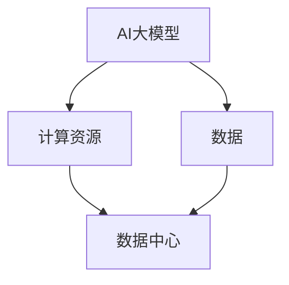

                 

**AI 大模型应用数据中心建设：数据中心技术创新**

**作者：禅与计算机程序设计艺术 / Zen and the Art of Computer Programming**

## 1. 背景介绍

随着人工智能（AI）的飞速发展，大模型（Large Language Models）已成为AI领域的关键驱动因素之一。这些模型需要大量的计算资源和数据来训练和部署，这对数据中心的建设和运维提出了新的挑战。本文将探讨AI大模型应用数据中心建设的技术创新，帮助读者理解如何构建高效、可扩展的数据中心以支持大模型的应用。

## 2. 核心概念与联系

### 2.1 AI大模型

AI大模型是指具有数十亿甚至数千亿参数的模型，能够理解、生成和解释人类语言。它们需要大量的计算资源和数据来训练，对数据中心的要求很高。

### 2.2 数据中心

数据中心是存储、处理和分发数据的物理设施。它由服务器、存储设备、网络设备和电源系统组成，为大模型的训练和部署提供计算资源。

### 2.3 AI大模型与数据中心的联系

AI大模型需要大量的计算资源和数据，数据中心提供了这些资源。数据中心的设计和运维直接影响大模型的训练和部署效率。



## 3. 核心算法原理 & 具体操作步骤

### 3.1 算法原理概述

大模型的训练和部署涉及到多种算法，包括但不限于：

- **梯度下降算法（Gradient Descent）**：用于优化模型参数，使其逼近最优解。
- **反向传播算法（Backpropagation）**：用于计算模型参数的梯度，从而更新参数。
- **注意力机制（Attention Mechanism）**：用于模型理解和生成文本的关键部分。

### 3.2 算法步骤详解

1. **数据预处理**：清洗、标记和分割数据集。
2. **模型构建**：选择合适的模型架构，初始化模型参数。
3. **训练**：使用梯度下降算法和反向传播算法更新模型参数，使其逼近最优解。
4. **评估**：使用验证集评估模型性能，调整超参数。
5. **部署**：将训练好的模型部署到生产环境。

### 3.3 算法优缺点

**优点**：

- 大模型能够理解和生成人类语言，在自然语言处理（NLP）领域取得了显著的成就。
- 它们可以在各种任务上进行零样本学习，具有很强的泛化能力。

**缺点**：

- 大模型需要大量的计算资源和数据来训练，对数据中心的要求很高。
- 它们存在过拟合、偏见和解释性差等问题。

### 3.4 算法应用领域

大模型在NLP领域有着广泛的应用，包括但不限于：

- 文本生成：新闻写作、小说创作等。
- 文本理解：情感分析、实体识别等。
- 问答系统：信息检索、知识图谱等。

## 4. 数学模型和公式 & 详细讲解 & 举例说明

### 4.1 数学模型构建

大模型通常是基于神经网络的，可以表示为：

$$y = f(x; \theta)$$

其中，$x$是输入，$y$是输出，$f$是模型函数，$theta$是模型参数。

### 4.2 公式推导过程

模型参数的更新可以使用梯度下降算法：

$$\theta_{t+1} = \theta_t - \eta \nabla L(\theta_t)$$

其中，$\eta$是学习率，$L$是损失函数，$\nabla$表示梯度。

### 4.3 案例分析与讲解

例如，在训练一个简单的线性回归模型时：

$$y = \theta_1x + \theta_2$$

损失函数可以表示为：

$$L(\theta) = \frac{1}{2m}\sum_{i=1}^{m}(h_\theta(x^{(i)}) - y^{(i)})^2$$

其中，$m$是训练样本数，$h_\theta(x)$是模型的预测输出。

## 5. 项目实践：代码实例和详细解释说明

### 5.1 开发环境搭建

- **硬件环境**：高性能服务器，配备GPU加速。
- **软件环境**：Python、PyTorch或TensorFlow等深度学习框架。

### 5.2 源代码详细实现

以下是一个简单的线性回归模型的实现代码（使用PyTorch）：

```python
import torch
import torch.nn as nn
import torch.optim as optim

# 定义模型
class LinearRegression(nn.Module):
    def __init__(self, input_size, output_size):
        super(LinearRegression, self).__init__()
        self.linear = nn.Linear(input_size, output_size)

    def forward(self, x):
        out = self.linear(x)
        return out

# 定义损失函数和优化器
criterion = nn.MSELoss()
optimizer = optim.SGD(model.parameters(), lr=0.01)

# 训练模型
for epoch in range(100):
    optimizer.zero_grad()
    outputs = model(inputs)
    loss = criterion(outputs, labels)
    loss.backward()
    optimizer.step()
```

### 5.3 代码解读与分析

- 定义了一个简单的线性回归模型，包含一个线性层。
- 定义了均方误差（MSE）损失函数和随机梯度下降（SGD）优化器。
- 使用反向传播算法更新模型参数。

### 5.4 运行结果展示

在训练100个epoch后，模型的损失值会下降到一个很小的值，表明模型已经学习到了数据的规律。

## 6. 实际应用场景

### 6.1 当前应用

大模型在各种NLP任务上都有着广泛的应用，包括但不限于：

- **搜索引擎**：改善搜索结果的相关性。
- **客服机器人**：提供24/7的客户服务。
- **内容创作**：自动生成新闻、小说等。

### 6.2 未来应用展望

未来，大模型有望在更多领域得到应用，包括但不限于：

- **自动驾驶**：理解和生成驾驶指令。
- **医疗**：帮助医生诊断病情。
- **金融**：风险预测和决策支持。

## 7. 工具和资源推荐

### 7.1 学习资源推荐

- **书籍**：《深度学习》作者：Ian Goodfellow、Yoshua Bengio、Aaron Courville
- **课程**：斯坦福大学的《机器学习》课程（CS229）

### 7.2 开发工具推荐

- **PyTorch**：一个强大的深度学习框架。
- **TensorFlow**：一个流行的深度学习框架。

### 7.3 相关论文推荐

- **Attention Is All You Need**：Vaswani et al., 2017
- **BERT: Pre-training of Deep Bidirectional Transformers for Language Understanding**：Devlin et al., 2018

## 8. 总结：未来发展趋势与挑战

### 8.1 研究成果总结

本文介绍了AI大模型的训练和部署需要大量的计算资源和数据，数据中心在其中起着关键作用。我们还介绍了大模型的算法原理和数学模型，并提供了一个简单的项目实践。

### 8.2 未来发展趋势

未来，大模型有望在更多领域得到应用，对数据中心的要求也会越来越高。数据中心需要不断创新，以满足大模型的需求。

### 8.3 面临的挑战

**挑战1**：大模型需要大量的计算资源和数据，对数据中心的要求很高。

**挑战2**：大模型存在过拟合、偏见和解释性差等问题，需要不断改进模型架构和训练方法。

**挑战3**：大模型的部署需要考虑安全和隐私问题，需要开发相关的技术和标准。

### 8.4 研究展望

未来的研究方向包括但不限于：

- **模型压缩**：减小模型的参数量，降低计算和存储需求。
- **模型联邦学习**：在保护数据隐私的前提下，共享模型参数。
- **模型安全**：保护模型免受攻击，保护用户隐私。

## 9. 附录：常见问题与解答

**Q1：大模型需要多少计算资源？**

**A1**：这取决于模型的大小和训练的需求。通常，大模型需要数百甚至数千个GPU来训练。

**Q2：大模型的训练需要多长时间？**

**A2**：这取决于模型的大小和训练的需求。通常，大模型的训练需要数天甚至数周的时间。

**Q3：大模型的部署需要考虑哪些问题？**

**A3**：大模型的部署需要考虑安全和隐私问题。需要开发相关的技术和标准，保护模型免受攻击，保护用户隐私。

**作者署名：作者：禅与计算机程序设计艺术 / Zen and the Art of Computer Programming**

