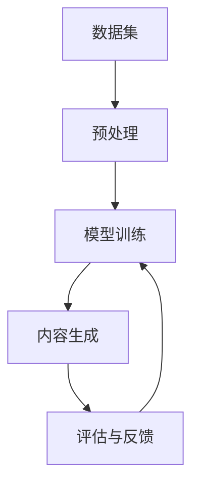

                 

**AIGC：内容生成的核心应用**

**作者：禅与计算机程序设计艺术 / Zen and the Art of Computer Programming**

## 1. 背景介绍

人工智能驱动的内容生成（AIGC）是当今数字时代的关键技术之一，它正在各行各业引发革命。从文字到图像，再到音乐和视频，AIGC正在改变我们创造、分享和消费数字内容的方式。本文将深入探讨AIGC的核心应用，从其背景到算法原理，再到实际应用场景和未来展望。

## 2. 核心概念与联系

AIGC的核心是利用人工智能技术，如深度学习，来生成新的、原创的数字内容。这些技术可以学习和模仿人类创作的风格和模式，从而生成新的、独特的内容。下图是AIGC核心概念的Mermaid流程图：



## 3. 核心算法原理 & 具体操作步骤

### 3.1 算法原理概述

AIGC的核心是生成对抗网络（GAN）和变分自编码器（VAE）等深度学习算法。这些算法可以学习和模仿人类创作的风格和模式，从而生成新的、独特的内容。

### 3.2 算法步骤详解

1. **数据预处理**：收集和预处理相关领域的数据集，如图像、文本或音乐。
2. **模型训练**：使用深度学习算法（如GAN或VAE）训练模型，使其学习数据集的特征和模式。
3. **内容生成**：使用训练好的模型生成新的、独特的内容。
4. **评估与反馈**：评估生成的内容，并根据需要调整模型或提供反馈。

### 3.3 算法优缺点

**优点**：AIGC可以生成新颖独特的内容，节省人力成本，并扩展创作的可能性。

**缺点**：AIGC生成的内容可能缺乏人类创作的深度和情感，且模型可能生成不真实或不相关的内容。

### 3.4 算法应用领域

AIGC正在各行各业得到应用，包括艺术、音乐、电影、游戏、新闻和教育等。

## 4. 数学模型和公式 & 详细讲解 & 举例说明

### 4.1 数学模型构建

AIGC的数学模型通常基于深度学习的变分推断原理。给定数据分布$p_{data}(x)$，我们想学习其表示$q(z|x)$。我们的目标是最小化$KL$散度$D_{KL}(q(z|x) || p(z|x))$：

$$D_{KL}(q(z|x) || p(z|x)) = \mathbb{E}_{q(z|x)}[\log q(z|x) - \log p(z|x)]$$

### 4.2 公式推导过程

我们可以使用重参数化技巧将$q(z|x)$表示为高斯分布，并使用改进的对数似然估计（ELBO）来近似$D_{KL}$：

$$L(\theta, \phi; x) = \mathbb{E}_{q_\phi(z|x)}[\log p_\theta(x|z)] - D_{KL}(q_\phi(z|x) || p(z))$$

其中$\theta$和$\phi$分别是生成模型$p_\theta(x|z)$和分布$q_\phi(z|x)$的参数。

### 4.3 案例分析与讲解

例如，在文本生成任务中，$x$是一段文本，$z$是文本的表示，我们想学习$q(z|x)$并生成新的文本$p_\theta(x|z)$。

## 5. 项目实践：代码实例和详细解释说明

### 5.1 开发环境搭建

我们将使用Python和PyTorch来实现一个简单的文本生成模型。您需要安装Python、PyTorch、NumPy和Matplotlib。

### 5.2 源代码详细实现

```python
import torch
import torch.nn as nn
import torch.optim as optim

# 定义编码器和解码器
class Encoder(nn.Module):
    #...

class Decoder(nn.Module):
    #...

# 初始化模型、优化器和损失函数
model = Encoder().to(device)
optimizer = optim.Adam(model.parameters(), lr=1e-3)
criterion = nn.CrossEntropyLoss()

# 训练模型
for epoch in range(num_epochs):
    for i, (x, y) in enumerate(train_loader):
        #...

        optimizer.zero_grad()
        loss = criterion(output, y)
        loss.backward()
        optimizer.step()

        if i % 100 == 0:
            print(f'Epoch: {epoch}, Loss: {loss.item():.4f}')
```

### 5.3 代码解读与分析

我们定义了编码器和解码器，并使用Adam优化器和交叉熵损失函数来训练模型。在训练循环中，我们前向传播、计算损失、反向传播和更新模型参数。

### 5.4 运行结果展示

在训练完成后，我们可以使用生成的模型来生成新的文本。

## 6. 实际应用场景

### 6.1 当前应用

AIGC正在各行各业得到应用，包括：

- **艺术**：生成新颖独特的图像和音乐。
- **新闻**：自动生成新闻标题和简讯。
- **游戏**：生成新的游戏关卡和角色。

### 6.2 未来应用展望

未来，AIGC可能会应用于：

- **虚拟现实**：生成虚拟环境和角色。
- **教育**：个性化学习内容和互动教程。
- **医疗**：生成医学图像和药物设计。

## 7. 工具和资源推荐

### 7.1 学习资源推荐

- **书籍**："Generative Deep Learning" by David Foster
- **课程**：Stanford CS224n：Natural Language Processing with Deep Learning

### 7.2 开发工具推荐

- **框架**：PyTorch、TensorFlow
- **库**：Hugging Face Transformers、Gensim

### 7.3 相关论文推荐

- "Generative Adversarial Networks" by Goodfellow et al.
- "Variational Autoencoders" by Kingma and Welling

## 8. 总结：未来发展趋势与挑战

### 8.1 研究成果总结

AIGC已经取得了显著的成果，从图像和音乐到文本和视频，AIGC正在改变我们创造、分享和消费数字内容的方式。

### 8.2 未来发展趋势

未来，AIGC将继续发展，并可能应用于更多领域，如虚拟现实和医疗。我们也将看到AIGC与其他技术（如区块链）的结合。

### 8.3 面临的挑战

AIGC面临的挑战包括：

- **真实性**：生成的内容可能缺乏真实性和人类创作的深度。
- **控制**：模型可能生成不相关或不真实的内容。
- **伦理**：AIGC可能会导致版权和伦理问题。

### 8.4 研究展望

未来的研究将关注提高AIGC的真实性和控制，并探索AIGC在新领域的应用。

## 9. 附录：常见问题与解答

**Q：AIGC生成的内容是否真实？**

**A**：AIGC生成的内容可能缺乏真实性和人类创作的深度。未来的研究将关注提高AIGC的真实性。

**Q：AIGC是否会取代人类创作者？**

**A**：AIGC不会取代人类创作者，而是为他们提供新的工具和可能性。人类创作者仍然是创作过程的关键部分。

**Q：AIGC是否会导致版权问题？**

**A**：是的，AIGC可能会导致版权和伦理问题。未来的研究将关注这些挑战。

**作者：禅与计算机程序设计艺术 / Zen and the Art of Computer Programming**

