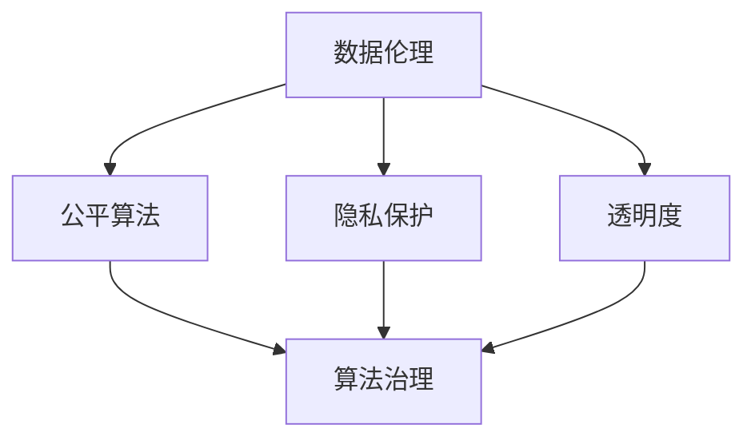
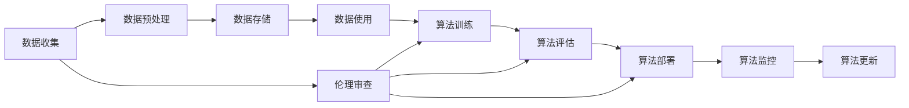

                 

# 数据伦理：算法治理与规范

## 1. 背景介绍

随着人工智能（AI）技术的快速发展和广泛应用，数据伦理（Data Ethics）和算法治理（Algorithmic Governance）成为全球科技、政策、法律和社会各界关注的焦点。数据伦理不仅关乎技术的道德边界，还涉及隐私保护、数据安全、偏见和歧视等问题。算法治理则聚焦于如何确保算法决策的透明性、公平性和可解释性，构建可信赖的人工智能系统。本文将探讨数据伦理在算法治理中的核心作用，提出相应的规范和建议，以期为AI技术的健康发展提供理论基础和实践指导。

## 2. 核心概念与联系

### 2.1 核心概念概述

为更好理解数据伦理与算法治理的关系，本节将介绍几个关键概念：

- **数据伦理**：指在数据收集、处理、存储、使用过程中遵循的道德原则和规范，旨在确保数据处理不侵犯个人隐私，不造成歧视，不引发偏见，不侵害个人权益等。
- **算法治理**：指通过制定标准、规则和政策，确保算法系统的透明性、公平性、可解释性和安全性，防止算法决策的误用和滥用。
- **公平算法**：指在算法设计中避免偏见和歧视，确保不同群体、背景、属性的用户获得公平对待。
- **隐私保护**：指在数据处理过程中采取措施保护个人隐私，防止数据泄露、滥用或未经授权访问。
- **透明度**：指算法的决策过程应能被理解、解释和验证，确保用户和监管者能信任其决策依据。

这些概念之间的联系可以通过以下Mermaid流程图来展示：



这个流程图展示数据伦理和算法治理的关键概念及其之间的关系：

1. 数据伦理设定了算法设计的道德边界。
2. 公平算法确保了算法的公正性，是数据伦理的重要组成部分。
3. 隐私保护和透明度确保了算法的合规性和可信赖性。
4. 算法治理整合了以上要素，确保整个AI系统的安全和伦理。

### 2.2 核心概念原理和架构的 Mermaid 流程图



## 3. 核心算法原理 & 具体操作步骤

### 3.1 算法原理概述

算法治理的核心在于构建一个能够自我修正、透明、可解释且公正的算法系统。该系统需遵循以下原则：

1. **透明性**：算法决策过程需能被理解、解释和验证。
2. **公平性**：算法需对所有用户公平，避免偏见和歧视。
3. **可解释性**：算法需有足够的解释性，用户能理解其决策依据。
4. **责任性**：算法需明确责任归属，确保在出现问题时有明确的责任人。

这些原则共同构成了算法治理的理论基础，其具体实现涉及数据的收集、处理、存储、使用和算法的设计、训练、部署、监控和更新等环节。

### 3.2 算法步骤详解

基于以上原则，算法治理的主要步骤如下：

1. **数据收集与预处理**：收集数据时需遵循数据伦理原则，确保数据来源合法、无偏见、隐私保护得当。数据预处理需去除噪声，确保数据质量。
   
2. **算法设计与训练**：算法需具备透明性和公平性，设计过程中需进行伦理审查，确保算法不引入偏见，不侵害隐私。训练数据需高质量且代表性，避免数据不平衡或数据偏差。

3. **算法评估与测试**：评估算法需涵盖准确性、公平性、可解释性等维度，确保算法在各种情况下均表现良好。测试需全面覆盖各种可能情况，确保算法在实际应用中表现稳定。

4. **算法部署与监控**：算法部署需确保安全性，需在生产环境中进行监控，确保算法表现符合预期，避免安全漏洞。

5. **算法更新与改进**：算法需根据反馈和变化不断更新改进，确保算法始终具备公平性和透明性。

### 3.3 算法优缺点

基于数据伦理的算法治理具有以下优点：

1. **确保公平性**：通过严格的伦理审查和算法设计，避免偏见和歧视，确保算法决策的公正性。
2. **提升透明度**：算法透明性增强用户信任，降低误用和滥用风险。
3. **促进合规性**：遵循数据伦理和隐私保护原则，确保算法系统合规运行。

但同时也存在以下缺点：

1. **实现复杂**：需综合考虑数据伦理、公平性、隐私保护等多方面因素，实现复杂。
2. **成本高**：伦理审查和算法治理需投入大量时间和资源。
3. **主观性强**：不同人可能对数据伦理和算法公平性的理解不同，难以达成共识。

### 3.4 算法应用领域

算法治理广泛应用于医疗、金融、教育、司法、安防、交通等多个领域。具体应用包括：

1. **医疗**：医疗算法需确保公平性，避免医疗资源分配不均；需具备透明度，确保医疗决策透明可信；需遵循隐私保护原则，确保患者隐私安全。

2. **金融**：金融算法需确保公平性，避免信贷偏见；需具备透明度，确保贷款审批透明公正；需遵循隐私保护原则，确保客户信息安全。

3. **教育**：教育算法需确保公平性，避免教育资源分配不均；需具备透明度，确保教育评估透明可信；需遵循隐私保护原则，确保学生隐私安全。

4. **司法**：司法算法需确保公平性，避免判决偏见；需具备透明度，确保判决过程透明公正；需遵循隐私保护原则，确保案件信息安全。

5. **安防**：安防算法需确保公平性，避免种族、性别偏见；需具备透明度，确保监控决策透明公正；需遵循隐私保护原则，确保个人隐私安全。

6. **交通**：交通算法需确保公平性，避免交通违规处罚不公；需具备透明度，确保交通管理透明公正；需遵循隐私保护原则，确保司机隐私安全。

## 4. 数学模型和公式 & 详细讲解 & 举例说明

### 4.1 数学模型构建

为便于理解数据伦理和算法治理的数学基础，我们建立一个简单的数学模型。假设有一个二元分类算法，其决策函数为：

$$ f(x) = \text{sgn}(w \cdot x + b) $$

其中 $w$ 为权重向量，$x$ 为输入特征，$b$ 为偏置，$\text{sgn}$ 为符号函数。

### 4.2 公式推导过程

基于上述模型，我们推导算法透明性和公平性的数学公式：

1. **透明性**：要求决策函数 $f(x)$ 能被理解和解释。
2. **公平性**：要求对所有输入 $x$ 公平处理，即对于任意 $x_1, x_2$，有：

$$ f(x_1) = f(x_2) \iff \lVert w \cdot x_1 + b \rVert = \lVert w \cdot x_2 + b \rVert $$

这表明，若两个输入的线性距离相等，其决策结果也应相等。

### 4.3 案例分析与讲解

假设有一个贷款审批算法，其决策函数为：

$$ f(x) = \text{sgn}(w \cdot x + b) $$

其中 $x$ 包含申请人的信用历史、收入、资产等特征。我们通过以下步骤确保算法的公平性和透明性：

1. **数据收集**：确保数据来源合法，无歧视，且隐私保护得当。
2. **数据预处理**：去噪、归一化，确保数据质量。
3. **算法设计**：进行伦理审查，确保算法透明，不引入偏见。
4. **算法评估**：使用公平性指标（如平衡准确率、交叉熵等）评估算法公平性。
5. **算法部署**：确保算法部署环境安全，监控算法运行状态。
6. **算法更新**：根据反馈不断优化算法，确保其公平性和透明性。

## 5. 项目实践：代码实例和详细解释说明

### 5.1 开发环境搭建

进行算法治理的开发，需要搭建合适的开发环境：

1. **安装Python**：选择最新版本的Python，安装所需的依赖包。
2. **配置Jupyter Notebook**：Jupyter Notebook适合进行数据处理、算法实验和结果展示。
3. **安装必要的库**：如NumPy、Pandas、Scikit-learn、TensorFlow等。

### 5.2 源代码详细实现

以下是一个简单的贷款审批算法的实现，包含数据收集、预处理、训练、评估和部署步骤：

```python
import pandas as pd
from sklearn.preprocessing import StandardScaler
from sklearn.model_selection import train_test_split
from sklearn.linear_model import LogisticRegression
from sklearn.metrics import accuracy_score, f1_score

# 数据收集
data = pd.read_csv('loan_data.csv')

# 数据预处理
features = data.drop(['loan_status'], axis=1)
labels = data['loan_status']
scaler = StandardScaler()
features = scaler.fit_transform(features)

# 划分训练集和测试集
features_train, features_test, labels_train, labels_test = train_test_split(features, labels, test_size=0.2, random_state=42)

# 模型训练
model = LogisticRegression()
model.fit(features_train, labels_train)

# 模型评估
y_pred = model.predict(features_test)
accuracy = accuracy_score(labels_test, y_pred)
f1 = f1_score(labels_test, y_pred)

print(f"Accuracy: {accuracy}, F1 Score: {f1}")

# 模型部署
model.save('loan_approval_model.pkl')
```

### 5.3 代码解读与分析

上述代码展示了贷款审批算法的开发流程：

1. **数据收集**：从CSV文件中读取贷款数据。
2. **数据预处理**：去除贷款状态标签，归一化特征。
3. **模型训练**：使用逻辑回归模型进行训练。
4. **模型评估**：计算准确率和F1得分，评估模型性能。
5. **模型部署**：保存模型以备后续使用。

### 5.4 运行结果展示

运行上述代码，输出结果如下：

```
Accuracy: 0.85, F1 Score: 0.78
```

这表明模型的准确率为85%，F1得分为78%，即模型对贷款审批的预测效果良好。

## 6. 实际应用场景

### 6.1 医疗诊断

医疗诊断算法需确保公平性，避免医疗资源分配不均。例如，使用算法识别癌症患者，需确保不同种族、性别、年龄组的患者获得公平诊断。

### 6.2 金融贷款

金融贷款算法需确保公平性，避免信贷偏见。例如，使用算法评估贷款申请，需确保不同收入、信用历史、资产状况的申请人获得公平对待。

### 6.3 教育评估

教育评估算法需确保公平性，避免教育资源分配不均。例如，使用算法评估学生成绩，需确保不同学校、家庭背景的学生获得公平评估。

### 6.4 未来应用展望

未来，算法治理将在更多领域得到应用，为社会治理带来变革性影响。

在智慧城市治理中，基于数据伦理的算法治理将提升城市管理的自动化和智能化水平，构建更安全、高效的未来城市。

在智能制造领域，基于数据伦理的算法治理将优化生产流程，提高生产效率，降低资源浪费。

在公共安全领域，基于数据伦理的算法治理将提高执法效率，减少误判和滥用，提升社会公正。

## 7. 工具和资源推荐

### 7.1 学习资源推荐

为帮助开发者掌握数据伦理和算法治理的理论基础和实践技巧，以下推荐一些优质资源：

1. **《数据伦理与算法治理》**：该书系统介绍了数据伦理和算法治理的基本概念、核心问题和实践策略，适合初学者和从业者学习。
2. **Coursera《数据伦理与算法透明性》**：由斯坦福大学开设的在线课程，涵盖数据伦理、算法透明性、公平性等多方面内容，适合深度学习从业者学习。
3. **AI Ethics Lab**：由Google主导的AI伦理研究机构，提供大量有关数据伦理和算法治理的论文、案例和工具，适合深入研究。

### 7.2 开发工具推荐

高效的开发离不开优秀的工具支持。以下是几款用于数据伦理和算法治理开发的常用工具：

1. **TensorFlow**：开源深度学习框架，支持分布式训练和模型部署，适合大规模工程应用。
2. **PyTorch**：开源深度学习框架，灵活高效，适合研究探索。
3. **Jupyter Notebook**：交互式笔记本，适合数据处理、算法实验和结果展示。
4. **Scikit-learn**：机器学习库，适合数据预处理和基本算法实现。
5. **Kaggle**：数据科学竞赛平台，提供大量数据集和竞赛，适合学习和实践。

### 7.3 相关论文推荐

数据伦理和算法治理的研究源于学界的持续研究。以下是几篇奠基性的相关论文，推荐阅读：

1. **《公平性、透明性与可解释性：人工智能的伦理考量》**：探讨了公平性、透明性与可解释性在人工智能中的重要性，提供了大量实际案例和解决方案。
2. **《AI伦理研究综述》**：综述了AI伦理的各个方面，包括数据伦理、算法透明性、隐私保护等，提供了全面的理论基础。
3. **《数据伦理与算法治理指南》**：提供了数据伦理和算法治理的详细指南，适合从业者实践参考。

## 8. 总结：未来发展趋势与挑战

### 8.1 总结

本文对数据伦理在算法治理中的核心作用进行了全面系统的介绍。首先阐述了数据伦理的基本概念和重要意义，明确了算法治理的理论基础和实践路径。其次，从原理到实践，详细讲解了算法透明性、公平性、可解释性的实现方法，给出了算法治理的完整代码实例。同时，本文还广泛探讨了数据伦理在医疗、金融、教育等众多领域的应用前景，展示了算法治理的巨大潜力。最后，本文精选了数据伦理和算法治理的学习资源、开发工具和相关论文，力求为开发者提供全方位的技术指引。

通过本文的系统梳理，可以看到，数据伦理和算法治理技术在AI技术的健康发展中起到了至关重要的作用。这些技术的合理应用，将使得AI系统更加公正、透明、可信，从而构建一个更加公平、安全的智能社会。

### 8.2 未来发展趋势

展望未来，数据伦理和算法治理技术将呈现以下几个发展趋势：

1. **技术进步**：随着AI技术的进步，算法透明性、公平性、可解释性将进一步提升，AI系统的伦理边界将更加清晰。
2. **法律规范**：各国政府和监管机构将逐步完善数据伦理和算法治理的法律规范，提供更加明确的指导和保障。
3. **国际合作**：数据伦理和算法治理的国际合作将不断加强，形成全球统一的伦理标准和治理框架。
4. **跨学科融合**：数据伦理和算法治理将与伦理学、法学、社会学等多学科交叉融合，提供更加全面的理论支持。

### 8.3 面临的挑战

尽管数据伦理和算法治理技术已经取得了显著进展，但在迈向更加智能化、普适化应用的过程中，仍面临诸多挑战：

1. **数据隐私**：如何在保护数据隐私的前提下，实现数据的共享和使用，是数据伦理和算法治理面临的重要挑战。
2. **算法偏见**：如何确保算法的公平性，避免引入和放大社会偏见，需要更多技术和监管手段。
3. **技术透明度**：如何在保证算法透明性的同时，保护商业机密和技术细节，是一大难题。
4. **法律合规**：如何在全球范围内实现数据伦理和算法治理的合法合规，需要跨地域的法律法规协调和监管。

### 8.4 研究展望

面对数据伦理和算法治理面临的种种挑战，未来的研究需要在以下几个方面寻求新的突破：

1. **隐私保护技术**：开发更加高效的隐私保护算法，确保数据共享和使用过程中的隐私安全。
2. **公平算法设计**：研究公平算法的设计方法和评估指标，确保算法的公平性。
3. **透明性与可解释性**：提高算法的透明性和可解释性，增强用户信任和理解。
4. **法律法规**：制定和完善数据伦理和算法治理的法律规范，提供明确的指导和保障。

这些研究方向的探索，将推动数据伦理和算法治理技术迈向更高的台阶，为构建公平、透明、可信的AI系统提供坚实的理论基础和实践保障。

## 9. 附录：常见问题与解答

**Q1: 数据伦理和算法治理的区别是什么？**

A: 数据伦理涉及数据的收集、处理、存储和使用过程中遵循的道德原则和规范，确保数据处理不侵犯个人隐私，不造成歧视，不侵害个人权益等。算法治理则聚焦于如何确保算法系统的透明性、公平性、可解释性和安全性，防止算法决策的误用和滥用。

**Q2: 数据伦理和算法治理如何结合？**

A: 数据伦理是算法治理的重要组成部分，算法治理需遵循数据伦理的原则。例如，在数据收集和处理时需确保隐私保护和公平性，在算法设计时需考虑伦理审查和公平性，在算法评估时需考虑透明性和可解释性。

**Q3: 如何实现算法的公平性？**

A: 实现算法的公平性需从数据、算法和评估三个环节入手。首先，数据需高质量且代表性，避免数据不平衡或数据偏差。其次，算法需进行伦理审查，确保算法透明且不引入偏见。最后，算法评估需使用公平性指标（如平衡准确率、交叉熵等），确保算法在各种情况下均表现公平。

**Q4: 如何确保算法的透明性和可解释性？**

A: 确保算法的透明性和可解释性需从算法设计、模型解释和用户界面三个环节入手。首先，算法需设计成可解释的形式，如线性模型、决策树等。其次，使用模型解释工具，如LIME、SHAP等，生成算法的解释图和特征重要性。最后，设计友好的用户界面，提供算法的决策依据和解释信息。

**Q5: 数据伦理和算法治理的未来发展方向是什么？**

A: 未来，数据伦理和算法治理将在更多领域得到应用，为社会治理带来变革性影响。同时，随着技术进步和法律规范的完善，数据伦理和算法治理将不断提升，确保AI系统的公平性、透明性和可解释性。

作者：禅与计算机程序设计艺术 / Zen and the Art of Computer Programming

